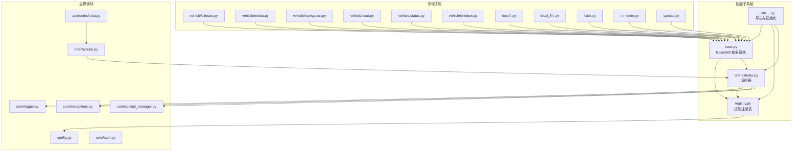
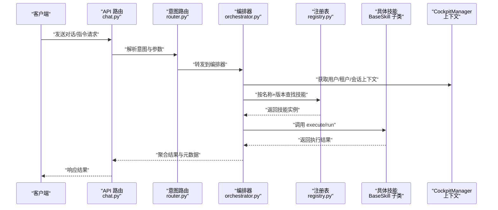
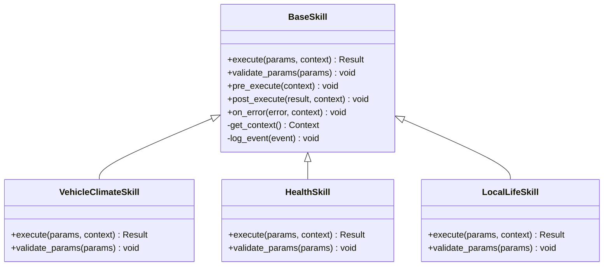
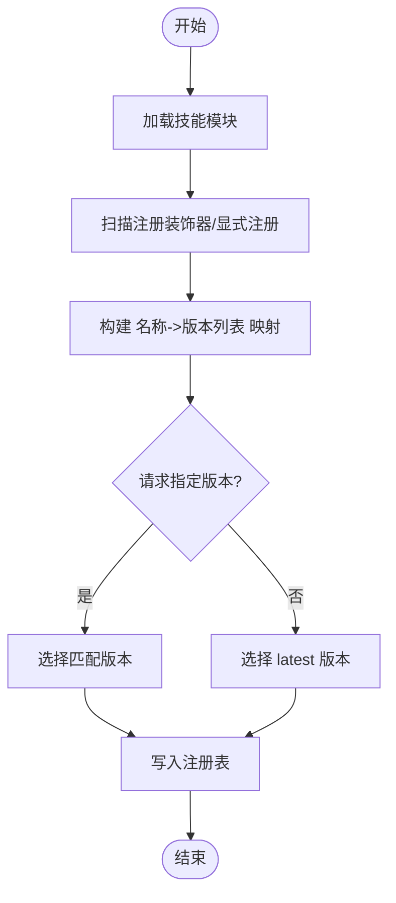
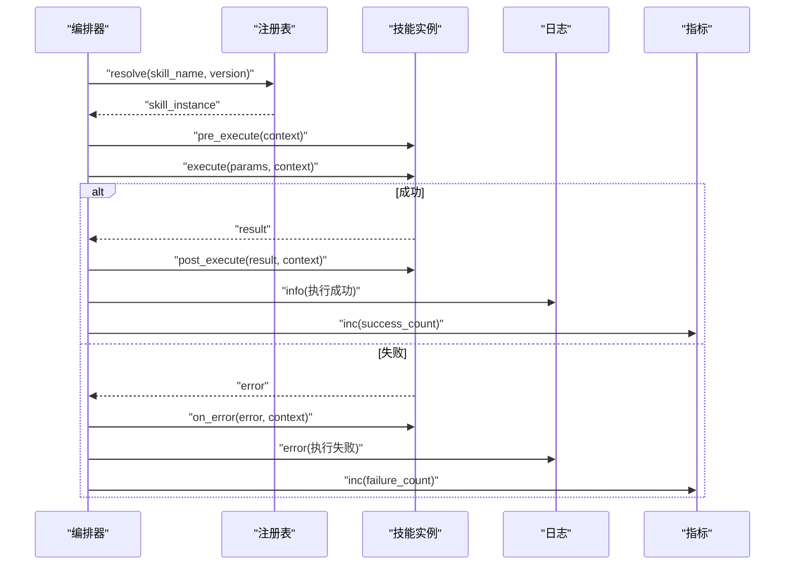
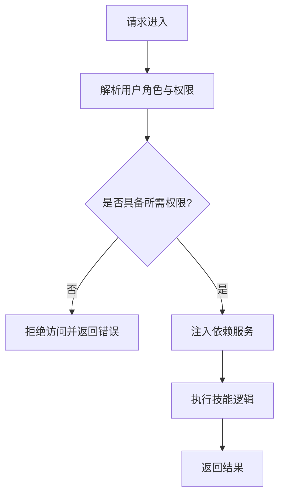
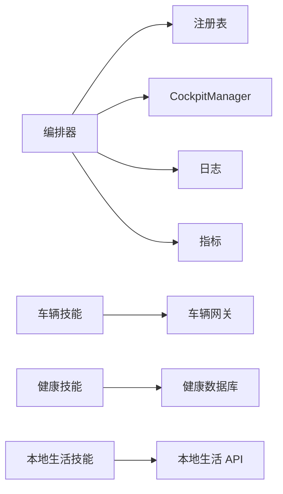

# 自定义技能开发

<cite>
**本文引用的文件**   
- [backend_design/nexus/skills/base.py](file://backend_design/nexus/skills/base.py)
- [backend_design/nexus/skills/registry.py](file://backend_design/nexus/skills/registry.py)
- [backend_design/nexus/skills/orchestrator.py](file://backend_design/nexus/skills/orchestrator.py)
- [backend_design/nexus/skills/__init__.py](file://backend_design/nexus/skills/__init__.py)
- [backend_design/nexus/skills/vehicle/climate.py](file://backend_design/nexus/skills/vehicle/climate.py)
- [backend_design/nexus/skills/vehicle/media.py](file://backend_design/nexus/skills/vehicle/media.py)
- [backend_design/nexus/skills/vehicle/navigation.py](file://backend_design/nexus/skills/vehicle/navigation.py)
- [backend_design/nexus/skills/vehicle/seat.py](file://backend_design/nexus/skills/vehicle/seat.py)
- [backend_design/nexus/skills/vehicle/status.py](file://backend_design/nexus/skills/vehicle/status.py)
- [backend_design/nexus/skills/vehicle/window.py](file://backend_design/nexus/skills/vehicle/window.py)
- [backend_design/nexus/skills/health.py](file://backend_design/nexus/skills/health.py)
- [backend_design/nexus/skills/local_life.py](file://backend_design/nexus/skills/local_life.py)
- [backend_design/nexus/skills/habit.py](file://backend_design/nexus/skills/habit.py)
- [backend_design/nexus/skills/reminder.py](file://backend_design/nexus/skills/reminder.py)
- [backend_design/nexus/skills/special.py](file://backend_design/nexus/skills/special.py)
- [backend_design/nexus/config.py](file://backend_design/nexus/config.py)
- [backend_design/nexus/core/exceptions.py](file://backend_design/nexus/core/exceptions.py)
- [backend_design/nexus/core/logger.py](file://backend_design/nexus/core/logger.py)
- [backend_design/nexus/core/auth.py](file://backend_design/nexus/core/auth.py)
- [backend_design/nexus/core/cockpit_manager.py](file://backend_design/nexus/core/cockpit_manager.py)
- [backend_design/nexus/api/routes/chat.py](file://backend_design/nexus/api/routes/chat.py)
- [backend_design/nexus/intent/router.py](file://backend_design/nexus/intent/router.py)
</cite>

## 目录
1. [简介](#简介)
2. [项目结构](#项目结构)
3. [核心组件](#核心组件)
4. [架构总览](#架构总览)
5. [详细组件分析](#详细组件分析)
6. [依赖关系分析](#依赖关系分析)
7. [性能考虑](#性能考虑)
8. [故障排查指南](#故障排查指南)
9. [结论](#结论)
10. [附录](#附录)

## 简介
本指南面向希望在 NexusCockpit 系统中扩展“自定义技能”的开发者。内容围绕 BaseSkill 抽象基类，系统讲解技能接口定义、参数校验、执行流程与错误处理；并深入说明技能的注册机制、依赖注入、配置管理、编排器集成、权限控制与版本管理。文档提供车辆控制、健康管理、本地生活等典型技能实现示例，以及测试方法、调试技巧与性能优化建议，帮助你在保证稳定性的前提下快速交付高质量技能。

## 项目结构
NexusCockpit 的技能子系统位于 backend_design/nexus/skills 目录下，采用分层与按领域组织相结合的结构：
- 基础能力层：BaseSkill 抽象基类、注册表、编排器等通用能力
- 领域技能层：vehicle（车辆）、health（健康）、local_life（本地生活）等具体技能
- 支撑模块：配置、日志、异常、鉴权、意图路由、API 路由等

图表来源
- [backend_design/nexus/skills/base.py](file://backend_design/nexus/skills/base.py)
- [backend_design/nexus/skills/registry.py](file://backend_design/nexus/skills/registry.py)
- [backend_design/nexus/skills/orchestrator.py](file://backend_design/nexus/skills/orchestrator.py)
- [backend_design/nexus/skills/__init__.py](file://backend_design/nexus/skills/__init__.py)
- [backend_design/nexus/skills/vehicle/climate.py](file://backend_design/nexus/skills/vehicle/climate.py)
- [backend_design/nexus/skills/vehicle/media.py](file://backend_design/nexus/skills/vehicle/media.py)
- [backend_design/nexus/skills/vehicle/navigation.py](file://backend_design/nexus/skills/vehicle/navigation.py)
- [backend_design/nexus/skills/vehicle/seat.py](file://backend_design/nexus/skills/vehicle/seat.py)
- [backend_design/nexus/skills/vehicle/status.py](file://backend_design/nexus/skills/vehicle/status.py)
- [backend_design/nexus/skills/vehicle/window.py](file://backend_design/nexus/skills/vehicle/window.py)
- [backend_design/nexus/skills/health.py](file://backend_design/nexus/skills/health.py)
- [backend_design/nexus/skills/local_life.py](file://backend_design/nexus/skills/local_life.py)
- [backend_design/nexus/skills/habit.py](file://backend_design/nexus/skills/habit.py)
- [backend_design/nexus/skills/reminder.py](file://backend_design/nexus/skills/reminder.py)
- [backend_design/nexus/skills/special.py](file://backend_design/nexus/skills/special.py)
- [backend_design/nexus/config.py](file://backend_design/nexus/config.py)
- [backend_design/nexus/core/exceptions.py](file://backend_design/nexus/core/exceptions.py)
- [backend_design/nexus/core/logger.py](file://backend_design/nexus/core/logger.py)
- [backend_design/nexus/core/auth.py](file://backend_design/nexus/core/auth.py)
- [backend_design/nexus/core/cockpit_manager.py](file://backend_design/nexus/core/cockpit_manager.py)
- [backend_design/nexus/intent/router.py](file://backend_design/nexus/intent/router.py)
- [backend_design/nexus/api/routes/chat.py](file://backend_design/nexus/api/routes/chat.py)

章节来源
- [backend_design/nexus/skills/base.py](file://backend_design/nexus/skills/base.py)
- [backend_design/nexus/skills/registry.py](file://backend_design/nexus/skills/registry.py)
- [backend_design/nexus/skills/orchestrator.py](file://backend_design/nexus/skills/orchestrator.py)
- [backend_design/nexus/skills/__init__.py](file://backend_design/nexus/skills/__init__.py)

## 核心组件
本节聚焦技能子系统的核心构件及其职责边界，帮助你理解如何基于 BaseSkill 构建新技能。

- BaseSkill 抽象基类
  - 职责：定义技能统一接口、生命周期钩子、参数校验框架、上下文访问、结果封装与错误处理约定。
  - 关键点：子类需实现 execute 或 run 等方法；可重写 validate_params、pre_execute、post_execute、on_error 等钩子；通过上下文对象访问用户、租户、会话等信息。
  - 参考路径：[backend_design/nexus/skills/base.py](file://backend_design/nexus/skills/base.py)

- 技能注册表（Registry）
  - 职责：维护技能名称到实现的映射；支持按版本选择实现；提供加载、发现、查询与热更新能力。
  - 关键点：注册装饰器或显式注册 API；版本策略（latest、语义化版本）；冲突检测与覆盖规则。
  - 参考路径：[backend_design/nexus/skills/registry.py](file://backend_design/nexus/skills/registry.py)

- 编排器（Orchestrator）
  - 职责：根据意图或上游调度请求，解析参数、选择技能、执行并聚合结果；负责幂等、重试、熔断、超时与监控埋点。
  - 关键点：与意图路由协作；与 CockpitManager 交互以获取运行时上下文；与日志、异常体系对接。
  - 参考路径：[backend_design/nexus/skills/orchestrator.py](file://backend_design/nexus/skills/orchestrator.py)

- 领域技能示例
  - 车辆控制：空调、媒体、导航、座椅、车窗、状态读取等
  - 健康管理：健康指标采集与分析
  - 本地生活：周边服务推荐与预订
  - 习惯与提醒：习惯追踪与定时任务
  - 特殊技能：一次性或实验性功能
  - 参考路径：
    - [backend_design/nexus/skills/vehicle/climate.py](file://backend_design/nexus/skills/vehicle/climate.py)
    - [backend_design/nexus/skills/vehicle/media.py](file://backend_design/nexus/skills/vehicle/media.py)
    - [backend_design/nexus/skills/vehicle/navigation.py](file://backend_design/nexus/skills/vehicle/navigation.py)
    - [backend_design/nexus/skills/vehicle/seat.py](file://backend_design/nexus/skills/vehicle/seat.py)
    - [backend_design/nexus/skills/vehicle/status.py](file://backend_design/nexus/skills/vehicle/status.py)
    - [backend_design/nexus/skills/vehicle/window.py](file://backend_design/nexus/skills/vehicle/window.py)
    - [backend_design/nexus/skills/health.py](file://backend_design/nexus/skills/health.py)
    - [backend_design/nexus/skills/local_life.py](file://backend_design/nexus/skills/local_life.py)
    - [backend_design/nexus/skills/habit.py](file://backend_design/nexus/skills/habit.py)
    - [backend_design/nexus/skills/reminder.py](file://backend_design/nexus/skills/reminder.py)
    - [backend_design/nexus/skills/special.py](file://backend_design/nexus/skills/special.py)

- 支撑模块
  - 配置：集中管理技能开关、超时、重试、限流等
  - 异常：统一的业务异常类型与错误码
  - 日志：结构化日志与链路追踪
  - 鉴权：权限校验与最小权限原则
  - 编排上下文：CockpitManager 提供的运行期上下文
  - 参考路径：
    - [backend_design/nexus/config.py](file://backend_design/nexus/config.py)
    - [backend_design/nexus/core/exceptions.py](file://backend_design/nexus/core/exceptions.py)
    - [backend_design/nexus/core/logger.py](file://backend_design/nexus/core/logger.py)
    - [backend_design/nexus/core/auth.py](file://backend_design/nexus/core/auth.py)
    - [backend_design/nexus/core/cockpit_manager.py](file://backend_design/nexus/core/cockpit_manager.py)

章节来源
- [backend_design/nexus/skills/base.py](file://backend_design/nexus/skills/base.py)
- [backend_design/nexus/skills/registry.py](file://backend_design/nexus/skills/registry.py)
- [backend_design/nexus/skills/orchestrator.py](file://backend_design/nexus/skills/orchestrator.py)
- [backend_design/nexus/config.py](file://backend_design/nexus/config.py)
- [backend_design/nexus/core/exceptions.py](file://backend_design/nexus/core/exceptions.py)
- [backend_design/nexus/core/logger.py](file://backend_design/nexus/core/logger.py)
- [backend_design/nexus/core/auth.py](file://backend_design/nexus/core/auth.py)
- [backend_design/nexus/core/cockpit_manager.py](file://backend_design/nexus/core/cockpit_manager.py)

## 架构总览
下图展示从 API 到意图路由、编排器、注册表与具体技能执行的端到端调用链。

图表来源
- [backend_design/nexus/api/routes/chat.py](file://backend_design/nexus/api/routes/chat.py)
- [backend_design/nexus/intent/router.py](file://backend_design/nexus/intent/router.py)
- [backend_design/nexus/skills/orchestrator.py](file://backend_design/nexus/skills/orchestrator.py)
- [backend_design/nexus/skills/registry.py](file://backend_design/nexus/skills/registry.py)
- [backend_design/nexus/core/cockpit_manager.py](file://backend_design/nexus/core/cockpit_manager.py)

## 详细组件分析

### BaseSkill 抽象基类与技能接口
- 设计要点
  - 统一入口：execute 或 run 作为主执行方法，接收标准化参数与上下文
  - 参数校验：validate_params 钩子用于输入合法性检查，失败时抛出统一异常
  - 生命周期：pre_execute/post_execute/on_error 钩子便于埋点、清理与降级
  - 上下文访问：通过 CockpitManager 获取用户、租户、会话、设备信息等
  - 结果封装：返回结构化结果，包含状态、数据、消息与元数据
- 使用建议
  - 在子类中仅实现必要逻辑，尽量复用基类能力
  - 对副作用操作（如写库、调外部 API）进行幂等设计与重试保护
  - 明确错误分类：参数错误、业务错误、系统错误，分别对应不同异常类型

图表来源
- [backend_design/nexus/skills/base.py](file://backend_design/nexus/skills/base.py)
- [backend_design/nexus/skills/vehicle/climate.py](file://backend_design/nexus/skills/vehicle/climate.py)
- [backend_design/nexus/skills/health.py](file://backend_design/nexus/skills/health.py)
- [backend_design/nexus/skills/local_life.py](file://backend_design/nexus/skills/local_life.py)

章节来源
- [backend_design/nexus/skills/base.py](file://backend_design/nexus/skills/base.py)

### 技能注册机制与版本管理
- 注册方式
  - 装饰器注册：在类上声明名称、版本、描述、权限标签等元信息
  - 显式注册：在模块初始化时调用注册 API 完成动态发现
- 版本策略
  - latest：默认选择最新可用版本
  - 语义化版本：支持精确匹配与兼容范围
  - 冲突处理：同名不同版本共存，优先命中最高兼容版本
- 最佳实践
  - 为每个技能提供向后兼容的变更策略
  - 在注册表中记录依赖与能力标签，便于编排器筛选

图表来源
- [backend_design/nexus/skills/registry.py](file://backend_design/nexus/skills/registry.py)
- [backend_design/nexus/skills/__init__.py](file://backend_design/nexus/skills/__init__.py)

章节来源
- [backend_design/nexus/skills/registry.py](file://backend_design/nexus/skills/registry.py)
- [backend_design/nexus/skills/__init__.py](file://backend_design/nexus/skills/__init__.py)

### 编排器集成与执行流程
- 编排流程
  - 接收意图路由的请求，解析参数与目标技能
  - 从注册表获取技能实例，执行前校验权限与配额
  - 调用技能 execute，捕获异常并转换为标准错误
  - 聚合结果，记录指标与日志，返回给上层
- 关键特性
  - 超时控制：为每个技能设置最大执行时间
  - 重试与熔断：对不稳定依赖进行保护
  - 上下文传递：用户、租户、会话、设备、位置等
  - 可观测性：指标、链路追踪、审计日志

图表来源
- [backend_design/nexus/skills/orchestrator.py](file://backend_design/nexus/skills/orchestrator.py)
- [backend_design/nexus/skills/registry.py](file://backend_design/nexus/skills/registry.py)
- [backend_design/nexus/core/logger.py](file://backend_design/nexus/core/logger.py)

章节来源
- [backend_design/nexus/skills/orchestrator.py](file://backend_design/nexus/skills/orchestrator.py)

### 权限控制与依赖注入
- 权限控制
  - 基于角色的访问控制（RBAC）：在注册元信息中标注所需权限
  - 运行时校验：编排器在执行前校验当前用户的权限集
  - 最小权限原则：仅授予必要的资源访问权限
- 依赖注入
  - 通过构造参数或属性注入外部服务（如车辆控制网关、健康数据源、本地生活服务）
  - 使用配置中心注入连接池、超时、重试等参数
  - 避免全局单例，提升可测试性与可替换性

图表来源
- [backend_design/nexus/core/auth.py](file://backend_design/nexus/core/auth.py)
- [backend_design/nexus/skills/orchestrator.py](file://backend_design/nexus/skills/orchestrator.py)

章节来源
- [backend_design/nexus/core/auth.py](file://backend_design/nexus/core/auth.py)
- [backend_design/nexus/skills/orchestrator.py](file://backend_design/nexus/skills/orchestrator.py)

### 配置管理与环境适配
- 配置项建议
  - 技能开关：enable_skill_<name>
  - 超时与重试：timeout_ms、max_retries、retry_backoff
  - 限流与配额：qps_limit、daily_quota
  - 外部依赖：endpoint、auth_token、region
- 配置来源
  - 环境变量、配置文件、配置中心
  - 启动时合并优先级：默认值 < 配置文件 < 环境变量 < 运行时覆盖
- 最佳实践
  - 敏感信息走密钥管理服务
  - 配置变更触发热重载或灰度发布

章节来源
- [backend_design/nexus/config.py](file://backend_design/nexus/config.py)

### 领域技能实现示例

#### 车辆控制技能（以空调为例）
- 功能概述
  - 调节车内温度、风量、模式
  - 读取当前空调状态
- 关键步骤
  - 继承 BaseSkill，实现 execute 与 validate_params
  - 通过 CockpitManager 获取车辆 ID 与用户权限
  - 调用车辆控制网关或服务，返回执行结果
- 参考路径
  - [backend_design/nexus/skills/vehicle/climate.py](file://backend_design/nexus/skills/vehicle/climate.py)
  - [backend_design/nexus/skills/base.py](file://backend_design/nexus/skills/base.py)
  - [backend_design/nexus/core/cockpit_manager.py](file://backend_design/nexus/core/cockpit_manager.py)

#### 其他车辆相关技能
- 媒体控制：播放、切歌、音量调节
  - 参考路径：[backend_design/nexus/skills/vehicle/media.py](file://backend_design/nexus/skills/vehicle/media.py)
- 导航：目的地设置、路线规划
  - 参考路径：[backend_design/nexus/skills/vehicle/navigation.py](file://backend_design/nexus/skills/vehicle/navigation.py)
- 座椅：位置、加热、通风
  - 参考路径：[backend_design/nexus/skills/vehicle/seat.py](file://backend_design/nexus/skills/vehicle/seat.py)
- 车窗：开合、遮阳帘
  - 参考路径：[backend_design/nexus/skills/vehicle/window.py](file://backend_design/nexus/skills/vehicle/window.py)
- 状态读取：电量、里程、胎压
  - 参考路径：[backend_design/nexus/skills/vehicle/status.py](file://backend_design/nexus/skills/vehicle/status.py)

#### 健康管理技能
- 功能概述
  - 采集心率、血压、睡眠等指标
  - 生成健康报告与建议
- 关键步骤
  - 继承 BaseSkill，实现 execute 与 validate_params
  - 接入健康数据源，进行数据清洗与聚合
  - 输出结构化健康结果
- 参考路径
  - [backend_design/nexus/skills/health.py](file://backend_design/nexus/skills/health.py)

#### 本地生活技能
- 功能概述
  - 周边餐饮、出行、娱乐推荐与预订
- 关键步骤
  - 继承 BaseSkill，实现 execute 与 validate_params
  - 调用本地生活服务 API，结合用户偏好排序
  - 返回推荐列表与预订结果
- 参考路径
  - [backend_design/nexus/skills/local_life.py](file://backend_design/nexus/skills/local_life.py)

#### 习惯与提醒技能
- 习惯追踪：记录日常行为，生成趋势分析
  - 参考路径：[backend_design/nexus/skills/habit.py](file://backend_design/nexus/skills/habit.py)
- 提醒：定时任务、事件触发、多渠道通知
  - 参考路径：[backend_design/nexus/skills/reminder.py](file://backend_design/nexus/skills/reminder.py)

#### 特殊技能
- 一次性或实验性功能，便于快速验证想法
- 参考路径
  - [backend_design/nexus/skills/special.py](file://backend_design/nexus/skills/special.py)

章节来源
- [backend_design/nexus/skills/vehicle/climate.py](file://backend_design/nexus/skills/vehicle/climate.py)
- [backend_design/nexus/skills/vehicle/media.py](file://backend_design/nexus/skills/vehicle/media.py)
- [backend_design/nexus/skills/vehicle/navigation.py](file://backend_design/nexus/skills/vehicle/navigation.py)
- [backend_design/nexus/skills/vehicle/seat.py](file://backend_design/nexus/skills/vehicle/seat.py)
- [backend_design/nexus/skills/vehicle/window.py](file://backend_design/nexus/skills/vehicle/window.py)
- [backend_design/nexus/skills/vehicle/status.py](file://backend_design/nexus/skills/vehicle/status.py)
- [backend_design/nexus/skills/health.py](file://backend_design/nexus/skills/health.py)
- [backend_design/nexus/skills/local_life.py](file://backend_design/nexus/skills/local_life.py)
- [backend_design/nexus/skills/habit.py](file://backend_design/nexus/skills/habit.py)
- [backend_design/nexus/skills/reminder.py](file://backend_design/nexus/skills/reminder.py)
- [backend_design/nexus/skills/special.py](file://backend_design/nexus/skills/special.py)

## 依赖关系分析
- 组件耦合
  - 编排器强依赖注册表与上下文管理器
  - 技能弱依赖外部服务，通过依赖注入解耦
  - 注册表与配置模块松耦合，支持热更新
- 外部依赖
  - 车辆控制网关、健康数据源、本地生活服务等
  - 鉴权与日志基础设施
- 潜在风险
  - 循环依赖：确保注册表不反向依赖具体技能
  - 版本冲突：严格遵循语义化版本与兼容性矩阵

图表来源
- [backend_design/nexus/skills/orchestrator.py](file://backend_design/nexus/skills/orchestrator.py)
- [backend_design/nexus/skills/registry.py](file://backend_design/nexus/skills/registry.py)
- [backend_design/nexus/core/cockpit_manager.py](file://backend_design/nexus/core/cockpit_manager.py)
- [backend_design/nexus/core/logger.py](file://backend_design/nexus/core/logger.py)

章节来源
- [backend_design/nexus/skills/orchestrator.py](file://backend_design/nexus/skills/orchestrator.py)
- [backend_design/nexus/skills/registry.py](file://backend_design/nexus/skills/registry.py)
- [backend_design/nexus/core/cockpit_manager.py](file://backend_design/nexus/core/cockpit_manager.py)
- [backend_design/nexus/core/logger.py](file://backend_design/nexus/core/logger.py)

## 性能考虑
- 执行效率
  - 减少不必要的上下文拷贝与序列化
  - 批量操作优于逐条处理
- 并发与限流
  - 合理设置线程池大小与队列长度
  - 针对外部依赖实施 QPS 限制与退避策略
- 缓存与去重
  - 对只读数据启用短期缓存
  - 对幂等操作进行请求去重
- 资源回收
  - 及时释放 I/O 句柄与连接
  - 避免长时间持有锁

## 故障排查指南
- 常见问题
  - 参数校验失败：检查 validate_params 中的约束条件
  - 权限不足：确认用户角色与技能权限标签匹配
  - 外部依赖超时：调整超时与重试策略，查看熔断状态
  - 版本冲突：核对注册表中的版本选择逻辑
- 定位手段
  - 启用结构化日志，关注 error/warn 级别
  - 使用链路追踪 ID 关联上下游调用
  - 通过指标面板观察成功率、延迟分布与错误率
- 恢复策略
  - 自动重试与降级回退
  - 快速关闭问题技能，保持系统可用性

章节来源
- [backend_design/nexus/core/exceptions.py](file://backend_design/nexus/core/exceptions.py)
- [backend_design/nexus/core/logger.py](file://backend_design/nexus/core/logger.py)
- [backend_design/nexus/skills/orchestrator.py](file://backend_design/nexus/skills/orchestrator.py)

## 结论
通过 BaseSkill 抽象基类与注册表、编排器的协同，NexusCockpit 提供了高内聚、低耦合的技能扩展能力。遵循本文的接口规范、权限与配置管理建议，你可以高效地开发车辆控制、健康管理、本地生活等各类技能，并通过完善的测试与监控保障上线质量。

## 附录
- 开发清单
  - 定义技能接口与参数模型
  - 实现 execute 与 validate_params
  - 注册技能并标注版本与权限
  - 编写单元测试与集成测试
  - 配置超时、重试与限流
  - 添加日志与指标埋点
- 测试方法
  - 单元测试：模拟上下文与外部依赖，断言返回值与异常
  - 集成测试：端到端调用编排器与注册表，验证完整流程
  - 混沌测试：注入延迟与错误，验证容错与降级
- 调试技巧
  - 开启详细日志与链路追踪
  - 使用沙箱环境与 Mock 服务
  - 逐步缩小问题范围，定位至具体函数调用