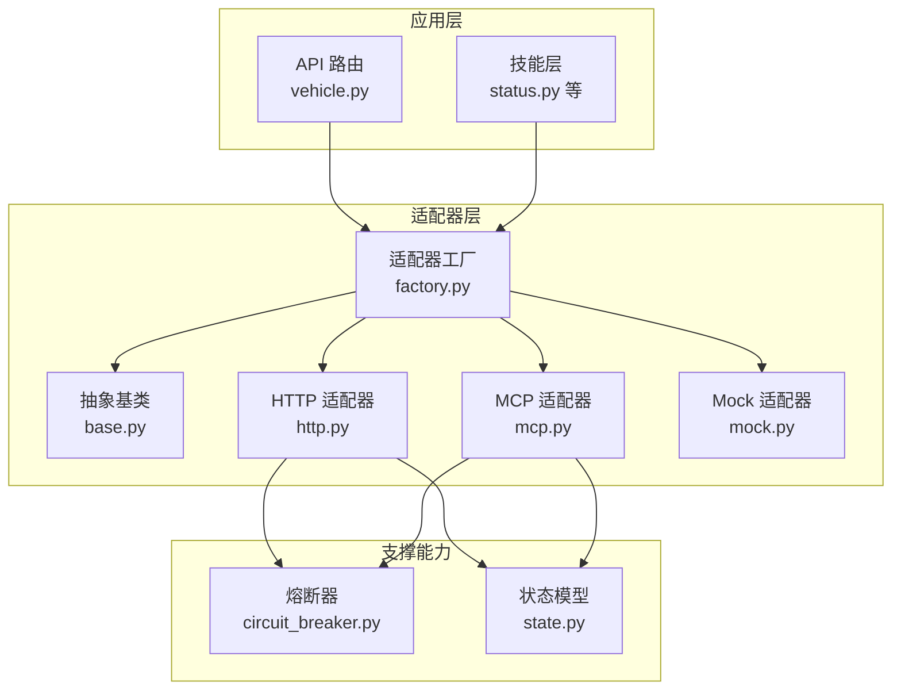
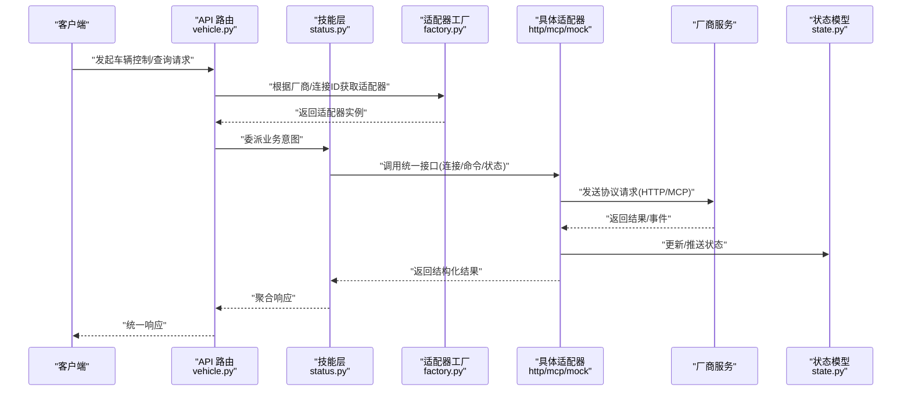
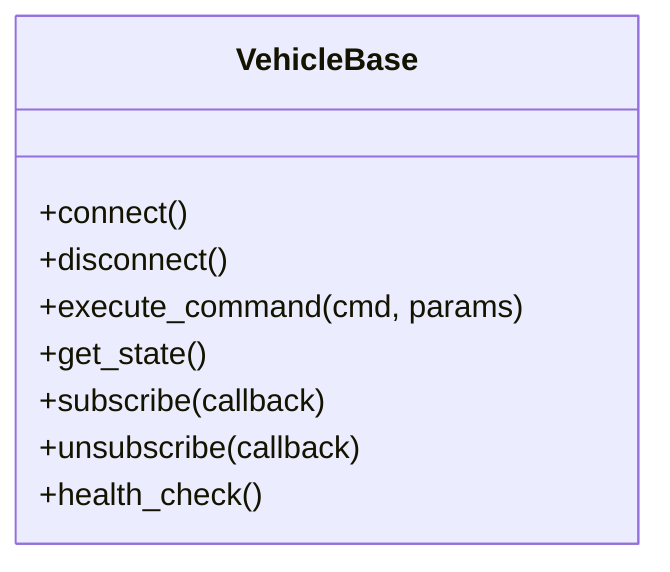
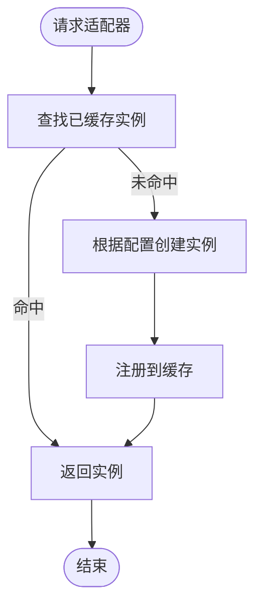
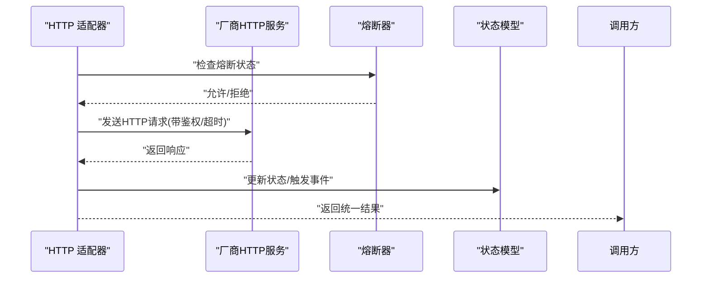
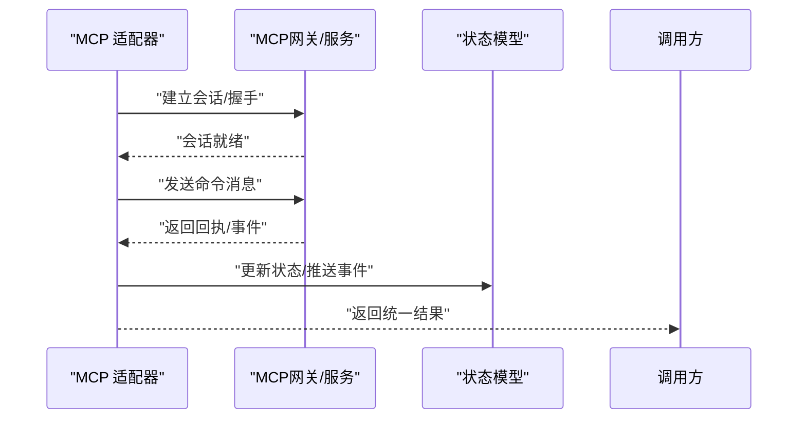
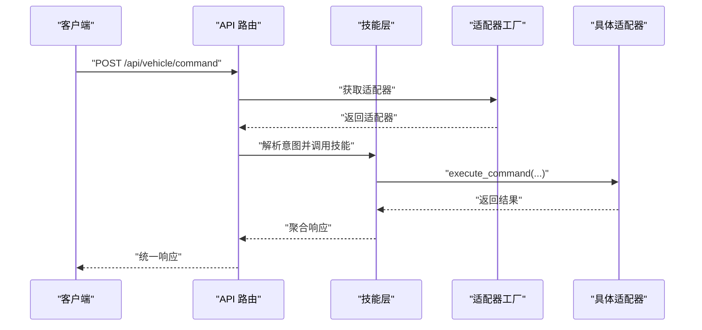
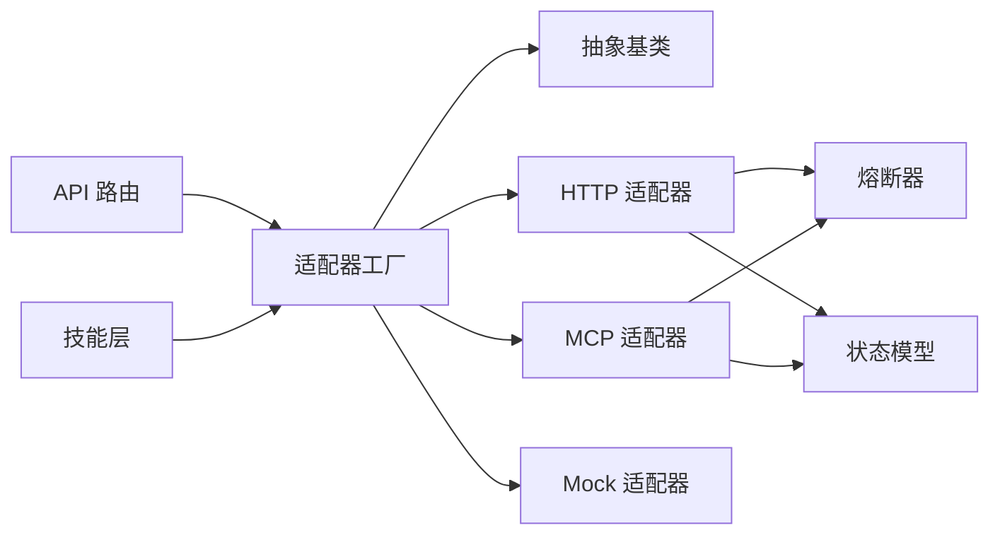

# 车辆适配器开发

<cite>
**本文引用的文件**   
- [backend_design/nexus/vehicle/base.py](file://backend_design/nexus/vehicle/base.py)
- [backend_design/nexus/vehicle/factory.py](file://backend_design/nexus/vehicle/factory.py)
- [backend_design/nexus/vehicle/http.py](file://backend_design/nexus/vehicle/http.py)
- [backend_design/nexus/vehicle/mcp.py](file://backend_design/nexus/vehicle/mcp.py)
- [backend_design/nexus/vehicle/mock.py](file://backend_design/nexus/vehicle/mock.py)
- [backend_design/nexus/api/routes/vehicle.py](file://backend_design/nexus/api/routes/vehicle.py)
- [backend_design/nexus/skills/vehicle/status.py](file://backend_design/nexus/skills/vehicle/status.py)
- [backend_design/nexus/core/circuit_breaker.py](file://backend_design/nexus/core/circuit_breaker.py)
- [backend_design/nexus/models/state.py](file://backend_design/nexus/models/state.py)
</cite>

## 目录
1. [简介](#简介)
2. [项目结构](#项目结构)
3. [核心组件](#核心组件)
4. [架构总览](#架构总览)
5. [详细组件分析](#详细组件分析)
6. [依赖关系分析](#依赖关系分析)
7. [性能与可靠性考虑](#性能与可靠性考虑)
8. [故障排查指南](#故障排查指南)
9. [结论](#结论)
10. [附录：开发示例与测试方法](#附录开发示例与测试方法)

## 简介
本指南面向需要为不同车辆制造商API实现适配器的开发者，目标是提供一套统一的车辆控制接口抽象、协议适配层（HTTP、MCP）以及工厂动态注册机制的完整说明。文档涵盖连接管理、命令封装、状态同步、错误处理、重试与超时控制等关键能力，并提供完整的开发与测试流程建议，帮助快速集成新厂商的车辆服务。

## 项目结构
本项目在后端模块中提供了车辆适配相关的基础设施与示例实现，主要位于 backend_design/nexus/vehicle 目录下，包含统一抽象基类、HTTP/MCP两种协议适配、Mock实现以及工厂注册器；上层通过 API 路由暴露统一接口，技能层（skills）以统一模型调用适配器完成具体业务动作。

图表来源
- [backend_design/nexus/api/routes/vehicle.py](file://backend_design/nexus/api/routes/vehicle.py)
- [backend_design/nexus/skills/vehicle/status.py](file://backend_design/nexus/skills/vehicle/status.py)
- [backend_design/nexus/vehicle/base.py](file://backend_design/nexus/vehicle/base.py)
- [backend_design/nexus/vehicle/factory.py](file://backend_design/nexus/vehicle/factory.py)
- [backend_design/nexus/vehicle/http.py](file://backend_design/nexus/vehicle/http.py)
- [backend_design/nexus/vehicle/mcp.py](file://backend_design/nexus/vehicle/mcp.py)
- [backend_design/nexus/vehicle/mock.py](file://backend_design/nexus/vehicle/mock.py)
- [backend_design/nexus/core/circuit_breaker.py](file://backend_design/nexus/core/circuit_breaker.py)
- [backend_design/nexus/models/state.py](file://backend_design/nexus/models/state.py)

章节来源
- [backend_design/nexus/vehicle/base.py](file://backend_design/nexus/vehicle/base.py)
- [backend_design/nexus/vehicle/factory.py](file://backend_design/nexus/vehicle/factory.py)
- [backend_design/nexus/vehicle/http.py](file://backend_design/nexus/vehicle/http.py)
- [backend_design/nexus/vehicle/mcp.py](file://backend_design/nexus/vehicle/mcp.py)
- [backend_design/nexus/vehicle/mock.py](file://backend_design/nexus/vehicle/mock.py)
- [backend_design/nexus/api/routes/vehicle.py](file://backend_design/nexus/api/routes/vehicle.py)
- [backend_design/nexus/skills/vehicle/status.py](file://backend_design/nexus/skills/vehicle/status.py)
- [backend_design/nexus/core/circuit_breaker.py](file://backend_design/nexus/core/circuit_breaker.py)
- [backend_design/nexus/models/state.py](file://backend_design/nexus/models/state.py)

## 核心组件
- 统一抽象基类：定义所有车辆适配器的最小公共接口，包括连接生命周期、命令执行、状态查询与事件订阅等。
- 适配器工厂：负责按配置或运行时参数动态创建并缓存具体适配器实例，支持多厂商、多连接的管理。
- HTTP 适配器：基于 HTTP 协议与厂商服务端交互，负责请求构建、鉴权、重试、超时与熔断。
- MCP 适配器：基于 MCP 协议进行通信，封装消息编解码、会话管理与状态同步。
- Mock 适配器：用于本地联调与自动化测试，模拟厂商响应与异常场景。
- 熔断器：对下游调用进行保护，避免雪崩。
- 状态模型：统一描述车辆状态与变更事件，供上层技能与前端消费。

章节来源
- [backend_design/nexus/vehicle/base.py](file://backend_design/nexus/vehicle/base.py)
- [backend_design/nexus/vehicle/factory.py](file://backend_design/nexus/vehicle/factory.py)
- [backend_design/nexus/vehicle/http.py](file://backend_design/nexus/vehicle/http.py)
- [backend_design/nexus/vehicle/mcp.py](file://backend_design/nexus/vehicle/mcp.py)
- [backend_design/nexus/vehicle/mock.py](file://backend_design/nexus/vehicle/mock.py)
- [backend_design/nexus/core/circuit_breaker.py](file://backend_design/nexus/core/circuit_breaker.py)
- [backend_design/nexus/models/state.py](file://backend_design/nexus/models/state.py)

## 架构总览
下图展示了从 API 到适配器的调用路径，以及适配器如何与外部厂商系统交互，并通过状态模型向上层反馈。

图表来源
- [backend_design/nexus/api/routes/vehicle.py](file://backend_design/nexus/api/routes/vehicle.py)
- [backend_design/nexus/skills/vehicle/status.py](file://backend_design/nexus/skills/vehicle/status.py)
- [backend_design/nexus/vehicle/factory.py](file://backend_design/nexus/vehicle/factory.py)
- [backend_design/nexus/vehicle/http.py](file://backend_design/nexus/vehicle/http.py)
- [backend_design/nexus/vehicle/mcp.py](file://backend_design/nexus/vehicle/mcp.py)
- [backend_design/nexus/vehicle/mock.py](file://backend_design/nexus/vehicle/mock.py)
- [backend_design/nexus/models/state.py](file://backend_design/nexus/models/state.py)

## 详细组件分析

### 统一抽象基类（VehicleBase）
职责与要点
- 定义统一接口：连接建立/断开、命令下发、状态读取、事件订阅/取消订阅。
- 约定数据契约：输入输出使用统一的数据结构，屏蔽底层协议差异。
- 生命周期钩子：初始化、健康检查、资源清理。
- 扩展点：子类可覆盖鉴权、重试策略、序列化方式等。

图表来源
- [backend_design/nexus/vehicle/base.py](file://backend_design/nexus/vehicle/base.py)

章节来源
- [backend_design/nexus/vehicle/base.py](file://backend_design/nexus/vehicle/base.py)

### 适配器工厂（VehicleFactory）
职责与要点
- 动态注册：支持按厂商标识或协议类型注册适配器类。
- 实例化与缓存：按连接键（如 tenant_id+car_id）创建并复用实例，避免重复连接。
- 生命周期管理：集中管理连接池、定时健康检查与优雅关闭。
- 容错：当某适配器不可用时，返回降级策略或明确错误码。

图表来源
- [backend_design/nexus/vehicle/factory.py](file://backend_design/nexus/vehicle/factory.py)

章节来源
- [backend_design/nexus/vehicle/factory.py](file://backend_design/nexus/vehicle/factory.py)

### HTTP 适配器（HttpVehicleAdapter）
职责与要点
- 连接管理：持久连接、连接池、自动重连。
- 命令封装：将统一命令转换为厂商 HTTP 请求（URL、方法、头、体）。
- 鉴权：支持 Token、签名、证书等多种方式。
- 超时与重试：可配置请求超时、重试次数与退避策略。
- 熔断：结合熔断器，防止级联失败。
- 状态同步：解析响应并写入状态模型，必要时触发回调。

图表来源
- [backend_design/nexus/vehicle/http.py](file://backend_design/nexus/vehicle/http.py)
- [backend_design/nexus/core/circuit_breaker.py](file://backend_design/nexus/core/circuit_breaker.py)
- [backend_design/nexus/models/state.py](file://backend_design/nexus/models/state.py)

章节来源
- [backend_design/nexus/vehicle/http.py](file://backend_design/nexus/vehicle/http.py)
- [backend_design/nexus/core/circuit_breaker.py](file://backend_design/nexus/core/circuit_breaker.py)
- [backend_design/nexus/models/state.py](file://backend_design/nexus/models/state.py)

### MCP 适配器（McpVehicleAdapter）
职责与要点
- 会话管理：维护长连接与会话上下文。
- 消息编解码：将统一命令序列化为 MCP 消息，解析回执。
- 状态同步：接收厂商推送的状态变更，合并至状态模型。
- 错误映射：将协议错误映射为统一错误码。

图表来源
- [backend_design/nexus/vehicle/mcp.py](file://backend_design/nexus/vehicle/mcp.py)
- [backend_design/nexus/models/state.py](file://backend_design/nexus/models/state.py)

章节来源
- [backend_design/nexus/vehicle/mcp.py](file://backend_design/nexus/vehicle/mcp.py)
- [backend_design/nexus/models/state.py](file://backend_design/nexus/models/state.py)

### Mock 适配器（MockVehicleAdapter）
用途
- 本地联调：无需真实厂商服务即可验证上层逻辑。
- 故障注入：模拟超时、断线、非法响应等场景，验证重试与熔断。
- 回归测试：稳定复现历史问题。

章节来源
- [backend_design/nexus/vehicle/mock.py](file://backend_design/nexus/vehicle/mock.py)

### API 路由与技能层对接
- API 路由：对外暴露统一接口，内部委托给适配器工厂获取具体适配器。
- 技能层：以领域语义调用适配器，例如“查询车辆状态”、“打开车窗”等。

图表来源
- [backend_design/nexus/api/routes/vehicle.py](file://backend_design/nexus/api/routes/vehicle.py)
- [backend_design/nexus/skills/vehicle/status.py](file://backend_design/nexus/skills/vehicle/status.py)
- [backend_design/nexus/vehicle/factory.py](file://backend_design/nexus/vehicle/factory.py)

章节来源
- [backend_design/nexus/api/routes/vehicle.py](file://backend_design/nexus/api/routes/vehicle.py)
- [backend_design/nexus/skills/vehicle/status.py](file://backend_design/nexus/skills/vehicle/status.py)

## 依赖关系分析
- 低耦合：API 与技能层仅依赖抽象基类与工厂，不感知具体协议。
- 高内聚：各适配器内部封装协议细节与连接管理。
- 可插拔：新增厂商只需实现基类并通过工厂注册。
- 稳定性：熔断器与状态模型贯穿适配器层，保障整体健壮性。

图表来源
- [backend_design/nexus/api/routes/vehicle.py](file://backend_design/nexus/api/routes/vehicle.py)
- [backend_design/nexus/skills/vehicle/status.py](file://backend_design/nexus/skills/vehicle/status.py)
- [backend_design/nexus/vehicle/base.py](file://backend_design/nexus/vehicle/base.py)
- [backend_design/nexus/vehicle/factory.py](file://backend_design/nexus/vehicle/factory.py)
- [backend_design/nexus/vehicle/http.py](file://backend_design/nexus/vehicle/http.py)
- [backend_design/nexus/vehicle/mcp.py](file://backend_design/nexus/vehicle/mcp.py)
- [backend_design/nexus/vehicle/mock.py](file://backend_design/nexus/vehicle/mock.py)
- [backend_design/nexus/core/circuit_breaker.py](file://backend_design/nexus/core/circuit_breaker.py)
- [backend_design/nexus/models/state.py](file://backend_design/nexus/models/state.py)

章节来源
- [backend_design/nexus/vehicle/base.py](file://backend_design/nexus/vehicle/base.py)
- [backend_design/nexus/vehicle/factory.py](file://backend_design/nexus/vehicle/factory.py)
- [backend_design/nexus/vehicle/http.py](file://backend_design/nexus/vehicle/http.py)
- [backend_design/nexus/vehicle/mcp.py](file://backend_design/nexus/vehicle/mcp.py)
- [backend_design/nexus/vehicle/mock.py](file://backend_design/nexus/vehicle/mock.py)
- [backend_design/nexus/api/routes/vehicle.py](file://backend_design/nexus/api/routes/vehicle.py)
- [backend_design/nexus/skills/vehicle/status.py](file://backend_design/nexus/skills/vehicle/status.py)
- [backend_design/nexus/core/circuit_breaker.py](file://backend_design/nexus/core/circuit_breaker.py)
- [backend_design/nexus/models/state.py](file://backend_design/nexus/models/state.py)

## 性能与可靠性考虑
- 连接复用：通过工厂缓存适配器实例，减少握手与鉴权开销。
- 超时控制：为每个请求设置合理超时，避免线程阻塞。
- 重试与退避：对瞬时错误采用指数退避与抖动，限制最大重试次数。
- 熔断与隔离：对不稳定厂商服务启用熔断，快速失败并降级。
- 背压与限流：在高并发下限制并发请求数，保护下游。
- 状态去抖：合并高频状态变更，降低状态模型压力。
- 观测性：记录关键指标（延迟、错误率、熔断状态），便于定位问题。

[本节为通用指导，不涉及具体文件]

## 故障排查指南
常见问题与定位思路
- 连接失败：检查工厂是否成功创建实例、鉴权配置是否正确、网络可达性。
- 请求超时：确认超时阈值、下游负载情况、重试策略是否过激。
- 熔断频繁：观察错误比例与恢复时间，调整熔断阈值与冷却时间。
- 状态不一致：核对状态模型更新时机与幂等性，避免重复写入。
- 协议不兼容：对比 MCP/HTTP 消息格式与厂商文档，增加日志与抓包。

章节来源
- [backend_design/nexus/core/circuit_breaker.py](file://backend_design/nexus/core/circuit_breaker.py)
- [backend_design/nexus/models/state.py](file://backend_design/nexus/models/state.py)

## 结论
通过统一抽象、工厂注册与协议适配层设计，本项目实现了跨厂商车辆的灵活接入。HTTP 与 MCP 两种协议均遵循同一接口契约，配合熔断、重试与状态同步机制，保障了系统的稳定性与可扩展性。按照本指南的流程，开发者可以快速为新厂商实现适配器并完成端到端验证。

## 附录：开发示例与测试方法

### 自定义适配器开发流程
- 步骤一：继承统一抽象基类，实现连接、命令、状态与事件接口。
- 步骤二：在适配器工厂中注册新适配器（按厂商标识或协议类型）。
- 步骤三：配置连接参数（鉴权、超时、重试、熔断阈值）。
- 步骤四：在技能层或 API 路由中通过工厂获取并使用适配器。
- 步骤五：编写单元测试与集成测试，覆盖正常路径与异常路径。

章节来源
- [backend_design/nexus/vehicle/base.py](file://backend_design/nexus/vehicle/base.py)
- [backend_design/nexus/vehicle/factory.py](file://backend_design/nexus/vehicle/factory.py)
- [backend_design/nexus/api/routes/vehicle.py](file://backend_design/nexus/api/routes/vehicle.py)
- [backend_design/nexus/skills/vehicle/status.py](file://backend_design/nexus/skills/vehicle/status.py)

### 连接管理最佳实践
- 使用工厂缓存实例，避免重复连接。
- 实现健康检查与自动重连，提升可用性。
- 分离读写通道，避免写操作阻塞读请求。

章节来源
- [backend_design/nexus/vehicle/factory.py](file://backend_design/nexus/vehicle/factory.py)
- [backend_design/nexus/vehicle/http.py](file://backend_design/nexus/vehicle/http.py)
- [backend_design/nexus/vehicle/mcp.py](file://backend_design/nexus/vehicle/mcp.py)

### 命令封装与状态同步
- 命令封装：将领域命令映射为协议消息，确保字段一致性与幂等性。
- 状态同步：解析响应与事件，合并到状态模型，必要时触发回调通知上层。

章节来源
- [backend_design/nexus/vehicle/http.py](file://backend_design/nexus/vehicle/http.py)
- [backend_design/nexus/vehicle/mcp.py](file://backend_design/nexus/vehicle/mcp.py)
- [backend_design/nexus/models/state.py](file://backend_design/nexus/models/state.py)

### 错误处理、重试与超时
- 错误分类：区分网络错误、协议错误、业务错误，分别处理。
- 重试策略：针对瞬时错误启用指数退避，限制最大次数。
- 超时控制：为连接、请求、等待回执分别设置超时。
- 熔断保护：错误率超过阈值时快速失败，避免雪崩。

章节来源
- [backend_design/nexus/vehicle/http.py](file://backend_design/nexus/vehicle/http.py)
- [backend_design/nexus/core/circuit_breaker.py](file://backend_design/nexus/core/circuit_breaker.py)

### 测试方法
- 单元测试：使用 Mock 适配器模拟厂商响应与异常，验证业务逻辑。
- 集成测试：在沙箱环境连接真实或仿真厂商服务，验证端到端流程。
- 混沌测试：注入延迟、丢包、断线等故障，验证重试与熔断效果。
- 回归测试：固定用例集，确保版本迭代不破坏既有行为。

章节来源
- [backend_design/nexus/vehicle/mock.py](file://backend_design/nexus/vehicle/mock.py)