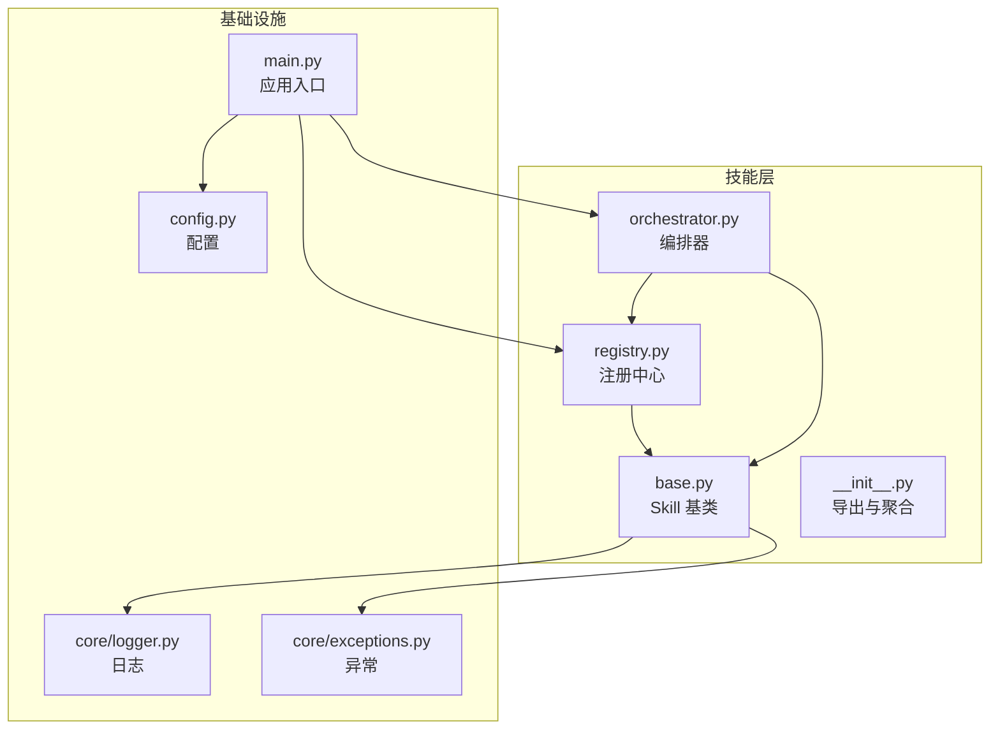
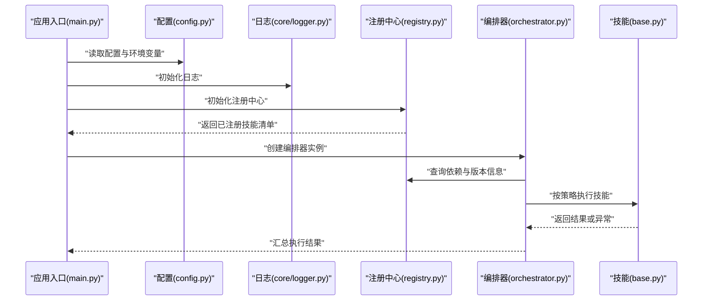
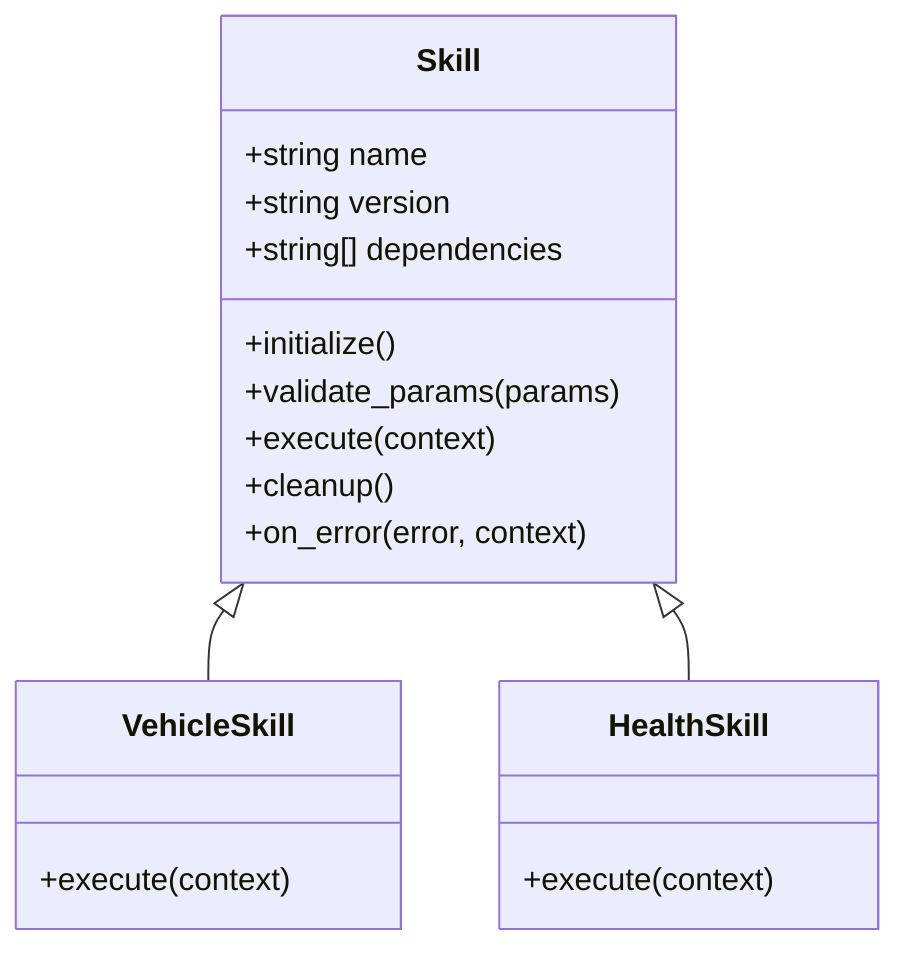
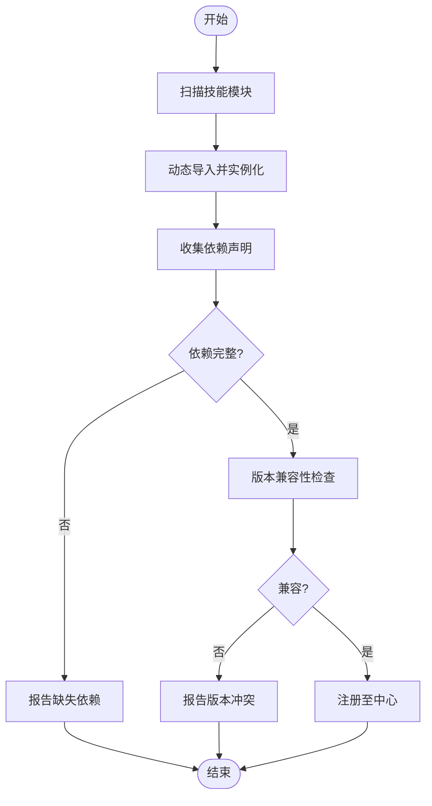
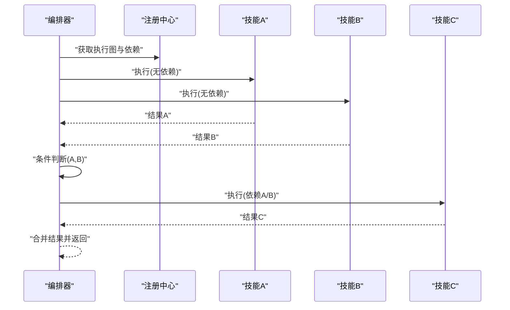
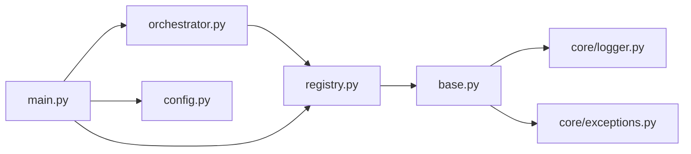

# 技能基础框架

<cite>
**本文引用的文件**   
- [backend_design/nexus/skills/base.py](file://backend_design/nexus/skills/base.py)
- [backend_design/nexus/skills/registry.py](file://backend_design/nexus/skills/registry.py)
- [backend_design/nexus/skills/orchestrator.py](file://backend_design/nexus/skills/orchestrator.py)
- [backend_design/nexus/skills/__init__.py](file://backend_design/nexus/skills/__init__.py)
- [backend_design/nexus/config.py](file://backend_design/nexus/config.py)
- [backend_design/nexus/core/logger.py](file://backend_design/nexus/core/logger.py)
- [backend_design/nexus/core/exceptions.py](file://backend_design/nexus/core/exceptions.py)
- [backend_design/nexus/main.py](file://backend_design/nexus/main.py)
</cite>

## 目录
1. [简介](#简介)
2. [项目结构](#项目结构)
3. [核心组件](#核心组件)
4. [架构总览](#架构总览)
5. [详细组件分析](#详细组件分析)
6. [依赖关系分析](#依赖关系分析)
7. [性能考量](#性能考量)
8. [故障排查指南](#故障排查指南)
9. [结论](#结论)
10. [附录](#附录)

## 简介
本技术文档聚焦于“技能基础框架”，围绕以下目标展开：
- 深入解释 Skill 基类的设计模式与核心接口，包括生命周期管理、参数验证与错误处理机制。
- 详细说明技能注册中心的工作原理，涵盖动态加载、依赖解析与版本兼容性检查。
- 描述编排器的执行策略，包括并行执行、串行依赖与条件分支逻辑。
- 提供完整的自定义技能开发指南，包含模板、最佳实践与调试技巧。
- 说明技能配置管理与环境变量处理方式。

## 项目结构
与技能基础框架相关的核心代码位于 backend_design/nexus/skills 目录，配合全局配置与日志、异常等基础设施模块。整体组织方式采用“分层+按功能域”的划分：
- skills 层：定义 Skill 基类、注册中心、编排器以及若干领域技能实现（如车辆、健康、习惯等）。
- core 层：提供日志、异常、认证、上下文等通用能力。
- config 层：集中管理应用与技能相关配置。
- main 入口：负责启动时初始化并装配各子系统。

图表来源
- [backend_design/nexus/skills/base.py](file://backend_design/nexus/skills/base.py)
- [backend_design/nexus/skills/registry.py](file://backend_design/nexus/skills/registry.py)
- [backend_design/nexus/skills/orchestrator.py](file://backend_design/nexus/skills/orchestrator.py)
- [backend_design/nexus/skills/__init__.py](file://backend_design/nexus/skills/__init__.py)
- [backend_design/nexus/config.py](file://backend_design/nexus/config.py)
- [backend_design/nexus/core/logger.py](file://backend_design/nexus/core/logger.py)
- [backend_design/nexus/core/exceptions.py](file://backend_design/nexus/core/exceptions.py)
- [backend_design/nexus/main.py](file://backend_design/nexus/main.py)

章节来源
- [backend_design/nexus/skills/base.py](file://backend_design/nexus/skills/base.py)
- [backend_design/nexus/skills/registry.py](file://backend_design/nexus/skills/registry.py)
- [backend_design/nexus/skills/orchestrator.py](file://backend_design/nexus/skills/orchestrator.py)
- [backend_design/nexus/skills/__init__.py](file://backend_design/nexus/skills/__init__.py)
- [backend_design/nexus/config.py](file://backend_design/nexus/config.py)
- [backend_design/nexus/core/logger.py](file://backend_design/nexus/core/logger.py)
- [backend_design/nexus/core/exceptions.py](file://backend_design/nexus/core/exceptions.py)
- [backend_design/nexus/main.py](file://backend_design/nexus/main.py)

## 核心组件
本节从设计模式与接口契约角度，对三大核心组件进行概览式解读：
- Skill 基类：定义技能的抽象接口、生命周期钩子、参数校验与错误上报的统一规范。
- 注册中心：维护技能元数据、动态发现与加载、依赖解析与版本兼容检查。
- 编排器：基于注册中心的技能图，制定执行策略（并行、串行、条件分支），协调调度。

章节来源
- [backend_design/nexus/skills/base.py](file://backend_design/nexus/skills/base.py)
- [backend_design/nexus/skills/registry.py](file://backend_design/nexus/skills/registry.py)
- [backend_design/nexus/skills/orchestrator.py](file://backend_design/nexus/skills/orchestrator.py)

## 架构总览
下图展示了从应用启动到技能执行的端到端流程：应用入口加载配置、初始化日志与异常体系；随后注册中心扫描并注册可用技能；编排器根据请求构建执行图，调用已注册的技能实例完成业务处理。

图表来源
- [backend_design/nexus/main.py](file://backend_design/nexus/main.py)
- [backend_design/nexus/config.py](file://backend_design/nexus/config.py)
- [backend_design/nexus/core/logger.py](file://backend_design/nexus/core/logger.py)
- [backend_design/nexus/skills/registry.py](file://backend_design/nexus/skills/registry.py)
- [backend_design/nexus/skills/orchestrator.py](file://backend_design/nexus/skills/orchestrator.py)
- [backend_design/nexus/skills/base.py](file://backend_design/nexus/skills/base.py)

## 详细组件分析

### Skill 基类设计与接口契约
- 设计模式
  - 模板方法模式：在基类中定义标准生命周期（初始化、前置校验、执行、后置清理），子类仅实现具体步骤。
  - 策略模式：通过可插拔的参数校验器与错误处理器，统一约束行为。
- 生命周期管理
  - 初始化阶段：加载配置、建立资源句柄、记录版本与依赖声明。
  - 前置校验：对输入参数进行类型、范围、必填项校验，失败则快速返回结构化错误。
  - 执行阶段：执行业务逻辑，支持内部状态与上下文传递。
  - 后置清理：释放资源、持久化中间态、上报指标与日志。
- 参数验证
  - 基于声明式的字段规则（类型、默认值、可选/必填、取值范围）进行校验。
  - 校验失败抛出标准化异常，便于上层统一捕获与降级。
- 错误处理
  - 将业务异常与系统异常区分，提供重试、熔断与回退策略的扩展点。
  - 所有错误均附带上下文（请求ID、租户、用户、技能名、参数快照），便于追踪。

图表来源
- [backend_design/nexus/skills/base.py](file://backend_design/nexus/skills/base.py)

章节来源
- [backend_design/nexus/skills/base.py](file://backend_design/nexus/skills/base.py)
- [backend_design/nexus/core/exceptions.py](file://backend_design/nexus/core/exceptions.py)
- [backend_design/nexus/core/logger.py](file://backend_design/nexus/core/logger.py)

### 注册中心：动态加载、依赖解析与版本兼容
- 动态加载
  - 基于约定优于配置的策略，自动扫描指定包路径下的技能模块。
  - 支持按需导入与懒加载，避免冷启动开销。
- 依赖解析
  - 以有向无环图（DAG）形式表达技能间依赖，拓扑排序确定执行顺序。
  - 循环依赖检测与缺失依赖提示，确保注册阶段即暴露问题。
- 版本兼容
  - 声明最小/最大兼容版本，注册时进行语义化版本比较。
  - 不兼容时拒绝加载并给出明确原因，支持灰度与回滚策略。

图表来源
- [backend_design/nexus/skills/registry.py](file://backend_design/nexus/skills/registry.py)

章节来源
- [backend_design/nexus/skills/registry.py](file://backend_design/nexus/skills/registry.py)

### 编排器：并行执行、串行依赖与条件分支
- 执行策略
  - 并行执行：对无相互依赖且满足隔离条件的技能节点并发执行，提升吞吐。
  - 串行依赖：依据拓扑序保证强依赖节点的先后顺序。
  - 条件分支：基于上游输出或外部状态决定后续分支路径。
- 容错与降级
  - 单节点失败不影响非依赖下游，支持超时、重试与短路。
  - 关键路径失败触发降级策略（返回缓存、默认值或友好提示）。
- 可观测性
  - 为每个节点生成执行轨迹，记录耗时、错误码与上下文，便于定位瓶颈。

图表来源
- [backend_design/nexus/skills/orchestrator.py](file://backend_design/nexus/skills/orchestrator.py)
- [backend_design/nexus/skills/registry.py](file://backend_design/nexus/skills/registry.py)

章节来源
- [backend_design/nexus/skills/orchestrator.py](file://backend_design/nexus/skills/orchestrator.py)

### 自定义技能开发指南
- 开发模板
  - 新建一个继承自 Skill 基类的子类，实现必要生命周期方法与业务逻辑。
  - 在模块级声明元数据（名称、版本、依赖、能力标签），以便注册中心识别。
- 最佳实践
  - 幂等性：同一请求多次执行应得到一致结果。
  - 可测试性：将外部依赖注入为可替换实现，便于单元测试与集成测试。
  - 可观测性：在关键路径埋点日志与指标，记录入参与出参摘要。
  - 健壮性：对网络、IO 与第三方服务调用增加超时与重试保护。
- 调试技巧
  - 开启详细日志级别，结合请求ID追踪链路。
  - 使用本地 Mock 替代外部依赖，快速复现问题。
  - 利用编排器的执行轨迹定位慢节点与失败分支。

章节来源
- [backend_design/nexus/skills/base.py](file://backend_design/nexus/skills/base.py)
- [backend_design/nexus/skills/registry.py](file://backend_design/nexus/skills/registry.py)
- [backend_design/nexus/skills/orchestrator.py](file://backend_design/nexus/skills/orchestrator.py)
- [backend_design/nexus/core/logger.py](file://backend_design/nexus/core/logger.py)

### 配置管理与环境变量
- 配置来源
  - 配置文件与环境变量双通道，后者覆盖前者，支持多环境差异化。
  - 技能级配置与全局配置分离，便于复用与组合。
- 加载顺序
  - 默认配置 -> 环境特定配置 -> 运行时环境变量 -> 请求级覆盖。
- 安全与敏感信息
  - 敏感字段（密钥、令牌）优先通过环境变量注入，避免落盘。
  - 提供配置校验与缺省值兜底，防止启动期崩溃。

章节来源
- [backend_design/nexus/config.py](file://backend_design/nexus/config.py)
- [backend_design/nexus/main.py](file://backend_design/nexus/main.py)

## 依赖关系分析
- 组件耦合
  - 编排器依赖注册中心提供的技能清单与依赖图。
  - 注册中心依赖基类定义的元数据与版本声明。
  - 基类依赖日志与异常基础设施，形成稳定的内聚边界。
- 外部依赖
  - 配置模块提供统一的配置访问接口。
  - 日志与异常模块贯穿全链路，保障可观测性与一致性。

图表来源
- [backend_design/nexus/skills/orchestrator.py](file://backend_design/nexus/skills/orchestrator.py)
- [backend_design/nexus/skills/registry.py](file://backend_design/nexus/skills/registry.py)
- [backend_design/nexus/skills/base.py](file://backend_design/nexus/skills/base.py)
- [backend_design/nexus/core/logger.py](file://backend_design/nexus/core/logger.py)
- [backend_design/nexus/core/exceptions.py](file://backend_design/nexus/core/exceptions.py)
- [backend_design/nexus/main.py](file://backend_design/nexus/main.py)
- [backend_design/nexus/config.py](file://backend_design/nexus/config.py)

章节来源
- [backend_design/nexus/skills/orchestrator.py](file://backend_design/nexus/skills/orchestrator.py)
- [backend_design/nexus/skills/registry.py](file://backend_design/nexus/skills/registry.py)
- [backend_design/nexus/skills/base.py](file://backend_design/nexus/skills/base.py)
- [backend_design/nexus/core/logger.py](file://backend_design/nexus/core/logger.py)
- [backend_design/nexus/core/exceptions.py](file://backend_design/nexus/core/exceptions.py)
- [backend_design/nexus/main.py](file://backend_design/nexus/main.py)
- [backend_design/nexus/config.py](file://backend_design/nexus/config.py)

## 性能考量
- 启动优化
  - 延迟加载与按需导入，减少冷启动时间。
  - 预计算依赖拓扑，避免重复解析。
- 运行期优化
  - 并行执行无依赖节点，合理设置并发上限与队列长度。
  - 对热点技能启用结果缓存与短路径命中。
- 资源控制
  - 为外部 IO 设置超时与连接池大小，避免雪崩。
  - 监控 CPU、内存与 GC 指标，及时扩容或限流。

[本节为通用指导，无需列出具体文件来源]

## 故障排查指南
- 常见问题
  - 依赖缺失或循环依赖：注册阶段报错，检查依赖声明与拓扑排序。
  - 版本不兼容：升级或锁定依赖版本，确认语义化版本区间。
  - 参数校验失败：核对入参与字段规则，补充默认值或放宽约束。
  - 执行超时或失败：查看编排器轨迹与节点日志，定位瓶颈与异常堆栈。
- 诊断手段
  - 提高日志级别，结合请求ID与上下文字段进行链路追踪。
  - 使用本地 Mock 与断点逐步验证关键路径。
  - 借助编排器输出的执行图与耗时分布，识别慢节点。

章节来源
- [backend_design/nexus/skills/registry.py](file://backend_design/nexus/skills/registry.py)
- [backend_design/nexus/skills/orchestrator.py](file://backend_design/nexus/skills/orchestrator.py)
- [backend_design/nexus/core/logger.py](file://backend_design/nexus/core/logger.py)
- [backend_design/nexus/core/exceptions.py](file://backend_design/nexus/core/exceptions.py)

## 结论
本框架通过清晰的职责划分与可扩展的接口设计，实现了技能的生命周期管理、动态注册与编排执行。依托注册中心的依赖解析与版本兼容机制，以及编排器的并行与条件分支策略，系统在可维护性、可观测性与性能方面具备良好平衡。遵循本文的开发指南与最佳实践，可高效构建稳定可靠的自定义技能。

[本节为总结性内容，无需列出具体文件来源]

## 附录
- 术语表
  - 技能：封装特定业务能力的可插拔单元。
  - 注册中心：维护技能元数据、依赖与版本的中央目录。
  - 编排器：根据依赖与策略调度技能执行的控制器。
- 参考路径
  - 基类与接口：[backend_design/nexus/skills/base.py](file://backend_design/nexus/skills/base.py)
  - 注册中心：[backend_design/nexus/skills/registry.py](file://backend_design/nexus/skills/registry.py)
  - 编排器：[backend_design/nexus/skills/orchestrator.py](file://backend_design/nexus/skills/orchestrator.py)
  - 配置与环境：[backend_design/nexus/config.py](file://backend_design/nexus/config.py)
  - 日志与异常：[backend_design/nexus/core/logger.py](file://backend_design/nexus/core/logger.py)、[backend_design/nexus/core/exceptions.py](file://backend_design/nexus/core/exceptions.py)
  - 应用入口：[backend_design/nexus/main.py](file://backend_design/nexus/main.py)