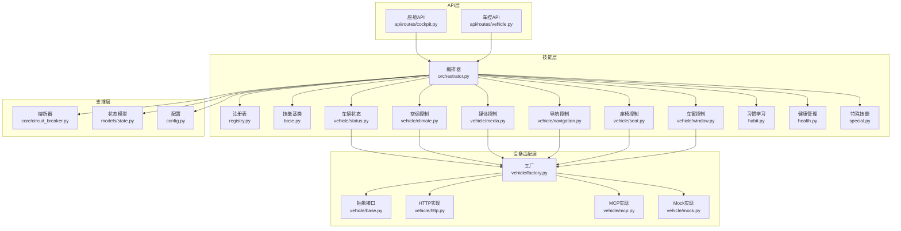
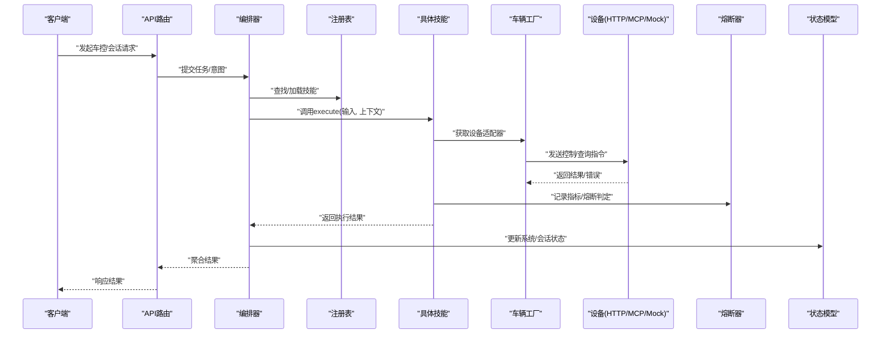
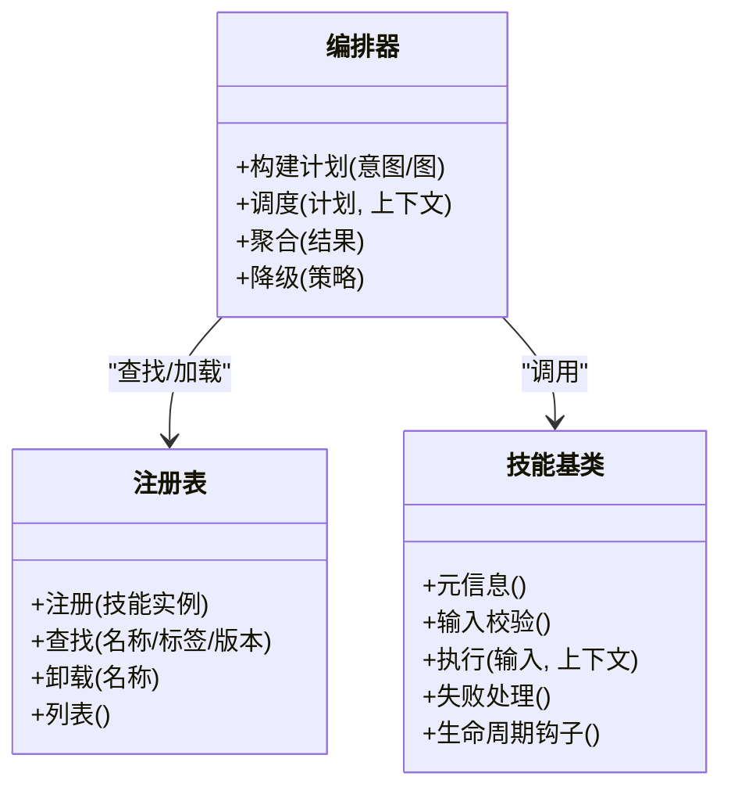
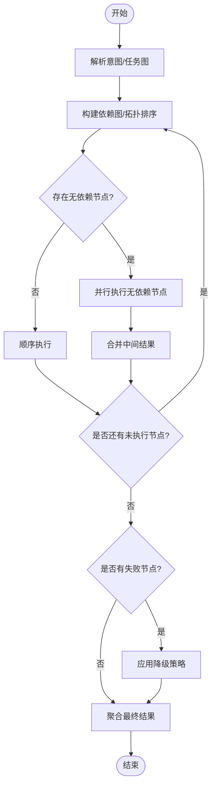
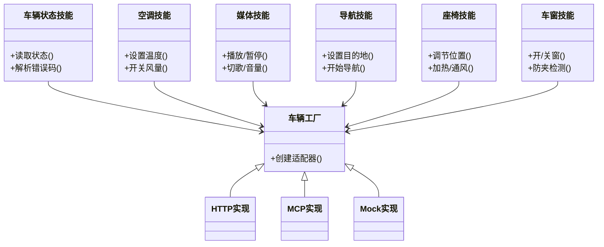
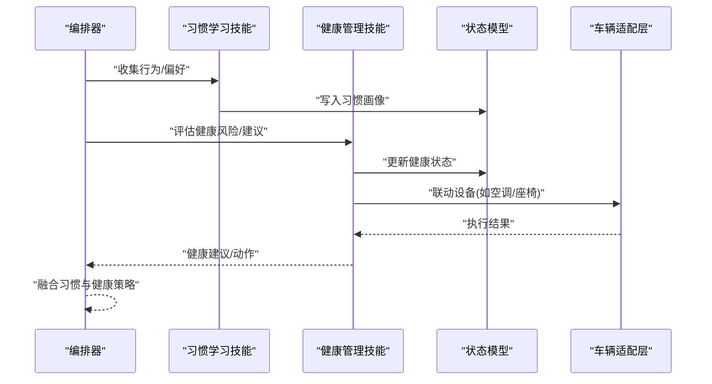
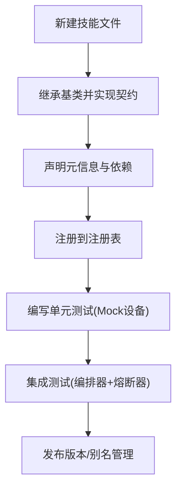
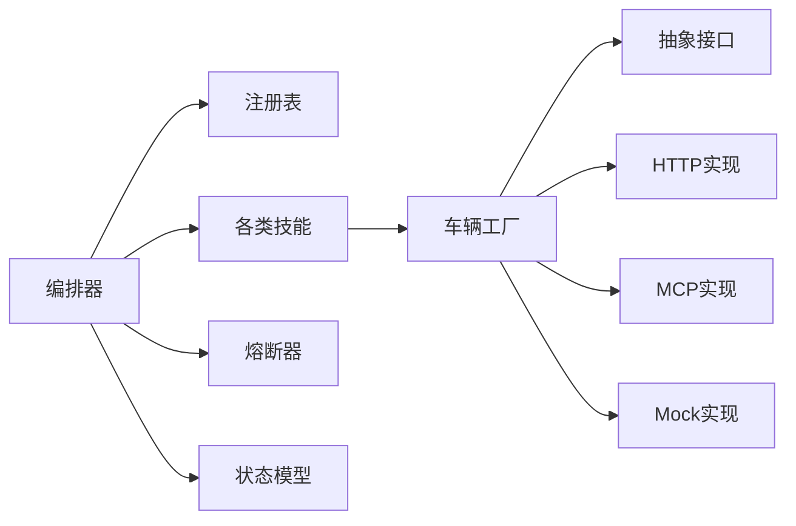

# 技能编排系统

<cite>
**本文引用的文件**   
- [backend_design/nexus/skills/orchestrator.py](file://backend_design/nexus/skills/orchestrator.py)
- [backend_design/nexus/skills/registry.py](file://backend_design/nexus/skills/registry.py)
- [backend_design/nexus/skills/base.py](file://backend_design/nexus/skills/base.py)
- [backend_design/nexus/skills/vehicle/status.py](file://backend_design/nexus/skills/vehicle/status.py)
- [backend_design/nexus/skills/vehicle/climate.py](file://backend_design/nexus/skills/vehicle/climate.py)
- [backend_design/nexus/skills/vehicle/media.py](file://backend_design/nexus/skills/vehicle/media.py)
- [backend_design/nexus/skills/vehicle/navigation.py](file://backend_design/nexus/skills/vehicle/navigation.py)
- [backend_design/nexus/skills/vehicle/seat.py](file://backend_design/nexus/skills/vehicle/seat.py)
- [backend_design/nexus/skills/vehicle/window.py](file://backend_design/nexus/skills/vehicle/window.py)
- [backend_design/nexus/skills/habit.py](file://backend_design/nexus/skills/habit.py)
- [backend_design/nexus/skills/health.py](file://backend_design/nexus/skills/health.py)
- [backend_design/nexus/skills/special.py](file://backend_design/nexus/skills/special.py)
- [backend_design/nexus/vehicle/factory.py](file://backend_design/nexus/vehicle/factory.py)
- [backend_design/nexus/vehicle/base.py](file://backend_design/nexus/vehicle/base.py)
- [backend_design/nexus/vehicle/http.py](file://backend_design/nexus/vehicle/http.py)
- [backend_design/nexus/vehicle/mcp.py](file://backend_design/nexus/vehicle/mcp.py)
- [backend_design/nexus/vehicle/mock.py](file://backend_design/nexus/vehicle/mock.py)
- [backend_design/nexus/core/circuit_breaker.py](file://backend_design/nexus/core/circuit_breaker.py)
- [backend_design/nexus/models/state.py](file://backend_design/nexus/models/state.py)
- [backend_design/nexus/api/routes/cockpit.py](file://backend_design/nexus/api/routes/cockpit.py)
- [backend_design/nexus/api/routes/vehicle.py](file://backend_design/nexus/api/routes/vehicle.py)
- [backend_design/nexus/config.py](file://backend_design/nexus/config.py)
</cite>

## 目录
1. [简介](#简介)
2. [项目结构](#项目结构)
3. [核心组件](#核心组件)
4. [架构总览](#架构总览)
5. [详细组件分析](#详细组件分析)
6. [依赖关系分析](#依赖关系分析)
7. [性能考量](#性能考量)
8. [故障排查指南](#故障排查指南)
9. [结论](#结论)
10. [附录](#附录)

## 简介
本技术文档围绕“技能编排系统”展开，聚焦以下目标：
- 插件化技能架构的设计理念与注册机制
- 编排器如何协调多技能的执行顺序与依赖关系
- 车辆控制技能集的实现（状态查询、设备控制、故障诊断）
- 习惯学习与健康管理的特殊技能逻辑
- 自定义技能开发指南（接口规范、模板、测试方法）
- 技能版本管理与兼容性策略

该系统的目标是提供可扩展、可观测、可治理的智能座舱能力编排层，将领域技能以插件形式接入，并通过统一的编排器进行调度与协同。

## 项目结构
与技能编排相关的核心代码位于 backend_design/nexus 下，关键目录与职责如下：
- skills：技能抽象、注册表、编排器以及内置技能（车辆、习惯、健康、提醒、特殊等）
- vehicle：车辆通信适配层（HTTP/MCP/Mock），为上层技能提供统一设备访问能力
- core：通用基础设施（熔断器、异常、日志、上下文等）
- models：数据模型与状态定义
- api：对外暴露的API路由（车控、会话、设置等）
- config：配置加载与运行时参数

图表来源
- [backend_design/nexus/skills/orchestrator.py](file://backend_design/nexus/skills/orchestrator.py)
- [backend_design/nexus/skills/registry.py](file://backend_design/nexus/skills/registry.py)
- [backend_design/nexus/skills/base.py](file://backend_design/nexus/skills/base.py)
- [backend_design/nexus/skills/vehicle/status.py](file://backend_design/nexus/skills/vehicle/status.py)
- [backend_design/nexus/skills/vehicle/climate.py](file://backend_design/nexus/skills/vehicle/climate.py)
- [backend_design/nexus/skills/vehicle/media.py](file://backend_design/nexus/skills/vehicle/media.py)
- [backend_design/nexus/skills/vehicle/navigation.py](file://backend_design/nexus/skills/vehicle/navigation.py)
- [backend_design/nexus/skills/vehicle/seat.py](file://backend_design/nexus/skills/vehicle/seat.py)
- [backend_design/nexus/skills/vehicle/window.py](file://backend_design/nexus/skills/vehicle/window.py)
- [backend_design/nexus/skills/habit.py](file://backend_design/nexus/skills/habit.py)
- [backend_design/nexus/skills/health.py](file://backend_design/nexus/skills/health.py)
- [backend_design/nexus/skills/special.py](file://backend_design/nexus/skills/special.py)
- [backend_design/nexus/vehicle/factory.py](file://backend_design/nexus/vehicle/factory.py)
- [backend_design/nexus/vehicle/base.py](file://backend_design/nexus/vehicle/base.py)
- [backend_design/nexus/vehicle/http.py](file://backend_design/nexus/vehicle/http.py)
- [backend_design/nexus/vehicle/mcp.py](file://backend_design/nexus/vehicle/mcp.py)
- [backend_design/nexus/vehicle/mock.py](file://backend_design/nexus/vehicle/mock.py)
- [backend_design/nexus/core/circuit_breaker.py](file://backend_design/nexus/core/circuit_breaker.py)
- [backend_design/nexus/models/state.py](file://backend_design/nexus/models/state.py)
- [backend_design/nexus/api/routes/cockpit.py](file://backend_design/nexus/api/routes/cockpit.py)
- [backend_design/nexus/api/routes/vehicle.py](file://backend_design/nexus/api/routes/vehicle.py)
- [backend_design/nexus/config.py](file://backend_design/nexus/config.py)

章节来源
- [backend_design/nexus/skills/orchestrator.py](file://backend_design/nexus/skills/orchestrator.py)
- [backend_design/nexus/skills/registry.py](file://backend_design/nexus/skills/registry.py)
- [backend_design/nexus/skills/base.py](file://backend_design/nexus/skills/base.py)
- [backend_design/nexus/vehicle/factory.py](file://backend_design/nexus/vehicle/factory.py)
- [backend_design/nexus/vehicle/base.py](file://backend_design/nexus/vehicle/base.py)
- [backend_design/nexus/core/circuit_breaker.py](file://backend_design/nexus/core/circuit_breaker.py)
- [backend_design/nexus/models/state.py](file://backend_design/nexus/models/state.py)
- [backend_design/nexus/api/routes/cockpit.py](file://backend_design/nexus/api/routes/cockpit.py)
- [backend_design/nexus/api/routes/vehicle.py](file://backend_design/nexus/api/routes/vehicle.py)
- [backend_design/nexus/config.py](file://backend_design/nexus/config.py)

## 核心组件
- 技能基类：定义技能的最小契约（元信息、输入输出、生命周期钩子、错误语义）。所有具体技能均继承该基类，确保编排器可统一调用。
- 注册表：集中管理技能的发现、注册、版本与别名映射；支持按标签/域筛选与按需加载。
- 编排器：解析意图或任务图，构建执行计划，处理依赖、并行度、超时与熔断降级，并聚合结果。
- 车辆适配层：通过工厂选择具体实现（HTTP/MCP/Mock），屏蔽底层差异，向上提供一致的设备操作接口。
- 熔断器：对不稳定外部依赖进行保护，避免雪崩。
- 状态模型：统一描述系统/设备/会话状态，供编排器与API层共享。

章节来源
- [backend_design/nexus/skills/base.py](file://backend_design/nexus/skills/base.py)
- [backend_design/nexus/skills/registry.py](file://backend_design/nexus/skills/registry.py)
- [backend_design/nexus/skills/orchestrator.py](file://backend_design/nexus/skills/orchestrator.py)
- [backend_design/nexus/vehicle/factory.py](file://backend_design/nexus/vehicle/factory.py)
- [backend_design/nexus/vehicle/base.py](file://backend_design/nexus/vehicle/base.py)
- [backend_design/nexus/core/circuit_breaker.py](file://backend_design/nexus/core/circuit_breaker.py)
- [backend_design/nexus/models/state.py](file://backend_design/nexus/models/state.py)

## 架构总览
从请求到执行的端到端流程：
- API层接收请求，解析参数与上下文
- 编排器根据意图/规则生成执行计划
- 注册表定位所需技能实例
- 具体技能调用车辆适配层完成设备交互
- 熔断器保障稳定性，状态模型贯穿上下文

图表来源
- [backend_design/nexus/api/routes/cockpit.py](file://backend_design/nexus/api/routes/cockpit.py)
- [backend_design/nexus/api/routes/vehicle.py](file://backend_design/nexus/api/routes/vehicle.py)
- [backend_design/nexus/skills/orchestrator.py](file://backend_design/nexus/skills/orchestrator.py)
- [backend_design/nexus/skills/registry.py](file://backend_design/nexus/skills/registry.py)
- [backend_design/nexus/vehicle/factory.py](file://backend_design/nexus/vehicle/factory.py)
- [backend_design/nexus/core/circuit_breaker.py](file://backend_design/nexus/core/circuit_breaker.py)
- [backend_design/nexus/models/state.py](file://backend_design/nexus/models/state.py)

## 详细组件分析

### 插件化技能架构与注册机制
- 设计理念
  - 最小契约：通过基类定义统一的元数据、输入输出、错误码与生命周期钩子
  - 解耦装配：注册表负责发现与装配，编排器只关心“做什么”，不关心“怎么做”
  - 版本兼容：注册表维护版本与别名，支持灰度与回滚
- 关键流程
  - 启动时扫描/加载技能模块，向注册表登记
  - 运行时按名称/标签/版本检索技能实例
  - 编排器基于依赖图构建执行序列，必要时并行执行无依赖节点
- 扩展点
  - 新增技能只需实现基类契约并在注册表中声明
  - 可通过标签/域进行分组与隔离

图表来源
- [backend_design/nexus/skills/base.py](file://backend_design/nexus/skills/base.py)
- [backend_design/nexus/skills/registry.py](file://backend_design/nexus/skills/registry.py)
- [backend_design/nexus/skills/orchestrator.py](file://backend_design/nexus/skills/orchestrator.py)

章节来源
- [backend_design/nexus/skills/base.py](file://backend_design/nexus/skills/base.py)
- [backend_design/nexus/skills/registry.py](file://backend_design/nexus/skills/registry.py)
- [backend_design/nexus/skills/orchestrator.py](file://backend_design/nexus/skills/orchestrator.py)

### 编排器：执行顺序与依赖关系
- 执行顺序
  - 基于依赖拓扑排序，保证前置技能先于后置技能执行
  - 无依赖的技能可并行执行以提升吞吐
- 依赖关系
  - 显式声明依赖（如“空调控制”依赖“车辆状态”）
  - 动态依赖：根据上下文条件决定是否需要某技能
- 容错与降级
  - 单技能失败不影响整体成功路径（可选）
  - 熔断器快速失败，避免级联故障
  - 降级策略：返回缓存/默认值或提示用户重试

图表来源
- [backend_design/nexus/skills/orchestrator.py](file://backend_design/nexus/skills/orchestrator.py)
- [backend_design/nexus/core/circuit_breaker.py](file://backend_design/nexus/core/circuit_breaker.py)

章节来源
- [backend_design/nexus/skills/orchestrator.py](file://backend_design/nexus/skills/orchestrator.py)
- [backend_design/nexus/core/circuit_breaker.py](file://backend_design/nexus/core/circuit_breaker.py)

### 车辆控制技能集：状态查询、设备控制、故障诊断
- 状态查询
  - 通过“车辆状态”技能汇总各子系统状态，供其他技能决策使用
- 设备控制
  - 空调、媒体、导航、座椅、车窗等技能分别封装对应设备操作
  - 统一通过车辆适配层工厂选择具体实现（HTTP/MCP/Mock）
- 故障诊断
  - 结合状态与错误码，编排器可触发诊断技能，输出建议或告警
  - 熔断器在设备不可用时快速返回，避免阻塞

图表来源
- [backend_design/nexus/skills/vehicle/status.py](file://backend_design/nexus/skills/vehicle/status.py)
- [backend_design/nexus/skills/vehicle/climate.py](file://backend_design/nexus/skills/vehicle/climate.py)
- [backend_design/nexus/skills/vehicle/media.py](file://backend_design/nexus/skills/vehicle/media.py)
- [backend_design/nexus/skills/vehicle/navigation.py](file://backend_design/nexus/skills/vehicle/navigation.py)
- [backend_design/nexus/skills/vehicle/seat.py](file://backend_design/nexus/skills/vehicle/seat.py)
- [backend_design/nexus/skills/vehicle/window.py](file://backend_design/nexus/skills/vehicle/window.py)
- [backend_design/nexus/vehicle/factory.py](file://backend_design/nexus/vehicle/factory.py)
- [backend_design/nexus/vehicle/http.py](file://backend_design/nexus/vehicle/http.py)
- [backend_design/nexus/vehicle/mcp.py](file://backend_design/nexus/vehicle/mcp.py)
- [backend_design/nexus/vehicle/mock.py](file://backend_design/nexus/vehicle/mock.py)

章节来源
- [backend_design/nexus/skills/vehicle/status.py](file://backend_design/nexus/skills/vehicle/status.py)
- [backend_design/nexus/skills/vehicle/climate.py](file://backend_design/nexus/skills/vehicle/climate.py)
- [backend_design/nexus/skills/vehicle/media.py](file://backend_design/nexus/skills/vehicle/media.py)
- [backend_design/nexus/skills/vehicle/navigation.py](file://backend_design/nexus/skills/vehicle/navigation.py)
- [backend_design/nexus/skills/vehicle/seat.py](file://backend_design/nexus/skills/vehicle/seat.py)
- [backend_design/nexus/skills/vehicle/window.py](file://backend_design/nexus/skills/vehicle/window.py)
- [backend_design/nexus/vehicle/factory.py](file://backend_design/nexus/vehicle/factory.py)
- [backend_design/nexus/vehicle/http.py](file://backend_design/nexus/vehicle/http.py)
- [backend_design/nexus/vehicle/mcp.py](file://backend_design/nexus/vehicle/mcp.py)
- [backend_design/nexus/vehicle/mock.py](file://backend_design/nexus/vehicle/mock.py)

### 习惯学习与健康管理：特殊技能逻辑
- 习惯学习
  - 采集用户行为与偏好，形成个性化策略
  - 与编排器协作，在合适时机主动触发相关技能（如自动调温、推荐路线）
- 健康管理
  - 结合生理指标与场景上下文，给出健康建议或联动设备（如调节车内环境）
  - 与状态模型集成，持久化健康画像与趋势

图表来源
- [backend_design/nexus/skills/habit.py](file://backend_design/nexus/skills/habit.py)
- [backend_design/nexus/skills/health.py](file://backend_design/nexus/skills/health.py)
- [backend_design/nexus/models/state.py](file://backend_design/nexus/models/state.py)
- [backend_design/nexus/vehicle/factory.py](file://backend_design/nexus/vehicle/factory.py)

章节来源
- [backend_design/nexus/skills/habit.py](file://backend_design/nexus/skills/habit.py)
- [backend_design/nexus/skills/health.py](file://backend_design/nexus/skills/health.py)
- [backend_design/nexus/models/state.py](file://backend_design/nexus/models/state.py)

### 自定义技能开发指南
- 接口规范
  - 继承技能基类，实现必要方法与错误语义
  - 声明元信息（名称、版本、标签、依赖）
  - 定义输入输出结构与校验规则
- 开发模板
  - 新建技能文件，实现最小可用功能
  - 在注册表中登记，指定版本与别名
  - 编写单元测试覆盖正常/异常路径
- 测试方法
  - 使用Mock实现替代真实设备
  - 模拟网络异常与熔断场景
  - 验证编排器的依赖与并行执行

图表来源
- [backend_design/nexus/skills/base.py](file://backend_design/nexus/skills/base.py)
- [backend_design/nexus/skills/registry.py](file://backend_design/nexus/skills/registry.py)
- [backend_design/nexus/vehicle/mock.py](file://backend_design/nexus/vehicle/mock.py)
- [backend_design/nexus/core/circuit_breaker.py](file://backend_design/nexus/core/circuit_breaker.py)

章节来源
- [backend_design/nexus/skills/base.py](file://backend_design/nexus/skills/base.py)
- [backend_design/nexus/skills/registry.py](file://backend_design/nexus/skills/registry.py)
- [backend_design/nexus/vehicle/mock.py](file://backend_design/nexus/vehicle/mock.py)
- [backend_design/nexus/core/circuit_breaker.py](file://backend_design/nexus/core/circuit_breaker.py)

### 技能版本管理与兼容性策略
- 版本策略
  - 注册表维护技能版本与别名，支持灰度发布与回滚
  - 编排器可按版本选择实例，避免破坏性变更影响线上
- 兼容性处理
  - 输入输出结构的向后兼容（可选字段、默认值）
  - 错误码与语义保持稳定，新增错误需渐进引入
  - 通过熔断器与降级策略降低升级风险

章节来源
- [backend_design/nexus/skills/registry.py](file://backend_design/nexus/skills/registry.py)
- [backend_design/nexus/skills/orchestrator.py](file://backend_design/nexus/skills/orchestrator.py)
- [backend_design/nexus/core/circuit_breaker.py](file://backend_design/nexus/core/circuit_breaker.py)

## 依赖关系分析
- 组件耦合
  - 编排器与注册表强耦合（查找/加载）
  - 技能与车辆适配层松耦合（通过工厂与抽象接口）
  - 熔断器作为横切关注点，被多个技能与编排器使用
- 外部依赖
  - HTTP/MCP协议对接车载服务
  - 状态模型持久化/共享
- 潜在循环依赖
  - 通过分层与接口抽象避免直接循环引用

图表来源
- [backend_design/nexus/skills/orchestrator.py](file://backend_design/nexus/skills/orchestrator.py)
- [backend_design/nexus/skills/registry.py](file://backend_design/nexus/skills/registry.py)
- [backend_design/nexus/vehicle/factory.py](file://backend_design/nexus/vehicle/factory.py)
- [backend_design/nexus/vehicle/base.py](file://backend_design/nexus/vehicle/base.py)
- [backend_design/nexus/vehicle/http.py](file://backend_design/nexus/vehicle/http.py)
- [backend_design/nexus/vehicle/mcp.py](file://backend_design/nexus/vehicle/mcp.py)
- [backend_design/nexus/vehicle/mock.py](file://backend_design/nexus/vehicle/mock.py)
- [backend_design/nexus/core/circuit_breaker.py](file://backend_design/nexus/core/circuit_breaker.py)
- [backend_design/nexus/models/state.py](file://backend_design/nexus/models/state.py)

章节来源
- [backend_design/nexus/skills/orchestrator.py](file://backend_design/nexus/skills/orchestrator.py)
- [backend_design/nexus/skills/registry.py](file://backend_design/nexus/skills/registry.py)
- [backend_design/nexus/vehicle/factory.py](file://backend_design/nexus/vehicle/factory.py)
- [backend_design/nexus/vehicle/base.py](file://backend_design/nexus/vehicle/base.py)
- [backend_design/nexus/core/circuit_breaker.py](file://backend_design/nexus/core/circuit_breaker.py)
- [backend_design/nexus/models/state.py](file://backend_design/nexus/models/state.py)

## 性能考量
- 并行执行：无依赖技能并行提升吞吐
- 熔断与限流：对不稳定外部依赖快速失败，避免资源耗尽
- 缓存与复用：状态模型与常用查询结果缓存
- 连接池与批处理：HTTP/MCP层优化连接与批量指令
- 监控与度量：关键路径埋点，便于容量规划与瓶颈定位

[本节为通用指导，无需特定文件来源]

## 故障排查指南
- 常见问题
  - 设备不可用：检查熔断器状态与降级策略
  - 依赖缺失：确认注册表中的依赖声明与实际实现一致
  - 版本冲突：核对版本与别名，必要时回滚
- 定位步骤
  - 查看编排器日志与执行计划
  - 检查车辆适配层返回的错误码
  - 使用Mock实现复现问题，隔离外部依赖
- 恢复策略
  - 启用降级模式，返回默认值或提示
  - 重启相关服务或切换备用实现

章节来源
- [backend_design/nexus/core/circuit_breaker.py](file://backend_design/nexus/core/circuit_breaker.py)
- [backend_design/nexus/vehicle/mock.py](file://backend_design/nexus/vehicle/mock.py)
- [backend_design/nexus/skills/orchestrator.py](file://backend_design/nexus/skills/orchestrator.py)

## 结论
本系统通过插件化技能架构与统一编排器，实现了灵活、可扩展且稳定的智能座舱能力编排。借助注册表、版本管理与熔断降级，系统在演进过程中保持了良好的兼容性与鲁棒性。未来可进一步丰富技能生态，完善可观测性与自动化测试体系。

[本节为总结，无需特定文件来源]

## 附录
- API入口参考
  - 座舱API：用于会话与编排任务的入口
  - 车控API：用于直接车控命令的入口
- 配置项参考
  - 设备连接、熔断阈值、并行度等运行参数

章节来源
- [backend_design/nexus/api/routes/cockpit.py](file://backend_design/nexus/api/routes/cockpit.py)
- [backend_design/nexus/api/routes/vehicle.py](file://backend_design/nexus/api/routes/vehicle.py)
- [backend_design/nexus/config.py](file://backend_design/nexus/config.py)