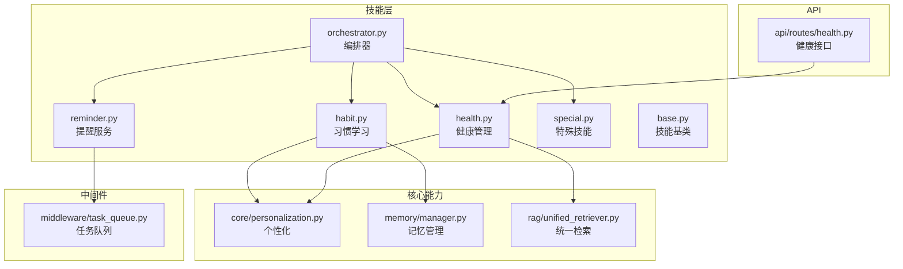
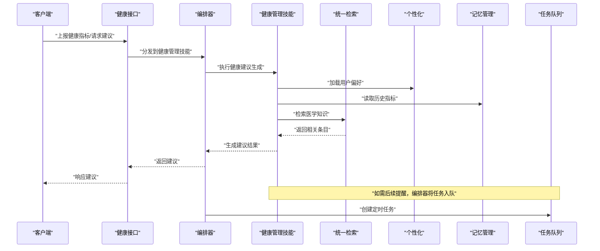
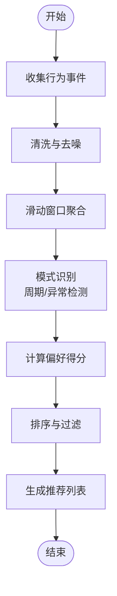
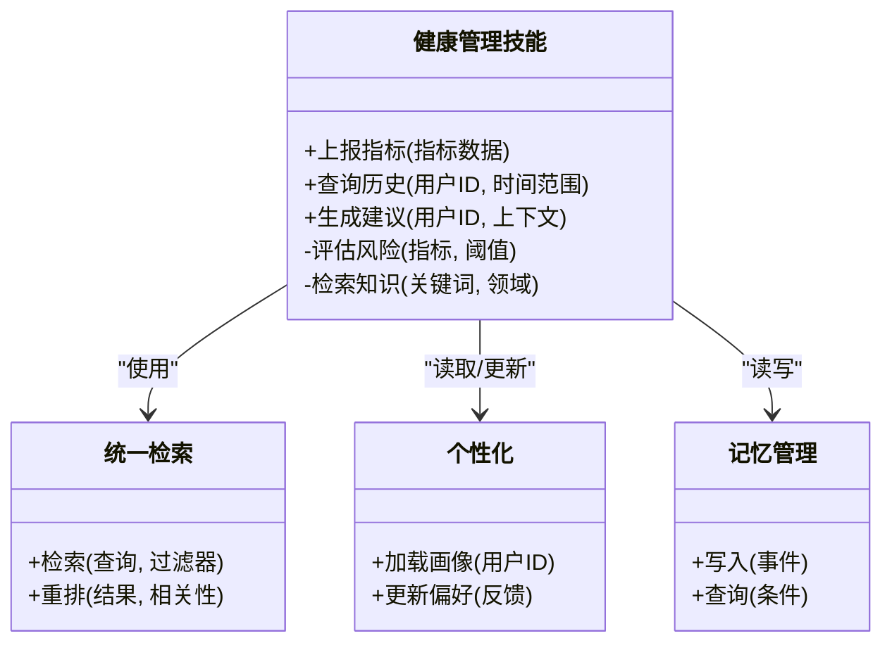
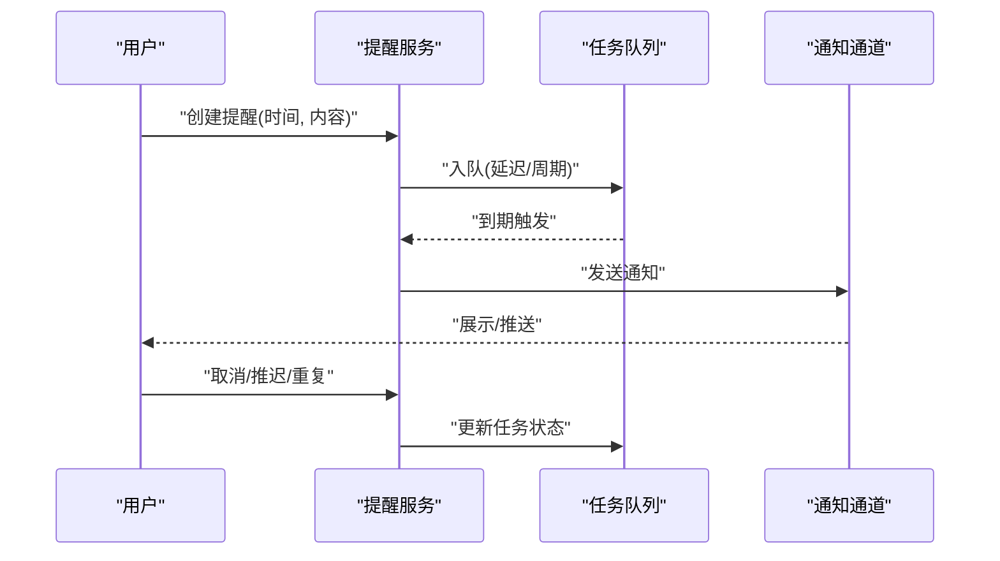
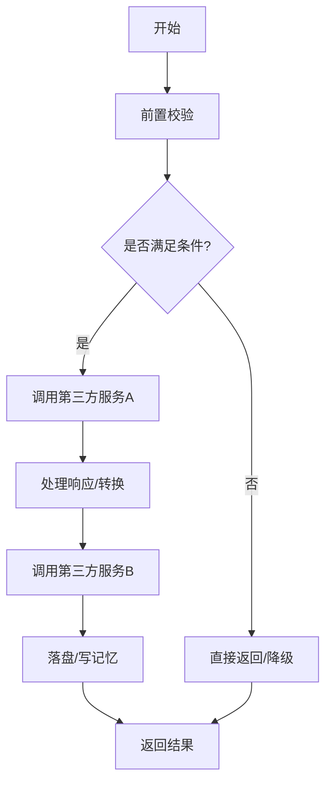
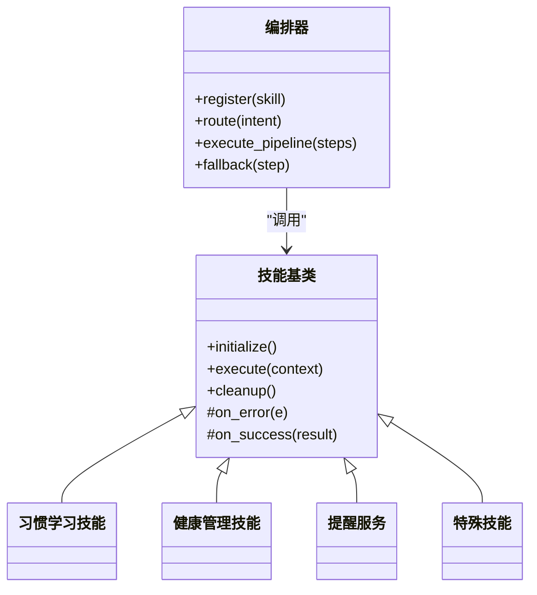
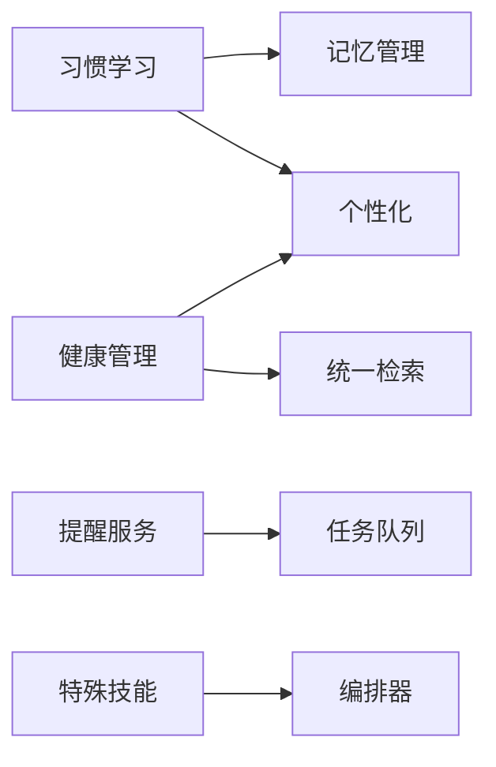

# 特殊功能技能

<cite>
**本文引用的文件**   
- [backend_design/nexus/skills/habit.py](file://backend_design/nexus/skills/habit.py)
- [backend_design/nexus/skills/health.py](file://backend_design/nexus/skills/health.py)
- [backend_design/nexus/skills/reminder.py](file://backend_design/nexus/skills/reminder.py)
- [backend_design/nexus/skills/special.py](file://backend_design/nexus/skills/special.py)
- [backend_design/nexus/skills/orchestrator.py](file://backend_design/nexus/skills/orchestrator.py)
- [backend_design/nexus/skills/base.py](file://backend_design/nexus/skills/base.py)
- [backend_design/nexus/core/personalization.py](file://backend_design/nexus/core/personalization.py)
- [backend_design/nexus/middleware/task_queue.py](file://backend_design/nexus/middleware/task_queue.py)
- [backend_design/nexus/api/routes/health.py](file://backend_design/nexus/api/routes/health.py)
- [backend_design/nexus/memory/manager.py](file://backend_design/nexus/memory/manager.py)
- [backend_design/nexus/rag/unified_retriever.py](file://backend_design/nexus/rag/unified_retriever.py)
- [backend_design/nexus/config.py](file://backend_design/nexus/config.py)
</cite>

## 目录
1. [简介](#简介)
2. [项目结构](#项目结构)
3. [核心组件](#核心组件)
4. [架构总览](#架构总览)
5. [详细组件分析](#详细组件分析)
6. [依赖分析](#依赖分析)
7. [性能考虑](#性能考虑)
8. [故障排查指南](#故障排查指南)
9. [结论](#结论)
10. [附录](#附录)

## 简介
本技术文档聚焦“特殊功能技能”，涵盖以下能力：
- 习惯学习技能：用户行为分析与偏好建模，包括数据收集、模式识别与个性化推荐。
- 健康管理技能：健康指标监控、健康建议生成与医疗知识检索。
- 提醒服务：时间调度、通知推送与用户交互设计。
- 特殊技能：复杂业务场景处理与第三方服务集成。
同时提供配置选项、扩展点与性能调优指南，帮助开发者快速理解并扩展这些技能。

## 项目结构
特殊功能技能位于后端模块的 skills 子系统中，围绕统一编排器 orchestrator 进行注册与调度；各技能遵循 base 基类契约，并通过 core.personalization、memory.manager、rag.unified_retriever 等共享能力完成个性化、记忆与检索增强。

图表来源
- [backend_design/nexus/skills/orchestrator.py](file://backend_design/nexus/skills/orchestrator.py)
- [backend_design/nexus/skills/base.py](file://backend_design/nexus/skills/base.py)
- [backend_design/nexus/skills/habit.py](file://backend_design/nexus/skills/habit.py)
- [backend_design/nexus/skills/health.py](file://backend_design/nexus/skills/health.py)
- [backend_design/nexus/skills/reminder.py](file://backend_design/nexus/skills/reminder.py)
- [backend_design/nexus/skills/special.py](file://backend_design/nexus/skills/special.py)
- [backend_design/nexus/core/personalization.py](file://backend_design/nexus/core/personalization.py)
- [backend_design/nexus/memory/manager.py](file://backend_design/nexus/memory/manager.py)
- [backend_design/nexus/rag/unified_retriever.py](file://backend_design/nexus/rag/unified_retriever.py)
- [backend_design/nexus/middleware/task_queue.py](file://backend_design/nexus/middleware/task_queue.py)
- [backend_design/nexus/api/routes/health.py](file://backend_design/nexus/api/routes/health.py)

章节来源
- [backend_design/nexus/skills/orchestrator.py](file://backend_design/nexus/skills/orchestrator.py)
- [backend_design/nexus/skills/base.py](file://backend_design/nexus/skills/base.py)

## 核心组件
- 技能基类（base）：定义技能生命周期、上下文传递、错误处理与可插拔钩子，确保各技能具备一致的调用契约。
- 编排器（orchestrator）：负责技能的注册、发现、路由与执行顺序控制，支持并发与降级策略。
- 个性化（personalization）：维护用户画像与偏好权重，为习惯学习与健康建议提供个性化输入。
- 记忆管理（memory.manager）：持久化与查询用户历史行为与事件，支撑模式识别与长期偏好演化。
- 统一检索（unified_retriever）：聚合多源知识库（向量、图、外部 API），用于健康建议与医疗知识检索。
- 任务队列（task_queue）：异步任务调度与重试，支撑提醒服务的定时触发与通知推送。
- 健康接口（api/routes/health.py）：对外暴露健康指标上报、查询与建议获取的 REST 端点。

章节来源
- [backend_design/nexus/skills/base.py](file://backend_design/nexus/skills/base.py)
- [backend_design/nexus/skills/orchestrator.py](file://backend_design/nexus/skills/orchestrator.py)
- [backend_design/nexus/core/personalization.py](file://backend_design/nexus/core/personalization.py)
- [backend_design/nexus/memory/manager.py](file://backend_design/nexus/memory/manager.py)
- [backend_design/nexus/rag/unified_retriever.py](file://backend_design/nexus/rag/unified_retriever.py)
- [backend_design/nexus/middleware/task_queue.py](file://backend_design/nexus/middleware/task_queue.py)
- [backend_design/nexus/api/routes/health.py](file://backend_design/nexus/api/routes/health.py)

## 架构总览
特殊功能技能通过编排器统一接入，按意图或事件触发相应技能。习惯学习从记忆与个性化中读取用户画像，结合行为序列进行模式识别与推荐；健康管理在接收指标后，调用统一检索获取医学依据，并结合个性化生成建议；提醒服务基于任务队列实现时间调度与通知；特殊技能封装复杂流程与第三方集成，由编排器协调。

图表来源
- [backend_design/nexus/api/routes/health.py](file://backend_design/nexus/api/routes/health.py)
- [backend_design/nexus/skills/orchestrator.py](file://backend_design/nexus/skills/orchestrator.py)
- [backend_design/nexus/skills/health.py](file://backend_design/nexus/skills/health.py)
- [backend_design/nexus/rag/unified_retriever.py](file://backend_design/nexus/rag/unified_retriever.py)
- [backend_design/nexus/core/personalization.py](file://backend_design/nexus/core/personalization.py)
- [backend_design/nexus/memory/manager.py](file://backend_design/nexus/memory/manager.py)
- [backend_design/nexus/middleware/task_queue.py](file://backend_design/nexus/middleware/task_queue.py)

## 详细组件分析

### 习惯学习技能（habit.py）
- 目标：对用户行为序列进行采集、清洗与模式识别，构建偏好模型，输出个性化推荐。
- 数据收集：从记忆管理与会话上下文中抽取行为事件（如访问、点击、停留时长、时段分布）。
- 模式识别：基于滑动窗口与频次统计，识别周期性习惯与异常偏离；结合个性化权重对候选动作排序。
- 推荐机制：根据最近 N 次行为与偏好得分，生成 Top-K 推荐项，支持冷启动回退策略。
- 扩展点：自定义特征工程函数、相似度度量与阈值参数，便于适配不同业务域。

图表来源
- [backend_design/nexus/skills/habit.py](file://backend_design/nexus/skills/habit.py)
- [backend_design/nexus/memory/manager.py](file://backend_design/nexus/memory/manager.py)
- [backend_design/nexus/core/personalization.py](file://backend_design/nexus/core/personalization.py)

章节来源
- [backend_design/nexus/skills/habit.py](file://backend_design/nexus/skills/habit.py)
- [backend_design/nexus/memory/manager.py](file://backend_design/nexus/memory/manager.py)
- [backend_design/nexus/core/personalization.py](file://backend_design/nexus/core/personalization.py)

### 健康管理技能（health.py）
- 目标：监控健康指标、生成个性化健康建议，并提供医疗知识检索。
- 指标监控：接收心率、血压、睡眠等指标，写入记忆并触发阈值告警。
- 建议生成：结合个性化偏好与历史趋势，调用统一检索获取权威知识，综合生成建议。
- 知识检索：通过统一检索聚合向量库与图谱，返回高相关度条目，供建议生成参考。
- 交互设计：支持增量更新与确认反馈，用户可对建议进行点赞/忽略以优化模型。

图表来源
- [backend_design/nexus/skills/health.py](file://backend_design/nexus/skills/health.py)
- [backend_design/nexus/rag/unified_retriever.py](file://backend_design/nexus/rag/unified_retriever.py)
- [backend_design/nexus/core/personalization.py](file://backend_design/nexus/core/personalization.py)
- [backend_design/nexus/memory/manager.py](file://backend_design/nexus/memory/manager.py)

章节来源
- [backend_design/nexus/skills/health.py](file://backend_design/nexus/skills/health.py)
- [backend_design/nexus/rag/unified_retriever.py](file://backend_design/nexus/rag/unified_retriever.py)
- [backend_design/nexus/core/personalization.py](file://backend_design/nexus/core/personalization.py)
- [backend_design/nexus/memory/manager.py](file://backend_design/nexus/memory/manager.py)

### 提醒服务（reminder.py）
- 时间调度：基于任务队列实现延迟与周期任务，支持时区与节假日规则。
- 通知推送：将提醒事件转换为消息通道（站内、邮件、短信等），支持模板与优先级。
- 用户交互：提供取消、推迟、重复设置等交互入口，记录用户选择以优化后续调度。
- 可靠性：失败重试、幂等键与死信队列，保障提醒送达率与一致性。

图表来源
- [backend_design/nexus/skills/reminder.py](file://backend_design/nexus/skills/reminder.py)
- [backend_design/nexus/middleware/task_queue.py](file://backend_design/nexus/middleware/task_queue.py)

章节来源
- [backend_design/nexus/skills/reminder.py](file://backend_design/nexus/skills/reminder.py)
- [backend_design/nexus/middleware/task_queue.py](file://backend_design/nexus/middleware/task_queue.py)

### 特殊技能（special.py）
- 目标：封装复杂业务场景与第三方服务集成，提供可组合的流程节点。
- 典型场景：跨系统数据同步、审批流、风控校验、外部 API 调用与补偿。
- 编排方式：由编排器串联多个步骤，支持并行分支、条件分支与回滚。
- 容错与降级：超时、熔断、重试与缓存回退，保证关键路径可用性。

图表来源
- [backend_design/nexus/skills/special.py](file://backend_design/nexus/skills/special.py)
- [backend_design/nexus/skills/orchestrator.py](file://backend_design/nexus/skills/orchestrator.py)

章节来源
- [backend_design/nexus/skills/special.py](file://backend_design/nexus/skills/special.py)
- [backend_design/nexus/skills/orchestrator.py](file://backend_design/nexus/skills/orchestrator.py)

### 编排器与基类（orchestrator.py, base.py）
- 基类契约：定义技能初始化、执行、清理与错误处理钩子，统一日志与指标埋点。
- 编排器职责：注册表维护、路由决策、并发控制、超时与熔断、结果合并与降级。
- 扩展点：新增技能只需实现基类接口并在注册表中声明，即可被编排器自动发现与调度。

图表来源
- [backend_design/nexus/skills/base.py](file://backend_design/nexus/skills/base.py)
- [backend_design/nexus/skills/orchestrator.py](file://backend_design/nexus/skills/orchestrator.py)
- [backend_design/nexus/skills/habit.py](file://backend_design/nexus/skills/habit.py)
- [backend_design/nexus/skills/health.py](file://backend_design/nexus/skills/health.py)
- [backend_design/nexus/skills/reminder.py](file://backend_design/nexus/skills/reminder.py)
- [backend_design/nexus/skills/special.py](file://backend_design/nexus/skills/special.py)

章节来源
- [backend_design/nexus/skills/base.py](file://backend_design/nexus/skills/base.py)
- [backend_design/nexus/skills/orchestrator.py](file://backend_design/nexus/skills/orchestrator.py)

## 依赖分析
- 内部依赖：
  - 习惯学习依赖个性化与记忆管理，用于画像与历史行为。
  - 健康管理依赖统一检索与个性化，用于知识获取与偏好融合。
  - 提醒服务依赖任务队列，用于时间调度与可靠投递。
  - 特殊技能依赖编排器，用于流程编排与容错。
- 外部依赖：
  - 第三方服务（如外部 API、消息通道）通过特殊技能与提醒服务集成。
  - 知识库与向量/图存储通过统一检索抽象。

图表来源
- [backend_design/nexus/skills/habit.py](file://backend_design/nexus/skills/habit.py)
- [backend_design/nexus/skills/health.py](file://backend_design/nexus/skills/health.py)
- [backend_design/nexus/skills/reminder.py](file://backend_design/nexus/skills/reminder.py)
- [backend_design/nexus/skills/special.py](file://backend_design/nexus/skills/special.py)
- [backend_design/nexus/skills/orchestrator.py](file://backend_design/nexus/skills/orchestrator.py)
- [backend_design/nexus/core/personalization.py](file://backend_design/nexus/core/personalization.py)
- [backend_design/nexus/memory/manager.py](file://backend_design/nexus/memory/manager.py)
- [backend_design/nexus/rag/unified_retriever.py](file://backend_design/nexus/rag/unified_retriever.py)
- [backend_design/nexus/middleware/task_queue.py](file://backend_design/nexus/middleware/task_queue.py)

章节来源
- [backend_design/nexus/skills/habit.py](file://backend_design/nexus/skills/habit.py)
- [backend_design/nexus/skills/health.py](file://backend_design/nexus/skills/health.py)
- [backend_design/nexus/skills/reminder.py](file://backend_design/nexus/skills/reminder.py)
- [backend_design/nexus/skills/special.py](file://backend_design/nexus/skills/special.py)
- [backend_design/nexus/skills/orchestrator.py](file://backend_design/nexus/skills/orchestrator.py)
- [backend_design/nexus/core/personalization.py](file://backend_design/nexus/core/personalization.py)
- [backend_design/nexus/memory/manager.py](file://backend_design/nexus/memory/manager.py)
- [backend_design/nexus/rag/unified_retriever.py](file://backend_design/nexus/rag/unified_retriever.py)
- [backend_design/nexus/middleware/task_queue.py](file://backend_design/nexus/middleware/task_queue.py)

## 性能考虑
- 批量与批处理：习惯学习的行为聚合采用滑动窗口与批处理，降低频繁 IO 开销。
- 缓存与预取：个性化画像与健康建议结果可缓存，减少重复计算与检索成本。
- 异步与并发：提醒服务与特殊技能的外部调用采用异步与并发，提升吞吐。
- 限流与熔断：对第三方服务与检索接口实施限流与熔断，避免雪崩。
- 索引与分片：记忆与检索层应使用合适索引与分片策略，提高查询效率。
- 资源隔离：不同技能使用独立线程池或进程池，避免相互影响。

[本节为通用指导，不直接分析具体文件]

## 故障排查指南
- 常见问题定位：
  - 习惯学习推荐不准：检查个性化权重更新与记忆数据完整性。
  - 健康建议缺失：验证统一检索连通性与知识库覆盖度。
  - 提醒未送达：查看任务队列积压、重试次数与死信队列。
  - 特殊技能失败：关注第三方服务超时、熔断与补偿逻辑。
- 日志与指标：
  - 启用技能级日志与关键路径埋点，记录耗时与错误码。
  - 监控任务队列长度、重试率与成功率。
- 恢复策略：
  - 对幂等任务进行重放；对非幂等任务引入去重键。
  - 对检索与外部服务启用降级与缓存回退。

章节来源
- [backend_design/nexus/skills/orchestrator.py](file://backend_design/nexus/skills/orchestrator.py)
- [backend_design/nexus/middleware/task_queue.py](file://backend_design/nexus/middleware/task_queue.py)
- [backend_design/nexus/rag/unified_retriever.py](file://backend_design/nexus/rag/unified_retriever.py)

## 结论
特殊功能技能通过统一的编排与基类契约，实现了可扩展、可观测与高可用的能力体系。习惯学习、健康管理、提醒服务与特殊技能分别聚焦用户行为建模、健康建议与知识检索、时间调度与通知、复杂流程与第三方集成。配合个性化、记忆与统一检索等核心能力，形成完整的闭环体验。建议在部署中重视缓存、异步与熔断策略，持续优化性能与稳定性。

[本节为总结性内容，不直接分析具体文件]

## 附录
- 配置选项（示例字段，实际以配置文件为准）：
  - 个性化：偏好权重、冷启动策略、更新频率。
  - 记忆：保留周期、压缩策略、索引类型。
  - 检索：召回数量、重排算法、超时与重试。
  - 任务队列：并发度、最大重试次数、死信策略。
  - 特殊技能：第三方服务超时、熔断阈值、降级开关。
- 扩展点：
  - 新增技能：实现基类接口并在编排器注册。
  - 自定义特征与相似度：在习惯学习中注入新算法。
  - 自定义通知通道：在提醒服务中扩展消息提供者。
  - 自定义检索后端：在统一检索中注册新的存储适配器。
- 性能调优清单：
  - 调整批大小与窗口长度，平衡实时性与吞吐。
  - 预热常用画像与热点建议，减少冷启动延迟。
  - 合理设置并发与队列深度，避免内存与 CPU 抖动。
  - 对第三方服务增加连接池与超时保护。

章节来源
- [backend_design/nexus/config.py](file://backend_design/nexus/config.py)
- [backend_design/nexus/skills/base.py](file://backend_design/nexus/skills/base.py)
- [backend_design/nexus/skills/orchestrator.py](file://backend_design/nexus/skills/orchestrator.py)
- [backend_design/nexus/skills/habit.py](file://backend_design/nexus/skills/habit.py)
- [backend_design/nexus/skills/health.py](file://backend_design/nexus/skills/health.py)
- [backend_design/nexus/skills/reminder.py](file://backend_design/nexus/skills/reminder.py)
- [backend_design/nexus/skills/special.py](file://backend_design/nexus/skills/special.py)
- [backend_design/nexus/core/personalization.py](file://backend_design/nexus/core/personalization.py)
- [backend_design/nexus/memory/manager.py](file://backend_design/nexus/memory/manager.py)
- [backend_design/nexus/rag/unified_retriever.py](file://backend_design/nexus/rag/unified_retriever.py)
- [backend_design/nexus/middleware/task_queue.py](file://backend_design/nexus/middleware/task_queue.py)