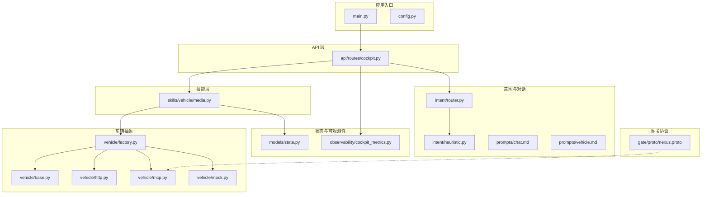
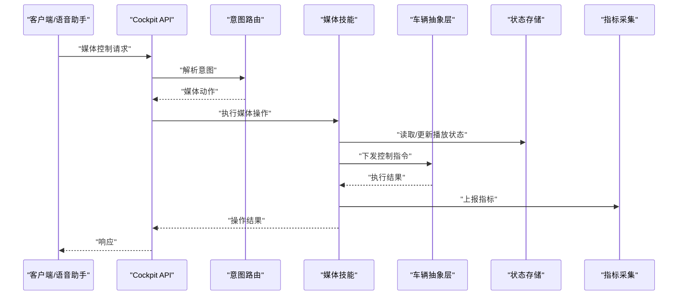
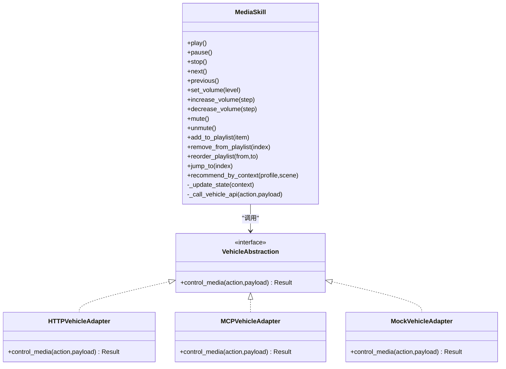
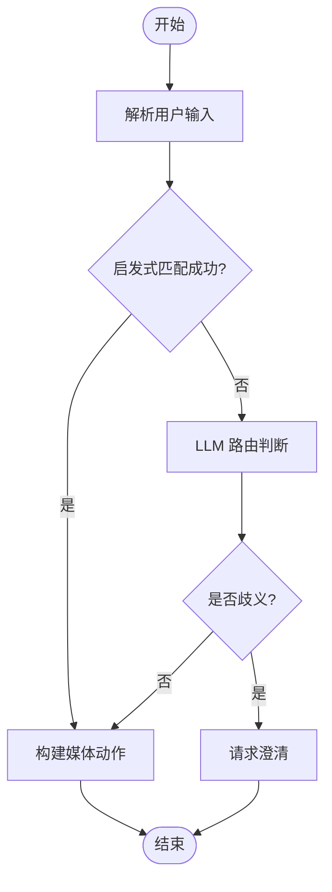
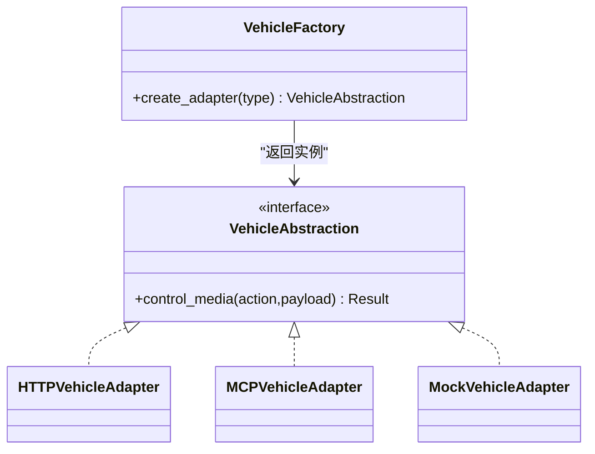
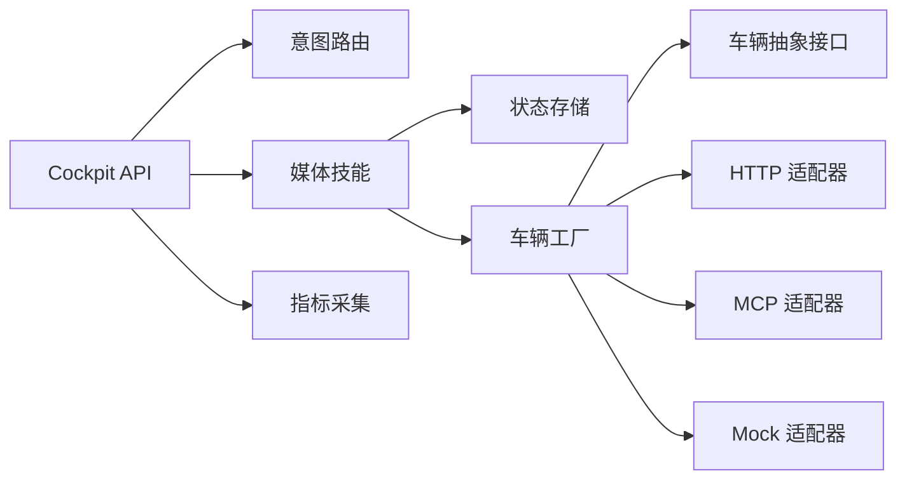

# 媒体播放控制

<cite>
**本文引用的文件**   
- [backend_design/nexus/skills/vehicle/media.py](file://backend_design/nexus/skills/vehicle/media.py)
- [backend_design/nexus/api/routes/cockpit.py](file://backend_design/nexus/api/routes/cockpit.py)
- [backend_design/nexus/core/cockpit_manager.py](file://backend_design/nexus/core/cockpit_manager.py)
- [backend_design/nexus/models/state.py](file://backend_design/nexus/models/state.py)
- [backend_design/nexus/config.py](file://backend_design/nexus/config.py)
- [backend_design/nexus/main.py](file://backend_design/nexus/main.py)
- [backend_design/nexus/intent/router.py](file://backend_design/nexus/intent/router.py)
- [backend_design/nexus/intent/heuristic.py](file://backend_design/nexus/intent/heuristic.py)
- [backend_design/nexus/vehicle/base.py](file://backend_design/nexus/vehicle/base.py)
- [backend_design/nexus/vehicle/factory.py](file://backend_design/nexus/vehicle/factory.py)
- [backend_design/nexus/vehicle/http.py](file://backend_design/nexus/vehicle/http.py)
- [backend_design/nexus/vehicle/mcp.py](file://backend_design/nexus/vehicle/mcp.py)
- [backend_design/nexus/vehicle/mock.py](file://backend_design/nexus/vehicle/mock.py)
- [backend_design/nexus/middleware/task_queue.py](file://backend_design/nexus/middleware/task_queue.py)
- [backend_design/nexus/observability/cockpit_metrics.py](file://backend_design/nexus/observability/cockpit_metrics.py)
- [backend_design/nexus/prompts/chat.md](file://backend_design/nexus/prompts/chat.md)
- [backend_design/nexus/prompts/vehicle.md](file://backend_design/nexus/prompts/vehicle.md)
- [backend_design/nexus/gate/proto/nexus.proto](file://backend_design/nexus/gate/proto/nexus.proto)
</cite>

## 目录
1. [简介](#简介)
2. [项目结构](#项目结构)
3. [核心组件](#核心组件)
4. [架构总览](#架构总览)
5. [详细组件分析](#详细组件分析)
6. [依赖关系分析](#依赖关系分析)
7. [性能与延迟优化](#性能与延迟优化)
8. [故障排查指南](#故障排查指南)
9. [结论](#结论)
10. [附录：API 接口规范](#附录api-接口规范)

## 简介
本技术文档聚焦于“媒体播放控制系统”的实现与集成，覆盖音频源管理、播放控制（播放/暂停/下一首/上一首）、音量调节、曲目切换、播放列表管理与智能推荐等能力。同时说明与车载娱乐系统的集成方式与通信协议，给出媒体控制的 API 接口规范，并提供音频流处理与延迟优化的技术方案建议。

## 项目结构
本项目采用分层与按领域组织相结合的结构。与媒体播放相关的关键模块位于后端设计目录中，包括技能层（skills）、意图路由（intent）、车辆抽象（vehicle）、状态模型（models/state）以及网关协议定义（gate/proto）。

图表来源
- [backend_design/nexus/main.py](file://backend_design/nexus/main.py)
- [backend_design/nexus/config.py](file://backend_design/nexus/config.py)
- [backend_design/nexus/api/routes/cockpit.py](file://backend_design/nexus/api/routes/cockpit.py)
- [backend_design/nexus/skills/vehicle/media.py](file://backend_design/nexus/skills/vehicle/media.py)
- [backend_design/nexus/intent/router.py](file://backend_design/nexus/intent/router.py)
- [backend_design/nexus/intent/heuristic.py](file://backend_design/nexus/intent/heuristic.py)
- [backend_design/nexus/vehicle/base.py](file://backend_design/nexus/vehicle/base.py)
- [backend_design/nexus/vehicle/factory.py](file://backend_design/nexus/vehicle/factory.py)
- [backend_design/nexus/vehicle/http.py](file://backend_design/nexus/vehicle/http.py)
- [backend_design/nexus/vehicle/mcp.py](file://backend_design/nexus/vehicle/mcp.py)
- [backend_design/nexus/vehicle/mock.py](file://backend_design/nexus/vehicle/mock.py)
- [backend_design/nexus/models/state.py](file://backend_design/nexus/models/state.py)
- [backend_design/nexus/observability/cockpit_metrics.py](file://backend_design/nexus/observability/cockpit_metrics.py)
- [backend_design/nexus/gate/proto/nexus.proto](file://backend_design/nexus/gate/proto/nexus.proto)

章节来源
- [backend_design/nexus/main.py](file://backend_design/nexus/main.py)
- [backend_design/nexus/config.py](file://backend_design/nexus/config.py)
- [backend_design/nexus/api/routes/cockpit.py](file://backend_design/nexus/api/routes/cockpit.py)
- [backend_design/nexus/skills/vehicle/media.py](file://backend_design/nexus/skills/vehicle/media.py)
- [backend_design/nexus/intent/router.py](file://backend_design/nexus/intent/router.py)
- [backend_design/nexus/intent/heuristic.py](file://backend_design/nexus/intent/heuristic.py)
- [backend_design/nexus/vehicle/base.py](file://backend_design/nexus/vehicle/base.py)
- [backend_design/nexus/vehicle/factory.py](file://backend_design/nexus/vehicle/factory.py)
- [backend_design/nexus/vehicle/http.py](file://backend_design/nexus/vehicle/http.py)
- [backend_design/nexus/vehicle/mcp.py](file://backend_design/nexus/vehicle/mcp.py)
- [backend_design/nexus/vehicle/mock.py](file://backend_design/nexus/vehicle/mock.py)
- [backend_design/nexus/models/state.py](file://backend_design/nexus/models/state.py)
- [backend_design/nexus/observability/cockpit_metrics.py](file://backend_design/nexus/observability/cockpit_metrics.py)
- [backend_design/nexus/gate/proto/nexus.proto](file://backend_design/nexus/gate/proto/nexus.proto)

## 核心组件
- 媒体技能（Media Skill）
  - 职责：封装媒体播放相关的业务逻辑，包括播放/暂停、上下曲、音量调节、播放列表操作、推荐触发等；维护当前播放上下文与状态。
  - 关键能力：
    - 音频源管理：支持本地资源、在线流、车载系统音源等统一接入。
    - 播放控制：播放、暂停、停止、下一首、上一首、随机/循环模式。
    - 音量调节：设置绝对音量或相对增减，支持静音切换。
    - 播放列表：创建、追加、删除、跳转、重排。
    - 智能推荐：基于用户偏好、历史与场景的推荐策略。
- 车辆抽象层（Vehicle Abstraction）
  - 职责：屏蔽不同车载娱乐系统实现差异，提供统一的媒体控制接口。
  - 实现方式：HTTP 调用、MCP 协议、Mock 适配器等。
- 意图路由与启发式解析
  - 职责：将自然语言指令解析为媒体控制动作，结合规则与 LLM 路由进行决策。
- 状态与配置
  - 职责：集中管理播放状态、设备信息、功能开关与阈值等。
- 可观测性与指标
  - 职责：采集媒体控制时延、错误率、成功率等指标，支撑监控与告警。

章节来源
- [backend_design/nexus/skills/vehicle/media.py](file://backend_design/nexus/skills/vehicle/media.py)
- [backend_design/nexus/vehicle/base.py](file://backend_design/nexus/vehicle/base.py)
- [backend_design/nexus/vehicle/factory.py](file://backend_design/nexus/vehicle/factory.py)
- [backend_design/nexus/vehicle/http.py](file://backend_design/nexus/vehicle/http.py)
- [backend_design/nexus/vehicle/mcp.py](file://backend_design/nexus/vehicle/mcp.py)
- [backend_design/nexus/vehicle/mock.py](file://backend_design/nexus/vehicle/mock.py)
- [backend_design/nexus/intent/router.py](file://backend_design/nexus/intent/router.py)
- [backend_design/nexus/intent/heuristic.py](file://backend_design/nexus/intent/heuristic.py)
- [backend_design/nexus/models/state.py](file://backend_design/nexus/models/state.py)
- [backend_design/nexus/observability/cockpit_metrics.py](file://backend_design/nexus/observability/cockpit_metrics.py)

## 架构总览
媒体播放控制的整体流程如下：前端或语音助手通过 API 发起媒体控制请求，API 层根据意图路由到媒体技能；媒体技能调用车辆抽象层执行具体控制；状态更新后返回结果并记录指标。

图表来源
- [backend_design/nexus/api/routes/cockpit.py](file://backend_design/nexus/api/routes/cockpit.py)
- [backend_design/nexus/intent/router.py](file://backend_design/nexus/intent/router.py)
- [backend_design/nexus/skills/vehicle/media.py](file://backend_design/nexus/skills/vehicle/media.py)
- [backend_design/nexus/vehicle/base.py](file://backend_design/nexus/vehicle/base.py)
- [backend_design/nexus/models/state.py](file://backend_design/nexus/models/state.py)
- [backend_design/nexus/observability/cockpit_metrics.py](file://backend_design/nexus/observability/cockpit_metrics.py)

## 详细组件分析

### 媒体技能（Media Skill）
- 设计要点
  - 以“技能”形式暴露媒体能力，便于被意图路由与上层 API 调用。
  - 内部维护播放上下文（当前曲目、队列、模式、音量等），保证幂等与一致性。
  - 对异常进行统一处理，确保在车载系统不可用时降级为 Mock 或缓存策略。
- 关键方法（概念性描述）
  - 播放控制：play/pause/stop/next/previous
  - 音量控制：set_volume/increase/decrease/mute/unmute
  - 播放列表：add/remove/reorder/jump_to
  - 推荐触发：recommend_by_context(user_profile, scene)
- 数据流
  - 输入：用户指令或 API 参数
  - 处理：校验参数、更新状态、调用车辆抽象层
  - 输出：统一响应体（包含状态码、消息、播放上下文快照）

图表来源
- [backend_design/nexus/skills/vehicle/media.py](file://backend_design/nexus/skills/vehicle/media.py)
- [backend_design/nexus/vehicle/base.py](file://backend_design/nexus/vehicle/base.py)
- [backend_design/nexus/vehicle/http.py](file://backend_design/nexus/vehicle/http.py)
- [backend_design/nexus/vehicle/mcp.py](file://backend_design/nexus/vehicle/mcp.py)
- [backend_design/nexus/vehicle/mock.py](file://backend_design/nexus/vehicle/mock.py)

章节来源
- [backend_design/nexus/skills/vehicle/media.py](file://backend_design/nexus/skills/vehicle/media.py)
- [backend_design/nexus/vehicle/base.py](file://backend_design/nexus/vehicle/base.py)
- [backend_design/nexus/vehicle/http.py](file://backend_design/nexus/vehicle/http.py)
- [backend_design/nexus/vehicle/mcp.py](file://backend_design/nexus/vehicle/mcp.py)
- [backend_design/nexus/vehicle/mock.py](file://backend_design/nexus/vehicle/mock.py)

### 意图路由与启发式解析
- 设计要点
  - 将自然语言指令映射为媒体控制动作，优先使用启发式规则快速匹配，必要时交由 LLM 路由增强理解。
  - 支持多轮澄清与容错，避免误判导致错误的媒体操作。
- 关键流程
  - 接收用户文本
  - 启发式规则匹配（关键词、句式、上下文）
  - 若不确定则进入 LLM 路由
  - 输出结构化动作（如：{"action":"next","source":"radio"}）

图表来源
- [backend_design/nexus/intent/router.py](file://backend_design/nexus/intent/router.py)
- [backend_design/nexus/intent/heuristic.py](file://backend_design/nexus/intent/heuristic.py)
- [backend_design/nexus/prompts/chat.md](file://backend_design/nexus/prompts/chat.md)
- [backend_design/nexus/prompts/vehicle.md](file://backend_design/nexus/prompts/vehicle.md)

章节来源
- [backend_design/nexus/intent/router.py](file://backend_design/nexus/intent/router.py)
- [backend_design/nexus/intent/heuristic.py](file://backend_design/nexus/intent/heuristic.py)
- [backend_design/nexus/prompts/chat.md](file://backend_design/nexus/prompts/chat.md)
- [backend_design/nexus/prompts/vehicle.md](file://backend_design/nexus/prompts/vehicle.md)

### 车辆抽象层与适配器
- 设计要点
  - 通过工厂模式选择具体适配器（HTTP/MCP/Mock），屏蔽底层差异。
  - 所有媒体控制均通过统一接口下发，便于测试与替换。
- 适配器职责
  - HTTP 适配器：通过 REST 接口与车载娱乐系统通信。
  - MCP 适配器：通过 MCP 协议与车载系统交互。
  - Mock 适配器：用于开发与联调阶段模拟行为。

图表来源
- [backend_design/nexus/vehicle/factory.py](file://backend_design/nexus/vehicle/factory.py)
- [backend_design/nexus/vehicle/base.py](file://backend_design/nexus/vehicle/base.py)
- [backend_design/nexus/vehicle/http.py](file://backend_design/nexus/vehicle/http.py)
- [backend_design/nexus/vehicle/mcp.py](file://backend_design/nexus/vehicle/mcp.py)
- [backend_design/nexus/vehicle/mock.py](file://backend_design/nexus/vehicle/mock.py)

章节来源
- [backend_design/nexus/vehicle/factory.py](file://backend_design/nexus/vehicle/factory.py)
- [backend_design/nexus/vehicle/base.py](file://backend_design/nexus/vehicle/base.py)
- [backend_design/nexus/vehicle/http.py](file://backend_design/nexus/vehicle/http.py)
- [backend_design/nexus/vehicle/mcp.py](file://backend_design/nexus/vehicle/mcp.py)
- [backend_design/nexus/vehicle/mock.py](file://backend_design/nexus/vehicle/mock.py)

### 状态与配置
- 播放状态
  - 字段示例：当前曲目 ID、播放列表索引、播放模式（顺序/随机/循环）、音量值、静音标志、源类型（本地/在线/车载）。
  - 变更需原子化更新，保证并发安全。
- 配置项
  - 媒体源白名单、默认音量上限、推荐策略开关、超时与重试次数等。

章节来源
- [backend_design/nexus/models/state.py](file://backend_design/nexus/models/state.py)
- [backend_design/nexus/config.py](file://backend_design/nexus/config.py)

### 可观测性与指标
- 指标维度
  - 媒体控制时延（P50/P95/P99）
  - 成功率/失败率
  - 各适配器调用耗时分布
  - 错误分类（网络超时、车载系统无响应、参数非法等）
- 用途
  - 监控面板展示、告警阈值设定、容量规划与性能优化依据。

章节来源
- [backend_design/nexus/observability/cockpit_metrics.py](file://backend_design/nexus/observability/cockpit_metrics.py)

## 依赖关系分析
媒体播放控制涉及多层依赖：API 层依赖意图路由与媒体技能；媒体技能依赖车辆抽象层；车辆抽象层依赖具体适配器；状态与配置贯穿全链路；指标采集在各关键路径埋点。

图表来源
- [backend_design/nexus/api/routes/cockpit.py](file://backend_design/nexus/api/routes/cockpit.py)
- [backend_design/nexus/intent/router.py](file://backend_design/nexus/intent/router.py)
- [backend_design/nexus/skills/vehicle/media.py](file://backend_design/nexus/skills/vehicle/media.py)
- [backend_design/nexus/vehicle/factory.py](file://backend_design/nexus/vehicle/factory.py)
- [backend_design/nexus/vehicle/base.py](file://backend_design/nexus/vehicle/base.py)
- [backend_design/nexus/vehicle/http.py](file://backend_design/nexus/vehicle/http.py)
- [backend_design/nexus/vehicle/mcp.py](file://backend_design/nexus/vehicle/mcp.py)
- [backend_design/nexus/vehicle/mock.py](file://backend_design/nexus/vehicle/mock.py)
- [backend_design/nexus/observability/cockpit_metrics.py](file://backend_design/nexus/observability/cockpit_metrics.py)

章节来源
- [backend_design/nexus/api/routes/cockpit.py](file://backend_design/nexus/api/routes/cockpit.py)
- [backend_design/nexus/intent/router.py](file://backend_design/nexus/intent/router.py)
- [backend_design/nexus/skills/vehicle/media.py](file://backend_design/nexus/skills/vehicle/media.py)
- [backend_design/nexus/vehicle/factory.py](file://backend_design/nexus/vehicle/factory.py)
- [backend_design/nexus/vehicle/base.py](file://backend_design/nexus/vehicle/base.py)
- [backend_design/nexus/vehicle/http.py](file://backend_design/nexus/vehicle/http.py)
- [backend_design/nexus/vehicle/mcp.py](file://backend_design/nexus/vehicle/mcp.py)
- [backend_design/nexus/vehicle/mock.py](file://backend_design/nexus/vehicle/mock.py)
- [backend_design/nexus/observability/cockpit_metrics.py](file://backend_design/nexus/observability/cockpit_metrics.py)

## 性能与延迟优化
- 异步任务与队列
  - 将耗时操作（如加载长列表、生成推荐）放入任务队列，避免阻塞主线程。
  - 参考任务队列中间件进行调度与重试。
- 连接复用与超时控制
  - HTTP 适配器启用连接池与合理超时；MCP 适配器保持长连接。
- 缓存与预取
  - 对常用播放列表与推荐结果进行短期缓存；在空闲时段预取下一首元数据。
- 批量与合并
  - 批量更新播放列表与音量，减少往返次数。
- 指标驱动优化
  - 基于 P95/P99 时延与错误率定位瓶颈，针对性优化。

章节来源
- [backend_design/nexus/middleware/task_queue.py](file://backend_design/nexus/middleware/task_queue.py)
- [backend_design/nexus/observability/cockpit_metrics.py](file://backend_design/nexus/observability/cockpit_metrics.py)

## 故障排查指南
- 常见问题
  - 车载系统无响应：检查适配器连通性、超时与重试策略。
  - 参数非法：校验输入范围（如音量 0-100）、必填字段。
  - 状态不一致：核对状态更新是否原子化，是否存在并发竞争。
- 诊断步骤
  - 查看指标面板中的错误分类与时延分布。
  - 启用调试日志，追踪从 API 到车辆的完整调用链。
  - 使用 Mock 适配器隔离问题域，确认是否为车载端问题。
- 恢复策略
  - 自动重试与退避；失败回滚到上一稳定状态；降级为本地缓存播放。

章节来源
- [backend_design/nexus/observability/cockpit_metrics.py](file://backend_design/nexus/observability/cockpit_metrics.py)
- [backend_design/nexus/vehicle/mock.py](file://backend_design/nexus/vehicle/mock.py)

## 结论
媒体播放控制系统通过清晰的技能化设计与车辆抽象层，实现了跨平台、可扩展的媒体控制能力。结合意图路由与启发式解析，提升了用户体验；通过指标与任务队列等手段，保障了性能与稳定性。后续可在推荐算法与音频流处理方面持续优化，进一步提升智能化与低延迟体验。

## 附录：API 接口规范
以下接口面向媒体播放控制，供前端或语音助手调用。所有接口返回统一结构：{code, message, data}。

- 播放控制
  - 播放
    - 方法：POST
    - 路径：/api/cockpit/media/play
    - 请求体：{source_type, item_id?, playlist_id?}
    - 响应：{code, message, data:{playing:true, current_item}}
  - 暂停
    - 方法：POST
    - 路径：/api/cockpit/media/pause
    - 请求体：{}
    - 响应：{code, message, data:{playing:false}}
  - 停止
    - 方法：POST
    - 路径：/api/cockpit/media/stop
    - 请求体：{}
    - 响应：{code, message, data:{playing:false, stopped:true}}
  - 下一首
    - 方法：POST
    - 路径：/api/cockpit/media/next
    - 请求体：{}
    - 响应：{code, message, data:{current_item}}
  - 上一首
    - 方法：POST
    - 路径：/api/cockpit/media/previous
    - 请求体：{}
    - 响应：{code, message, data:{current_item}}

- 音量控制
  - 设置音量
    - 方法：POST
    - 路径：/api/cockpit/media/volume/set
    - 请求体：{level: 0-100}
    - 响应：{code, message, data:{volume: level}}
  - 增加音量
    - 方法：POST
    - 路径：/api/cockpit/media/volume/increase
    - 请求体：{step: 1-10}
    - 响应：{code, message, data:{volume: new_level}}
  - 降低音量
    - 方法：POST
    - 路径：/api/cockpit/media/volume/decrease
    - 请求体：{step: 1-10}
    - 响应：{code, message, data:{volume: new_level}}
  - 静音/取消静音
    - 方法：POST
    - 路径：/api/cockpit/media/volume/mute 或 /api/cockpit/media/volume/unmute
    - 请求体：{}
    - 响应：{code, message, data:{muted: true/false}}

- 播放列表
  - 添加曲目
    - 方法：POST
    - 路径：/api/cockpit/media/playlist/add
    - 请求体：{playlist_id, items:[item_id,...]}
    - 响应：{code, message, data:{playlist_id, size}}
  - 删除曲目
    - 方法：POST
    - 路径：/api/cockpit/media/playlist/remove
    - 请求体：{playlist_id, index}
    - 响应：{code, message, data:{playlist_id, size}}
  - 重排
    - 方法：POST
    - 路径：/api/cockpit/media/playlist/reorder
    - 请求体：{playlist_id, from, to}
    - 响应：{code, message, data:{playlist_id}}
  - 跳转到指定位置
    - 方法：POST
    - 路径：/api/cockpit/media/playlist/jump_to
    - 请求体：{playlist_id, index}
    - 响应：{code, message, data:{current_item}}

- 智能推荐
  - 获取推荐
    - 方法：GET
    - 路径：/api/cockpit/media/recommend
    - 查询参数：user_profile_id, scene
    - 响应：{code, message, data:{items:[item_id,...], reason}}

- 状态查询
  - 获取播放状态
    - 方法：GET
    - 路径：/api/cockpit/media/status
    - 响应：{code, message, data:{playing, current_item, volume, muted, mode, source_type}}

- 错误码约定
  - 200：成功
  - 400：参数非法
  - 404：资源不存在
  - 500：服务器内部错误
  - 503：车载系统不可用

- 认证与安全
  - 建议在网关层统一鉴权与限流，媒体接口无需重复鉴权。

章节来源
- [backend_design/nexus/api/routes/cockpit.py](file://backend_design/nexus/api/routes/cockpit.py)
- [backend_design/nexus/skills/vehicle/media.py](file://backend_design/nexus/skills/vehicle/media.py)
- [backend_design/nexus/vehicle/base.py](file://backend_design/nexus/vehicle/base.py)
- [backend_design/nexus/vehicle/http.py](file://backend_design/nexus/vehicle/http.py)
- [backend_design/nexus/vehicle/mcp.py](file://backend_design/nexus/vehicle/mcp.py)
- [backend_design/nexus/vehicle/mock.py](file://backend_design/nexus/vehicle/mock.py)
- [backend_design/nexus/models/state.py](file://backend_design/nexus/models/state.py)
- [backend_design/nexus/observability/cockpit_metrics.py](file://backend_design/nexus/observability/cockpit_metrics.py)