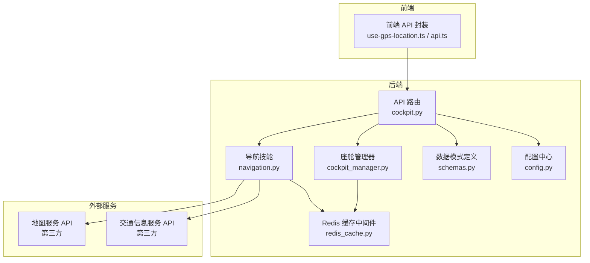
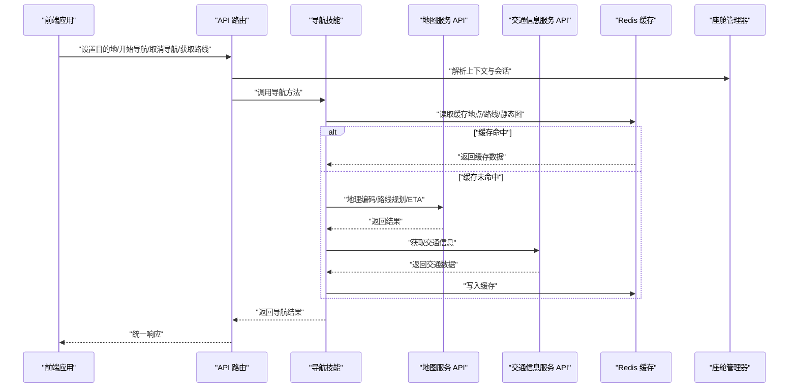
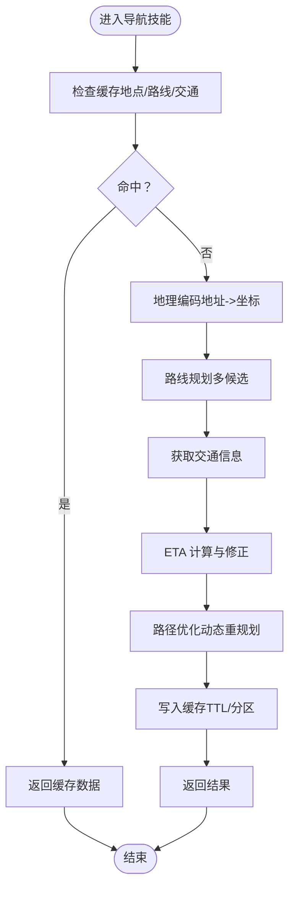
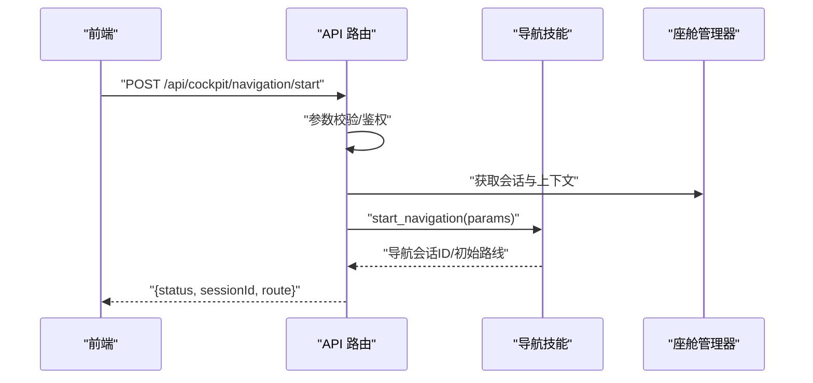
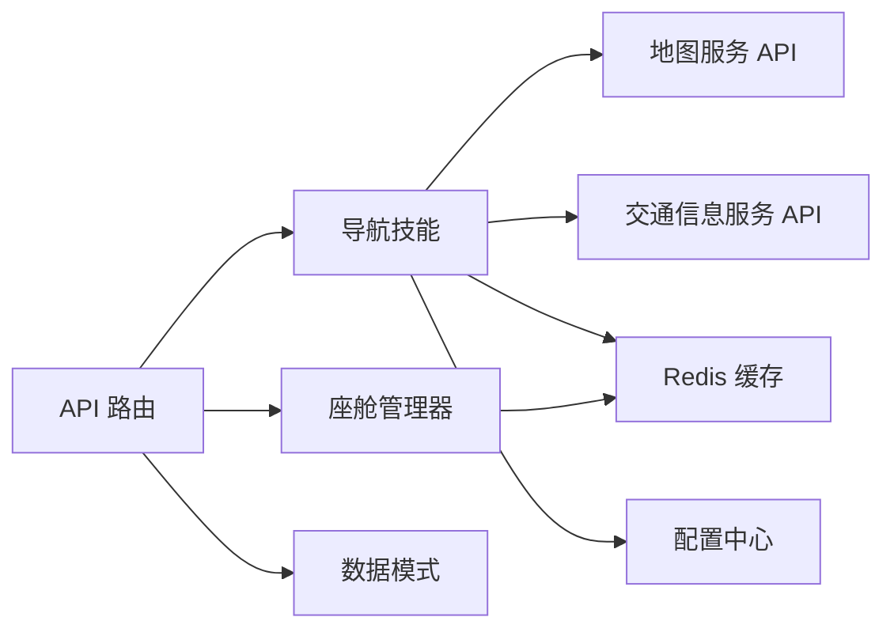

# 导航控制系统

<cite>
**本文引用的文件**   
- [backend_design/nexus/skills/vehicle/navigation.py](file://backend_design/nexus/skills/vehicle/navigation.py)
- [backend_design/nexus/api/routes/cockpit.py](file://backend_design/nexus/api/routes/cockpit.py)
- [backend_design/nexus/core/cockpit_manager.py](file://backend_design/nexus/core/cockpit_manager.py)
- [backend_design/nexus/middleware/redis_cache.py](file://backend_design/nexus/middleware/redis_cache.py)
- [backend_design/nexus/config.py](file://backend_design/nexus/config.py)
- [backend_design/nexus/models/schemas.py](file://backend_design/nexus/models/schemas.py)
- [frontend_design/src/hooks/use-gps-location.ts](file://frontend_design/src/hooks/use-gps-location.ts)
- [frontend_design/src/lib/api.ts](file://frontend_design/src/lib/api.ts)
</cite>

## 目录
1. [简介](#简介)
2. [项目结构](#项目结构)
3. [核心组件](#核心组件)
4. [架构总览](#架构总览)
5. [详细组件分析](#详细组件分析)
6. [依赖关系分析](#依赖关系分析)
7. [性能考虑](#性能考虑)
8. [故障排查指南](#故障排查指南)
9. [结论](#结论)
10. [附录：API 接口规范](#附录api-接口规范)

## 简介
本技术文档面向“导航控制系统”，聚焦于目的地设置、路线规划、实时导航、交通信息获取、与地图服务 API 的集成、地理编码处理、数据缓存策略与离线支持，以及路径优化算法与 ETA 计算的技术实现。文档同时提供导航控制相关 API 接口的详细规范，帮助前后端开发者快速集成与排障。

## 项目结构
本项目采用前后端分离架构：
- 后端（Python）：基于 FastAPI 的服务，包含技能层（skills）、路由层（api/routes）、核心管理（core）、中间件（middleware）、配置（config）、模型与模式定义（models）等模块。
- 前端（Next.js）：提供用户界面与交互逻辑，包括 GPS 定位 Hook、通用 API 调用封装等。

图表来源
- [backend_design/nexus/api/routes/cockpit.py](file://backend_design/nexus/api/routes/cockpit.py)
- [backend_design/nexus/skills/vehicle/navigation.py](file://backend_design/nexus/skills/vehicle/navigation.py)
- [backend_design/nexus/core/cockpit_manager.py](file://backend_design/nexus/core/cockpit_manager.py)
- [backend_design/nexus/middleware/redis_cache.py](file://backend_design/nexus/middleware/redis_cache.py)
- [backend_design/nexus/config.py](file://backend_design/nexus/config.py)
- [backend_design/nexus/models/schemas.py](file://backend_design/nexus/models/schemas.py)
- [frontend_design/src/hooks/use-gps-location.ts](file://frontend_design/src/hooks/use-gps-location.ts)
- [frontend_design/src/lib/api.ts](file://frontend_design/src/lib/api.ts)

章节来源
- [backend_design/nexus/api/routes/cockpit.py](file://backend_design/nexus/api/routes/cockpit.py)
- [backend_design/nexus/skills/vehicle/navigation.py](file://backend_design/nexus/skills/vehicle/navigation.py)
- [backend_design/nexus/core/cockpit_manager.py](file://backend_design/nexus/core/cockpit_manager.py)
- [backend_design/nexus/middleware/redis_cache.py](file://backend_design/nexus/middleware/redis_cache.py)
- [backend_design/nexus/config.py](file://backend_design/nexus/config.py)
- [backend_design/nexus/models/schemas.py](file://backend_design/nexus/models/schemas.py)
- [frontend_design/src/hooks/use-gps-location.ts](file://frontend_design/src/hooks/use-gps-location.ts)
- [frontend_design/src/lib/api.ts](file://frontend_design/src/lib/api.ts)

## 核心组件
- 导航技能（Navigation Skill）
  - 职责：封装与地图服务 API 的交互，负责地理编码、路线规划、ETA 估算、路径优化、交通信息聚合、缓存读写与离线降级。
  - 关键能力：
    - 地理编码：将地址文本转换为经纬度坐标。
    - 路线规划：根据起点、终点及偏好生成多候选路线。
    - 实时导航：结合车辆位置与路线进行引导更新。
    - 交通信息：获取拥堵、事故、施工等信息并影响 ETA。
    - 缓存策略：对热点地点、常用路线与静态地图数据进行缓存。
    - 离线支持：在离线模式下使用本地缓存或预加载数据提供基础导航能力。
- API 路由（Cockpit Routes）
  - 职责：暴露 RESTful 接口，接收前端请求，校验参数，调用导航技能与座舱管理器，返回统一响应。
- 座舱管理器（Cockpit Manager）
  - 职责：维护会话状态、设备上下文、权限与资源协调；为导航流程提供上下文支撑。
- Redis 缓存中间件
  - 职责：提供统一的缓存读写封装，支持 TTL、键空间管理与错误回退。
- 配置中心（Config）
  - 职责：集中管理地图服务密钥、超时、重试、缓存 TTL、离线开关等配置项。
- 数据模式（Schemas）
  - 职责：定义输入输出数据结构，确保前后端契约一致。
- 前端 GPS Hook 与 API 封装
  - 职责：获取设备位置、发起导航相关请求、处理错误与重试。

章节来源
- [backend_design/nexus/skills/vehicle/navigation.py](file://backend_design/nexus/skills/vehicle/navigation.py)
- [backend_design/nexus/api/routes/cockpit.py](file://backend_design/nexus/api/routes/cockpit.py)
- [backend_design/nexus/core/cockpit_manager.py](file://backend_design/nexus/core/cockpit_manager.py)
- [backend_design/nexus/middleware/redis_cache.py](file://backend_design/nexus/middleware/redis_cache.py)
- [backend_design/nexus/config.py](file://backend_design/nexus/config.py)
- [backend_design/nexus/models/schemas.py](file://backend_design/nexus/models/schemas.py)
- [frontend_design/src/hooks/use-gps-location.ts](file://frontend_design/src/hooks/use-gps-location.ts)
- [frontend_design/src/lib/api.ts](file://frontend_design/src/lib/api.ts)

## 架构总览
导航系统整体由“前端 UI + 后端服务 + 地图/交通服务”构成。后端通过导航技能对外部地图服务进行抽象，内部以 Redis 作为缓存层，并以配置中心统一管理行为。

图表来源
- [backend_design/nexus/api/routes/cockpit.py](file://backend_design/nexus/api/routes/cockpit.py)
- [backend_design/nexus/skills/vehicle/navigation.py](file://backend_design/nexus/skills/vehicle/navigation.py)
- [backend_design/nexus/middleware/redis_cache.py](file://backend_design/nexus/middleware/redis_cache.py)
- [backend_design/nexus/core/cockpit_manager.py](file://backend_design/nexus/core/cockpit_manager.py)

## 详细组件分析

### 导航技能（Navigation Skill）
- 设计要点
  - 对外暴露清晰的方法边界：地理编码、路线规划、ETA 计算、路径优化、交通信息聚合、缓存读写、离线降级。
  - 与地图服务 API 解耦，便于替换供应商或切换备用服务。
  - 对异常进行分层处理：网络异常、业务异常、数据缺失、超时等，并提供回退策略。
- 关键流程
  - 地理编码：地址文本 -> 坐标点（含置信度）。
  - 路线规划：起点/终点 + 偏好（最短时间/最少收费/避开拥堵）-> 候选路线集合。
  - ETA 计算：基于历史速度分布、当前交通状况、天气与事件因素修正。
  - 路径优化：动态重规划（如偏离路线、新增途经点、临时封路）。
  - 缓存策略：热点地点、常用路线片段、静态地图瓦片、交通快照。
  - 离线支持：启用时优先使用本地缓存与预加载数据，必要时提示用户。
- 复杂度与优化
  - 地理编码：通常 O(1) 查询（索引），失败时回退到模糊匹配与去抖。
  - 路线规划：A*/Dijkstra 变种，结合权重与约束；多目标优化（时间、距离、费用）。
  - ETA：分段速度模型 + 实时修正，增量更新避免全量重算。
  - 缓存：LRU/TTL 混合策略，按区域与时间粒度分片。

图表来源
- [backend_design/nexus/skills/vehicle/navigation.py](file://backend_design/nexus/skills/vehicle/navigation.py)
- [backend_design/nexus/middleware/redis_cache.py](file://backend_design/nexus/middleware/redis_cache.py)

章节来源
- [backend_design/nexus/skills/vehicle/navigation.py](file://backend_design/nexus/skills/vehicle/navigation.py)
- [backend_design/nexus/middleware/redis_cache.py](file://backend_design/nexus/middleware/redis_cache.py)

### API 路由（Cockpit Routes）
- 职责
  - 接收前端请求，进行参数校验与鉴权。
  - 调用导航技能与座舱管理器，组装统一响应。
  - 处理错误码与降级策略，保证用户体验。
- 典型接口
  - 设置目的地：POST /api/cockpit/navigation/set_destination
  - 开始导航：POST /api/cockpit/navigation/start
  - 取消导航：POST /api/cockpit/navigation/cancel
  - 获取路线信息：GET /api/cockpit/navigation/route
  - 实时更新位置：POST /api/cockpit/navigation/update_location
- 错误处理
  - 参数校验失败：返回 400。
  - 服务不可用：返回 503 并附带降级建议。
  - 超时与重试：遵循指数退避与熔断策略。

图表来源
- [backend_design/nexus/api/routes/cockpit.py](file://backend_design/nexus/api/routes/cockpit.py)
- [backend_design/nexus/core/cockpit_manager.py](file://backend_design/nexus/core/cockpit_manager.py)
- [backend_design/nexus/skills/vehicle/navigation.py](file://backend_design/nexus/skills/vehicle/navigation.py)

章节来源
- [backend_design/nexus/api/routes/cockpit.py](file://backend_design/nexus/api/routes/cockpit.py)
- [backend_design/nexus/core/cockpit_manager.py](file://backend_design/nexus/core/cockpit_manager.py)

### 座舱管理器（Cockpit Manager）
- 职责
  - 维护用户会话、设备上下文、权限与资源。
  - 为导航流程提供上下文（如用户偏好、车辆状态、历史轨迹）。
- 关键点
  - 并发安全：会话状态需线程/进程安全。
  - 生命周期管理：创建、更新、销毁导航会话。
  - 与缓存协作：持久化关键状态，支持恢复。

章节来源
- [backend_design/nexus/core/cockpit_manager.py](file://backend_design/nexus/core/cockpit_manager.py)

### Redis 缓存中间件
- 职责
  - 提供统一的缓存读写封装，支持 TTL、键空间管理、批量操作。
  - 错误回退：缓存不可用时直接访问上游服务。
- 策略
  - 热点数据：短 TTL（秒级）。
  - 静态数据：长 TTL（分钟/小时级）。
  - 分区键：按区域、时间窗口、用户 ID 分片。

章节来源
- [backend_design/nexus/middleware/redis_cache.py](file://backend_design/nexus/middleware/redis_cache.py)

### 配置中心（Config）
- 职责
  - 集中管理地图服务密钥、超时、重试次数、缓存 TTL、离线开关、降级策略等。
- 关键点
  - 热更新：支持运行时调整部分参数。
  - 环境隔离：开发/测试/生产环境独立配置。

章节来源
- [backend_design/nexus/config.py](file://backend_design/nexus/config.py)

### 数据模式（Schemas）
- 职责
  - 定义输入输出数据结构，确保前后端契约一致。
  - 包含字段类型、必填项、默认值、枚举范围等。
- 示例领域
  - 目的地对象、路线对象、ETA 对象、交通事件对象、导航会话对象。

章节来源
- [backend_design/nexus/models/schemas.py](file://backend_design/nexus/models/schemas.py)

### 前端 GPS Hook 与 API 封装
- 职责
  - use-gps-location.ts：获取设备位置，处理权限与精度过滤。
  - api.ts：统一请求封装，重试、超时、错误提示。
- 关键点
  - 防抖与节流：减少频繁位置上报。
  - 错误处理：网络异常、权限拒绝、定位失败的回退策略。

章节来源
- [frontend_design/src/hooks/use-gps-location.ts](file://frontend_design/src/hooks/use-gps-location.ts)
- [frontend_design/src/lib/api.ts](file://frontend_design/src/lib/api.ts)

## 依赖关系分析
- 组件耦合
  - API 路由依赖导航技能与座舱管理器，低耦合高内聚。
  - 导航技能依赖地图服务与交通服务，通过中间件与配置解耦。
  - 缓存中间件被导航技能与座舱管理器共用，提升复用性。
- 外部依赖
  - 地图服务 API：地理编码、路线规划、ETA、静态地图。
  - 交通信息服务 API：实时拥堵、事故、施工。
- 潜在循环依赖
  - 通过明确接口边界与依赖注入避免循环。

图表来源
- [backend_design/nexus/api/routes/cockpit.py](file://backend_design/nexus/api/routes/cockpit.py)
- [backend_design/nexus/skills/vehicle/navigation.py](file://backend_design/nexus/skills/vehicle/navigation.py)
- [backend_design/nexus/core/cockpit_manager.py](file://backend_design/nexus/core/cockpit_manager.py)
- [backend_design/nexus/middleware/redis_cache.py](file://backend_design/nexus/middleware/redis_cache.py)
- [backend_design/nexus/config.py](file://backend_design/nexus/config.py)
- [backend_design/nexus/models/schemas.py](file://backend_design/nexus/models/schemas.py)

章节来源
- [backend_design/nexus/api/routes/cockpit.py](file://backend_design/nexus/api/routes/cockpit.py)
- [backend_design/nexus/skills/vehicle/navigation.py](file://backend_design/nexus/skills/vehicle/navigation.py)
- [backend_design/nexus/core/cockpit_manager.py](file://backend_design/nexus/core/cockpit_manager.py)
- [backend_design/nexus/middleware/redis_cache.py](file://backend_design/nexus/middleware/redis_cache.py)
- [backend_design/nexus/config.py](file://backend_design/nexus/config.py)
- [backend_design/nexus/models/schemas.py](file://backend_design/nexus/models/schemas.py)

## 性能考虑
- 缓存命中率优化
  - 热点地点与常用路线优先缓存，合理设置 TTL。
  - 分区键设计降低锁竞争与内存碎片。
- 网络请求优化
  - 合并请求：批量获取交通信息与多点地理编码。
  - 超时与重试：指数退避与熔断保护。
- 计算复杂度控制
  - 路线规划采用启发式搜索与权重剪枝。
  - ETA 增量更新，避免全量重算。
- 前端优化
  - 位置上报节流与精度阈值过滤。
  - 错误重试与降级提示。

[本节为通用性能指导，不直接分析具体文件]

## 故障排查指南
- 常见问题
  - 地理编码失败：检查地址格式、服务商限流、网络连通性。
  - 路线规划超时：调整超时参数、增加重试、检查交通数据可用性。
  - 缓存不可用：检查 Redis 连接、键空间清理、TTL 设置。
  - 离线模式异常：确认预加载数据完整性与覆盖范围。
- 诊断步骤
  - 查看日志：记录请求链路、错误堆栈与耗时。
  - 检查配置：地图服务密钥、超时、重试、离线开关。
  - 验证缓存：键是否存在、是否过期、命中率统计。
  - 模拟场景：构造极端输入与边界条件进行测试。

章节来源
- [backend_design/nexus/middleware/redis_cache.py](file://backend_design/nexus/middleware/redis_cache.py)
- [backend_design/nexus/config.py](file://backend_design/nexus/config.py)

## 结论
导航控制系统通过清晰的组件划分与解耦设计，实现了从目的地设置到实时导航的全链路能力。借助缓存与离线策略，系统在可用性与性能之间取得平衡。API 路由与数据模式确保了前后端契约的一致性，便于扩展与维护。未来可进一步优化 ETA 模型与路径优化算法，提升导航体验。

[本节为总结性内容，不直接分析具体文件]

## 附录：API 接口规范
以下接口为导航控制的典型 RESTful 规范，供前后端集成参考。

- 设置目的地
  - 方法：POST
  - 路径：/api/cockpit/navigation/set_destination
  - 请求体字段：
    - destination_address: string（必填）
    - user_id: string（可选）
    - preferences: object（可选）
  - 响应：
    - status: string
    - destination: object（含坐标、置信度）
    - message: string
- 开始导航
  - 方法：POST
  - 路径：/api/cockpit/navigation/start
  - 请求体字段：
    - origin: object（可选，缺省使用当前位置）
    - destination: object（必填）
    - mode: enum（驾车/步行/骑行）
    - preferences: object（可选）
  - 响应：
    - status: string
    - session_id: string
    - route: object（含候选路线列表）
    - eta: object（预计到达时间）
- 取消导航
  - 方法：POST
  - 路径：/api/cockpit/navigation/cancel
  - 请求体字段：
    - session_id: string（必填）
  - 响应：
    - status: string
    - message: string
- 获取路线信息
  - 方法：GET
  - 路径：/api/cockpit/navigation/route
  - 查询参数：
    - session_id: string（必填）
    - include_traffic: boolean（可选）
  - 响应：
    - status: string
    - route: object
    - traffic_events: array（可选）
- 实时更新位置
  - 方法：POST
  - 路径：/api/cockpit/navigation/update_location
  - 请求体字段：
    - session_id: string（必填）
    - location: object（lat, lng, accuracy）
    - timestamp: number（毫秒）
  - 响应：
    - status: string
    - guidance: object（下一步指引）
    - eta_update: object（ETA 更新）

章节来源
- [backend_design/nexus/api/routes/cockpit.py](file://backend_design/nexus/api/routes/cockpit.py)
- [backend_design/nexus/models/schemas.py](file://backend_design/nexus/models/schemas.py)