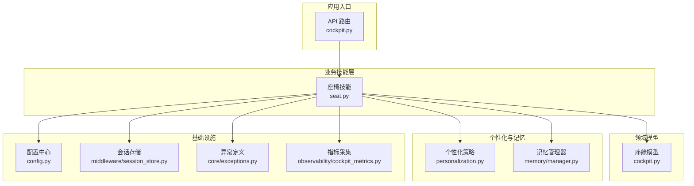
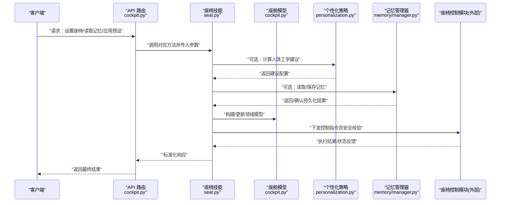
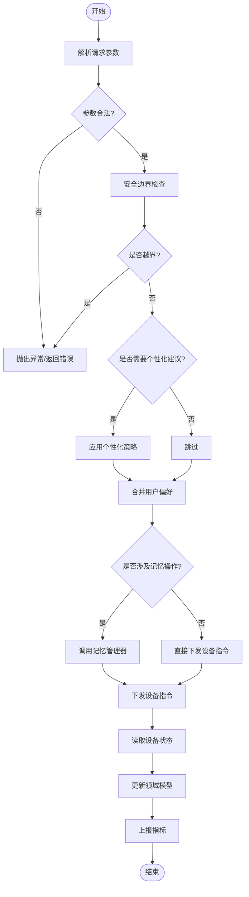
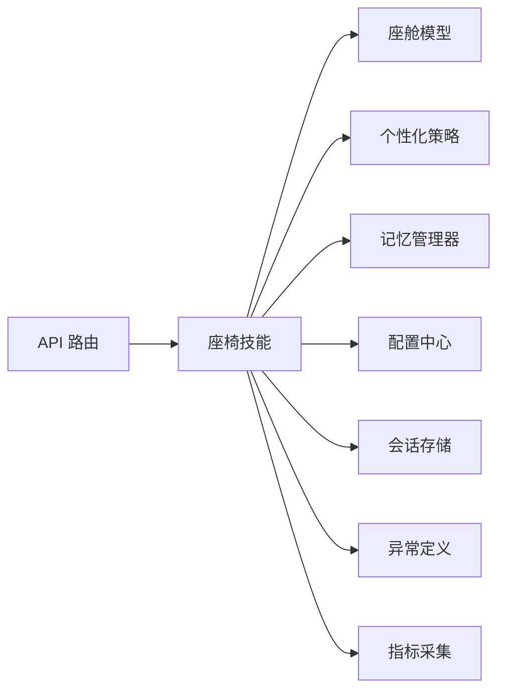

# 座椅调节系统

<cite>
**本文引用的文件**   
- [backend_design/nexus/skills/vehicle/seat.py](file://backend_design/nexus/skills/vehicle/seat.py)
- [backend_design/nexus/api/routes/cockpit.py](file://backend_design/nexus/api/routes/cockpit.py)
- [backend_design/nexus/models/cockpit.py](file://backend_design/nexus/models/cockpit.py)
- [backend_design/nexus/core/personalization.py](file://backend_design/nexus/core/personalization.py)
- [backend_design/nexus/core/exceptions.py](file://backend_design/nexus/core/exceptions.py)
- [backend_design/nexus/config.py](file://backend_design/nexus/config.py)
- [backend_design/nexus/middleware/session_store.py](file://backend_design/nexus/middleware/session_store.py)
- [backend_design/nexus/memory/manager.py](file://backend_design/nexus/memory/manager.py)
- [backend_design/nexus/observability/cockpit_metrics.py](file://backend_design/nexus/observability/cockpit_metrics.py)
</cite>

## 目录
1. [简介](#简介)
2. [项目结构](#项目结构)
3. [核心组件](#核心组件)
4. [架构总览](#架构总览)
5. [详细组件分析](#详细组件分析)
6. [依赖关系分析](#依赖关系分析)
7. [性能考虑](#性能考虑)
8. [故障排查指南](#故障排查指南)
9. [结论](#结论)
10. [附录：API 接口规范](#附录api-接口规范)

## 简介
本技术文档围绕“座椅调节系统”的实现机制、数据流、通信协议与安全限制进行系统化说明，覆盖前后移动、靠背角度调节、高度调节、腰部支撑、加热与通风等功能；同时阐述记忆位置的存储与管理、人体工学预设与用户偏好学习方案，并提供面向上层应用的 API 接口规范。

## 项目结构
本项目采用分层与按功能域组织相结合的结构。与座椅控制直接相关的代码主要位于后端服务的技能层（skills）与模型层（models），并通过 API 路由暴露能力；个性化与记忆管理由独立模块提供支撑；可观测性与配置在相应子系统中实现。

图表来源
- [backend_design/nexus/api/routes/cockpit.py](file://backend_design/nexus/api/routes/cockpit.py)
- [backend_design/nexus/skills/vehicle/seat.py](file://backend_design/nexus/skills/vehicle/seat.py)
- [backend_design/nexus/models/cockpit.py](file://backend_design/nexus/models/cockpit.py)
- [backend_design/nexus/core/personalization.py](file://backend_design/nexus/core/personalization.py)
- [backend_design/nexus/memory/manager.py](file://backend_design/nexus/memory/manager.py)
- [backend_design/nexus/config.py](file://backend_design/nexus/config.py)
- [backend_design/nexus/middleware/session_store.py](file://backend_design/nexus/middleware/session_store.py)
- [backend_design/nexus/core/exceptions.py](file://backend_design/nexus/core/exceptions.py)
- [backend_design/nexus/observability/cockpit_metrics.py](file://backend_design/nexus/observability/cockpit_metrics.py)

章节来源
- [backend_design/nexus/api/routes/cockpit.py](file://backend_design/nexus/api/routes/cockpit.py)
- [backend_design/nexus/skills/vehicle/seat.py](file://backend_design/nexus/skills/vehicle/seat.py)
- [backend_design/nexus/models/cockpit.py](file://backend_design/nexus/models/cockpit.py)
- [backend_design/nexus/core/personalization.py](file://backend_design/nexus/core/personalization.py)
- [backend_design/nexus/memory/manager.py](file://backend_design/nexus/memory/manager.py)
- [backend_design/nexus/config.py](file://backend_design/nexus/config.py)
- [backend_design/nexus/middleware/session_store.py](file://backend_design/nexus/middleware/session_store.py)
- [backend_design/nexus/core/exceptions.py](file://backend_design/nexus/core/exceptions.py)
- [backend_design/nexus/observability/cockpit_metrics.py](file://backend_design/nexus/observability/cockpit_metrics.py)

## 核心组件
- 座椅技能（Seat Skill）
  - 职责：封装座椅相关的所有控制逻辑，包括位置/角度/腰撑/加热/通风等动作的编排、参数校验、安全边界检查、状态同步与结果上报。
  - 关键能力：
    - 前后移动、靠背角度调节、高度调节、腰部支撑调节
    - 加热与通风档位控制
    - 记忆位置保存、读取、删除
    - 人体工学预设加载与用户偏好学习融合
- 座舱模型（Cockpit Model）
  - 职责：定义座椅状态与配置的领域模型，作为技能层与持久化/外部设备交互的数据契约。
- 个性化策略（Personalization）
  - 职责：基于用户画像与历史行为生成推荐设置，支持人体工学预设与偏好学习。
- 记忆管理器（Memory Manager）
  - 职责：负责记忆槽位、命名、版本、冲突解决与持久化。
- 配置中心（Config）
  - 职责：集中管理可调参数、安全阈值、默认值与开关。
- 会话存储（Session Store）
  - 职责：维护当前会话上下文，如当前用户、临时状态、操作流水。
- 异常定义（Exceptions）
  - 职责：统一错误码与异常类型，便于上层处理与监控。
- 指标采集（Cockpit Metrics）
  - 职责：记录关键操作的耗时、成功率、失败原因分布等指标。

章节来源
- [backend_design/nexus/skills/vehicle/seat.py](file://backend_design/nexus/skills/vehicle/seat.py)
- [backend_design/nexus/models/cockpit.py](file://backend_design/nexus/models/cockpit.py)
- [backend_design/nexus/core/personalization.py](file://backend_design/nexus/core/personalization.py)
- [backend_design/nexus/memory/manager.py](file://backend_design/nexus/memory/manager.py)
- [backend_design/nexus/config.py](file://backend_design/nexus/config.py)
- [backend_design/nexus/middleware/session_store.py](file://backend_design/nexus/middleware/session_store.py)
- [backend_design/nexus/core/exceptions.py](file://backend_design/nexus/core/exceptions.py)
- [backend_design/nexus/observability/cockpit_metrics.py](file://backend_design/nexus/observability/cockpit_metrics.py)

## 架构总览
下图展示了从 API 到技能层、再到模型与外部设备的调用链路与数据流向。

图表来源
- [backend_design/nexus/api/routes/cockpit.py](file://backend_design/nexus/api/routes/cockpit.py)
- [backend_design/nexus/skills/vehicle/seat.py](file://backend_design/nexus/skills/vehicle/seat.py)
- [backend_design/nexus/models/cockpit.py](file://backend_design/nexus/models/cockpit.py)
- [backend_design/nexus/core/personalization.py](file://backend_design/nexus/core/personalization.py)
- [backend_design/nexus/memory/manager.py](file://backend_design/nexus/memory/manager.py)

## 详细组件分析

### 座椅技能（Seat Skill）
- 设计要点
  - 将“用户意图/请求参数”转换为“领域模型”，再映射为“设备指令”。
  - 所有写操作均经过参数校验与安全边界检查，必要时结合个性化策略生成目标值。
  - 对读写记忆的操作通过记忆管理器完成，确保一致性。
- 关键流程
  - 位置/角度/腰撑/加热/通风控制：参数校验 → 安全限幅 → 下发设备指令 → 状态回读 → 更新模型 → 上报指标。
  - 记忆存取：解析命名/槽位 → 权限与会话校验 → 持久化或读取 → 返回结果。
  - 预设应用：加载人体工学预设 → 合并用户偏好 → 输出目标配置 → 进入控制流程。

图表来源
- [backend_design/nexus/skills/vehicle/seat.py](file://backend_design/nexus/skills/vehicle/seat.py)
- [backend_design/nexus/core/personalization.py](file://backend_design/nexus/core/personalization.py)
- [backend_design/nexus/memory/manager.py](file://backend_design/nexus/memory/manager.py)
- [backend_design/nexus/models/cockpit.py](file://backend_design/nexus/models/cockpit.py)
- [backend_design/nexus/observability/cockpit_metrics.py](file://backend_design/nexus/observability/cockpit_metrics.py)

章节来源
- [backend_design/nexus/skills/vehicle/seat.py](file://backend_design/nexus/skills/vehicle/seat.py)
- [backend_design/nexus/core/personalization.py](file://backend_design/nexus/core/personalization.py)
- [backend_design/nexus/memory/manager.py](file://backend_design/nexus/memory/manager.py)
- [backend_design/nexus/models/cockpit.py](file://backend_design/nexus/models/cockpit.py)
- [backend_design/nexus/observability/cockpit_metrics.py](file://backend_design/nexus/observability/cockpit_metrics.py)

### 座舱模型（Cockpit Model）
- 作用：定义座椅状态与配置的领域对象，承载位置、角度、腰撑、加热/通风等级、记忆槽位等信息。
- 使用方式：技能层在接收请求后构造/更新模型，并在设备状态回读后刷新模型，保证后续操作的一致性。

章节来源
- [backend_design/nexus/models/cockpit.py](file://backend_design/nexus/models/cockpit.py)

### 个性化策略（Personalization）
- 作用：根据用户画像、历史行为与人体工学规则生成推荐配置，并与用户显式偏好融合。
- 典型输入：用户ID、身体尺寸、驾驶习惯、健康提示等。
- 典型输出：目标位置/角度/腰撑/加热/通风等建议值。

章节来源
- [backend_design/nexus/core/personalization.py](file://backend_design/nexus/core/personalization.py)

### 记忆管理器（Memory Manager）
- 作用：管理记忆槽位、命名、版本、冲突解决与持久化。
- 关键能力：
  - 保存：将当前座椅状态写入指定槽位或命名记忆。
  - 读取：按槽位/名称/用户维度检索记忆。
  - 删除：清理无效或过期记忆。
  - 冲突：当同名/同槽位存在时，依据策略决定覆盖或保留。

章节来源
- [backend_design/nexus/memory/manager.py](file://backend_design/nexus/memory/manager.py)

### 配置中心（Config）
- 作用：集中管理安全阈值、默认值、功能开关与设备能力矩阵。
- 典型项：最大/最小位置、角度范围、腰撑行程、加热/通风档位上限、超时时间、重试次数等。

章节来源
- [backend_design/nexus/config.py](file://backend_design/nexus/config.py)

### 会话存储（Session Store）
- 作用：维护当前会话上下文，如当前用户、临时状态、操作流水，用于权限校验与审计。

章节来源
- [backend_design/nexus/middleware/session_store.py](file://backend_design/nexus/middleware/session_store.py)

### 异常定义（Exceptions）
- 作用：统一定义业务异常类型与错误码，便于上层捕获与展示。

章节来源
- [backend_design/nexus/core/exceptions.py](file://backend_design/nexus/core/exceptions.py)

### 指标采集（Cockpit Metrics）
- 作用：记录关键操作的耗时、成功率、失败原因分布等，用于监控与排障。

章节来源
- [backend_design/nexus/observability/cockpit_metrics.py](file://backend_design/nexus/observability/cockpit_metrics.py)

## 依赖关系分析
- 耦合与内聚
  - 座椅技能对内聚合了参数校验、安全限幅、个性化建议、记忆存取与设备通信，具备较高内聚性。
  - 对外仅依赖模型、配置、会话、异常与指标等基础能力，耦合度适中。
- 外部依赖
  - 座椅控制模块（外部设备）通过技能层抽象进行交互，便于替换实现与模拟测试。
- 潜在循环依赖
  - 当前结构未见明显循环依赖；若引入更多跨模块回调需关注。

图表来源
- [backend_design/nexus/api/routes/cockpit.py](file://backend_design/nexus/api/routes/cockpit.py)
- [backend_design/nexus/skills/vehicle/seat.py](file://backend_design/nexus/skills/vehicle/seat.py)
- [backend_design/nexus/models/cockpit.py](file://backend_design/nexus/models/cockpit.py)
- [backend_design/nexus/core/personalization.py](file://backend_design/nexus/core/personalization.py)
- [backend_design/nexus/memory/manager.py](file://backend_design/nexus/memory/manager.py)
- [backend_design/nexus/config.py](file://backend_design/nexus/config.py)
- [backend_design/nexus/middleware/session_store.py](file://backend_design/nexus/middleware/session_store.py)
- [backend_design/nexus/core/exceptions.py](file://backend_design/nexus/core/exceptions.py)
- [backend_design/nexus/observability/cockpit_metrics.py](file://backend_design/nexus/observability/cockpit_metrics.py)

章节来源
- [backend_design/nexus/api/routes/cockpit.py](file://backend_design/nexus/api/routes/cockpit.py)
- [backend_design/nexus/skills/vehicle/seat.py](file://backend_design/nexus/skills/vehicle/seat.py)
- [backend_design/nexus/models/cockpit.py](file://backend_design/nexus/models/cockpit.py)
- [backend_design/nexus/core/personalization.py](file://backend_design/nexus/core/personalization.py)
- [backend_design/nexus/memory/manager.py](file://backend_design/nexus/memory/manager.py)
- [backend_design/nexus/config.py](file://backend_design/nexus/config.py)
- [backend_design/nexus/middleware/session_store.py](file://backend_design/nexus/middleware/session_store.py)
- [backend_design/nexus/core/exceptions.py](file://backend_design/nexus/core/exceptions.py)
- [backend_design/nexus/observability/cockpit_metrics.py](file://backend_design/nexus/observability/cockpit_metrics.py)

## 性能考虑
- 批量操作与节流
  - 对连续调节（如快速前后移动）应做节流与合并，避免频繁下发设备指令。
- 异步与超时
  - 设备通信建议采用异步调用与合理超时，避免阻塞主流程。
- 缓存与预取
  - 常用预设与用户偏好可缓存于内存或会话中，减少重复计算与 IO。
- 幂等与重试
  - 对写操作实现幂等键，配合有限重试与退避策略，提高鲁棒性。
- 指标与采样
  - 关键路径埋点，按需采样，降低开销。

[本节为通用指导，不直接分析具体文件]

## 故障排查指南
- 常见问题定位
  - 参数非法：检查请求字段是否符合约束，参考异常定义中的错误码。
  - 越界保护：核对配置中心的安全阈值与当前设备能力矩阵。
  - 设备不可达：查看指标与日志，确认网络/设备状态。
  - 记忆冲突：检查命名/槽位策略与版本信息。
- 诊断手段
  - 启用调试日志与指标导出。
  - 回放最近一次操作序列，对比期望与实际状态。
  - 隔离验证：使用模拟设备与最小化请求复现问题。

章节来源
- [backend_design/nexus/core/exceptions.py](file://backend_design/nexus/core/exceptions.py)
- [backend_design/nexus/observability/cockpit_metrics.py](file://backend_design/nexus/observability/cockpit_metrics.py)

## 结论
本系统以“技能层 + 领域模型 + 个性化/记忆”为核心，形成高内聚、低耦合的座椅控制架构。通过统一的参数校验、安全限幅与指标采集，保障了功能的正确性与可观测性。未来可在设备抽象层进一步解耦，增强多厂商适配能力，并完善在线学习与自适应优化。

[本节为总结性内容，不直接分析具体文件]

## 附录：API 接口规范
以下接口供上层应用调用，实际路由注册与鉴权细节请参考 API 路由文件。

- 设置座椅位置
  - 方法：POST /api/cockpit/seat/position
  - 请求体字段：
    - user_id：字符串，必填
    - front_back：整数，单位 mm，必填
    - height：整数，单位 mm，选填
    - back_angle：浮点数，单位度，选填
    - lumbar_support：整数，单位级，选填
  - 响应体：
    - status：枚举，成功/失败
    - message：字符串，提示信息
    - data：包含最新状态的 JSON
- 调节加热/通风
  - 方法：POST /api/cockpit/seat/climate
  - 请求体字段：
    - user_id：字符串，必填
    - heating_level：整数，档位，选填
    - ventilation_level：整数，档位，选填
  - 响应体：同上
- 保存记忆
  - 方法：POST /api/cockpit/seat/memory/save
  - 请求体字段：
    - user_id：字符串，必填
    - slot_or_name：字符串，槽位编号或记忆名，必填
    - label：字符串，可选描述
  - 响应体：同上
- 读取记忆
  - 方法：GET /api/cockpit/seat/memory/{slot_or_name}
  - 路径参数：slot_or_name：字符串，必填
  - 响应体：
    - status：枚举
    - data：包含记忆内容的 JSON
- 删除记忆
  - 方法：DELETE /api/cockpit/seat/memory/{slot_or_name}
  - 路径参数：slot_or_name：字符串，必填
  - 响应体：同上
- 应用人体工学预设
  - 方法：POST /api/cockpit/seat/preset/ergonomic
  - 请求体字段：
    - user_id：字符串，必填
    - body_params：对象，身高/体重/腿长等，选填
    - preference_override：对象，用户显式偏好覆盖，选填
  - 响应体：同上

注意：
- 所有写操作均需通过鉴权与会话校验。
- 参数越界将被拒绝并返回错误码。
- 设备不可用或执行失败时，返回相应错误码与重试建议。

章节来源
- [backend_design/nexus/api/routes/cockpit.py](file://backend_design/nexus/api/routes/cockpit.py)
- [backend_design/nexus/skills/vehicle/seat.py](file://backend_design/nexus/skills/vehicle/seat.py)
- [backend_design/nexus/core/exceptions.py](file://backend_design/nexus/core/exceptions.py)