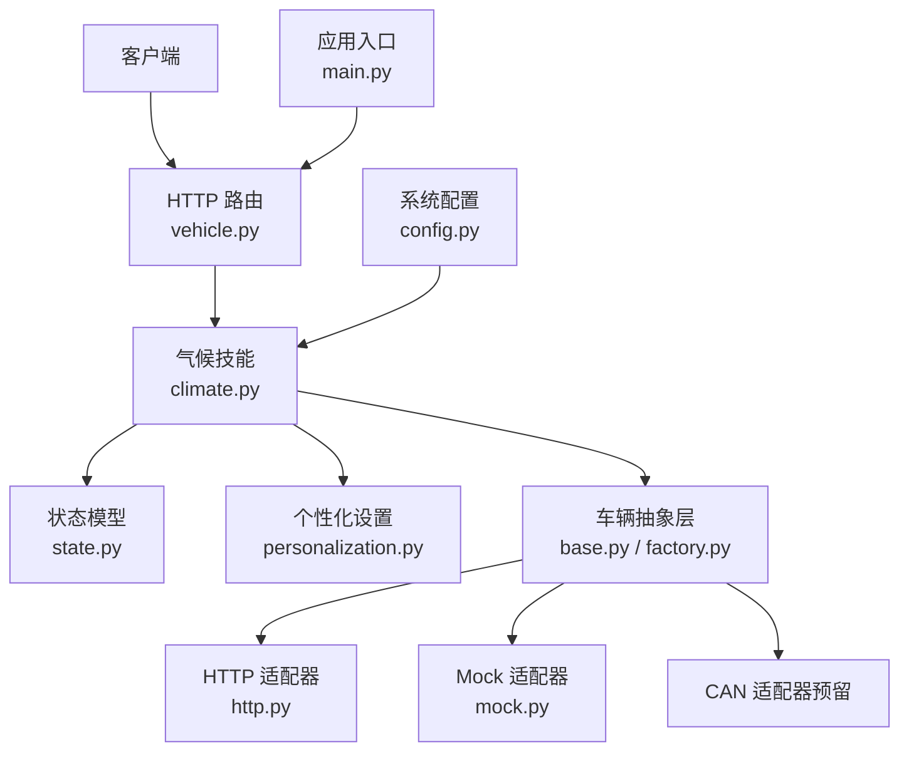
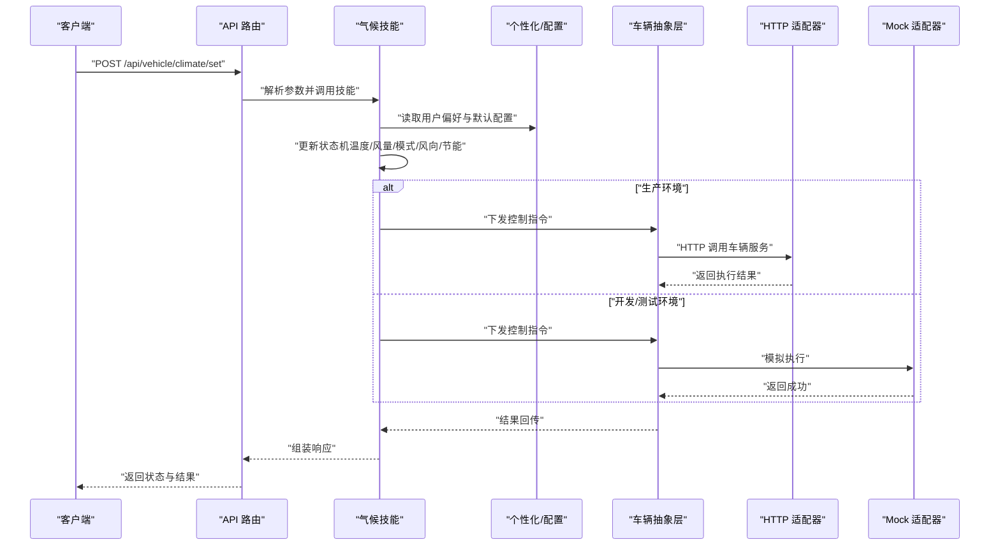
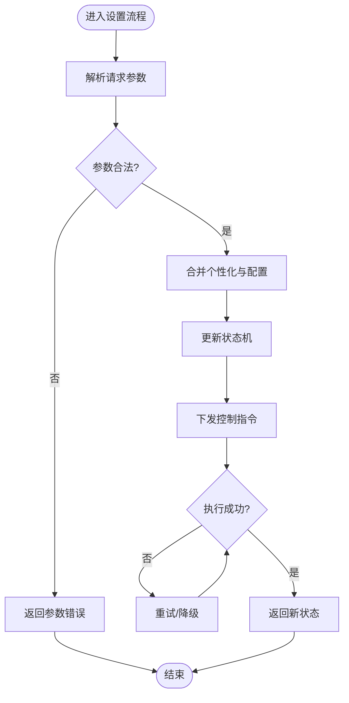
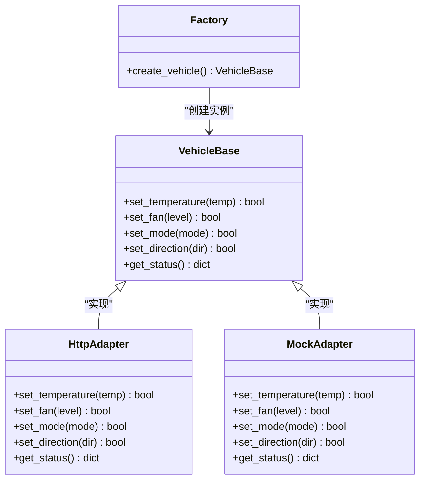
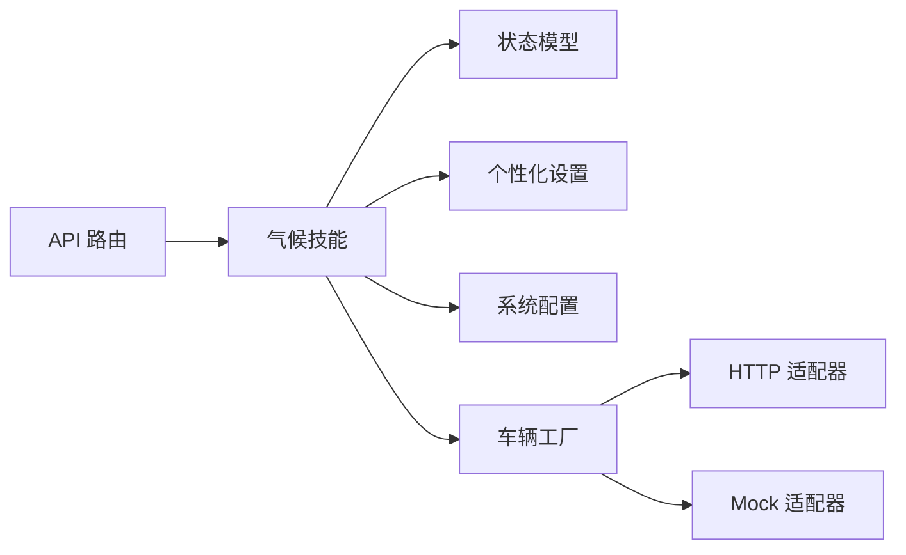

# 空调控制系统

<cite>
**本文引用的文件**   
- [backend_design/nexus/skills/vehicle/climate.py](file://backend_design/nexus/skills/vehicle/climate.py)
- [backend_design/nexus/api/routes/vehicle.py](file://backend_design/nexus/api/routes/vehicle.py)
- [backend_design/nexus/vehicle/base.py](file://backend_design/nexus/vehicle/base.py)
- [backend_design/nexus/vehicle/http.py](file://backend_design/nexus/vehicle/http.py)
- [backend_design/nexus/vehicle/mock.py](file://backend_design/nexus/vehicle/mock.py)
- [backend_design/nexus/vehicle/factory.py](file://backend_design/nexus/vehicle/factory.py)
- [backend_design/nexus/models/state.py](file://backend_design/nexus/models/state.py)
- [backend_design/nexus/core/personalization.py](file://backend_design/nexus/core/personalization.py)
- [backend_design/nexus/config.py](file://backend_design/nexus/config.py)
- [backend_design/nexus/main.py](file://backend_design/nexus/main.py)
</cite>

## 目录
1. [简介](#简介)
2. [项目结构](#项目结构)
3. [核心组件](#核心组件)
4. [架构总览](#架构总览)
5. [详细组件分析](#详细组件分析)
6. [依赖关系分析](#依赖关系分析)
7. [性能考虑](#性能考虑)
8. [故障排查指南](#故障排查指南)
9. [结论](#结论)
10. [附录：API 接口文档](#附录api-接口文档)

## 简介
本技术文档面向“空调控制系统”，覆盖温度调节、风量控制、模式切换（自动/手动）、风向调节等能力；阐述状态机设计与控制指令发送机制；说明与车辆通信的协议适配层（HTTP/Mock，预留CAN总线扩展点）；提供完整的API接口规范与示例调用路径；并给出节能模式与用户偏好设置的实现要点。

## 项目结构
本项目采用分层与领域技能（Skill）组织方式：
- API 路由层：暴露 HTTP 接口，负责参数校验与响应封装
- 领域技能层：按功能域划分（如 vehicle.climate），承载业务逻辑与状态机
- 车辆抽象层：统一对外通信协议（HTTP/Mock/CAN 预留），屏蔽底层差异
- 配置与个性化：系统配置、用户偏好与默认策略
- 应用入口：服务启动、中间件与路由注册

图表来源
- [backend_design/nexus/api/routes/vehicle.py](file://backend_design/nexus/api/routes/vehicle.py)
- [backend_design/nexus/skills/vehicle/climate.py](file://backend_design/nexus/skills/vehicle/climate.py)
- [backend_design/nexus/models/state.py](file://backend_design/nexus/models/state.py)
- [backend_design/nexus/core/personalization.py](file://backend_design/nexus/core/personalization.py)
- [backend_design/nexus/vehicle/base.py](file://backend_design/nexus/vehicle/base.py)
- [backend_design/nexus/vehicle/factory.py](file://backend_design/nexus/vehicle/factory.py)
- [backend_design/nexus/vehicle/http.py](file://backend_design/nexus/vehicle/http.py)
- [backend_design/nexus/vehicle/mock.py](file://backend_design/nexus/vehicle/mock.py)
- [backend_design/nexus/config.py](file://backend_design/nexus/config.py)
- [backend_design/nexus/main.py](file://backend_design/nexus/main.py)

章节来源
- [backend_design/nexus/main.py](file://backend_design/nexus/main.py)
- [backend_design/nexus/config.py](file://backend_design/nexus/config.py)

## 核心组件
- 气候技能（Climate Skill）
  - 职责：解析用户意图或API请求，维护空调状态机，执行温度/风量/模式/风向等控制命令，协调节能策略与个性化偏好。
- 车辆抽象层（Vehicle Abstraction）
  - 职责：定义统一的车辆控制接口，提供HTTP/Mock两种实现，预留CAN总线适配器位置，屏蔽底层通信细节。
- 状态模型（State Model）
  - 职责：描述空调当前状态（开关、目标温度、风量、模式、风向、节能标志等），作为状态机输入输出载体。
- 个性化设置（Personalization）
  - 职责：加载用户偏好（如默认温度、风量、风向、节能偏好），在技能层进行合并与优先级处理。
- 配置（Config）
  - 职责：集中管理系统级配置项（如默认值、超时、重试、日志级别等）。

章节来源
- [backend_design/nexus/skills/vehicle/climate.py](file://backend_design/nexus/skills/vehicle/climate.py)
- [backend_design/nexus/vehicle/base.py](file://backend_design/nexus/vehicle/base.py)
- [backend_design/nexus/vehicle/http.py](file://backend_design/nexus/vehicle/http.py)
- [backend_design/nexus/vehicle/mock.py](file://backend_design/nexus/vehicle/mock.py)
- [backend_design/nexus/vehicle/factory.py](file://backend_design/nexus/vehicle/factory.py)
- [backend_design/nexus/models/state.py](file://backend_design/nexus/models/state.py)
- [backend_design/nexus/core/personalization.py](file://backend_design/nexus/core/personalization.py)
- [backend_design/nexus/config.py](file://backend_design/nexus/config.py)

## 架构总览
整体数据流与控制流如下：
- 客户端通过HTTP调用API路由
- 路由将请求转发至气候技能
- 技能读取个性化与配置，更新状态机
- 通过车辆抽象层下发控制指令（HTTP/Mock/CAN）
- 返回最终状态与结果

图表来源
- [backend_design/nexus/api/routes/vehicle.py](file://backend_design/nexus/api/routes/vehicle.py)
- [backend_design/nexus/skills/vehicle/climate.py](file://backend_design/nexus/skills/vehicle/climate.py)
- [backend_design/nexus/vehicle/base.py](file://backend_design/nexus/vehicle/base.py)
- [backend_design/nexus/vehicle/http.py](file://backend_design/nexus/vehicle/http.py)
- [backend_design/nexus/vehicle/mock.py](file://backend_design/nexus/vehicle/mock.py)

## 详细组件分析

### 气候技能（Climate Skill）
- 功能范围
  - 温度调节：设定目标温度，支持步进调整与边界校验
  - 风量控制：档位/百分比控制，含上下限保护
  - 模式切换：自动/手动模式，联动风量与温控策略
  - 风向调节：多向风门控制（前吹/脚部/除雾等）
  - 节能模式：根据用户偏好与环境条件优化能耗
  - 状态机：维护开/关、运行中、故障等状态转换
- 关键流程
  - 接收设置请求 -> 校验参数 -> 合并个性化与配置 -> 更新状态机 -> 下发指令 -> 返回结果
- 错误处理
  - 参数非法、越界、设备不可达、超时重试、降级到Mock

图表来源
- [backend_design/nexus/skills/vehicle/climate.py](file://backend_design/nexus/skills/vehicle/climate.py)
- [backend_design/nexus/core/personalization.py](file://backend_design/nexus/core/personalization.py)
- [backend_design/nexus/config.py](file://backend_design/nexus/config.py)

章节来源
- [backend_design/nexus/skills/vehicle/climate.py](file://backend_design/nexus/skills/vehicle/climate.py)

### 车辆抽象层（Vehicle Abstraction）
- 设计要点
  - 统一接口：定义 set_temperature、set_fan、set_mode、set_direction、get_status 等方法
  - 多实现：HTTP 适配器对接真实车辆服务；Mock 适配器用于本地调试
  - 工厂模式：根据配置选择具体实现
- 扩展性
  - 预留 CAN 总线适配器，便于后续接入车载网络

图表来源
- [backend_design/nexus/vehicle/base.py](file://backend_design/nexus/vehicle/base.py)
- [backend_design/nexus/vehicle/http.py](file://backend_design/nexus/vehicle/http.py)
- [backend_design/nexus/vehicle/mock.py](file://backend_design/nexus/vehicle/mock.py)
- [backend_design/nexus/vehicle/factory.py](file://backend_design/nexus/vehicle/factory.py)

章节来源
- [backend_design/nexus/vehicle/base.py](file://backend_design/nexus/vehicle/base.py)
- [backend_design/nexus/vehicle/http.py](file://backend_design/nexus/vehicle/http.py)
- [backend_design/nexus/vehicle/mock.py](file://backend_design/nexus/vehicle/mock.py)
- [backend_design/nexus/vehicle/factory.py](file://backend_design/nexus/vehicle/factory.py)

### 状态模型（State Model）
- 字段建议
  - 开关状态、目标温度、当前温度、风量档位、模式（自动/手动）、风向、节能标志、故障码、更新时间戳
- 复杂度
  - 读写操作为 O(1)，序列化/反序列化为 O(n)（n 为字段数）
- 使用场景
  - 技能层状态机输入输出、API 响应体、持久化存储（可选）

章节来源
- [backend_design/nexus/models/state.py](file://backend_design/nexus/models/state.py)

### 个性化设置（Personalization）
- 功能
  - 加载用户偏好（默认温度、风量、风向、节能偏好）
  - 与系统配置合并，形成最终生效策略
- 优先级
  - 用户显式设置 > 用户偏好 > 系统默认

章节来源
- [backend_design/nexus/core/personalization.py](file://backend_design/nexus/core/personalization.py)

### 配置（Config）
- 内容
  - 默认温度/风量/模式、HTTP 超时、重试次数、日志级别、是否启用节能模式等
- 作用
  - 为技能层与车辆抽象层提供一致的系统级参数

章节来源
- [backend_design/nexus/config.py](file://backend_design/nexus/config.py)

## 依赖关系分析
- 耦合度
  - API 路由仅依赖气候技能与状态模型，低耦合
  - 气候技能依赖个性化与配置，并通过工厂选择车辆适配器
  - 车辆抽象层对HTTP/Mock解耦，新增CAN适配器不影响上层
- 外部依赖
  - HTTP 适配器依赖外部车辆服务
  - Mock 适配器无外部依赖，适合本地测试

图表来源
- [backend_design/nexus/api/routes/vehicle.py](file://backend_design/nexus/api/routes/vehicle.py)
- [backend_design/nexus/skills/vehicle/climate.py](file://backend_design/nexus/skills/vehicle/climate.py)
- [backend_design/nexus/models/state.py](file://backend_design/nexus/models/state.py)
- [backend_design/nexus/core/personalization.py](file://backend_design/nexus/core/personalization.py)
- [backend_design/nexus/config.py](file://backend_design/nexus/config.py)
- [backend_design/nexus/vehicle/factory.py](file://backend_design/nexus/vehicle/factory.py)
- [backend_design/nexus/vehicle/http.py](file://backend_design/nexus/vehicle/http.py)
- [backend_design/nexus/vehicle/mock.py](file://backend_design/nexus/vehicle/mock.py)

章节来源
- [backend_design/nexus/api/routes/vehicle.py](file://backend_design/nexus/api/routes/vehicle.py)
- [backend_design/nexus/skills/vehicle/climate.py](file://backend_design/nexus/skills/vehicle/climate.py)
- [backend_design/nexus/vehicle/factory.py](file://backend_design/nexus/vehicle/factory.py)

## 性能考虑
- 请求路径短：API -> 技能 -> 车辆抽象层，尽量减少中间转换
- 缓存策略：状态模型可短期缓存，减少重复计算
- 并发控制：对同一车辆的写操作加锁，避免竞态
- 超时与重试：合理设置HTTP超时与重试次数，失败快速降级
- 日志采样：高频日志采样，降低IO开销

[本节为通用指导，不直接分析具体文件]

## 故障排查指南
- 常见问题
  - 参数越界：检查温度/风量/模式/风向的取值范围
  - 设备不可达：确认HTTP服务地址、端口、鉴权信息
  - 超时失败：增大超时时间或增加重试次数
  - 状态不一致：查看状态模型更新时间戳与日志
- 定位方法
  - 开启调试日志，记录请求参数与返回结果
  - 使用Mock适配器验证技能逻辑是否正确
  - 对比个性化与配置合并后的最终策略

章节来源
- [backend_design/nexus/skills/vehicle/climate.py](file://backend_design/nexus/skills/vehicle/climate.py)
- [backend_design/nexus/vehicle/http.py](file://backend_design/nexus/vehicle/http.py)
- [backend_design/nexus/vehicle/mock.py](file://backend_design/nexus/vehicle/mock.py)

## 结论
本空调控制系统以“技能+抽象层”的分层架构实现，具备清晰的职责边界与良好的扩展性。通过状态机与个性化/配置的协同，能够稳定完成温度、风量、模式、风向等控制，并支持节能模式。HTTP/Mock双适配器满足开发与生产需求，预留CAN总线扩展点便于未来接入车载网络。

[本节为总结，不直接分析具体文件]

## 附录：API 接口文档

- 基础信息
  - 协议：HTTP/JSON
  - 认证：按平台统一鉴权（由网关或中间件处理）
  - 字符集：UTF-8
  - 内容类型：application/json

- 设置空调参数
  - 端点：POST /api/vehicle/climate/set
  - 请求体字段
    - temperature: 数字，单位摄氏度，范围依配置
    - fan_level: 整数或百分比，表示风量档位或比例
    - mode: 字符串，枚举值包括“自动”、“手动”
    - direction: 字符串，枚举值包括“前吹”、“脚部”、“除雾”等
    - eco_mode: 布尔，是否启用节能模式
  - 响应体
    - status: 字符串，“success”或“error”
    - message: 字符串，提示信息
    - state: 对象，包含最新空调状态（开关、温度、风量、模式、风向、节能标志、更新时间戳）
  - 示例调用路径
    - curl -X POST http://host:port/api/vehicle/climate/set -H "Content-Type: application/json" -d '{"temperature":22,"fan_level":3,"mode":"自动","direction":"前吹","eco_mode":true}'

- 查询空调状态
  - 端点：GET /api/vehicle/climate/status
  - 响应体
    - status: 字符串，“success”或“error”
    - state: 对象，同上
  - 示例调用路径
    - curl http://host:port/api/vehicle/climate/status

- 错误码与异常
  - 400：参数非法或越界
  - 500：内部错误或设备不可达
  - 503：服务暂时不可用（可重试）

章节来源
- [backend_design/nexus/api/routes/vehicle.py](file://backend_design/nexus/api/routes/vehicle.py)
- [backend_design/nexus/models/state.py](file://backend_design/nexus/models/state.py)