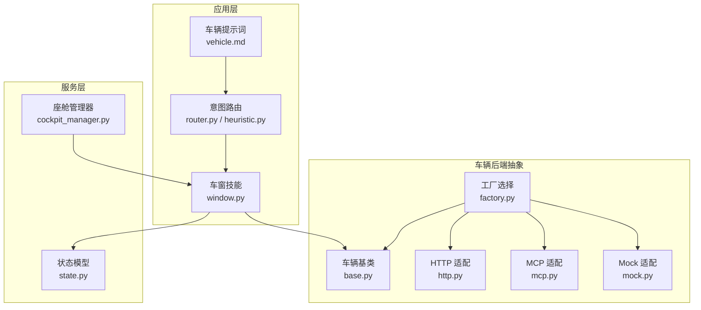
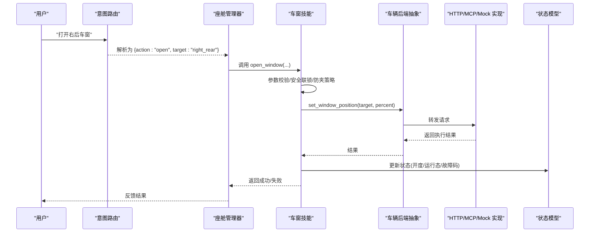
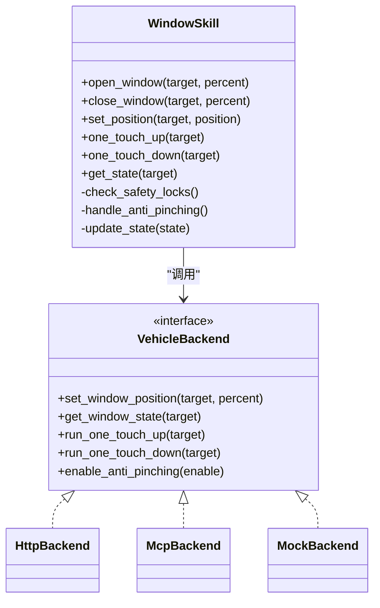
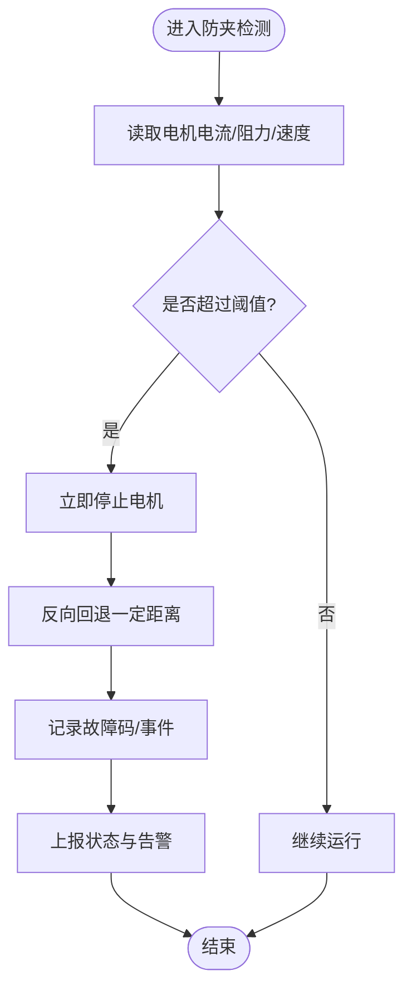
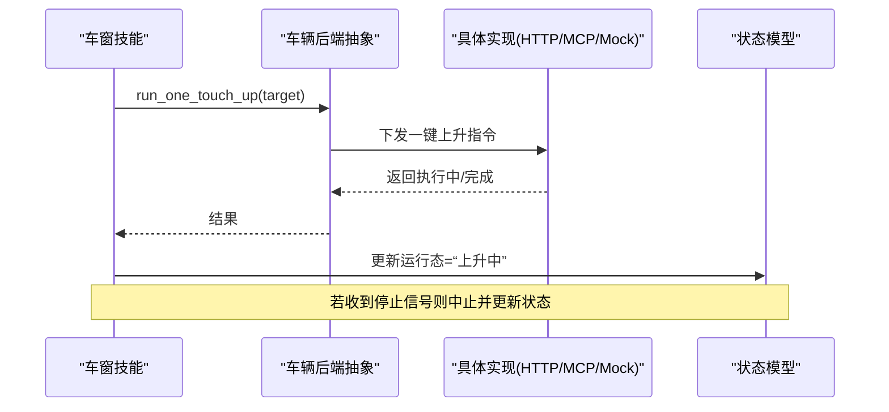
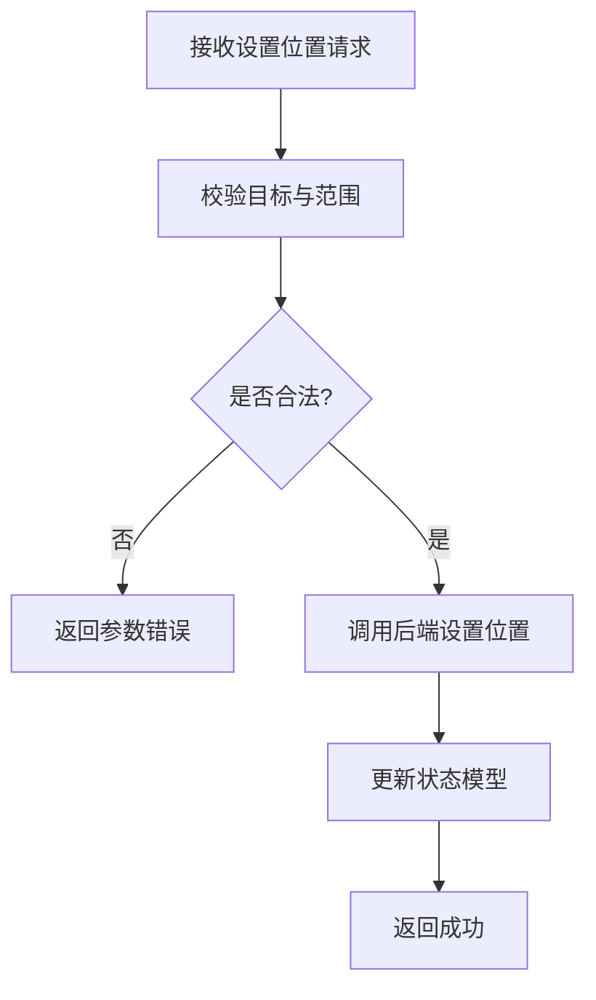
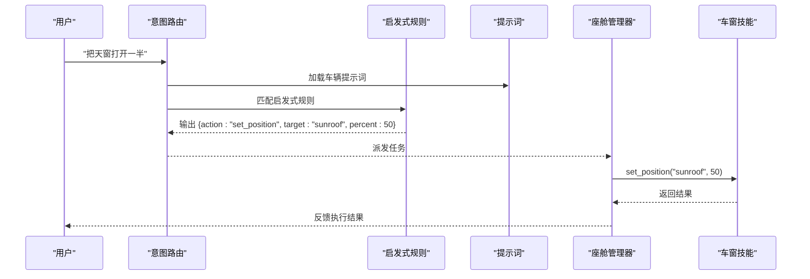
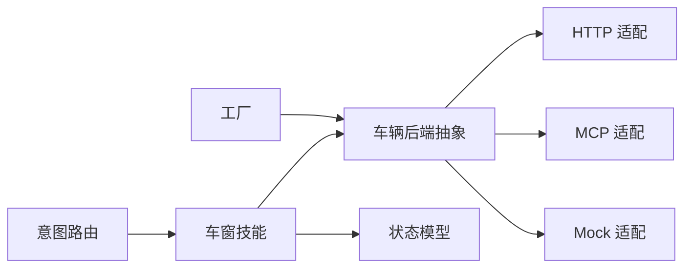

# 车窗控制系统

<cite>
**本文引用的文件**   
- [backend_design/nexus/skills/vehicle/window.py](file://backend_design/nexus/skills/vehicle/window.py)
- [backend_design/nexus/api/routes/vehicle.py](file://backend_design/nexus/api/routes/vehicle.py)
- [backend_design/nexus/vehicle/base.py](file://backend_design/nexus/vehicle/base.py)
- [backend_design/nexus/vehicle/factory.py](file://backend_design/nexus/vehicle/factory.py)
- [backend_design/nexus/vehicle/http.py](file://backend_design/nexus/vehicle/http.py)
- [backend_design/nexus/vehicle/mcp.py](file://backend_design/nexus/vehicle/mcp.py)
- [backend_design/nexus/vehicle/mock.py](file://backend_design/nexus/vehicle/mock.py)
- [backend_design/nexus/models/state.py](file://backend_design/nexus/models/state.py)
- [backend_design/nexus/core/cockpit_manager.py](file://backend_design/nexus/core/cockpit_manager.py)
- [backend_design/nexus/intent/router.py](file://backend_design/nexus/intent/router.py)
- [backend_design/nexus/intent/heuristic.py](file://backend_design/nexus/intent/heuristic.py)
- [backend_design/nexus/prompts/vehicle.md](file://backend_design/nexus/prompts/vehicle.md)
</cite>

## 目录
1. [简介](#简介)
2. [项目结构](#项目结构)
3. [核心组件](#核心组件)
4. [架构总览](#架构总览)
5. [详细组件分析](#详细组件分析)
6. [依赖关系分析](#依赖关系分析)
7. [性能考虑](#性能考虑)
8. [故障排查指南](#故障排查指南)
9. [结论](#结论)
10. [附录：API 接口规范](#附录api-接口规范)

## 简介
本技术文档面向“车窗控制系统”，覆盖车窗升降、天窗控制、防夹保护、一键升降、状态监测与安全联锁等能力，并给出与车身控制模块的通信协议要点、故障检测机制以及 API 接口规范。系统采用分层设计：上层通过技能（Skill）与意图路由暴露功能，中间层抽象车辆后端实现（HTTP/MCP/Mock），底层对接真实或模拟的车身控制器。

## 项目结构
与车窗控制相关的代码主要分布在以下位置：
- 技能层：提供“车窗”领域能力封装与对外调用入口
- 意图层：将自然语言指令解析为具体操作
- 车辆后端抽象：统一车窗控制的执行接口与工厂选择
- HTTP/MCP/Mock 适配：对接不同后端实现
- 模型与状态：定义车窗相关状态与持久化结构
- 管理编排：在座舱管理器中注册与调度技能

图示来源
- [backend_design/nexus/skills/vehicle/window.py](file://backend_design/nexus/skills/vehicle/window.py)
- [backend_design/nexus/intent/router.py](file://backend_design/nexus/intent/router.py)
- [backend_design/nexus/intent/heuristic.py](file://backend_design/nexus/intent/heuristic.py)
- [backend_design/nexus/prompts/vehicle.md](file://backend_design/nexus/prompts/vehicle.md)
- [backend_design/nexus/vehicle/base.py](file://backend_design/nexus/vehicle/base.py)
- [backend_design/nexus/vehicle/factory.py](file://backend_design/nexus/vehicle/factory.py)
- [backend_design/nexus/vehicle/http.py](file://backend_design/nexus/vehicle/http.py)
- [backend_design/nexus/vehicle/mcp.py](file://backend_design/nexus/vehicle/mcp.py)
- [backend_design/nexus/vehicle/mock.py](file://backend_design/nexus/vehicle/mock.py)
- [backend_design/nexus/models/state.py](file://backend_design/nexus/models/state.py)
- [backend_design/nexus/core/cockpit_manager.py](file://backend_design/nexus/core/cockpit_manager.py)

章节来源
- [backend_design/nexus/skills/vehicle/window.py](file://backend_design/nexus/skills/vehicle/window.py)
- [backend_design/nexus/vehicle/base.py](file://backend_design/nexus/vehicle/base.py)
- [backend_design/nexus/vehicle/factory.py](file://backend_design/nexus/vehicle/factory.py)
- [backend_design/nexus/vehicle/http.py](file://backend_design/nexus/vehicle/http.py)
- [backend_design/nexus/vehicle/mcp.py](file://backend_design/nexus/vehicle/mcp.py)
- [backend_design/nexus/vehicle/mock.py](file://backend_design/nexus/vehicle/mock.py)
- [backend_design/nexus/models/state.py](file://backend_design/nexus/models/state.py)
- [backend_design/nexus/core/cockpit_manager.py](file://backend_design/nexus/core/cockpit_manager.py)
- [backend_design/nexus/intent/router.py](file://backend_design/nexus/intent/router.py)
- [backend_design/nexus/intent/heuristic.py](file://backend_design/nexus/intent/heuristic.py)
- [backend_design/nexus/prompts/vehicle.md](file://backend_design/nexus/prompts/vehicle.md)

## 核心组件
- 车窗技能（Window Skill）
  - 职责：封装车窗/天窗开合、一键升降、防夹、位置设置、状态查询等能力；负责安全联锁校验与异常处理；与车辆后端抽象交互。
  - 关键能力：
    - 开合控制：按目标百分比或相对量驱动车窗/天窗
    - 一键升降：向上/向下全行程运行，支持中途停止
    - 防夹保护：基于电流/阻力阈值与运动方向判定，遇阻回退
    - 位置设置：设定绝对位置或相对偏移
    - 状态查询：返回当前开度、运行状态、故障码
- 车辆后端抽象（Vehicle Backend Abstraction）
  - 职责：定义统一的车辆控制接口（如 set_window_position、get_window_state、run_one_touch_up/down、enable_anti_pinching 等），由具体实现（HTTP/MCP/Mock）完成。
- 工厂（Factory）
  - 职责：根据配置选择具体后端实现（HTTP/MCP/Mock）。
- 状态模型（State Model）
  - 职责：定义车窗/天窗的状态字段（开度、运行态、故障码、最近动作时间戳等），供技能层读写与上报。
- 意图路由（Intent Router）
  - 职责：将用户语音/文本指令解析为“打开车窗”“关闭天窗”“一键降下左前窗”等操作，并调用对应技能方法。
- 座舱管理器（Cockpit Manager）
  - 职责：注册/发现技能，协调各子系统，提供统一入口。

章节来源
- [backend_design/nexus/skills/vehicle/window.py](file://backend_design/nexus/skills/vehicle/window.py)
- [backend_design/nexus/vehicle/base.py](file://backend_design/nexus/vehicle/base.py)
- [backend_design/nexus/vehicle/factory.py](file://backend_design/nexus/vehicle/factory.py)
- [backend_design/nexus/models/state.py](file://backend_design/nexus/models/state.py)
- [backend_design/nexus/intent/router.py](file://backend_design/nexus/intent/router.py)
- [backend_design/nexus/core/cockpit_manager.py](file://backend_design/nexus/core/cockpit_manager.py)

## 架构总览
整体流程从用户指令到车窗执行的关键路径如下：
- 用户输入经意图路由识别为“车窗控制”意图
- 座舱管理器调度“车窗技能”
- 车窗技能进行参数校验、安全联锁检查、防夹策略决策
- 通过车辆后端抽象选择具体实现（HTTP/MCP/Mock）下发命令
- 读取/更新状态模型，返回结果给上层

图示来源
- [backend_design/nexus/intent/router.py](file://backend_design/nexus/intent/router.py)
- [backend_design/nexus/core/cockpit_manager.py](file://backend_design/nexus/core/cockpit_manager.py)
- [backend_design/nexus/skills/vehicle/window.py](file://backend_design/nexus/skills/vehicle/window.py)
- [backend_design/nexus/vehicle/base.py](file://backend_design/nexus/vehicle/base.py)
- [backend_design/nexus/vehicle/http.py](file://backend_design/nexus/vehicle/http.py)
- [backend_design/nexus/vehicle/mcp.py](file://backend_design/nexus/vehicle/mcp.py)
- [backend_design/nexus/vehicle/mock.py](file://backend_design/nexus/vehicle/mock.py)
- [backend_design/nexus/models/state.py](file://backend_design/nexus/models/state.py)

## 详细组件分析

### 车窗技能（Window Skill）
- 功能边界
  - 开合控制：支持绝对百分比与相对增量
  - 一键升降：上/下全行程，支持中断
  - 防夹保护：遇阻回退、限速、超时保护
  - 位置设置：绝对位置与相对偏移
  - 状态查询：开度、运行态、故障码、最近动作时间
- 安全联锁
  - 车速/档位/车门状态等前置条件检查
  - 互斥逻辑：例如天窗与侧窗同时开启时的风噪/气流限制
  - 防夹触发后的复位与重试策略
- 错误处理
  - 网络/协议异常降级为本地缓存状态
  - 超时重试与熔断策略
  - 可观测性：指标与日志上报

图示来源
- [backend_design/nexus/skills/vehicle/window.py](file://backend_design/nexus/skills/vehicle/window.py)
- [backend_design/nexus/vehicle/base.py](file://backend_design/nexus/vehicle/base.py)
- [backend_design/nexus/vehicle/http.py](file://backend_design/nexus/vehicle/http.py)
- [backend_design/nexus/vehicle/mcp.py](file://backend_design/nexus/vehicle/mcp.py)
- [backend_design/nexus/vehicle/mock.py](file://backend_design/nexus/vehicle/mock.py)

章节来源
- [backend_design/nexus/skills/vehicle/window.py](file://backend_design/nexus/skills/vehicle/window.py)
- [backend_design/nexus/vehicle/base.py](file://backend_design/nexus/vehicle/base.py)
- [backend_design/nexus/vehicle/http.py](file://backend_design/nexus/vehicle/http.py)
- [backend_design/nexus/vehicle/mcp.py](file://backend_design/nexus/vehicle/mcp.py)
- [backend_design/nexus/vehicle/mock.py](file://backend_design/nexus/vehicle/mock.py)

### 防夹保护流程
防夹保护在检测到阻力异常时立即停止并回退，随后记录故障码并上报。

图示来源
- [backend_design/nexus/skills/vehicle/window.py](file://backend_design/nexus/skills/vehicle/window.py)
- [backend_design/nexus/models/state.py](file://backend_design/nexus/models/state.py)

章节来源
- [backend_design/nexus/skills/vehicle/window.py](file://backend_design/nexus/skills/vehicle/window.py)
- [backend_design/nexus/models/state.py](file://backend_design/nexus/models/state.py)

### 一键升降流程
一键升降用于快速全行程开合，支持中途停止。

图示来源
- [backend_design/nexus/skills/vehicle/window.py](file://backend_design/nexus/skills/vehicle/window.py)
- [backend_design/nexus/vehicle/base.py](file://backend_design/nexus/vehicle/base.py)
- [backend_design/nexus/vehicle/http.py](file://backend_design/nexus/vehicle/http.py)
- [backend_design/nexus/vehicle/mcp.py](file://backend_design/nexus/vehicle/mcp.py)
- [backend_design/nexus/vehicle/mock.py](file://backend_design/nexus/vehicle/mock.py)
- [backend_design/nexus/models/state.py](file://backend_design/nexus/models/state.py)

章节来源
- [backend_design/nexus/skills/vehicle/window.py](file://backend_design/nexus/skills/vehicle/window.py)
- [backend_design/nexus/vehicle/base.py](file://backend_design/nexus/vehicle/base.py)
- [backend_design/nexus/vehicle/http.py](file://backend_design/nexus/vehicle/http.py)
- [backend_design/nexus/vehicle/mcp.py](file://backend_design/nexus/vehicle/mcp.py)
- [backend_design/nexus/vehicle/mock.py](file://backend_design/nexus/vehicle/mock.py)
- [backend_design/nexus/models/state.py](file://backend_design/nexus/models/state.py)

### 位置设置与状态查询
- 位置设置：支持绝对位置（0-100%）与相对偏移（+/-N%），需校验范围与互斥逻辑
- 状态查询：返回开度、运行态、故障码、最近动作时间等

图示来源
- [backend_design/nexus/skills/vehicle/window.py](file://backend_design/nexus/skills/vehicle/window.py)
- [backend_design/nexus/models/state.py](file://backend_design/nexus/models/state.py)

章节来源
- [backend_design/nexus/skills/vehicle/window.py](file://backend_design/nexus/skills/vehicle/window.py)
- [backend_design/nexus/models/state.py](file://backend_design/nexus/models/state.py)

### 意图路由与提示词
- 意图路由将自然语言指令映射为结构化操作（如打开/关闭/一键升降/设置位置）
- 提示词文件用于引导 LLM 或规则引擎生成正确的意图与参数

图示来源
- [backend_design/nexus/intent/router.py](file://backend_design/nexus/intent/router.py)
- [backend_design/nexus/intent/heuristic.py](file://backend_design/nexus/intent/heuristic.py)
- [backend_design/nexus/prompts/vehicle.md](file://backend_design/nexus/prompts/vehicle.md)
- [backend_design/nexus/core/cockpit_manager.py](file://backend_design/nexus/core/cockpit_manager.py)
- [backend_design/nexus/skills/vehicle/window.py](file://backend_design/nexus/skills/vehicle/window.py)

章节来源
- [backend_design/nexus/intent/router.py](file://backend_design/nexus/intent/router.py)
- [backend_design/nexus/intent/heuristic.py](file://backend_design/nexus/intent/heuristic.py)
- [backend_design/nexus/prompts/vehicle.md](file://backend_design/nexus/prompts/vehicle.md)
- [backend_design/nexus/core/cockpit_manager.py](file://backend_design/nexus/core/cockpit_manager.py)
- [backend_design/nexus/skills/vehicle/window.py](file://backend_design/nexus/skills/vehicle/window.py)

## 依赖关系分析
- 耦合与内聚
  - 车窗技能与车辆后端抽象解耦，便于替换实现（HTTP/MCP/Mock）
  - 状态模型独立于业务逻辑，便于跨模块共享
- 外部依赖
  - HTTP/MCP 适配器依赖网络与协议栈
  - Mock 适配器用于测试与仿真
- 潜在循环依赖
  - 通过工厂模式避免直接硬编码依赖，降低循环风险

图示来源
- [backend_design/nexus/skills/vehicle/window.py](file://backend_design/nexus/skills/vehicle/window.py)
- [backend_design/nexus/vehicle/base.py](file://backend_design/nexus/vehicle/base.py)
- [backend_design/nexus/vehicle/http.py](file://backend_design/nexus/vehicle/http.py)
- [backend_design/nexus/vehicle/mcp.py](file://backend_design/nexus/vehicle/mcp.py)
- [backend_design/nexus/vehicle/mock.py](file://backend_design/nexus/vehicle/mock.py)
- [backend_design/nexus/models/state.py](file://backend_design/nexus/models/state.py)
- [backend_design/nexus/intent/router.py](file://backend_design/nexus/intent/router.py)
- [backend_design/nexus/vehicle/factory.py](file://backend_design/nexus/vehicle/factory.py)

章节来源
- [backend_design/nexus/vehicle/factory.py](file://backend_design/nexus/vehicle/factory.py)
- [backend_design/nexus/vehicle/base.py](file://backend_design/nexus/vehicle/base.py)
- [backend_design/nexus/vehicle/http.py](file://backend_design/nexus/vehicle/http.py)
- [backend_design/nexus/vehicle/mcp.py](file://backend_design/nexus/vehicle/mcp.py)
- [backend_design/nexus/vehicle/mock.py](file://backend_design/nexus/vehicle/mock.py)
- [backend_design/nexus/models/state.py](file://backend_design/nexus/models/state.py)
- [backend_design/nexus/intent/router.py](file://backend_design/nexus/intent/router.py)
- [backend_design/nexus/skills/vehicle/window.py](file://backend_design/nexus/skills/vehicle/window.py)

## 性能考虑
- 并发控制：同一车窗的多次指令应排队或合并，避免冲突
- 防抖与节流：高频设置位置请求应合并为最终目标值
- 超时与重试：对网络型后端设置合理超时与重试上限
- 状态缓存：频繁查询状态时可短期缓存，减少后端压力
- 资源占用：防夹检测与状态更新应避免阻塞主线程

[本节为通用指导，不直接分析具体文件]

## 故障排查指南
- 常见问题
  - 网络不可达：检查 HTTP/MCP 连接与鉴权
  - 参数非法：校验目标、百分比范围、单位一致性
  - 防夹误触发：检查机械阻力、安装间隙、传感器阈值
  - 状态不一致：对比后端返回与本地缓存，必要时强制刷新
- 定位步骤
  - 查看状态模型中的故障码与最近动作时间
  - 检查后端实现日志与返回码
  - 使用 Mock 实现隔离问题域（网络/协议 vs 业务逻辑）
- 恢复策略
  - 重置防夹标志位并重试一次
  - 降级为本地受控模式（仅允许小幅度调整）
  - 上报遥测数据以便远程诊断

章节来源
- [backend_design/nexus/models/state.py](file://backend_design/nexus/models/state.py)
- [backend_design/nexus/vehicle/http.py](file://backend_design/nexus/vehicle/http.py)
- [backend_design/nexus/vehicle/mcp.py](file://backend_design/nexus/vehicle/mcp.py)
- [backend_design/nexus/vehicle/mock.py](file://backend_design/nexus/vehicle/mock.py)
- [backend_design/nexus/skills/vehicle/window.py](file://backend_design/nexus/skills/vehicle/window.py)

## 结论
本系统通过“技能+后端抽象+多实现”的分层架构，实现了车窗与天窗的统一控制能力，涵盖一键升降、防夹保护、位置设置与状态查询。借助意图路由与提示词，系统可将自然语言指令转化为可靠的车窗控制动作。建议在生产环境完善可观测性与容错策略，确保高可用与安全性。

[本节为总结，不直接分析具体文件]

## 附录：API 接口规范
说明：以下为车窗控制相关接口的概念性规范，实际字段与行为以具体实现为准。

- 开合控制
  - 方法：open_window/close_window
  - 参数：target（左前/右前/左后/右后/天窗）、percent（0-100）
  - 返回：执行结果（成功/失败）、原因码
- 位置设置
  - 方法：set_position
  - 参数：target、position（绝对 0-100 或相对 +/-N%）
  - 返回：新位置、运行态
- 一键升降
  - 方法：one_touch_up/one_touch_down
  - 参数：target
  - 返回：开始执行/已停止
- 状态查询
  - 方法：get_state
  - 参数：target
  - 返回：开度、运行态、故障码、最近动作时间

章节来源
- [backend_design/nexus/skills/vehicle/window.py](file://backend_design/nexus/skills/vehicle/window.py)
- [backend_design/nexus/models/state.py](file://backend_design/nexus/models/state.py)