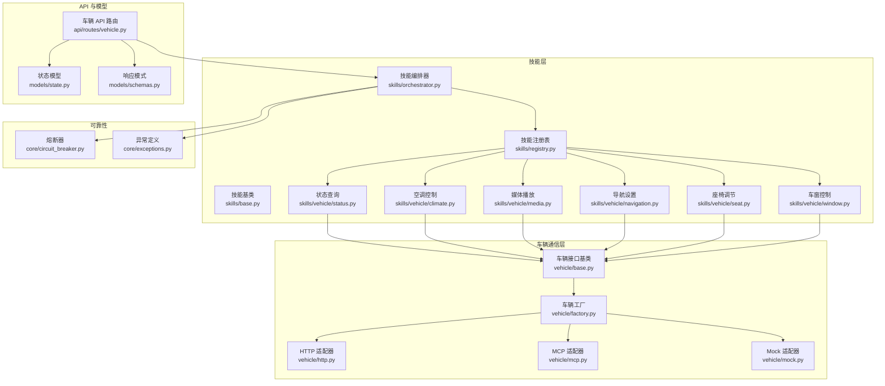
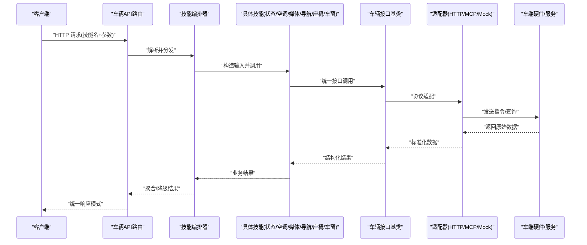
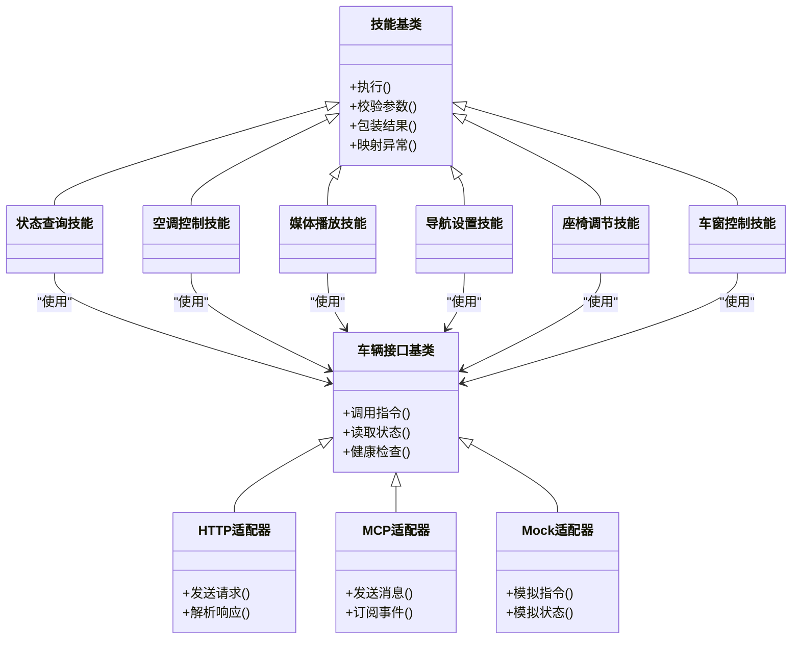
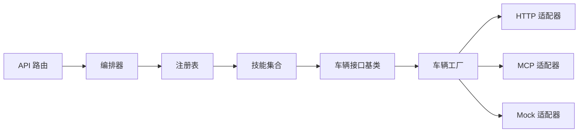

# 车辆控制技能集

<cite>
**本文引用的文件**   
- [backend_design/nexus/skills/vehicle/__init__.py](file://backend_design/nexus/skills/vehicle/__init__.py)
- [backend_design/nexus/skills/vehicle/status.py](file://backend_design/nexus/skills/vehicle/status.py)
- [backend_design/nexus/skills/vehicle/climate.py](file://backend_design/nexus/skills/vehicle/climate.py)
- [backend_design/nexus/skills/vehicle/media.py](file://backend_design/nexus/skills/vehicle/media.py)
- [backend_design/nexus/skills/vehicle/navigation.py](file://backend_design/nexus/skills/vehicle/navigation.py)
- [backend_design/nexus/skills/vehicle/seat.py](file://backend_design/nexus/skills/vehicle/seat.py)
- [backend_design/nexus/skills/vehicle/window.py](file://backend_design/nexus/skills/vehicle/window.py)
- [backend_design/nexus/skills/base.py](file://backend_design/nexus/skills/base.py)
- [backend_design/nexus/skills/orchestrator.py](file://backend_design/nexus/skills/orchestrator.py)
- [backend_design/nexus/skills/registry.py](file://backend_design/nexus/skills/registry.py)
- [backend_design/nexus/vehicle/base.py](file://backend_design/nexus/vehicle/base.py)
- [backend_design/nexus/vehicle/factory.py](file://backend_design/nexus/vehicle/factory.py)
- [backend_design/nexus/vehicle/http.py](file://backend_design/nexus/vehicle/http.py)
- [backend_design/nexus/vehicle/mcp.py](file://backend_design/nexus/vehicle/mcp.py)
- [backend_design/nexus/vehicle/mock.py](file://backend_design/nexus/vehicle/mock.py)
- [backend_design/nexus/api/routes/vehicle.py](file://backend_design/nexus/api/routes/vehicle.py)
- [backend_design/nexus/core/circuit_breaker.py](file://backend_design/nexus/core/circuit_breaker.py)
- [backend_design/nexus/core/exceptions.py](file://backend_design/nexus/core/exceptions.py)
- [backend_design/nexus/models/state.py](file://backend_design/nexus/models/state.py)
- [backend_design/nexus/models/schemas.py](file://backend_design/nexus/models/schemas.py)
</cite>

## 目录
1. [简介](#简介)
2. [项目结构](#项目结构)
3. [核心组件](#核心组件)
4. [架构总览](#架构总览)
5. [详细组件分析](#详细组件分析)
6. [依赖关系分析](#依赖关系分析)
7. [性能考虑](#性能考虑)
8. [故障诊断指南](#故障诊断指南)
9. [结论](#结论)
10. [附录](#附录)

## 简介
本技术文档聚焦于“车辆控制技能集”，覆盖状态查询、空调控制、媒体播放、导航设置、座椅调节与车窗控制等核心能力。文档从系统架构、组件职责、数据流与协议转换、API 接口规范、异常处理与容错策略，到性能优化与批量操作最佳实践进行系统化阐述，帮助开发者快速理解并高效集成车辆控制能力。

## 项目结构
车辆控制相关代码主要分布在以下模块：
- 技能层（skills/vehicle）：实现具体车辆控制技能，如状态、空调、媒体、导航、座椅、车窗等。
- 技能基座（skills/base, skills/orchestrator, skills/registry）：提供技能抽象、编排与注册机制。
- 车辆通信层（vehicle/*）：封装与车端硬件的通信协议（HTTP/MCP/Mock），并提供工厂创建与统一接口。
- API 路由（api/routes/vehicle.py）：对外暴露 HTTP 接口，将请求路由至对应技能。
- 模型与状态（models/state.py, models/schemas.py）：定义通用数据结构与响应模式。
- 可靠性与异常（core/circuit_breaker.py, core/exceptions.py）：熔断器与异常类型定义。

图表来源
- [backend_design/nexus/skills/base.py](file://backend_design/nexus/skills/base.py)
- [backend_design/nexus/skills/orchestrator.py](file://backend_design/nexus/skills/orchestrator.py)
- [backend_design/nexus/skills/registry.py](file://backend_design/nexus/skills/registry.py)
- [backend_design/nexus/skills/vehicle/status.py](file://backend_design/nexus/skills/vehicle/status.py)
- [backend_design/nexus/skills/vehicle/climate.py](file://backend_design/nexus/skills/vehicle/climate.py)
- [backend_design/nexus/skills/vehicle/media.py](file://backend_design/nexus/skills/vehicle/media.py)
- [backend_design/nexus/skills/vehicle/navigation.py](file://backend_design/nexus/skills/vehicle/navigation.py)
- [backend_design/nexus/skills/vehicle/seat.py](file://backend_design/nexus/skills/vehicle/seat.py)
- [backend_design/nexus/skills/vehicle/window.py](file://backend_design/nexus/skills/vehicle/window.py)
- [backend_design/nexus/vehicle/base.py](file://backend_design/nexus/vehicle/base.py)
- [backend_design/nexus/vehicle/factory.py](file://backend_design/nexus/vehicle/factory.py)
- [backend_design/nexus/vehicle/http.py](file://backend_design/nexus/vehicle/http.py)
- [backend_design/nexus/vehicle/mcp.py](file://backend_design/nexus/vehicle/mcp.py)
- [backend_design/nexus/vehicle/mock.py](file://backend_design/nexus/vehicle/mock.py)
- [backend_design/nexus/api/routes/vehicle.py](file://backend_design/nexus/api/routes/vehicle.py)
- [backend_design/nexus/models/state.py](file://backend_design/nexus/models/state.py)
- [backend_design/nexus/models/schemas.py](file://backend_design/nexus/models/schemas.py)
- [backend_design/nexus/core/circuit_breaker.py](file://backend_design/nexus/core/circuit_breaker.py)
- [backend_design/nexus/core/exceptions.py](file://backend_design/nexus/core/exceptions.py)

章节来源
- [backend_design/nexus/skills/vehicle/__init__.py](file://backend_design/nexus/skills/vehicle/__init__.py)
- [backend_design/nexus/skills/base.py](file://backend_design/nexus/skills/base.py)
- [backend_design/nexus/skills/orchestrator.py](file://backend_design/nexus/skills/orchestrator.py)
- [backend_design/nexus/skills/registry.py](file://backend_design/nexus/skills/registry.py)
- [backend_design/nexus/vehicle/base.py](file://backend_design/nexus/vehicle/base.py)
- [backend_design/nexus/vehicle/factory.py](file://backend_design/nexus/vehicle/factory.py)
- [backend_design/nexus/vehicle/http.py](file://backend_design/nexus/vehicle/http.py)
- [backend_design/nexus/vehicle/mcp.py](file://backend_design/nexus/vehicle/mcp.py)
- [backend_design/nexus/vehicle/mock.py](file://backend_design/nexus/vehicle/mock.py)
- [backend_design/nexus/api/routes/vehicle.py](file://backend_design/nexus/api/routes/vehicle.py)
- [backend_design/nexus/models/state.py](file://backend_design/nexus/models/state.py)
- [backend_design/nexus/models/schemas.py](file://backend_design/nexus/models/schemas.py)
- [backend_design/nexus/core/circuit_breaker.py](file://backend_design/nexus/core/circuit_breaker.py)
- [backend_design/nexus/core/exceptions.py](file://backend_design/nexus/core/exceptions.py)

## 核心组件
- 技能基类与注册表
  - 技能基类定义了统一的调用入口、参数校验、结果包装与错误映射方法，确保各技能具备一致的契约。
  - 注册表负责技能的发现与实例化，支持按名称解析与按需加载，便于扩展新技能。
- 编排器
  - 编排器协调多个技能的执行顺序与并发度，负责上下文传递、重试与降级策略。
- 车辆通信层
  - 统一抽象出车辆接口基类，屏蔽底层协议差异；通过工厂根据配置选择 HTTP/MCP/Mock 适配器。
  - HTTP 适配器负责 REST 调用与序列化；MCP 适配器用于消息通道；Mock 适配器用于开发与测试。
- API 路由
  - 对外暴露标准 HTTP 接口，将请求参数转换为技能输入，并将技能输出标准化为响应模式。
- 模型与状态
  - 状态模型描述车辆当前状态的结构；响应模式定义成功/失败返回的统一格式。
- 可靠性与异常
  - 熔断器在下游不可用时快速失败，避免雪崩；异常定义涵盖连接超时、权限验证、设备状态同步等场景。

章节来源
- [backend_design/nexus/skills/base.py](file://backend_design/nexus/skills/base.py)
- [backend_design/nexus/skills/registry.py](file://backend_design/nexus/skills/registry.py)
- [backend_design/nexus/skills/orchestrator.py](file://backend_design/nexus/skills/orchestrator.py)
- [backend_design/nexus/vehicle/base.py](file://backend_design/nexus/vehicle/base.py)
- [backend_design/nexus/vehicle/factory.py](file://backend_design/nexus/vehicle/factory.py)
- [backend_design/nexus/vehicle/http.py](file://backend_design/nexus/vehicle/http.py)
- [backend_design/nexus/vehicle/mcp.py](file://backend_design/nexus/vehicle/mcp.py)
- [backend_design/nexus/vehicle/mock.py](file://backend_design/nexus/vehicle/mock.py)
- [backend_design/nexus/api/routes/vehicle.py](file://backend_design/nexus/api/routes/vehicle.py)
- [backend_design/nexus/models/state.py](file://backend_design/nexus/models/state.py)
- [backend_design/nexus/models/schemas.py](file://backend_design/nexus/models/schemas.py)
- [backend_design/nexus/core/circuit_breaker.py](file://backend_design/nexus/core/circuit_breaker.py)
- [backend_design/nexus/core/exceptions.py](file://backend_design/nexus/core/exceptions.py)

## 架构总览
整体采用分层设计：API 路由层接收外部请求，交由编排器调度具体技能；技能层基于统一接口访问车辆通信层；通信层根据配置选择适配协议；模型与异常贯穿全链路保障一致性与可观测性。

图表来源
- [backend_design/nexus/api/routes/vehicle.py](file://backend_design/nexus/api/routes/vehicle.py)
- [backend_design/nexus/skills/orchestrator.py](file://backend_design/nexus/skills/orchestrator.py)
- [backend_design/nexus/skills/base.py](file://backend_design/nexus/skills/base.py)
- [backend_design/nexus/vehicle/base.py](file://backend_design/nexus/vehicle/base.py)
- [backend_design/nexus/vehicle/http.py](file://backend_design/nexus/vehicle/http.py)
- [backend_design/nexus/vehicle/mcp.py](file://backend_design/nexus/vehicle/mcp.py)
- [backend_design/nexus/vehicle/mock.py](file://backend_design/nexus/vehicle/mock.py)

## 详细组件分析

### 状态查询技能（status）
- 功能特性
  - 获取车辆综合状态，包括电量/油量、车门/车窗/锁状态、空调运行状态、媒体播放状态、导航目标等。
- 实现原理
  - 通过车辆接口基类发起状态聚合查询，可能组合多个子系统的数据源，并进行归一化处理。
- API 接口定义
  - 路径与方法：参考 API 路由中状态查询端点。
  - 请求参数：无或可选过滤字段（例如仅返回部分子状态）。
  - 返回值：遵循统一响应模式，包含状态码、数据体与消息。
- 数据转换
  - 将底层异构状态映射为统一状态模型，保证前端展示一致性。
- 异常处理
  - 对连接超时、权限不足、设备离线等情况进行捕获与降级，返回明确错误信息。

章节来源
- [backend_design/nexus/skills/vehicle/status.py](file://backend_design/nexus/skills/vehicle/status.py)
- [backend_design/nexus/models/state.py](file://backend_design/nexus/models/state.py)
- [backend_design/nexus/models/schemas.py](file://backend_design/nexus/models/schemas.py)
- [backend_design/nexus/core/exceptions.py](file://backend_design/nexus/core/exceptions.py)

### 空调控制技能（climate）
- 功能特性
  - 温度设定、风量调节、自动模式、分区控制、除雾/除霜、内循环/外循环切换。
- 实现原理
  - 将用户意图解析为空调控制命令，经车辆接口下发至空调控制器，必要时读取反馈以确认执行结果。
- API 接口定义
  - 路径与方法：参考 API 路由中空调控制端点。
  - 请求参数：温度、风量、模式、分区等字段，需满足范围与互斥约束。
  - 返回值：执行结果与当前空调状态快照。
- 数据转换
  - 将数值型参数映射为设备可识别的控制字，处理单位换算与边界值裁剪。
- 异常处理
  - 针对无效参数、设备忙、权限不足、通信失败等进行分类处理与提示。

章节来源
- [backend_design/nexus/skills/vehicle/climate.py](file://backend_design/nexus/skills/vehicle/climate.py)
- [backend_design/nexus/models/schemas.py](file://backend_design/nexus/models/schemas.py)
- [backend_design/nexus/core/exceptions.py](file://backend_design/nexus/core/exceptions.py)

### 媒体播放技能（media）
- 功能特性
  - 播放/暂停、上一首/下一首、音量调节、列表管理、来源切换（蓝牙/USB/在线）。
- 实现原理
  - 通过媒体控制器接口发送控制指令，并维护播放会话状态，支持断线重连与状态同步。
- API 接口定义
  - 路径与方法：参考 API 路由中媒体控制端点。
  - 请求参数：动作类型、曲目标识、音量值、来源等。
  - 返回值：播放状态、当前曲目信息与操作结果。
- 数据转换
  - 将高层动作映射为媒体总线命令，处理不同来源的差异化协议。
- 异常处理
  - 对无可用音源、设备未就绪、权限不足等场景给出友好提示与恢复建议。

章节来源
- [backend_design/nexus/skills/vehicle/media.py](file://backend_design/nexus/skills/vehicle/media.py)
- [backend_design/nexus/models/schemas.py](file://backend_design/nexus/models/schemas.py)
- [backend_design/nexus/core/exceptions.py](file://backend_design/nexus/core/exceptions.py)

### 导航设置技能（navigation）
- 功能特性
  - 设置目的地、清除路线、显示/隐藏地图、兴趣点搜索、途经点管理。
- 实现原理
  - 将地理坐标或地址文本转换为导航引擎可接受的格式，调用导航服务并返回执行进度。
- API 接口定义
  - 路径与方法：参考 API 路由中导航设置端点。
  - 请求参数：目的地、途经点、偏好（最短时间/最少拥堵）、是否开始导航等。
  - 返回值：路线摘要、预计到达时间与导航状态。
- 数据转换
  - 地址解析、坐标规范化、路线规划参数映射。
- 异常处理
  - 对定位失败、网络不可用、权限拒绝等异常进行分类处理与回退策略。

章节来源
- [backend_design/nexus/skills/vehicle/navigation.py](file://backend_design/nexus/skills/vehicle/navigation.py)
- [backend_design/nexus/models/schemas.py](file://backend_design/nexus/models/schemas.py)
- [backend_design/nexus/core/exceptions.py](file://backend_design/nexus/core/exceptions.py)

### 座椅调节技能（seat）
- 功能特性
  - 前后移动、靠背角度、头枕高度、腰部支撑、加热/通风、记忆位置调用。
- 实现原理
  - 将用户调整意图映射为座椅电机控制指令，支持多区域联动与限位保护。
- API 接口定义
  - 路径与方法：参考 API 路由中座椅控制端点。
  - 请求参数：座位位置、角度、加热/通风等级、记忆编号等。
  - 返回值：调整后状态与执行结果。
- 数据转换
  - 将百分比或档位映射为电机步数或 PWM 占空比，处理安全阈值。
- 异常处理
  - 对越界参数、机械卡滞、传感器异常等进行检测与告警。

章节来源
- [backend_design/nexus/skills/vehicle/seat.py](file://backend_design/nexus/skills/vehicle/seat.py)
- [backend_design/nexus/models/schemas.py](file://backend_design/nexus/models/schemas.py)
- [backend_design/nexus/core/exceptions.py](file://backend_design/nexus/core/exceptions.py)

### 车窗控制技能（window）
- 功能特性
  - 升降控制、一键升降、防夹保护、半开比例、联动天窗。
- 实现原理
  - 通过车窗控制器下发指令，结合传感器反馈实现防夹与位置校准。
- API 接口定义
  - 路径与方法：参考 API 路由中车窗控制端点。
  - 请求参数：目标位置、速度、是否联动等。
  - 返回值：当前开合度与执行结果。
- 数据转换
  - 将百分比位置映射为步进控制信号，处理限位与误差补偿。
- 异常处理
  - 对障碍物检测、电机过载、通信中断等进行防护与恢复。

章节来源
- [backend_design/nexus/skills/vehicle/window.py](file://backend_design/nexus/skills/vehicle/window.py)
- [backend_design/nexus/models/schemas.py](file://backend_design/nexus/models/schemas.py)
- [backend_design/nexus/core/exceptions.py](file://backend_design/nexus/core/exceptions.py)

### 面向对象结构图（技能与车辆接口）

图表来源
- [backend_design/nexus/vehicle/base.py](file://backend_design/nexus/vehicle/base.py)
- [backend_design/nexus/vehicle/http.py](file://backend_design/nexus/vehicle/http.py)
- [backend_design/nexus/vehicle/mcp.py](file://backend_design/nexus/vehicle/mcp.py)
- [backend_design/nexus/vehicle/mock.py](file://backend_design/nexus/vehicle/mock.py)
- [backend_design/nexus/skills/base.py](file://backend_design/nexus/skills/base.py)
- [backend_design/nexus/skills/vehicle/status.py](file://backend_design/nexus/skills/vehicle/status.py)
- [backend_design/nexus/skills/vehicle/climate.py](file://backend_design/nexus/skills/vehicle/climate.py)
- [backend_design/nexus/skills/vehicle/media.py](file://backend_design/nexus/skills/vehicle/media.py)
- [backend_design/nexus/skills/vehicle/navigation.py](file://backend_design/nexus/skills/vehicle/navigation.py)
- [backend_design/nexus/skills/vehicle/seat.py](file://backend_design/nexus/skills/vehicle/seat.py)
- [backend_design/nexus/skills/vehicle/window.py](file://backend_design/nexus/skills/vehicle/window.py)

## 依赖关系分析
- 组件耦合
  - 技能层依赖车辆接口基类，不直接感知协议细节，降低耦合度。
  - 编排器与注册表松耦合，支持动态扩展新技能。
- 外部依赖
  - HTTP 适配器依赖网络库；MCP 适配器依赖消息中间件；Mock 适配器用于本地调试。
- 潜在循环依赖
  - 通过接口抽象与工厂模式避免循环引用。
- 接口契约
  - 统一响应模式与异常类型确保跨层一致性。

图表来源
- [backend_design/nexus/api/routes/vehicle.py](file://backend_design/nexus/api/routes/vehicle.py)
- [backend_design/nexus/skills/orchestrator.py](file://backend_design/nexus/skills/orchestrator.py)
- [backend_design/nexus/skills/registry.py](file://backend_design/nexus/skills/registry.py)
- [backend_design/nexus/vehicle/base.py](file://backend_design/nexus/vehicle/base.py)
- [backend_design/nexus/vehicle/factory.py](file://backend_design/nexus/vehicle/factory.py)
- [backend_design/nexus/vehicle/http.py](file://backend_design/nexus/vehicle/http.py)
- [backend_design/nexus/vehicle/mcp.py](file://backend_design/nexus/vehicle/mcp.py)
- [backend_design/nexus/vehicle/mock.py](file://backend_design/nexus/vehicle/mock.py)

章节来源
- [backend_design/nexus/skills/registry.py](file://backend_design/nexus/skills/registry.py)
- [backend_design/nexus/skills/orchestrator.py](file://backend_design/nexus/skills/orchestrator.py)
- [backend_design/nexus/vehicle/factory.py](file://backend_design/nexus/vehicle/factory.py)

## 性能考虑
- 并发与批处理
  - 编排器支持并行调用多个独立技能，减少端到端延迟；对非关键路径采用异步执行。
  - 批量操作建议合并多次调用，减少网络往返与设备唤醒次数。
- 缓存与去抖
  - 对频繁读取的状态（如门窗开关、媒体播放状态）引入短时缓存与去抖逻辑，避免抖动。
- 超时与重试
  - 合理设置读写超时与最大重试次数，配合熔断器防止级联故障。
- 资源限制
  - 对高开销操作（如导航规划）进行限流与队列化，避免阻塞主线程。
- 监控与指标
  - 记录关键路径耗时、成功率与错误分布，辅助容量规划与问题定位。

[本节为通用指导，无需特定文件来源]

## 故障诊断指南
- 连接超时
  - 现象：请求长时间无响应或频繁超时。
  - 排查：检查网络连通性、服务端负载、适配器超时配置；启用熔断器观察失败率趋势。
- 权限验证失败
  - 现象：返回权限不足错误。
  - 排查：核对鉴权令牌、角色权限、设备绑定关系；查看异常类型与错误码。
- 设备状态不同步
  - 现象：UI 显示与实际不一致。
  - 排查：增加状态拉取频率或订阅事件；引入一致性校验与冲突解决策略。
- 常见异常类型
  - 连接超时、认证失败、设备离线、参数非法、执行被拒绝等，均应在异常定义中明确语义与处理建议。

章节来源
- [backend_design/nexus/core/circuit_breaker.py](file://backend_design/nexus/core/circuit_breaker.py)
- [backend_design/nexus/core/exceptions.py](file://backend_design/nexus/core/exceptions.py)

## 结论
车辆控制技能集通过清晰的层次划分与统一接口，实现了多技能的可插拔与可扩展。借助编排器与注册表，系统具备良好的弹性与可维护性；通过熔断器与异常体系，提升了鲁棒性与可观测性。建议在后续迭代中持续完善状态同步机制、增强批处理能力与优化监控指标，以提升用户体验与系统稳定性。

[本节为总结性内容，无需特定文件来源]

## 附录
- API 示例与参数说明
  - 请参考 API 路由文件中各端点的定义，了解请求方法与参数结构。
- 数据模型与响应模式
  - 状态模型与响应模式文件定义了统一的数据结构与返回格式，确保前后端一致性。
- 协议适配与配置
  - 车辆工厂根据配置选择 HTTP/MCP/Mock 适配器，便于在不同环境部署与测试。

章节来源
- [backend_design/nexus/api/routes/vehicle.py](file://backend_design/nexus/api/routes/vehicle.py)
- [backend_design/nexus/models/state.py](file://backend_design/nexus/models/state.py)
- [backend_design/nexus/models/schemas.py](file://backend_design/nexus/models/schemas.py)
- [backend_design/nexus/vehicle/factory.py](file://backend_design/nexus/vehicle/factory.py)