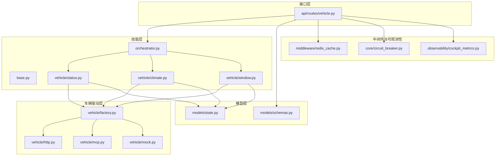
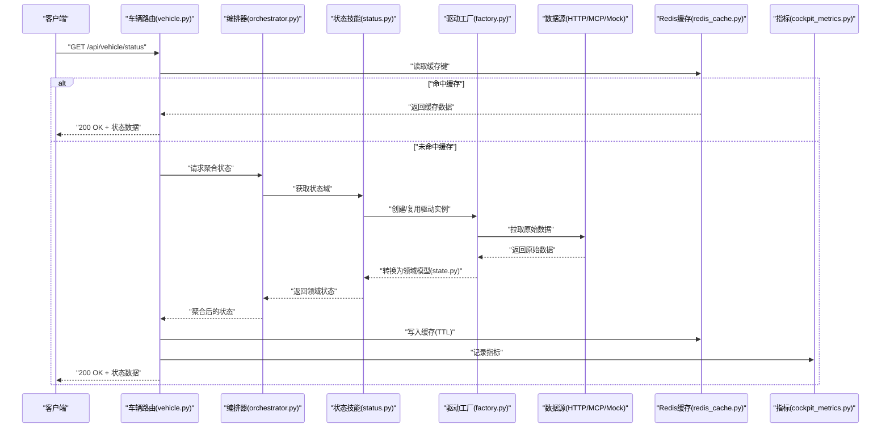
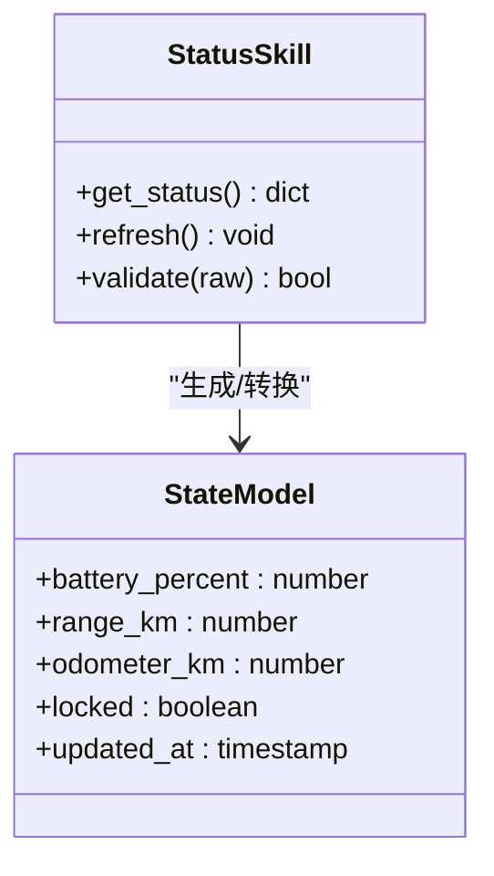
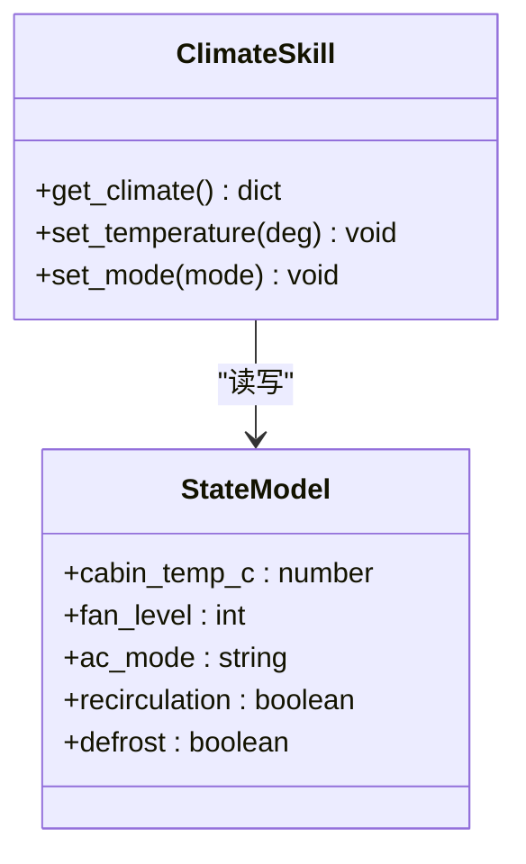
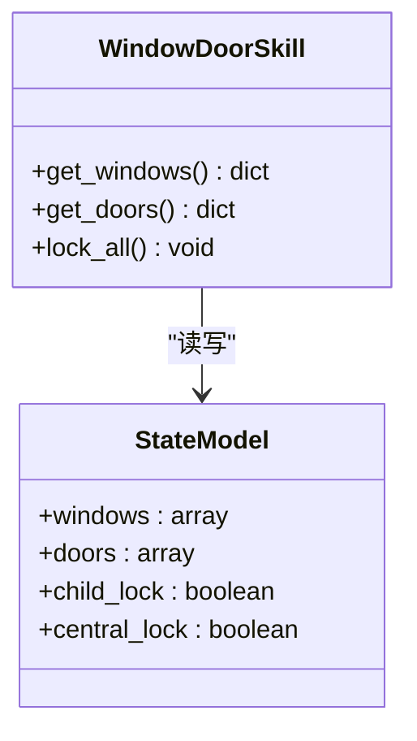
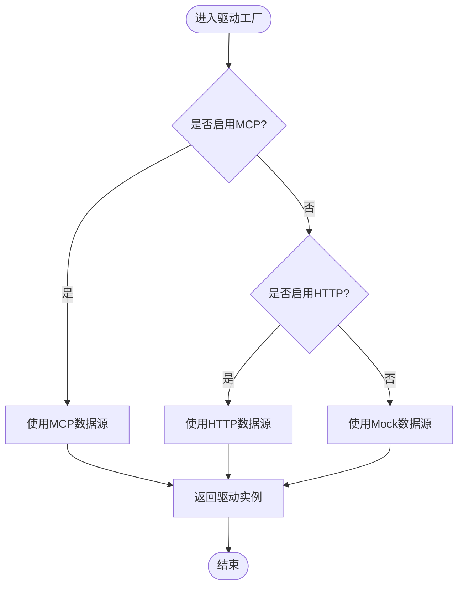
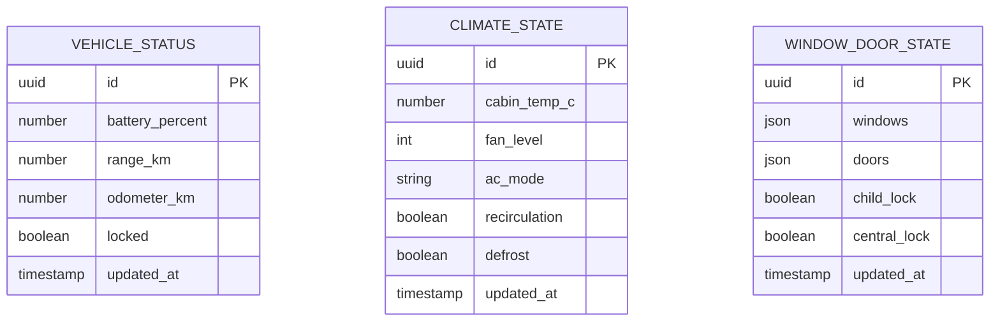
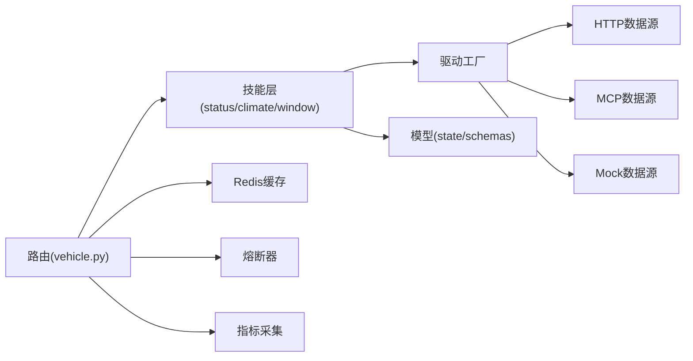

# 车辆状态查询技能

<cite>
**本文引用的文件**   
- [backend_design/nexus/skills/vehicle/status.py](file://backend_design/nexus/skills/vehicle/status.py)
- [backend_design/nexus/skills/vehicle/climate.py](file://backend_design/nexus/skills/vehicle/climate.py)
- [backend_design/nexus/skills/vehicle/window.py](file://backend_design/nexus/skills/vehicle/window.py)
- [backend_design/nexus/skills/vehicle/__init__.py](file://backend_design/nexus/skills/vehicle/__init__.py)
- [backend_design/nexus/skills/base.py](file://backend_design/nexus/skills/base.py)
- [backend_design/nexus/skills/orchestrator.py](file://backend_design/nexus/skills/orchestrator.py)
- [backend_design/nexus/api/routes/vehicle.py](file://backend_design/nexus/api/routes/vehicle.py)
- [backend_design/nexus/models/state.py](file://backend_design/nexus/models/state.py)
- [backend_design/nexus/models/schemas.py](file://backend_design/nexus/models/schemas.py)
- [backend_design/nexus/vehicle/factory.py](file://backend_design/nexus/vehicle/factory.py)
- [backend_design/nexus/vehicle/http.py](file://backend_design/nexus/vehicle/http.py)
- [backend_design/nexus/vehicle/mcp.py](file://backend_design/nexus/vehicle/mcp.py)
- [backend_design/nexus/vehicle/mock.py](file://backend_design/nexus/vehicle/mock.py)
- [backend_design/nexus/core/circuit_breaker.py](file://backend_design/nexus/core/circuit_breaker.py)
- [backend_design/nexus/middleware/redis_cache.py](file://backend_design/nexus/middleware/redis_cache.py)
- [backend_design/nexus/observability/cockpit_metrics.py](file://backend_design/nexus/observability/cockpit_metrics.py)
</cite>

## 目录
1. [简介](#简介)
2. [项目结构](#项目结构)
3. [核心组件](#核心组件)
4. [架构总览](#架构总览)
5. [详细组件分析](#详细组件分析)
6. [依赖关系分析](#依赖关系分析)
7. [性能与缓存策略](#性能与缓存策略)
8. [API 接口规范](#api-接口规范)
9. [故障排查指南](#故障排查指南)
10. [结论](#结论)

## 简介
本技术文档围绕“车辆状态查询技能”展开，系统性阐述以下方面：
- 数据采集机制：从车端或后端服务拉取、MCP 协议接入、Mock 数据源等。
- 数据模型定义：统一的状态模型、领域模型与 API Schema。
- 支持的车辆状态类型：电池电量、续航里程、车门状态、车窗状态、空调状态等。
- 更新频率、缓存策略与同步机制：Redis 缓存、熔断降级、指标观测。
- RESTful API 接口规范：请求参数、响应格式、错误码。
- 监控最佳实践与性能优化建议。

## 项目结构
与车辆状态查询相关的代码主要分布在以下模块：
- 技能层（skills）：按领域拆分，包含状态、空调、车窗等子技能。
- 车辆驱动层（vehicle）：提供 HTTP/MCP/Mock 等多种数据源适配。
- 模型层（models）：定义状态模型与 API Schema。
- 路由层（api/routes）：暴露 RESTful 接口。
- 中间件与可观测性：缓存、熔断、指标采集。

图表来源
- [backend_design/nexus/skills/base.py](file://backend_design/nexus/skills/base.py)
- [backend_design/nexus/skills/orchestrator.py](file://backend_design/nexus/skills/orchestrator.py)
- [backend_design/nexus/skills/vehicle/status.py](file://backend_design/nexus/skills/vehicle/status.py)
- [backend_design/nexus/skills/vehicle/climate.py](file://backend_design/nexus/skills/vehicle/climate.py)
- [backend_design/nexus/skills/vehicle/window.py](file://backend_design/nexus/skills/vehicle/window.py)
- [backend_design/nexus/vehicle/factory.py](file://backend_design/nexus/vehicle/factory.py)
- [backend_design/nexus/vehicle/http.py](file://backend_design/nexus/vehicle/http.py)
- [backend_design/nexus/vehicle/mcp.py](file://backend_design/nexus/vehicle/mcp.py)
- [backend_design/nexus/vehicle/mock.py](file://backend_design/nexus/vehicle/mock.py)
- [backend_design/nexus/models/state.py](file://backend_design/nexus/models/state.py)
- [backend_design/nexus/models/schemas.py](file://backend_design/nexus/models/schemas.py)
- [backend_design/nexus/api/routes/vehicle.py](file://backend_design/nexus/api/routes/vehicle.py)
- [backend_design/nexus/middleware/redis_cache.py](file://backend_design/nexus/middleware/redis_cache.py)
- [backend_design/nexus/core/circuit_breaker.py](file://backend_design/nexus/core/circuit_breaker.py)
- [backend_design/nexus/observability/cockpit_metrics.py](file://backend_design/nexus/observability/cockpit_metrics.py)

章节来源
- [backend_design/nexus/skills/vehicle/status.py](file://backend_design/nexus/skills/vehicle/status.py)
- [backend_design/nexus/skills/vehicle/climate.py](file://backend_design/nexus/skills/vehicle/climate.py)
- [backend_design/nexus/skills/vehicle/window.py](file://backend_design/nexus/skills/vehicle/window.py)
- [backend_design/nexus/skills/base.py](file://backend_design/nexus/skills/base.py)
- [backend_design/nexus/skills/orchestrator.py](file://backend_design/nexus/skills/orchestrator.py)
- [backend_design/nexus/vehicle/factory.py](file://backend_design/nexus/vehicle/factory.py)
- [backend_design/nexus/vehicle/http.py](file://backend_design/nexus/vehicle/http.py)
- [backend_design/nexus/vehicle/mcp.py](file://backend_design/nexus/vehicle/mcp.py)
- [backend_design/nexus/vehicle/mock.py](file://backend_design/nexus/vehicle/mock.py)
- [backend_design/nexus/models/state.py](file://backend_design/nexus/models/state.py)
- [backend_design/nexus/models/schemas.py](file://backend_design/nexus/models/schemas.py)
- [backend_design/nexus/api/routes/vehicle.py](file://backend_design/nexus/api/routes/vehicle.py)
- [backend_design/nexus/middleware/redis_cache.py](file://backend_design/nexus/middleware/redis_cache.py)
- [backend_design/nexus/core/circuit_breaker.py](file://backend_design/nexus/core/circuit_breaker.py)
- [backend_design/nexus/observability/cockpit_metrics.py](file://backend_design/nexus/observability/cockpit_metrics.py)

## 核心组件
- 技能基类与编排器
  - 基类定义了技能的通用能力与生命周期钩子，便于扩展新的车辆状态维度。
  - 编排器负责协调多个子技能，聚合结果并返回统一的视图。
- 领域技能
  - 状态技能：汇总电池、续航、锁止、里程等关键指标。
  - 空调技能：温度、风量、模式、内外循环等。
  - 车窗/车门技能：开闭状态、位置百分比、安全锁等。
- 车辆驱动工厂
  - 根据配置选择 HTTP、MCP 或 Mock 数据源，屏蔽底层差异。
- 模型与 Schema
  - state.py 定义领域状态对象；schemas.py 定义 API 输入输出结构。
- 中间件与可观测性
  - Redis 缓存、熔断器、指标埋点，保障高可用与可观测。

章节来源
- [backend_design/nexus/skills/base.py](file://backend_design/nexus/skills/base.py)
- [backend_design/nexus/skills/orchestrator.py](file://backend_design/nexus/skills/orchestrator.py)
- [backend_design/nexus/skills/vehicle/status.py](file://backend_design/nexus/skills/vehicle/status.py)
- [backend_design/nexus/skills/vehicle/climate.py](file://backend_design/nexus/skills/vehicle/climate.py)
- [backend_design/nexus/skills/vehicle/window.py](file://backend_design/nexus/skills/vehicle/window.py)
- [backend_design/nexus/vehicle/factory.py](file://backend_design/nexus/vehicle/factory.py)
- [backend_design/nexus/models/state.py](file://backend_design/nexus/models/state.py)
- [backend_design/nexus/models/schemas.py](file://backend_design/nexus/models/schemas.py)

## 架构总览
整体采用“技能 + 驱动 + 模型 + 路由”的分层架构：
- 路由层接收 REST 请求，调用编排器。
- 编排器调度各子技能，聚合领域状态。
- 子技能通过驱动工厂访问具体数据源（HTTP/MCP/Mock）。
- 模型层保证数据结构一致性，Schema 层约束 API 契约。
- 中间件提供缓存、熔断与指标观测。

图表来源
- [backend_design/nexus/api/routes/vehicle.py](file://backend_design/nexus/api/routes/vehicle.py)
- [backend_design/nexus/skills/orchestrator.py](file://backend_design/nexus/skills/orchestrator.py)
- [backend_design/nexus/skills/vehicle/status.py](file://backend_design/nexus/skills/vehicle/status.py)
- [backend_design/nexus/vehicle/factory.py](file://backend_design/nexus/vehicle/factory.py)
- [backend_design/nexus/vehicle/http.py](file://backend_design/nexus/vehicle/http.py)
- [backend_design/nexus/vehicle/mcp.py](file://backend_design/nexus/vehicle/mcp.py)
- [backend_design/nexus/vehicle/mock.py](file://backend_design/nexus/vehicle/mock.py)
- [backend_design/nexus/models/state.py](file://backend_design/nexus/models/state.py)
- [backend_design/nexus/middleware/redis_cache.py](file://backend_design/nexus/middleware/redis_cache.py)
- [backend_design/nexus/observability/cockpit_metrics.py](file://backend_design/nexus/observability/cockpit_metrics.py)

## 详细组件分析

### 状态技能（status.py）
职责与特性：
- 聚合电池电量、剩余续航、行驶里程、锁止状态等核心指标。
- 将原始数据映射为领域模型（state.py），确保上层一致的结构。
- 支持可选的过滤与格式化逻辑，便于前端展示。

图表来源
- [backend_design/nexus/skills/vehicle/status.py](file://backend_design/nexus/skills/vehicle/status.py)
- [backend_design/nexus/models/state.py](file://backend_design/nexus/models/state.py)

章节来源
- [backend_design/nexus/skills/vehicle/status.py](file://backend_design/nexus/skills/vehicle/status.py)
- [backend_design/nexus/models/state.py](file://backend_design/nexus/models/state.py)

### 空调技能（climate.py）
职责与特性：
- 管理空调温度、风量、模式、内外循环、除雾等。
- 对异常值进行边界校验与默认回退。
- 与状态技能协同，形成完整的座舱环境视图。

图表来源
- [backend_design/nexus/skills/vehicle/climate.py](file://backend_design/nexus/skills/vehicle/climate.py)
- [backend_design/nexus/models/state.py](file://backend_design/nexus/models/state.py)

章节来源
- [backend_design/nexus/skills/vehicle/climate.py](file://backend_design/nexus/skills/vehicle/climate.py)
- [backend_design/nexus/models/state.py](file://backend_design/nexus/models/state.py)

### 车窗/车门技能（window.py）
职责与特性：
- 管理车窗开闭位置、车门锁止、儿童锁等。
- 对安全相关状态进行强校验与告警提示。
- 与状态技能合并后，提供整车安全与环境概览。

图表来源
- [backend_design/nexus/skills/vehicle/window.py](file://backend_design/nexus/skills/vehicle/window.py)
- [backend_design/nexus/models/state.py](file://backend_design/nexus/models/state.py)

章节来源
- [backend_design/nexus/skills/vehicle/window.py](file://backend_design/nexus/skills/vehicle/window.py)
- [backend_design/nexus/models/state.py](file://backend_design/nexus/models/state.py)

### 驱动工厂与数据源（factory/http/mcp/mock）
- 工厂根据配置动态选择数据源实现，屏蔽差异。
- HTTP 数据源通过 REST 拉取车端或云端状态。
- MCP 数据源通过消息通信协议获取实时状态。
- Mock 数据源用于开发与测试阶段快速验证。

图表来源
- [backend_design/nexus/vehicle/factory.py](file://backend_design/nexus/vehicle/factory.py)
- [backend_design/nexus/vehicle/http.py](file://backend_design/nexus/vehicle/http.py)
- [backend_design/nexus/vehicle/mcp.py](file://backend_design/nexus/vehicle/mcp.py)
- [backend_design/nexus/vehicle/mock.py](file://backend_design/nexus/vehicle/mock.py)

章节来源
- [backend_design/nexus/vehicle/factory.py](file://backend_design/nexus/vehicle/factory.py)
- [backend_design/nexus/vehicle/http.py](file://backend_design/nexus/vehicle/http.py)
- [backend_design/nexus/vehicle/mcp.py](file://backend_design/nexus/vehicle/mcp.py)
- [backend_design/nexus/vehicle/mock.py](file://backend_design/nexus/vehicle/mock.py)

### 模型与 Schema（state.py, schemas.py）
- state.py 定义领域状态对象，包括电池、续航、门锁、车窗、空调等字段。
- schemas.py 定义 API 的请求与响应结构，确保前后端契约稳定。

图表来源
- [backend_design/nexus/models/state.py](file://backend_design/nexus/models/state.py)
- [backend_design/nexus/models/schemas.py](file://backend_design/nexus/models/schemas.py)

章节来源
- [backend_design/nexus/models/state.py](file://backend_design/nexus/models/state.py)
- [backend_design/nexus/models/schemas.py](file://backend_design/nexus/models/schemas.py)

## 依赖关系分析
- 低耦合：技能层仅依赖驱动工厂与模型层，不直接感知数据源细节。
- 高内聚：每个领域技能聚焦单一维度，易于扩展与维护。
- 外部依赖：Redis 缓存、熔断器、指标系统，提升稳定性与可观测性。

图表来源
- [backend_design/nexus/skills/vehicle/status.py](file://backend_design/nexus/skills/vehicle/status.py)
- [backend_design/nexus/skills/vehicle/climate.py](file://backend_design/nexus/skills/vehicle/climate.py)
- [backend_design/nexus/skills/vehicle/window.py](file://backend_design/nexus/skills/vehicle/window.py)
- [backend_design/nexus/vehicle/factory.py](file://backend_design/nexus/vehicle/factory.py)
- [backend_design/nexus/vehicle/http.py](file://backend_design/nexus/vehicle/http.py)
- [backend_design/nexus/vehicle/mcp.py](file://backend_design/nexus/vehicle/mcp.py)
- [backend_design/nexus/vehicle/mock.py](file://backend_design/nexus/vehicle/mock.py)
- [backend_design/nexus/models/state.py](file://backend_design/nexus/models/state.py)
- [backend_design/nexus/models/schemas.py](file://backend_design/nexus/models/schemas.py)
- [backend_design/nexus/api/routes/vehicle.py](file://backend_design/nexus/api/routes/vehicle.py)
- [backend_design/nexus/middleware/redis_cache.py](file://backend_design/nexus/middleware/redis_cache.py)
- [backend_design/nexus/core/circuit_breaker.py](file://backend_design/nexus/core/circuit_breaker.py)
- [backend_design/nexus/observability/cockpit_metrics.py](file://backend_design/nexus/observability/cockpit_metrics.py)

章节来源
- [backend_design/nexus/api/routes/vehicle.py](file://backend_design/nexus/api/routes/vehicle.py)
- [backend_design/nexus/middleware/redis_cache.py](file://backend_design/nexus/middleware/redis_cache.py)
- [backend_design/nexus/core/circuit_breaker.py](file://backend_design/nexus/core/circuit_breaker.py)
- [backend_design/nexus/observability/cockpit_metrics.py](file://backend_design/nexus/observability/cockpit_metrics.py)

## 性能与缓存策略
- 缓存策略
  - 基于 Redis 的键值缓存，按车辆 ID 与状态维度构建缓存键。
  - 设置合理的 TTL，平衡实时性与负载压力。
  - 写穿透保护：在热点状态下避免频繁刷新导致雪崩。
- 熔断与降级
  - 当数据源不可用或超时，触发熔断，返回最近一次成功缓存或默认值。
  - 逐步恢复探测，避免抖动。
- 指标观测
  - 记录请求耗时、缓存命中率、熔断触发次数、数据源错误率。
  - 结合 Grafana/Prometheus 进行可视化监控与告警。

章节来源
- [backend_design/nexus/middleware/redis_cache.py](file://backend_design/nexus/middleware/redis_cache.py)
- [backend_design/nexus/core/circuit_breaker.py](file://backend_design/nexus/core/circuit_breaker.py)
- [backend_design/nexus/observability/cockpit_metrics.py](file://backend_design/nexus/observability/cockpit_metrics.py)

## API 接口规范
以下为车辆状态查询的核心 RESTful 接口约定（以路径与语义描述为主，具体字段以 models/schemas.py 为准）：

- 查询整车状态
  - 方法：GET
  - 路径：/api/vehicle/status
  - 请求参数：
    - vehicle_id：字符串，必填
    - fields：数组，可选，指定需要返回的状态维度（如 battery、climate、windows）
  - 响应体：
    - code：整数，业务状态码
    - message：字符串，提示信息
    - data：对象，包含各维度状态数据
  - 错误码：
    - 200：成功
    - 400：参数校验失败
    - 404：车辆不存在
    - 500：内部错误
    - 503：服务不可用（熔断/数据源异常）

- 查询空调状态
  - 方法：GET
  - 路径：/api/vehicle/climate
  - 请求参数：vehicle_id（必填）
  - 响应体：code/message/data，data 包含温度、风量、模式、内外循环、除雾等

- 查询车窗/车门状态
  - 方法：GET
  - 路径：/api/vehicle/windows-doors
  - 请求参数：vehicle_id（必填）
  - 响应体：code/message/data，data 包含车窗位置、车门锁止、儿童锁等

- 批量查询
  - 方法：POST
  - 路径：/api/vehicle/status/batch
  - 请求体：
    - vehicles：数组，每项包含 vehicle_id 与 fields
  - 响应体：code/message/data，data 为各车辆的聚合状态

- 错误处理
  - 统一错误结构：{ code, message, details? }
  - 常见错误：
    - 参数缺失或类型错误
    - 车辆不存在
    - 数据源超时或连接失败
    - 熔断触发时的降级响应

章节来源
- [backend_design/nexus/api/routes/vehicle.py](file://backend_design/nexus/api/routes/vehicle.py)
- [backend_design/nexus/models/schemas.py](file://backend_design/nexus/models/schemas.py)

## 故障排查指南
- 常见问题定位
  - 缓存未命中：检查 Redis 连接与键空间，确认 TTL 设置合理。
  - 熔断频繁触发：观察数据源健康度与网络延迟，调整熔断阈值与恢复策略。
  - 指标异常：核对埋点是否正确上报，查看 Prometheus/Grafana 面板。
- 日志与追踪
  - 在路由与技能层增加关键步骤日志，记录请求 ID、参数、耗时与错误堆栈。
  - 结合分布式追踪工具（如 OpenTelemetry）进行端到端链路分析。
- 回滚与降级
  - 优先返回缓存数据或默认值，保障用户体验。
  - 针对特定维度（如空调）实施独立降级策略，避免全量失败。

章节来源
- [backend_design/nexus/core/circuit_breaker.py](file://backend_design/nexus/core/circuit_breaker.py)
- [backend_design/nexus/observability/cockpit_metrics.py](file://backend_design/nexus/observability/cockpit_metrics.py)
- [backend_design/nexus/middleware/redis_cache.py](file://backend_design/nexus/middleware/redis_cache.py)

## 结论
本方案通过“技能 + 驱动 + 模型 + 路由”的分层设计，实现了车辆状态查询的高内聚、低耦合与可扩展性。借助 Redis 缓存、熔断与指标观测，系统在稳定性与性能上具备良好保障。后续可进一步引入更细粒度的缓存键策略、增量更新与事件驱动同步，以提升实时性与资源利用率。