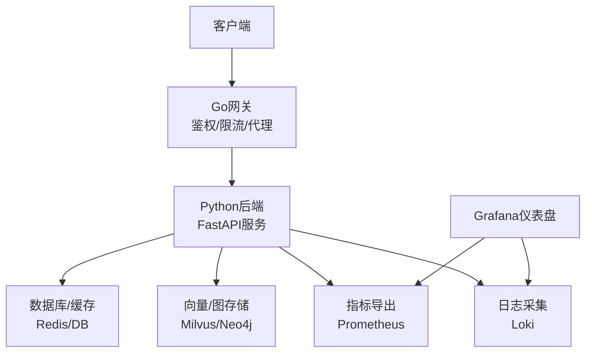
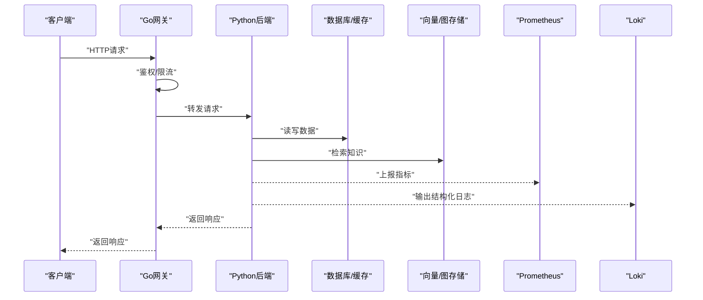
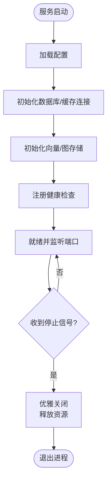
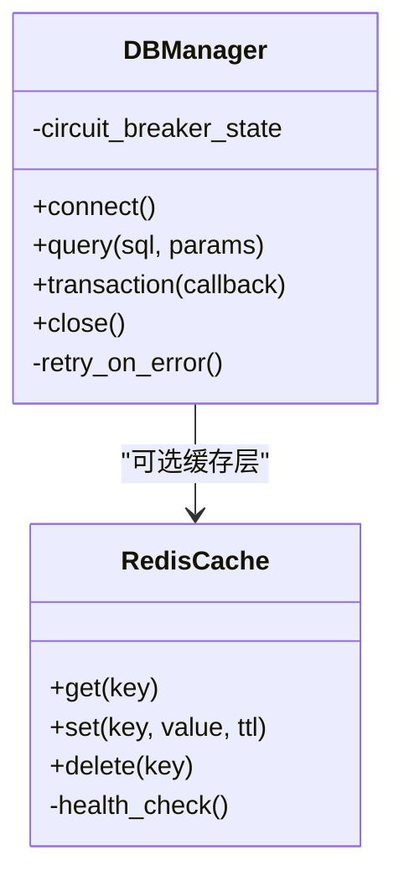
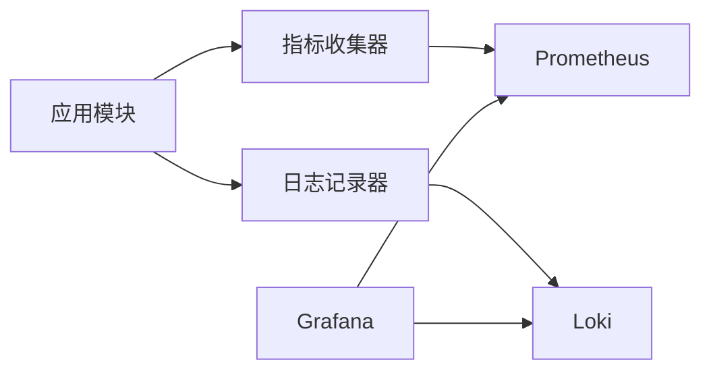
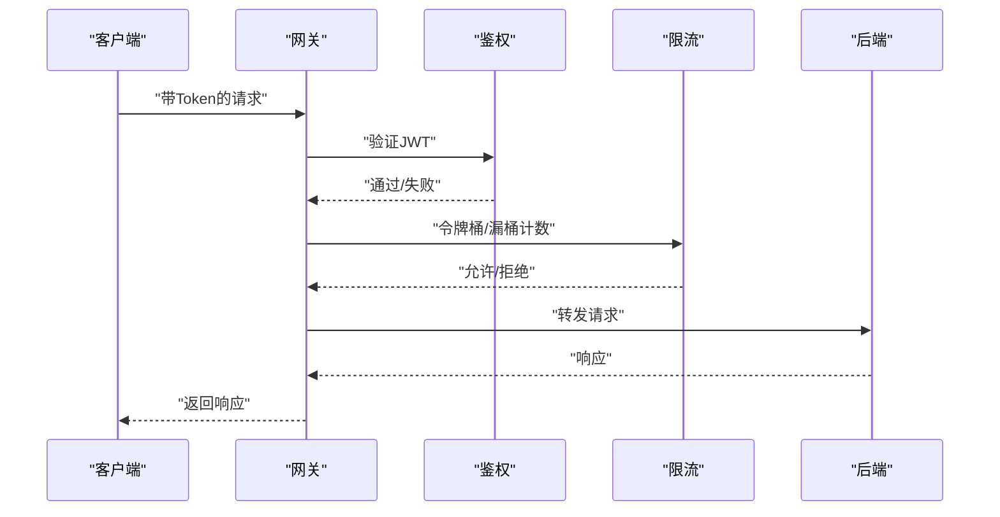
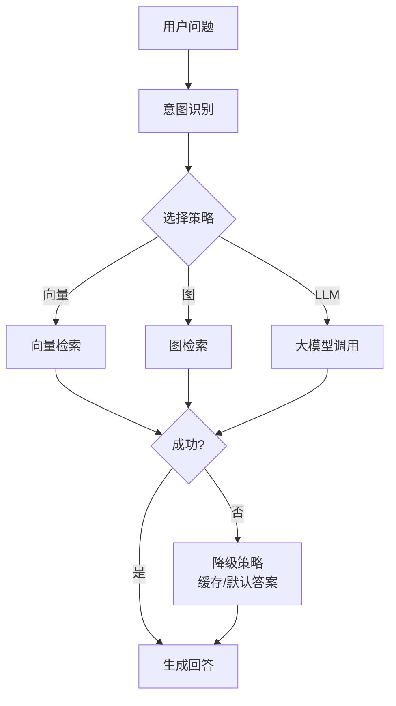
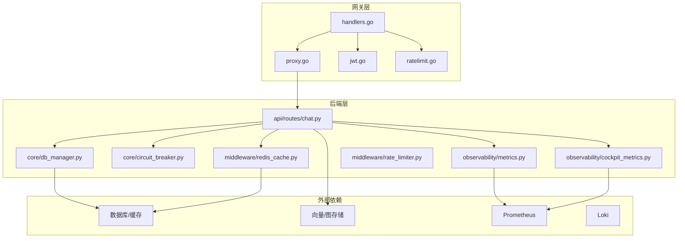
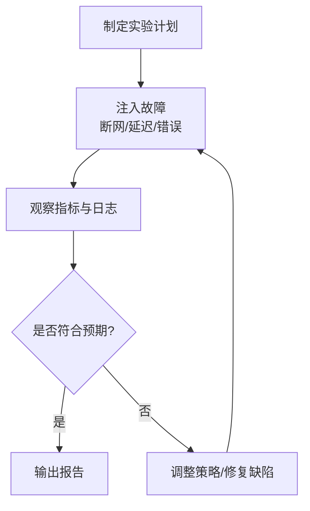

# 故障排查

<cite>
**本文引用的文件**   
- [backend_design/nexus/main.py](file://backend_design/nexus/main.py)
- [backend_design/nexus/core/db_manager.py](file://backend_design/nexus/core/db_manager.py)
- [backend_design/nexus/core/exceptions.py](file://backend_design/nexus/core/exceptions.py)
- [backend_design/nexus/core/logger.py](file://backend_design/nexus/core/logger.py)
- [backend_design/nexus/core/circuit_breaker.py](file://backend_design/nexus/core/circuit_breaker.py)
- [backend_design/nexus/api/routes/chat.py](file://backend_design/nexus/api/routes/chat.py)
- [backend_design/nexus/api/websocket.py](file://backend_design/nexus/api/websocket.py)
- [backend_design/nexus/middleware/rate_limiter.py](file://backend_design/nexus/middleware/rate_limiter.py)
- [backend_design/nexus/middleware/redis_cache.py](file://backend_design/nexus/middleware/redis_cache.py)
- [backend_design/nexus/observability/metrics.py](file://backend_design/nexus/observability/metrics.py)
- [backend_design/nexus/observability/cockpit_metrics.py](file://backend_design/nexus/observability/cockpit_metrics.py)
- [backend_design/nexus/config.py](file://backend_design/nexus/config.py)
- [backend_design/nexus_gate/internal/handlers/handlers.go](file://backend_design/nexus_gate/internal/handlers/handlers.go)
- [backend_design/nexus_gate/internal/proxy/proxy.go](file://backend_design/nexus_gate/internal/proxy/proxy.go)
- [backend_design/nexus_gate/internal/auth/jwt.go](file://backend_design/nexus_gate/internal/auth/jwt.go)
- [backend_design/nexus_gate/internal/ratelimit/ratelimit.go](file://backend_design/nexus_gate/internal/ratelimit/ratelimit.go)
- [config/prometheus/prometheus.yml](file://config/prometheus/prometheus.yml)
- [config/grafana/provisioning/datasources/prometheus.yml](file://config/grafana/provisioning/datasources/prometheus.yml)
- [config/grafana/provisioning/dashboards/dashboards.yml](file://config/grafana/provisioning/dashboards/dashboards.yml)
- [config/grafana/provisioning/dashboards/nexuscockpit-overview.json](file://config/grafana/provisioning/dashboards/nexuscockpit-overview.json)
- [config/loki/loki-config.yml](file://config/loki/loki-config.yml)
- [docker-compose.yml](file://docker-compose.yml)
- [scripts/chaos_test.py](file://scripts/chaos_test.py)
- [scripts/test_db.py](file://scripts/test_db.py)
- [scripts/test_api.py](file://scripts/test_api.py)
- [scripts/test_metrics.py](file://scripts/test_metrics.py)
- [backend_design/scripts/init_milvus.py](file://backend_design/scripts/init_milvus.py)
- [backend_design/scripts/init_neo4j.py](file://backend_design/scripts/init_neo4j.py)
- [backend_design/nexus/intent/llm_router.py](file://backend_design/nexus/intent/llm_router.py)
- [backend_design/nexus/rag/vector_store.py](file://backend_design/nexus/rag/vector_store.py)
- [backend_design/nexus/rag/graph_store.py](file://backend_design/nexus/rag/graph_store.py)
- [backend_design/nexus/skills/orchestrator.py](file://backend_design/nexus/skills/orchestrator.py)
</cite>

## 目录
1. [简介](#简介)
2. [项目结构](#项目结构)
3. [核心组件](#核心组件)
4. [架构总览](#架构总览)
5. [详细组件分析](#详细组件分析)
6. [依赖关系分析](#依赖关系分析)
7. [性能注意事项](#性能注意事项)
8. [故障排查指南](#故障排查指南)
9. [混沌工程与压测](#混沌工程与压测)
10. [监控告警配置与优化](#监控告警配置与优化)
11. [应急响应与回滚策略](#应急响应与回滚策略)
12. [结论](#结论)

## 简介
本指南面向NexusCockpit系统的运维与研发人员，聚焦于“服务启动失败、数据库连接异常、AI模型加载错误”等典型问题，提供系统化的诊断方法（日志分析、性能瓶颈定位、内存泄漏检测）、混沌工程测试方法与工具、监控告警配置与优化建议，以及应急响应流程与回滚策略。文档以仓库现有实现为依据，结合可观测性、中间件与网关层代码进行说明，帮助快速定位并恢复服务。

## 项目结构
NexusCockpit采用前后端分离与多语言微服务组合：
- Python后端：业务逻辑、API路由、中间件、可观测性指标、RAG检索、意图路由、技能编排等
- Go网关：鉴权、限流、反向代理、WebSocket转发
- 前端：Next.js应用
- 可观测性：Prometheus、Grafana、Loki
- 数据与向量存储：Neo4j、Milvus等
- 脚本：初始化、测试、混沌工程

**图表来源** 
- [backend_design/nexus/main.py](file://backend_design/nexus/main.py)
- [backend_design/nexus_gate/internal/handlers/handlers.go](file://backend_design/nexus_gate/internal/handlers/handlers.go)
- [backend_design/nexus_gate/internal/proxy/proxy.go](file://backend_design/nexus_gate/internal/proxy/proxy.go)
- [backend_design/nexus/observability/metrics.py](file://backend_design/nexus/observability/metrics.py)
- [config/prometheus/prometheus.yml](file://config/prometheus/prometheus.yml)
- [config/grafana/provisioning/dashboards/dashboards.yml](file://config/grafana/provisioning/dashboards/dashboards.yml)

**章节来源**
- [backend_design/nexus/main.py](file://backend_design/nexus/main.py)
- [backend_design/nexus_gate/internal/handlers/handlers.go](file://backend_design/nexus_gate/internal/handlers/handlers.go)
- [backend_design/nexus_gate/internal/proxy/proxy.go](file://backend_design/nexus_gate/internal/proxy/proxy.go)
- [config/prometheus/prometheus.yml](file://config/prometheus/prometheus.yml)
- [config/grafana/provisioning/dashboards/dashboards.yml](file://config/grafana/provisioning/dashboards/dashboards.yml)

## 核心组件
- 服务入口与生命周期管理：负责应用启动、依赖注入、健康检查、优雅关闭
- 数据库与缓存连接管理：连接池、重试、熔断、降级
- 可观测性：指标收集、日志结构化、链路追踪
- 网关鉴权与限流：JWT校验、令牌桶/漏桶限流、代理转发
- RAG与意图路由：向量检索、图检索、LLM路由与容错
- 中间件：速率限制、会话存储、任务队列

**章节来源**
- [backend_design/nexus/main.py](file://backend_design/nexus/main.py)
- [backend_design/nexus/core/db_manager.py](file://backend_design/nexus/core/db_manager.py)
- [backend_design/nexus/core/logger.py](file://backend_design/nexus/core/logger.py)
- [backend_design/nexus/observability/metrics.py](file://backend_design/nexus/observability/metrics.py)
- [backend_design/nexus_gate/internal/auth/jwt.go](file://backend_design/nexus_gate/internal/auth/jwt.go)
- [backend_design/nexus_gate/internal/ratelimit/ratelimit.go](file://backend_design/nexus_gate/internal/ratelimit/ratelimit.go)

## 架构总览
从请求到响应的主要路径：
- 客户端通过网关进入，网关完成鉴权与限流后转发至后端
- 后端处理业务逻辑，访问数据库、缓存、向量/图存储
- 指标与日志上报至Prometheus与Loki，Grafana统一展示

**图表来源**
- [backend_design/nexus_gate/internal/handlers/handlers.go](file://backend_design/nexus_gate/internal/handlers/handlers.go)
- [backend_design/nexus_gate/internal/proxy/proxy.go](file://backend_design/nexus_gate/internal/proxy/proxy.go)
- [backend_design/nexus/api/routes/chat.py](file://backend_design/nexus/api/routes/chat.py)
- [backend_design/nexus/observability/metrics.py](file://backend_design/nexus/observability/metrics.py)
- [config/prometheus/prometheus.yml](file://config/prometheus/prometheus.yml)
- [config/loki/loki-config.yml](file://config/loki/loki-config.yml)

## 详细组件分析

### 服务启动与生命周期
- 启动阶段需确保依赖服务可用（数据库、缓存、向量/图存储）
- 健康检查接口用于网关与健康探针探测
- 优雅关闭应释放连接池、停止后台任务

**图表来源**
- [backend_design/nexus/main.py](file://backend_design/nexus/main.py)
- [backend_design/nexus/core/db_manager.py](file://backend_design/nexus/core/db_manager.py)
- [backend_design/nexus/config.py](file://backend_design/nexus/config.py)

**章节来源**
- [backend_design/nexus/main.py](file://backend_design/nexus/main.py)
- [backend_design/nexus/core/db_manager.py](file://backend_design/nexus/core/db_manager.py)
- [backend_design/nexus/config.py](file://backend_design/nexus/config.py)

### 数据库与缓存连接管理
- 连接池参数、超时、重试策略
- 连接异常时的熔断与降级
- Redis缓存的可用性检测与回退

**图表来源**
- [backend_design/nexus/core/db_manager.py](file://backend_design/nexus/core/db_manager.py)
- [backend_design/nexus/middleware/redis_cache.py](file://backend_design/nexus/middleware/redis_cache.py)

**章节来源**
- [backend_design/nexus/core/db_manager.py](file://backend_design/nexus/core/db_manager.py)
- [backend_design/nexus/middleware/redis_cache.py](file://backend_design/nexus/middleware/redis_cache.py)

### 可观测性与日志
- 指标：请求延迟、错误率、QPS、连接池使用率、模型加载耗时
- 日志：结构化字段（trace_id、tenant_id、user_id、intent、skill）
- 链路：网关与后端关联trace_id

**图表来源**
- [backend_design/nexus/observability/metrics.py](file://backend_design/nexus/observability/metrics.py)
- [backend_design/nexus/core/logger.py](file://backend_design/nexus/core/logger.py)
- [config/prometheus/prometheus.yml](file://config/prometheus/prometheus.yml)
- [config/loki/loki-config.yml](file://config/loki/loki-config.yml)

**章节来源**
- [backend_design/nexus/observability/metrics.py](file://backend_design/nexus/observability/metrics.py)
- [backend_design/nexus/core/logger.py](file://backend_design/nexus/core/logger.py)
- [config/prometheus/prometheus.yml](file://config/prometheus/prometheus.yml)
- [config/loki/loki-config.yml](file://config/loki/loki-config.yml)

### 网关鉴权与限流
- JWT校验失败直接拒绝
- 限流触发返回429或降级策略
- 代理转发时透传必要头信息

**图表来源**
- [backend_design/nexus_gate/internal/auth/jwt.go](file://backend_design/nexus_gate/internal/auth/jwt.go)
- [backend_design/nexus_gate/internal/ratelimit/ratelimit.go](file://backend_design/nexus_gate/internal/ratelimit/ratelimit.go)
- [backend_design/nexus_gate/internal/handlers/handlers.go](file://backend_design/nexus_gate/internal/handlers/handlers.go)
- [backend_design/nexus_gate/internal/proxy/proxy.go](file://backend_design/nexusGate/internal/proxy/proxy.go)

**章节来源**
- [backend_design/nexus_gate/internal/auth/jwt.go](file://backend_design/nexus_gate/internal/auth/jwt.go)
- [backend_design/nexus_gate/internal/ratelimit/ratelimit.go](file://backend_design/nexus_gate/internal/ratelimit/ratelimit.go)
- [backend_design/nexus_gate/internal/handlers/handlers.go](file://backend_design/nexus_gate/internal/handlers/handlers.go)
- [backend_design/nexus_gate/internal/proxy/proxy.go](file://backend_design/nexus_gate/internal/proxy/proxy.go)

### RAG检索与意图路由
- 向量检索失败回退到关键词或默认答案
- 图检索失败走降级策略
- LLM路由失败启用本地规则或缓存结果

**图表来源**
- [backend_design/nexus/intent/llm_router.py](file://backend_design/nexus/intent/llm_router.py)
- [backend_design/nexus/rag/vector_store.py](file://backend_design/nexus/rag/vector_store.py)
- [backend_design/nexus/rag/graph_store.py](file://backend_design/nexus/rag/graph_store.py)
- [backend_design/nexus/skills/orchestrator.py](file://backend_design/nexus/skills/orchestrator.py)

**章节来源**
- [backend_design/nexus/intent/llm_router.py](file://backend_design/nexus/intent/llm_router.py)
- [backend_design/nexus/rag/vector_store.py](file://backend_design/nexus/rag/vector_store.py)
- [backend_design/nexus/rag/graph_store.py](file://backend_design/nexus/rag/graph_store.py)
- [backend_design/nexus/skills/orchestrator.py](file://backend_design/nexus/skills/orchestrator.py)

## 依赖关系分析
- 后端对数据库、缓存、向量/图存储存在强依赖
- 网关对鉴权与限流组件有强依赖
- 可观测性为横切关注点，贯穿各模块

**图表来源**
- [backend_design/nexus_gate/internal/handlers/handlers.go](file://backend_design/nexus_gate/internal/handlers/handlers.go)
- [backend_design/nexus_gate/internal/proxy/proxy.go](file://backend_design/nexus_gate/internal/proxy/proxy.go)
- [backend_design/nexus_gate/internal/auth/jwt.go](file://backend_design/nexus_gate/internal/auth/jwt.go)
- [backend_design/nexus_gate/internal/ratelimit/ratelimit.go](file://backend_design/nexus_gate/internal/ratelimit/ratelimit.go)
- [backend_design/nexus/api/routes/chat.py](file://backend_design/nexus/api/routes/chat.py)
- [backend_design/nexus/core/db_manager.py](file://backend_design/nexus/core/db_manager.py)
- [backend_design/nexus/core/circuit_breaker.py](file://backend_design/nexus/core/circuit_breaker.py)
- [backend_design/nexus/observability/metrics.py](file://backend_design/nexus/observability/metrics.py)
- [backend_design/nexus/observability/cockpit_metrics.py](file://backend_design/nexus/observability/cockpit_metrics.py)
- [backend_design/nexus/middleware/rate_limiter.py](file://backend_design/nexus/middleware/rate_limiter.py)
- [backend_design/nexus/middleware/redis_cache.py](file://backend_design/nexus/middleware/redis_cache.py)

**章节来源**
- [backend_design/nexus_gate/internal/handlers/handlers.go](file://backend_design/nexus_gate/internal/handlers/handlers.go)
- [backend_design/nexus_gate/internal/proxy/proxy.go](file://backend_design/nexus_gate/internal/proxy/proxy.go)
- [backend_design/nexus_gate/internal/auth/jwt.go](file://backend_design/nexus_gate/internal/auth/jwt.go)
- [backend_design/nexus_gate/internal/ratelimit/ratelimit.go](file://backend_design/nexus_gate/internal/ratelimit/ratelimit.go)
- [backend_design/nexus/api/routes/chat.py](file://backend_design/nexus/api/routes/chat.py)
- [backend_design/nexus/core/db_manager.py](file://backend_design/nexus/core/db_manager.py)
- [backend_design/nexus/core/circuit_breaker.py](file://backend_design/nexus/core/circuit_breaker.py)
- [backend_design/nexus/observability/metrics.py](file://backend_design/nexus/observability/metrics.py)
- [backend_design/nexus/observability/cockpit_metrics.py](file://backend_design/nexus/observability/cockpit_metrics.py)
- [backend_design/nexus/middleware/rate_limiter.py](file://backend_design/nexus/middleware/rate_limiter.py)
- [backend_design/nexus/middleware/redis_cache.py](file://backend_design/nexus/middleware/redis_cache.py)

## 性能注意事项
- 连接池大小与超时：根据并发量调整，避免连接耗尽导致排队
- 缓存命中率：热点数据优先命中缓存，降低数据库压力
- 向量/图检索：控制查询规模与排序开销，必要时引入分页与预索引
- 指标采样：高频指标适当降采样，减少Prometheus写入压力
- 日志级别：生产环境使用INFO及以上，避免DEBUG造成IO瓶颈

[本节为通用指导，不直接分析具体文件]

## 故障排查指南

### 服务启动失败
常见症状：
- 进程启动后立即退出
- 健康检查失败
- 端口未监听

排查步骤：
- 检查配置文件与环境变量是否完整
- 查看启动日志中的关键错误（如依赖不可达、证书无效）
- 验证数据库、缓存、向量/图存储的连接参数与网络可达性
- 确认健康检查接口是否正常返回

定位要点：
- 启动流程中依赖初始化顺序与失败回退
- 健康检查注册与探针配置
- 端口绑定与防火墙规则

参考实现位置：
- [服务入口与生命周期](file://backend_design/nexus/main.py)
- [数据库连接管理](file://backend_design/nexus/core/db_manager.py)
- [配置加载](file://backend_design/nexus/config.py)

**章节来源**
- [backend_design/nexus/main.py](file://backend_design/nexus/main.py)
- [backend_design/nexus/core/db_manager.py](file://backend_design/nexus/core/db_manager.py)
- [backend_design/nexus/config.py](file://backend_design/nexus/config.py)

### 数据库连接异常
常见症状：
- 请求频繁超时或报错
- 连接池耗尽
- 事务执行失败

排查步骤：
- 检查数据库服务状态与网络连通性
- 查看连接池使用率与等待队列长度
- 核对认证信息与权限
- 观察慢查询与锁竞争

定位要点：
- 重试与熔断策略是否生效
- 事务边界与资源释放是否合理
- 缓存层是否有效分担读压力

参考实现位置：
- [数据库连接管理](file://backend_design/nexus/core/db_manager.py)
- [熔断器](file://backend_design/nexus/core/circuit_breaker.py)
- [Redis缓存中间件](file://backend_design/nexus/middleware/redis_cache.py)

**章节来源**
- [backend_design/nexus/core/db_manager.py](file://backend_design/nexus/core/db_manager.py)
- [backend_design/nexus/core/circuit_breaker.py](file://backend_design/nexus/core/circuit_breaker.py)
- [backend_design/nexus/middleware/redis_cache.py](file://backend_design/nexus/middleware/redis_cache.py)

### AI模型加载错误
常见症状：
- 意图路由或RAG检索失败
- 向量/图存储查询超时
- 大模型调用异常

排查步骤：
- 检查向量/图存储初始化脚本是否执行成功
- 验证模型权重与配置文件完整性
- 观察检索与路由日志，定位失败分支
- 评估并发与资源占用，必要时扩容或限流

定位要点：
- 初始化脚本与依赖服务状态
- 检索与路由的降级策略
- 指标中模型加载耗时与错误率

参考实现位置：
- [意图路由](file://backend_design/nexus/intent/llm_router.py)
- [向量存储](file://backend_design/nexus/rag/vector_store.py)
- [图存储](file://backend_design/nexus/rag/graph_store.py)
- [技能编排](file://backend_design/nexus/skills/orchestrator.py)
- [Milvus初始化](file://backend_design/scripts/init_milvus.py)
- [Neo4j初始化](file://backend_design/scripts/init_neo4j.py)

**章节来源**
- [backend_design/nexus/intent/llm_router.py](file://backend_design/nexus/intent/llm_router.py)
- [backend_design/nexus/rag/vector_store.py](file://backend_design/nexus/rag/vector_store.py)
- [backend_design/nexus/rag/graph_store.py](file://backend_design/nexus/rag/graph_store.py)
- [backend_design/nexus/skills/orchestrator.py](file://backend_design/nexus/skills/orchestrator.py)
- [backend_design/scripts/init_milvus.py](file://backend_design/scripts/init_milvus.py)
- [backend_design/scripts/init_neo4j.py](file://backend_design/scripts/init_neo4j.py)

### WebSocket连接问题
常见症状：
- 前端无法建立WS连接
- 消息丢失或乱序
- 心跳超时断开

排查步骤：
- 检查网关WS转发配置与路径映射
- 查看后端WS处理器日志与错误码
- 验证跨域与安全策略
- 监控连接数与消息吞吐

参考实现位置：
- [WebSocket路由](file://backend_design/nexus/api/websocket.py)
- [网关代理](file://backend_design/nexus_gate/internal/proxy/proxy.go)

**章节来源**
- [backend_design/nexus/api/websocket.py](file://backend_design/nexus/api/websocket.py)
- [backend_design/nexus_gate/internal/proxy/proxy.go](file://backend_design/nexus_gate/internal/proxy/proxy.go)

### 鉴权与限流问题
常见症状：
- 401/403错误增多
- 429限流触发频繁
- 代理转发失败

排查步骤：
- 检查JWT签名与过期时间
- 核对限流阈值与配额
- 查看网关代理日志与上游错误
- 评估峰值流量与容量规划

参考实现位置：
- [JWT鉴权](file://backend_design/nexus_gate/internal/auth/jwt.go)
- [限流实现](file://backend_design/nexus_gate/internal/ratelimit/ratelimit.go)
- [网关处理器](file://backend_design/nexus_gate/internal/handlers/handlers.go)
- [后端限流中间件](file://backend_design/nexus/middleware/rate_limiter.py)

**章节来源**
- [backend_design/nexus_gate/internal/auth/jwt.go](file://backend_design/nexus_gate/internal/auth/jwt.go)
- [backend_design/nexus_gate/internal/ratelimit/ratelimit.go](file://backend_design/nexus_gate/internal/ratelimit/ratelimit.go)
- [backend_design/nexus_gate/internal/handlers/handlers.go](file://backend_design/nexus_gate/internal/handlers/handlers.go)
- [backend_design/nexus/middleware/rate_limiter.py](file://backend_design/nexus/middleware/rate_limiter.py)

### 日志分析方法
- 关键字段：trace_id、tenant_id、user_id、intent、skill、error_code
- 分层定位：网关→后端→存储→模型
- 聚合统计：按错误码、租户、技能维度汇总
- 关联分析：将指标异常与日志错误对齐

参考实现位置：
- [日志记录器](file://backend_design/nexus/core/logger.py)
- [指标收集](file://backend_design/nexus/observability/metrics.py)
- [Cockpit指标](file://backend_design/nexus/observability/cockpit_metrics.py)

**章节来源**
- [backend_design/nexus/core/logger.py](file://backend_design/nexus/core/logger.py)
- [backend_design/nexus/observability/metrics.py](file://backend_design/nexus/observability/metrics.py)
- [backend_design/nexus/observability/cockpit_metrics.py](file://backend_design/nexus/observability/cockpit_metrics.py)

### 性能瓶颈定位
- 指标维度：请求延迟分布、错误率、QPS、连接池使用率、GC停顿
- 热点路径：意图路由、RAG检索、LLM调用
- 压测对比：基线指标与回归差异
- 资源监控：CPU、内存、磁盘IO、网络带宽

参考实现位置：
- [指标收集](file://backend_design/nexus/observability/metrics.py)
- [Cockpit指标](file://backend_design/nexus/observability/cockpit_metrics.py)
- [Prometheus配置](file://config/prometheus/prometheus.yml)

**章节来源**
- [backend_design/nexus/observability/metrics.py](file://backend_design/nexus/observability/metrics.py)
- [backend_design/nexus/observability/cockpit_metrics.py](file://backend_design/nexus/observability/cockpit_metrics.py)
- [config/prometheus/prometheus.yml](file://config/prometheus/prometheus.yml)

### 内存泄漏检测
- 指标辅助：堆大小、对象分配速率、GC次数
- 快照分析：在异常时段抓取堆快照并对比
- 热点对象：定位长期存活的大对象与引用链
- 修复建议：及时释放连接、避免全局缓存膨胀、优化序列化

参考实现位置：
- [指标收集](file://backend_design/nexus/observability/metrics.py)
- [Cockpit指标](file://backend_design/nexus/observability/cockpit_metrics.py)

**章节来源**
- [backend_design/nexus/observability/metrics.py](file://backend_design/nexus/observability/metrics.py)
- [backend_design/nexus/observability/cockpit_metrics.py](file://backend_design/nexus/observability/cockpit_metrics.py)

## 混沌工程与压测
目标：
- 验证系统在故障下的稳定性与恢复能力
- 发现潜在的单点故障与容量瓶颈

常用方法：
- 故障注入：断网、延迟、错误返回、资源枯竭
- 压力测试：高并发、长尾延迟、突发流量
- 容错性验证：熔断、降级、重试、幂等

工具与脚本：
- 混沌测试脚本：[scripts/chaos_test.py](file://scripts/chaos_test.py)
- API测试脚本：[scripts/test_api.py](file://scripts/test_api.py)
- 数据库测试脚本：[scripts/test_db.py](file://scripts/test_db.py)
- 指标测试脚本：[scripts/test_metrics.py](file://scripts/test_metrics.py)

**图表来源**
- [scripts/chaos_test.py](file://scripts/chaos_test.py)
- [scripts/test_api.py](file://scripts/test_api.py)
- [scripts/test_db.py](file://scripts/test_db.py)
- [scripts/test_metrics.py](file://scripts/test_metrics.py)

**章节来源**
- [scripts/chaos_test.py](file://scripts/chaos_test.py)
- [scripts/test_api.py](file://scripts/test_api.py)
- [scripts/test_db.py](file://scripts/test_db.py)
- [scripts/test_metrics.py](file://scripts/test_metrics.py)

## 监控告警配置与优化
关键指标：
- 服务可用性：健康检查成功率、启动耗时
- 请求质量：延迟分位、错误率、QPS
- 资源使用：CPU、内存、磁盘、网络
- 依赖健康：数据库连接池、缓存命中率、向量/图存储延迟

告警规则建议：
- 错误率超过阈值持续一定时间
- 延迟分位（如P95/P99）显著升高
- 连接池使用率接近上限
- 模型加载或检索失败率上升

通知渠道：
- 邮件、企业微信、钉钉、Slack等
- 分级告警：警告、严重、致命

配置位置：
- Prometheus抓取配置：[config/prometheus/prometheus.yml](file://config/prometheus/prometheus.yml)
- Grafana数据源与仪表盘：[config/grafana/provisioning/datasources/prometheus.yml](file://config/grafana/provisioning/datasources/prometheus.yml)、[config/grafana/provisioning/dashboards/dashboards.yml](file://config/grafana/provisioning/dashboards/dashboards.yml)、[config/grafana/provisioning/dashboards/nexuscockpit-overview.json](file://config/grafana/provisioning/dashboards/nexuscockpit-overview.json)
- Loki日志采集：[config/loki/loki-config.yml](file://config/loki/loki-config.yml)

**章节来源**
- [config/prometheus/prometheus.yml](file://config/prometheus/prometheus.yml)
- [config/grafana/provisioning/datasources/prometheus.yml](file://config/grafana/provisioning/datasources/prometheus.yml)
- [config/grafana/provisioning/dashboards/dashboards.yml](file://config/grafana/provisioning/dashboards/dashboards.yml)
- [config/grafana/provisioning/dashboards/nexuscockpit-overview.json](file://config/grafana/provisioning/dashboards/nexuscockpit-overview.json)
- [config/loki/loki-config.yml](file://config/loki/loki-config.yml)

## 应急响应与回滚策略
应急流程：
- 发现与定级：基于监控与告警快速定级
- 隔离与止血：限流、熔断、降级、切换只读
- 恢复与验证：回滚版本、重启服务、验证健康检查
- 复盘与改进：根因分析、完善预案、补充监控

回滚策略：
- 版本回滚：优先回滚到稳定版本
- 配置回滚：恢复上一版配置与开关
- 数据恢复：备份恢复与一致性校验
- 灰度发布：逐步放量与快速回切

参考实现位置：
- [服务入口与生命周期](file://backend_design/nexus/main.py)
- [熔断器](file://backend_design/nexus/core/circuit_breaker.py)
- [容器编排](file://docker-compose.yml)

**章节来源**
- [backend_design/nexus/main.py](file://backend_design/nexus/main.py)
- [backend_design/nexus/core/circuit_breaker.py](file://backend_design/nexus/core/circuit_breaker.py)
- [docker-compose.yml](file://docker-compose.yml)

## 结论
通过系统化日志分析、指标监控、混沌工程与应急预案，NexusCockpit可在复杂环境下保持高可用与可恢复性。建议在生产环境中完善告警规则与演练机制，持续优化性能与稳定性。