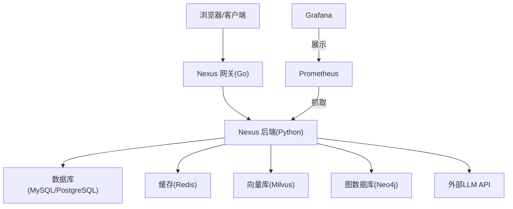
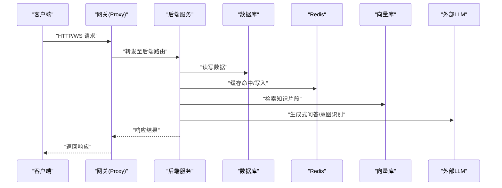
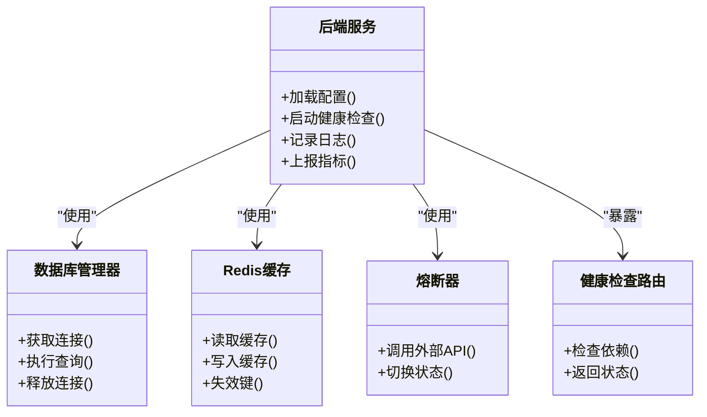
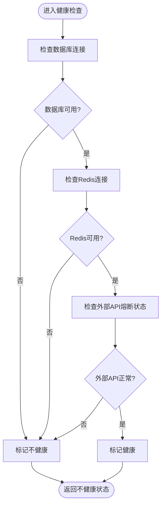

# 常见问题解答

<cite>
**本文引用的文件**   
- [docker-compose.yml](file://docker-compose.yml)
- [backend_design/nexus/main.py](file://backend_design/nexus/main.py)
- [backend_design/nexus/config.py](file://backend_design/nexus/config.py)
- [backend_design/nexus/core/db_manager.py](file://backend_design/nexus/core/db_manager.py)
- [backend_design/nexus/middleware/redis_cache.py](file://backend_design/nexus/middleware/redis_cache.py)
- [backend_design/nexus/api/routes/health.py](file://backend_design/nexus/api/routes/health.py)
- [backend_design/nexus/core/circuit_breaker.py](file://backend_design/nexus/core/circuit_breaker.py)
- [backend_design/nexus/core/logger.py](file://backend_design/nexus/core/logger.py)
- [backend_design/nexus/observability/metrics.py](file://backend_design/nexus/observability/metrics.py)
- [backend_design/nexus_gate/internal/handlers/redis_client.go](file://backend_design/nexus_gate/internal/handlers/redis_client.go)
- [backend_design/nexus_gate/internal/proxy/proxy.go](file://backend_design/nexus_gate/internal/proxy/proxy.go)
- [config/prometheus/prometheus.yml](file://config/prometheus/prometheus.yml)
- [scripts/test_db.py](file://scripts/test_db.py)
- [scripts/init_neo4j.py](file://scripts/init_neo4j.py)
- [scripts/init_milvus.py](file://scripts/init_milvus.py)
</cite>

## 目录
1. [简介](#简介)
2. [项目结构](#项目结构)
3. [核心组件](#核心组件)
4. [架构总览](#架构总览)
5. [详细组件分析](#详细组件分析)
6. [依赖关系分析](#依赖关系分析)
7. [性能注意事项](#性能注意事项)
8. [故障排查指南](#故障排查指南)
9. [结论](#结论)
10. [附录](#附录)

## 简介
本文件面向运维与研发人员，聚焦系统启动与运行时的常见问题，提供可操作的诊断步骤与解决方案。内容覆盖：
- 启动期问题：端口冲突、依赖服务连接失败、配置文件错误等
- 运行时连接问题：数据库连接超时、Redis连接失败、外部API调用异常等
- 性能问题：响应时间过长、内存使用过高、CPU占用异常的识别与优化建议
- 日志与指标：常见错误日志示例与定位方法
- 环境配置：快速诊断工具与自动化检查脚本的使用方法

## 项目结构
本项目采用前后端分离与网关代理的架构：
- 后端服务（Python）：业务逻辑、中间件、RAG/向量检索、技能编排、健康检查、指标采集等
- 网关服务（Go）：鉴权、限流、反向代理、WebSocket转发、Redis客户端封装
- 前端应用（Next.js）：管理界面与交互
- 基础设施：Docker Compose编排、Prometheus监控、Grafana仪表盘、日志收集等

图表来源
- [docker-compose.yml](file://docker-compose.yml)
- [backend_design/nexus/main.py](file://backend_design/nexus/main.py)
- [backend_design/nexus_gate/internal/proxy/proxy.go](file://backend_design/nexus_gate/internal/proxy/proxy.go)

章节来源
- [docker-compose.yml](file://docker-compose.yml)
- [backend_design/nexus/main.py](file://backend_design/nexus/main.py)

## 核心组件
- 配置加载与校验：集中读取环境变量与配置文件，提供默认值与必填项校验
- 数据库连接管理：连接池、重试与熔断保护、健康检查
- Redis缓存：连接池、键空间隔离、降级策略
- 健康检查接口：暴露服务就绪状态与依赖可用性
- 熔断器：对外部API调用的快速失败与恢复
- 日志与指标：结构化日志、关键指标上报

章节来源
- [backend_design/nexus/config.py](file://backend_design/nexus/config.py)
- [backend_design/nexus/core/db_manager.py](file://backend_design/nexus/core/db_manager.py)
- [backend_design/nexus/middleware/redis_cache.py](file://backend_design/nexus/middleware/redis_cache.py)
- [backend_design/nexus/api/routes/health.py](file://backend_design/nexus/api/routes/health.py)
- [backend_design/nexus/core/circuit_breaker.py](file://backend_design/nexus/core/circuit_breaker.py)
- [backend_design/nexus/core/logger.py](file://backend_design/nexus/core/logger.py)
- [backend_design/nexus/observability/metrics.py](file://backend_design/nexus/observability/metrics.py)

## 架构总览
下图展示了请求从网关到后端的典型路径，以及关键依赖服务的交互位置。

图表来源
- [backend_design/nexus_gate/internal/proxy/proxy.go](file://backend_design/nexus_gate/internal/proxy/proxy.go)
- [backend_design/nexus/main.py](file://backend_design/nexus/main.py)
- [backend_design/nexus/core/db_manager.py](file://backend_design/nexus/core/db_manager.py)
- [backend_design/nexus/middleware/redis_cache.py](file://backend_design/nexus/middleware/redis_cache.py)

## 详细组件分析

### 启动期问题：端口冲突
现象
- 服务无法绑定监听端口，进程退出或健康检查失败
- 日志中出现“地址已在使用”或“端口被占用”相关提示

排查步骤
- 确认容器与宿主机端口映射是否重复
- 检查同一主机上是否有其他进程占用相同端口
- 验证环境变量中服务端口配置是否正确

解决建议
- 修改 docker-compose.yml 中的端口映射，避免冲突
- 在本地开发时关闭可能冲突的服务
- 为不同环境分配独立端口段，减少冲突概率

章节来源
- [docker-compose.yml](file://docker-compose.yml)

### 启动期问题：依赖服务连接失败
现象
- 启动阶段连接数据库、Redis、向量库、图数据库失败
- 健康检查接口返回不健康状态

排查步骤
- 检查 docker-compose.yml 中各服务网络连通性与端口暴露
- 验证数据库初始化脚本是否执行成功（Neo4j、Milvus）
- 查看后端日志中连接错误的具体原因（认证失败、网络不可达、版本不兼容）

解决建议
- 确保依赖服务先于后端启动并处于可用状态
- 对初始化脚本进行幂等处理，支持重复执行
- 增加启动前健康检查与重试机制

章节来源
- [docker-compose.yml](file://docker-compose.yml)
- [scripts/init_neo4j.py](file://scripts/init_neo4j.py)
- [scripts/init_milvus.py](file://scripts/init_milvus.py)

### 启动期问题：配置文件错误
现象
- 服务启动即崩溃或抛出配置缺失/类型错误
- 某些功能模块未生效（如限流、缓存、鉴权）

排查步骤
- 核对环境变量与配置文件键名、数据类型、默认值
- 检查必填项是否完整（数据库URL、Redis地址、外部API密钥等）
- 使用最小化配置逐步启用功能，定位问题配置项

解决建议
- 在配置加载层增加严格校验与清晰错误信息
- 为不同环境提供模板配置，减少手工错误
- 引入配置热更新能力，降低重启成本

章节来源
- [backend_design/nexus/config.py](file://backend_design/nexus/config.py)

### 运行时问题：数据库连接超时
现象
- 查询耗时显著增加，出现连接超时或连接池耗尽
- 健康检查显示数据库不可用

排查步骤
- 检查数据库负载与慢查询，必要时优化索引或SQL
- 调整连接池大小与超时参数，避免资源争用
- 观察后端日志中的连接错误堆栈与重试次数

解决建议
- 合理设置连接池上限与空闲回收策略
- 对热点查询引入缓存层（Redis）
- 使用熔断器保护数据库访问，防止雪崩

章节来源
- [backend_design/nexus/core/db_manager.py](file://backend_design/nexus/core/db_manager.py)
- [backend_design/nexus/api/routes/health.py](file://backend_design/nexus/api/routes/health.py)

### 运行时问题：Redis连接失败
现象
- 缓存读写失败，回源数据库压力增大
- 网关或后端日志出现Redis连接错误

排查步骤
- 检查Redis服务状态与网络可达性
- 验证Redis客户端配置（地址、密码、TLS等）
- 观察连接池使用情况与错误率

解决建议
- 为Redis客户端增加重试与短路保护
- 在网关侧封装Redis客户端，统一错误处理与指标上报
- 对关键路径实现降级策略，允许无缓存运行

章节来源
- [backend_design/nexus/middleware/redis_cache.py](file://backend_design/nexus/middleware/redis_cache.py)
- [backend_design/nexus_gate/internal/handlers/redis_client.go](file://backend_design/nexus_gate/internal/handlers/redis_client.go)

### 运行时问题：外部API调用异常
现象
- 调用外部LLM或其他第三方API频繁失败或超时
- 用户请求响应时间抖动明显

排查步骤
- 检查外部API的可用性、配额与限流策略
- 查看熔断器状态与切换日志
- 分析错误码与重试策略是否合理

解决建议
- 启用熔断器，快速失败并自动恢复
- 增加重试退避与最大重试次数限制
- 准备本地或备用模型作为降级方案

章节来源
- [backend_design/nexus/core/circuit_breaker.py](file://backend_design/nexus/core/circuit_breaker.py)

### 运行时问题：网关转发异常
现象
- 前端页面或移动端无法访问后端接口
- WebSocket连接不稳定

排查步骤
- 检查网关日志与上游后端健康状态
- 验证网关路由规则与超时配置
- 观察并发量与限流阈值

解决建议
- 调整网关超时与重试策略
- 对高并发场景启用限流与队列缓冲
- 完善健康检查与自动摘除不可用实例

章节来源
- [backend_design/nexus_gate/internal/proxy/proxy.go](file://backend_design/nexus_gate/internal/proxy/proxy.go)

## 依赖关系分析
下图展示了后端服务与其关键依赖之间的耦合关系，便于定位问题传播路径。

图表来源
- [backend_design/nexus/core/db_manager.py](file://backend_design/nexus/core/db_manager.py)
- [backend_design/nexus/middleware/redis_cache.py](file://backend_design/nexus/middleware/redis_cache.py)
- [backend_design/nexus/core/circuit_breaker.py](file://backend_design/nexus/core/circuit_breaker.py)
- [backend_design/nexus/api/routes/health.py](file://backend_design/nexus/api/routes/health.py)

章节来源
- [backend_design/nexus/core/db_manager.py](file://backend_design/nexus/core/db_manager.py)
- [backend_design/nexus/middleware/redis_cache.py](file://backend_design/nexus/middleware/redis_cache.py)
- [backend_design/nexus/core/circuit_breaker.py](file://backend_design/nexus/core/circuit_breaker.py)
- [backend_design/nexus/api/routes/health.py](file://backend_design/nexus/api/routes/health.py)

## 性能注意事项
- 响应时间过长
  - 识别：通过Prometheus抓取后端指标，结合Grafana仪表盘观察P95/P99延迟
  - 优化：减少数据库往返、引入缓存、异步处理长任务、优化SQL与索引
- 内存使用过高
  - 识别：监控容器内存曲线与GC行为，定位大对象或泄漏点
  - 优化：控制批量大小、及时释放资源、限制缓存容量
- CPU占用异常
  - 识别：观察CPU使用率与线程数，定位热点函数
  - 优化：并行度调优、避免阻塞I/O、使用更高效的数据结构与算法

[本节为通用指导，无需特定文件引用]

## 故障排查指南

### 快速诊断清单
- 端口与网络
  - 检查 docker-compose.yml 端口映射与防火墙规则
  - 使用 curl 或浏览器访问健康检查接口，确认服务存活
- 依赖服务
  - 运行数据库测试脚本，验证连接与权限
  - 检查Redis连通性与键空间
  - 确认向量库与图数据库初始化完成
- 配置与环境
  - 核对环境变量与配置文件键名、类型、默认值
  - 使用最小化配置逐步启用功能，定位问题项
- 日志与指标
  - 查看后端日志，关注错误堆栈与上下文
  - 通过Prometheus/Grafana观察关键指标趋势

章节来源
- [docker-compose.yml](file://docker-compose.yml)
- [backend_design/nexus/api/routes/health.py](file://backend_design/nexus/api/routes/health.py)
- [scripts/test_db.py](file://scripts/test_db.py)
- [backend_design/nexus/core/logger.py](file://backend_design/nexus/core/logger.py)
- [backend_design/nexus/observability/metrics.py](file://backend_design/nexus/observability/metrics.py)
- [config/prometheus/prometheus.yml](file://config/prometheus/prometheus.yml)

### 常见错误日志示例与定位
- 数据库连接超时
  - 日志特征：包含“连接超时”、“连接池耗尽”等关键词
  - 定位：检查数据库负载、慢查询与连接池参数
  - 参考：[数据库连接管理](file://backend_design/nexus/core/db_manager.py)
- Redis连接失败
  - 日志特征：包含“连接拒绝”、“认证失败”等关键词
  - 定位：检查Redis服务状态、网络与凭据
  - 参考：[Redis缓存中间件](file://backend_design/nexus/middleware/redis_cache.py)、[网关Redis客户端](file://backend_design/nexus_gate/internal/handlers/redis_client.go)
- 外部API调用异常
  - 日志特征：包含“熔断打开”、“调用失败”、“超时”等关键词
  - 定位：检查外部API状态、配额与重试策略
  - 参考：[熔断器](file://backend_design/nexus/core/circuit_breaker.py)
- 健康检查不通过
  - 日志特征：健康接口返回非200或依赖项标记为不健康
  - 定位：逐项检查依赖服务状态
  - 参考：[健康检查路由](file://backend_design/nexus/api/routes/health.py)

章节来源
- [backend_design/nexus/core/db_manager.py](file://backend_design/nexus/core/db_manager.py)
- [backend_design/nexus/middleware/redis_cache.py](file://backend_design/nexus/middleware/redis_cache.py)
- [backend_design/nexus_gate/internal/handlers/redis_client.go](file://backend_design/nexus_gate/internal/handlers/redis_client.go)
- [backend_design/nexus/core/circuit_breaker.py](file://backend_design/nexus/core/circuit_breaker.py)
- [backend_design/nexus/api/routes/health.py](file://backend_design/nexus/api/routes/health.py)

### 自动化检查脚本使用方法
- 数据库连通性测试
  - 执行脚本：test_db.py
  - 作用：验证数据库连接、基本读写与权限
  - 参考：[数据库测试脚本](file://scripts/test_db.py)
- 图数据库初始化
  - 执行脚本：init_neo4j.py
  - 作用：创建必要节点与关系，支持幂等
  - 参考：[Neo4j初始化脚本](file://scripts/init_neo4j.py)
- 向量库初始化
  - 执行脚本：init_milvus.py
  - 作用：创建集合与索引，准备检索环境
  - 参考：[Milvus初始化脚本](file://scripts/init_milvus.py)

章节来源
- [scripts/test_db.py](file://scripts/test_db.py)
- [scripts/init_neo4j.py](file://scripts/init_neo4j.py)
- [scripts/init_milvus.py](file://scripts/init_milvus.py)

## 结论
通过系统化地梳理启动期与运行期的常见问题，并结合健康检查、日志与指标体系，可以快速定位并解决端口冲突、依赖连接失败、配置错误、性能瓶颈等问题。建议在部署前完成自动化检查与压测，上线后持续监控与告警，保障系统的稳定性与可观测性。

[本节为总结性内容，无需特定文件引用]

## 附录

### 健康检查流程图

图表来源
- [backend_design/nexus/api/routes/health.py](file://backend_design/nexus/api/routes/health.py)
- [backend_design/nexus/core/db_manager.py](file://backend_design/nexus/core/db_manager.py)
- [backend_design/nexus/middleware/redis_cache.py](file://backend_design/nexus/middleware/redis_cache.py)
- [backend_design/nexus/core/circuit_breaker.py](file://backend_design/nexus/core/circuit_breaker.py)