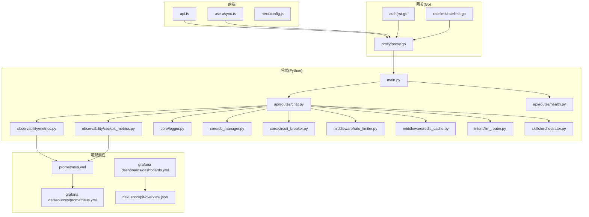
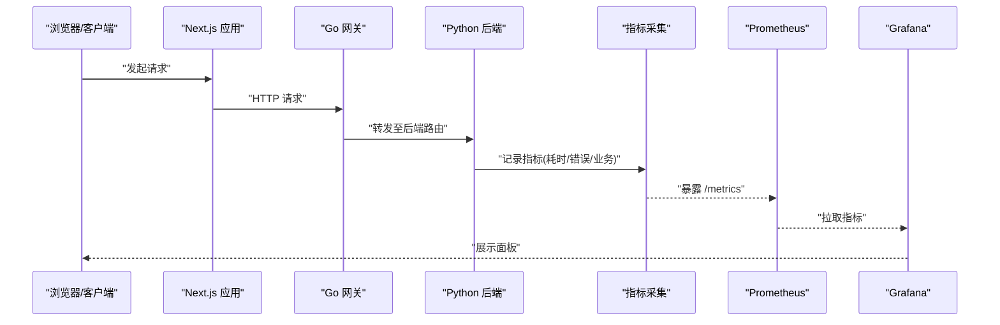
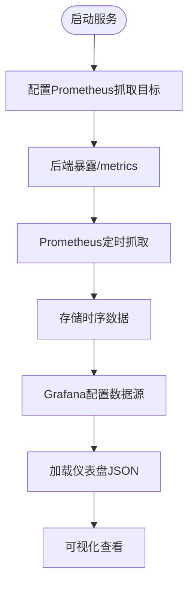
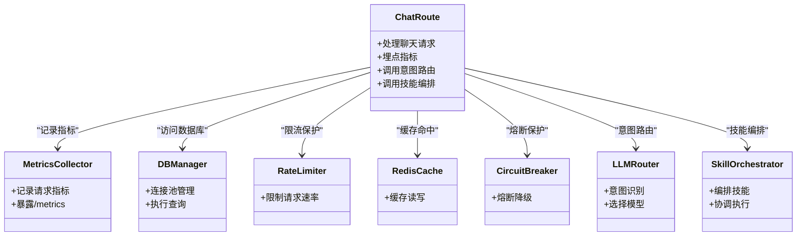

# 性能分析与优化

<cite>
**本文引用的文件**   
- [backend_design/nexus/observability/metrics.py](file://backend_design/nexus/observability/metrics.py)
- [backend_design/nexus/observability/cockpit_metrics.py](file://backend_design/nexus/observability/cockpit_metrics.py)
- [backend_design/nexus/api/routes/chat.py](file://backend_design/nexus/api/routes/chat.py)
- [backend_design/nexus/api/routes/health.py](file://backend_design/nexus/api/routes/health.py)
- [backend_design/nexus/core/logger.py](file://backend_design/nexus/core/logger.py)
- [backend_design/nexus/config.py](file://backend_design/nexus/config.py)
- [config/prometheus/prometheus.yml](file://config/prometheus/prometheus.yml)
- [config/grafana/provisioning/datasources/prometheus.yml](file://config/grafana/provisioning/datasources/prometheus.yml)
- [config/grafana/provisioning/dashboards/dashboards.yml](file://config/grafana/provisioning/dashboards/dashboards.yml)
- [config/grafana/provisioning/dashboards/nexuscockpit-overview.json](file://config/grafana/provisioning/dashboards/nexuscockpit-overview.json)
- [backend_design/nexus/middleware/rate_limiter.py](file://backend_design/nexus/middleware/rate_limiter.py)
- [backend_design/nexus/middleware/redis_cache.py](file://backend_design/nexus/middleware/redis_cache.py)
- [backend_design/nexus/core/circuit_breaker.py](file://backend_design/nexus/core/circuit_breaker.py)
- [backend_design/nexus/core/db_manager.py](file://backend_design/nexus/core/db_manager.py)
- [backend_design/nexus/intent/llm_router.py](file://backend_design/nexus/intent/llm_router.py)
- [backend_design/nexus/skills/orchestrator.py](file://backend_design/nexus/skills/orchestrator.py)
- [frontend_design/src/lib/api.ts](file://frontend_design/src/lib/api.ts)
- [frontend_design/src/hooks/use-async.ts](file://frontend_design/src/hooks/use-async.ts)
- [frontend_design/next.config.js](file://frontend_design/next.config.js)
- [docker-compose.yml](file://docker-compose.yml)
</cite>

## 目录
1. [简介](#简介)
2. [项目结构](#项目结构)
3. [核心组件](#核心组件)
4. [架构总览](#架构总览)
5. [详细组件分析](#详细组件分析)
6. [依赖关系分析](#依赖关系分析)
7. [性能考虑](#性能考虑)
8. [故障排查指南](#故障排查指南)
9. [结论](#结论)
10. [附录](#附录)

## 简介
本指南面向NexusCockpit项目的性能分析与优化，覆盖后端与前端的关键指标监控、Prometheus与Grafana的集成、内存泄漏检测与修复、数据库查询与缓存策略调优、异步处理优化以及前端性能最佳实践。文档以仓库现有实现为基础，提供可操作的阈值建议、面板搭建步骤和排障方法，帮助团队建立稳定、可观测且高性能的系统。

## 项目结构
本项目在后端Python服务中内置了可观测性模块（指标采集、日志、熔断等），并通过Prometheus抓取指标、Grafana进行可视化；网关使用Go实现，具备鉴权、限流、代理能力；前端基于Next.js，提供API调用封装与异步Hook。

图表来源
- [backend_design/nexus/observability/metrics.py](file://backend_design/nexus/observability/metrics.py)
- [backend_design/nexus/observability/cockpit_metrics.py](file://backend_design/nexus/observability/cockpit_metrics.py)
- [backend_design/nexus/api/routes/chat.py](file://backend_design/nexus/api/routes/chat.py)
- [backend_design/nexus/api/routes/health.py](file://backend_design/nexus/api/routes/health.py)
- [backend_design/nexus/core/logger.py](file://backend_design/nexus/core/logger.py)
- [backend_design/nexus/core/db_manager.py](file://backend_design/nexus/core/db_manager.py)
- [backend_design/nexus/core/circuit_breaker.py](file://backend_design/nexus/core/circuit_breaker.py)
- [backend_design/nexus/middleware/rate_limiter.py](file://backend_design/nexus/middleware/rate_limiter.py)
- [backend_design/nexus/middleware/redis_cache.py](file://backend_design/nexus/middleware/redis_cache.py)
- [backend_design/nexus/intent/llm_router.py](file://backend_design/nexus/intent/llm_router.py)
- [backend_design/nexus/skills/orchestrator.py](file://backend_design/nexus/skills/orchestrator.py)
- [config/prometheus/prometheus.yml](file://config/prometheus/prometheus.yml)
- [config/grafana/provisioning/datasources/prometheus.yml](file://config/grafana/provisioning/datasources/prometheus.yml)
- [config/grafana/provisioning/dashboards/dashboards.yml](file://config/grafana/provisioning/dashboards/dashboards.yml)
- [config/grafana/provisioning/dashboards/nexuscockpit-overview.json](file://config/grafana/provisioning/dashboards/nexuscockpit-overview.json)

章节来源
- [docker-compose.yml](file://docker-compose.yml)
- [config/prometheus/prometheus.yml](file://config/prometheus/prometheus.yml)
- [config/grafana/provisioning/datasources/prometheus.yml](file://config/grafana/provisioning/datasources/prometheus.yml)
- [config/grafana/provisioning/dashboards/dashboards.yml](file://config/grafana/provisioning/dashboards/dashboards.yml)
- [config/grafana/provisioning/dashboards/nexuscockpit-overview.json](file://config/grafana/provisioning/dashboards/nexuscockpit-overview.json)

## 核心组件
- 指标采集与暴露：后端通过可观测性模块定义并上报自定义指标，供Prometheus抓取。
- API路由层：聊天与健康检查等路由在关键路径埋点，记录耗时、错误与业务指标。
- 中间件：速率限制与Redis缓存用于保护后端与提升吞吐。
- 外部依赖：数据库连接管理、熔断器、意图路由与技能编排影响整体延迟与稳定性。
- 可观测性配置：Prometheus抓取目标、Grafana数据源与仪表盘预置。

章节来源
- [backend_design/nexus/observability/metrics.py](file://backend_design/nexus/observability/metrics.py)
- [backend_design/nexus/observability/cockpit_metrics.py](file://backend_design/nexus/observability/cockpit_metrics.py)
- [backend_design/nexus/api/routes/chat.py](file://backend_design/nexus/api/routes/chat.py)
- [backend_design/nexus/api/routes/health.py](file://backend_design/nexus/api/routes/health.py)
- [backend_design/nexus/middleware/rate_limiter.py](file://backend_design/nexus/middleware/rate_limiter.py)
- [backend_design/nexus/middleware/redis_cache.py](file://backend_design/nexus/middleware/redis_cache.py)
- [backend_design/nexus/core/db_manager.py](file://backend_design/nexus/core/db_manager.py)
- [backend_design/nexus/core/circuit_breaker.py](file://backend_design/nexus/core/circuit_breaker.py)
- [backend_design/nexus/intent/llm_router.py](file://backend_design/nexus/intent/llm_router.py)
- [backend_design/nexus/skills/orchestrator.py](file://backend_design/nexus/skills/orchestrator.py)

## 架构总览
下图展示了从前端请求到后端处理、指标采集与可视化的端到端流程。

图表来源
- [backend_design/nexus/api/routes/chat.py](file://backend_design/nexus/api/routes/chat.py)
- [backend_design/nexus/observability/metrics.py](file://backend_design/nexus/observability/metrics.py)
- [config/prometheus/prometheus.yml](file://config/prometheus/prometheus.yml)
- [config/grafana/provisioning/datasources/prometheus.yml](file://config/grafana/provisioning/datasources/prometheus.yml)
- [config/grafana/provisioning/dashboards/dashboards.yml](file://config/grafana/provisioning/dashboards/dashboards.yml)
- [config/grafana/provisioning/dashboards/nexuscockpit-overview.json](file://config/grafana/provisioning/dashboards/nexuscockpit-overview.json)

## 详细组件分析

### 指标体系与自定义指标
- 指标分类
  - 通用指标：请求总数、成功/失败计数、延迟分位数、并发数、错误率。
  - 业务指标：聊天会话创建/完成、意图识别结果分布、技能执行次数、RAG检索命中数等。
- 采集方式
  - 在路由入口/出口打点，记录开始时间、结束时间与状态码。
  - 对关键子任务（如LLM路由、技能编排、数据库访问）分别埋点，便于定位瓶颈。
- 标签设计
  - 按接口路径、方法、状态码、租户、用户ID、技能名称、意图类型等维度打标，支持多维分析。
- 阈值建议
  - P95响应时间：根据SLA设定，例如聊天接口<2s，健康检查<200ms。
  - 错误率：总体<1%，关键接口<0.1%。
  - 吞吐量：结合容量规划，确保CPU/内存利用率在安全区间内。
  - 资源利用率：CPU<75%，内存<80%，磁盘IO等待<10%。

章节来源
- [backend_design/nexus/observability/metrics.py](file://backend_design/nexus/observability/metrics.py)
- [backend_design/nexus/observability/cockpit_metrics.py](file://backend_design/nexus/observability/cockpit_metrics.py)
- [backend_design/nexus/api/routes/chat.py](file://backend_design/nexus/api/routes/chat.py)

### Prometheus与Grafana集成
- Prometheus抓取配置
  - 指定后端服务的/metrics端点作为抓取目标。
  - 合理设置抓取间隔与超时，避免对服务造成压力。
- Grafana数据源
  - 配置Prometheus为默认数据源，启用自动发现或静态目标。
- 仪表盘
  - 使用预置的nexuscockpit-overview.json快速搭建概览面板，包含关键指标与时序图。
  - 按需扩展面板，增加错误明细、慢请求TopN、资源利用率等视图。

图表来源
- [config/prometheus/prometheus.yml](file://config/prometheus/prometheus.yml)
- [config/grafana/provisioning/datasources/prometheus.yml](file://config/grafana/provisioning/datasources/prometheus.yml)
- [config/grafana/provisioning/dashboards/dashboards.yml](file://config/grafana/provisioning/dashboards/dashboards.yml)
- [config/grafana/provisioning/dashboards/nexuscockpit-overview.json](file://config/grafana/provisioning/dashboards/nexuscockpit-overview.json)

章节来源
- [config/prometheus/prometheus.yml](file://config/prometheus/prometheus.yml)
- [config/grafana/provisioning/datasources/prometheus.yml](file://config/grafana/provisioning/datasources/prometheus.yml)
- [config/grafana/provisioning/dashboards/dashboards.yml](file://config/grafana/provisioning/dashboards/dashboards.yml)
- [config/grafana/provisioning/dashboards/nexuscockpit-overview.json](file://config/grafana/provisioning/dashboards/nexuscockpit-overview.json)

### 告警规则与阈值
- 告警类别
  - 可用性：服务不可用、健康检查失败。
  - 性能：P95/P99延迟超标、错误率突增、QPS异常波动。
  - 资源：CPU/内存/磁盘/网络超限。
  - 业务：意图识别失败、技能执行失败、RAG检索无结果。
- 阈值设置原则
  - 基于历史基线与压测结果，设置分级阈值（警告/严重）。
  - 考虑业务峰值与季节性变化，动态调整窗口与持续时间。
- 通知渠道
  - 对接邮件、IM、短信等，确保及时响应。

章节来源
- [backend_design/nexus/api/routes/health.py](file://backend_design/nexus/api/routes/health.py)
- [backend_design/nexus/observability/metrics.py](file://backend_design/nexus/observability/metrics.py)

### 内存泄漏检测与修复
- 检测方法
  - 定期生成内存快照，对比对象数量与大小趋势，定位持续增长的对象。
  - 监控垃圾回收频率与停顿时间，评估GC压力。
  - 跟踪长生命周期对象（如全局缓存、连接池、事件监听器）的创建与释放。
- 常见原因
  - 未关闭的资源（文件句柄、网络连接）、闭包引用导致对象无法回收、循环引用。
- 修复策略
  - 显式释放资源、缩短对象生命周期、避免不必要的缓存、使用弱引用。
  - 在关键路径添加断言与日志，辅助回归验证。

章节来源
- [backend_design/nexus/core/logger.py](file://backend_design/nexus/core/logger.py)
- [backend_design/nexus/middleware/redis_cache.py](file://backend_design/nexus/middleware/redis_cache.py)

### 数据库查询优化
- 连接池与事务
  - 合理设置连接池大小与超时，避免连接耗尽。
  - 控制事务范围，减少锁竞争与长事务。
- 索引与SQL
  - 针对高频查询建立合适索引，避免全表扫描。
  - 使用EXPLAIN分析执行计划，优化JOIN与过滤条件。
- 读写分离与缓存
  - 热点数据放入Redis缓存，降低DB压力。
  - 读多写少场景采用只读副本。

章节来源
- [backend_design/nexus/core/db_manager.py](file://backend_design/nexus/core/db_manager.py)
- [backend_design/nexus/middleware/redis_cache.py](file://backend_design/nexus/middleware/redis_cache.py)

### 缓存策略调优
- 缓存层级
  - 本地缓存（进程内）+ Redis分布式缓存，兼顾速度与一致性。
- 失效与更新
  - 设置合理的TTL与过期策略，采用主动失效与被动清理结合。
- 命中率与回源
  - 监控命中率与回源比例，避免缓存穿透与雪崩。

章节来源
- [backend_design/nexus/middleware/redis_cache.py](file://backend_design/nexus/middleware/redis_cache.py)

### 异步处理优化
- 任务队列
  - 将耗时任务（如ASR/TTS、RAG检索）异步化，提高吞吐与响应速度。
- 背压与限流
  - 结合速率限制与熔断器，防止下游过载。
- 重试与退避
  - 对幂等操作实施指数退避重试，避免风暴。

章节来源
- [backend_design/nexus/middleware/rate_limiter.py](file://backend_design/nexus/middleware/rate_limiter.py)
- [backend_design/nexus/core/circuit_breaker.py](file://backend_design/nexus/core/circuit_breaker.py)
- [backend_design/nexus/intent/llm_router.py](file://backend_design/nexus/intent/llm_router.py)
- [backend_design/nexus/skills/orchestrator.py](file://backend_design/nexus/skills/orchestrator.py)

### 前端性能优化
- 代码分割与懒加载
  - 利用Next.js的动态导入与路由级分割，减少首屏体积。
- 资源压缩与缓存
  - 启用静态资源压缩与浏览器缓存，CDN加速。
- 请求优化
  - 合并请求、分页与增量更新，减少带宽占用。
- 用户体验
  - 骨架屏与乐观更新，提升感知性能。

章节来源
- [frontend_design/src/lib/api.ts](file://frontend_design/src/lib/api.ts)
- [frontend_design/src/hooks/use-async.ts](file://frontend_design/src/hooks/use-async.ts)
- [frontend_design/next.config.js](file://frontend_design/next.config.js)

## 依赖关系分析
后端各模块之间的耦合与协作直接影响性能与稳定性。下图展示关键依赖关系。

图表来源
- [backend_design/nexus/api/routes/chat.py](file://backend_design/nexus/api/routes/chat.py)
- [backend_design/nexus/observability/metrics.py](file://backend_design/nexus/observability/metrics.py)
- [backend_design/nexus/core/db_manager.py](file://backend_design/nexus/core/db_manager.py)
- [backend_design/nexus/middleware/rate_limiter.py](file://backend_design/nexus/middleware/rate_limiter.py)
- [backend_design/nexus/middleware/redis_cache.py](file://backend_design/nexus/middleware/redis_cache.py)
- [backend_design/nexus/core/circuit_breaker.py](file://backend_design/nexus/core/circuit_breaker.py)
- [backend_design/nexus/intent/llm_router.py](file://backend_design/nexus/intent/llm_router.py)
- [backend_design/nexus/skills/orchestrator.py](file://backend_design/nexus/skills/orchestrator.py)

章节来源
- [backend_design/nexus/api/routes/chat.py](file://backend_design/nexus/api/routes/chat.py)
- [backend_design/nexus/observability/metrics.py](file://backend_design/nexus/observability/metrics.py)
- [backend_design/nexus/core/db_manager.py](file://backend_design/nexus/core/db_manager.py)
- [backend_design/nexus/middleware/rate_limiter.py](file://backend_design/nexus/middleware/rate_limiter.py)
- [backend_design/nexus/middleware/redis_cache.py](file://backend_design/nexus/middleware/redis_cache.py)
- [backend_design/nexus/core/circuit_breaker.py](file://backend_design/nexus/core/circuit_breaker.py)
- [backend_design/nexus/intent/llm_router.py](file://backend_design/nexus/intent/llm_router.py)
- [backend_design/nexus/skills/orchestrator.py](file://backend_design/nexus/skills/orchestrator.py)

## 性能考虑
- 指标监控
  - 持续监控API响应时间、吞吐量、错误率与资源利用率，结合业务SLA设定阈值。
- 容量规划
  - 基于压测结果确定实例数量与资源配置，预留弹性扩容空间。
- 稳定性保障
  - 使用熔断与降级策略，避免级联故障。
- 成本优化
  - 通过缓存与异步化降低计算与IO开销，提高单位资源产出。

[本节为通用指导，不直接分析具体文件]

## 故障排查指南
- 常见问题
  - 高延迟：检查数据库慢查询、缓存命中率、外部依赖超时。
  - 高错误率：关注熔断器状态、下游服务健康、限流触发情况。
  - 内存增长：分析内存快照、GC日志、长生命周期对象。
- 定位步骤
  - 从Grafana面板定位异常时段与接口。
  - 查看后端日志与指标详情，确认错误堆栈与上下文。
  - 复现问题并逐步缩小范围，必要时开启调试模式。
- 恢复措施
  - 临时扩容或降级非关键功能。
  - 清理缓存、重启实例或切换备用依赖。

章节来源
- [backend_design/nexus/api/routes/health.py](file://backend_design/nexus/api/routes/health.py)
- [backend_design/nexus/core/logger.py](file://backend_design/nexus/core/logger.py)
- [backend_design/nexus/core/circuit_breaker.py](file://backend_design/nexus/core/circuit_breaker.py)

## 结论
通过完善的指标体系、Prometheus与Grafana的可观测性集成、合理的缓存与异步策略、严格的限流与熔断机制，以及前端代码分割与资源优化，NexusCockpit能够在高负载下保持稳定与高效。建议持续压测与演练，完善告警与应急预案，形成闭环的性能治理体系。

[本节为总结，不直接分析具体文件]

## 附录
- 常用命令
  - 查看指标：curl http://localhost:端口/metrics
  - 重启服务：参考docker-compose.yml中的服务定义
- 参考配置
  - Prometheus抓取目标与Grafana数据源见配置文件
  - 仪表盘JSON可直接导入Grafana

章节来源
- [docker-compose.yml](file://docker-compose.yml)
- [config/prometheus/prometheus.yml](file://config/prometheus/prometheus.yml)
- [config/grafana/provisioning/datasources/prometheus.yml](file://config/grafana/provisioning/datasources/prometheus.yml)
- [config/grafana/provisioning/dashboards/nexuscockpit-overview.json](file://config/grafana/provisioning/dashboards/nexuscockpit-overview.json)