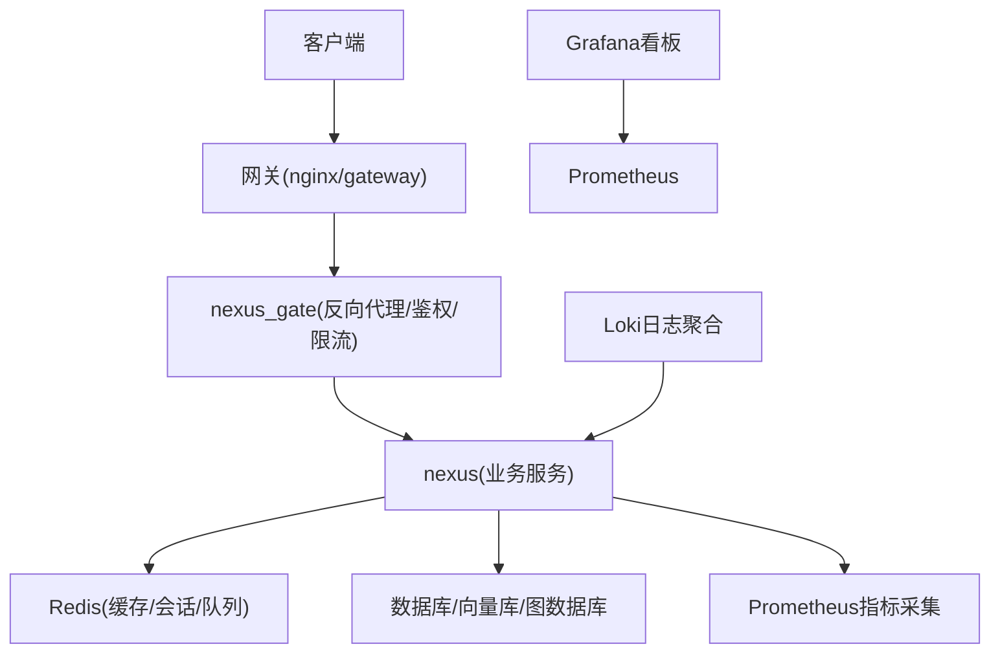
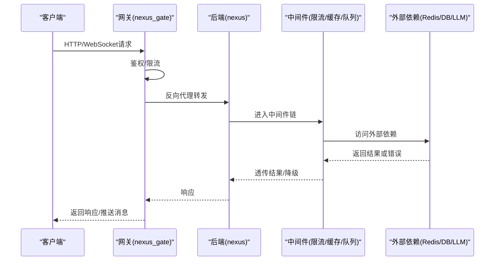
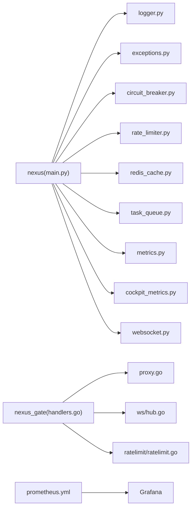

# 故障排查

<cite>
**本文引用的文件**   
- [backend_design/nexus/main.py](file://backend_design/nexus/main.py)
- [backend_design/nexus/core/logger.py](file://backend_design/nexus/core/logger.py)
- [backend_design/nexus/core/exceptions.py](file://backend_design/nexus/core/exceptions.py)
- [backend_design/nexus/core/circuit_breaker.py](file://backend_design/nexus/core/circuit_breaker.py)
- [backend_design/nexus/api/websocket.py](file://backend_design/nexus/api/websocket.py)
- [backend_design/nexus/middleware/rate_limiter.py](file://backend_design/nexus/middleware/rate_limiter.py)
- [backend_design/nexus/middleware/redis_cache.py](file://backend_design/nexus/middleware/redis_cache.py)
- [backend_design/nexus/middleware/task_queue.py](file://backend_design/nexus/middleware/task_queue.py)
- [backend_design/nexus/observability/metrics.py](file://backend_design/nexus/observability/metrics.py)
- [backend_design/nexus/observability/cockpit_metrics.py](file://backend_design/nexus/observability/cockpit_metrics.py)
- [backend_design/nexus/config.py](file://backend_design/nexus/config.py)
- [backend_design/nexus_gate/internal/handlers/handlers.go](file://backend_design/nexus_gate/internal/handlers/handlers.go)
- [backend_design/nexus_gate/internal/proxy/proxy.go](file://backend_design/nexus_gate/internal/proxy/proxy.go)
- [backend_design/nexus_gate/internal/ws/hub.go](file://backend_design/nexus_gate/internal/ws/hub.go)
- [backend_design/nexus_gate/internal/ratelimit/ratelimit.go](file://backend_design/nexus_gate/internal/ratelimit/ratelimit.go)
- [config/prometheus/prometheus.yml](file://config/prometheus/prometheus.yml)
- [config/grafana/provisioning/datasources/prometheus.yml](file://config/grafana/provisioning/datasources/prometheus.yml)
- [docker-compose.yml](file://docker-compose.yml)
</cite>

## 目录
1. [简介](#简介)
2. [项目结构](#项目结构)
3. [核心组件](#核心组件)
4. [架构总览](#架构总览)
5. [详细组件分析](#详细组件分析)
6. [依赖关系分析](#依赖关系分析)
7. [性能考虑](#性能考虑)
8. [故障排查指南](#故障排查指南)
9. [结论](#结论)
10. [附录](#附录)

## 简介
本文件面向运维与研发人员，提供NexusCockpit系统的故障排查技术文档。内容覆盖启动问题、连接问题、性能问题的定位与解决；日志分析方法与技巧；性能监控指标与瓶颈识别；内存泄漏检测与修复策略；调试工具推荐与技巧；监控指标解读与告警处理流程；分布式系统故障隔离与恢复策略。

## 项目结构
本项目采用前后端分离与网关代理的混合架构：
- 后端服务（Python）：提供API、WebSocket、中间件、可观测性能力等
- 网关服务（Go）：负责鉴权、限流、反向代理、WebSocket转发
- 配置与监控：Prometheus、Grafana、Loki等
- 容器编排：docker-compose统一拉起各组件

图表来源
- [backend_design/nexus/main.py:1-200](file://backend_design/nexus/main.py#L1-L200)
- [backend_design/nexus_gate/internal/handlers/handlers.go:1-200](file://backend_design/nexus_gate/internal/handlers/handlers.go#L1-L200)
- [backend_design/nexus_gate/internal/proxy/proxy.go:1-200](file://backend_design/nexus_gate/internal/proxy/proxy.go#L1-L200)
- [config/prometheus/prometheus.yml:1-200](file://config/prometheus/prometheus.yml#L1-L200)
- [config/grafana/provisioning/datasources/prometheus.yml:1-200](file://config/grafana/provisioning/datasources/prometheus.yml#L1-L200)
- [docker-compose.yml:1-200](file://docker-compose.yml#L1-L200)

章节来源
- [backend_design/nexus/main.py:1-200](file://backend_design/nexus/main.py#L1-L200)
- [docker-compose.yml:1-200](file://docker-compose.yml#L1-L200)

## 核心组件
- 应用入口与生命周期管理：负责初始化配置、注册路由、启动中间件、优雅关闭
- 日志与异常：结构化日志、错误分类与统一返回
- 熔断与降级：对外部依赖进行熔断保护与快速失败
- 中间件：速率限制、缓存、任务队列、会话存储
- 可观测性：指标采集、链路追踪、数据保留策略
- WebSocket：实时通信通道与连接管理
- 网关：鉴权、限流、反向代理、WebSocket转发

章节来源
- [backend_design/nexus/main.py:1-200](file://backend_design/nexus/main.py#L1-L200)
- [backend_design/nexus/core/logger.py:1-200](file://backend_design/nexus/core/logger.py#L1-L200)
- [backend_design/nexus/core/exceptions.py:1-200](file://backend_design/nexus/core/exceptions.py#L1-L200)
- [backend_design/nexus/core/circuit_breaker.py:1-200](file://backend_design/nexus/core/circuit_breaker.py#L1-L200)
- [backend_design/nexus/middleware/rate_limiter.py:1-200](file://backend_design/nexus/middleware/rate_limiter.py#L1-L200)
- [backend_design/nexus/middleware/redis_cache.py:1-200](file://backend_design/nexus/middleware/redis_cache.py#L1-L200)
- [backend_design/nexus/middleware/task_queue.py:1-200](file://backend_design/nexus/middleware/task_queue.py#L1-L200)
- [backend_design/nexus/observability/metrics.py:1-200](file://backend_design/nexus/observability/metrics.py#L1-L200)
- [backend_design/nexus/observability/cockpit_metrics.py:1-200](file://backend_design/nexus/observability/cockpit_metrics.py#L1-L200)
- [backend_design/nexus/api/websocket.py:1-200](file://backend_design/nexus/api/websocket.py#L1-L200)
- [backend_design/nexus_gate/internal/handlers/handlers.go:1-200](file://backend_design/nexus_gate/internal/handlers/handlers.go#L1-L200)
- [backend_design/nexus_gate/internal/proxy/proxy.go:1-200](file://backend_design/nexus_gate/internal/proxy/proxy.go#L1-L200)
- [backend_design/nexus_gate/internal/ws/hub.go:1-200](file://backend_design/nexus_gate/internal/ws/hub.go#L1-L200)
- [backend_design/nexus_gate/internal/ratelimit/ratelimit.go:1-200](file://backend_design/nexus_gate/internal/ratelimit/ratelimit.go#L1-L200)

## 架构总览
下图展示请求从客户端到后端服务的完整路径，以及关键的可观测性与中间件介入点。

图表来源
- [backend_design/nexus_gate/internal/handlers/handlers.go:1-200](file://backend_design/nexus_gate/internal/handlers/handlers.go#L1-L200)
- [backend_design/nexus_gate/internal/proxy/proxy.go:1-200](file://backend_design/nexus_gate/internal/proxy/proxy.go#L1-L200)
- [backend_design/nexus/api/websocket.py:1-200](file://backend_design/nexus/api/websocket.py#L1-L200)
- [backend_design/nexus/middleware/rate_limiter.py:1-200](file://backend_design/nexus/middleware/rate_limiter.py#L1-L200)
- [backend_design/nexus/middleware/redis_cache.py:1-200](file://backend_design/nexus/middleware/redis_cache.py#L1-L200)
- [backend_design/nexus/middleware/task_queue.py:1-200](file://backend_design/nexus/middleware/task_queue.py#L1-L200)

## 详细组件分析

### 启动问题排查
常见问题
- 端口占用或服务未监听
- 配置文件缺失或格式错误
- 依赖服务不可用（Redis、数据库、LLM等）
- 证书与SSL配置错误
- 资源不足导致进程崩溃

定位步骤
- 检查服务进程状态与端口监听情况
- 查看应用启动日志，关注初始化阶段错误
- 验证配置文件加载与默认值覆盖
- 测试依赖连通性（网络、认证、权限）
- 观察系统资源使用（CPU、内存、磁盘、句柄）

建议措施
- 在启动前执行依赖健康检查并设置重试与退避
- 为关键配置项提供默认值与校验提示
- 对证书路径与域名进行预检
- 增加启动超时与优雅退出机制

章节来源
- [backend_design/nexus/main.py:1-200](file://backend_design/nexus/main.py#L1-L200)
- [backend_design/nexus/config.py:1-200](file://backend_design/nexus/config.py#L1-L200)
- [backend_design/nexus/core/logger.py:1-200](file://backend_design/nexus/core/logger.py#L1-L200)

### 连接问题排查
常见问题
- 网关到后端连接失败或超时
- WebSocket握手失败或频繁断开
- 鉴权失败或令牌过期
- 限流触发导致请求被拒绝
- 跨域或TLS握手错误

定位步骤
- 在网关层检查鉴权与限流日志
- 确认反向代理目标地址与端口可达
- 检查WebSocket升级头与心跳配置
- 核对客户端与服务端的协议版本与加密套件
- 查看后端中间件的连接池与并发参数

建议措施
- 为网关与后端之间启用健康检查与自动重连
- 合理设置WebSocket心跳与最大空闲时间
- 将鉴权失败与限流拒绝的日志包含必要上下文
- 对TLS证书进行定期巡检与自动续期

章节来源
- [backend_design/nexus_gate/internal/handlers/handlers.go:1-200](file://backend_design/nexus_gate/internal/handlers/handlers.go#L1-L200)
- [backend_design/nexus_gate/internal/proxy/proxy.go:1-200](file://backend_design/nexus_gate/internal/proxy/proxy.go#L1-L200)
- [backend_design/nexus_gate/internal/ws/hub.go:1-200](file://backend_design/nexus_gate/internal/ws/hub.go#L1-L200)
- [backend_design/nexus_gate/internal/ratelimit/ratelimit.go:1-200](file://backend_design/nexus_gate/internal/ratelimit/ratelimit.go#L1-L200)
- [backend_design/nexus/api/websocket.py:1-200](file://backend_design/nexus/api/websocket.py#L1-L200)

### 性能问题排查
常见问题
- 接口P99延迟升高
- 吞吐下降与错误率上升
- 外部依赖慢查询或连接池耗尽
- 缓存命中率低导致重复计算
- 任务队列堆积与消费者饥饿

定位步骤
- 通过Prometheus查看QPS、延迟分位、错误率、GC停顿、线程/协程数
- 结合Grafana看板对比历史基线，识别突增与拐点
- 在热点路径埋点，定位慢调用与锁竞争
- 检查Redis命中率、队列积压、消费者并行度
- 评估外部依赖的SLA与容量水位

建议措施
- 引入熔断与降级，避免雪崩
- 优化缓存策略与失效粒度
- 调整连接池大小与超时参数
- 对长耗时任务异步化与批量化
- 针对热点接口做读写分离与本地缓存

章节来源
- [backend_design/nexus/observability/metrics.py:1-200](file://backend_design/nexus/observability/metrics.py#L1-L200)
- [backend_design/nexus/observability/cockpit_metrics.py:1-200](file://backend_design/nexus/observability/cockpit_metrics.py#L1-L200)
- [backend_design/nexus/middleware/redis_cache.py:1-200](file://backend_design/nexus/middleware/redis_cache.py#L1-L200)
- [backend_design/nexus/middleware/task_queue.py:1-200](file://backend_design/nexus/middleware/task_queue.py#L1-L200)
- [config/prometheus/prometheus.yml:1-200](file://config/prometheus/prometheus.yml#L1-L200)
- [config/grafana/provisioning/datasources/prometheus.yml:1-200](file://config/grafana/provisioning/datasources/prometheus.yml#L1-L200)

### 日志分析方法与问题定位技巧
方法
- 统一日志格式与级别，包含请求ID、租户、用户、耗时、上游下游信息
- 关键路径打点：进入/离开、外部调用、异常分支
- 结构化字段便于检索与聚合（如status_code、error_type、latency_ms）
- 按模块与组件划分日志输出，避免单文件过大
- 结合Loki进行索引与查询，配合Grafana可视化

技巧
- 使用trace_id串联一次请求的全链路日志
- 对高频错误进行采样与去抖，避免日志风暴
- 在异常堆栈中记录上下文快照（参数、状态、资源水位）
- 对敏感信息进行脱敏处理

章节来源
- [backend_design/nexus/core/logger.py:1-200](file://backend_design/nexus/core/logger.py#L1-L200)
- [backend_design/nexus/core/exceptions.py:1-200](file://backend_design/nexus/core/exceptions.py#L1-L200)

### 熔断与降级策略
策略
- 基于错误率与延迟阈值触发熔断
- 半开状态探测外部依赖可用性
- 降级返回缓存或默认值，保障核心功能可用
- 熔断恢复后逐步放量，避免二次冲击

实施要点
- 为每个外部依赖独立配置熔断器
- 熔断状态变化需记录指标与告警
- 降级逻辑需幂等且可回滚

章节来源
- [backend_design/nexus/core/circuit_breaker.py:1-200](file://backend_design/nexus/core/circuit_breaker.py#L1-L200)

### 限流与会话/缓存/队列
- 限流：网关与应用双端限流，防止突发流量压垮后端
- 会话：集中式会话存储，保证多实例一致性
- 缓存：多级缓存与失效策略，提升读性能
- 队列：削峰填谷与异步处理，降低峰值压力

章节来源
- [backend_design/nexus/middleware/rate_limiter.py:1-200](file://backend_design/nexus/middleware/rate_limiter.py#L1-L200)
- [backend_design/nexus/middleware/redis_cache.py:1-200](file://backend_design/nexus/middleware/redis_cache.py#L1-L200)
- [backend_design/nexus/middleware/task_queue.py:1-200](file://backend_design/nexus/middleware/task_queue.py#L1-L200)

### WebSocket实时通信
- 连接建立与鉴权：在握手阶段完成身份校验
- 心跳与保活：服务端定时发送心跳，客户端及时响应
- 断线重连：指数退避与最大重试次数
- 广播与订阅：按频道或用户维度分发消息

章节来源
- [backend_design/nexus/api/websocket.py:1-200](file://backend_design/nexus/api/websocket.py#L1-L200)
- [backend_design/nexus_gate/internal/ws/hub.go:1-200](file://backend_design/nexus_gate/internal/ws/hub.go#L1-L200)

## 依赖关系分析

图表来源
- [backend_design/nexus/main.py:1-200](file://backend_design/nexus/main.py#L1-L200)
- [backend_design/nexus/core/logger.py:1-200](file://backend_design/nexus/core/logger.py#L1-L200)
- [backend_design/nexus/core/exceptions.py:1-200](file://backend_design/nexus/core/exceptions.py#L1-L200)
- [backend_design/nexus/core/circuit_breaker.py:1-200](file://backend_design/nexus/core/circuit_breaker.py#L1-L200)
- [backend_design/nexus/middleware/rate_limiter.py:1-200](file://backend_design/nexus/middleware/rate_limiter.py#L1-L200)
- [backend_design/nexus/middleware/redis_cache.py:1-200](file://backend_design/nexus/middleware/redis_cache.py#L1-L200)
- [backend_design/nexus/middleware/task_queue.py:1-200](file://backend_design/nexus/middleware/task_queue.py#L1-L200)
- [backend_design/nexus/observability/metrics.py:1-200](file://backend_design/nexus/observability/metrics.py#L1-L200)
- [backend_design/nexus/observability/cockpit_metrics.py:1-200](file://backend_design/nexus/observability/cockpit_metrics.py#L1-L200)
- [backend_design/nexus/api/websocket.py:1-200](file://backend_design/nexus/api/websocket.py#L1-L200)
- [backend_design/nexus_gate/internal/handlers/handlers.go:1-200](file://backend_design/nexus_gate/internal/handlers/handlers.go#L1-L200)
- [backend_design/nexus_gate/internal/proxy/proxy.go:1-200](file://backend_design/nexus_gate/internal/proxy/proxy.go#L1-L200)
- [backend_design/nexus_gate/internal/ws/hub.go:1-200](file://backend_design/nexus_gate/internal/ws/hub.go#L1-L200)
- [backend_design/nexus_gate/internal/ratelimit/ratelimit.go:1-200](file://backend_design/nexus_gate/internal/ratelimit/ratelimit.go#L1-L200)
- [config/prometheus/prometheus.yml:1-200](file://config/prometheus/prometheus.yml#L1-L200)

章节来源
- [backend_design/nexus/main.py:1-200](file://backend_design/nexus/main.py#L1-L200)
- [backend_design/nexus_gate/internal/handlers/handlers.go:1-200](file://backend_design/nexus_gate/internal/handlers/handlers.go#L1-L200)
- [config/prometheus/prometheus.yml:1-200](file://config/prometheus/prometheus.yml#L1-L200)

## 性能考虑
- 指标体系：QPS、P50/P90/P99延迟、错误率、饱和度（CPU/内存/IO）、外部依赖RT与错误率
- 瓶颈识别：热点接口、慢SQL/外部调用、锁竞争、GC停顿、连接池耗尽、缓存穿透/击穿
- 容量规划：根据峰值QPS与平均RT估算资源需求，预留弹性空间
- 调优建议：增大连接池、调整超时、开启批量与压缩、减少序列化开销、预热热点数据

[本节为通用指导，不直接分析具体文件]

## 故障排查指南

### 启动问题
- 现象：服务无法启动、进程反复重启、端口未监听
- 排查：
  - 检查启动日志中的初始化错误与配置加载失败
  - 验证依赖服务连通性与认证信息
  - 查看系统资源与内核参数限制
- 解决：
  - 修正配置与证书路径
  - 增加依赖健康检查与重试
  - 调整资源配额与内核参数

章节来源
- [backend_design/nexus/main.py:1-200](file://backend_design/nexus/main.py#L1-L200)
- [backend_design/nexus/config.py:1-200](file://backend_design/nexus/config.py#L1-L200)
- [backend_design/nexus/core/logger.py:1-200](file://backend_design/nexus/core/logger.py#L1-L200)

### 连接问题
- 现象：网关到后端超时、WebSocket频繁断开、鉴权失败
- 排查：
  - 在网关层查看鉴权与限流日志
  - 检查反向代理目标可达性与TLS配置
  - 核对WebSocket心跳与最大空闲时间
- 解决：
  - 调整超时与重试策略
  - 修复证书与域名解析
  - 增加连接池与并发上限

章节来源
- [backend_design/nexus_gate/internal/handlers/handlers.go:1-200](file://backend_design/nexus_gate/internal/handlers/handlers.go#L1-L200)
- [backend_design/nexus_gate/internal/proxy/proxy.go:1-200](file://backend_design/nexus_gate/internal/proxy/proxy.go#L1-L200)
- [backend_design/nexus_gate/internal/ws/hub.go:1-200](file://backend_design/nexus_gate/internal/ws/hub.go#L1-L200)
- [backend_design/nexus/api/websocket.py:1-200](file://backend_design/nexus/api/websocket.py#L1-L200)

### 性能问题
- 现象：延迟升高、吞吐下降、错误率上升
- 排查：
  - 通过Prometheus/Grafana查看指标趋势与热点
  - 结合日志与trace_id定位慢调用
  - 检查缓存命中率与队列积压
- 解决：
  - 引入熔断与降级
  - 优化缓存与异步处理
  - 调整连接池与超时参数

章节来源
- [backend_design/nexus/observability/metrics.py:1-200](file://backend_design/nexus/observability/metrics.py#L1-L200)
- [backend_design/nexus/observability/cockpit_metrics.py:1-200](file://backend_design/nexus/observability/cockpit_metrics.py#L1-L200)
- [backend_design/nexus/middleware/redis_cache.py:1-200](file://backend_design/nexus/middleware/redis_cache.py#L1-L200)
- [backend_design/nexus/middleware/task_queue.py:1-200](file://backend_design/nexus/middleware/task_queue.py#L1-L200)
- [config/prometheus/prometheus.yml:1-200](file://config/prometheus/prometheus.yml#L1-L200)
- [config/grafana/provisioning/datasources/prometheus.yml:1-200](file://config/grafana/provisioning/datasources/prometheus.yml#L1-L200)

### 日志分析与问题定位
- 方法：统一格式、结构化字段、trace_id串联、分层输出
- 技巧：错误采样、上下文快照、敏感信息脱敏、按模块检索
- 工具：Loki查询语法、Grafana日志面板、Kibana（可选）

章节来源
- [backend_design/nexus/core/logger.py:1-200](file://backend_design/nexus/core/logger.py#L1-L200)
- [backend_design/nexus/core/exceptions.py:1-200](file://backend_design/nexus/core/exceptions.py#L1-L200)

### 性能监控指标与瓶颈识别
- 指标：QPS、延迟分位、错误率、饱和度、外部依赖RT/错误率
- 识别：热点接口、慢依赖、锁竞争、GC停顿、连接池耗尽
- 手段：Prometheus抓取、Grafana看板、告警规则

章节来源
- [backend_design/nexus/observability/metrics.py:1-200](file://backend_design/nexus/observability/metrics.py#L1-L200)
- [backend_design/nexus/observability/cockpit_metrics.py:1-200](file://backend_design/nexus/observability/cockpit_metrics.py#L1-L200)
- [config/prometheus/prometheus.yml:1-200](file://config/prometheus/prometheus.yml#L1-L200)
- [config/grafana/provisioning/datasources/prometheus.yml:1-200](file://config/grafana/provisioning/datasources/prometheus.yml#L1-L200)

### 内存泄漏检测与修复
- 检测：
  - Python：tracemalloc、objgraph、memory_profiler、pympler
  - Go：pprof、go tool trace、heap profile
- 定位：
  - 对比不同时间点的内存快照，查找持续增长的对象
  - 分析goroutine与channel泄漏
  - 检查循环引用与全局变量持有
- 修复：
  - 释放不再使用的对象与连接
  - 避免闭包捕获大对象
  - 使用弱引用与清理回调

[本节为通用指导，不直接分析具体文件]

### 调试工具与技巧
- 后端（Python）：pdb、ipdb、loguru、structlog、pytest
- 网关（Go）：delve、pprof、go test -race
- 网络与HTTP：curl、httpie、tcpdump、wireshark
- 容器与编排：docker logs、docker exec、kubectl describe

[本节为通用指导，不直接分析具体文件]

### 监控指标解读与告警处理流程
- 指标解读：
  - QPS稳定但延迟升高：可能为依赖变慢或锁竞争
  - 错误率突增：外部依赖不可用或配置错误
  - 饱和度接近上限：需要扩容或限流
- 告警流程：
  - 发现异常 -> 自动通知 -> 初步定位 -> 临时止血（限流/降级）-> 根因修复 -> 复盘改进

章节来源
- [backend_design/nexus/observability/metrics.py:1-200](file://backend_design/nexus/observability/metrics.py#L1-L200)
- [backend_design/nexus/observability/cockpit_metrics.py:1-200](file://backend_design/nexus/observability/cockpit_metrics.py#L1-L200)
- [config/prometheus/prometheus.yml:1-200](file://config/prometheus/prometheus.yml#L1-L200)

### 分布式系统故障隔离与恢复
- 隔离：
  - 熔断与舱壁隔离，避免级联故障
  - 按租户/区域隔离资源与配置
- 恢复：
  - 灰度发布与快速回滚
  - 健康检查与自动摘除故障节点
  - 数据一致性与幂等设计

章节来源
- [backend_design/nexus/core/circuit_breaker.py:1-200](file://backend_design/nexus/core/circuit_breaker.py#L1-L200)
- [backend_design/nexus/middleware/rate_limiter.py:1-200](file://backend_design/nexus/middleware/rate_limiter.py#L1-L200)
- [docker-compose.yml:1-200](file://docker-compose.yml#L1-L200)

## 结论
通过统一的日志与指标体系、完善的熔断与限流策略、合理的缓存与队列设计，以及规范的告警与处置流程，可以显著提升NexusCockpit系统的可观测性与稳定性。建议在上线前完成全链路压测与混沌演练，持续优化关键路径与容量规划。

[本节为总结，不直接分析具体文件]

## 附录
- 常用命令与脚本：参考scripts目录下的测试与初始化脚本
- 部署与验证：参考docs/deployment下的SETUP与VERIFICATION文档
- 架构文档：参考docs/architecture下的分层设计与可观测性说明

[本节为补充信息，不直接分析具体文件]