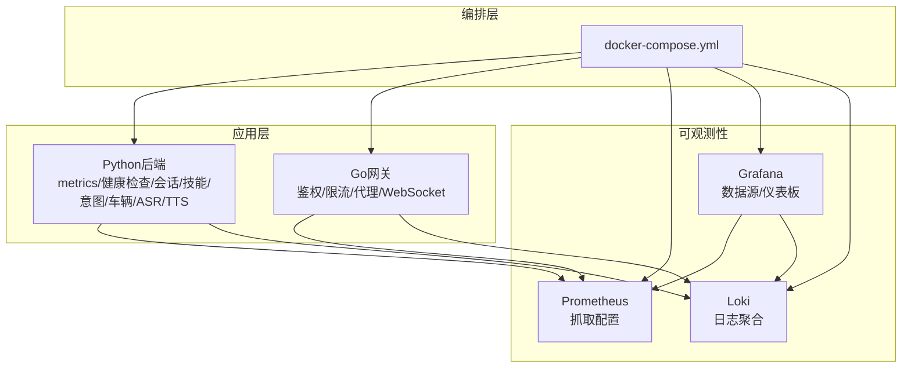
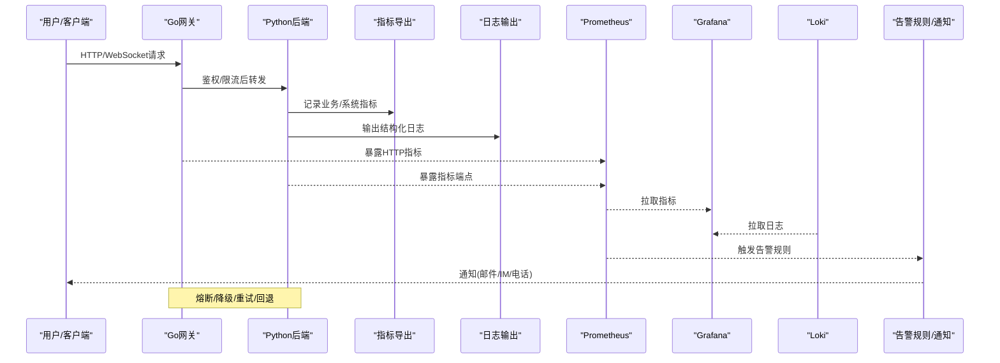
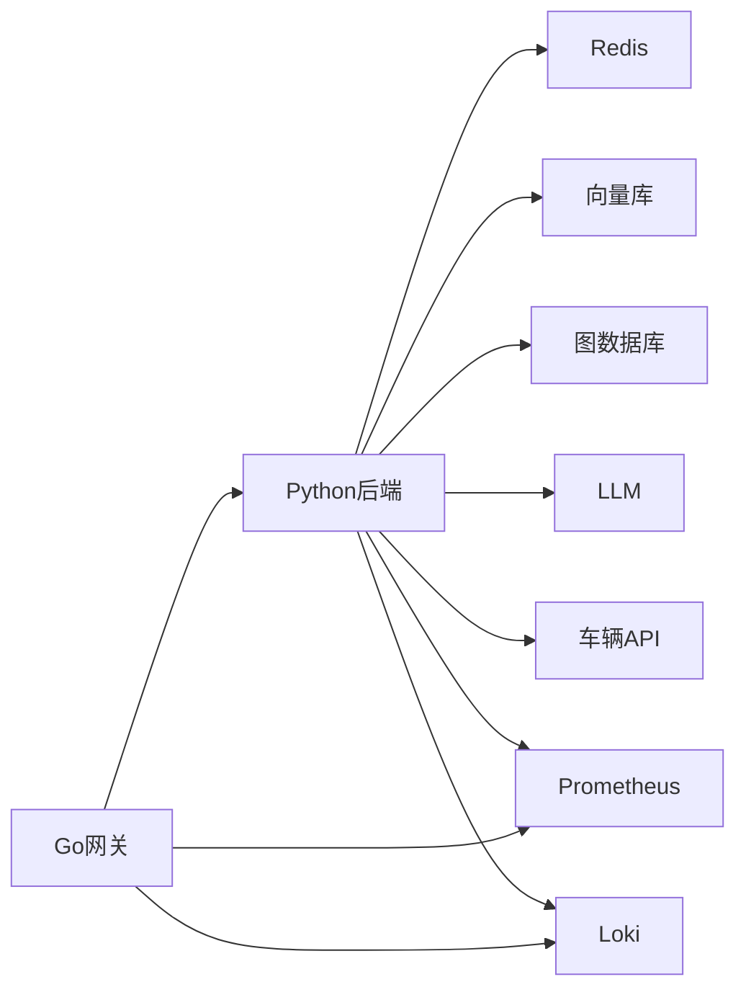

# 监控告警与故障恢复

<cite>
**本文引用的文件**   
- [docker-compose.yml](file://docker-compose.yml)
- [backend_design/nexus/observability/metrics.py](file://backend_design/nexus/observability/metrics.py)
- [backend_design/nexus/observability/cockpit_metrics.py](file://backend_design/nexus/observability/cockpit_metrics.py)
- [backend_design/nexus/core/circuit_breaker.py](file://backend_design/nexus/core/circuit_breaker.py)
- [backend_design/nexus/api/routes/health.py](file://backend_design/nexus/api/routes/health.py)
- [config/prometheus/prometheus.yml](file://config/prometheus/prometheus.yml)
- [config/grafana/provisioning/datasources/prometheus.yml](file://config/grafana/provisioning/datasources/prometheus.yml)
- [config/grafana/provisioning/dashboards/dashboards.yml](file://config/grafana/provisioning/dashboards/dashboards.yml)
- [config/grafana/provisioning/dashboards/nexuscockpit-overview.json](file://config/grafana/provisioning/dashboards/nexuscockpit-overview.json)
- [config/loki/loki-config.yml/](file://config/loki/loki-config.yml/)
- [backend_design/nexus/core/logger.py](file://backend_design/nexus/core/logger.py)
- [backend_design/nexus/api/websocket.py](file://backend_design/nexus/api/websocket.py)
- [backend_design/nexus/skills/orchestrator.py](file://backend_design/nexus/skills/orchestrator.py)
- [backend_design/nexus/intent/router.py](file://backend_design/nexus/intent/router.py)
- [backend_design/nexus/vehicle/factory.py](file://backend_design/nexus/vehicle/factory.py)
- [backend_design/nexus/vehicle/http.py](file://backend_design/nexus/vehicle/http.py)
- [backend_design/nexus/vehicle/mock.py](file://backend_design/nexus/vehicle/mock.py)
- [backend_design/nexus/middleware/rate_limiter.py](file://backend_design/nexus/middleware/rate_limiter.py)
- [backend_design/nexus/middleware/session_store.py](file://backend_design/nexus/middleware/session_store.py)
- [backend_design/nexus/memory/manager.py](file://backend_design/nexus/memory/manager.py)
- [backend_design/nexus/rag/vector_store.py](file://backend_design/nexus/rag/vector_store.py)
- [backend_design/nexus/rag/graph_store.py](file://backend_design/nexus/rag/graph_store.py)
- [backend_design/nexus/rag/retriever.py](file://backend_design/nexus/rag/retriever.py)
- [backend_design/nexus/asr/engine.py](file://backend_design/nexus/asr/engine.py)
- [backend_design/nexus/tts/engine.py](file://backend_design/nexus/tts/engine.py)
- [backend_design/nexus/main.py](file://backend_design/nexus/main.py)
- [backend_design/nexus/config.py](file://backend_design/nexus/config.py)
- [backend_design/nexus/models/state.py](file://backend_design/nexus/models/state.py)
- [backend_design/nexus/models/schemas.py](file://backend_design/nexus/models/schemas.py)
- [backend_design/nexus/api/routes/chat.py](file://backend_design/nexus/api/routes/chat.py)
- [backend_design/nexus/api/routes/vehicle.py](file://backend_design/nexus/api/routes/vehicle.py)
- [backend_design/nexus/api/routes/dataplatform.py](file://backend_design/nexus/api/routes/dataplatform.py)
- [backend_design/nexus/api/routes/settings.py](file://backend_design/nexus/api/routes/settings.py)
- [backend_design/nexus/api/routes/admin.py](file://backend_design/nexus/api/routes/admin.py)
- [backend_design/nexus/api/routes/auth.py](file://backend_design/nexus/api/routes/auth.py)
- [backend_design/nexus/api/routes/middleware_status.py](file://backend_design/nexus/api/routes/middleware_status.py)
- [backend_design/nexus/api/routes/asr.py](file://backend_design/nexus/api/routes/asr.py)
- [backend_design/nexus/api/routes/chat_sessions.py](file://backend_design/nexus/api/routes/chat_sessions.py)
- [backend_design/nexus/api/routes/cockpit.py](file://backend_design/nexus/api/routes/cockpit.py)
- [backend_design/nexus/gateway/cmd/main.go](file://backend_design/nexus_gate/cmd/main.go)
- [backend_design/nexus_gate/internal/handlers/handlers.go](file://backend_design/nexus_gate/internal/handlers/handlers.go)
- [backend_design/nexus_gate/internal/proxy/proxy.go](file://backend_design/nexus_gate/internal/proxy/proxy.go)
- [backend_design/nexus_gate/internal/ws/hub.go](file://backend_design/nexus_gate/internal/ws/hub.go)
- [backend_design/nexus_gate/internal/ratelimit/ratelimit.go](file://backend_design/nexus_gate/internal/ratelimit/ratelimit.go)
- [backend_design/nexus_gate/internal/auth/jwt.go](file://backend_design/nexus_gate/internal/auth/jwt.go)
- [backend_design/nexus_gate/internal/config/config.go](file://backend_design/nexus_gate/internal/config/config.go)
- [backend_design/nexus_gate/internal/router/router.go](file://backend_design/nexus_gate/internal/router/router.go)
- [backend_design/nexus_gate/internal/handlers/redis_client.go](file://backend_design/nexus_gate/internal/handlers/redis_client.go)
- [backend_design/scripts/test_metrics.py](file://backend_design/scripts/test_metrics.py)
- [backend_design/scripts/chaos_test.py](file://backend_design/scripts/chaos_test.py)
- [docs/architecture/L7-observability.md](file://docs/architecture/L7-observability.md)
- [docs/deployment/LLM_FALLBACK.md](file://docs/deployment/LLM_FALLBACK.md)
- [docs/deployment/SETUP.md](file://docs/deployment/SETUP.md)
- [docs/deployment/VERIFICATION.md](file://docs/deployment/VERIFICATION.md)
</cite>

## 目录
1. [简介](#简介)
2. [项目结构](#项目结构)
3. [核心组件](#核心组件)
4. [架构总览](#架构总览)
5. [详细组件分析](#详细组件分析)
6. [依赖关系分析](#依赖关系分析)
7. [性能考量](#性能考量)
8. [故障排查指南](#故障排查指南)
9. [结论](#结论)
10. [附录](#附录)

## 简介
本指南面向运维与SRE团队，提供NexusCockpit的监控、告警与故障恢复操作手册。内容覆盖：
- Prometheus数据采集配置与管理
- Grafana仪表板定制与数据源管理
- Loki日志聚合配置与检索策略
- 关键业务指标定义与采集方法（AI对话成功率、车辆控制响应时间、语音处理延迟等）
- 告警规则模板、级别定义、通知渠道、抑制与去重策略
- 自动恢复机制（服务自愈、降级触发、备份恢复）
- 灾难恢复演练流程与验证方法

## 项目结构
本项目在容器编排层面集成Prometheus、Grafana、Loki等可观测性组件，后端Python服务暴露指标与健康检查接口，Go网关负责鉴权、限流与代理转发。

图表来源
- [docker-compose.yml](file://docker-compose.yml)
- [backend_design/nexus/observability/metrics.py](file://backend_design/nexus/observability/metrics.py)
- [backend_design/nexus/api/routes/health.py](file://backend_design/nexus/api/routes/health.py)
- [config/prometheus/prometheus.yml](file://config/prometheus/prometheus.yml)
- [config/grafana/provisioning/datasources/prometheus.yml](file://config/grafana/provisioning/datasources/prometheus.yml)
- [config/grafana/provisioning/dashboards/dashboards.yml](file://config/grafana/provisioning/dashboards/dashboards.yml)
- [config/grafana/provisioning/dashboards/nexuscockpit-overview.json](file://config/grafana/provisioning/dashboards/nexuscockpit-overview.json)
- [config/loki/loki-config.yml/](file://config/loki/loki-config.yml/)

章节来源
- [docker-compose.yml](file://docker-compose.yml)
- [docs/deployment/SETUP.md](file://docs/deployment/SETUP.md)

## 核心组件
- 指标采集与导出
  - Python后端通过Prometheus客户端库暴露指标端点，涵盖系统、业务与中间件维度。
  - Go网关侧统计请求计数、错误率、延迟分位等基础HTTP指标。
- 日志聚合
  - 应用输出结构化日志，由Loki进行采集与索引；可按标签（服务、租户、会话ID等）检索。
- 健康检查与就绪探针
  - 提供健康检查路由，用于Kubernetes或编排器探测服务可用性。
- 降级与熔断
  - 基于熔断器模式保护下游依赖（如LLM、向量库、图数据库、车辆API），失败阈值触发快速失败与回退路径。
- 限流与会话存储
  - 网关与应用层均具备限流能力；会话状态持久化到Redis，支持横向扩展。

章节来源
- [backend_design/nexus/observability/metrics.py](file://backend_design/nexus/observability/metrics.py)
- [backend_design/nexus/observability/cockpit_metrics.py](file://backend_design/nexus/observability/cockpit_metrics.py)
- [backend_design/nexus/api/routes/health.py](file://backend_design/nexus/api/routes/health.py)
- [backend_design/nexus/core/circuit_breaker.py](file://backend_design/nexus/core/circuit_breaker.py)
- [backend_design/nexus/middleware/rate_limiter.py](file://backend_design/nexus/middleware/rate_limiter.py)
- [backend_design/nexus/middleware/session_store.py](file://backend_design/nexus/middleware/session_store.py)
- [backend_design/nexus_gate/internal/ratelimit/ratelimit.go](file://backend_design/nexus_gate/internal/ratelimit/ratelimit.go)
- [backend_design/nexus_gate/internal/handlers/handlers.go](file://backend_design/nexus_gate/internal/handlers/handlers.go)

## 架构总览
下图展示从用户请求到指标、日志、告警与恢复的整体链路。

图表来源
- [backend_design/nexus/api/routes/health.py](file://backend_design/nexus/api/routes/health.py)
- [backend_design/nexus/observability/metrics.py](file://backend_design/nexus/observability/metrics.py)
- [backend_design/nexus/core/logger.py](file://backend_design/nexus/core/logger.py)
- [backend_design/nexus_gate/internal/handlers/handlers.go](file://backend_design/nexus_gate/internal/handlers/handlers.go)
- [config/prometheus/prometheus.yml](file://config/prometheus/prometheus.yml)
- [config/grafana/provisioning/datasources/prometheus.yml](file://config/grafana/provisioning/datasources/prometheus.yml)
- [config/grafana/provisioning/dashboards/dashboards.yml](file://config/grafana/provisioning/dashboards/dashboards.yml)
- [config/grafana/provisioning/dashboards/nexuscockpit-overview.json](file://config/grafana/provisioning/dashboards/nexuscockpit-overview.json)
- [config/loki/loki-config.yml/](file://config/loki/loki-config.yml/)

## 详细组件分析

### 指标体系与采集
- 系统级指标
  - CPU、内存、磁盘、网络、进程存活、启动耗时、GC停顿等。
- 业务级指标
  - AI对话成功率：成功响应数/总请求数（按租户、会话、模型等维度）。
  - 车辆控制响应时间：端到端时延（网关接收至车辆API返回），含P50/P90/P99。
  - 语音处理延迟：ASR识别耗时、TTS合成耗时、端到端语音交互耗时。
  - 意图路由成功率、技能执行成功率、记忆读写成功率、RAG检索命中率。
- 中间件指标
  - Redis连接池、命中率、队列积压；向量库/图数据库查询耗时与错误率。
- 采集方式
  - Python使用Prometheus客户端注册计数器、直方图、摘要；Go网关暴露标准HTTP指标端点。
  - Prometheus按配置文件周期性抓取；Grafana以Prometheus为数据源并加载内置仪表板。

章节来源
- [backend_design/nexus/observability/metrics.py](file://backend_design/nexus/observability/metrics.py)
- [backend_design/nexus/observability/cockpit_metrics.py](file://backend_design/nexus/observability/cockpit_metrics.py)
- [backend_design/nexus_gate/internal/handlers/handlers.go](file://backend_design/nexus_gate/internal/handlers/handlers.go)
- [config/prometheus/prometheus.yml](file://config/prometheus/prometheus.yml)
- [config/grafana/provisioning/datasources/prometheus.yml](file://config/grafana/provisioning/datasources/prometheus.yml)
- [config/grafana/provisioning/dashboards/dashboards.yml](file://config/grafana/provisioning/dashboards/dashboards.yml)
- [config/grafana/provisioning/dashboards/nexuscockpit-overview.json](file://config/grafana/provisioning/dashboards/nexuscockpit-overview.json)

### 日志聚合与检索
- 日志规范
  - 统一JSON格式，包含时间戳、级别、服务名、租户ID、会话ID、TraceId、消息体等字段。
- 采集与索引
  - 应用将日志输出到stdout/stderr，由Loki采集并按标签索引；建议对租户、会话、模块打标签以提升检索效率。
- 检索策略
  - 按服务+租户+会话过滤；结合关键字与正则定位异常堆栈；关联指标曲线进行根因分析。

章节来源
- [backend_design/nexus/core/logger.py](file://backend_design/nexus/core/logger.py)
- [config/loki/loki-config.yml/](file://config/loki/loki-config.yml/)

### 健康检查与就绪探针
- 健康检查路由
  - 提供轻量健康检查接口，返回服务状态与依赖健康情况（数据库、缓存、外部API）。
- 就绪探针
  - 在启动完成后开启流量入口，避免冷启动期间误判。

章节来源
- [backend_design/nexus/api/routes/health.py](file://backend_design/nexus/api/routes/health.py)

### 熔断与降级
- 熔断器
  - 针对LLM、向量库、图数据库、车辆API等下游设置熔断阈值与冷却时间，失败率超阈快速失败，降低雪崩风险。
- 降级策略
  - 当关键依赖不可用时，切换至本地缓存、Mock实现或只读模式，保障核心体验可用。
- 回退路径
  - 例如LLM不可用则回退到规则引擎或预设回复；车辆控制失败则返回友好提示与重试建议。

章节来源
- [backend_design/nexus/core/circuit_breaker.py](file://backend_design/nexus/core/circuit_breaker.py)
- [backend_design/nexus/vehicle/mock.py](file://backend_design/nexus/vehicle/mock.py)
- [backend_design/nexus/vehicle/http.py](file://backend_design/nexus/vehicle/http.py)
- [backend_design/nexus/rag/vector_store.py](file://backend_design/nexus/rag/vector_store.py)
- [backend_design/nexus/rag/graph_store.py](file://backend_design/nexus/rag/graph_store.py)
- [docs/deployment/LLM_FALLBACK.md](file://docs/deployment/LLM_FALLBACK.md)

### 限流与会话存储
- 限流
  - 网关与应用层双重限流，防止突发流量导致资源耗尽；支持按租户、IP、会话粒度限制。
- 会话存储
  - 会话状态写入Redis，支持水平扩展与故障转移；异常时回退到本地内存（短期）。

章节来源
- [backend_design/nexus/middleware/rate_limiter.py](file://backend_design/nexus/middleware/rate_limiter.py)
- [backend_design/nexus/middleware/session_store.py](file://backend_design/nexus/middleware/session_store.py)
- [backend_design/nexus_gate/internal/ratelimit/ratelimit.go](file://backend_design/nexus_gate/internal/ratelimit/ratelimit.go)

### WebSocket实时通信
- 网关WebSocket Hub
  - 维护长连接、广播消息、心跳检测；异常断开自动重连与消息缓冲。
- 前端适配
  - 前端根据连接状态与事件类型更新UI，显示实时状态与错误提示。

章节来源
- [backend_design/nexus_gate/internal/ws/hub.go](file://backend_design/nexus_gate/internal/ws/hub.go)
- [backend_design/nexus/api/websocket.py](file://backend_design/nexus/api/websocket.py)

### 关键业务流程与指标埋点
- AI对话流程
  - 输入→ASR→意图路由→LLM调用→技能执行→TTS→输出；每个阶段埋点耗时与成功率。
- 车辆控制流程
  - 指令下发→车辆API→结果回传；记录端到端时延与错误码分布。
- 数据平台与设置
  - 数据同步任务、配置变更审计；记录任务成功率与耗时。

章节来源
- [backend_design/nexus/asr/engine.py](file://backend_design/nexus/asr/engine.py)
- [backend_design/nexus/tts/engine.py](file://backend_design/nexus/tts/engine.py)
- [backend_design/nexus/intent/router.py](file://backend_design/nexus/intent/router.py)
- [backend_design/nexus/skills/orchestrator.py](file://backend_design/nexus/skills/orchestrator.py)
- [backend_design/nexus/api/routes/chat.py](file://backend_design/nexus/api/routes/chat.py)
- [backend_design/nexus/api/routes/vehicle.py](file://backend_design/nexus/api/routes/vehicle.py)
- [backend_design/nexus/api/routes/dataplatform.py](file://backend_design/nexus/api/routes/dataplatform.py)
- [backend_design/nexus/api/routes/settings.py](file://backend_design/nexus/api/routes/settings.py)

### Prometheus抓取配置
- 目标发现
  - 为Python后端与Go网关分别配置抓取目标与端口；支持静态或动态发现。
- 抓取间隔与保留期
  - 合理设置抓取间隔与数据保留期，平衡成本与可观测性需求。
- 标签与过滤
  - 为指标添加服务、租户、环境等标签，便于多维分析与告警。

章节来源
- [config/prometheus/prometheus.yml](file://config/prometheus/prometheus.yml)

### Grafana数据源与仪表板
- 数据源
  - 配置Prometheus与Loki数据源，启用认证与TLS（生产环境）。
- 仪表板
  - 导入内置仪表板，自定义关键视图（对话成功率、车辆控制时延、语音处理延迟、错误率、资源使用）。
- 权限与共享
  - 按角色分配访问权限，敏感信息脱敏展示。

章节来源
- [config/grafana/provisioning/datasources/prometheus.yml](file://config/grafana/provisioning/datasources/prometheus.yml)
- [config/grafana/provisioning/dashboards/dashboards.yml](file://config/grafana/provisioning/dashboards/dashboards.yml)
- [config/grafana/provisioning/dashboards/nexuscockpit-overview.json](file://config/grafana/provisioning/dashboards/nexuscockpit-overview.json)

### Loki日志聚合配置
- 存储与压缩
  - 配置对象存储后端与压缩策略，控制成本与查询性能。
- 索引与分片
  - 按租户与服务划分索引，提升检索效率；合理设置分片大小。
- 生命周期管理
  - 设置冷热分层与过期策略，定期归档历史日志。

章节来源
- [config/loki/loki-config.yml/](file://config/loki/loki-config.yml/)

### 告警规则与通知
- 告警级别
  - 紧急（P0）、高（P1）、中（P2）、低（P3）；对应不同SLA与响应时效。
- 通知渠道
  - 邮件、企业IM、短信、电话；按级别路由到不同通道。
- 抑制与去重
  - 基于标签匹配抑制重复告警；窗口期内合并同类问题；静默时段配置。
- 模板与示例
  - 提供常见场景模板（CPU/内存/错误率/时延/依赖不可用/限流触发/队列积压）。

章节来源
- [backend_design/nexus/observability/metrics.py](file://backend_design/nexus/observability/metrics.py)
- [backend_design/nexus/observability/cockpit_metrics.py](file://backend_design/nexus/observability/cockpit_metrics.py)
- [backend_design/nexus_gate/internal/handlers/handlers.go](file://backend_design/nexus_gate/internal/handlers/handlers.go)

### 故障自动恢复机制
- 服务自愈
  - 健康检查失败自动重启；副本扩容与滚动更新；Pod/容器级隔离。
- 数据备份恢复
  - 定时快照Redis、向量库、图数据库；支持增量与全量恢复；演练验证恢复时长与一致性。
- 降级策略触发
  - 依赖不可用时自动切换回退路径；限流与熔断协同，避免雪崩。
- 演练与验证
  - 混沌工程注入故障，观察自愈与降级效果；记录恢复时间与影响面。

章节来源
- [backend_design/nexus/core/circuit_breaker.py](file://backend_design/nexus/core/circuit_breaker.py)
- [backend_design/nexus/middleware/session_store.py](file://backend_design/nexus/middleware/session_store.py)
- [backend_design/nexus/rag/vector_store.py](file://backend_design/nexus/rag/vector_store.py)
- [backend_design/nexus/rag/graph_store.py](file://backend_design/nexus/rag/graph_store.py)
- [backend_design/scripts/chaos_test.py](file://backend_design/scripts/chaos_test.py)
- [docs/deployment/LLM_FALLBACK.md](file://docs/deployment/LLM_FALLBACK.md)

### 灾难恢复演练流程
- 准备
  - 确认备份集最新且可恢复；准备演练环境与回滚方案。
- 执行
  - 模拟主节点故障、数据损坏、网络分区；触发自动恢复与人工干预。
- 验证
  - 校验数据一致性、服务可用性、指标与日志完整性；记录MTTR与影响范围。
- 复盘
  - 总结改进项，优化熔断阈值、备份策略与演练脚本。

章节来源
- [backend_design/scripts/chaos_test.py](file://backend_design/scripts/chaos_test.py)
- [docs/deployment/VERIFICATION.md](file://docs/deployment/VERIFICATION.md)

## 依赖关系分析
- 组件耦合
  - 网关与后端松耦合，通过HTTP/WebSocket通信；指标与日志独立采集，不影响业务主路径。
- 外部依赖
  - Redis、向量库、图数据库、LLM、车辆API；通过熔断与回退降低耦合风险。
- 循环依赖
  - 模块内职责清晰，避免循环导入；通过工厂与抽象类解耦具体实现。

图表来源
- [backend_design/nexus_gate/internal/handlers/handlers.go](file://backend_design/nexus_gate/internal/handlers/handlers.go)
- [backend_design/nexus/middleware/session_store.py](file://backend_design/nexus/middleware/session_store.py)
- [backend_design/nexus/rag/vector_store.py](file://backend_design/nexus/rag/vector_store.py)
- [backend_design/nexus/rag/graph_store.py](file://backend_design/nexus/rag/graph_store.py)
- [backend_design/nexus/vehicle/http.py](file://backend_design/nexus/vehicle/http.py)
- [backend_design/nexus/observability/metrics.py](file://backend_design/nexus/observability/metrics.py)
- [backend_design/nexus/core/logger.py](file://backend_design/nexus/core/logger.py)

章节来源
- [backend_design/nexus/main.py](file://backend_design/nexus/main.py)
- [backend_design/nexus/config.py](file://backend_design/nexus/config.py)

## 性能考量
- 指标采样
  - 对高频指标采用摘要或直方图，合理设置桶边界与采样率，避免开销过大。
- 日志吞吐
  - 异步落盘与批量发送；按级别过滤与采样，减少I/O压力。
- 缓存与复用
  - 热点数据缓存、连接池复用、对象池减少GC压力。
- 容量规划
  - 依据峰值QPS与延迟目标规划实例数与资源配额；预留弹性扩容空间。

[本节为通用指导，不直接分析具体文件]

## 故障排查指南
- 常见问题
  - 指标缺失：检查抓取配置、端口可达性与认证；确认指标端点正常。
  - 日志丢失：检查Loki采集器状态、标签映射与存储后端连通性。
  - 高错误率：查看错误码分布、依赖健康状态与熔断器状态。
  - 高延迟：分析分位时延、队列积压与锁竞争；定位慢查询与瓶颈。
- 诊断步骤
  - 从Grafana定位异常时间段，结合Loki检索相关日志；追踪TraceId串联上下游。
  - 使用健康检查与中间件状态接口确认组件健康；必要时触发降级与限流。
- 工具与脚本
  - 使用测试脚本验证指标与日志采集；使用混沌脚本注入故障验证自愈。

章节来源
- [backend_design/scripts/test_metrics.py](file://backend_design/scripts/test_metrics.py)
- [backend_design/scripts/chaos_test.py](file://backend_design/scripts/chaos_test.py)
- [backend_design/nexus/api/routes/middleware_status.py](file://backend_design/nexus/api/routes/middleware_status.py)
- [backend_design/nexus/api/routes/health.py](file://backend_design/nexus/api/routes/health.py)

## 结论
通过完善的指标、日志与告警体系，配合熔断、降级与自动化恢复机制，NexusCockpit能够在复杂依赖环境下保持稳定与高可用。建议持续完善业务指标覆盖度、优化告警策略与演练频率，确保在真实故障场景中快速定位与恢复。

[本节为总结，不直接分析具体文件]

## 附录
- 术语表
  - MTTR：平均修复时间；SLA：服务等级协议；熔断：快速失败保护；降级：功能裁剪保障核心体验。
- 参考文档
  - 架构与可观测性设计、部署与验证指南、LLM回退策略。

章节来源
- [docs/architecture/L7-observability.md](file://docs/architecture/L7-observability.md)
- [docs/deployment/SETUP.md](file://docs/deployment/SETUP.md)
- [docs/deployment/VERIFICATION.md](file://docs/deployment/VERIFICATION.md)
- [docs/deployment/LLM_FALLBACK.md](file://docs/deployment/LLM_FALLBACK.md)