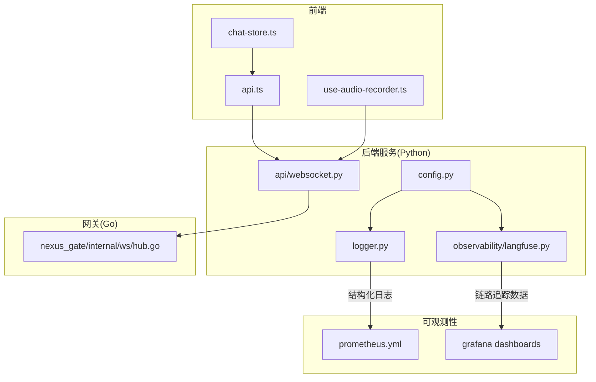
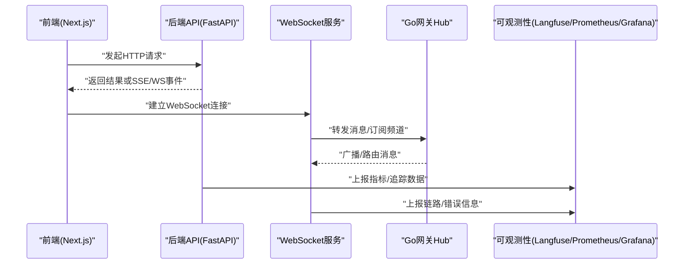
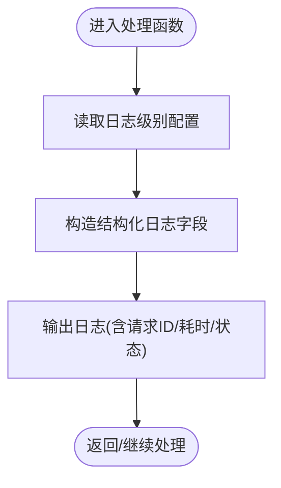
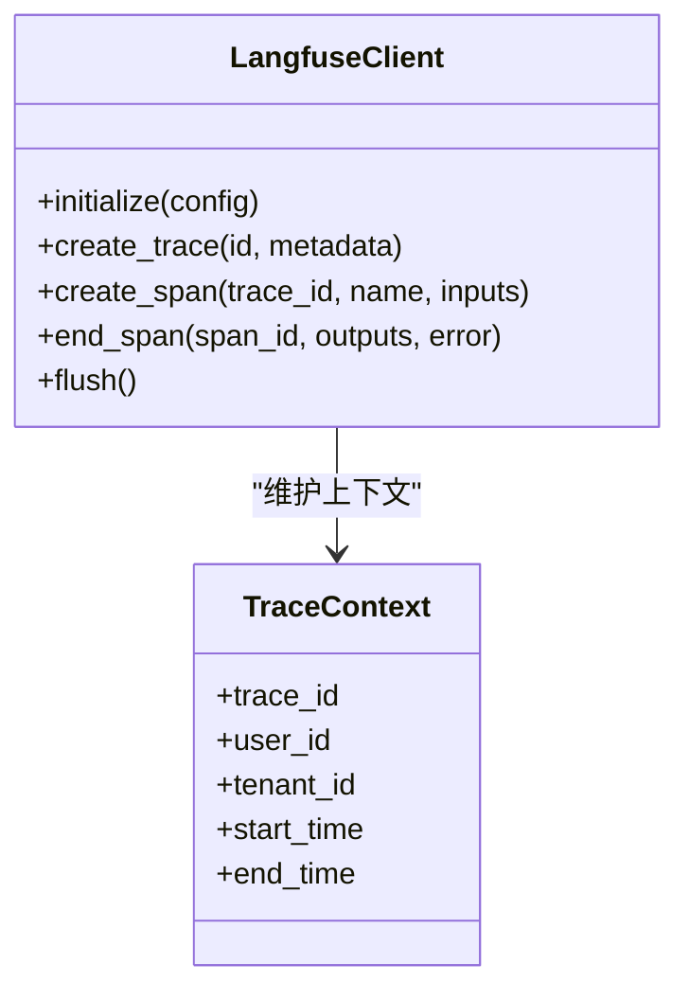
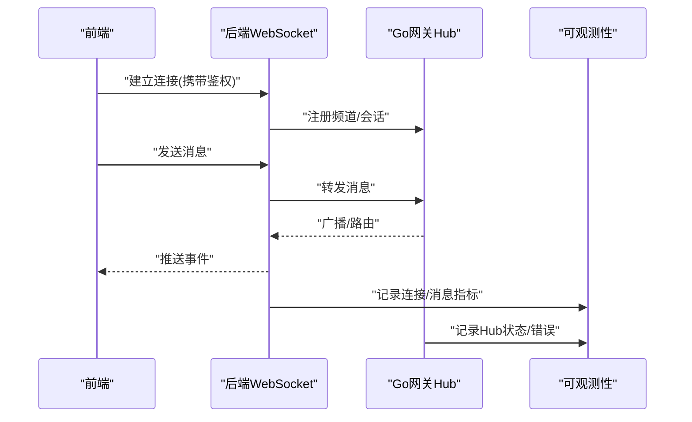
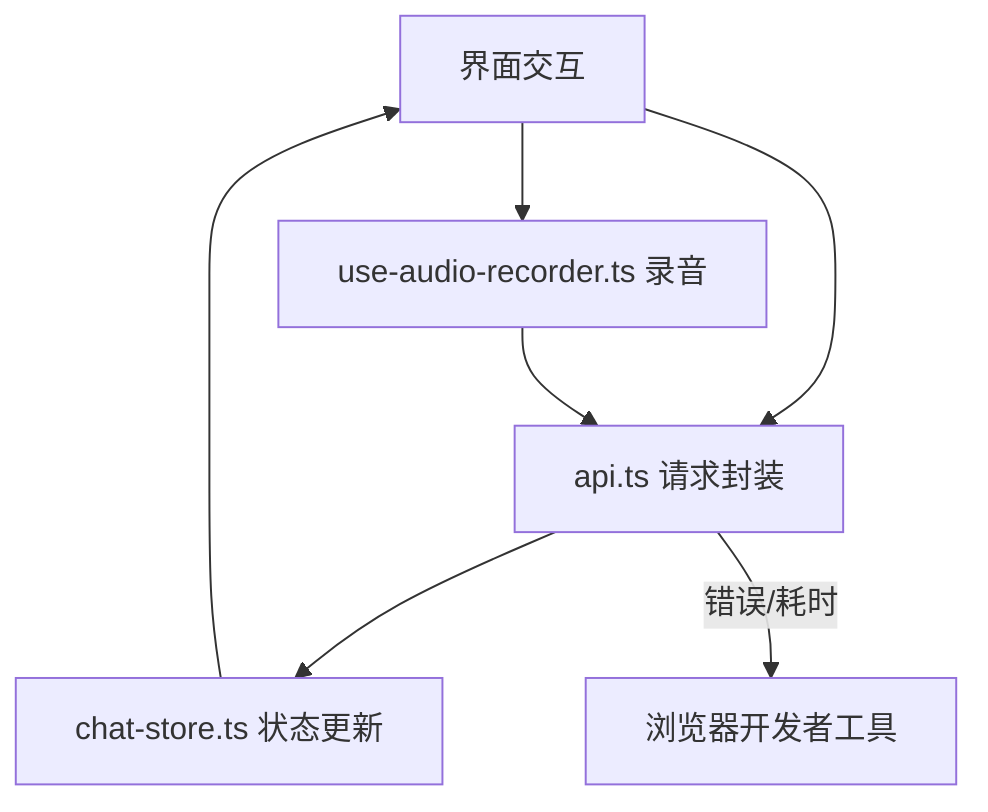
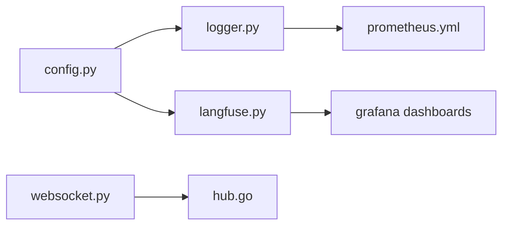

# 调试技巧与工具

<cite>
**本文引用的文件**   
- [backend_design/nexus/core/logger.py](file://backend_design/nexus/core/logger.py)
- [backend_design/nexus/observability/langfuse.py](file://backend_design/nexus/observability/langfuse.py)
- [backend_design/nexus/api/websocket.py](file://backend_design/nexus/api/websocket.py)
- [backend_design/nexus_gate/internal/ws/hub.go](file://backend_design/nexus_gate/internal/ws/hub.go)
- [backend_design/nexus/config.py](file://backend_design/nexus/config.py)
- [config/prometheus/prometheus.yml](file://config/prometheus/prometheus.yml)
- [config/grafana/provisioning/dashboards/nexuscockpit-overview.json](file://config/grafana/provisioning/dashboards/nexuscockpit-overview.json)
- [frontend_design/src/lib/api.ts](file://frontend_design/src/lib/api.ts)
- [frontend_design/src/stores/chat-store.ts](file://frontend_design/src/stores/chat-store.ts)
- [frontend_design/src/hooks/use-audio-recorder.ts](file://frontend_design/src/hooks/use-audio-recorder.ts)
</cite>

## 目录
1. [简介](#简介)
2. [项目结构](#项目结构)
3. [核心组件](#核心组件)
4. [架构总览](#架构总览)
5. [详细组件分析](#详细组件分析)
6. [依赖关系分析](#依赖关系分析)
7. [性能考虑](#性能考虑)
8. [故障排查指南](#故障排查指南)
9. [结论](#结论)
10. [附录](#附录)

## 简介
本指南面向开发与运维人员，聚焦于在NexusCockpit项目中高效定位问题的实战方法。内容覆盖：
- 日志系统：级别配置、结构化输出、关键业务埋点建议
- Python调试：pdb/ipdb断点、变量查看、异步场景调试
- 分布式追踪：Langfuse链路追踪、性能分析与错误追踪
- WebSocket调试：前后端联调、实时通信问题排查
- 前端调试：浏览器开发者工具、网络请求、状态管理调试

## 项目结构
本项目后端采用Python（FastAPI）+ Go网关的混合架构，可观测性包含Prometheus/Grafana与Langfuse；前端为Next.js应用。与调试密切相关的模块分布如下：
- 后端日志：backend_design/nexus/core/logger.py
- 分布式追踪：backend_design/nexus/observability/langfuse.py
- API与WebSocket：backend_design/nexus/api/websocket.py
- Go网关WebSocket Hub：backend_design/nexus_gate/internal/ws/hub.go
- 配置中心：backend_design/nexus/config.py
- 指标采集与可视化：config/prometheus/prometheus.yml、config/grafana/provisioning/dashboards/nexuscockpit-overview.json
- 前端API与状态：frontend_design/src/lib/api.ts、frontend_design/src/stores/chat-store.ts
- 前端音频录制Hook：frontend_design/src/hooks/use-audio-recorder.ts

图表来源
- [backend_design/nexus/core/logger.py](file://backend_design/nexus/core/logger.py)
- [backend_design/nexus/observability/langfuse.py](file://backend_design/nexus/observability/langfuse.py)
- [backend_design/nexus/api/websocket.py](file://backend_design/nexus/api/websocket.py)
- [backend_design/nexus_gate/internal/ws/hub.go](file://backend_design/nexus_gate/internal/ws/hub.go)
- [backend_design/nexus/config.py](file://backend_design/nexus/config.py)
- [config/prometheus/prometheus.yml](file://config/prometheus/prometheus.yml)
- [config/grafana/provisioning/dashboards/nexuscockpit-overview.json](file://config/grafana/provisioning/dashboards/nexuscockpit-overview.json)
- [frontend_design/src/lib/api.ts](file://frontend_design/src/lib/api.ts)
- [frontend_design/src/stores/chat-store.ts](file://frontend_design/src/stores/chat-store.ts)
- [frontend_design/src/hooks/use-audio-recorder.ts](file://frontend_design/src/hooks/use-audio-recorder.ts)

章节来源
- [backend_design/nexus/core/logger.py](file://backend_design/nexus/core/logger.py)
- [backend_design/nexus/observability/langfuse.py](file://backend_design/nexus/observability/langfuse.py)
- [backend_design/nexus/api/websocket.py](file://backend_design/nexus/api/websocket.py)
- [backend_design/nexus_gate/internal/ws/hub.go](file://backend_design/nexus_gate/internal/ws/hub.go)
- [backend_design/nexus/config.py](file://backend_design/nexus/config.py)
- [config/prometheus/prometheus.yml](file://config/prometheus/prometheus.yml)
- [config/grafana/provisioning/dashboards/nexuscockpit-overview.json](file://config/grafana/provisioning/dashboards/nexuscockpit-overview.json)
- [frontend_design/src/lib/api.ts](file://frontend_design/src/lib/api.ts)
- [frontend_design/src/stores/chat-store.ts](file://frontend_design/src/stores/chat-store.ts)
- [frontend_design/src/hooks/use-audio-recorder.ts](file://frontend_design/src/hooks/use-audio-recorder.ts)

## 核心组件
本节聚焦与调试直接相关的核心能力：日志、分布式追踪、WebSocket、前端调试入口。

- 日志系统
  - 提供统一的日志初始化与格式化能力，支持结构化字段输出，便于聚合与分析。
  - 通过配置控制日志级别与输出目标，推荐在生产环境使用JSON格式并接入日志收集系统。
- 分布式追踪（Langfuse）
  - 封装了与Langfuse集成的能力，用于记录LLM调用链路与关键步骤耗时，辅助定位慢调用与异常分支。
- WebSocket通道
  - 提供前后端实时通信接口，Go网关Hub负责连接管理与消息转发，便于流式响应与语音交互场景。
- 前端调试入口
  - 统一API层与状态管理，结合浏览器开发者工具进行网络与状态调试。

章节来源
- [backend_design/nexus/core/logger.py](file://backend_design/nexus/core/logger.py)
- [backend_design/nexus/observability/langfuse.py](file://backend_design/nexus/observability/langfuse.py)
- [backend_design/nexus/api/websocket.py](file://backend_design/nexus/api/websocket.py)
- [backend_design/nexus_gate/internal/ws/hub.go](file://backend_design/nexus_gate/internal/ws/hub.go)
- [frontend_design/src/lib/api.ts](file://frontend_design/src/lib/api.ts)
- [frontend_design/src/stores/chat-store.ts](file://frontend_design/src/stores/chat-store.ts)

## 架构总览
下图展示了从前端到后端再到可观测性系统的整体链路，以及调试过程中常用的观察点。

图表来源
- [backend_design/nexus/api/websocket.py](file://backend_design/nexus/api/websocket.py)
- [backend_design/nexus_gate/internal/ws/hub.go](file://backend_design/nexus_gate/internal/ws/hub.go)
- [backend_design/nexus/observability/langfuse.py](file://backend_design/nexus/observability/langfuse.py)
- [config/prometheus/prometheus.yml](file://config/prometheus/prometheus.yml)
- [config/grafana/provisioning/dashboards/nexuscockpit-overview.json](file://config/grafana/provisioning/dashboards/nexuscockpit-overview.json)

## 详细组件分析

### 日志系统：级别、结构与埋点
- 日志级别配置
  - 通过配置项控制根日志器级别，开发环境建议使用更详细的级别以便捕获上下文信息。
  - 生产环境建议降低级别并启用结构化输出，减少I/O开销。
- 结构化日志格式
  - 建议在关键路径输出固定字段（如请求ID、用户ID、租户ID、操作类型、耗时等），便于检索与关联。
  - 将敏感信息脱敏后再写入日志，避免泄露。
- 关键业务埋点建议
  - 在API入口/出口记录请求开始与结束，附带耗时与状态码。
  - 在外部调用（数据库、向量库、LLM、TTS/ASR）前后记录耗时与错误码。
  - 在WebSocket消息收发处记录消息类型与大小，便于定位丢包或阻塞。

图表来源
- [backend_design/nexus/core/logger.py](file://backend_design/nexus/core/logger.py)
- [backend_design/nexus/config.py](file://backend_design/nexus/config.py)

章节来源
- [backend_design/nexus/core/logger.py](file://backend_design/nexus/core/logger.py)
- [backend_design/nexus/config.py](file://backend_design/nexus/config.py)

### Python调试：pdb/ipdb与断点技巧
- 基础用法
  - 在代码中插入断点，启动后进入交互式调试会话，支持单步执行、条件断点、回溯查看。
  - 推荐使用ipdb以获得更好的终端体验与语法高亮。
- 常用命令
  - 设置/删除断点、打印变量、查看栈帧、继续执行、退出调试。
- 异步场景
  - 在协程中使用断点时，注意事件循环状态；必要时在回调边界或任务入口处打断点。
- 远程调试
  - 容器化部署下可通过端口映射暴露调试端口，或使用IDE远程附加方式连接。

提示
- 仅在开发或临时诊断时使用断点，避免在生产环境引入额外开销。
- 结合结构化日志与断点，先以日志缩小范围，再以断点精确定位。

章节来源
- [backend_design/nexus/core/logger.py](file://backend_design/nexus/core/logger.py)

### 分布式追踪：Langfuse配置与使用
- 集成要点
  - 初始化Langfuse客户端，设置必要的认证与端点信息。
  - 在关键流程（如意图识别、RAG检索、LLM调用、TTS/ASR）创建span并记录输入输出摘要与耗时。
- 链路追踪
  - 为每次用户请求生成唯一trace_id，贯穿各子系统，便于端到端分析。
- 性能分析
  - 关注长尾耗时节点，对比不同模型/参数下的延迟分布。
- 错误追踪
  - 在异常分支记录错误类型、堆栈摘要与上下文关键字段，便于快速复现。

图表来源
- [backend_design/nexus/observability/langfuse.py](file://backend_design/nexus/observability/langfuse.py)
- [backend_design/nexus/config.py](file://backend_design/nexus/config.py)

章节来源
- [backend_design/nexus/observability/langfuse.py](file://backend_design/nexus/observability/langfuse.py)
- [backend_design/nexus/config.py](file://backend_design/nexus/config.py)

### WebSocket调试与实时通信排查
- 连接建立
  - 前端通过ws/wss协议建立连接，携带鉴权头或查询参数；后端验证通过后加入Hub频道。
- 消息路由
  - Go网关Hub负责连接管理与消息分发，确保同一会话的消息有序到达。
- 常见问题
  - 握手失败：检查鉴权、跨域、证书与代理配置。
  - 消息丢失：确认Hub是否在线、频道是否正确、消费者是否消费过快导致积压。
  - 心跳超时：检查服务端心跳策略与客户端重连逻辑。
- 调试技巧
  - 使用浏览器开发者工具的Network面板查看WebSocket帧。
  - 在后端与Hub处增加结构化日志，记录消息类型、长度、时间戳与错误码。
  - 对高频消息采样记录，避免日志风暴。

图表来源
- [backend_design/nexus/api/websocket.py](file://backend_design/nexus/api/websocket.py)
- [backend_design/nexus_gate/internal/ws/hub.go](file://backend_design/nexus_gate/internal/ws/hub.go)

章节来源
- [backend_design/nexus/api/websocket.py](file://backend_design/nexus/api/websocket.py)
- [backend_design/nexus_gate/internal/ws/hub.go](file://backend_design/nexus_gate/internal/ws/hub.go)

### 前端调试：网络、状态与媒体
- 网络请求调试
  - 使用浏览器开发者工具的Network面板查看HTTP/WebSocket请求详情，包括请求头、响应体与耗时。
  - 在前端API层添加请求/响应拦截，记录关键字段与错误信息。
- 状态管理调试
  - 在状态存储中添加变更日志或快照导出，便于回放与对比。
  - 针对复杂状态流转，使用断点或控制台表达式观察状态变化。
- 媒体与录音
  - 使用MediaRecorder相关API时，检查权限、编码格式与采样率。
  - 在录音Hook中记录开始/停止时间与时长，配合后端接收端日志对齐问题。

图表来源
- [frontend_design/src/lib/api.ts](file://frontend_design/src/lib/api.ts)
- [frontend_design/src/stores/chat-store.ts](file://frontend_design/src/stores/chat-store.ts)
- [frontend_design/src/hooks/use-audio-recorder.ts](file://frontend_design/src/hooks/use-audio-recorder.ts)

章节来源
- [frontend_design/src/lib/api.ts](file://frontend_design/src/lib/api.ts)
- [frontend_design/src/stores/chat-store.ts](file://frontend_design/src/stores/chat-store.ts)
- [frontend_design/src/hooks/use-audio-recorder.ts](file://frontend_design/src/hooks/use-audio-recorder.ts)

## 依赖关系分析
- 组件耦合
  - 日志与配置强耦合，日志行为受配置驱动。
  - Langfuse与业务模块松耦合，通过客户端接口注入追踪上下文。
  - WebSocket前后端通过协议约定解耦，Hub作为中间层提升扩展性。
- 外部依赖
  - Prometheus/Grafana用于指标采集与可视化。
  - Langfuse用于分布式追踪与错误归因。
- 潜在风险
  - 过度日志可能导致I/O瓶颈，需按环境分级输出。
  - 追踪数据量较大时需评估存储与查询成本。

图表来源
- [backend_design/nexus/config.py](file://backend_design/nexus/config.py)
- [backend_design/nexus/core/logger.py](file://backend_design/nexus/core/logger.py)
- [backend_design/nexus/observability/langfuse.py](file://backend_design/nexus/observability/langfuse.py)
- [backend_design/nexus/api/websocket.py](file://backend_design/nexus/api/websocket.py)
- [backend_design/nexus_gate/internal/ws/hub.go](file://backend_design/nexus_gate/internal/ws/hub.go)
- [config/prometheus/prometheus.yml](file://config/prometheus/prometheus.yml)
- [config/grafana/provisioning/dashboards/nexuscockpit-overview.json](file://config/grafana/provisioning/dashboards/nexuscockpit-overview.json)

章节来源
- [backend_design/nexus/config.py](file://backend_design/nexus/config.py)
- [backend_design/nexus/core/logger.py](file://backend_design/nexus/core/logger.py)
- [backend_design/nexus/observability/langfuse.py](file://backend_design/nexus/observability/langfuse.py)
- [backend_design/nexus/api/websocket.py](file://backend_design/nexus/api/websocket.py)
- [backend_design/nexus_gate/internal/ws/hub.go](file://backend_design/nexus_gate/internal/ws/hub.go)
- [config/prometheus/prometheus.yml](file://config/prometheus/prometheus.yml)
- [config/grafana/provisioning/dashboards/nexuscockpit-overview.json](file://config/grafana/provisioning/dashboards/nexuscockpit-overview.json)

## 性能考虑
- 日志
  - 生产环境降低日志级别，启用批量写入与异步落盘，避免阻塞主流程。
  - 对高频路径使用采样或仅记录摘要。
- 追踪
  - 合理选择span粒度，避免过细导致数据膨胀；对关键路径全量记录。
  - 定期清理历史追踪数据，控制存储成本。
- WebSocket
  - 控制消息体积与频率，必要时进行压缩与合并。
  - 监控Hub连接数与队列长度，及时扩容或限流。

[本节为通用指导，不直接分析具体文件]

## 故障排查指南
- 日志定位
  - 根据请求ID检索全链路日志，核对关键步骤的状态与耗时。
  - 关注异常堆栈与错误码，结合上下文字段快速复现场景。
- 追踪分析
  - 在Langfuse中按trace_id查看完整链路，定位慢节点与失败分支。
  - 对比不同版本或参数的差异，辅助回归定位。
- WebSocket问题
  - 检查连接建立阶段鉴权与跨域配置。
  - 使用抓包或浏览器面板查看帧内容，确认消息是否被正确路由。
- 前端问题
  - 在Network面板过滤特定域名或接口，查看请求失败原因。
  - 在状态管理中打印快照，对比期望与实际状态差异。

章节来源
- [backend_design/nexus/core/logger.py](file://backend_design/nexus/core/logger.py)
- [backend_design/nexus/observability/langfuse.py](file://backend_design/nexus/observability/langfuse.py)
- [backend_design/nexus/api/websocket.py](file://backend_design/nexus/api/websocket.py)
- [backend_design/nexus_gate/internal/ws/hub.go](file://backend_design/nexus_gate/internal/ws/hub.go)
- [frontend_design/src/lib/api.ts](file://frontend_design/src/lib/api.ts)
- [frontend_design/src/stores/chat-store.ts](file://frontend_design/src/stores/chat-store.ts)

## 结论
通过统一的日志规范、完善的分布式追踪与高效的WebSocket调试手段，结合前端开发者工具与状态管理调试，可以显著提升问题定位效率。建议在日常开发中固化以下实践：
- 始终输出结构化日志并带上必要上下文
- 在关键路径记录追踪span，形成端到端视图
- 对WebSocket连接与消息进行最小化但关键的日志埋点
- 利用浏览器开发者工具与状态快照快速收敛问题范围

[本节为总结性内容，不直接分析具体文件]

## 附录
- 常用命令速查（Python调试）
  - 设置断点、单步执行、查看变量、继续运行、退出调试
- 浏览器开发者工具快捷键
  - 打开面板、切换标签页、过滤请求、查看网络瀑布图
- 指标与看板
  - 在Grafana中查看NexusCockpit概览看板，关注错误率、延迟分位数与连接数

[本节为补充说明，不直接分析具体文件]