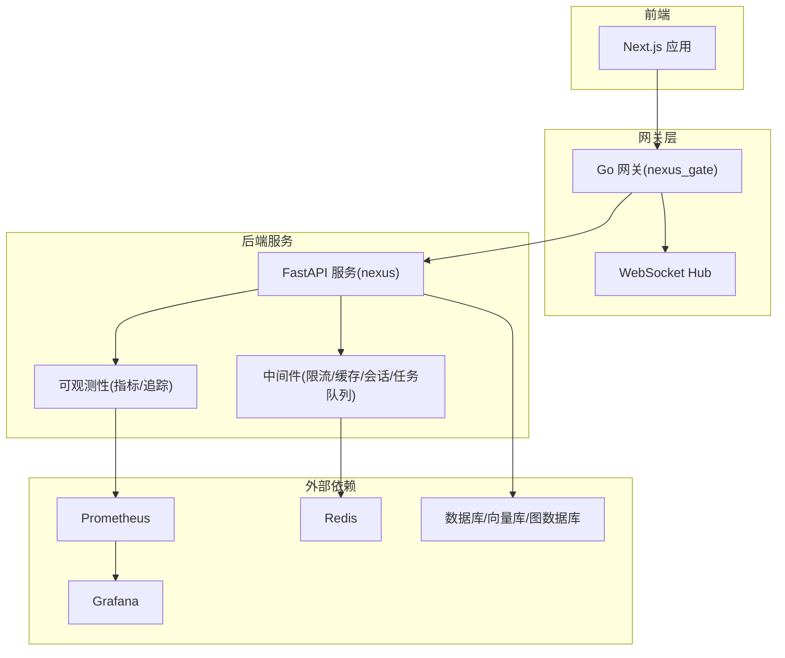
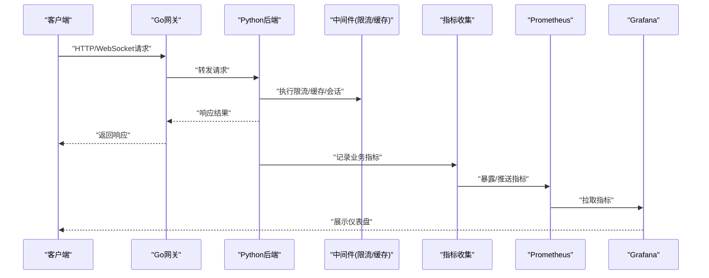
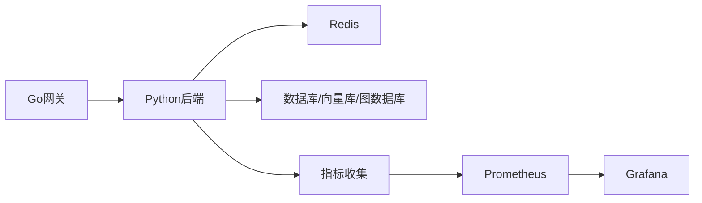
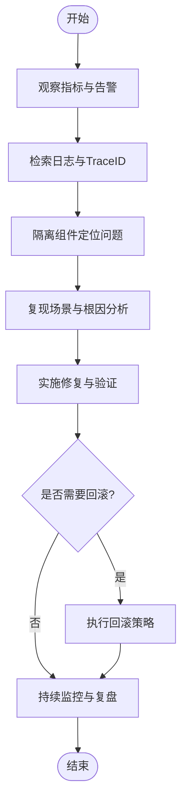

# 故障排查和FAQ

<cite>
**本文引用的文件**
- [backend_design/nexus/main.py](file://backend_design/nexus/main.py)
- [backend_design/nexus/core/logger.py](file://backend_design/nexus/core/logger.py)
- [backend_design/nexus/core/exceptions.py](file://backend_design/nexus/core/exceptions.py)
- [backend_design/nexus/core/circuit_breaker.py](file://backend_design/nexus/core/circuit_breaker.py)
- [backend_design/nexus/api/websocket.py](file://backend_design/nexus/api/websocket.py)
- [backend_design/nexus/middleware/rate_limiter.py](file://backend_design/nexus/middleware/rate_limiter.py)
- [backend_design/nexus/middleware/redis_cache.py](file://backend_design/nexus/middleware/redis_cache.py)
- [backend_design/nexus/observability/metrics.py](file://backend_design/nexus/observability/metrics.py)
- [backend_design/nexus/observability/cockpit_metrics.py](file://backend_design/nexus/observability/cockpit_metrics.py)
- [backend_design/nexus_gate/internal/handlers/handlers.go](file://backend_design/nexus_gate/internal/handlers/handlers.go)
- [backend_design/nexus_gate/internal/ws/hub.go](file://backend_design/nexus_gate/internal/ws/hub.go)
- [config/grafana/provisioning/dashboards/nexuscockpit-overview.json](file://config/grafana/provisioning/dashboards/nexuscockpit-overview.json)
- [config/prometheus/prometheus.yml](file://config/prometheus/prometheus.yml)
- [docker-compose.yml](file://docker-compose.yml)
</cite>

## 目录
1. [简介](#简介)
2. [项目结构](#项目结构)
3. [核心组件](#核心组件)
4. [架构总览](#架构总览)
5. [详细组件分析](#详细组件分析)
6. [依赖分析](#依赖分析)
7. [性能考虑](#性能考虑)
8. [故障排查指南](#故障排查指南)
9. [结论](#结论)
10. [附录](#附录)

## 简介
本文件面向NexusCockpit系统的运维与研发人员，提供系统运行中的常见问题、错误信息与解决方案；给出调试技巧、日志分析方法和问题定位步骤；涵盖性能瓶颈识别、内存泄漏检测、网络问题诊断等高级排查方法；解释监控指标含义与阈值建议；并提供紧急故障处理流程与回滚策略，以及问题反馈与社区支持渠道。

## 项目结构
NexusCockpit采用前后端分离与微服务化设计：
- 后端Python服务（nexus）：提供API、WebSocket、中间件、可观测性、RAG/Agent/Skills等能力。
- Go网关（nexus_gate）：负责鉴权、限流、反向代理与WebSocket Hub。
- 前端Next.js应用：管理控制台、聊天、车辆控制、数据平台等页面。
- 可观测性与配置：Prometheus、Grafana、Loki等。
- 容器编排：docker-compose统一拉起各组件。

图表来源
- [backend_design/nexus/main.py](file://backend_design/nexus/main.py)
- [backend_design/nexus_gate/internal/handlers/handlers.go](file://backend_design/nexus_gate/internal/handlers/handlers.go)
- [backend_design/nexus_gate/internal/ws/hub.go](file://backend_design/nexus_gate/internal/ws/hub.go)
- [backend_design/nexus/observability/metrics.py](file://backend_design/nexus/observability/metrics.py)
- [config/prometheus/prometheus.yml](file://config/prometheus/prometheus.yml)

章节来源
- [docker-compose.yml](file://docker-compose.yml)

## 核心组件
- 网关与WebSocket
  - Go网关负责鉴权、限流、反向代理与WebSocket连接转发。
  - WebSocket Hub维护长连接与会话状态。
- Python后端服务
  - 提供REST API与WebSocket接口。
  - 中间件包括限流、Redis缓存、会话存储、任务队列。
  - 可观测性模块暴露指标并集成追踪。
- 可观测性与配置
  - Prometheus抓取指标，Grafana展示仪表盘。
  - Loki用于日志聚合（配置文件存在）。

章节来源
- [backend_design/nexus_gate/internal/handlers/handlers.go](file://backend_design/nexus_gate/internal/handlers/handlers.go)
- [backend_design/nexus_gate/internal/ws/hub.go](file://backend_design/nexus_gate/internal/ws/hub.go)
- [backend_design/nexus/api/websocket.py](file://backend_design/nexus/api/websocket.py)
- [backend_design/nexus/middleware/rate_limiter.py](file://backend_design/nexus/middleware/rate_limiter.py)
- [backend_design/nexus/middleware/redis_cache.py](file://backend_design/nexus/middleware/redis_cache.py)
- [backend_design/nexus/observability/metrics.py](file://backend_design/nexus/observability/metrics.py)
- [config/grafana/provisioning/dashboards/nexuscockpit-overview.json](file://config/grafana/provisioning/dashboards/nexuscockpit-overview.json)
- [config/prometheus/prometheus.yml](file://config/prometheus/prometheus.yml)

## 架构总览
下图展示了从请求进入网关到后端处理、指标采集与可视化展示的完整链路，便于快速定位问题边界。

图表来源
- [backend_design/nexus_gate/internal/handlers/handlers.go](file://backend_design/nexus_gate/internal/handlers/handlers.go)
- [backend_design/nexus/main.py](file://backend_design/nexus/main.py)
- [backend_design/nexus/middleware/rate_limiter.py](file://backend_design/nexus/middleware/rate_limiter.py)
- [backend_design/nexus/observability/metrics.py](file://backend_design/nexus/observability/metrics.py)
- [config/prometheus/prometheus.yml](file://config/prometheus/prometheus.yml)
- [config/grafana/provisioning/dashboards/nexuscockpit-overview.json](file://config/grafana/provisioning/dashboards/nexuscockpit-overview.json)

## 详细组件分析

### 网关与WebSocket（Go）
- 职责
  - 鉴权校验、请求限流、反向代理至后端。
  - WebSocket Hub维护连接集合、广播消息、心跳检测。
- 常见问题
  - 连接频繁断开：检查Hub心跳、客户端重连逻辑、网络抖动。
  - 鉴权失败：核对JWT配置、签名算法、过期时间。
  - 限流触发：查看限流计数与窗口大小，必要时调整阈值。
- 定位步骤
  - 在网关侧打印入站请求与转发目标。
  - 观察Hub连接数与消息吞吐是否异常。
  - 结合后端日志确认下游处理耗时与错误码。

章节来源
- [backend_design/nexus_gate/internal/handlers/handlers.go](file://backend_design/nexus_gate/internal/handlers/handlers.go)
- [backend_design/nexus_gate/internal/ws/hub.go](file://backend_design/nexus_gate/internal/ws/hub.go)

### Python后端服务
- 职责
  - 提供REST与WebSocket接口。
  - 通过中间件实现限流、缓存、会话与任务队列。
  - 暴露指标供Prometheus抓取。
- 常见问题
  - 接口超时：检查下游依赖（DB/向量库/图数据库）、慢查询与并发度。
  - 缓存未命中或穿透：核对Redis连通性、键空间与TTL设置。
  - 限流误伤：评估QPS峰值与令牌桶参数。
- 定位步骤
  - 使用结构化日志输出关键路径耗时与上下文。
  - 开启慢请求告警，关联TraceID进行端到端追踪。
  - 对热点接口增加采样指标与错误分类统计。

章节来源
- [backend_design/nexus/main.py](file://backend_design/nexus/main.py)
- [backend_design/nexus/middleware/rate_limiter.py](file://backend_design/nexus/middleware/rate_limiter.py)
- [backend_design/nexus/middleware/redis_cache.py](file://backend_design/nexus/middleware/redis_cache.py)
- [backend_design/nexus/observability/metrics.py](file://backend_design/nexus/observability/metrics.py)

### 可观测性与仪表盘
- 指标与抓取
  - 后端暴露指标端点，Prometheus按配置周期抓取。
  - Grafana仪表盘提供概览视图，便于快速发现异常。
- 常见问题
  - 指标缺失：检查抓取配置、端口可达性与认证。
  - 仪表盘空白：确认数据源连通与面板查询语法。
- 定位步骤
  - 验证Prometheus目标健康状态与最近抓取时间。
  - 在Grafana中直接执行面板查询语句，定位数据源问题。

章节来源
- [backend_design/nexus/observability/metrics.py](file://backend_design/nexus/observability/metrics.py)
- [config/prometheus/prometheus.yml](file://config/prometheus/prometheus.yml)
- [config/grafana/provisioning/dashboards/nexuscockpit-overview.json](file://config/grafana/provisioning/dashboards/nexuscockpit-overview.json)

### 日志与异常
- 日志
  - 使用结构化日志记录请求上下文、耗时与错误堆栈。
  - 建议为每个请求生成唯一TraceID，贯穿网关与后端。
- 异常
  - 定义统一的异常类型与错误码，便于前端与网关处理。
  - 对可恢复错误启用重试与熔断保护。
- 定位步骤
  - 根据TraceID检索全链路日志。
  - 关注错误分类与Top N错误堆栈，优先修复高频问题。

章节来源
- [backend_design/nexus/core/logger.py](file://backend_design/nexus/core/logger.py)
- [backend_design/nexus/core/exceptions.py](file://backend_design/nexus/core/exceptions.py)

### 熔断与降级
- 目的
  - 防止下游故障扩散，保障核心链路可用。
- 机制
  - 基于错误率与延迟阈值切换熔断状态。
  - 熔断期间返回降级响应或快速失败。
- 定位步骤
  - 观察熔断器状态变化与触发原因。
  - 针对被熔断的下游进行专项排查与容量评估。

章节来源
- [backend_design/nexus/core/circuit_breaker.py](file://backend_design/nexus/core/circuit_breaker.py)

## 依赖分析
- 组件耦合
  - 网关与后端松耦合，通过HTTP/WebSocket通信。
  - 后端中间件依赖Redis，需确保高可用与持久化策略。
- 外部依赖
  - Prometheus/Grafana/Loki构成可观测性基础。
  - 数据库/向量库/图数据库作为数据存储与检索后端。
- 潜在风险
  - Redis单点：建议集群模式与主从复制。
  - 指标抓取不稳定：检查网络与资源配额。

图表来源
- [backend_design/nexus/main.py](file://backend_design/nexus/main.py)
- [backend_design/nexus/middleware/redis_cache.py](file://backend_design/nexus/middleware/redis_cache.py)
- [backend_design/nexus/observability/metrics.py](file://backend_design/nexus/observability/metrics.py)
- [config/prometheus/prometheus.yml](file://config/prometheus/prometheus.yml)

章节来源
- [docker-compose.yml](file://docker-compose.yml)

## 性能考虑
- 指标监控
  - 关注P95/P99延迟、错误率、QPS、CPU/内存使用率、GC停顿。
  - 对热点接口单独埋点，区分成功/失败与上游调用耗时。
- 常见瓶颈
  - I/O等待：数据库慢查询、向量检索耗时、外部API超时。
  - CPU密集：文本处理、模型推理、序列化/反序列化。
  - 锁竞争：全局锁、线程池饱和、连接池耗尽。
- 优化建议
  - 引入缓存与预计算，减少重复计算与I/O。
  - 异步化非关键路径，提升吞吐。
  - 合理设置连接池与线程池大小，避免资源争用。
  - 对大对象进行分块传输与压缩。

[本节为通用指导，不直接分析具体文件]

## 故障排查指南

### 快速定位流程
- 现象确认
  - 明确影响范围（用户/租户/功能）、发生时间与频率。
- 指标初筛
  - 在Grafana查看错误率、延迟、QPS与资源使用趋势。
- 日志检索
  - 使用TraceID检索全链路日志，定位首个错误节点。
- 组件隔离
  - 分别测试网关、后端、Redis、数据库，缩小问题域。
- 复现与回归
  - 构造最小复现场景，验证修复效果并回归测试。

[本图为概念流程图，无需图表来源]

### 常见问题与解决方案
- 登录/鉴权失败
  - 检查JWT密钥、算法与过期时间；确认网关与后端配置一致。
  - 查看鉴权日志与错误码，定位具体失败阶段。
- WebSocket断连
  - 检查Hub心跳与客户端重连逻辑；排查网络抖动与防火墙策略。
  - 观察Hub连接数与消息堆积情况。
- 限流误伤
  - 评估QPS峰值与限流窗口；调整令牌桶参数或白名单策略。
- 缓存失效
  - 检查Redis连通性、键空间与TTL；确认缓存穿透与雪崩防护。
- 指标缺失
  - 验证Prometheus抓取配置与端口可达性；检查后端指标端点权限。
- 仪表盘空白
  - 确认数据源连通与面板查询语法；在PromQL中直接执行查询。

章节来源
- [backend_design/nexus_gate/internal/handlers/handlers.go](file://backend_design/nexus_gate/internal/handlers/handlers.go)
- [backend_design/nexus_gate/internal/ws/hub.go](file://backend_design/nexus_gate/internal/ws/hub.go)
- [backend_design/nexus/middleware/rate_limiter.py](file://backend_design/nexus/middleware/rate_limiter.py)
- [backend_design/nexus/middleware/redis_cache.py](file://backend_design/nexus/middleware/redis_cache.py)
- [backend_design/nexus/observability/metrics.py](file://backend_design/nexus/observability/metrics.py)
- [config/prometheus/prometheus.yml](file://config/prometheus/prometheus.yml)
- [config/grafana/provisioning/dashboards/nexuscockpit-overview.json](file://config/grafana/provisioning/dashboards/nexuscockpit-overview.json)

### 调试技巧与日志分析
- 结构化日志
  - 包含TraceID、用户/租户标识、接口路径、耗时、错误码与堆栈摘要。
- 采样与分级
  - 对高频接口降低采样率，对错误路径全量记录。
- 关联分析
  - 将指标异常与日志错误对齐，快速定位根因。
- 工具建议
  - 使用PromQL与Grafana进行指标下钻；结合Loki进行日志聚合检索。

章节来源
- [backend_design/nexus/core/logger.py](file://backend_design/nexus/core/logger.py)
- [config/grafana/provisioning/dashboards/nexuscockpit-overview.json](file://config/grafana/provisioning/dashboards/nexuscockpit-overview.json)

### 性能瓶颈识别
- 指标维度
  - 延迟分布（P95/P99）、错误率、QPS、CPU/内存、GC停顿、I/O等待。
- 热点分析
  - 识别Top N慢接口与慢SQL；分析锁竞争与连接池使用。
- 压测与基线
  - 建立性能基线，对比变更前后差异；对回归问题进行专项优化。

[本节为通用指导，不直接分析具体文件]

### 内存泄漏检测
- 信号与指标
  - 关注RSS增长、GC次数与停顿、堆快照大小。
- 采样与分析
  - 定期导出堆快照，比较差异对象；定位未释放引用与缓存膨胀。
- 修复建议
  - 限制缓存大小与TTL；避免闭包持有大对象；及时关闭资源。

[本节为通用指导，不直接分析具体文件]

### 网络问题诊断
- 连通性
  - 检查DNS解析、端口可达、防火墙与安全组策略。
- 稳定性
  - 观察丢包、重传与RTT波动；排查跨机房与CDN链路。
- 协议与证书
  - 校验TLS版本与证书链；确认HTTP/2与Keep-Alive配置。

[本节为通用指导，不直接分析具体文件]

### 监控指标含义与阈值建议
- 指标含义
  - 错误率：失败请求占比；延迟：P95/P99；QPS：每秒请求数；资源：CPU/内存/IO。
- 阈值建议
  - 错误率>1%持续5分钟告警；P99延迟>2s告警；CPU>80%持续10分钟告警；内存使用>85%告警。
- 仪表盘
  - 使用Grafana概览面板集中展示关键指标，便于快速发现异常。

章节来源
- [backend_design/nexus/observability/metrics.py](file://backend_design/nexus/observability/metrics.py)
- [config/grafana/provisioning/dashboards/nexuscockpit-overview.json](file://config/grafana/provisioning/dashboards/nexuscockpit-overview.json)

### 紧急故障处理流程
- 止损优先
  - 快速回滚或降级，恢复核心功能。
- 信息同步
  - 建立应急群，统一口径，发布进度公告。
- 根因定位
  - 基于指标与日志定位问题，制定修复方案。
- 验证与上线
  - 灰度验证与回归测试，逐步放量。
- 复盘改进
  - 输出复盘报告，完善监控与预案。

[本节为通用指导，不直接分析具体文件]

### 回滚策略
- 版本管理
  - 保持向后兼容，提供一键回滚脚本与镜像标签。
- 数据迁移
  - 迁移脚本幂等且可逆；变更前备份关键数据。
- 灰度与金丝雀
  - 小流量验证后再全量发布；异常立即切回旧版本。

[本节为通用指导，不直接分析具体文件]

### 问题反馈与社区支持
- 内部渠道
  - 使用工单系统与知识库沉淀问题与解决方案。
- 社区渠道
  - 提供Issue模板与贡献指南，鼓励社区参与。
- 支持SLA
  - 明确响应与解决时效，定期发布稳定性报告。

[本节为通用指导，不直接分析具体文件]

## 结论
通过完善的日志与指标体系、清晰的故障定位流程与回滚策略，NexusCockpit能够在复杂环境下快速恢复服务并持续改进稳定性。建议团队在日常工作中坚持“先止损、后定位”的原则，并结合监控与日志进行闭环复盘。

[本节为总结性内容，不直接分析具体文件]

## 附录
- 常用命令与配置位置
  - Prometheus抓取配置：见配置文件路径。
  - Grafana仪表盘：见配置文件路径。
  - 容器编排：见docker-compose文件。

章节来源
- [config/prometheus/prometheus.yml](file://config/prometheus/prometheus.yml)
- [config/grafana/provisioning/dashboards/nexuscockpit-overview.json](file://config/grafana/provisioning/dashboards/nexuscockpit-overview.json)
- [docker-compose.yml](file://docker-compose.yml)