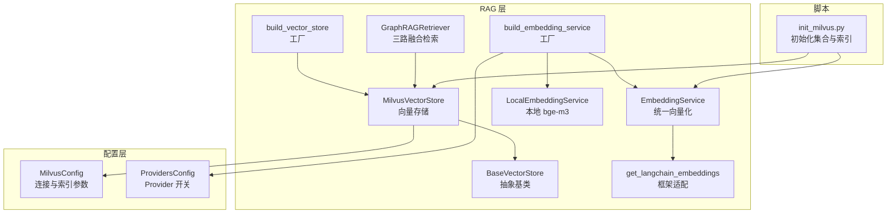
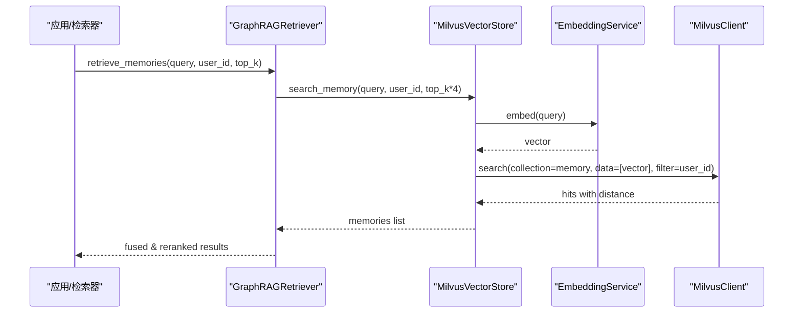
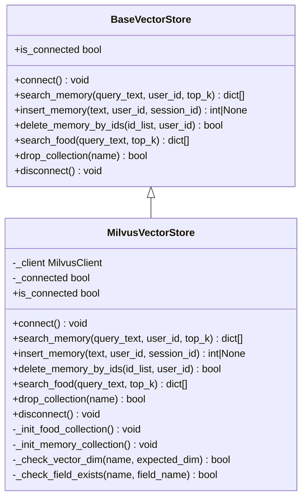
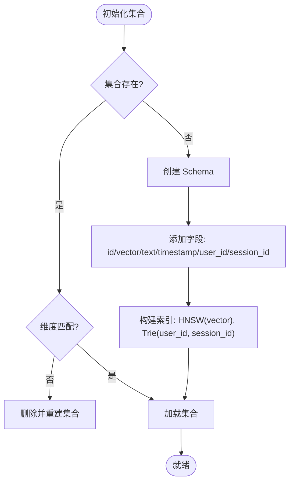
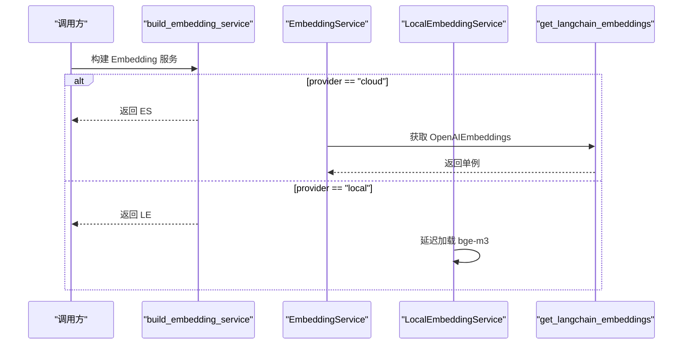
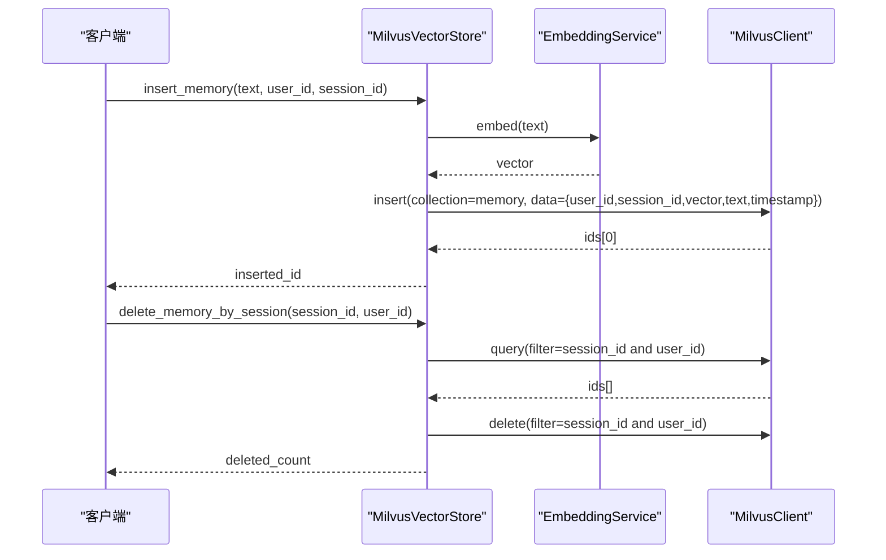
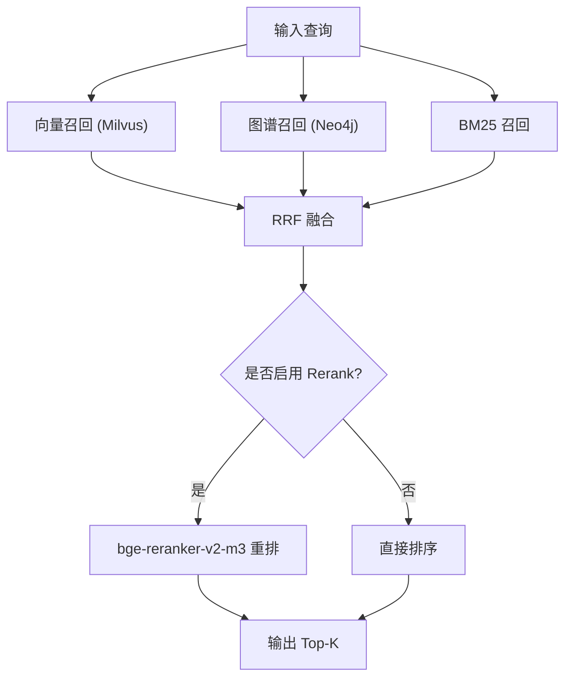
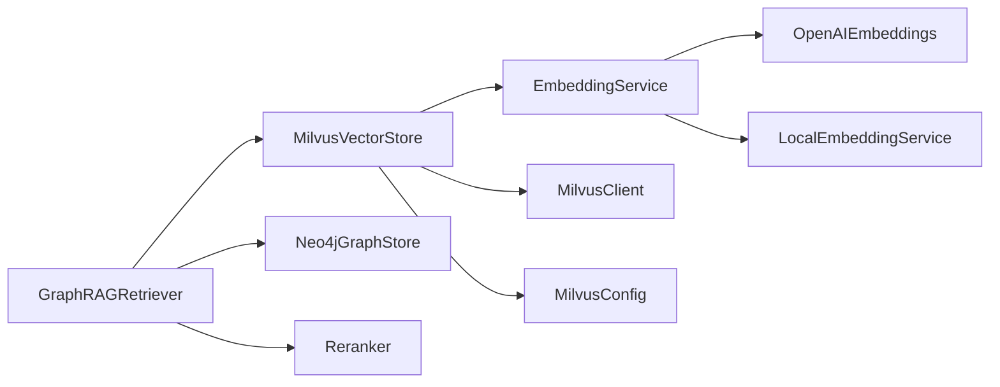

# Milvus 向量数据库

<cite>
**本文引用的文件**
- [init_milvus.py](file://backend_design/scripts/init_milvus.py)
- [vector_store.py](file://backend_design/nexus/rag/vector_store.py)
- [vector_base.py](file://backend_design/nexus/rag/vector_base.py)
- [vector_factory.py](file://backend_design/nexus/rag/vector_factory.py)
- [embedding.py](file://backend_design/nexus/rag/embedding.py)
- [embedding_factory.py](file://backend_design/nexus/rag/embedding_factory.py)
- [local_embedding.py](file://backend_design/nexus/rag/local_embedding.py)
- [retriever.py](file://backend_design/nexus/rag/retriever.py)
- [database.py](file://backend_design/nexus/config/database.py)
- [providers.py](file://backend_design/nexus/config/providers.py)
- [framework_adapters.py](file://backend_design/nexus/rag/framework_adapters.py)
</cite>

## 目录
1. [简介](#简介)
2. [项目结构](#项目结构)
3. [核心组件](#核心组件)
4. [架构总览](#架构总览)
5. [详细组件分析](#详细组件分析)
6. [依赖关系分析](#依赖关系分析)
7. [性能与内存优化](#性能与内存优化)
8. [故障排查指南](#故障排查指南)
9. [结论](#结论)
10. [附录：配置与示例](#附录配置与示例)

## 简介
本技术文档面向 NexusCockpit 中基于 Milvus 的向量数据库子系统，系统性地阐述向量数据的存储原理、索引与相似度计算策略、集合创建与参数调优、批量写入与查询过滤、嵌入模型配置与多后端支持，以及生命周期管理与性能调优。文档同时提供可操作的代码路径与流程图，帮助开发者快速上手并扩展向量存储能力。

## 项目结构
NexusCockpit 将向量检索与记忆管理集中在 RAG 模块下，通过工厂模式解耦具体实现，统一对外暴露抽象接口；Milvus 作为本地向量库，配合 Embedding 服务（本地 bge-m3 或云端 API）完成文本到向量的转换与检索。

图表来源
- [vector_store.py:36-417](file://backend_design/nexus/rag/vector_store.py#L36-L417)
- [vector_base.py:22-76](file://backend_design/nexus/rag/vector_base.py#L22-L76)
- [vector_factory.py:21-34](file://backend_design/nexus/rag/vector_factory.py#L21-L34)
- [embedding.py:23-63](file://backend_design/nexus/rag/embedding.py#L23-L63)
- [local_embedding.py:32-182](file://backend_design/nexus/rag/local_embedding.py#L32-L182)
- [embedding_factory.py:27-39](file://backend_design/nexus/rag/embedding_factory.py#L27-L39)
- [framework_adapters.py:30-67](file://backend_design/nexus/rag/framework_adapters.py#L30-L67)
- [database.py:15-28](file://backend_design/nexus/config/database.py#L15-L28)
- [providers.py:15-38](file://backend_design/nexus/config/providers.py#L15-L38)
- [init_milvus.py:21-53](file://backend_design/scripts/init_milvus.py#L21-L53)

章节来源
- [vector_store.py:1-417](file://backend_design/nexus/rag/vector_store.py#L1-L417)
- [vector_base.py:1-76](file://backend_design/nexus/rag/vector_base.py#L1-L76)
- [vector_factory.py:1-34](file://backend_design/nexus/rag/vector_factory.py#L1-L34)
- [embedding.py:1-63](file://backend_design/nexus/rag/embedding.py#L1-L63)
- [local_embedding.py:1-182](file://backend_design/nexus/rag/local_embedding.py#L1-L182)
- [embedding_factory.py:1-39](file://backend_design/nexus/rag/embedding_factory.py#L1-L39)
- [framework_adapters.py:1-67](file://backend_design/nexus/rag/framework_adapters.py#L1-L67)
- [database.py:1-61](file://backend_design/nexus/config/database.py#L1-L61)
- [providers.py:1-47](file://backend_design/nexus/config/providers.py#L1-L47)
- [init_milvus.py:1-54](file://backend_design/scripts/init_milvus.py#L1-L54)

## 核心组件
- MilvusVectorStore：封装 MilvusClient 操作，维护两个集合（食材知识库与用户记忆），负责连接、集合初始化、维度校验、索引构建、插入/删除/搜索等。
- BaseVectorStore：定义统一的向量存储抽象接口，屏蔽底层实现差异。
- build_vector_store：固定返回本地 Milvus 实例，简化上层调用。
- EmbeddingService / LocalEmbeddingService：统一向量化接口，前者委托 LangChain OpenAIEmbeddings（支持本地或云端），后者使用 sentence-transformers + bge-m3 本地推理。
- GraphRAGRetriever：三路召回（向量+图谱+BM25）+ RRF 融合 + Rerank 重排，封装检索流程。
- MilvusConfig / ProvidersConfig：集中管理 Milvus 连接、索引与 Provider 开关。
- init_milvus.py：一键初始化集合与索引，支持重建以应对 embedding 维度变化。

章节来源
- [vector_store.py:36-417](file://backend_design/nexus/rag/vector_store.py#L36-L417)
- [vector_base.py:22-76](file://backend_design/nexus/rag/vector_base.py#L22-L76)
- [vector_factory.py:21-34](file://backend_design/nexus/rag/vector_factory.py#L21-L34)
- [embedding.py:23-63](file://backend_design/nexus/rag/embedding.py#L23-L63)
- [local_embedding.py:32-182](file://backend_design/nexus/rag/local_embedding.py#L32-L182)
- [retriever.py:48-189](file://backend_design/nexus/rag/retriever.py#L48-L189)
- [database.py:15-28](file://backend_design/nexus/config/database.py#L15-L28)
- [providers.py:15-38](file://backend_design/nexus/config/providers.py#L15-L38)
- [init_milvus.py:21-53](file://backend_design/scripts/init_milvus.py#L21-L53)

## 架构总览
下图展示从应用调用到 Milvus 的完整链路：检索器调用向量存储，向量存储通过 Embedding 服务生成向量，再与 Milvus 交互进行相似度检索。

图表来源
- [retriever.py:128-140](file://backend_design/nexus/rag/retriever.py#L128-L140)
- [vector_store.py:201-231](file://backend_design/nexus/rag/vector_store.py#L201-L231)
- [embedding.py:36-44](file://backend_design/nexus/rag/embedding.py#L36-L44)

## 详细组件分析

### 向量存储抽象与实现
- BaseVectorStore 定义了 connect、search_memory、insert_memory、delete_memory_by_ids、search_food、drop_collection、disconnect、is_connected 等抽象方法，确保不同后端一致体验。
- MilvusVectorStore 基于 pymilvus 3.x MilvusClient 实现，自动检测集合维度与字段迁移，必要时重建集合；为 Food_List 与 User_Memory 分别定义 schema 与索引。

图表来源
- [vector_base.py:22-76](file://backend_design/nexus/rag/vector_base.py#L22-L76)
- [vector_store.py:36-417](file://backend_design/nexus/rag/vector_store.py#L36-L417)

章节来源
- [vector_base.py:1-76](file://backend_design/nexus/rag/vector_base.py#L1-L76)
- [vector_store.py:1-417](file://backend_design/nexus/rag/vector_store.py#L1-L417)

### 集合创建、索引与相似度算法
- 集合设计
  - Food_List：包含 item_name、category_name、cate_1..3_name 等元数据字段，用于食材知识检索。
  - User_Memory：包含 user_id、session_id、text、timestamp 等字段，支持会话级隔离与清理。
- 索引策略
  - 向量字段默认 HNSW 索引，metric_type 由配置决定（如 IP 内积）。
  - Memory 集合额外对 user_id、session_id 建立 Trie 索引，加速过滤条件查询。
- 相似度计算
  - 当前配置 metric_type=IP（内积），若需余弦相似度可改为 COSINE；欧氏距离对应 L2。
  - 搜索参数 ef 控制近似精度，M 与 efConstruction 影响索引构建质量与速度。

图表来源
- [vector_store.py:106-199](file://backend_design/nexus/rag/vector_store.py#L106-L199)
- [database.py:15-28](file://backend_design/nexus/config/database.py#L15-L28)

章节来源
- [vector_store.py:106-199](file://backend_design/nexus/rag/vector_store.py#L106-L199)
- [database.py:15-28](file://backend_design/nexus/config/database.py#L15-L28)

### 嵌入模型配置与多后端支持
- 统一接口
  - EmbeddingService：封装 langchain_openai.OpenAIEmbeddings，支持异步、批量、重试与连接池。
  - LocalEmbeddingService：基于 sentence-transformers 的 bge-m3，完全本地推理，自动 CPU/GPU/MPS 切换。
- 选择策略
  - build_embedding_service 根据 EMBEDDING_PROVIDER 选择云端或本地后端。
  - get_langchain_embeddings 全局单例缓存 OpenAIEmbeddings，避免重复初始化。

图表来源
- [embedding_factory.py:27-39](file://backend_design/nexus/rag/embedding_factory.py#L27-L39)
- [embedding.py:23-63](file://backend_design/nexus/rag/embedding.py#L23-L63)
- [local_embedding.py:32-182](file://backend_design/nexus/rag/local_embedding.py#L32-L182)
- [framework_adapters.py:30-67](file://backend_design/nexus/rag/framework_adapters.py#L30-L67)

章节来源
- [embedding.py:1-63](file://backend_design/nexus/rag/embedding.py#L1-L63)
- [local_embedding.py:1-182](file://backend_design/nexus/rag/local_embedding.py#L1-L182)
- [embedding_factory.py:1-39](file://backend_design/nexus/rag/embedding_factory.py#L1-L39)
- [framework_adapters.py:1-67](file://backend_design/nexus/rag/framework_adapters.py#L1-L67)

### 批量插入、更新删除与查询过滤
- 批量插入
  - insert_memory：单次插入一条记忆，内部调用 EmbeddingService 生成向量后写入 Milvus。
  - 批量场景建议在上层聚合多条文本后调用 embed_batch，减少网络与模型调用开销。
- 更新与删除
  - delete_memory_by_ids：按 ID 列表与 user_id 安全删除。
  - delete_memory_by_session：按 session_id（可选叠加 user_id）批量删除会话级记忆。
- 查询过滤
  - search_memory：支持 user_id 过滤，返回 text、id、user_id、timestamp 及距离分数。
  - search_food：无过滤，返回 item_name、category_name、cate_1..3_name 及距离分数。

图表来源
- [vector_store.py:233-324](file://backend_design/nexus/rag/vector_store.py#L233-L324)
- [embedding.py:36-58](file://backend_design/nexus/rag/embedding.py#L36-L58)

章节来源
- [vector_store.py:233-324](file://backend_design/nexus/rag/vector_store.py#L233-L324)
- [embedding.py:36-58](file://backend_design/nexus/rag/embedding.py#L36-L58)

### 检索流程与结果排序
- GraphRAGRetriever 整合三路召回：
  - 向量路：Milvus 语义相似度召回。
  - 图谱路：Neo4j 关系遍历召回。
  - BM25 路：全文检索召回。
- 融合策略：RRF（倒数排名融合），降低单一召回源偏差。
- 重排：可选 bge-reranker-v2-m3 对候选集重排，提升最终相关性。

图表来源
- [retriever.py:128-189](file://backend_design/nexus/rag/retriever.py#L128-L189)

章节来源
- [retriever.py:48-189](file://backend_design/nexus/rag/retriever.py#L48-L189)

## 依赖关系分析
- 组件耦合
  - VectorStore 依赖 EmbeddingService 与 MilvusClient。
  - Retrievers 依赖 VectorStore、GraphStore、Reranker。
  - Config 集中管理 Milvus 连接与索引参数。
- 外部依赖
  - pymilvus 3.x MilvusClient。
  - langchain_openai.OpenAIEmbeddings（云端或本地代理）。
  - sentence-transformers（本地 bge-m3）。
  - langchain-community.BM25Retriever（可选）。

图表来源
- [vector_store.py:36-417](file://backend_design/nexus/rag/vector_store.py#L36-L417)
- [retriever.py:48-189](file://backend_design/nexus/rag/retriever.py#L48-L189)
- [embedding.py:23-63](file://backend_design/nexus/rag/embedding.py#L23-L63)
- [local_embedding.py:32-182](file://backend_design/nexus/rag/local_embedding.py#L32-L182)
- [database.py:15-28](file://backend_design/nexus/config/database.py#L15-L28)

章节来源
- [vector_store.py:1-417](file://backend_design/nexus/rag/vector_store.py#L1-L417)
- [retriever.py:1-189](file://backend_design/nexus/rag/retriever.py#L1-L189)
- [embedding.py:1-63](file://backend_design/nexus/rag/embedding.py#L1-L63)
- [local_embedding.py:1-182](file://backend_design/nexus/rag/local_embedding.py#L1-L182)
- [database.py:1-61](file://backend_design/nexus/config/database.py#L1-L61)

## 性能与内存优化
- 索引参数调优
  - HNSW：M 与 efConstruction 影响构建质量与内存占用；ef 影响检索精度与耗时。
  - 针对高吞吐场景可适当增大 M、efConstruction，并在检索时提高 ef。
- 相似度度量选择
  - 若向量已归一化，COSINE 更稳定；当前配置为 IP，注意向量尺度影响。
- 批量向量化
  - 使用 embed_batch 减少模型调用次数，提升吞吐。
- 连接与资源管理
  - 复用 MilvusClient 与 EmbeddingService 单例，避免频繁创建销毁。
  - 合理设置 timeout 与 max_retries，增强稳定性。
- 内存优化
  - 控制 text 长度（如截断至 1000 字符），减少向量与元数据大小。
  - 定期清理会话级记忆，避免长期增长。

章节来源
- [database.py:15-28](file://backend_design/nexus/config/database.py#L15-L28)
- [embedding.py:50-58](file://backend_design/nexus/rag/embedding.py#L50-L58)
- [vector_store.py:132-199](file://backend_design/nexus/rag/vector_store.py#L132-L199)

## 故障排查指南
- 连接失败
  - 检查 Milvus URI、端口与网络连通性；查看日志中的连接错误信息。
- 维度不匹配
  - 当 embedding 模型变更导致维度变化时，集合会被自动重建；若未触发重建，可使用 --rebuild 强制重建。
- 字段缺失
  - Memory 集合缺少 session_id 字段时会触发重建；确认 schema 一致性。
- 检索结果为空
  - 检查向量生成是否成功；确认 user_id 过滤表达式正确；验证索引是否加载。
- 删除失败
  - 确认 filter 表达式语法正确；检查 user_id 与 session_id 权限边界。

章节来源
- [init_milvus.py:21-53](file://backend_design/scripts/init_milvus.py#L21-L53)
- [vector_store.py:59-104](file://backend_design/nexus/rag/vector_store.py#L59-L104)
- [vector_store.py:264-324](file://backend_design/nexus/rag/vector_store.py#L264-L324)

## 结论
NexusCockpit 的 Milvus 向量子系统通过清晰的抽象与工厂模式，实现了可扩展、可替换的向量存储与检索能力。结合本地与云端 Embedding 后端，既满足隐私与成本需求，又保持高性能检索。合理的索引与参数调优、严格的集合生命周期管理，以及三路召回融合策略，共同保障了系统的准确性与稳定性。

## 附录：配置与示例
- 关键配置项
  - MilvusConfig：host/port/uri、collection 名称、index_type/metric_type/index_params/search_params。
  - ProvidersConfig：vector_store/graph_store/cache/reranker/checkpoint 的 Provider 开关。
  - Embedding：EMBEDDING_PROVIDER=local 或 cloud；本地模型路径 models/embedding/bge-m3。
- 初始化命令
  - python -m scripts.init_milvus：创建集合与索引（已存在则跳过）。
  - python -m scripts.init_milvus --rebuild：先删除再重建（切换 embedding 维度时用）。
- 典型用法路径
  - 向量检索：retriever.retrieve_memories / retriever.retrieve_food。
  - 插入记忆：vector_store.insert_memory。
  - 删除记忆：vector_store.delete_memory_by_ids / delete_memory_by_session。
  - 获取 LangChain 实例：vector_store.as_langchain_store（适用于通用知识库集合）。

章节来源
- [database.py:15-28](file://backend_design/nexus/config/database.py#L15-L28)
- [providers.py:15-38](file://backend_design/nexus/config/providers.py#L15-L38)
- [init_milvus.py:21-53](file://backend_design/scripts/init_milvus.py#L21-L53)
- [retriever.py:128-189](file://backend_design/nexus/rag/retriever.py#L128-L189)
- [vector_store.py:360-390](file://backend_design/nexus/rag/vector_store.py#L360-L390)