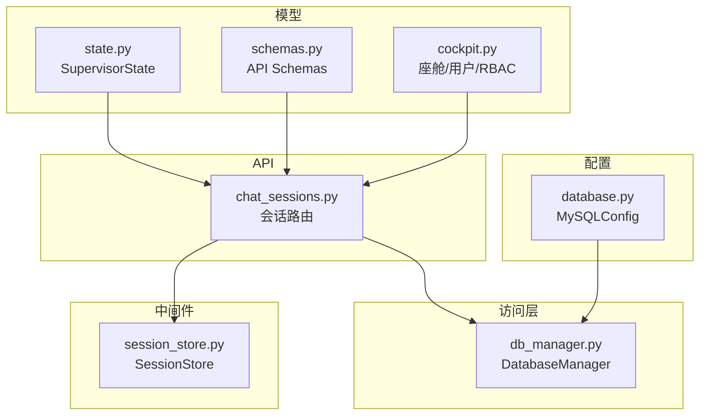
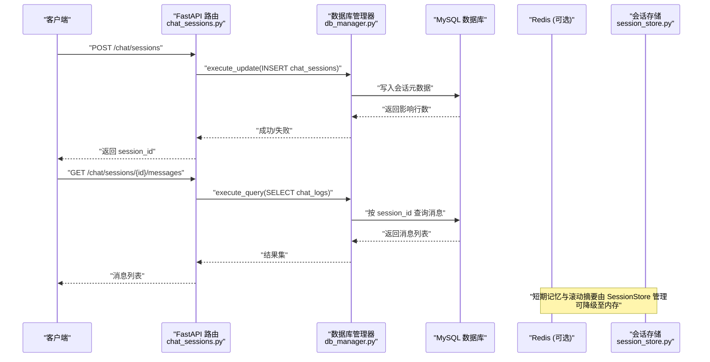
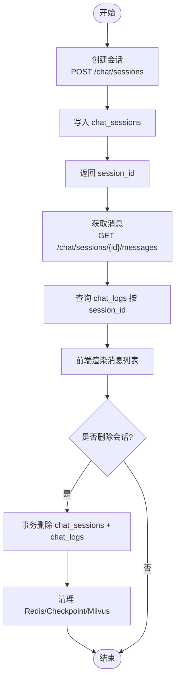
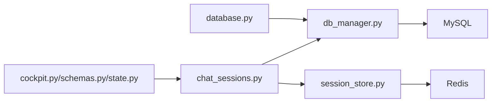

# MySQL 关系型数据库

<cite>
**本文引用的文件**   
- [database.py](file://backend_design/nexus/config/database.py)
- [db_manager.py](file://backend_design/nexus/core/db_manager.py)
- [v2.1_migration.sql](file://backend_design/scripts/v2.1_migration.sql)
- [chat_sessions.py](file://backend_design/nexus/api/routes/chat_sessions.py)
- [session_store.py](file://backend_design/nexus/middleware/session_store.py)
- [cockpit.py](file://backend_design/nexus/models/cockpit.py)
- [schemas.py](file://backend_design/nexus/models/schemas.py)
- [state.py](file://backend_design/nexus/models/state.py)
</cite>

## 目录
1. [简介](#简介)
2. [项目结构](#项目结构)
3. [核心组件](#核心组件)
4. [架构总览](#架构总览)
5. [详细组件分析](#详细组件分析)
6. [依赖关系分析](#依赖关系分析)
7. [性能考虑](#性能考虑)
8. [故障排查指南](#故障排查指南)
9. [结论](#结论)
10. [附录](#附录)

## 简介
本技术文档面向 NexusCockpit 的 MySQL 关系型数据库子系统，聚焦以下目标：
- 全面梳理数据表结构设计（用户、会话、记忆、车控状态等核心实体）
- 详细说明字段定义、数据类型选择、约束与索引策略
- 阐述 ORM/访问层实现、查询优化与事务管理
- 提供数据迁移脚本使用方法与版本管理策略
- 给出复杂关联查询示例与性能优化技巧
- 覆盖数据安全策略、访问权限控制与审计日志记录
- 为开发者提供扩展指南与常见问题排查方法

## 项目结构
MySQL 相关代码主要分布在配置、访问层、API 路由、中间件与模型定义中：
- 配置层：数据库连接参数与 URL 生成
- 访问层：统一数据库管理器（连接池、自动建表/迁移、CRUD）
- API 路由：多会话管理接口（创建、删除、消息读取）
- 中间件：会话历史持久化（Redis + 内存降级）
- 模型：Pydantic 请求/响应与共享状态定义

图表来源
- [database.py:42-61](file://backend_design/nexus/config/database.py#L42-L61)
- [db_manager.py:40-104](file://backend_design/nexus/core/db_manager.py#L40-L104)
- [chat_sessions.py:1-50](file://backend_design/nexus/api/routes/chat_sessions.py#L1-L50)
- [session_store.py:1-60](file://backend_design/nexus/middleware/session_store.py#L1-L60)
- [cockpit.py:137-214](file://backend_design/nexus/models/cockpit.py#L137-L214)
- [schemas.py:19-88](file://backend_design/nexus/models/schemas.py#L19-L88)
- [state.py:38-107](file://backend_design/nexus/models/state.py#L38-L107)

章节来源
- [database.py:42-61](file://backend_design/nexus/config/database.py#L42-L61)
- [db_manager.py:40-104](file://backend_design/nexus/core/db_manager.py#L40-L104)
- [chat_sessions.py:1-50](file://backend_design/nexus/api/routes/chat_sessions.py#L1-L50)
- [session_store.py:1-60](file://backend_design/nexus/middleware/session_store.py#L1-L60)
- [cockpit.py:137-214](file://backend_design/nexus/models/cockpit.py#L137-L214)
- [schemas.py:19-88](file://backend_design/nexus/models/schemas.py#L19-L88)
- [state.py:38-107](file://backend_design/nexus/models/state.py#L38-L107)

## 核心组件
- 数据库配置（MySQLConfig）：集中管理主机、端口、用户、密码、库名，并生成 aiomysql 连接 URL。
- 数据库管理器（DatabaseManager）：封装连接池、自动建表/迁移、默认数据初始化、常用 CRUD 操作（用户、对话历史、审计日志、LLM 成本追踪、用户习惯等）。
- 会话路由（Chat Sessions）：提供多会话管理的 REST 接口，包含创建、列表、删除、消息读取与一致性自检。
- 会话存储（SessionStore）：基于 Redis 的短期记忆与滚动摘要持久化，支持内存降级。
- 模型（Pydantic）：定义 API 请求/响应结构与多智能体共享状态，确保类型安全与文档自动生成。

章节来源
- [database.py:42-61](file://backend_design/nexus/config/database.py#L42-L61)
- [db_manager.py:40-104](file://backend_design/nexus/core/db_manager.py#L40-L104)
- [chat_sessions.py:58-135](file://backend_design/nexus/api/routes/chat_sessions.py#L58-L135)
- [session_store.py:43-110](file://backend_design/nexus/middleware/session_store.py#L43-L110)
- [cockpit.py:137-214](file://backend_design/nexus/models/cockpit.py#L137-L214)
- [schemas.py:19-88](file://backend_design/nexus/models/schemas.py#L19-L88)
- [state.py:38-107](file://backend_design/nexus/models/state.py#L38-L107)

## 架构总览
下图展示从 API 到 MySQL 的数据流与关键组件交互：

图表来源
- [chat_sessions.py:107-135](file://backend_design/nexus/api/routes/chat_sessions.py#L107-L135)
- [chat_sessions.py:327-373](file://backend_design/nexus/api/routes/chat_sessions.py#L327-L373)
- [db_manager.py:895-925](file://backend_design/nexus/core/db_manager.py#L895-L925)
- [session_store.py:91-110](file://backend_design/nexus/middleware/session_store.py#L91-L110)

## 详细组件分析

### 数据表结构与字段设计
- 座舱表 cockpits：主键 cockpit_id，名称、绑定用户、适配器、主题色、活跃标记、时间戳；索引 idx_active。
- 用户表 users：主键 user_id，用户名、密码哈希、cockpit_id（外键）、角色枚举（RBAC 四级）、时间戳；索引 idx_cockpit、idx_role。
- 对话历史表 chat_history：自增 id，cockpit_id、user_id、session_id、输入/回复、意图、专家参与 JSON、延迟、缓存命中、时间戳；复合索引 idx_cockpit_time、idx_user_time、idx_session。
- 座舱统计表 cockpit_stats：分钟级聚合指标（聊天数、车控命令数、缓存命中/未命中、平均/分位延迟、错误数），索引 idx_cockpit_time。
- SubAgent/MainAgent 日志表：巡检与确认日志，JSON 字段记录判断与决策轨迹，索引 idx_cockpit_time。
- 审计日志表 audit_logs：操作审计（cockpit_id、user_id、action、detail JSON、IP、时间），索引 idx_cockpit_time、idx_user_time。
- 用户反馈表 agent_feedback：正向/负向反馈与评论，外键关联 mainagent_logs。
- LLM 成本追踪表 llm_cost_tracking：请求类型、模型名、token 计数、成本（DECIMAL），索引 idx_cockpit_time、idx_type_time。
- 声纹注册表 voiceprint_enrollments：注册进度与完成状态，唯一键 uk_cockpit_user。
- 会话表 chat_sessions：会话元数据（session_id 唯一、cockpit_id、user_id、标题、消息数、时间戳），索引 idx_cockpit_time、idx_user。
- 聊天日志表 chat_logs：用户提问与 AI 回复双写，意图/动作、延迟、缓存命中、时间戳，索引 idx_cockpit_user、idx_cockpit_time、idx_session。
- 用户习惯表 user_habits：偏好键值对、命中次数、最后使用时间，唯一键 uk_user_cockpit_habit，索引 idx_user、idx_cockpit。

章节来源
- [v2.1_migration.sql:21-178](file://backend_design/scripts/v2.1_migration.sql#L21-L178)
- [v2.1_migration.sql:274-301](file://backend_design/scripts/v2.1_migration.sql#L274-L301)
- [v2.1_migration.sql:321-332](file://backend_design/scripts/v2.1_migration.sql#L321-L332)
- [db_manager.py:111-319](file://backend_design/nexus/core/db_manager.py#L111-L319)

### 索引策略与查询优化
- 高频过滤字段建立索引：cockpit_id、user_id、created_at、last_message_at、role、session_id。
- 复合索引用于范围查询与时序排序：idx_cockpit_time、idx_user_time、idx_cockpit_user。
- 使用 EXPLAIN 验证索引命中，避免全表扫描；对大文本字段（TEXT/JSON）避免在 WHERE 中直接比较。
- 统计类查询采用预聚合表（cockpit_stats）减少实时计算开销。
- 会话消息查询按 created_at ASC 正序返回，便于前端渲染。

章节来源
- [v2.1_migration.sql:54-86](file://backend_design/scripts/v2.1_migration.sql#L54-L86)
- [v2.1_migration.sql:274-301](file://backend_design/scripts/v2.1_migration.sql#L274-L301)
- [chat_sessions.py:327-373](file://backend_design/nexus/api/routes/chat_sessions.py#L327-L373)

### ORM 映射与访问层
- 本项目未使用传统 ORM，而是通过 DatabaseManager 封装 aiomysql 异步驱动，提供统一的 execute_query/execute_update 方法与领域方法（如 insert_chat_history、insert_audit_log）。
- 所有 SQL 使用参数化查询，防止注入；JSON 字段通过 json.dumps 序列化。
- 连接池配置：minsize=2、maxsize=10，autocommit=True，字符集 utf8mb4。
- 自动建表与默认数据初始化在 connect() 时执行，保证服务启动即就绪。

章节来源
- [db_manager.py:56-85](file://backend_design/nexus/core/db_manager.py#L56-L85)
- [db_manager.py:895-925](file://backend_design/nexus/core/db_manager.py#L895-L925)
- [db_manager.py:818-857](file://backend_design/nexus/core/db_manager.py#L818-L857)
- [database.py:42-61](file://backend_design/nexus/config/database.py#L42-L61)

### 事务管理与一致性
- 会话删除使用事务保障原子性：先删 chat_sessions，再删 chat_logs，成功后提交。
- 异常回滚：任一步骤失败则中止，避免部分删除导致不一致。
- 一致性自检接口提供跨存储层（MySQL、Redis、LangGraph checkpoint、Milvus）的孤儿数据检测与建议修复语句。

章节来源
- [chat_sessions.py:189-211](file://backend_design/nexus/api/routes/chat_sessions.py#L189-L211)
- [chat_sessions.py:404-533](file://backend_design/nexus/api/routes/chat_sessions.py#L404-L533)

### 数据安全与访问控制
- RBAC 四级角色：super_admin、cockpit_admin、cockpit_user、cockpit_viewer，权限标识与检查函数在模型中定义。
- 用户密码以哈希形式存储（password_hash），禁止明文。
- 审计日志记录关键操作（cockpit_id、user_id、action、detail、IP），便于合规与溯源。
- 会话删除仅清理会话级资源，保留用户级记忆与习惯，避免误删共享数据。

章节来源
- [cockpit.py:167-214](file://backend_design/nexus/models/cockpit.py#L167-L214)
- [v2.1_migration.sql:38-49](file://backend_design/scripts/v2.1_migration.sql#L38-L49)
- [db_manager.py:529-570](file://backend_design/nexus/core/db_manager.py#L529-L570)

### 数据迁移与版本管理
- v2.1_migration.sql 包含新增表、遗留表安全升级（存储过程 safe_add_column/safe_add_index）、默认数据插入与中文用户名修复。
- 建议将迁移脚本纳入版本控制，按语义化版本号发布；生产环境执行前备份数据库。
- DatabaseManager 在启动时再次校验表结构，确保向后兼容。

章节来源
- [v2.1_migration.sql:1-12](file://backend_design/scripts/v2.1_migration.sql#L1-L12)
- [v2.1_migration.sql:185-246](file://backend_design/scripts/v2.1_migration.sql#L185-L246)
- [db_manager.py:86-104](file://backend_design/nexus/core/db_manager.py#L86-L104)

### 复杂关联查询示例
- 获取某座舱最近 N 条对话历史（按用户筛选）：
  - SELECT * FROM chat_history WHERE cockpit_id = ? AND user_id = ? ORDER BY created_at DESC LIMIT ?
- 获取某会话的消息记录（正序）：
  - SELECT user_input, assistant_response, intent, action, latency_ms, cache_hit, created_at FROM chat_logs WHERE session_id = ? AND cockpit_id = ? ORDER BY created_at ASC
- 统计座舱使用指标（分钟级聚合）：
  - SELECT SUM(chat_count), SUM(vehicle_cmd_count), AVG(avg_latency_ms) FROM cockpit_stats WHERE cockpit_id = ? AND stat_time >= DATE_SUB(NOW(), INTERVAL ? HOUR) GROUP BY cockpit_id

章节来源
- [db_manager.py:859-889](file://backend_design/nexus/core/db_manager.py#L859-L889)
- [chat_sessions.py:327-373](file://backend_design/nexus/api/routes/chat_sessions.py#L327-L373)
- [v2.1_migration.sql:74-86](file://backend_design/scripts/v2.1_migration.sql#L74-L86)

### 多会话管理流程

图表来源
- [chat_sessions.py:107-135](file://backend_design/nexus/api/routes/chat_sessions.py#L107-L135)
- [chat_sessions.py:327-373](file://backend_design/nexus/api/routes/chat_sessions.py#L327-L373)
- [chat_sessions.py:189-211](file://backend_design/nexus/api/routes/chat_sessions.py#L189-L211)

## 依赖关系分析
- 配置依赖：MySQLConfig 提供连接参数与 URL。
- 访问层依赖：DatabaseManager 依赖 aiomysql 与配置模块。
- API 依赖：chat_sessions 路由依赖 DatabaseManager 与 SessionStore。
- 中间件依赖：SessionStore 依赖 Redis（可降级内存）。
- 模型依赖：Pydantic 模型被 API 路由用于请求/响应校验与文档生成。

图表来源
- [database.py:42-61](file://backend_design/nexus/config/database.py#L42-L61)
- [db_manager.py:40-104](file://backend_design/nexus/core/db_manager.py#L40-L104)
- [chat_sessions.py:1-50](file://backend_design/nexus/api/routes/chat_sessions.py#L1-L50)
- [session_store.py:1-60](file://backend_design/nexus/middleware/session_store.py#L1-L60)
- [cockpit.py:137-214](file://backend_design/nexus/models/cockpit.py#L137-L214)
- [schemas.py:19-88](file://backend_design/nexus/models/schemas.py#L19-L88)
- [state.py:38-107](file://backend_design/nexus/models/state.py#L38-L107)

章节来源
- [database.py:42-61](file://backend_design/nexus/config/database.py#L42-L61)
- [db_manager.py:40-104](file://backend_design/nexus/core/db_manager.py#L40-L104)
- [chat_sessions.py:1-50](file://backend_design/nexus/api/routes/chat_sessions.py#L1-L50)
- [session_store.py:1-60](file://backend_design/nexus/middleware/session_store.py#L1-L60)
- [cockpit.py:137-214](file://backend_design/nexus/models/cockpit.py#L137-L214)
- [schemas.py:19-88](file://backend_design/nexus/models/schemas.py#L19-L88)
- [state.py:38-107](file://backend_design/nexus/models/state.py#L38-L107)

## 性能考虑
- 连接池大小根据并发调整（当前 minsize=2、maxsize=10），高并发场景可适当增大。
- 使用复合索引与预聚合表降低查询复杂度。
- 会话历史与摘要通过 Redis 持久化，缩短 I/O 路径；TTL 自动过期避免数据膨胀。
- 大对象（TEXT/JSON）避免频繁更新，必要时拆分或归档。
- 监控慢查询与索引缺失，定期优化。

[本节为通用指导，不直接分析具体文件]

## 故障排查指南
- 连接失败：检查 MySQLConfig 参数与服务可用性；查看 DatabaseManager.connect 日志。
- 建表失败：确认 v2.1_migration.sql 执行成功；DatabaseManager._auto_migrate_tables 会二次校验。
- 会话删除不一致：使用一致性自检接口定位孤儿数据；按建议 SQL 修复。
- 中文乱码：确保字符集 utf8mb4；DatabaseManager._auto_fix_chinese_usernames 会自动修复。
- Redis 不可用：SessionStore 自动降级内存；检查 Redis 连接与 TTL 配置。

章节来源
- [db_manager.py:56-85](file://backend_design/nexus/core/db_manager.py#L56-L85)
- [db_manager.py:86-104](file://backend_design/nexus/core/db_manager.py#L86-L104)
- [chat_sessions.py:404-533](file://backend_design/nexus/api/routes/chat_sessions.py#L404-L533)
- [session_store.py:69-81](file://backend_design/nexus/middleware/session_store.py#L69-L81)

## 结论
NexusCockpit 的 MySQL 子系统通过清晰的表结构、完善的索引策略、稳健的访问层与迁移机制，支撑了多租户座舱、多会话对话、审计与成本追踪等核心能力。结合 Redis 短期记忆与一致性自检，系统在可用性与一致性之间取得良好平衡。建议在生产环境中持续监控性能与数据一致性，并按需扩展表结构与查询逻辑。

[本节为总结，不直接分析具体文件]

## 附录
- 扩展指南：新增表时同步更新 v2.1_migration.sql 与 DatabaseManager._auto_migrate_tables；保持字符集与索引命名规范。
- 常见 SQL 模式：参数化查询、JSON 字段序列化、ON DUPLICATE KEY UPDATE 的 AS new 语法。
- 权限与审计：在关键操作前后调用 insert_audit_log，记录 cockpit_id、user_id、action、detail、ip_address。

[本节为补充信息，不直接分析具体文件]