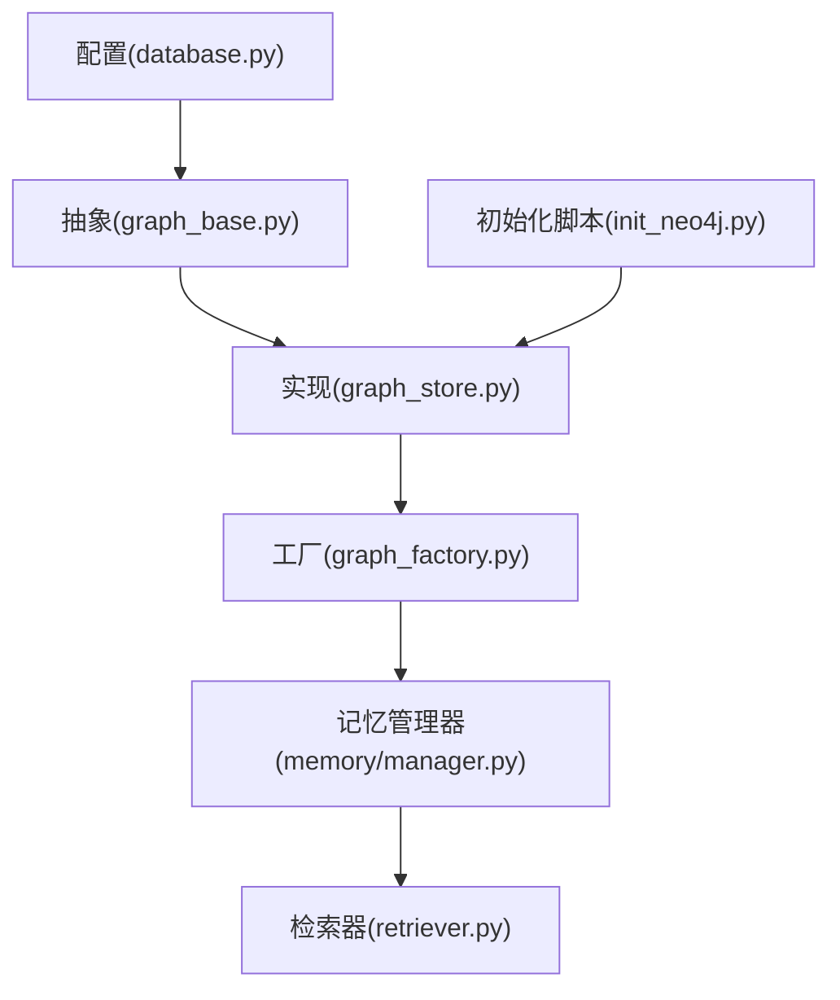
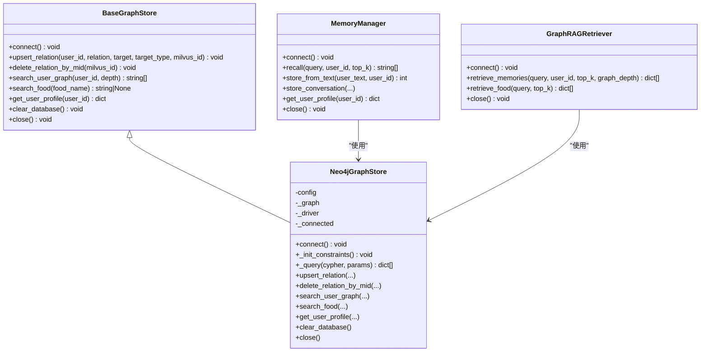
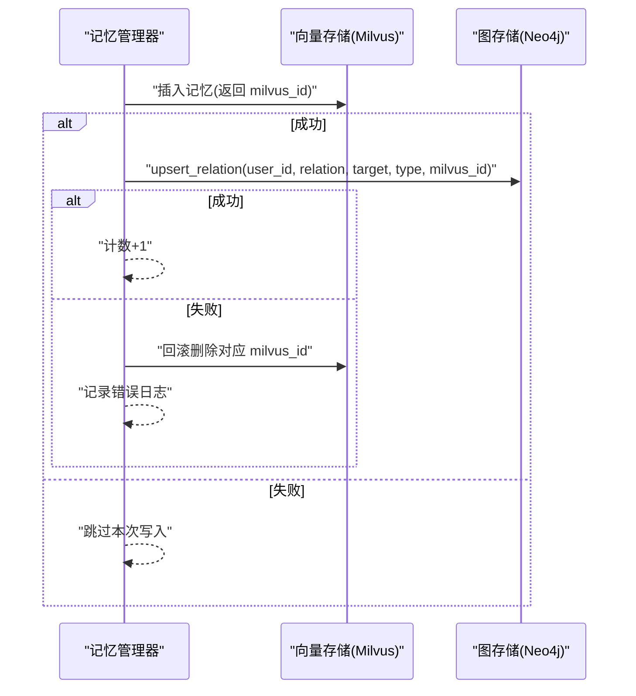
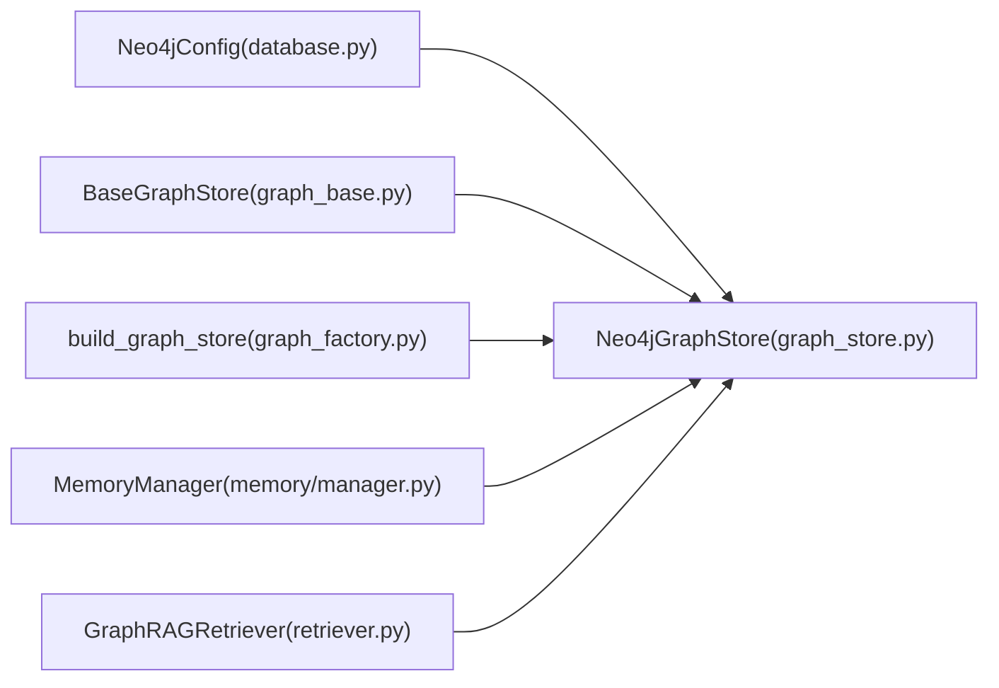

# Neo4j 图数据库

<cite>
**本文引用的文件**   
- [backend_design/scripts/init_neo4j.py](file://backend_design/scripts/init_neo4j.py)
- [backend_design/nexus/config/database.py](file://backend_design/nexus/config/database.py)
- [backend_design/nexus/rag/graph_store.py](file://backend_design/nexus/rag/graph_store.py)
- [backend_design/nexus/rag/graph_factory.py](file://backend_design/nexus/rag/graph_factory.py)
- [backend_design/nexus/rag/graph_base.py](file://backend_design/nexus/rag/graph_base.py)
- [backend_design/nexus/memory/manager.py](file://backend_design/nexus/memory/manager.py)
- [backend_design/nexus/rag/retriever.py](file://backend_design/nexus/rag/retriever.py)
</cite>

## 目录
1. [简介](#简介)
2. [项目结构](#项目结构)
3. [核心组件](#核心组件)
4. [架构总览](#架构总览)
5. [详细组件分析](#详细组件分析)
6. [依赖关系分析](#依赖关系分析)
7. [性能与优化](#性能与优化)
8. [故障排查指南](#故障排查指南)
9. [结论](#结论)
10. [附录：Cypher 查询示例与建模指南](#附录cypher-查询示例与建模指南)

## 简介
本技术文档围绕 NexusCockpit 中的 Neo4j 图数据库子系统，系统阐述图数据模型设计、Cypher 查询使用、导入导出与批量操作、事务与一致性策略、知识图谱构建与维护（含动态更新与版本管理）、以及性能优化与索引策略。文档面向开发者与运维人员，既提供高层架构视图，也给出代码级实现细节与可操作的查询模式。

## 项目结构
Neo4j 相关能力集中在后端 Python 模块中，通过统一的抽象接口与工厂模式进行实例化与管理，并由初始化脚本完成约束与索引的创建。关键路径如下：
- 配置：数据库连接参数集中定义
- 抽象与实现：统一图谱存储抽象接口 + Neo4j 具体实现
- 工厂：固定本地 Neo4j 实例构建
- 记忆管理器：将向量库与图数据库协同写入与检索
- 检索器：三路融合（向量+图谱+BM25）并执行 RRF 融合与重排
- 初始化脚本：创建约束与索引

**图表来源** 
- [backend_design/nexus/config/database.py:32-39](file://backend_design/nexus/config/database.py#L32-L39)
- [backend_design/nexus/rag/graph_base.py:17-61](file://backend_design/nexus/rag/graph_base.py#L17-L61)
- [backend_design/nexus/rag/graph_store.py:26-68](file://backend_design/nexus/rag/graph_store.py#L26-L68)
- [backend_design/nexus/rag/graph_factory.py:20-27](file://backend_design/nexus/rag/graph_factory.py#L20-L27)
- [backend_design/nexus/memory/manager.py:85-96](file://backend_design/nexus/memory/manager.py#L85-L96)
- [backend_design/nexus/rag/retriever.py:83-87](file://backend_design/nexus/rag/retriever.py#L83-L87)
- [backend_design/scripts/init_neo4j.py:18-34](file://backend_design/scripts/init_neo4j.py#L18-L34)

**章节来源**
- [backend_design/nexus/config/database.py:32-39](file://backend_design/nexus/config/database.py#L32-L39)
- [backend_design/nexus/rag/graph_base.py:17-61](file://backend_design/nexus/rag/graph_base.py#L17-L61)
- [backend_design/nexus/rag/graph_store.py:26-68](file://backend_design/nexus/rag/graph_store.py#L26-L68)
- [backend_design/nexus/rag/graph_factory.py:20-27](file://backend_design/nexus/rag/graph_factory.py#L20-L27)
- [backend_design/nexus/memory/manager.py:85-96](file://backend_design/nexus/memory/manager.py#L85-L96)
- [backend_design/nexus/rag/retriever.py:83-87](file://backend_design/nexus/rag/retriever.py#L83-L87)
- [backend_design/scripts/init_neo4j.py:18-34](file://backend_design/scripts/init_neo4j.py#L18-L34)

## 核心组件
- 配置层：Neo4j 连接参数（URI、用户名、密码）集中管理，便于环境切换与容器化部署。
- 抽象层：BaseGraphStore 定义统一接口（连接、关系增删、用户图谱查询、食材搜索、画像获取、清库、关闭）。
- 实现层：Neo4jGraphStore 基于 langchain_neo4j.Neo4jGraph 封装连接池、Cypher 执行与 schema 刷新，内部维护约束与索引。
- 工厂层：build_graph_store 固定返回本地 Neo4j 实例，简化调用方逻辑。
- 集成层：MemoryManager 协调 Milvus 与 Neo4j 的双写一致性与回滚补偿；GraphRAGRetriever 负责三路召回与融合排序。
- 初始化层：init_neo4j.py 在启动时创建唯一性约束与名称索引，确保查询性能与数据完整性。

**章节来源**
- [backend_design/nexus/config/database.py:32-39](file://backend_design/nexus/config/database.py#L32-L39)
- [backend_design/nexus/rag/graph_base.py:17-61](file://backend_design/nexus/rag/graph_base.py#L17-L61)
- [backend_design/nexus/rag/graph_store.py:26-68](file://backend_design/nexus/rag/graph_store.py#L26-L68)
- [backend_design/nexus/rag/graph_factory.py:20-27](file://backend_design/nexus/rag/graph_factory.py#L20-L27)
- [backend_design/nexus/memory/manager.py:85-96](file://backend_design/nexus/memory/manager.py#L85-L96)
- [backend_design/scripts/init_neo4j.py:18-34](file://backend_design/scripts/init_neo4j.py#L18-L34)

## 架构总览
下图展示从配置到实现的完整链路，以及记忆管理与检索器如何调用图存储。

**图表来源** 
- [backend_design/nexus/rag/graph_base.py:17-61](file://backend_design/nexus/rag/graph_base.py#L17-L61)
- [backend_design/nexus/rag/graph_store.py:26-184](file://backend_design/nexus/rag/graph_store.py#L26-L184)
- [backend_design/nexus/memory/manager.py:85-96](file://backend_design/nexus/memory/manager.py#L85-L96)
- [backend_design/nexus/rag/retriever.py:83-87](file://backend_design/nexus/rag/retriever.py#L83-L87)

## 详细组件分析

### 图数据模型设计
- 节点类型
  - User：用户节点，主键为 id（唯一约束）
  - Entity：通用实体节点，name 字段建立索引以支持快速匹配
  - Food：食材节点，name 用于精确或模糊匹配
- 关系定义
  - 关系方向：User -> Target（例如 LIKES、ALLERGY、LIKES 等），关系上绑定 mid（Milvus ID）与 timestamp（时间戳）
- 属性结构
  - User.id：唯一标识
  - Entity.name / Food.name：名称字段
  - 关系属性：mid（与向量库关联的外键）、timestamp（事件时间）

该模型支撑“用户偏好/禁忌”、“食材匹配”、“关系遍历”等典型场景。

**章节来源**
- [backend_design/nexus/rag/graph_store.py:60-68](file://backend_design/nexus/rag/graph_store.py#L60-L68)
- [backend_design/nexus/rag/graph_store.py:73-89](file://backend_design/nexus/rag/graph_store.py#L73-L89)
- [backend_design/nexus/rag/graph_store.py:134-144](file://backend_design/nexus/rag/graph_store.py#L134-L144)

### Cypher 查询语言使用
- 节点与关系创建/更新
  - MERGE (u:User {id: $user_id})
  - MERGE (t:{target_type} {name: $target})
  - MERGE (u)-[r:{relation.upper()}]->(t) SET r.mid = $milvus_id, r.timestamp = timestamp()
- 删除关系
  - MATCH (u:User)-[r]->(t) WHERE r.mid = $milvus_id DELETE r
- 深度关系查询
  - MATCH path = (u:User {id: $user_id})-[r*1..{depth}]->(t) RETURN ...
- 食材搜索
  - MATCH (f:Food {name: $name}) RETURN f.name as name LIMIT 1
- 用户画像聚合
  - MATCH (u:User {id: $user_id})-[r]->(t) RETURN type(r), t.name, labels(t), coalesce(r.mid, -1)

上述查询被封装在 Neo4jGraphStore 的方法中，供上层调用。

**章节来源**
- [backend_design/nexus/rag/graph_store.py:73-89](file://backend_design/nexus/rag/graph_store.py#L73-L89)
- [backend_design/nexus/rag/graph_store.py:91-101](file://backend_design/nexus/rag/graph_store.py#L91-L101)
- [backend_design/nexus/rag/graph_store.py:102-132](file://backend_design/nexus/rag/graph_store.py#L102-L132)
- [backend_design/nexus/rag/graph_store.py:134-144](file://backend_design/nexus/rag/graph_store.py#L134-L144)
- [backend_design/nexus/rag/graph_store.py:146-166](file://backend_design/nexus/rag/graph_store.py#L146-L166)

### 导入导出、批量操作与事务处理
- 导入与初始化
  - 通过 init_neo4j.py 运行约束与索引创建，保证后续写入与查询性能
- 批量操作
  - upsert_relation 单次写入一条关系；如需批量，可在应用层循环调用或使用批量 Cypher（当前实现未暴露批量接口）
- 事务与一致性
  - 记忆管理器在双向写入（Milvus + Neo4j）失败时进行补偿回滚，确保向量与图谱数据一致性
  - 图数据库侧使用 MERGE 原子性保证幂等写入

**图表来源** 
- [backend_design/nexus/memory/manager.py:278-296](file://backend_design/nexus/memory/manager.py#L278-L296)
- [backend_design/nexus/rag/graph_store.py:73-89](file://backend_design/nexus/rag/graph_store.py#L73-L89)

**章节来源**
- [backend_design/scripts/init_neo4j.py:18-34](file://backend_design/scripts/init_neo4j.py#L18-L34)
- [backend_design/nexus/memory/manager.py:278-296](file://backend_design/nexus/memory/manager.py#L278-L296)
- [backend_design/nexus/rag/graph_store.py:73-89](file://backend_design/nexus/rag/graph_store.py#L73-L89)

### 知识图谱构建与维护策略
- 构建流程
  - LLM 提取三元组（主体-关系-客体）→ 冲突检测 → 双向写入（Milvus + Neo4j）
- 动态更新
  - 新事实写入前进行相似度与冲突判定，必要时删除旧记录再写入新记录
- 版本管理
  - 通过 timestamp 记录关系更新时间；结合 session_id 清理会话级向量，保持图谱与向量的一致性
- 健康检查与清库
  - 提供 clear_database 方法（仅开发环境使用），重置约束与索引

**章节来源**
- [backend_design/nexus/memory/manager.py:212-300](file://backend_design/nexus/memory/manager.py#L212-L300)
- [backend_design/nexus/rag/graph_store.py:168-177](file://backend_design/nexus/rag/graph_store.py#L168-L177)

### 实际 Cypher 查询示例（路径查找、子图提取、聚合分析）
- 路径查找（N 阶关系）
  - MATCH path = (u:User {id: $user_id})-[r*1..{depth}]->(t) RETURN [rel in relationships(path) | type(rel)] as relations, [node in nodes(path) | coalesce(node.name, node.id)] as nodes
- 子图提取（直接邻居）
  - MATCH (u:User {id: $user_id})-[r]->(t) RETURN type(r) as relation, t.name as target, labels(t) as labels
- 聚合分析（用户画像）
  - MATCH (u:User {id: $user_id})-[r]->(t) RETURN type(r) as relation, t.name as target, labels(t) as labels, coalesce(r.mid, -1) as mid

这些查询被封装在 search_user_graph 与 get_user_profile 中，供检索与画像服务调用。

**章节来源**
- [backend_design/nexus/rag/graph_store.py:102-132](file://backend_design/nexus/rag/graph_store.py#L102-L132)
- [backend_design/nexus/rag/graph_store.py:146-166](file://backend_design/nexus/rag/graph_store.py#L146-L166)

## 依赖关系分析
- 配置依赖：Neo4jConfig 提供 URI、用户名、密码
- 抽象依赖：BaseGraphStore 定义统一接口
- 实现依赖：Neo4jGraphStore 使用 langchain_neo4j.Neo4jGraph 管理连接与查询
- 工厂依赖：build_graph_store 固定返回 Neo4jGraphStore
- 业务依赖：MemoryManager 与 GraphRAGRetriever 依赖图存储进行写入与检索

**图表来源** 
- [backend_design/nexus/config/database.py:32-39](file://backend_design/nexus/config/database.py#L32-L39)
- [backend_design/nexus/rag/graph_base.py:17-61](file://backend_design/nexus/rag/graph_base.py#L17-L61)
- [backend_design/nexus/rag/graph_store.py:26-68](file://backend_design/nexus/rag/graph_store.py#L26-L68)
- [backend_design/nexus/rag/graph_factory.py:20-27](file://backend_design/nexus/rag/graph_factory.py#L20-L27)
- [backend_design/nexus/memory/manager.py:85-96](file://backend_design/nexus/memory/manager.py#L85-L96)
- [backend_design/nexus/rag/retriever.py:83-87](file://backend_design/nexus/rag/retriever.py#L83-L87)

**章节来源**
- [backend_design/nexus/config/database.py:32-39](file://backend_design/nexus/config/database.py#L32-L39)
- [backend_design/nexus/rag/graph_base.py:17-61](file://backend_design/nexus/rag/graph_base.py#L17-L61)
- [backend_design/nexus/rag/graph_store.py:26-68](file://backend_design/nexus/rag/graph_store.py#L26-L68)
- [backend_design/nexus/rag/graph_factory.py:20-27](file://backend_design/nexus/rag/graph_factory.py#L20-L27)
- [backend_design/nexus/memory/manager.py:85-96](file://backend_design/nexus/memory/manager.py#L85-L96)
- [backend_design/nexus/rag/retriever.py:83-87](file://backend_design/nexus/rag/retriever.py#L83-L87)

## 性能与优化
- 索引与约束
  - 唯一约束：User.id 唯一性，避免重复用户节点
  - 名称索引：Entity.name 索引，加速名称匹配查询
- 查询计划分析建议
  - 使用 EXPLAIN 或 PROFILE 分析复杂路径查询的执行计划
  - 对频繁过滤条件（如 name、id）确保有合适索引
- 连接与资源管理
  - 使用 Neo4jGraph 自动管理连接池，避免频繁创建/销毁驱动
  - 合理设置超时与重试策略，提升稳定性
- 写入优化
  - 批量写入建议使用事务包裹多条 MERGE，减少网络往返
  - 控制并发写入量，避免锁竞争
- 缓存与降级
  - 检索管道支持 BM25 与向量路降级，当图存储不可用时仍可部分工作

**章节来源**
- [backend_design/nexus/rag/graph_store.py:60-68](file://backend_design/nexus/rag/graph_store.py#L60-L68)
- [backend_design/nexus/rag/retriever.py:83-87](file://backend_design/nexus/rag/retriever.py#L83-L87)

## 故障排查指南
- 连接失败
  - 检查 Neo4jConfig 的 uri、user、password 是否正确
  - 确认 Docker 容器运行状态与端口可达
- 写入失败
  - 查看 upsert_relation 异常日志，确认目标节点是否存在或约束是否生效
  - 若 Neo4j 写入失败，检查 MemoryManager 的回滚是否成功
- 查询缓慢
  - 确认 Entity.name 索引存在
  - 使用 EXPLAIN/PROFILE 分析查询计划，调整 depth 或过滤条件
- 数据不一致
  - 检查双向写入补偿逻辑，确认 Milvus 与 Neo4j 的 mid 映射正确
  - 清理过期会话向量，避免孤儿数据

**章节来源**
- [backend_design/nexus/config/database.py:32-39](file://backend_design/nexus/config/database.py#L32-L39)
- [backend_design/nexus/rag/graph_store.py:73-89](file://backend_design/nexus/rag/graph_store.py#L73-L89)
- [backend_design/nexus/memory/manager.py:278-296](file://backend_design/nexus/memory/manager.py#L278-L296)

## 结论
NexusCockpit 的 Neo4j 图数据库子系统通过清晰的抽象与工厂模式，实现了稳定的连接管理、高效的 Cypher 查询封装、以及与向量库的一致写入策略。配合合理的索引与约束、查询计划分析与降级策略，能够在复杂检索场景中提供稳定可靠的图谱能力。建议在大规模写入与复杂路径查询时，结合事务与索引优化，进一步提升性能与可靠性。

## 附录：Cypher 查询示例与建模指南
- 建模指南
  - 节点命名规范：User、Entity、Food 等语义化标签
  - 关系命名：动词短语（如 LIKES、ALLERGY），方向明确（User -> Target）
  - 属性设计：id、name、mid、timestamp 等必要字段
- 常用查询模式
  - 创建/更新关系：MERGE 节点与关系，SET 属性
  - 删除关系：MATCH 关系并按 mid 删除
  - 路径查找：使用 *1..n 表示多跳关系
  - 子图提取：限定起始节点与跳数
  - 聚合分析：RETURN 关系类型、目标节点、标签与 mid
- 性能建议
  - 为高频过滤字段建立索引
  - 控制查询深度与返回数量
  - 使用 EXPLAIN/PROFILE 优化查询计划

**章节来源**
- [backend_design/nexus/rag/graph_store.py:60-68](file://backend_design/nexus/rag/graph_store.py#L60-L68)
- [backend_design/nexus/rag/graph_store.py:73-89](file://backend_design/nexus/rag/graph_store.py#L73-L89)
- [backend_design/nexus/rag/graph_store.py:102-132](file://backend_design/nexus/rag/graph_store.py#L102-L132)
- [backend_design/nexus/rag/graph_store.py:134-144](file://backend_design/nexus/rag/graph_store.py#L134-L144)
- [backend_design/nexus/rag/graph_store.py:146-166](file://backend_design/nexus/rag/graph_store.py#L146-L166)