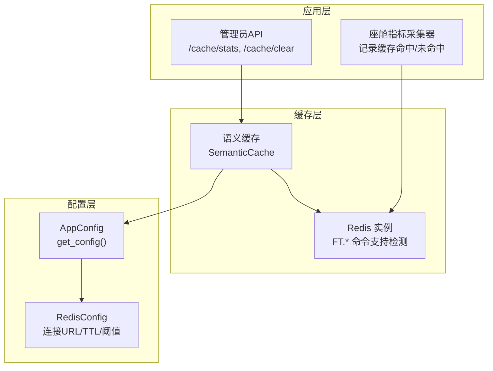
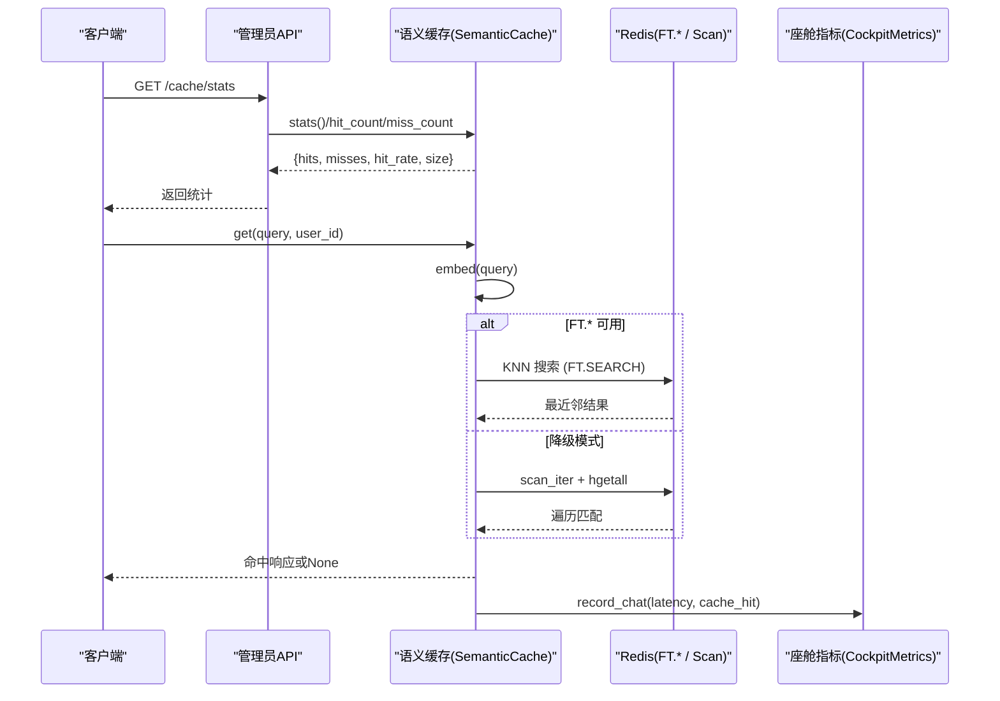
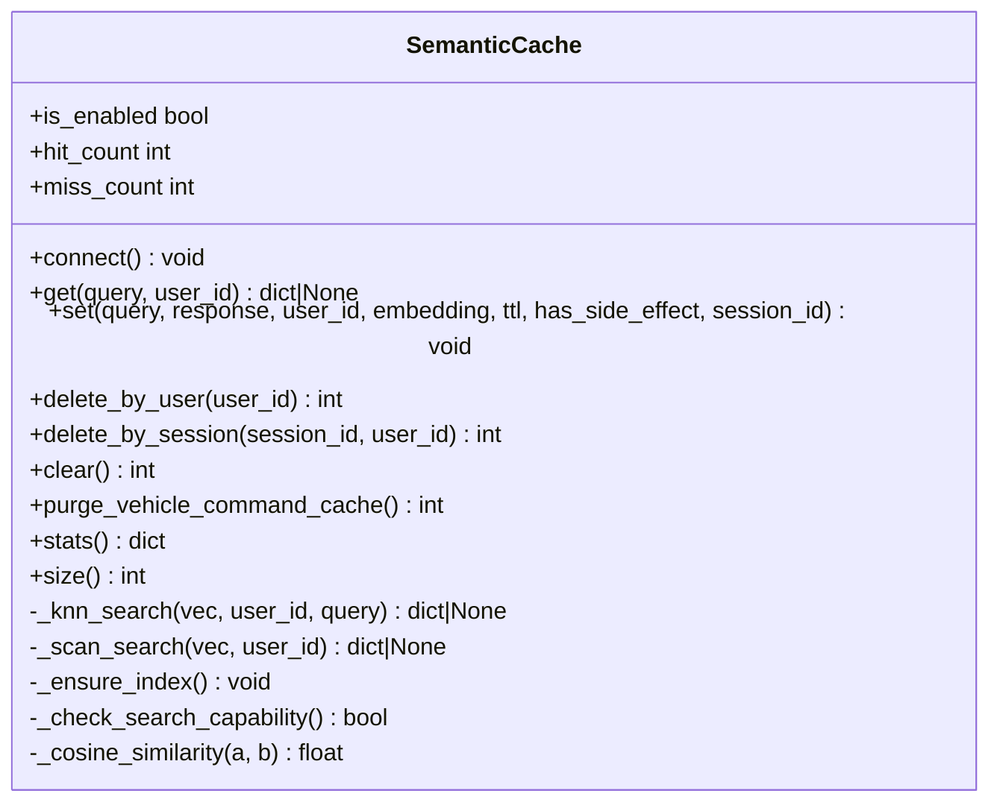
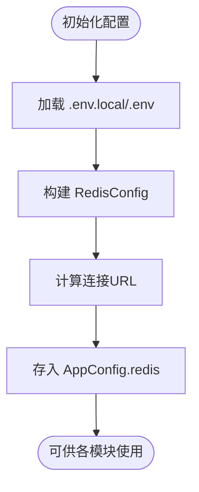
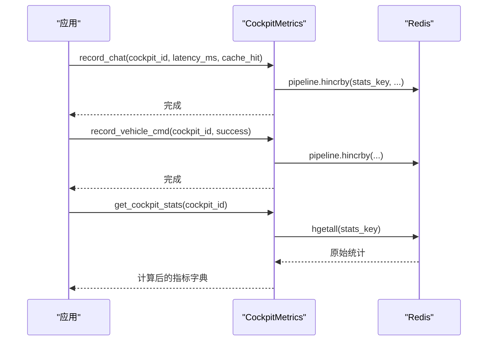
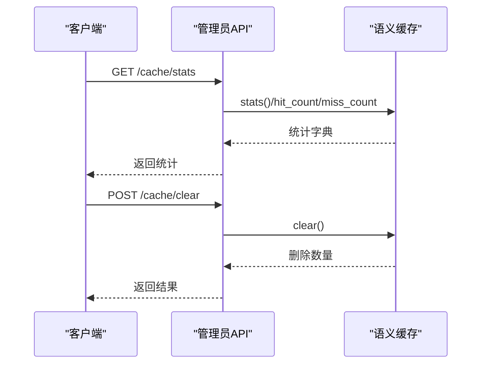
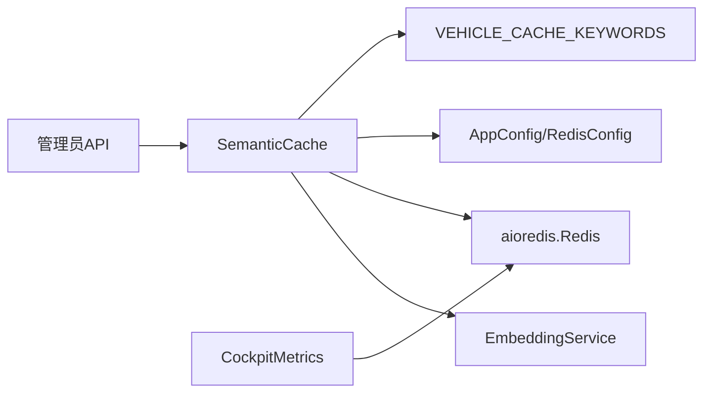

# Redis 缓存系统

<cite>
**本文引用的文件**   
- [redis_cache.py](file://backend_design/nexus/middleware/redis_cache.py)
- [cache.py](file://backend_design/nexus/config/cache.py)
- [_common.py](file://backend_design/nexus/config/_common.py)
- [__init__.py](file://backend_design/nexus/config/__init__.py)
- [constants.py](file://backend_design/nexus/intent/constants.py)
- [admin.py](file://backend_design/nexus/api/routes/admin.py)
- [cockpit_metrics.py](file://backend_design/nexus/observability/cockpit_metrics.py)
</cite>

## 目录
1. [简介](#简介)
2. [项目结构](#项目结构)
3. [核心组件](#核心组件)
4. [架构总览](#架构总览)
5. [详细组件分析](#详细组件分析)
6. [依赖关系分析](#依赖关系分析)
7. [性能考量](#性能考量)
8. [故障排查指南](#故障排查指南)
9. [结论](#结论)
10. [附录](#附录)

## 简介
本技术文档围绕 NexusCockpit 的 Redis 语义缓存系统展开，重点阐述多级缓存架构设计（本地内存、Redis 分布式缓存与语义缓存策略）、缓存键设计规范、数据序列化格式与过期策略、一致性保证机制（写穿透、写回、失效通知）、热点数据识别与预热、容量规划、监控指标与性能分析、故障排查方法，以及开发者最佳实践与扩展自定义缓存后端的指南。

## 项目结构
NexusCockpit 的缓存相关代码主要位于后端模块中：
- 中间件层实现语义缓存核心逻辑（向量检索、索引管理、TTL、安全策略）
- 配置中心提供 Redis 连接参数与语义缓存行为开关
- API 路由暴露缓存统计与清理接口
- 可观测性模块采集座舱级指标并写入 Redis

图表来源
- [admin.py:51-86](file://backend_design/nexus/api/routes/admin.py#L51-L86)
- [cockpit_metrics.py:38-100](file://backend_design/nexus/observability/cockpit_metrics.py#L38-L100)
- [redis_cache.py:77-128](file://backend_design/nexus/middleware/redis_cache.py#L77-L128)
- [__init__.py:144-167](file://backend_design/nexus/config/__init__.py#L144-L167)
- [cache.py:15-41](file://backend_design/nexus/config/cache.py#L15-L41)

章节来源
- [admin.py:51-86](file://backend_design/nexus/api/routes/admin.py#L51-L86)
- [cockpit_metrics.py:38-100](file://backend_design/nexus/observability/cockpit_metrics.py#L38-L100)
- [redis_cache.py:77-128](file://backend_design/nexus/middleware/redis_cache.py#L77-L128)
- [__init__.py:144-167](file://backend_design/nexus/config/__init__.py#L144-L167)
- [cache.py:15-41](file://backend_design/nexus/config/cache.py#L15-L41)

## 核心组件
- 语义缓存（SemanticCache）
  - 基于 Redis 8 Query Engine 或 redis-stack-server（RediSearch）的 KNN 向量检索
  - 按 user_id 分片隔离，支持 session_id 精确清理
  - TTL 分级控制（闲聊短、知识库长），车控指令禁止缓存
  - 自动探测 FT.* 能力，不支持时降级为 O(n) scan 模式
- 配置（RedisConfig/AppConfig）
  - 统一通过 get_config() 获取全局单例
  - 提供连接 URL、相似度阈值、TTL、启用开关等
- 指标采集（CockpitMetrics）
  - 将缓存命中/未命中、延迟、错误等指标写入 Redis
- 管理接口（Admin API）
  - 暴露缓存统计与清空接口，便于运维与调试

章节来源
- [redis_cache.py:57-128](file://backend_design/nexus/middleware/redis_cache.py#L57-L128)
- [cache.py:15-41](file://backend_design/nexus/config/cache.py#L15-L41)
- [__init__.py:144-167](file://backend_design/nexus/config/__init__.py#L144-L167)
- [cockpit_metrics.py:38-100](file://backend_design/nexus/observability/cockpit_metrics.py#L38-L100)
- [admin.py:51-86](file://backend_design/nexus/api/routes/admin.py#L51-L86)

## 架构总览
下图展示从请求到缓存命中/未命中的整体流程，包括语义缓存、Redis、指标采集与管理接口。

图表来源
- [admin.py:51-75](file://backend_design/nexus/api/routes/admin.py#L51-L75)
- [redis_cache.py:213-301](file://backend_design/nexus/middleware/redis_cache.py#L213-L301)
- [cockpit_metrics.py:38-64](file://backend_design/nexus/observability/cockpit_metrics.py#L38-L64)

## 详细组件分析

### 语义缓存（SemanticCache）
- 功能要点
  - 连接与能力探测：检查 Redis 是否支持 FT.*，否则降级为 scan 模式
  - 索引创建与维护：VECTOR FLAT/HNSW + TAG(user_id/session_id) + Numeric(timestamp)
  - 查询路径：向量化 → KNN 检索 → 相似度阈值过滤 → TTL 校验 → 副作用安全检查
  - 写入路径：向量化 → HASH 存储 → 设置 TTL → 可选 RediSearch 索引字段
  - 清理能力：按用户、会话、全量清理；旧车控缓存清理
  - 统计与大小：命中/未命中计数、命中率、条目数量、索引就绪状态

图表来源
- [redis_cache.py:57-128](file://backend_design/nexus/middleware/redis_cache.py#L57-L128)
- [redis_cache.py:213-301](file://backend_design/nexus/middleware/redis_cache.py#L213-L301)
- [redis_cache.py:367-436](file://backend_design/nexus/middleware/redis_cache.py#L367-L436)
- [redis_cache.py:437-514](file://backend_design/nexus/middleware/redis_cache.py#L437-L514)
- [redis_cache.py:516-561](file://backend_design/nexus/middleware/redis_cache.py#L516-L561)
- [redis_cache.py:568-615](file://backend_design/nexus/middleware/redis_cache.py#L568-L615)

章节来源
- [redis_cache.py:57-128](file://backend_design/nexus/middleware/redis_cache.py#L57-L128)
- [redis_cache.py:213-301](file://backend_design/nexus/middleware/redis_cache.py#L213-L301)
- [redis_cache.py:367-436](file://backend_design/nexus/middleware/redis_cache.py#L367-L436)
- [redis_cache.py:437-514](file://backend_design/nexus/middleware/redis_cache.py#L437-L514)
- [redis_cache.py:516-561](file://backend_design/nexus/middleware/redis_cache.py#L516-L561)
- [redis_cache.py:568-615](file://backend_design/nexus/middleware/redis_cache.py#L568-L615)

### 配置（RedisConfig/AppConfig）
- RedisConfig
  - 连接参数：host、port、password、db
  - 语义缓存参数：cache_enabled、cache_similarity_threshold、cache_ttl
  - 计算属性 url：生成完整连接字符串
- AppConfig
  - 聚合所有子系统配置，提供 get_config() 全局单例
  - 快捷访问函数：get_redis_config()

图表来源
- [_common.py:39-53](file://backend_design/nexus/config/_common.py#L39-L53)
- [cache.py:15-41](file://backend_design/nexus/config/cache.py#L15-L41)
- [__init__.py:144-167](file://backend_design/nexus/config/__init__.py#L144-L167)

章节来源
- [_common.py:39-53](file://backend_design/nexus/config/_common.py#L39-L53)
- [cache.py:15-41](file://backend_design/nexus/config/cache.py#L15-L41)
- [__init__.py:144-167](file://backend_design/nexus/config/__init__.py#L144-L167)

### 指标采集（CockpitMetrics）
- 记录对话指标：chat_count、cache_hits/cache_misses、total_latency_ms、latency_count、last_latency_ms、last_chat_time
- 记录车控指令：vehicle_cmd_count、vehicle_cmd_errors
- 记录错误：error_count、error_{type}
- 读取统计：计算缓存命中率、错误率、平均延迟、车控成功率

图表来源
- [cockpit_metrics.py:38-100](file://backend_design/nexus/observability/cockpit_metrics.py#L38-L100)
- [cockpit_metrics.py:102-161](file://backend_design/nexus/observability/cockpit_metrics.py#L102-L161)

章节来源
- [cockpit_metrics.py:38-100](file://backend_design/nexus/observability/cockpit_metrics.py#L38-L100)
- [cockpit_metrics.py:102-161](file://backend_design/nexus/observability/cockpit_metrics.py#L102-L161)

### 管理接口（Admin API）
- /cache/stats：返回语义缓存统计信息（优先调用 cache.stats()，否则降级手动计算）
- /cache/clear：清空语义缓存

图表来源
- [admin.py:51-86](file://backend_design/nexus/api/routes/admin.py#L51-L86)

章节来源
- [admin.py:51-86](file://backend_design/nexus/api/routes/admin.py#L51-L86)

## 依赖关系分析
- 语义缓存依赖
  - EmbeddingService：用于文本向量化
  - Redis 异步客户端：执行 FT.* 或 scan/hgetall
  - 配置中心：获取 Redis 连接与缓存行为参数
  - 意图常量：VEHICLE_CACHE_KEYWORDS 用于旧车控缓存清理
- 指标采集依赖
  - Redis 异步客户端：写入统计哈希
- 管理接口依赖
  - 应用状态中的 semantic_cache 实例

图表来源
- [redis_cache.py:35-42](file://backend_design/nexus/middleware/redis_cache.py#L35-L42)
- [constants.py:33-41](file://backend_design/nexus/intent/constants.py#L33-L41)
- [cockpit_metrics.py:17-21](file://backend_design/nexus/observability/cockpit_metrics.py#L17-L21)
- [admin.py:51-86](file://backend_design/nexus/api/routes/admin.py#L51-L86)

章节来源
- [redis_cache.py:35-42](file://backend_design/nexus/middleware/redis_cache.py#L35-L42)
- [constants.py:33-41](file://backend_design/nexus/intent/constants.py#L33-L41)
- [cockpit_metrics.py:17-21](file://backend_design/nexus/observability/cockpit_metrics.py#L17-L21)
- [admin.py:51-86](file://backend_design/nexus/api/routes/admin.py#L51-L86)

## 性能考量
- 向量检索复杂度
  - RediSearch KNN：O(log n)，适合大规模语义缓存
  - Scan 降级：O(n)，在 FT.* 不可用时使用，性能较低
- 相似度阈值与 TTL
  - 默认阈值 0.92，可按业务调整
  - TTL 默认 3600s，可按内容类型分级（闲聊短、知识库长）
- 副作用隔离
  - has_side_effect=True 的响应永不写入缓存，避免车控指令被缓存后不执行
- 指标采集开销
  - 使用 pipeline 批量写入，降低网络往返
  - 延迟统计采用累加值计算平均值，避免偏差

[本节为通用性能讨论，无需特定文件引用]

## 故障排查指南
- Redis 连接失败
  - connect() 捕获异常并禁用缓存，检查 REDIS_HOST/PORT/PASSWORD/DB 配置
- FT.* 命令不可用
  - _check_search_capability() 双重探测失败将降级为 scan 模式，建议升级至 Redis 8+ 或使用 redis-stack-server
- 索引创建失败
  - _ensure_index() 失败会记录警告并降级，检查向量维度与权限
- 缓存未命中
  - 检查相似度阈值、TTL、user_id/session_id 匹配、has_side_effect 标记
- 旧车控缓存残留
  - purge_vehicle_command_cache() 扫描并清理含车控关键词或 has_side_effect=True 的旧条目
- 指标缺失
  - 确认 CockpitMetrics 已注入 Redis 客户端，检查 stats_key 命名与写入成功

章节来源
- [redis_cache.py:90-128](file://backend_design/nexus/middleware/redis_cache.py#L90-L128)
- [redis_cache.py:129-163](file://backend_design/nexus/middleware/redis_cache.py#L129-L163)
- [redis_cache.py:164-212](file://backend_design/nexus/middleware/redis_cache.py#L164-L212)
- [redis_cache.py:213-301](file://backend_design/nexus/middleware/redis_cache.py#L213-L301)
- [redis_cache.py:516-561](file://backend_design/nexus/middleware/redis_cache.py#L516-L561)
- [cockpit_metrics.py:38-100](file://backend_design/nexus/observability/cockpit_metrics.py#L38-L100)

## 结论
NexusCockpit 的 Redis 语义缓存系统以 RediSearch KNN 为核心，结合严格的副作用隔离与灵活的 TTL 策略，实现了高效、安全的分布式语义缓存。通过配置中心统一管理、指标采集与管理员接口，系统在可用性、可观测性与可维护性方面具备良好基础。建议在大规模部署时优先启用 FT.* 能力，并结合热点数据识别与预热策略进一步优化性能。

[本节为总结性内容，无需特定文件引用]

## 附录

### 缓存键设计与数据序列化
- 键前缀：nexus:cache:entry:
- 存储结构：HASH
  - query：原始查询（截断长度限制）
  - response：JSON 序列化响应
  - user_id：用户分片
  - session_id：会话标识（用于精确清理）
  - embedding：向量（FT.* 模式下为 float32 bytes，Scan 模式下为 JSON 数组）
  - timestamp：写入时间戳
  - has_side_effect：副作用标记（True 表示禁止缓存）
- TTL：由配置决定，默认 3600s

章节来源
- [redis_cache.py:367-436](file://backend_design/nexus/middleware/redis_cache.py#L367-L436)
- [redis_cache.py:303-365](file://backend_design/nexus/middleware/redis_cache.py#L303-L365)

### 一致性保证机制
- 写穿透：当缓存未命中时，直接调用后端服务获取数据，再写入缓存
- 写回：更新操作后根据策略选择更新缓存或失效对应键
- 失效通知：通过 delete_by_user/delete_by_session/clear/purge_vehicle_command_cache 主动清理
- 副作用隔离：has_side_effect=True 的响应永不写入缓存，确保车控指令始终执行

章节来源
- [redis_cache.py:367-436](file://backend_design/nexus/middleware/redis_cache.py#L367-L436)
- [redis_cache.py:437-514](file://backend_design/nexus/middleware/redis_cache.py#L437-L514)
- [redis_cache.py:516-561](file://backend_design/nexus/middleware/redis_cache.py#L516-L561)

### 热点数据识别与缓存预热
- 热点识别：通过 CockpitMetrics 的 cache_hits/cache_misses 统计识别高频查询
- 预热策略：对热点 query 提前嵌入并写入缓存，设置合理 TTL
- 容量规划：根据 Redis 内存与条目数量（size）动态调整 TTL 与阈值

章节来源
- [cockpit_metrics.py:38-100](file://backend_design/nexus/observability/cockpit_metrics.py#L38-L100)
- [redis_cache.py:592-602](file://backend_design/nexus/middleware/redis_cache.py#L592-L602)

### 监控指标与性能分析
- 缓存统计：hits、misses、hit_rate、size、index_ready
- 座舱指标：chat_count、cache_hits/cache_misses、avg_latency_ms、error_rate、vehicle_cmd_success_rate
- 性能分析：对比 KNN 与 Scan 模式的延迟与命中率，评估阈值与 TTL 的影响

章节来源
- [admin.py:51-75](file://backend_design/nexus/api/routes/admin.py#L51-L75)
- [cockpit_metrics.py:102-161](file://backend_design/nexus/observability/cockpit_metrics.py#L102-L161)
- [redis_cache.py:604-615](file://backend_design/nexus/middleware/redis_cache.py#L604-L615)

### 最佳实践与扩展指南
- 最佳实践
  - 始终启用 has_side_effect 检查，避免车控指令缓存
  - 合理设置相似度阈值与 TTL，平衡命中率与新鲜度
  - 优先使用 FT.* 能力，必要时接受 Scan 降级
  - 定期清理旧缓存与无效条目
- 扩展自定义缓存后端
  - 实现统一的 get/set/clear/delete_by_user/delete_by_session 接口
  - 保持 with side effect 的安全策略一致
  - 提供 stats/size/is_enabled 等元数据接口以便监控

章节来源
- [redis_cache.py:367-436](file://backend_design/nexus/middleware/redis_cache.py#L367-L436)
- [redis_cache.py:568-615](file://backend_design/nexus/middleware/redis_cache.py#L568-L615)