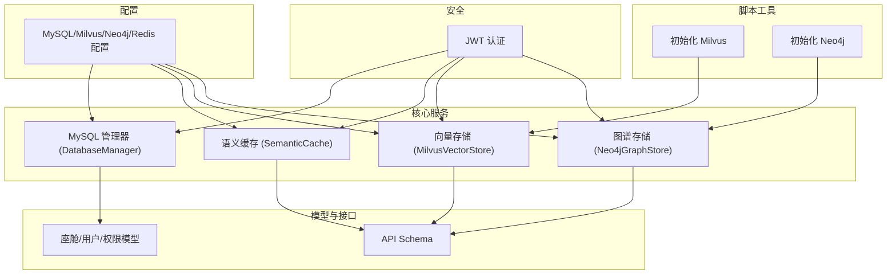
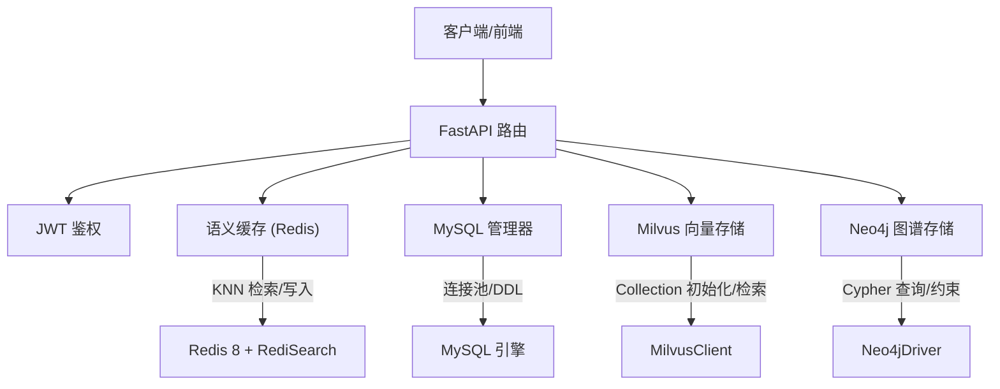
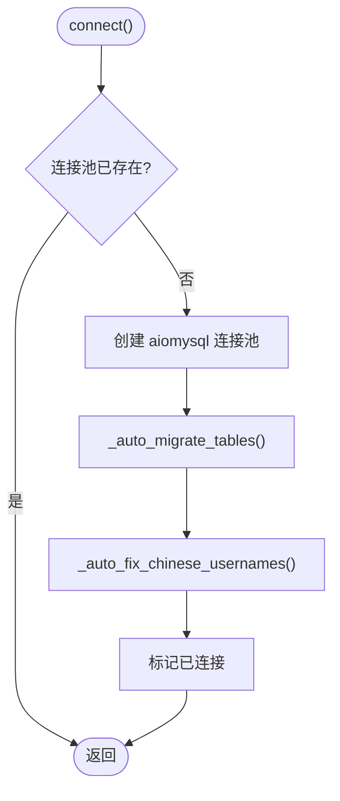
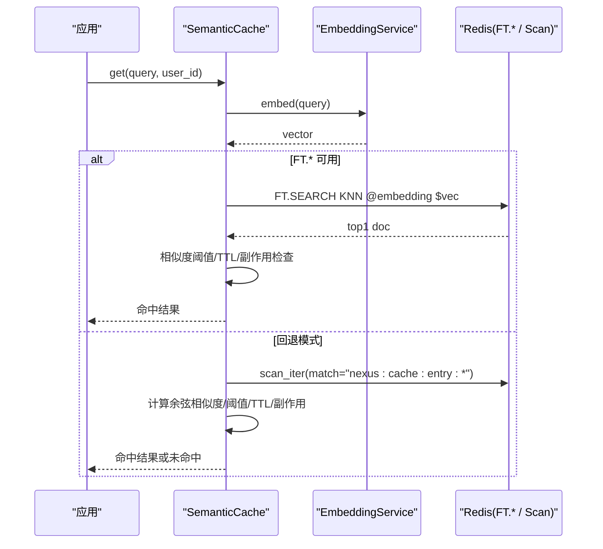
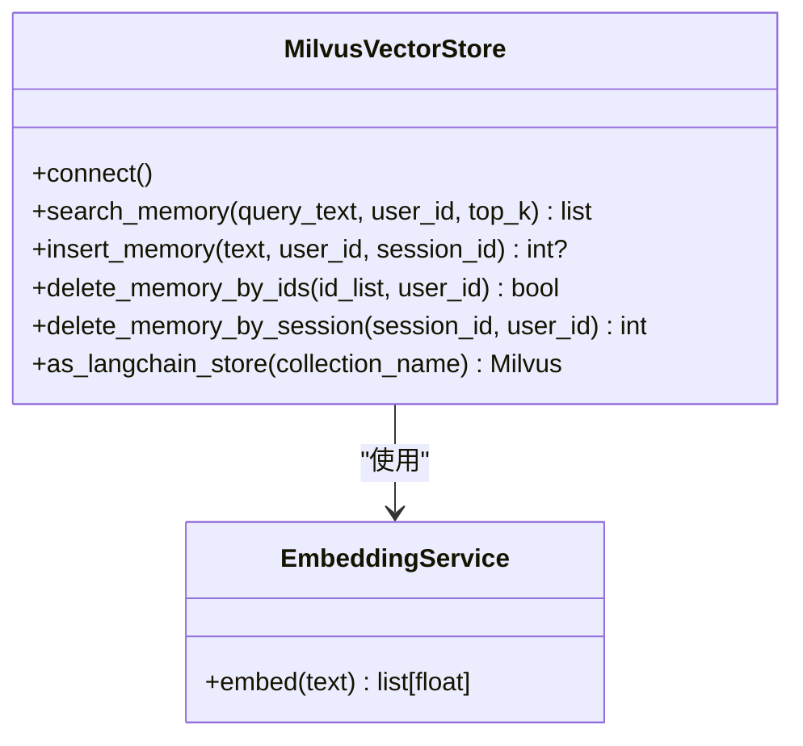
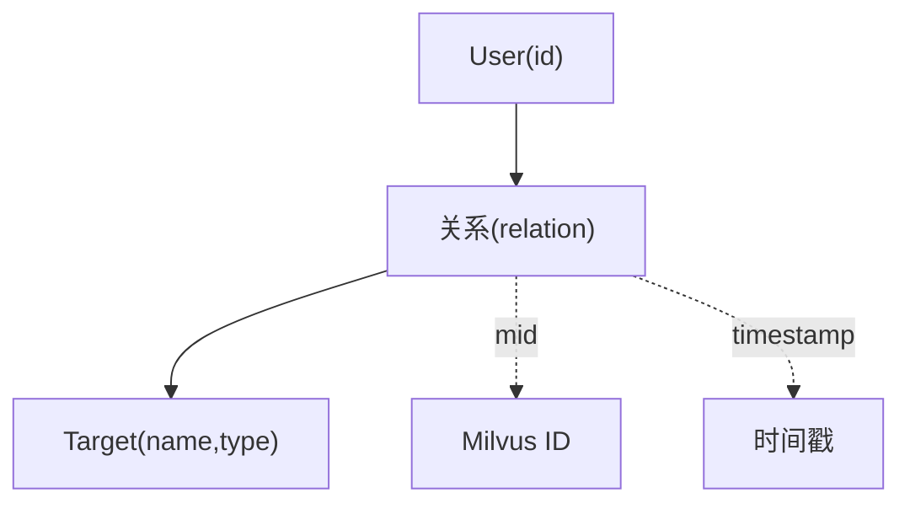
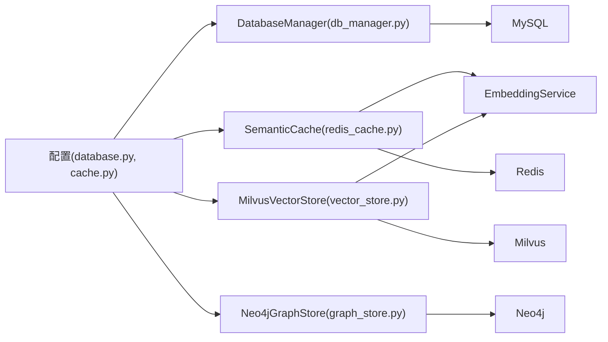

# 数据存储

<cite>
**本文引用的文件**   
- [database.py](file://backend_design/nexus/config/database.py)
- [cache.py](file://backend_design/nexus/config/cache.py)
- [db_manager.py](file://backend_design/nexus/core/db_manager.py)
- [redis_cache.py](file://backend_design/nexus/middleware/redis_cache.py)
- [vector_store.py](file://backend_design/nexus/rag/vector_store.py)
- [graph_store.py](file://backend_design/nexus/rag/graph_store.py)
- [cockpit.py](file://backend_design/nexus/models/cockpit.py)
- [schemas.py](file://backend_design/nexus/models/schemas.py)
- [init_milvus.py](file://backend_design/scripts/init_milvus.py)
- [init_neo4j.py](file://backend_design/scripts/init_neo4j.py)
- [auth.py](file://backend_design/nexus/core/auth.py)
</cite>

## 目录
1. [引言](#引言)
2. [项目结构](#项目结构)
3. [核心组件](#核心组件)
4. [架构总览](#架构总览)
5. [详细组件分析](#详细组件分析)
6. [依赖关系分析](#依赖关系分析)
7. [性能考量](#性能考量)
8. [故障排查指南](#故障排查指南)
9. [结论](#结论)
10. [附录：扩展与调优指南](#附录扩展与调优指南)

## 引言
本技术文档面向 NexusCockpit 的数据存储层，系统性阐述多数据库统一管理与数据访问抽象：MySQL（关系型）、Milvus（向量）、Neo4j（图）与 Redis（缓存）。文档覆盖数据模型设计、实体关系与索引策略；数据访问层的抽象设计与 ORM/客户端使用模式；语义缓存、多级缓存与失效机制；数据迁移、备份恢复与一致性保证；以及安全、隐私与访问控制策略。同时提供扩展新存储后端与优化查询性能的实践建议，帮助数据开发者快速上手并高效运维。

## 项目结构
NexusCockpit 的存储相关代码集中在 backend_design/nexus 目录下，按职责分层组织：
- 配置层：database.py、cache.py 定义 MySQL、Milvus、Neo4j、Redis 的连接参数与行为开关。
- 核心服务层：db_manager.py 管理 MySQL 连接池与表结构自动迁移；redis_cache.py 实现基于 Redis 8 的语义缓存；vector_store.py 封装 Milvus 集合初始化与检索；graph_store.py 封装 Neo4j 图谱操作。
- 模型与接口：models/cockpit.py、models/schemas.py 定义 API 请求/响应与 RBAC 权限映射。
- 脚本工具：scripts/init_milvus.py、scripts/init_neo4j.py 用于初始化向量与图谱资源。
- 安全认证：core/auth.py 提供 JWT 鉴权与用户上下文注入。

图表来源
- [database.py:15-61](file://backend_design/nexus/config/database.py#L15-L61)
- [cache.py:15-41](file://backend_design/nexus/config/cache.py#L15-L41)
- [db_manager.py:40-120](file://backend_design/nexus/core/db_manager.py#L40-L120)
- [redis_cache.py:57-128](file://backend_design/nexus/middleware/redis_cache.py#L57-L128)
- [vector_store.py:36-120](file://backend_design/nexus/rag/vector_store.py#L36-L120)
- [graph_store.py:26-58](file://backend_design/nexus/rag/graph_store.py#L26-L58)
- [cockpit.py:21-57](file://backend_design/nexus/models/cockpit.py#L21-L57)
- [schemas.py:19-38](file://backend_design/nexus/models/schemas.py#L19-L38)
- [init_milvus.py:21-47](file://backend_design/scripts/init_milvus.py#L21-L47)
- [init_neo4j.py:18-34](file://backend_design/scripts/init_neo4j.py#L18-L34)
- [auth.py:35-62](file://backend_design/nexus/core/auth.py#L35-L62)

章节来源
- [database.py:15-61](file://backend_design/nexus/config/database.py#L15-L61)
- [cache.py:15-41](file://backend_design/nexus/config/cache.py#L15-L41)

## 核心组件
- MySQL 数据库管理器（DatabaseManager）
  - 负责连接池管理、表结构自动创建与增量迁移、默认数据初始化、审计日志与会话统计等 CRUD。
  - 使用 aiomysql 异步驱动，支持连接池化与高并发。
- 语义缓存（SemanticCache）
  - 基于 Redis 8 RediSearch KNN 向量索引，实现 O(log n) 相似度检索；不支持 FT.* 时回退到 O(n) scan。
  - 支持 user_id/session_id 分片、TTL 分级、副作用隔离（车控指令不缓存）。
- 向量存储（MilvusVectorStore）
  - 管理 Food_List 与 User_Memory 两个集合，支持维度校验、字段迁移检测、会话级记忆清理。
  - 提供 as_langchain_store() 以对接 LangChain RAG。
- 图谱存储（Neo4jGraphStore）
  - 通过 langchain_neo4j.Neo4jGraph 管理连接与约束，支持关系 upsert、深度查询、用户画像聚合。
- 配置与模型
  - database.py、cache.py 集中管理各中间件连接参数与行为开关。
  - cockpit.py、schemas.py 定义 API 模型与 RBAC 权限映射。

章节来源
- [db_manager.py:40-120](file://backend_design/nexus/core/db_manager.py#L40-L120)
- [redis_cache.py:57-128](file://backend_design/nexus/middleware/redis_cache.py#L57-L128)
- [vector_store.py:36-120](file://backend_design/nexus/rag/vector_store.py#L36-L120)
- [graph_store.py:26-58](file://backend_design/nexus/rag/graph_store.py#L26-L58)
- [cockpit.py:21-57](file://backend_design/nexus/models/cockpit.py#L21-L57)
- [schemas.py:19-38](file://backend_design/nexus/models/schemas.py#L19-L38)

## 架构总览
下图展示 NexusCockpit 存储层整体交互：应用通过 FastAPI 路由调用服务层，服务层根据业务选择 MySQL、Milvus、Neo4j 或 Redis 进行读写；语义缓存位于热点路径前端，降低 LLM 与下游存储压力；向量与图谱为知识增强提供支撑；MySQL 作为主数据与审计持久化。

图表来源
- [auth.py:85-122](file://backend_design/nexus/core/auth.py#L85-L122)
- [redis_cache.py:213-298](file://backend_design/nexus/middleware/redis_cache.py#L213-L298)
- [vector_store.py:201-262](file://backend_design/nexus/rag/vector_store.py#L201-L262)
- [graph_store.py:69-132](file://backend_design/nexus/rag/graph_store.py#L69-L132)
- [db_manager.py:56-85](file://backend_design/nexus/core/db_manager.py#L56-L85)

## 详细组件分析

### MySQL 数据访问层（DatabaseManager）
- 连接池与生命周期
  - 启动时建立 aiomysql 连接池，设置最小/最大连接数，自动执行表结构迁移与默认数据插入。
- 表结构与索引
  - 自动创建 cockpits、users、chat_history、cockpit_stats、subagent_logs、mainagent_logs、audit_logs、agent_feedback、llm_cost_tracking、voiceprint_enrollments、chat_sessions、user_habits、chat_logs 等表，并建立常用复合索引。
  - 对 chat_logs 动态添加 session_id 列与索引，保障会话关联查询性能。
- 数据迁移与修复
  - _auto_migrate_tables：幂等建表与增量 DDL。
  - _auto_fix_chinese_usernames：将中文用户名与座舱名修正为 ASCII，避免编码问题。
- 典型操作
  - 审计日志、LLM 成本追踪、用户管理（RBAC 四角色）、会话统计等。

图表来源
- [db_manager.py:56-85](file://backend_design/nexus/core/db_manager.py#L56-L85)
- [db_manager.py:86-158](file://backend_design/nexus/core/db_manager.py#L86-L158)
- [db_manager.py:321-336](file://backend_design/nexus/core/db_manager.py#L321-L336)

章节来源
- [db_manager.py:40-120](file://backend_design/nexus/core/db_manager.py#L40-L120)
- [db_manager.py:86-158](file://backend_design/nexus/core/db_manager.py#L86-L158)
- [db_manager.py:321-336](file://backend_design/nexus/core/db_manager.py#L321-L336)

### 语义缓存（Redis SemanticCache）
- 能力探测与降级
  - 优先使用 RediSearch FT.* 命令（Redis 8+ 内置），否则回退到 scan 遍历。
- 索引与数据结构
  - 索引包含 query、user_id、session_id、timestamp、embedding（FLOAT32/COSINE）。
  - 缓存条目为 HASH，包含 response、has_side_effect 等元数据。
- 查询流程
  - 向量化 → KNN 检索 → 相似度阈值过滤 → TTL 检查 → 副作用安全检查 → 命中返回。
- 写入流程
  - 若 has_side_effect=True 则拒绝写入（防止车控指令被缓存后不执行）。
  - 支持 TTL 分级与 session_id 精确清理。
- 清理策略
  - delete_by_user、delete_by_session、clear、purge_vehicle_command_cache。

图表来源
- [redis_cache.py:213-298](file://backend_design/nexus/middleware/redis_cache.py#L213-L298)
- [redis_cache.py:303-365](file://backend_design/nexus/middleware/redis_cache.py#L303-L365)
- [redis_cache.py:367-436](file://backend_design/nexus/middleware/redis_cache.py#L367-L436)

章节来源
- [redis_cache.py:57-128](file://backend_design/nexus/middleware/redis_cache.py#L57-L128)
- [redis_cache.py:213-298](file://backend_design/nexus/middleware/redis_cache.py#L213-L298)
- [redis_cache.py:367-436](file://backend_design/nexus/middleware/redis_cache.py#L367-L436)

### 向量存储（MilvusVectorStore）
- 集合初始化与迁移
  - Food_List：item_name、category_name、cate_1..3_name、vector。
  - User_Memory：user_id、session_id、text、vector、timestamp；支持维度不一致重建与缺失字段重建。
- 索引策略
  - 向量索引 HNSW（可配），user_id/session_id Trie 索引加速过滤。
- 检索与写入
  - search_memory：user_id 过滤 + 向量检索。
  - insert_memory：文本向量化后入库，支持会话级记忆。
  - delete_memory_by_ids、delete_memory_by_session：安全删除。
- LangChain 集成
  - as_langchain_store() 返回标准 Milvus 实例，便于通用 RAG 检索。

图表来源
- [vector_store.py:36-120](file://backend_design/nexus/rag/vector_store.py#L36-L120)
- [vector_store.py:201-262](file://backend_design/nexus/rag/vector_store.py#L201-L262)
- [vector_store.py:360-390](file://backend_design/nexus/rag/vector_store.py#L360-L390)

章节来源
- [vector_store.py:36-120](file://backend_design/nexus/rag/vector_store.py#L36-L120)
- [vector_store.py:201-262](file://backend_design/nexus/rag/vector_store.py#L201-L262)

### 图谱存储（Neo4jGraphStore）
- 连接与约束
  - 使用 langchain_neo4j.Neo4jGraph 管理连接池与 Cypher 执行。
  - 初始化唯一约束与索引（User.id 唯一、Entity.name 索引）。
- 关系操作
  - upsert_relation：MERGE 用户与目标节点，绑定 Milvus ID 与时间戳。
  - delete_relation_by_mid：按 Milvus ID 联动删除关系。
- 查询与画像
  - search_user_graph：1~N 阶关系展开。
  - get_user_profile：聚合用户关系与类型标签。

图表来源
- [graph_store.py:60-89](file://backend_design/nexus/rag/graph_store.py#L60-L89)
- [graph_store.py:102-132](file://backend_design/nexus/rag/graph_store.py#L102-L132)

章节来源
- [graph_store.py:26-58](file://backend_design/nexus/rag/graph_store.py#L26-L58)
- [graph_store.py:69-132](file://backend_design/nexus/rag/graph_store.py#L69-L132)

### 配置与模型
- 配置
  - database.py：MilvusConfig、Neo4jConfig、MySQLConfig（含 URL 生成）。
  - cache.py：RedisConfig（连接 URL 与语义缓存开关、阈值、TTL）。
- 模型
  - cockpit.py：座舱 CRUD、状态、数据中台概览、RBAC 角色与权限映射。
  - schemas.py：Chat/Voice/VehicleCommand/Health/SkillList/Memory 等 API Schema。

章节来源
- [database.py:15-61](file://backend_design/nexus/config/database.py#L15-L61)
- [cache.py:15-41](file://backend_design/nexus/config/cache.py#L15-L41)
- [cockpit.py:21-57](file://backend_design/nexus/models/cockpit.py#L21-L57)
- [schemas.py:19-38](file://backend_design/nexus/models/schemas.py#L19-L38)

## 依赖关系分析
- 组件耦合
  - DatabaseManager 依赖 MySQL 配置与 aiomysql；SemanticCache 依赖 Redis 与 EmbeddingService；MilvusVectorStore 依赖 MilvusClient 与 EmbeddingService；Neo4jGraphStore 依赖 langchain_neo4j。
- 外部依赖
  - Redis 8+ 或 redis-stack-server（FT.* 命令）；Milvus（pymilvus 3.x）；Neo4j（langchain_neo4j）。
- 潜在循环依赖
  - 当前模块间无直接循环导入，依赖方向清晰：配置→服务→外部中间件。

图表来源
- [database.py:15-61](file://backend_design/nexus/config/database.py#L15-L61)
- [cache.py:15-41](file://backend_design/nexus/config/cache.py#L15-L41)
- [db_manager.py:56-85](file://backend_design/nexus/core/db_manager.py#L56-L85)
- [redis_cache.py:57-128](file://backend_design/nexus/middleware/redis_cache.py#L57-L128)
- [vector_store.py:36-120](file://backend_design/nexus/rag/vector_store.py#L36-L120)
- [graph_store.py:26-58](file://backend_design/nexus/rag/graph_store.py#L26-L58)

章节来源
- [database.py:15-61](file://backend_design/nexus/config/database.py#L15-L61)
- [cache.py:15-41](file://backend_design/nexus/config/cache.py#L15-L41)

## 性能考量
- MySQL
  - 连接池 minsize=2、maxsize=10，适合中等并发；关键查询使用复合索引（cockpit_id+time、user_id+time、session_id）。
  - 大 JSON 字段（check_items、llm_judgment、decision_trace）注意序列化开销，必要时拆分或归档。
- Redis 语义缓存
  - 优先使用 RediSearch KNN（O(log n)），失败回退 O(n) scan；合理设置相似度阈值与 TTL 平衡命中率与内存占用。
  - 副作用隔离避免车控指令缓存导致的不一致。
- Milvus 向量检索
  - HNSW 索引参数（M、efConstruction、ef）影响召回与延迟；user_id/session_id Trie 索引提升过滤效率。
  - 维度不一致自动重建集合，确保嵌入模型升级平滑。
- Neo4j 图谱
  - 约束与索引减少重复与扫描；深度查询限制 depth 避免全图遍历。
- 缓存策略
  - 多级缓存：语义缓存（Redis）→ 向量/图谱（Milvus/Neo4j）→ MySQL 持久化；热点路径优先命中缓存。

[本节为通用指导，不直接分析具体文件]

## 故障排查指南
- Redis 语义缓存不可用
  - 现象：FT.* 命令不可用，回退到 scan 模式；或连接失败导致缓存禁用。
  - 排查：确认 Redis 版本（8+ 或 redis-stack-server）；检查 FT._LIST 是否可用；查看日志中的降级提示。
- Milvus 集合维度不匹配
  - 现象：切换 embedding 模型后检索异常。
  - 处理：运行 init_milvus.py --rebuild 重建集合；或等待自动重建逻辑生效。
- Neo4j 约束/索引缺失
  - 现象：写入冲突或查询缓慢。
  - 处理：运行 init_neo4j.py 初始化约束与索引。
- MySQL 表结构不一致
  - 现象：缺少 session_id 列或索引。
  - 处理：DatabaseManager 启动时自动修复；如失败检查日志与权限。

章节来源
- [redis_cache.py:129-162](file://backend_design/nexus/middleware/redis_cache.py#L129-L162)
- [init_milvus.py:21-47](file://backend_design/scripts/init_milvus.py#L21-L47)
- [init_neo4j.py:18-34](file://backend_design/scripts/init_neo4j.py#L18-L34)
- [db_manager.py:321-336](file://backend_design/nexus/core/db_manager.py#L321-L336)

## 结论
NexusCockpit 的存储层通过统一的配置与清晰的组件边界，实现了 MySQL、Milvus、Neo4j、Redis 的多库协同。语义缓存显著降低 LLM 与下游存储压力，向量与图谱为知识增强提供支撑，MySQL 承担主数据与审计持久化。通过自动迁移、维度校验、会话级清理与副作用隔离，系统在可扩展性与一致性方面具备良好基础。结合合理的索引策略与缓存参数，可在高并发场景下保持稳定的性能表现。

[本节为总结性内容，不直接分析具体文件]

## 附录：扩展与调优指南

### 扩展新的存储后端
- 新增向量存储后端
  - 在 rag/vector_base.py 定义抽象接口，在 vector_store.py 中实现新 Provider，并在 build_vector_store 中注册。
  - 参考 MilvusVectorStore 的 connect/search/insert/delete 模式，保持 with user_id/session_id 过滤。
- 新增图谱存储后端
  - 在 rag/graph_base.py 定义抽象接口，在 graph_store.py 中实现新 Provider，并在 build_graph_store 中注册。
  - 保持 upsert_relation、search_user_graph、get_user_profile 等接口一致性。
- 新增缓存后端
  - 在 middleware/redis_cache.py 基础上抽象出 BaseSemanticCache，实现不同 KV 存储的 KNN/相似度检索。
  - 保留 has_side_effect 安全检查与 TTL 分级策略。

章节来源
- [vector_store.py:36-120](file://backend_design/nexus/rag/vector_store.py#L36-L120)
- [graph_store.py:26-58](file://backend_design/nexus/rag/graph_store.py#L26-L58)
- [redis_cache.py:57-128](file://backend_design/nexus/middleware/redis_cache.py#L57-L128)

### 优化查询性能
- MySQL
  - 针对高频查询增加复合索引（cockpit_id+created_at、user_id+created_at、session_id）。
  - 对大 JSON 字段采用分区或归档策略，定期清理历史日志。
- Redis
  - 调整 cache_similarity_threshold 与 cache_ttl 平衡命中率与内存；监控 size() 与 stats()。
  - 使用 delete_by_session 精准清理，避免全量 scan。
- Milvus
  - 调优 HNSW 参数（M、efConstruction、ef）；为 user_id/session_id 建立 Trie 索引。
  - 批量插入与分页查询，避免单次过大负载。
- Neo4j
  - 限制查询 depth；利用约束与索引减少重复与扫描；按需导出子图进行分析。

章节来源
- [db_manager.py:141-158](file://backend_design/nexus/core/db_manager.py#L141-L158)
- [redis_cache.py:580-615](file://backend_design/nexus/middleware/redis_cache.py#L580-L615)
- [vector_store.py:183-199](file://backend_design/nexus/rag/vector_store.py#L183-L199)
- [graph_store.py:102-132](file://backend_design/nexus/rag/graph_store.py#L102-L132)

### 数据迁移、备份恢复与一致性
- 迁移
  - MySQL：DatabaseManager._auto_migrate_tables 幂等建表与增量 DDL；_auto_fix_chinese_usernames 修复历史数据。
  - Milvus：init_milvus.py 支持 --rebuild 重建集合；运行时自动检测维度与字段差异。
  - Neo4j：init_neo4j.py 初始化约束与索引。
- 备份恢复
  - MySQL：使用 mysqldump 或云厂商备份方案；注意字符集 utf8mb4。
  - Redis：RDB/AOF 快照；语义缓存可按 user_id/session_id 粒度清理。
  - Milvus/Neo4j：使用各自导出工具或快照；图谱关系与 Milvus ID 绑定需保持一致。
- 一致性
  - 语义缓存的 has_side_effect 隔离确保车控指令不被缓存命中跳过。
  - 会话级清理（Redis、Milvus）保证会话结束后的数据一致性。

章节来源
- [db_manager.py:86-158](file://backend_design/nexus/core/db_manager.py#L86-L158)
- [init_milvus.py:21-47](file://backend_design/scripts/init_milvus.py#L21-L47)
- [init_neo4j.py:18-34](file://backend_design/scripts/init_neo4j.py#L18-L34)
- [redis_cache.py:367-436](file://backend_design/nexus/middleware/redis_cache.py#L367-L436)

### 数据安全、隐私保护与访问控制
- 认证与授权
  - JWT 签发与验证（auth.py），所有敏感接口通过 Depends(get_current_user) 强制鉴权。
  - RBAC 四角色（super_admin、cockpit_admin、cockpit_user、cockpit_viewer）与权限映射（cockpit.py）。
- 数据隔离
  - Redis 语义缓存按 user_id/session_id 分片；Milvus 记忆按 user_id 过滤；Neo4j 图谱以 User.id 为根。
- 隐私与安全
  - 车控指令禁止缓存（has_side_effect=True）；审计日志记录操作详情与 IP；LLM 成本追踪用于计费与审计。

章节来源
- [auth.py:35-62](file://backend_design/nexus/core/auth.py#L35-L62)
- [cockpit.py:167-214](file://backend_design/nexus/models/cockpit.py#L167-L214)
- [redis_cache.py:367-436](file://backend_design/nexus/middleware/redis_cache.py#L367-L436)
- [db_manager.py:529-570](file://backend_design/nexus/core/db_manager.py#L529-L570)