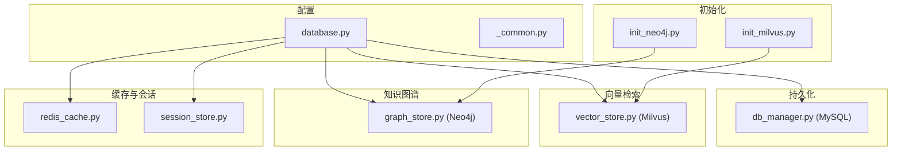
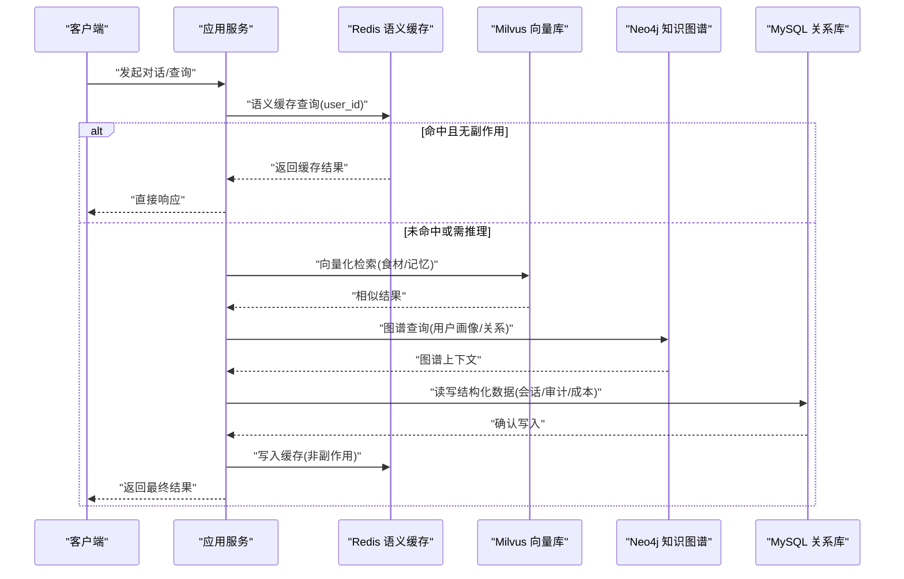
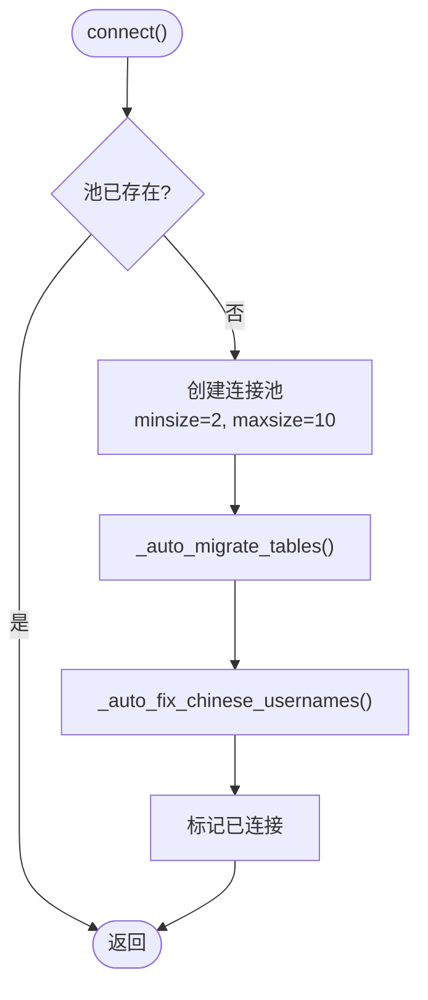
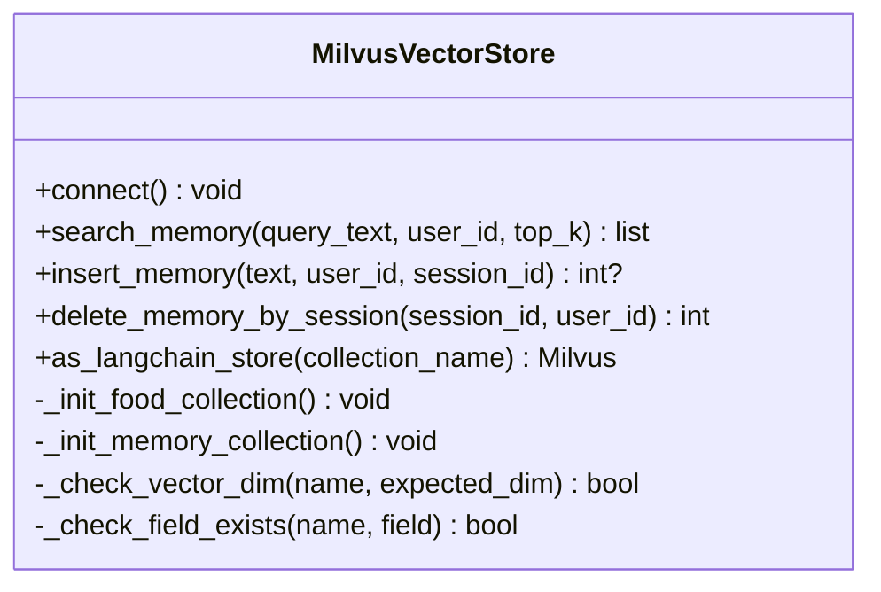
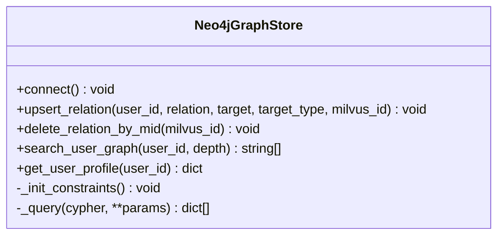
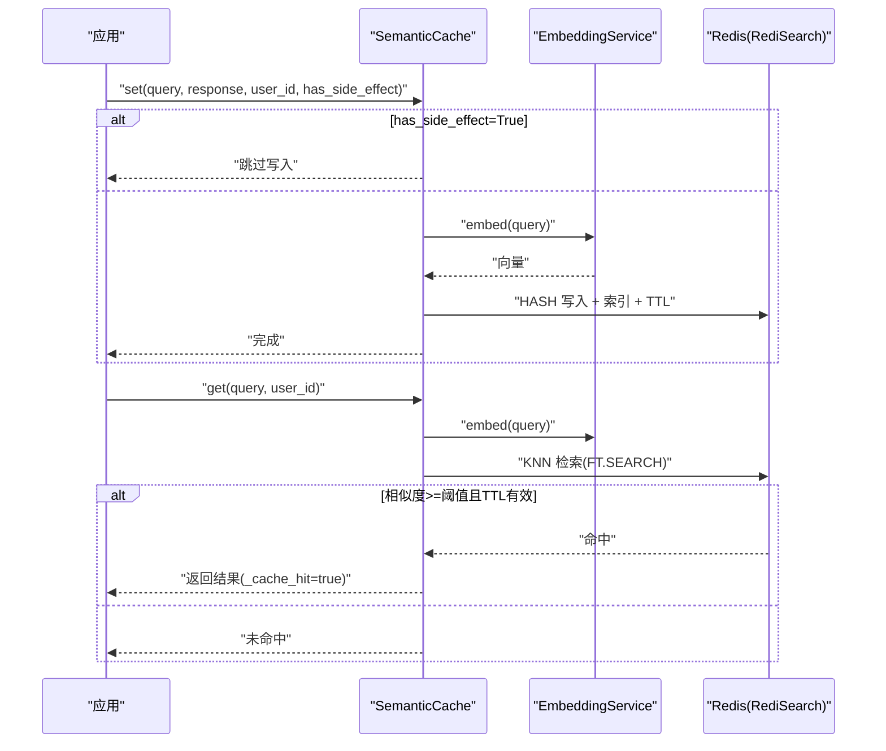
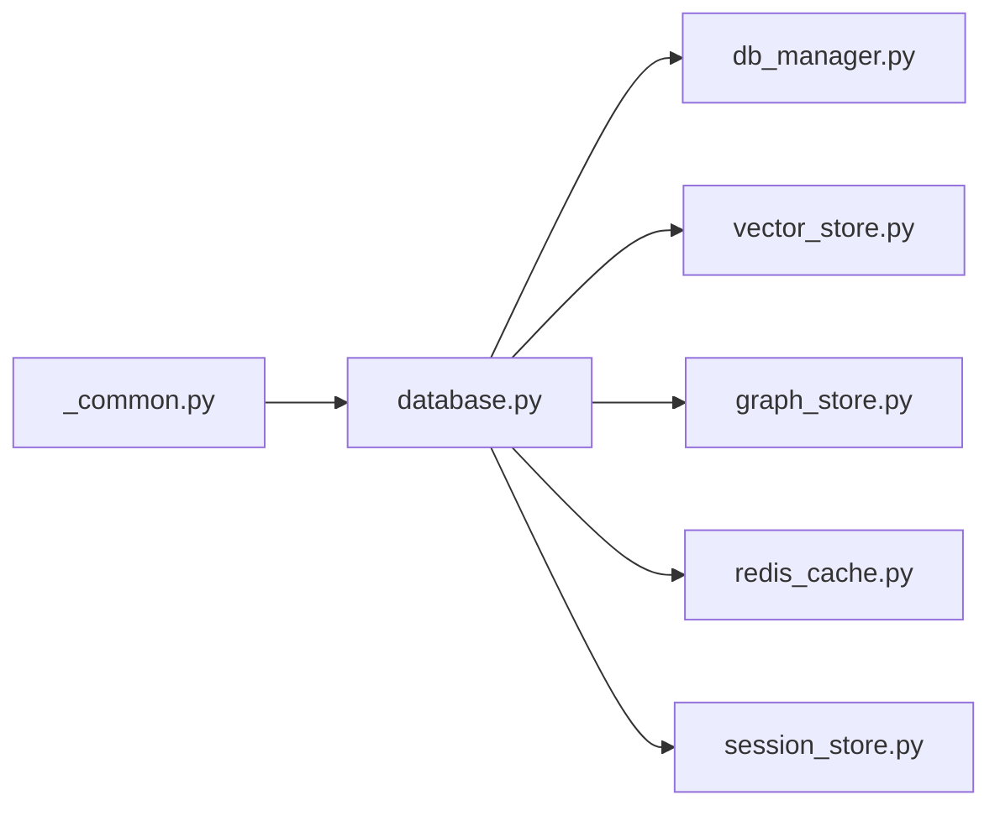

# 数据库架构设计

<cite>
**本文引用的文件**   
- [backend_design/nexus/config/database.py](file://backend_design/nexus/config/database.py)
- [backend_design/nexus/core/db_manager.py](file://backend_design/nexus/core/db_manager.py)
- [backend_design/nexus/middleware/redis_cache.py](file://backend_design/nexus/middleware/redis_cache.py)
- [backend_design/nexus/middleware/session_store.py](file://backend_design/nexus/middleware/session_store.py)
- [backend_design/nexus/rag/vector_store.py](file://backend_design/nexus/rag/vector_store.py)
- [backend_design/nexus/rag/graph_store.py](file://backend_design/nexus/rag/graph_store.py)
- [backend_design/scripts/init_milvus.py](file://backend_design/scripts/init_milvus.py)
- [backend_design/scripts/init_neo4j.py](file://backend_design/scripts/init_neo4j.py)
- [backend_design/nexus/config/_common.py](file://backend_design/nexus/config/_common.py)
</cite>

## 目录
1. [引言](#引言)
2. [项目结构](#项目结构)
3. [核心组件](#核心组件)
4. [架构总览](#架构总览)
5. [详细组件分析](#详细组件分析)
6. [依赖关系分析](#依赖关系分析)
7. [性能考量](#性能考量)
8. [故障排查指南](#故障排查指南)
9. [结论](#结论)
10. [附录](#附录)

## 引言
本技术文档围绕 NexusCockpit 的多数据库混合架构展开，系统阐述 MySQL、Milvus、Neo4j、Redis 的职责分工、数据流向与一致性策略；说明连接池管理、事务处理与故障转移机制；给出选型决策、性能对比与扩展性考虑；并提供初始化配置示例、监控与备份策略、灾难恢复方案以及开发者最佳实践与常见问题解决方案。

## 项目结构
NexusCockpit 的数据库相关代码集中在 backend_design/nexus 目录下：
- 配置层：database.py 定义各数据库连接参数；_common.py 提供环境加载与路径解析
- 持久化层：db_manager.py 封装 MySQL 连接池与表迁移、CRUD
- 向量检索层：vector_store.py 基于 MilvusClient 实现集合管理与相似度检索
- 知识图谱层：graph_store.py 基于 Neo4jGraph 管理约束、索引与图查询
- 缓存与会话层：redis_cache.py 使用 Redis 8 RediSearch KNN 语义缓存；session_store.py 会话历史持久化并支持内存降级
- 初始化脚本：init_milvus.py、init_neo4j.py 用于创建集合与约束索引

**图表来源** 
- [backend_design/nexus/config/database.py:15-61](file://backend_design/nexus/config/database.py#L15-L61)
- [backend_design/nexus/config/_common.py:39-53](file://backend_design/nexus/config/_common.py#L39-L53)
- [backend_design/nexus/core/db_manager.py:56-85](file://backend_design/nexus/core/db_manager.py#L56-L85)
- [backend_design/nexus/rag/vector_store.py:45-57](file://backend_design/nexus/rag/vector_store.py#L45-L57)
- [backend_design/nexus/rag/graph_store.py:40-58](file://backend_design/nexus/rag/graph_store.py#L40-L58)
- [backend_design/nexus/middleware/redis_cache.py:90-127](file://backend_design/nexus/middleware/redis_cache.py#L90-L127)
- [backend_design/nexus/middleware/session_store.py:69-80](file://backend_design/nexus/middleware/session_store.py#L69-L80)
- [backend_design/scripts/init_milvus.py:21-49](file://backend_design/scripts/init_milvus.py#L21-L49)
- [backend_design/scripts/init_neo4j.py:18-34](file://backend_design/scripts/init_neo4j.py#L18-L34)

**章节来源**
- [backend_design/nexus/config/database.py:15-61](file://backend_design/nexus/config/database.py#L15-L61)
- [backend_design/nexus/config/_common.py:39-53](file://backend_design/nexus/config/_common.py#L39-L53)

## 核心组件
- MySQL（关系型持久化）
  - 职责：用户与座舱元数据、对话历史、审计日志、LLM 成本追踪、语音注册、会话管理等结构化数据的持久化
  - 连接池：aiomysql.create_pool，最小/最大连接数可配，自动建表与默认数据插入
  - 事务：autocommit=True，单条写入原子性；复杂多步操作建议上层封装事务
- Milvus（向量相似度搜索）
  - 职责：食材知识库与用户长期记忆的向量存储与检索；支持按 user_id 过滤
  - 集合：Food_List、User_Memory；维度由 embedding_dim 动态决定，不匹配时重建
  - 索引：HNSW + IP/COSINE；支持 session_id 字段隔离与清理
- Neo4j（知识图谱）
  - 职责：用户画像、实体关系、图谱查询；维护唯一约束与名称索引
  - 接口：upsert_relation、search_user_graph、get_user_profile、delete_relation_by_mid
- Redis（高性能缓存与会话）
  - 语义缓存：RediSearch VECTOR KNN，O(log n) 检索；TTL 分级；副作用响应禁止缓存
  - 会话存储：会话历史与滚动摘要持久化；Redis 不可用时自动降级为内存 dict

**章节来源**
- [backend_design/nexus/core/db_manager.py:56-85](file://backend_design/nexus/core/db_manager.py#L56-L85)
- [backend_design/nexus/rag/vector_store.py:106-199](file://backend_design/nexus/rag/vector_store.py#L106-L199)
- [backend_design/nexus/rag/graph_store.py:60-68](file://backend_design/nexus/rag/graph_store.py#L60-L68)
- [backend_design/nexus/middleware/redis_cache.py:90-127](file://backend_design/nexus/middleware/redis_cache.py#L90-L127)
- [backend_design/nexus/middleware/session_store.py:69-80](file://backend_design/nexus/middleware/session_store.py#L69-L80)

## 架构总览
下图展示请求在多个数据库间的流转与协作：

**图表来源** 
- [backend_design/nexus/middleware/redis_cache.py:213-301](file://backend_design/nexus/middleware/redis_cache.py#L213-L301)
- [backend_design/nexus/rag/vector_store.py:201-231](file://backend_design/nexus/rag/vector_store.py#L201-L231)
- [backend_design/nexus/rag/graph_store.py:102-132](file://backend_design/nexus/rag/graph_store.py#L102-L132)
- [backend_design/nexus/core/db_manager.py:421-466](file://backend_design/nexus/core/db_manager.py#L421-L466)

## 详细组件分析

### MySQL 数据库管理器（持久化与迁移）
- 连接池与生命周期
  - connect() 创建 aiomysql.Pool，设置 minsize/maxsize，自动迁移表结构与默认数据
  - close() 安全关闭连接池
- 自动迁移
  - _auto_migrate_tables() 确保 cockpits、users、chat_history、audit_logs、llm_cost_tracking、voiceprint_enrollments、chat_sessions、user_habits、chat_logs 等表存在，并补齐缺失列
  - _auto_fix_chinese_usernames() 修复中文用户名与座舱名，避免编码问题
- CRUD 能力
  - SubAgent/MainAgent 日志、审计日志、LLM 成本追踪、用户管理（RBAC）、会话统计等
- 错误处理
  - 异常捕获并记录日志，失败返回 None/False，保证调用方健壮性

**图表来源** 
- [backend_design/nexus/core/db_manager.py:56-85](file://backend_design/nexus/core/db_manager.py#L56-L85)
- [backend_design/nexus/core/db_manager.py:86-154](file://backend_design/nexus/core/db_manager.py#L86-L154)
- [backend_design/nexus/core/db_manager.py:359-395](file://backend_design/nexus/core/db_manager.py#L359-L395)

**章节来源**
- [backend_design/nexus/core/db_manager.py:56-85](file://backend_design/nexus/core/db_manager.py#L56-L85)
- [backend_design/nexus/core/db_manager.py:86-154](file://backend_design/nexus/core/db_manager.py#L86-L154)
- [backend_design/nexus/core/db_manager.py:359-395](file://backend_design/nexus/core/db_manager.py#L359-L395)

### Milvus 向量存储（相似度检索）
- 连接与集合初始化
  - connect() 建立 MilvusClient，幂等检查集合维度与字段，必要时重建
  - Food_List：食材知识库；User_Memory：用户记忆（含 user_id、session_id）
- 检索与写入
  - search_memory()/insert_memory()：按 user_id 过滤，支持 session_id 隔离
  - delete_memory_by_session()：会话级清理，防止跨用户误删
- LangChain 集成
  - as_langchain_store()：返回标准 Milvus 实例，便于通用 RAG 流程

**图表来源** 
- [backend_design/nexus/rag/vector_store.py:36-57](file://backend_design/nexus/rag/vector_store.py#L36-L57)
- [backend_design/nexus/rag/vector_store.py:106-199](file://backend_design/nexus/rag/vector_store.py#L106-L199)
- [backend_design/nexus/rag/vector_store.py:201-231](file://backend_design/nexus/rag/vector_store.py#L201-L231)
- [backend_design/nexus/rag/vector_store.py:279-324](file://backend_design/nexus/rag/vector_store.py#L279-L324)
- [backend_design/nexus/rag/vector_store.py:360-390](file://backend_design/nexus/rag/vector_store.py#L360-L390)

**章节来源**
- [backend_design/nexus/rag/vector_store.py:45-57](file://backend_design/nexus/rag/vector_store.py#L45-L57)
- [backend_design/nexus/rag/vector_store.py:106-199](file://backend_design/nexus/rag/vector_store.py#L106-L199)
- [backend_design/nexus/rag/vector_store.py:201-231](file://backend_design/nexus/rag/vector_store.py#L201-L231)
- [backend_design/nexus/rag/vector_store.py:279-324](file://backend_design/nexus/rag/vector_store.py#L279-L324)
- [backend_design/nexus/rag/vector_store.py:360-390](file://backend_design/nexus/rag/vector_store.py#L360-L390)

### Neo4j 知识图谱（关系建模）
- 连接与约束
  - connect() 通过 Neo4jGraph 建立连接，创建 User.id 唯一约束与 Entity.name 索引
- 图谱操作
  - upsert_relation()：MERGE 关系并绑定 Milvus ID
  - search_user_graph()：1~N 阶关系查询
  - get_user_profile()：用户画像聚合
  - delete_relation_by_mid()：按 Milvus ID 联动删除关系

**图表来源** 
- [backend_design/nexus/rag/graph_store.py:40-58](file://backend_design/nexus/rag/graph_store.py#L40-L58)
- [backend_design/nexus/rag/graph_store.py:60-68](file://backend_design/nexus/rag/graph_store.py#L60-L68)
- [backend_design/nexus/rag/graph_store.py:73-89](file://backend_design/nexus/rag/graph_store.py#L73-L89)
- [backend_design/nexus/rag/graph_store.py:102-132](file://backend_design/nexus/rag/graph_store.py#L102-L132)
- [backend_design/nexus/rag/graph_store.py:146-166](file://backend_design/nexus/rag/graph_store.py#L146-L166)
- [backend_design/nexus/rag/graph_store.py:91-101](file://backend_design/nexus/rag/graph_store.py#L91-L101)

**章节来源**
- [backend_design/nexus/rag/graph_store.py:40-58](file://backend_design/nexus/rag/graph_store.py#L40-L58)
- [backend_design/nexus/rag/graph_store.py:60-68](file://backend_design/nexus/rag/graph_store.py#L60-L68)
- [backend_design/nexus/rag/graph_store.py:73-89](file://backend_design/nexus/rag/graph_store.py#L73-L89)
- [backend_design/nexus/rag/graph_store.py:102-132](file://backend_design/nexus/rag/graph_store.py#L102-L132)
- [backend_design/nexus/rag/graph_store.py:146-166](file://backend_design/nexus/rag/graph_store.py#L146-L166)
- [backend_design/nexus/rag/graph_store.py:91-101](file://backend_design/nexus/rag/graph_store.py#L91-L101)

### Redis 语义缓存与会话存储
- 语义缓存（SemanticCache）
  - connect() 探测 FT.* 能力，优先使用 RediSearch KNN；不支持时回退 O(n) scan
  - set/get/delete：支持 TTL 分级、has_side_effect 安全检查、user_id/session_id 分片
  - purge_vehicle_command_cache()：清理旧车控指令缓存条目
- 会话存储（SessionStore）
  - async_set/async_get：保留最近 N 条历史，活跃会话自动续期 TTL
  - async_delete：同时清理短期记忆与滚动摘要
  - 降级策略：Redis 不可用自动切换内存 dict

**图表来源** 
- [backend_design/nexus/middleware/redis_cache.py:90-127](file://backend_design/nexus/middleware/redis_cache.py#L90-L127)
- [backend_design/nexus/middleware/redis_cache.py:164-212](file://backend_design/nexus/middleware/redis_cache.py#L164-L212)
- [backend_design/nexus/middleware/redis_cache.py:213-301](file://backend_design/nexus/middleware/redis_cache.py#L213-L301)
- [backend_design/nexus/middleware/redis_cache.py:367-436](file://backend_design/nexus/middleware/redis_cache.py#L367-L436)
- [backend_design/nexus/middleware/redis_cache.py:516-561](file://backend_design/nexus/middleware/redis_cache.py#L516-L561)

**章节来源**
- [backend_design/nexus/middleware/redis_cache.py:90-127](file://backend_design/nexus/middleware/redis_cache.py#L90-L127)
- [backend_design/nexus/middleware/redis_cache.py:164-212](file://backend_design/nexus/middleware/redis_cache.py#L164-L212)
- [backend_design/nexus/middleware/redis_cache.py:213-301](file://backend_design/nexus/middleware/redis_cache.py#L213-L301)
- [backend_design/nexus/middleware/redis_cache.py:367-436](file://backend_design/nexus/middleware/redis_cache.py#L367-L436)
- [backend_design/nexus/middleware/redis_cache.py:516-561](file://backend_design/nexus/middleware/redis_cache.py#L516-L561)
- [backend_design/nexus/middleware/session_store.py:69-80](file://backend_design/nexus/middleware/session_store.py#L69-L80)
- [backend_design/nexus/middleware/session_store.py:152-176](file://backend_design/nexus/middleware/session_store.py#L152-L176)
- [backend_design/nexus/middleware/session_store.py:232-288](file://backend_design/nexus/middleware/session_store.py#L232-L288)

### 初始化脚本
- init_milvus.py：根据 providers 配置构建向量存储，支持 --rebuild 重建集合（切换 embedding 维度）
- init_neo4j.py：构建图谱存储，创建约束与索引

**章节来源**
- [backend_design/scripts/init_milvus.py:21-49](file://backend_design/scripts/init_milvus.py#L21-L49)
- [backend_design/scripts/init_neo4j.py:18-34](file://backend_design/scripts/init_neo4j.py#L18-L34)

## 依赖关系分析
- 配置依赖
  - database.py 依赖 _common.py 的环境加载策略（.env.local 覆盖 .env）
- 运行时依赖
  - db_manager.py 依赖 aiomysql、Pydantic Settings
  - vector_store.py 依赖 pymilvus.MilvusClient、EmbeddingService
  - graph_store.py 依赖 langchain_neo4j.Neo4jGraph
  - redis_cache.py 依赖 redis.asyncio、numpy（KNN 向量字节转换）
  - session_store.py 依赖 redis.asyncio

**图表来源** 
- [backend_design/nexus/config/_common.py:39-53](file://backend_design/nexus/config/_common.py#L39-L53)
- [backend_design/nexus/config/database.py:15-61](file://backend_design/nexus/config/database.py#L15-L61)
- [backend_design/nexus/core/db_manager.py:25-30](file://backend_design/nexus/core/db_manager.py#L25-L30)
- [backend_design/nexus/rag/vector_store.py:25-31](file://backend_design/nexus/rag/vector_store.py#L25-L31)
- [backend_design/nexus/rag/graph_store.py:18-22](file://backend_design/nexus/rag/graph_store.py#L18-L22)
- [backend_design/nexus/middleware/redis_cache.py:35-41](file://backend_design/nexus/middleware/redis_cache.py#L35-L41)
- [backend_design/nexus/middleware/session_store.py:24-28](file://backend_design/nexus/middleware/session_store.py#L24-L28)

**章节来源**
- [backend_design/nexus/config/_common.py:39-53](file://backend_design/nexus/config/_common.py#L39-L53)
- [backend_design/nexus/config/database.py:15-61](file://backend_design/nexus/config/database.py#L15-L61)

## 性能考量
- MySQL
  - 连接池大小：minsize=2、maxsize=10，适合中等并发；高并发场景可调大
  - 索引优化：cockpit_id、user_id、created_at 等常用查询字段已建索引
  - 写入模式：autocommit=True，单条写入原子；批量写入建议批处理
- Milvus
  - 索引类型 HNSW，参数 M、efConstruction 影响召回与延迟；搜索 ef 控制精度
  - 向量维度与模型强耦合，变更需重建集合
- Neo4j
  - 约束与索引保障查询效率；深度查询注意路径爆炸风险
- Redis
  - RediSearch KNN 检索 O(log n)，fallback 扫描 O(n)
  - TTL 分级降低热点数据占用；副作用响应禁缓存提升安全性

[本节为通用指导，无需具体文件引用]

## 故障排查指南
- MySQL
  - 连接失败：检查 host/port/user/password/database；查看日志中“connection failed”
  - 表迁移失败：_auto_migrate_tables() 非致命异常，不影响启动；检查权限与字符集
  - 重复键冲突：create_user 时 IntegrityError 1062 视为重复，返回 None
- Milvus
  - 连接失败：uri 是否正确；检查网络与端口
  - 维度不匹配：自动重建集合；若数据丢失，先备份再重建
- Neo4j
  - 连接失败：uri/user/password；检查驱动版本与防火墙
  - 约束/索引创建失败：幂等语句应忽略已存在情况
- Redis
  - FT.* 命令不可用：降级到扫描模式；升级至 Redis 8+ 或使用 redis-stack-server
  - 语义缓存未命中：检查相似度阈值、TTL、user_id 分片、has_side_effect 标志
  - 会话丢失：确认 Redis 可用性与 TTL 配置；检查降级内存存储是否启用

**章节来源**
- [backend_design/nexus/core/db_manager.py:82-84](file://backend_design/nexus/core/db_manager.py#L82-L84)
- [backend_design/nexus/core/db_manager.py:356-357](file://backend_design/nexus/core/db_manager.py#L356-L357)
- [backend_design/nexus/core/db_manager.py:774-781](file://backend_design/nexus/core/db_manager.py#L774-L781)
- [backend_design/nexus/rag/vector_store.py:55-57](file://backend_design/nexus/rag/vector_store.py#L55-L57)
- [backend_design/nexus/rag/vector_store.py:112-120](file://backend_design/nexus/rag/vector_store.py#L112-L120)
- [backend_design/nexus/rag/graph_store.py:55-58](file://backend_design/nexus/rag/graph_store.py#L55-L58)
- [backend_design/nexus/middleware/redis_cache.py:118-127](file://backend_design/nexus/middleware/redis_cache.py#L118-L127)
- [backend_design/nexus/middleware/redis_cache.py:299-301](file://backend_design/nexus/middleware/redis_cache.py#L299-L301)
- [backend_design/nexus/middleware/session_store.py:78-80](file://backend_design/nexus/middleware/session_store.py#L78-L80)

## 结论
NexusCockpit 采用“MySQL + Milvus + Neo4j + Redis”的多数据库混合架构，分别承担结构化持久化、向量相似度检索、知识图谱建模与高性能缓存与会话管理。通过统一的配置层与健壮的初始化/迁移逻辑，系统在可用性、可扩展性与性能之间取得平衡。建议在生产环境中结合监控与备份策略，持续优化连接池与索引参数，并根据业务增长进行水平扩展。

[本节为总结性内容，无需具体文件引用]

## 附录

### 配置示例与环境加载
- 环境变量优先级：.env.local 覆盖 .env；可通过 APP_ENV 切换环境
- MySQL：host/port/user/password/database；URL 由 Pydantic computed_field 生成
- Milvus：host/port/uri/collection_* /index_type/metric_type/index_params/search_params
- Neo4j：uri/user/password
- Redis：url、cache_enabled、cache_ttl、cache_similarity_threshold

**章节来源**
- [backend_design/nexus/config/_common.py:39-53](file://backend_design/nexus/config/_common.py#L39-L53)
- [backend_design/nexus/config/database.py:42-61](file://backend_design/nexus/config/database.py#L42-L61)
- [backend_design/nexus/config/database.py:15-29](file://backend_design/nexus/config/database.py#L15-L29)
- [backend_design/nexus/config/database.py:32-39](file://backend_design/nexus/config/database.py#L32-L39)

### 初始化与运维脚本
- 向量库初始化：python -m scripts.init_milvus [--rebuild]
- 图谱初始化：python -m scripts.init_neo4j

**章节来源**
- [backend_design/scripts/init_milvus.py:21-49](file://backend_design/scripts/init_milvus.py#L21-L49)
- [backend_design/scripts/init_neo4j.py:18-34](file://backend_design/scripts/init_neo4j.py#L18-L34)

### 监控与备份策略（建议）
- 监控
  - MySQL：连接池状态、慢查询、锁等待；Prometheus/Grafana 采集指标
  - Milvus：集合负载、索引构建进度、QPS/延迟
  - Neo4j：查询耗时、节点/边规模、约束冲突
  - Redis：命中率、内存使用、FT 命令可用性
- 备份
  - MySQL：mysqldump 全量 + binlog 增量；定期校验恢复
  - Milvus：集合导出/快照（按厂商工具）；重建前备份
  - Neo4j：neo4j-admin dump/restore；约束与索引脚本纳入版本管理
  - Redis：RDB/AOF 持久化；定期落盘与异地复制

[本节为通用指导，无需具体文件引用]

### 一致性策略与事务处理
- 最终一致性
  - 写入顺序：先写主存（MySQL），再写向量/图谱/缓存；失败重试与补偿
  - 会话与缓存：TTL 过期即失效，允许短暂不一致
- 事务边界
  - MySQL 单条写入原子；跨库操作以消息/任务队列协调（建议）
  - 图谱与向量关联：通过 mid 字段双向关联，删除时联动清理

[本节为通用指导，无需具体文件引用]

### 扩展性考虑
- 水平扩展
  - MySQL：读写分离、分库分表（cockpit_id 路由）
  - Milvus：分片与副本；按 user_id/session_id 分区
  - Neo4j：集群部署与读副本
  - Redis：哨兵/集群；语义缓存与会话分片
- 垂直扩展
  - 调整连接池大小、索引参数、向量维度与模型

[本节为通用指导，无需具体文件引用]

### 开发者最佳实践
- 统一配置访问：通过 get_config().mysql/milvus/neo4j/redis
- 异常处理：所有 IO 操作捕获异常并记录日志，返回空/None 保证调用方稳定
- 资源管理：显式 connect/close；避免长连接泄露
- 数据隔离：user_id/session_id 严格校验，防止越权访问
- 缓存安全：has_side_effect=True 禁止写入；相似度阈值与 TTL 合理配置

**章节来源**
- [backend_design/nexus/core/db_manager.py:421-466](file://backend_design/nexus/core/db_manager.py#L421-L466)
- [backend_design/nexus/middleware/redis_cache.py:367-436](file://backend_design/nexus/middleware/redis_cache.py#L367-L436)
- [backend_design/nexus/rag/vector_store.py:279-324](file://backend_design/nexus/rag/vector_store.py#L279-L324)
- [backend_design/nexus/rag/graph_store.py:91-101](file://backend_design/nexus/rag/graph_store.py#L91-L101)