# 数据模型与Schema

<cite>
**本文引用的文件**   
- [backend_design/nexus/models/schemas.py](file://backend_design/nexus/models/schemas.py)
- [backend_design/nexus/models/cockpit.py](file://backend_design/nexus/models/cockpit.py)
- [backend_design/nexus/models/state.py](file://backend_design/nexus/models/state.py)
- [backend_design/nexus/intent/schema.py](file://backend_design/nexus/intent/schema.py)
- [backend_design/nexus/api/routes/auth.py](file://backend_design/nexus/api/routes/auth.py)
- [backend_design/nexus/api/routes/chat_sessions.py](file://backend_design/nexus/api/routes/chat_sessions.py)
- [backend_design/nexus/middleware/session_store.py](file://backend_design/nexus/middleware/session_store.py)
- [backend_design/nexus/memory/manager.py](file://backend_design/nexus/memory/manager.py)
- [backend_design/nexus/config/data.py](file://backend_design/nexus/config/data.py)
</cite>

## 目录
1. [简介](#简介)
2. [项目结构](#项目结构)
3. [核心组件](#核心组件)
4. [架构总览](#架构总览)
5. [详细组件分析](#详细组件分析)
6. [依赖关系分析](#依赖关系分析)
7. [性能考虑](#性能考虑)
8. [故障排查指南](#故障排查指南)
9. [结论](#结论)
10. [附录](#附录)

## 简介
本技术文档聚焦 NexusCockpit 的数据模型与 Schema 系统，围绕 Pydantic 模型设计、字段验证规则、类型安全保证展开，覆盖用户、会话、记忆、车控状态等核心业务模型的定义与关系映射。同时说明数据验证策略、默认值设置、自定义验证器、模型间的依赖与组合模式，并提供实际使用示例（数据转换、序列化与反序列化）。文档还包含模型版本管理、向后兼容性与数据迁移策略，以及面向开发者的建模最佳实践与常见问题解决方案。

## 项目结构
NexusCockpit 后端将数据模型与 Schema 按职责分层组织：
- API 层 Schema：定义请求/响应体，用于 FastAPI 自动文档与参数校验
- 领域模型：座舱、用户、权限等实体模型
- 多智能体共享状态：SupervisorState 描述工作流状态与合并策略
- LLM 输出 Schema：对 LLM 结构化输出进行严格校验
- 中间件与存储：会话持久化、记忆管理等运行时数据结构

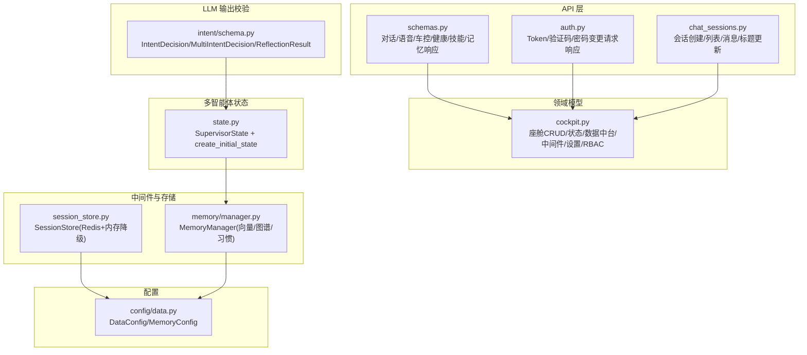

图表来源
- [backend_design/nexus/models/schemas.py:1-88](file://backend_design/nexus/models/schemas.py#L1-L88)
- [backend_design/nexus/models/cockpit.py:1-214](file://backend_design/nexus/models/cockpit.py#L1-L214)
- [backend_design/nexus/models/state.py:1-165](file://backend_design/nexus/models/state.py#L1-L165)
- [backend_design/nexus/intent/schema.py:1-160](file://backend_design/nexus/intent/schema.py#L1-L160)
- [backend_design/nexus/api/routes/auth.py:1-194](file://backend_design/nexus/api/routes/auth.py#L1-L194)
- [backend_design/nexus/api/routes/chat_sessions.py:1-534](file://backend_design/nexus/api/routes/chat_sessions.py#L1-L534)
- [backend_design/nexus/middleware/session_store.py:1-294](file://backend_design/nexus/middleware/session_store.py#L1-L294)
- [backend_design/nexus/memory/manager.py:1-583](file://backend_design/nexus/memory/manager.py#L1-L583)
- [backend_design/nexus/config/data.py:1-63](file://backend_design/nexus/config/data.py#L1-L63)

章节来源
- [backend_design/nexus/models/schemas.py:1-88](file://backend_design/nexus/models/schemas.py#L1-L88)
- [backend_design/nexus/models/cockpit.py:1-214](file://backend_design/nexus/models/cockpit.py#L1-L214)
- [backend_design/nexus/models/state.py:1-165](file://backend_design/nexus/models/state.py#L1-L165)
- [backend_design/nexus/intent/schema.py:1-160](file://backend_design/nexus/intent/schema.py#L1-L160)
- [backend_design/nexus/api/routes/auth.py:1-194](file://backend_design/nexus/api/routes/auth.py#L1-L194)
- [backend_design/nexus/api/routes/chat_sessions.py:1-534](file://backend_design/nexus/api/routes/chat_sessions.py#L1-L534)
- [backend_design/nexus/middleware/session_store.py:1-294](file://backend_design/nexus/middleware/session_store.py#L1-L294)
- [backend_design/nexus/memory/manager.py:1-583](file://backend_design/nexus/memory/manager.py#L1-L583)
- [backend_design/nexus/config/data.py:1-63](file://backend_design/nexus/config/data.py#L1-L63)

## 核心组件
- API Schema（schemas.py）
  - ChatRequest/ChatResponse：文本对话请求/响应，含 user_id、session_id、stream、延迟、元数据、意图、动作、追踪ID等
  - VoiceRequest/VoiceResponse：语音识别与回复
  - VehicleCommandRequest/Response：车控命令及结果
  - HealthResponse/SkillListResponse/MemoryResponse：健康检查、技能列表、记忆查询
- 领域模型（cockpit.py）
  - CockpitCreate/Update/Response/List：座舱注册、更新、信息、列表
  - CockpitStatusResponse：座舱状态（含车辆状态与指标）
  - DataPlatformOverview/CockpitComparison/AlertRecord/AgentActivityRecord：数据中台概览、对比、告警、活动记录
  - MiddlewareStatus：中间件状态
  - UserCreateRequest/UserResponse：用户注册与响应
  - RBACRole/ROLE_PERMISSIONS/check_permission：角色与权限映射与校验
- 多智能体状态（state.py）
  - SupervisorState：TypedDict 定义，结合 Annotated reducer（list add、dict merge_dict），涵盖输入、记忆召回、路由、专家输出、工具调用、对话历史、最终输出、可观测性
  - create_initial_state：统一初始化入口，确保 reducer 字段初始值正确
- LLM 输出 Schema（intent/schema.py）
  - IntentDecision/MultiIntentDecision/ReflectionResult：意图决策、多意图决策、反思结果
  - parse_intent_decision/parse_multi_intent_decision/parse_reflection_result：安全解析函数，支持清理与兼容格式
- 认证接口（auth.py）
  - TokenRequest/TokenResponse、ChangePasswordRequest、SendCodeRequest/SendCodeResponse、ResetPasswordByCodeRequest：认证相关请求/响应
- 会话管理（chat_sessions.py）
  - CreateSessionRequest/SessionResponse/SessionListResponse/UpdateTitleRequest：会话创建、列表、消息获取、标题更新
- 会话存储（session_store.py）
  - SessionStore：Redis 优先，内存降级；支持会话历史与滚动摘要的存取、TTL 续期、删除、列出活跃会话
- 记忆管理（memory/manager.py）
  - MemoryManager：三路召回（向量+图谱+BM25）+ Rerank；渐进式披露；用户习惯注入；会话级记忆清理；后台定时清理过期向量
- 配置（config/data.py）
  - DataConfig：数据目录路径
  - MemoryConfig：压缩阈值、保留轮次、摘要长度、历史长度、上下文 token 比例与硬上限

章节来源
- [backend_design/nexus/models/schemas.py:1-88](file://backend_design/nexus/models/schemas.py#L1-L88)
- [backend_design/nexus/models/cockpit.py:1-214](file://backend_design/nexus/models/cockpit.py#L1-L214)
- [backend_design/nexus/models/state.py:1-165](file://backend_design/nexus/models/state.py#L1-L165)
- [backend_design/nexus/intent/schema.py:1-160](file://backend_design/nexus/intent/schema.py#L1-L160)
- [backend_design/nexus/api/routes/auth.py:1-194](file://backend_design/nexus/api/routes/auth.py#L1-L194)
- [backend_design/nexus/api/routes/chat_sessions.py:1-534](file://backend_design/nexus/api/routes/chat_sessions.py#L1-L534)
- [backend_design/nexus/middleware/session_store.py:1-294](file://backend_design/nexus/middleware/session_store.py#1-L294)
- [backend_design/nexus/memory/manager.py:1-583](file://backend_design/nexus/memory/manager.py#L1-L583)
- [backend_design/nexus/config/data.py:1-63](file://backend_design/nexus/config/data.py#L1-L63)

## 架构总览
下图展示从 API 到领域模型、状态与存储的整体交互：

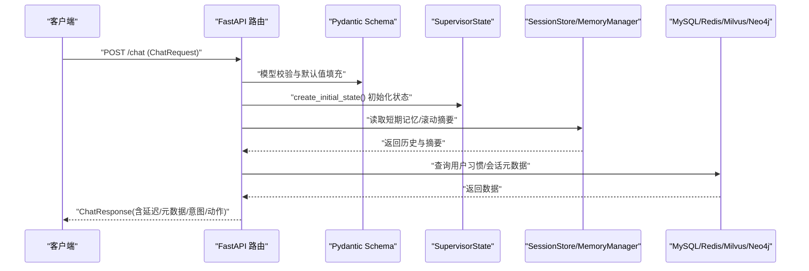

图表来源
- [backend_design/nexus/models/schemas.py:19-38](file://backend_design/nexus/models/schemas.py#L19-L38)
- [backend_design/nexus/models/state.py:108-165](file://backend_design/nexus/models/state.py#L108-L165)
- [backend_design/nexus/middleware/session_store.py:91-114](file://backend_design/nexus/middleware/session_store.py#L91-L114)
- [backend_design/nexus/memory/manager.py:98-150](file://backend_design/nexus/memory/manager.py#L98-L150)

## 详细组件分析

### API Schema（schemas.py）
- 设计要点
  - 使用 Field(..., description=..., min_length=..., max_length=...) 提供强约束与文档
  - 默认值通过 default/default_factory 提供，避免 None 分支
  - 类型提示明确 str/dict/list/bool/float，配合 Pydantic v2 的类型安全
- 关键模型
  - ChatRequest/ChatResponse：对话请求/响应，含 user_id、session_id、stream、延迟、元数据、意图、动作、trace_id
  - VoiceRequest/VoiceResponse：语音识别与回复
  - VehicleCommandRequest/Response：车控命令与结果
  - HealthResponse/SkillListResponse/MemoryResponse：健康检查、技能列表、记忆查询

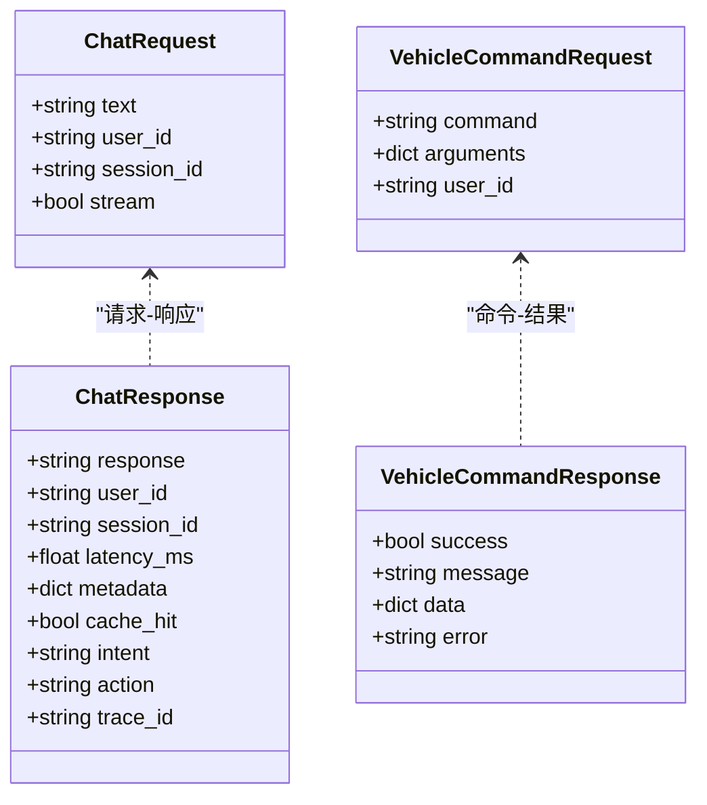

图表来源
- [backend_design/nexus/models/schemas.py:19-68](file://backend_design/nexus/models/schemas.py#L19-L68)

章节来源
- [backend_design/nexus/models/schemas.py:19-88](file://backend_design/nexus/models/schemas.py#L19-L88)

### 领域模型（cockpit.py）
- 设计要点
  - 分模块组织：座舱 CRUD/状态、数据中台、中间件、设置中心、RBAC
  - 使用 Field(description/examples) 增强文档与示例
  - check_permission(role, permission, cockpit_id) 实现细粒度权限控制
- 关键模型
  - CockpitCreateRequest/UpdateRequest/Response/ListResponse：座舱生命周期
  - CockpitStatusResponse：状态与指标
  - DataPlatformOverview/CockpitComparison/AlertRecord/AgentActivityRecord：监控与告警
  - MiddlewareStatus：中间件连接状态
  - UserCreateRequest/UserResponse：用户注册与响应
  - RBACRole/ROLE_PERMISSIONS/check_permission：角色权限映射

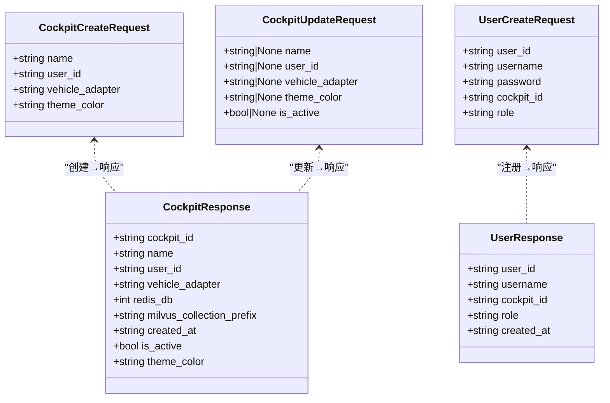

图表来源
- [backend_design/nexus/models/cockpit.py:21-57](file://backend_design/nexus/models/cockpit.py#L21-L57)
- [backend_design/nexus/models/cockpit.py:137-153](file://backend_design/nexus/models/cockpit.py#L137-L153)

章节来源
- [backend_design/nexus/models/cockpit.py:21-214](file://backend_design/nexus/models/cockpit.py#L21-L214)

### 多智能体共享状态（state.py）
- 设计要点
  - 使用 TypedDict(total=False) 表示可选字段
  - Annotated[list, add] 与 Annotated[dict, merge_dict] 实现并行写入时的自动合并
  - create_initial_state 统一初始化，确保所有 reducer 字段具备正确初始值
- 关键字段分组
  - 输入：user_input、user_id、session_id、cockpit_id
  - 记忆：recalled_memories、memory_str、habits_str、user_profile、key_context
  - 路由：intent、intent_source、need_clarification、clarification_prompt、active_experts、query_type
  - 专家输出：expert_results（累加）、search_context
  - 技能：skill_result、skill_handled、skill_action、tool_result、has_side_effect
  - 对话：history（累加）、running_summary、llm_response、_compressed_history
  - 输出：final_response、metadata（合并）
  - 可观测：trace_id、span_ids（合并）、latency_ms

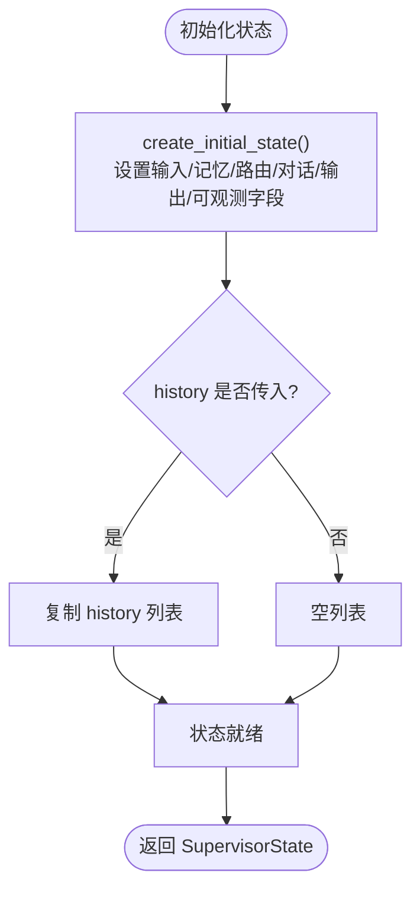

图表来源
- [backend_design/nexus/models/state.py:108-165](file://backend_design/nexus/models/state.py#L108-L165)

章节来源
- [backend_design/nexus/models/state.py:1-165](file://backend_design/nexus/models/state.py#L1-L165)

### LLM 输出 Schema（intent/schema.py）
- 设计要点
  - IntentDecision/MultiIntentDecision/ReflectionResult 严格约束 LLM 输出结构
  - parse_* 函数提供健壮解析：清理代码块、正则提取 JSON、兼容单工具格式
- 使用场景
  - 意图路由：选择技能、参数、置信度、是否需要澄清
  - 多意图：复合需求识别多个技能
  - 反思：评估回答质量并给出修正建议

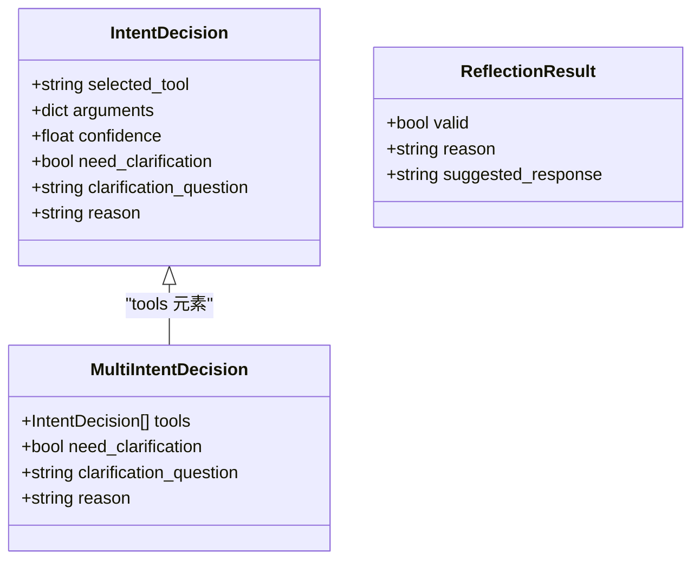

图表来源
- [backend_design/nexus/intent/schema.py:35-68](file://backend_design/nexus/intent/schema.py#L35-L68)

章节来源
- [backend_design/nexus/intent/schema.py:35-160](file://backend_design/nexus/intent/schema.py#L35-L160)

### 认证接口（auth.py）
- 设计要点
  - TokenRequest/TokenResponse：用户 ID + 密码/API Key → JWT
  - ChangePasswordRequest：旧密码与新密码（最小长度校验）
  - SendCodeRequest/SendCodeResponse：手机号校验（正则）、开发模式返回验证码
  - ResetPasswordByCodeRequest：手机号 + 验证码 + 新密码
- 流程
  - 登录签发 Token（开发模式直接签发，生产应接入数据库）
  - 发送验证码（内存存储，5分钟有效）
  - 验证码重置密码（校验有效期与匹配）

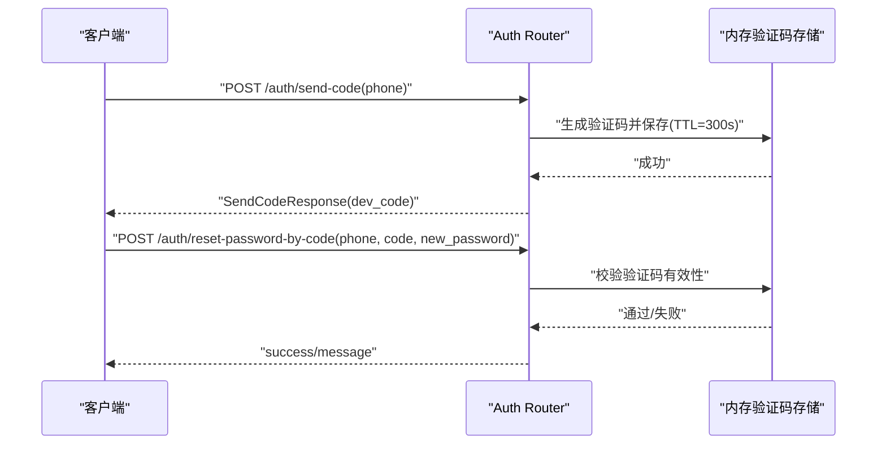

图表来源
- [backend_design/nexus/api/routes/auth.py:119-194](file://backend_design/nexus/api/routes/auth.py#L119-L194)

章节来源
- [backend_design/nexus/api/routes/auth.py:35-194](file://backend_design/nexus/api/routes/auth.py#L35-L194)

### 会话管理（chat_sessions.py）
- 设计要点
  - CreateSessionRequest/SessionResponse/SessionListResponse：会话创建与列表
  - UpdateTitleRequest：标题更新（最大长度限制）
  - 删除会话：跨存储一致性清理（MySQL、Redis、LangGraph checkpoint、Milvus、内存锁）
- 一致性自检
  - 检测孤立日志、僵尸缓存、僵尸快照、孤儿向量

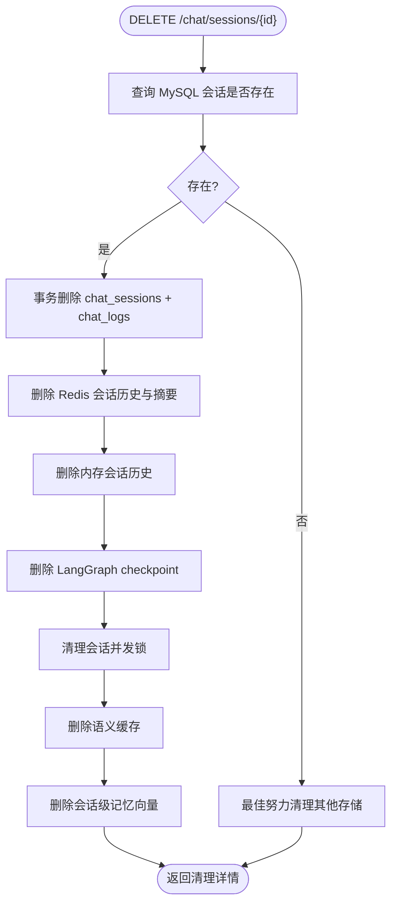

图表来源
- [backend_design/nexus/api/routes/chat_sessions.py:138-324](file://backend_design/nexus/api/routes/chat_sessions.py#L138-L324)

章节来源
- [backend_design/nexus/api/routes/chat_sessions.py:35-534](file://backend_design/nexus/api/routes/chat_sessions.py#L35-L534)

### 会话存储（session_store.py）
- 设计要点
  - Redis 优先，内存降级；TTL 自动续期；截断历史长度
  - 滚动摘要独立存储，与会话历史共享 TTL
  - 异步接口 async_get/async_set/async_delete/async_touch
- 关键方法
  - async_get：读取历史并续期
  - async_set：保存历史（截断至 max_history_len）
  - async_delete：删除历史与摘要（Redis + 内存）
  - async_get_summary/async_set_summary：滚动摘要存取

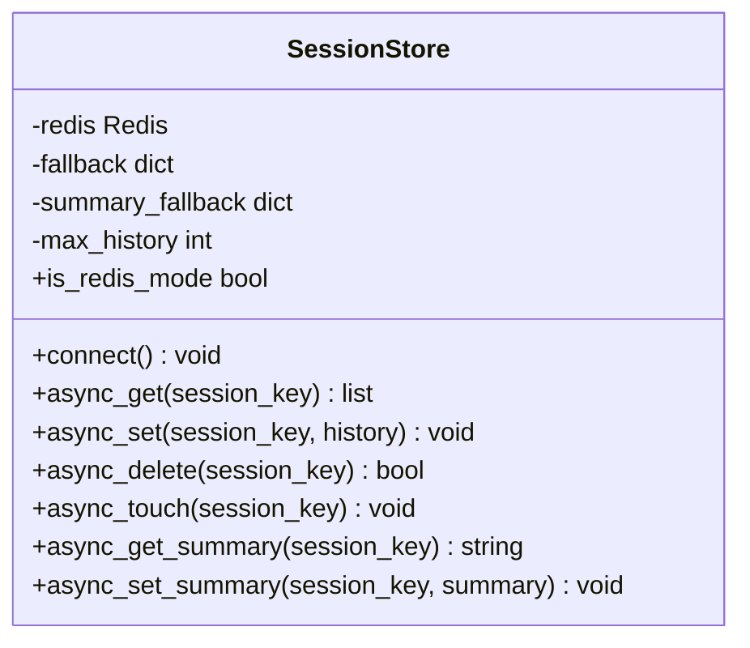

图表来源
- [backend_design/nexus/middleware/session_store.py:43-294](file://backend_design/nexus/middleware/session_store.py#L43-L294)

章节来源
- [backend_design/nexus/middleware/session_store.py:43-294](file://backend_design/nexus/middleware/session_store.py#L43-L294)

### 记忆管理（memory/manager.py）
- 设计要点
  - GraphRAGRetriever 三路召回（向量+图谱+BM25）+ Rerank
  - 渐进式披露：简单指令 top_k=3，复杂查询 top_k=8
  - 用户习惯注入：从 MySQL user_habits 加载频次加权
  - 会话级记忆清理：删除会话时联动清理 Milvus 向量
  - 后台定时清理：定期清理过期会话级向量
- 关键方法
  - recall(query, user_id, top_k)：记忆召回
  - store_from_text/store_conversation：记忆与对话向量化存储
  - delete_session_memories：会话级清理
  - cleanup_expired_session_vectors：后台清理

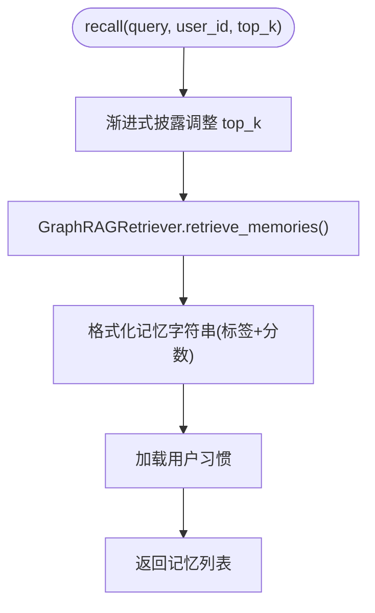

图表来源
- [backend_design/nexus/memory/manager.py:98-150](file://backend_design/nexus/memory/manager.py#L98-L150)

章节来源
- [backend_design/nexus/memory/manager.py:98-583](file://backend_design/nexus/memory/manager.py#L98-L583)

### 配置（config/data.py）
- DataConfig：数据目录路径（食物知识库、上传文件、临时文件、偏好数据）
- MemoryConfig：记忆管理参数（压缩阈值、保留轮次、摘要长度、历史长度、上下文 token 比例与硬上限）

章节来源
- [backend_design/nexus/config/data.py:15-63](file://backend_design/nexus/config/data.py#L15-L63)

## 依赖关系分析
- API Schema 依赖 Pydantic BaseModel/Field，用于请求/响应校验与文档生成
- 领域模型与 RBAC 提供权限控制与资源管理
- SupervisorState 作为多智能体共享状态，被各节点读写并通过 reducer 合并
- LLM 输出 Schema 确保结构化输出的稳定性与兼容性
- SessionStore 与 MemoryManager 分别管理短期记忆与长期记忆，依赖配置与外部存储
- 配置模块集中管理路径与行为参数，便于环境适配

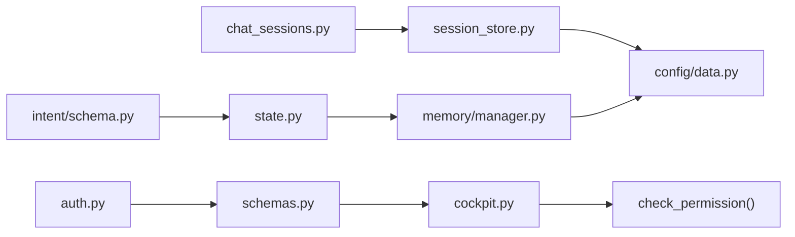

图表来源
- [backend_design/nexus/models/schemas.py:1-88](file://backend_design/nexus/models/schemas.py#L1-L88)
- [backend_design/nexus/models/cockpit.py:195-214](file://backend_design/nexus/models/cockpit.py#L195-L214)
- [backend_design/nexus/models/state.py:1-165](file://backend_design/nexus/models/state.py#L1-L165)
- [backend_design/nexus/intent/schema.py:1-160](file://backend_design/nexus/intent/schema.py#L1-L160)
- [backend_design/nexus/api/routes/auth.py:1-194](file://backend_design/nexus/api/routes/auth.py#L1-L194)
- [backend_design/nexus/api/routes/chat_sessions.py:1-534](file://backend_design/nexus/api/routes/chat_sessions.py#L1-L534)
- [backend_design/nexus/middleware/session_store.py:1-294](file://backend_design/nexus/middleware/session_store.py#L1-L294)
- [backend_design/nexus/memory/manager.py:1-583](file://backend_design/nexus/memory/manager.py#L1-L583)
- [backend_design/nexus/config/data.py:1-63](file://backend_design/nexus/config/data.py#L1-L63)

章节来源
- [backend_design/nexus/models/schemas.py:1-88](file://backend_design/nexus/models/schemas.py#L1-L88)
- [backend_design/nexus/models/cockpit.py:1-214](file://backend_design/nexus/models/cockpit.py#L1-L214)
- [backend_design/nexus/models/state.py:1-165](file://backend_design/nexus/models/state.py#L1-L165)
- [backend_design/nexus/intent/schema.py:1-160](file://backend_design/nexus/intent/schema.py#L1-L160)
- [backend_design/nexus/api/routes/auth.py:1-194](file://backend_design/nexus/api/routes/auth.py#L1-L194)
- [backend_design/nexus/api/routes/chat_sessions.py:1-534](file://backend_design/nexus/api/routes/chat_sessions.py#L1-L534)
- [backend_design/nexus/middleware/session_store.py:1-294](file://backend_design/nexus/middleware/session_store.py#L1-L294)
- [backend_design/nexus/memory/manager.py:1-583](file://backend_design/nexus/memory/manager.py#L1-L583)
- [backend_design/nexus/config/data.py:1-63](file://backend_design/nexus/config/data.py#L1-L63)

## 性能考虑
- 会话历史截断：SessionStore 仅保留最近 max_history_len 条，减少内存与网络开销
- 渐进式披露：MemoryManager 根据查询复杂度动态调整 top_k，降低召回成本
- 异步与降级：SessionStore 在 Redis 不可用时自动降级为内存，保障可用性
- 后台任务：MemoryManager 启动定时清理任务，避免长期运行导致数据膨胀
- 字段默认值与工厂：大量使用 default_factory 避免可变默认值陷阱

## 故障排查指南
- 会话删除不一致
  - 现象：删除后仍有残留缓存或向量
  - 排查：使用一致性自检接口扫描孤立日志、僵尸缓存、僵尸快照、孤儿向量
  - 解决：执行建议的清理 SQL 或调用对应清理方法
- 验证码失效
  - 现象：重置密码时报“验证码已过期”
  - 排查：检查内存存储中的 TTL（默认 300 秒）
  - 解决：重新获取验证码
- 记忆存储失败
  - 现象：后台任务记录异常
  - 排查：查看 MemoryManager 的 _task_done_callback 日志
  - 解决：检查 Milvus/Neo4j 连接与权限，必要时重试或回滚

章节来源
- [backend_design/nexus/api/routes/chat_sessions.py:404-534](file://backend_design/nexus/api/routes/chat_sessions.py#L404-L534)
- [backend_design/nexus/api/routes/auth.py:119-194](file://backend_design/nexus/api/routes/auth.py#L119-L194)
- [backend_design/nexus/memory/manager.py:419-428](file://backend_design/nexus/memory/manager.py#L419-L428)

## 结论
NexusCockpit 的数据模型与 Schema 系统以 Pydantic 为核心，结合 TypedDict 与 Annotated reducer 实现了强类型、可扩展且高可靠的状态管理。API Schema 与领域模型清晰分离，中间件与存储层提供弹性与容错。通过严格的字段验证、默认值策略与自定义解析函数，系统在保持向后兼容的同时，提供了良好的扩展性与可维护性。

## 附录
- 数据转换与序列化示例
  - 请求校验：使用 Pydantic 模型接收并校验请求体，自动返回错误信息
  - 响应构造：基于 Response 模型构造响应，确保字段完整与类型安全
  - LLM 输出解析：使用 parse_intent_decision/parse_multi_intent_decision/parse_reflection_result 安全解析
- 模型版本管理与迁移策略
  - 新增字段：使用 Optional 类型与默认值保证向后兼容
  - 废弃字段：标记注释并逐步移除，避免破坏现有客户端
  - 数据迁移：通过脚本或接口批量更新历史数据，确保一致性
- 最佳实践
  - 使用 Field(description/examples) 增强文档
  - 避免可变默认值，使用 default_factory
  - 对 LLM 输出进行严格校验与兼容处理
  - 在关键路径添加日志与异常捕获，便于问题定位