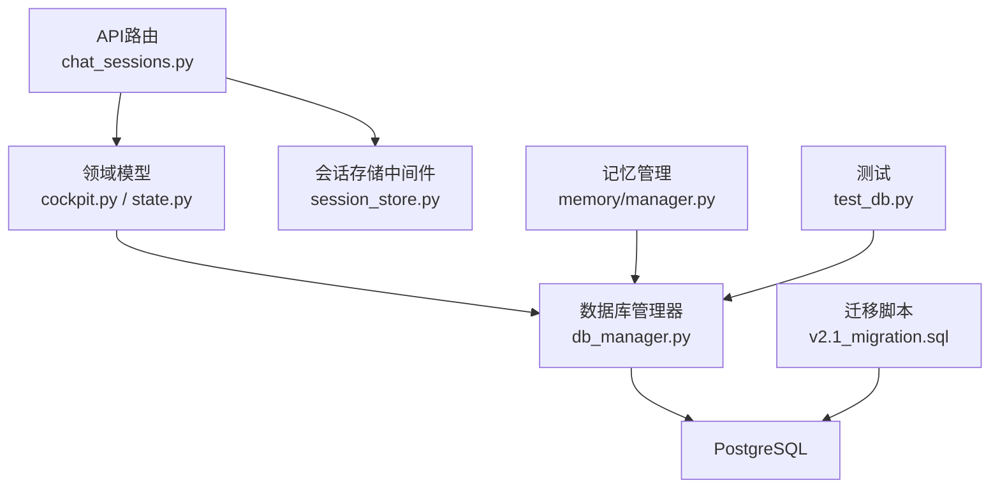
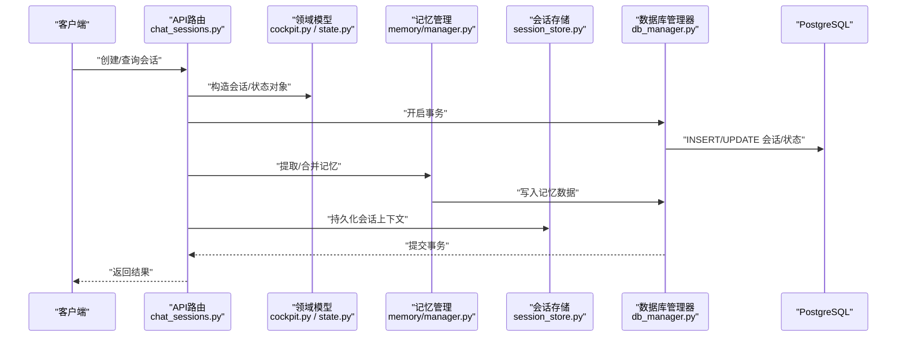
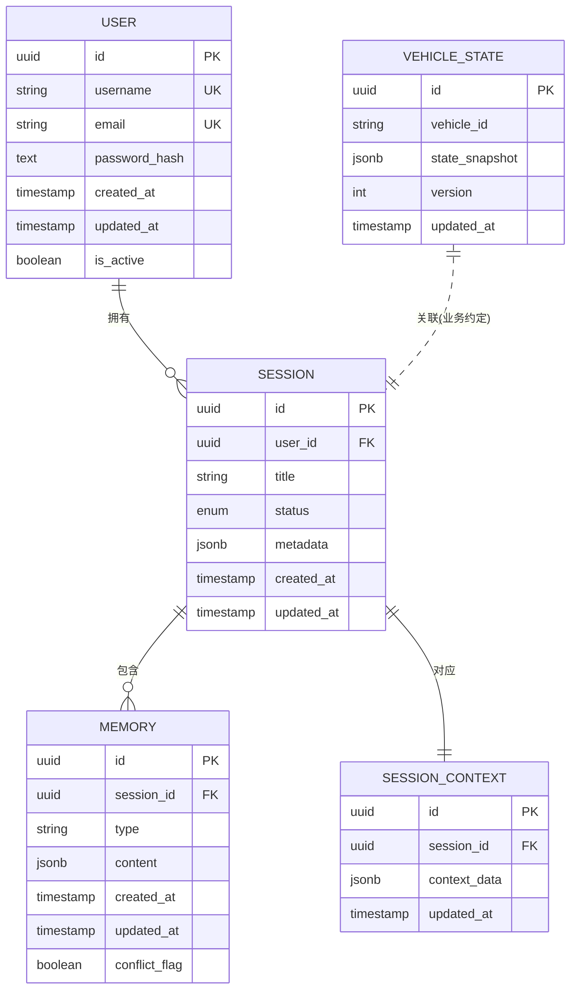
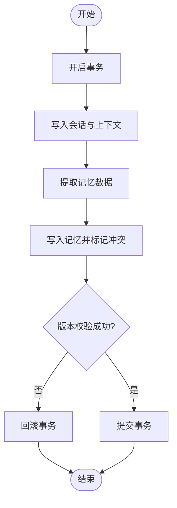
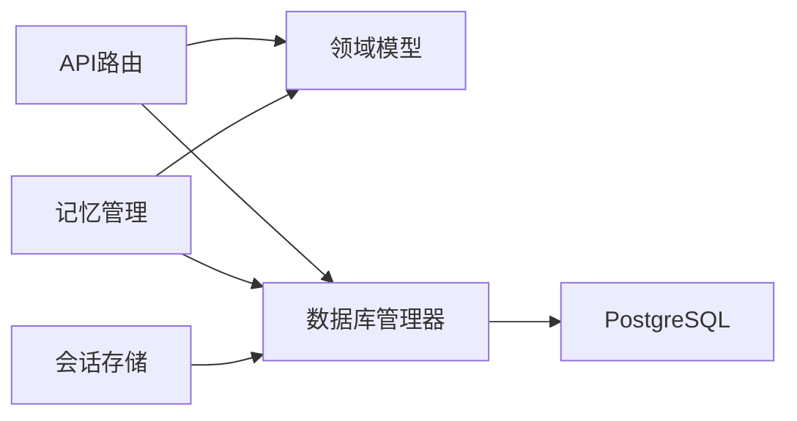

# 关系型数据库设计

<cite>
**本文引用的文件**   
- [backend_design/nexus/core/db_manager.py](file://backend_design/nexus/core/db_manager.py)
- [backend_design/nexus/models/cockpit.py](file://backend_design/nexus/models/cockpit.py)
- [backend_design/nexus/models/state.py](file://backend_design/nexus/models/state.py)
- [backend_design/nexus/memory/manager.py](file://backend_design/nexus/memory/manager.py)
- [backend_design/nexus/api/routes/chat_sessions.py](file://backend_design/nexus/api/routes/chat_sessions.py)
- [backend_design/nexus/middleware/session_store.py](file://backend_design/nexus/middleware/session_store.py)
- [backend_design/scripts/v2.1_migration.sql](file://backend_design/scripts/v2.1_migration.sql)
- [backend_design/tests/test_db.py](file://backend_design/tests/test_db.py)
- [backend_design/pyproject.toml](file://backend_design/pyproject.toml)
- [docker-compose.yml](file://docker-compose.yml)
</cite>

## 目录
1. [简介](#简介)
2. [项目结构](#项目结构)
3. [核心组件](#核心组件)
4. [架构总览](#架构总览)
5. [详细组件分析](#详细组件分析)
6. [依赖分析](#依赖分析)
7. [性能考虑](#性能考虑)
8. [故障排查指南](#故障排查指南)
9. [结论](#结论)
10. [附录](#附录)

## 简介
本技术文档聚焦于NexusCockpit项目的关系型数据库设计，围绕PostgreSQL的表结构与数据模型展开，覆盖用户、会话、车辆状态、记忆数据等核心实体。文档从字段定义、数据类型选择、主外键与约束、索引策略、查询优化、事务与一致性保证、连接池配置、迁移脚本与版本管理、备份恢复与灾难恢复等方面提供系统化说明，帮助读者快速理解并高效使用数据库子系统。

## 项目结构
本项目采用分层组织：API路由层负责请求处理，领域模型层定义数据对象，持久化层通过数据库管理器访问PostgreSQL，中间件层提供会话存储能力，测试与脚本用于验证与迁移。下图展示与数据库相关的关键模块及其职责。

图表来源
- [backend_design/nexus/api/routes/chat_sessions.py](file://backend_design/nexus/api/routes/chat_sessions.py)
- [backend_design/nexus/models/cockpit.py](file://backend_design/nexus/models/cockpit.py)
- [backend_design/nexus/models/state.py](file://backend_design/nexus/models/state.py)
- [backend_design/nexus/core/db_manager.py](file://backend_design/nexus/core/db_manager.py)
- [backend_design/nexus/memory/manager.py](file://backend_design/nexus/memory/manager.py)
- [backend_design/nexus/middleware/session_store.py](file://backend_design/nexus/middleware/session_store.py)
- [backend_design/scripts/v2.1_migration.sql](file://backend_design/scripts/v2.1_migration.sql)
- [backend_design/tests/test_db.py](file://backend_design/tests/test_db.py)

章节来源
- [backend_design/nexus/core/db_manager.py](file://backend_design/nexus/core/db_manager.py)
- [backend_design/nexus/models/cockpit.py](file://backend_design/nexus/models/cockpit.py)
- [backend_design/nexus/models/state.py](file://backend_design/nexus/models/state.py)
- [backend_design/nexus/memory/manager.py](file://backend_design/nexus/memory/manager.py)
- [backend_design/nexus/api/routes/chat_sessions.py](file://backend_design/nexus/api/routes/chat_sessions.py)
- [backend_design/nexus/middleware/session_store.py](file://backend_design/nexus/middleware/session_store.py)
- [backend_design/scripts/v2.1_migration.sql](file://backend_design/scripts/v2.1_migration.sql)
- [backend_design/tests/test_db.py](file://backend_design/tests/test_db.py)

## 核心组件
- 数据库管理器：封装连接池、事务边界、SQL执行与结果映射，为上层提供一致的持久化接口。
- 领域模型：以Python对象表达用户、会话、车辆状态、记忆数据等实体，驱动ORM或SQL构建。
- 记忆管理：对记忆数据进行抽取、冲突解决与持久化，确保跨会话的一致性。
- 会话存储中间件：在请求生命周期内维护会话上下文，必要时落库以保证可靠性。
- API路由：将HTTP请求转换为领域操作，调用模型与数据库管理器完成读写。

章节来源
- [backend_design/nexus/core/db_manager.py](file://backend_design/nexus/core/db_manager.py)
- [backend_design/nexus/models/cockpit.py](file://backend_design/nexus/models/cockpit.py)
- [backend_design/nexus/models/state.py](file://backend_design/nexus/models/state.py)
- [backend_design/nexus/memory/manager.py](file://backend_design/nexus/memory/manager.py)
- [backend_design/nexus/middleware/session_store.py](file://backend_design/nexus/middleware/session_store.py)
- [backend_design/nexus/api/routes/chat_sessions.py](file://backend_design/nexus/api/routes/chat_sessions.py)

## 架构总览
下图展示了从API到数据库的整体数据流，包括会话上下文、记忆写入与状态更新路径。

图表来源
- [backend_design/nexus/api/routes/chat_sessions.py](file://backend_design/nexus/api/routes/chat_sessions.py)
- [backend_design/nexus/models/cockpit.py](file://backend_design/nexus/models/cockpit.py)
- [backend_design/nexus/models/state.py](file://backend_design/nexus/models/state.py)
- [backend_design/nexus/memory/manager.py](file://backend_design/nexus/memory/manager.py)
- [backend_design/nexus/middleware/session_store.py](file://backend_design/nexus/middleware/session_store.py)
- [backend_design/nexus/core/db_manager.py](file://backend_design/nexus/core/db_manager.py)

## 详细组件分析

### 数据模型与表结构设计
本节基于领域模型与记忆管理模块，梳理核心实体的字段定义、类型选择、主外键与约束。

- 用户（User）
  - 字段建议：id（UUID，主键）、username（唯一）、email（唯一）、password_hash、created_at、updated_at、is_active。
  - 类型选择：UUID作为主键避免自增ID碰撞；时间戳使用带时区类型；布尔标记启用/禁用。
  - 约束：唯一性约束保障身份不重复；非空约束保障必要信息完整。
  - 索引：username、email建立唯一索引；常用查询条件列建立普通索引。

- 会话（Session）
  - 字段建议：id（UUID，主键）、user_id（外键→用户）、title、status、created_at、updated_at、metadata（JSONB）。
  - 类型选择：JSONB承载扩展属性，便于灵活演进。
  - 约束：user_id外键关联用户；status枚举值限制合法状态。
  - 索引：user_id、status、created_at复合索引支持按用户与时间范围查询。

- 车辆状态（VehicleState）
  - 字段建议：id（UUID，主键）、vehicle_id、state_snapshot（JSONB）、updated_at、version。
  - 类型选择：JSONB保存动态状态快照；version用于乐观锁。
  - 约束：vehicle_id+updated_at联合唯一可防止并发覆盖；version参与更新条件实现CAS。
  - 索引：vehicle_id、updated_at索引支持最近状态检索。

- 记忆数据（Memory）
  - 字段建议：id（UUID，主键）、session_id（外键→会话）、type、content（JSONB）、created_at、updated_at、conflict_flag。
  - 类型选择：JSONB存储结构化记忆片段；conflict_flag标记冲突待解决。
  - 约束：session_id外键；type限定记忆类别；冲突标志触发后续合并流程。
  - 索引：session_id、type、created_at复合索引支持按会话与时间检索。

- 会话上下文（SessionContext）
  - 字段建议：id（UUID，主键）、session_id（外键→会话）、context_data（JSONB）、updated_at。
  - 用途：记录对话上下文、偏好、临时变量等，供后续轮次复用。
  - 索引：session_id唯一索引保证一对一；updated_at用于清理过期上下文。

图表来源
- [backend_design/nexus/models/cockpit.py](file://backend_design/nexus/models/cockpit.py)
- [backend_design/nexus/models/state.py](file://backend_design/nexus/models/state.py)
- [backend_design/nexus/memory/manager.py](file://backend_design/nexus/memory/manager.py)
- [backend_design/nexus/middleware/session_store.py](file://backend_design/nexus/middleware/session_store.py)

章节来源
- [backend_design/nexus/models/cockpit.py](file://backend_design/nexus/models/cockpit.py)
- [backend_design/nexus/models/state.py](file://backend_design/nexus/models/state.py)
- [backend_design/nexus/memory/manager.py](file://backend_design/nexus/memory/manager.py)
- [backend_design/nexus/middleware/session_store.py](file://backend_design/nexus/middleware/session_store.py)

### 索引策略与查询优化
- 单列索引
  - 用户：username、email唯一索引。
  - 会话：user_id、status、created_at。
  - 记忆：session_id、type、created_at。
  - 车辆状态：vehicle_id、updated_at。
- 复合索引
  - 会话(user_id, status, created_at)：支持“某用户某状态时间段”查询。
  - 记忆(session_id, type, created_at)：支持“某会话某类记忆时间段”查询。
- JSONB索引
  - 针对metadata、state_snapshot、content中高频查询键建立GIN或表达式索引。
- 查询优化
  - 使用EXPLAIN ANALYZE定位慢查询。
  - 分页采用游标或基于时间戳的偏移，避免深分页。
  - 批量写入使用COPY或多行INSERT减少往返。
  - 热点读加缓存层（如Redis），写后失效。

章节来源
- [backend_design/nexus/core/db_manager.py](file://backend_design/nexus/core/db_manager.py)
- [backend_design/nexus/memory/manager.py](file://backend_design/nexus/memory/manager.py)

### 事务处理机制与数据一致性
- 事务边界
  - 会话创建与初始上下文写入在同一事务内提交。
  - 记忆写入与冲突标记更新在同一事务内，失败回滚。
- 一致性保证
  - 外键约束保证引用完整性。
  - 乐观锁（version字段）避免并发覆盖。
  - 唯一约束与检查约束保证域规则。
- 重试与幂等
  - 对网络抖动导致的短暂失败进行有限重试。
  - 幂等键（如session_id+operation）避免重复写入。

图表来源
- [backend_design/nexus/core/db_manager.py](file://backend_design/nexus/core/db_manager.py)
- [backend_design/nexus/memory/manager.py](file://backend_design/nexus/memory/manager.py)

章节来源
- [backend_design/nexus/core/db_manager.py](file://backend_design/nexus/core/db_manager.py)
- [backend_design/nexus/memory/manager.py](file://backend_design/nexus/memory/manager.py)

### 数据库连接池配置与性能调优
- 连接池参数
  - 最大连接数：根据CPU核数与I/O特性设置，避免过多导致上下文切换。
  - 最小空闲连接：保持一定预热连接，降低冷启动延迟。
  - 连接超时与空闲回收：防止僵尸连接占用资源。
- PostgreSQL服务端调优
  - shared_buffers、work_mem、maintenance_work_mem依据内存规模调整。
  - effective_cache_size接近可用内存比例。
  - wal_level与checkpoint_timeout平衡吞吐与恢复速度。
- 应用侧优化
  - 预编译语句减少解析开销。
  - 批量操作与事务合并减少往返。
  - 合理分页与只取必要列。

章节来源
- [backend_design/nexus/core/db_manager.py](file://backend_design/nexus/core/db_manager.py)
- [docker-compose.yml](file://docker-compose.yml)

### 数据迁移脚本与版本管理
- 迁移脚本
  - v2.1迁移脚本用于DDL变更与数据修复，遵循幂等原则。
- 版本管理策略
  - 每次发布前评审迁移脚本，确保可回滚。
  - 生产环境灰度执行，监控错误率与延迟。
  - 记录迁移元数据，支持断点续跑。

章节来源
- [backend_design/scripts/v2.1_migration.sql](file://backend_design/scripts/v2.1_migration.sql)

### 备份恢复与灾难恢复
- 备份策略
  - 全量备份：每日一次pg_dump或物理备份工具。
  - 增量备份：基于WAL归档，缩短RPO。
- 恢复演练
  - 定期在隔离环境演练恢复流程，验证RTO。
- 高可用
  - 主从复制与自动故障转移，结合健康检查与熔断降级。

章节来源
- [docker-compose.yml](file://docker-compose.yml)

## 依赖分析
- 模块耦合
  - API路由依赖领域模型与数据库管理器。
  - 记忆管理依赖数据库管理器与领域模型。
  - 会话存储中间件依赖数据库管理器与会话模型。
- 外部依赖
  - PostgreSQL作为关系型存储。
  - 可选缓存与消息队列用于扩展。

图表来源
- [backend_design/nexus/api/routes/chat_sessions.py](file://backend_design/nexus/api/routes/chat_sessions.py)
- [backend_design/nexus/models/cockpit.py](file://backend_design/nexus/models/cockpit.py)
- [backend_design/nexus/models/state.py](file://backend_design/nexus/models/state.py)
- [backend_design/nexus/memory/manager.py](file://backend_design/nexus/memory/manager.py)
- [backend_design/nexus/middleware/session_store.py](file://backend_design/nexus/middleware/session_store.py)
- [backend_design/nexus/core/db_manager.py](file://backend_design/nexus/core/db_manager.py)

章节来源
- [backend_design/nexus/api/routes/chat_sessions.py](file://backend_design/nexus/api/routes/chat_sessions.py)
- [backend_design/nexus/models/cockpit.py](file://backend_design/nexus/models/cockpit.py)
- [backend_design/nexus/models/state.py](file://backend_design/nexus/models/state.py)
- [backend_design/nexus/memory/manager.py](file://backend_design/nexus/memory/manager.py)
- [backend_design/nexus/middleware/session_store.py](file://backend_design/nexus/middleware/session_store.py)
- [backend_design/nexus/core/db_manager.py](file://backend_design/nexus/core/db_manager.py)

## 性能考虑
- 索引命中与覆盖索引：尽量让查询仅扫描必要列。
- 分区表：对大表（如记忆、日志）按时间分区提升维护与查询效率。
- 物化视图：对复杂聚合结果缓存，定时刷新。
- 连接复用与批处理：减少连接创建与网络往返。
- 监控与告警：慢查询日志、锁等待、连接池饱和告警。

[本节为通用指导，无需特定文件来源]

## 故障排查指南
- 常见问题
  - 连接池耗尽：检查最大连接数与泄漏，查看活跃连接与等待队列。
  - 死锁：分析事务顺序与锁粒度，必要时拆分事务。
  - 慢查询：使用EXPLAIN ANALYZE定位缺失索引或低效计划。
- 诊断工具
  - 启用pg_stat_statements统计热点SQL。
  - 使用pg_locks与pg_stat_activity观察锁与活动会话。
- 回归测试
  - 通过测试套件验证关键路径与异常分支。

章节来源
- [backend_design/tests/test_db.py](file://backend_design/tests/test_db.py)
- [backend_design/nexus/core/db_manager.py](file://backend_design/nexus/core/db_manager.py)

## 结论
本设计围绕用户、会话、车辆状态与记忆数据四大核心实体，构建了清晰的数据模型与一致的事务边界。通过合理的索引策略、连接池配置与迁移版本管理，兼顾了可扩展性与稳定性。配合完善的备份恢复与监控体系，可在生产环境中稳健运行。

[本节为总结性内容，无需特定文件来源]

## 附录
- 依赖与环境
  - Python依赖与包管理由pyproject.toml声明。
  - Docker Compose编排服务与数据库实例。

章节来源
- [backend_design/pyproject.toml](file://backend_design/pyproject.toml)
- [docker-compose.yml](file://docker-compose.yml)