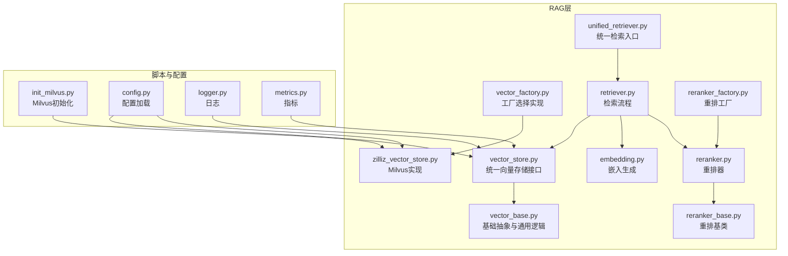
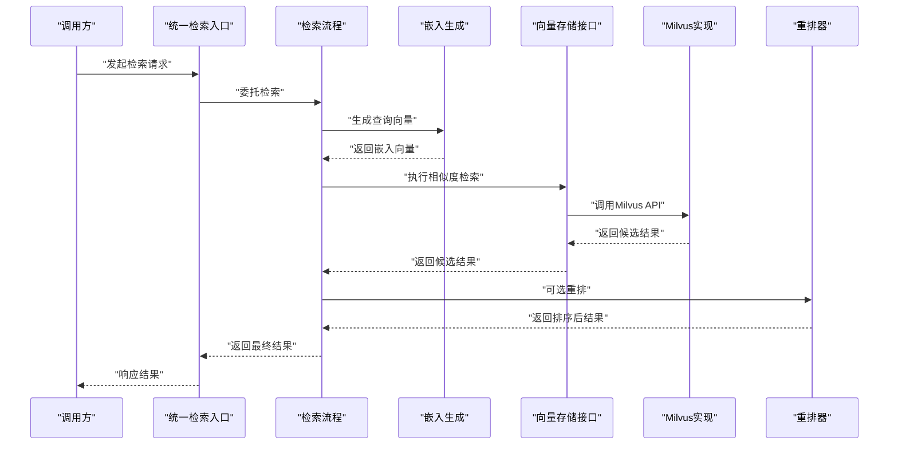
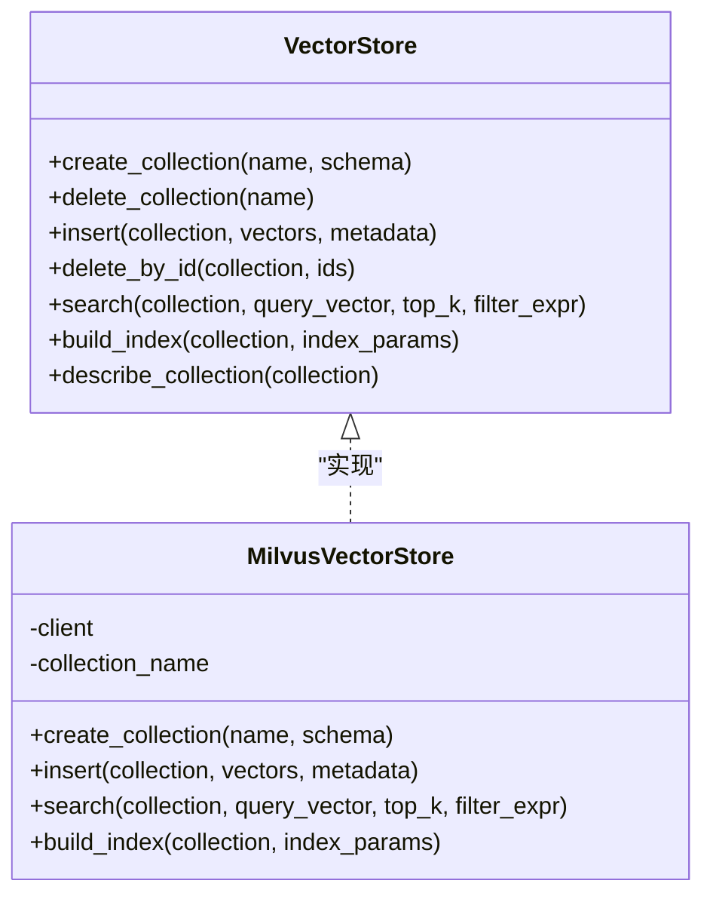
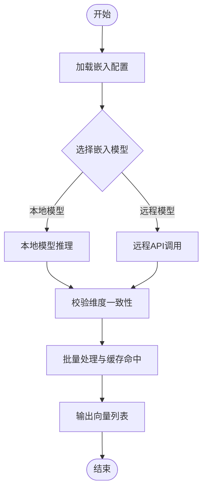
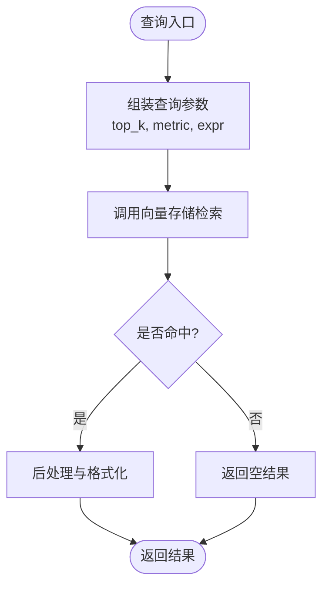
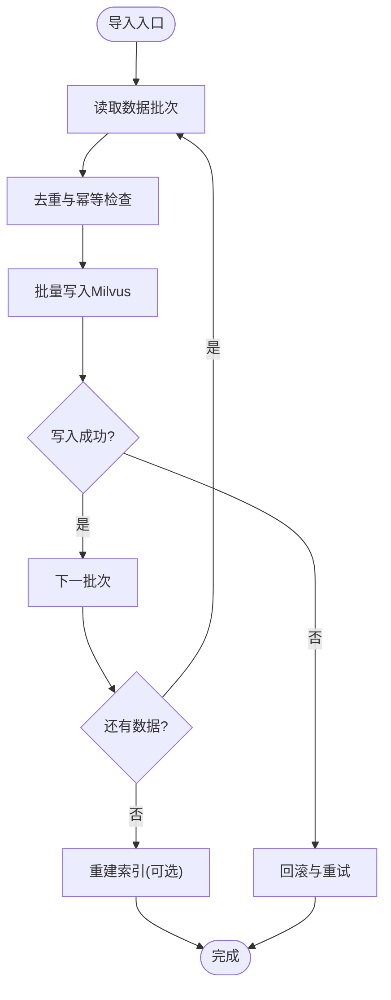
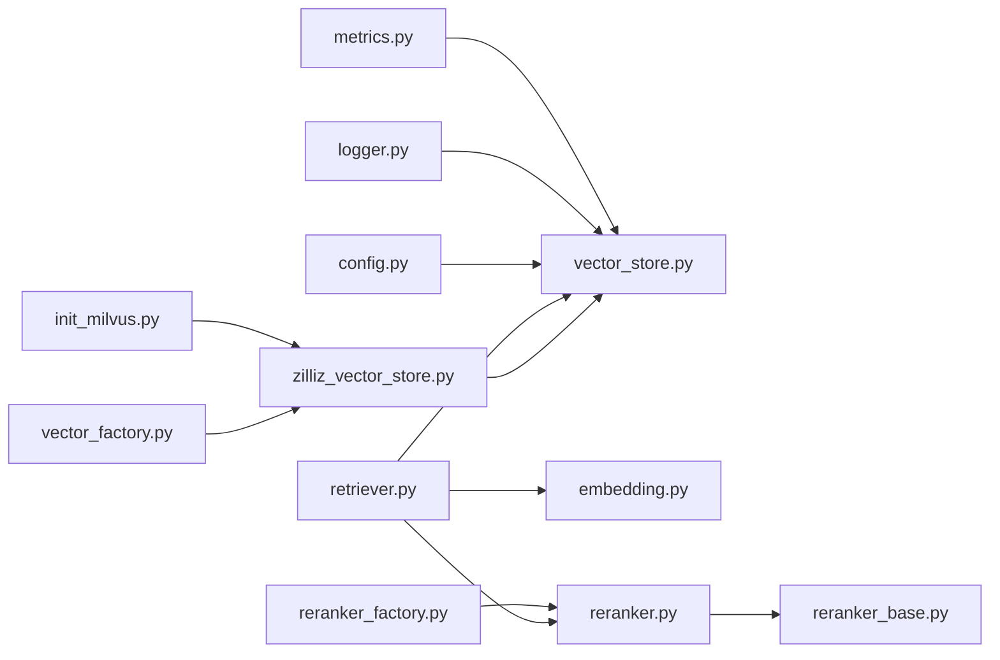

# 向量数据库设计

<cite>
**本文引用的文件**   
- [backend_design/nexus/rag/vector_store.py](file://backend_design/nexus/rag/vector_store.py)
- [backend_design/nexus/rag/zilliz_vector_store.py](file://backend_design/nexus/rag/zilliz_vector_store.py)
- [backend_design/nexus/rag/vector_base.py](file://backend_design/nexus/rag/vector_base.py)
- [backend_design/nexus/rag/vector_factory.py](file://backend_design/nexus/rag/vector_factory.py)
- [backend_design/nexus/rag/embedding.py](file://backend_design/nexus/rag/embedding.py)
- [backend_design/nexus/rag/retriever.py](file://backend_design/nexus/rag/retriever.py)
- [backend_design/nexus/rag/unified_retriever.py](file://backend_design/nexus/rag/unified_retriever.py)
- [backend_design/nexus/rag/reranker.py](file://backend_design/nexus/rag/reranker.py)
- [backend_design/nexus/rag/reranker_base.py](file://backend_design/nexus/rag/reranker_base.py)
- [backend_design/nexus/rag/reranker_factory.py](file://backend_design/nexus/rag/reranker_factory.py)
- [scripts/init_milvus.py](file://scripts/init_milvus.py)
- [backend_design/nexus/config.py](file://backend_design/nexus/config.py)
- [backend_design/nexus/core/logger.py](file://backend_design/nexus/core/logger.py)
- [backend_design/nexus/observability/metrics.py](file://backend_design/nexus/observability/metrics.py)
</cite>

## 目录
1. [简介](#简介)
2. [项目结构](#项目结构)
3. [核心组件](#核心组件)
4. [架构总览](#架构总览)
5. [详细组件分析](#详细组件分析)
6. [依赖关系分析](#依赖关系分析)
7. [性能考量](#性能考量)
8. [故障排查指南](#故障排查指南)
9. [结论](#结论)
10. [附录](#附录)

## 简介
本技术文档围绕向量数据库设计与实现，聚焦于Milvus在系统中的存储架构与索引策略、向量嵌入的生成算法与维度选择、相似度搜索的实现原理与性能优化、批量导入与增量更新机制、检索参数配置与结果过滤方法、数据生命周期管理与存储空间优化，以及监控指标与故障排查。文档面向具备不同技术背景的读者，提供从高层架构到代码级实现的系统化说明，并辅以可视化图示帮助理解。

## 项目结构
本项目在后端RAG（检索增强生成）模块中抽象了统一的向量存储接口，并通过工厂模式动态选择具体实现。当前仓库包含Milvus的具体实现类，同时预留了其他向量库扩展点。关键目录与职责如下：
- RAG层：封装向量存储、检索、重排等能力，屏蔽底层差异
- 脚本层：提供Milvus初始化脚本
- 配置与可观测性：集中管理配置项与指标采集

图表来源
- [backend_design/nexus/rag/vector_store.py](file://backend_design/nexus/rag/vector_store.py)
- [backend_design/nexus/rag/zilliz_vector_store.py](file://backend_design/nexus/rag/zilliz_vector_store.py)
- [backend_design/nexus/rag/vector_base.py](file://backend_design/nexus/rag/vector_base.py)
- [backend_design/nexus/rag/vector_factory.py](file://backend_design/nexus/rag/vector_factory.py)
- [backend_design/nexus/rag/embedding.py](file://backend_design/nexus/rag/embedding.py)
- [backend_design/nexus/rag/retriever.py](file://backend_design/nexus/rag/retriever.py)
- [backend_design/nexus/rag/unified_retriever.py](file://backend_design/nexus/rag/unified_retriever.py)
- [backend_design/nexus/rag/reranker.py](file://backend_design/nexus/rag/reranker.py)
- [backend_design/nexus/rag/reranker_base.py](file://backend_design/nexus/rag/reranker_base.py)
- [backend_design/nexus/rag/reranker_factory.py](file://backend_design/nexus/rag/reranker_factory.py)
- [scripts/init_milvus.py](file://scripts/init_milvus.py)
- [backend_design/nexus/config.py](file://backend_design/nexus/config.py)
- [backend_design/nexus/core/logger.py](file://backend_design/nexus/core/logger.py)
- [backend_design/nexus/observability/metrics.py](file://backend_design/nexus/observability/metrics.py)

章节来源
- [backend_design/nexus/rag/vector_store.py](file://backend_design/nexus/rag/vector_store.py)
- [backend_design/nexus/rag/zilliz_vector_store.py](file://backend_design/nexus/rag/zilliz_vector_store.py)
- [backend_design/nexus/rag/vector_base.py](file://backend_design/nexus/rag/vector_base.py)
- [backend_design/nexus/rag/vector_factory.py](file://backend_design/nexus/rag/vector_factory.py)
- [backend_design/nexus/rag/embedding.py](file://backend_design/nexus/rag/embedding.py)
- [backend_design/nexus/rag/retriever.py](file://backend_design/nexus/rag/retriever.py)
- [backend_design/nexus/rag/unified_retriever.py](file://backend_design/nexus/rag/unified_retriever.py)
- [backend_design/nexus/rag/reranker.py](file://backend_design/nexus/rag/reranker.py)
- [backend_design/nexus/rag/reranker_base.py](file://backend_design/nexus/rag/reranker_base.py)
- [backend_design/nexus/rag/reranker_factory.py](file://backend_design/nexus/rag/reranker_factory.py)
- [scripts/init_milvus.py](file://scripts/init_milvus.py)
- [backend_design/nexus/config.py](file://backend_design/nexus/config.py)
- [backend_design/nexus/core/logger.py](file://backend_design/nexus/core/logger.py)
- [backend_design/nexus/observability/metrics.py](file://backend_design/nexus/observability/metrics.py)

## 核心组件
- 统一向量存储接口：定义集合创建、插入、删除、查询、重建索引等标准操作，屏蔽底层差异
- Milvus实现：基于Milvus客户端完成集合管理、索引构建、向量写入与相似度检索
- 嵌入生成：将文本转换为固定维度的向量，支持多种模型与维度配置
- 检索流程：串联嵌入生成、相似度检索、可选重排，返回最终结果
- 工厂模式：根据配置动态选择向量存储与重排器实现
- 初始化脚本：用于在启动或运维阶段初始化Milvus集合与索引
- 配置与可观测性：集中读取配置、记录日志与暴露指标

章节来源
- [backend_design/nexus/rag/vector_store.py](file://backend_design/nexus/rag/vector_store.py)
- [backend_design/nexus/rag/zilliz_vector_store.py](file://backend_design/nexus/rag/zilliz_vector_store.py)
- [backend_design/nexus/rag/vector_base.py](file://backend_design/nexus/rag/vector_base.py)
- [backend_design/nexus/rag/vector_factory.py](file://backend_design/nexus/rag/vector_factory.py)
- [backend_design/nexus/rag/embedding.py](file://backend_design/nexus/rag/embedding.py)
- [backend_design/nexus/rag/retriever.py](file://backend_design/nexus/rag/retriever.py)
- [backend_design/nexus/rag/unified_retriever.py](file://backend_design/nexus/rag/unified_retriever.py)
- [backend_design/nexus/rag/reranker.py](file://backend_design/nexus/rag/reranker.py)
- [backend_design/nexus/rag/reranker_base.py](file://backend_design/nexus/rag/reranker_base.py)
- [backend_design/nexus/rag/reranker_factory.py](file://backend_design/nexus/rag/reranker_factory.py)
- [scripts/init_milvus.py](file://scripts/init_milvus.py)
- [backend_design/nexus/config.py](file://backend_design/nexus/config.py)
- [backend_design/nexus/core/logger.py](file://backend_design/nexus/core/logger.py)
- [backend_design/nexus/observability/metrics.py](file://backend_design/nexus/observability/metrics.py)

## 架构总览
下图展示了从请求进入、嵌入生成、向量检索、重排到返回结果的完整链路，以及与Milvus的交互方式。

图表来源
- [backend_design/nexus/rag/unified_retriever.py](file://backend_design/nexus/rag/unified_retriever.py)
- [backend_design/nexus/rag/retriever.py](file://backend_design/nexus/rag/retriever.py)
- [backend_design/nexus/rag/embedding.py](file://backend_design/nexus/rag/embedding.py)
- [backend_design/nexus/rag/vector_store.py](file://backend_design/nexus/rag/vector_store.py)
- [backend_design/nexus/rag/zilliz_vector_store.py](file://backend_design/nexus/rag/zilliz_vector_store.py)
- [backend_design/nexus/rag/reranker.py](file://backend_design/nexus/rag/reranker.py)

## 详细组件分析

### 向量存储接口与Milvus实现
- 统一接口职责
  - 集合生命周期：创建、删除、存在性检查
  - 数据操作：批量插入、按ID删除、按条件删除
  - 检索：相似度搜索、元数据过滤、分页与TopK控制
  - 索引管理：创建、重建、描述信息获取
- Milvus实现要点
  - 连接与认证：通过配置加载Milvus地址、凭据与TLS设置
  - 集合Schema：定义主键、向量字段、标量字段及索引类型
  - 索引策略：针对高维向量选择合适的索引类型（如IVF_FLAT、HNSW），平衡召回率与延迟
  - 批量写入：分批次提交，结合事务或幂等策略保证一致性
  - 查询参数：top_k、distance_metric、expr过滤、输出字段控制
  - 错误处理：网络异常、权限不足、集合不存在、索引未就绪等

图表来源
- [backend_design/nexus/rag/vector_store.py](file://backend_design/nexus/rag/vector_store.py)
- [backend_design/nexus/rag/zilliz_vector_store.py](file://backend_design/nexus/rag/zilliz_vector_store.py)

章节来源
- [backend_design/nexus/rag/vector_store.py](file://backend_design/nexus/rag/vector_store.py)
- [backend_design/nexus/rag/zilliz_vector_store.py](file://backend_design/nexus/rag/zilliz_vector_store.py)

### 嵌入生成与维度选择
- 嵌入模型选择
  - 支持多模型后端，通过配置切换
  - 模型能力与维度由配置文件决定，避免硬编码
- 维度一致性
  - 写入与检索必须使用相同维度，否则会导致索引不匹配或检索失败
  - 建议在集合Schema中校验维度，并在嵌入生成时进行断言
- 批量化与缓存
  - 对高频文本进行去重与缓存，减少重复计算
  - 批量调用嵌入服务，降低网络开销

图表来源
- [backend_design/nexus/rag/embedding.py](file://backend_design/nexus/rag/embedding.py)
- [backend_design/nexus/config.py](file://backend_design/nexus/config.py)

章节来源
- [backend_design/nexus/rag/embedding.py](file://backend_design/nexus/rag/embedding.py)
- [backend_design/nexus/config.py](file://backend_design/nexus/config.py)

### 相似度搜索与结果过滤
- 相似度度量
  - 常用距离：余弦相似度、内积、欧氏距离
  - 选择依据：嵌入模型的归一化特性与业务需求
- 过滤表达式
  - 基于标量字段的布尔表达式，支持范围、等于、包含等操作
  - 建议将常用过滤字段建立标量索引以提升性能
- TopK与分页
  - 合理设置TopK以平衡召回与后续重排成本
  - 分页场景下注意偏移量与排序稳定性

图表来源
- [backend_design/nexus/rag/retriever.py](file://backend_design/nexus/rag/retriever.py)
- [backend_design/nexus/rag/vector_store.py](file://backend_design/nexus/rag/vector_store.py)

章节来源
- [backend_design/nexus/rag/retriever.py](file://backend_design/nexus/rag/retriever.py)
- [backend_design/nexus/rag/vector_store.py](file://backend_design/nexus/rag/vector_store.py)

### 批量导入与增量更新
- 批量导入
  - 分块写入：按固定大小分批提交，避免单次过大导致超时
  - 幂等写入：基于唯一ID去重，确保重复导入不产生脏数据
  - 事务与回滚：在导入失败时回滚已提交批次，保证一致性
- 增量更新
  - 按时间戳或版本号标记变更，仅同步新增与修改的数据
  - 软删除：标记删除而非物理删除，便于审计与恢复
  - 异步任务：将导入与索引重建放入队列，避免阻塞在线请求

图表来源
- [backend_design/nexus/rag/zilliz_vector_store.py](file://backend_design/nexus/rag/zilliz_vector_store.py)
- [backend_design/nexus/rag/vector_store.py](file://backend_design/nexus/rag/vector_store.py)

章节来源
- [backend_design/nexus/rag/zilliz_vector_store.py](file://backend_design/nexus/rag/zilliz_vector_store.py)
- [backend_design/nexus/rag/vector_store.py](file://backend_design/nexus/rag/vector_store.py)

### 检索参数配置与结果过滤方法
- 检索参数
  - top_k：控制返回数量
  - distance_metric：相似度度量类型
  - output_fields：指定返回字段，减少网络传输
  - expr：过滤表达式，限定检索范围
- 结果过滤
  - 标量字段过滤：时间范围、类别、租户ID等
  - 组合条件：AND/OR逻辑，嵌套表达式
  - 性能建议：为高频过滤字段建立标量索引

章节来源
- [backend_design/nexus/rag/retriever.py](file://backend_design/nexus/rag/retriever.py)
- [backend_design/nexus/rag/vector_store.py](file://backend_design/nexus/rag/vector_store.py)

### 数据生命周期管理与存储空间优化
- 生命周期
  - 创建：集合与索引按需创建，避免冷数据占用资源
  - 更新：增量同步与版本控制，保留历史快照
  - 归档：将低频访问数据迁移至低成本存储
  - 删除：软删除与定期清理，释放空间
- 存储优化
  - 向量压缩：采用量化或半精度存储，权衡精度与体积
  - 索引调优：根据数据规模与查询负载调整索引参数
  - 冷热分层：热数据常驻内存，冷数据落盘

章节来源
- [backend_design/nexus/rag/zilliz_vector_store.py](file://backend_design/nexus/rag/zilliz_vector_store.py)
- [backend_design/nexus/rag/vector_store.py](file://backend_design/nexus/rag/vector_store.py)

### 监控指标与可观测性
- 指标采集
  - 检索延迟：P50/P95/P99
  - 吞吐：每秒查询数(QPS)
  - 错误率：超时、连接失败、索引未就绪
  - 资源使用：CPU、内存、磁盘IO
- 日志与追踪
  - 结构化日志：记录关键步骤与参数
  - 分布式追踪：串联请求链路，定位瓶颈
- 告警规则
  - 延迟阈值、错误率阈值、资源水位告警

章节来源
- [backend_design/nexus/observability/metrics.py](file://backend_design/nexus/observability/metrics.py)
- [backend_design/nexus/core/logger.py](file://backend_design/nexus/core/logger.py)

## 依赖关系分析
- 组件耦合
  - 检索流程依赖嵌入生成与向量存储，二者解耦通过接口与工厂模式
  - 重排器可选接入，不影响基础检索链路
- 外部依赖
  - Milvus客户端：负责与Milvus集群通信
  - 嵌入模型服务：本地或远程模型推理
- 潜在循环依赖
  - 通过工厂与接口避免直接耦合，降低循环风险

图表来源
- [backend_design/nexus/rag/vector_factory.py](file://backend_design/nexus/rag/vector_factory.py)
- [backend_design/nexus/rag/zilliz_vector_store.py](file://backend_design/nexus/rag/zilliz_vector_store.py)
- [backend_design/nexus/rag/vector_store.py](file://backend_design/nexus/rag/vector_store.py)
- [backend_design/nexus/rag/retriever.py](file://backend_design/nexus/rag/retriever.py)
- [backend_design/nexus/rag/embedding.py](file://backend_design/nexus/rag/embedding.py)
- [backend_design/nexus/rag/reranker.py](file://backend_design/nexus/rag/reranker.py)
- [backend_design/nexus/rag/reranker_base.py](file://backend_design/nexus/rag/reranker_base.py)
- [backend_design/nexus/rag/reranker_factory.py](file://backend_design/nexus/rag/reranker_factory.py)
- [scripts/init_milvus.py](file://scripts/init_milvus.py)
- [backend_design/nexus/config.py](file://backend_design/nexus/config.py)
- [backend_design/nexus/core/logger.py](file://backend_design/nexus/core/logger.py)
- [backend_design/nexus/observability/metrics.py](file://backend_design/nexus/observability/metrics.py)

章节来源
- [backend_design/nexus/rag/vector_factory.py](file://backend_design/nexus/rag/vector_factory.py)
- [backend_design/nexus/rag/zilliz_vector_store.py](file://backend_design/nexus/rag/zilliz_vector_store.py)
- [backend_design/nexus/rag/vector_store.py](file://backend_design/nexus/rag/vector_store.py)
- [backend_design/nexus/rag/retriever.py](file://backend_design/nexus/rag/retriever.py)
- [backend_design/nexus/rag/embedding.py](file://backend_design/nexus/rag/embedding.py)
- [backend_design/nexus/rag/reranker.py](file://backend_design/nexus/rag/reranker.py)
- [backend_design/nexus/rag/reranker_base.py](file://backend_design/nexus/rag/reranker_base.py)
- [backend_design/nexus/rag/reranker_factory.py](file://backend_design/nexus/rag/reranker_factory.py)
- [scripts/init_milvus.py](file://scripts/init_milvus.py)
- [backend_design/nexus/config.py](file://backend_design/nexus/config.py)
- [backend_design/nexus/core/logger.py](file://backend_design/nexus/core/logger.py)
- [backend_design/nexus/observability/metrics.py](file://backend_design/nexus/observability/metrics.py)

## 性能考量
- 索引策略
  - IVF_FLAT：适合中等规模数据，调参nlist与nprobe影响召回与延迟
  - HNSW：适合高并发低延迟场景，调参M与efConstruction/efSearch
  - 根据数据分布与查询模式选择合适索引
- 批量写入优化
  - 合并小批次，提升吞吐
  - 异步写入与背压控制，防止雪崩
- 检索优化
  - 预取热门数据到缓存
  - 限制输出字段，减少序列化开销
- 资源隔离
  - 读写分离与连接池隔离
  - 限流与熔断保护下游服务

[本节为通用性能指导，无需特定文件引用]

## 故障排查指南
- 常见问题
  - 连接失败：检查Milvus地址、端口、TLS证书与凭据
  - 集合不存在：确认初始化脚本执行与集合命名规范
  - 索引未就绪：等待索引构建完成或触发重建
  - 维度不匹配：核对嵌入模型与集合Schema维度
  - 过滤无效：检查表达式语法与标量字段索引
- 诊断步骤
  - 查看日志：检索链路各阶段的错误堆栈与参数
  - 采集指标：延迟、错误率、资源使用趋势
  - 复现最小用例：构造最小数据集与查询条件定位问题
  - 健康检查：Milvus集群状态与节点可用性

章节来源
- [backend_design/nexus/core/logger.py](file://backend_design/nexus/core/logger.py)
- [backend_design/nexus/observability/metrics.py](file://backend_design/nexus/observability/metrics.py)
- [scripts/init_milvus.py](file://scripts/init_milvus.py)

## 结论
本设计通过统一接口与工厂模式实现了向量存储的可插拔架构，结合Milvus的高性能向量检索能力，满足大规模知识检索与RAG场景的需求。通过合理的索引策略、批量导入与增量更新机制、严格的维度一致性与过滤表达式，系统在召回质量与延迟之间取得良好平衡。配合完善的监控与故障排查手段，系统具备较高的可用性与可维护性。

## 附录
- 术语表
  - 向量：高维数值表示，用于语义相似度计算
  - 索引：加速相似度搜索的数据结构
  - 过滤表达式：基于标量字段的查询条件
  - 重排：对候选结果进行二次排序以提升相关性
- 参考路径
  - 向量存储接口与实现：[vector_store.py](file://backend_design/nexus/rag/vector_store.py)、[zilliz_vector_store.py](file://backend_design/nexus/rag/zilliz_vector_store.py)
  - 嵌入生成：[embedding.py](file://backend_design/nexus/rag/embedding.py)
  - 检索流程：[retriever.py](file://backend_design/nexus/rag/retriever.py)、[unified_retriever.py](file://backend_design/nexus/rag/unified_retriever.py)
  - 重排器：[reranker.py](file://backend_design/nexus/rag/reranker.py)、[reranker_base.py](file://backend_design/nexus/rag/reranker_base.py)、[reranker_factory.py](file://backend_design/nexus/rag/reranker_factory.py)
  - 初始化脚本：[init_milvus.py](file://scripts/init_milvus.py)
  - 配置与可观测性：[config.py](file://backend_design/nexus/config.py)、[logger.py](file://backend_design/nexus/core/logger.py)、[metrics.py](file://backend_design/nexus/observability/metrics.py)