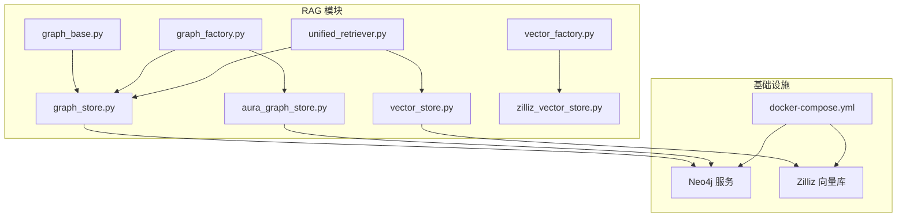
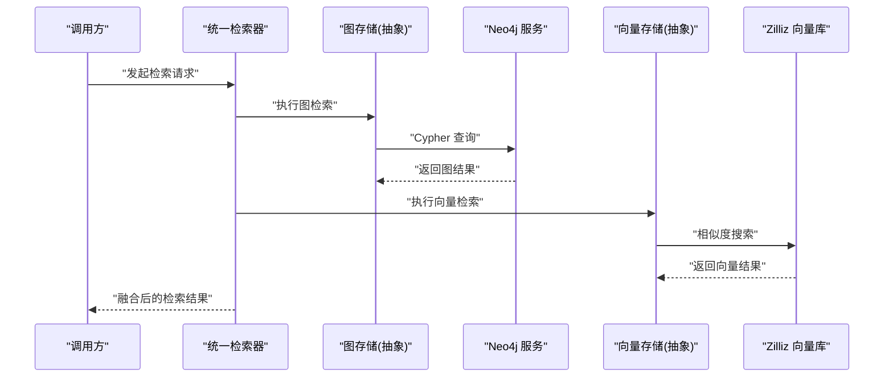
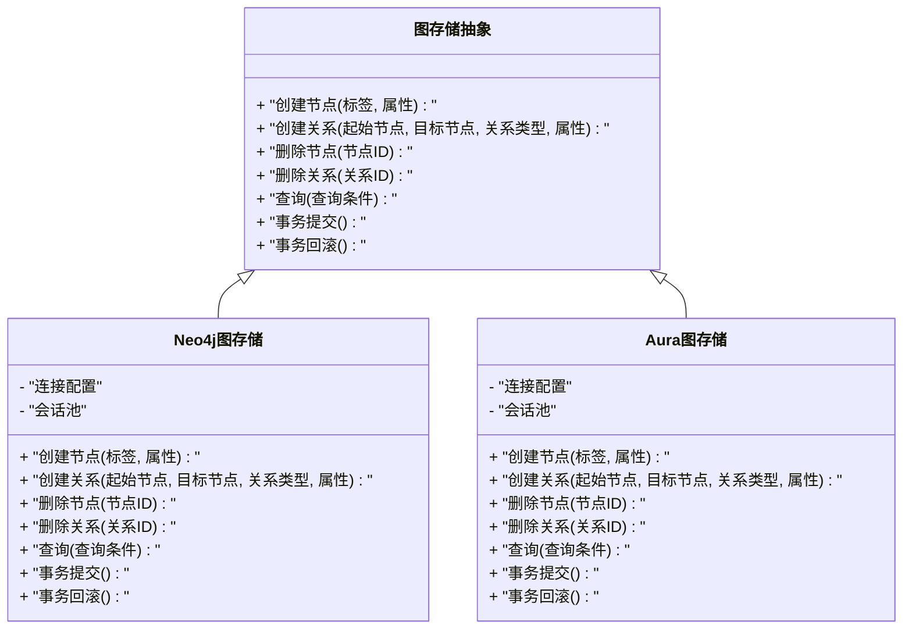
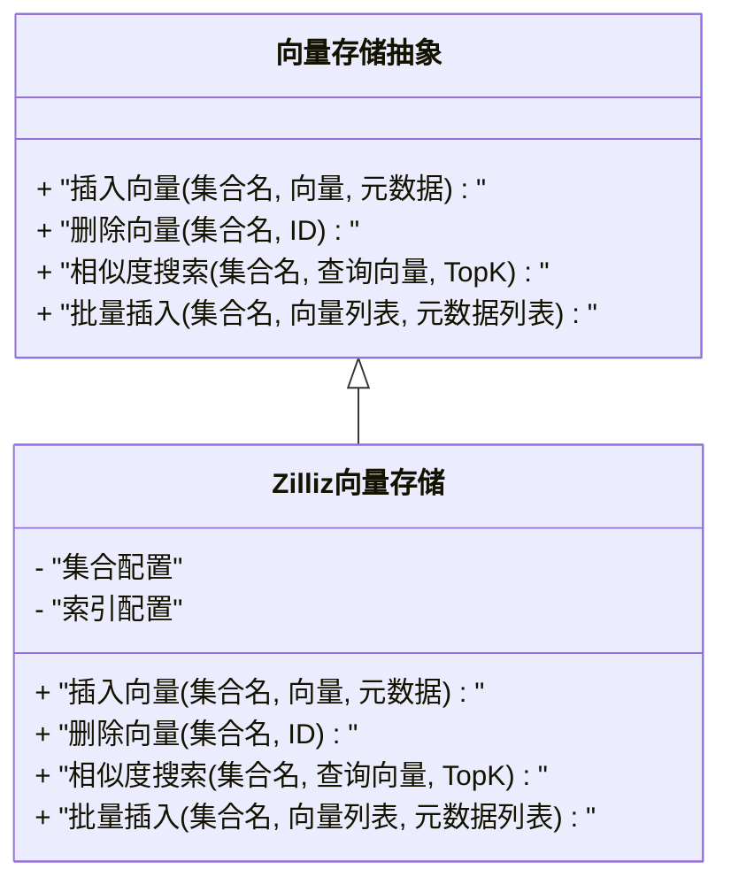
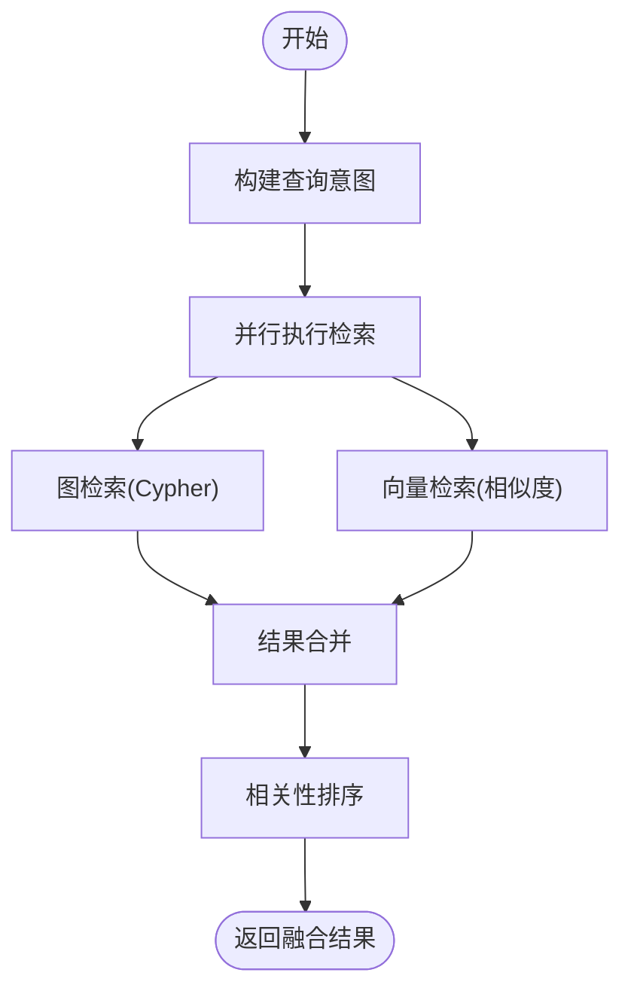
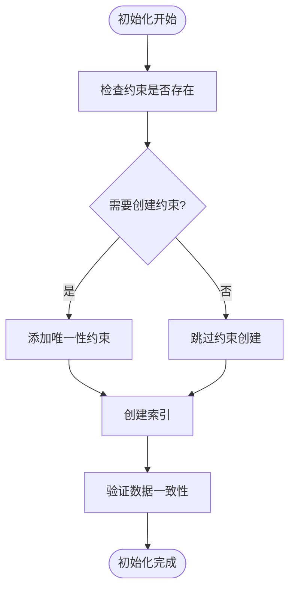
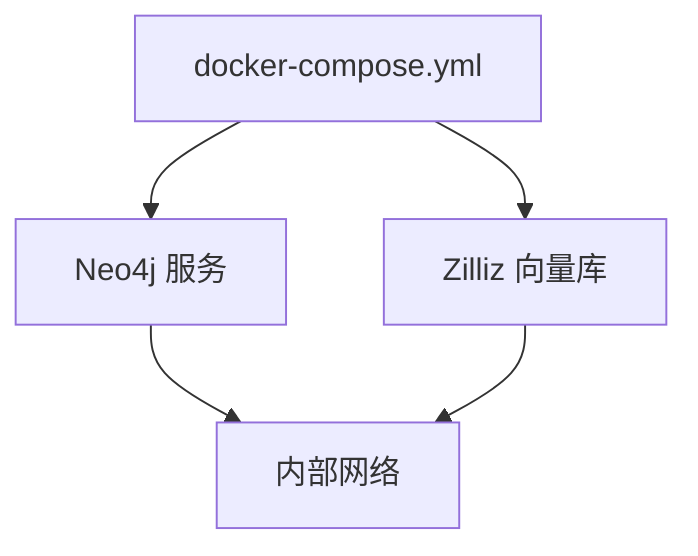
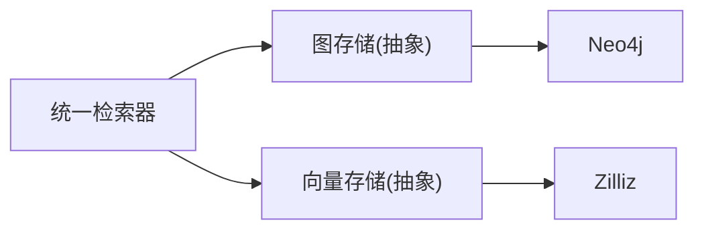

# 图数据库设计

<cite>
**本文引用的文件**   
- [backend_design/nexus/rag/graph_base.py](file://backend_design/nexus/rag/graph_base.py)
- [backend_design/nexus/rag/graph_store.py](file://backend_design/nexus/rag/graph_store.py)
- [backend_design/nexus/rag/graph_factory.py](file://backend_design/nexus/rag/graph_factory.py)
- [backend_design/nexus/rag/aura_graph_store.py](file://backend_design/nexus/rag/aura_graph_store.py)
- [backend_design/nexus/rag/vector_store.py](file://backend_design/nexus/rag/vector_store.py)
- [backend_design/nexus/rag/vector_factory.py](file://backend_design/nexus/rag/vector_factory.py)
- [backend_design/nexus/rag/zilliz_vector_store.py](file://backend_design/nexus/rag/zilliz_vector_store.py)
- [backend_design/nexus/rag/unified_retriever.py](file://backend_design/nexus/rag/unified_retriever.py)
- [scripts/init_neo4j.py](file://scripts/init_neo4j.py)
- [docker-compose.yml](file://docker-compose.yml)
</cite>

## 目录
1. [简介](#简介)
2. [项目结构](#项目结构)
3. [核心组件](#核心组件)
4. [架构总览](#架构总览)
5. [详细组件分析](#详细组件分析)
6. [依赖关系分析](#依赖关系分析)
7. [性能考虑](#性能考虑)
8. [故障排查指南](#故障排查指南)
9. [结论](#结论)
10. [附录](#附录)

## 简介
本技术文档围绕图数据库设计与知识图谱建模展开，聚焦于Neo4j在该项目中的集成与使用方式。内容涵盖：
- 节点类型定义、关系建模与属性设计原则
- Cypher查询模式与性能优化策略
- 知识图谱构建算法与自动推理机制（结合向量检索）
- 可视化展示与交互式查询工具建议
- 分布式部署与高可用配置要点
- 备份迁移与版本控制策略

本项目通过抽象层统一图存储与向量存储的访问接口，并提供了Neo4j初始化脚本与Docker编排能力，便于快速搭建与扩展。

## 项目结构
与图数据库相关的代码主要位于后端RAG模块与初始化脚本中：
- 图存储抽象与实现：graph_base.py、graph_store.py、graph_factory.py、aura_graph_store.py
- 向量存储抽象与实现：vector_store.py、vector_factory.py、zilliz_vector_store.py
- 统一检索器：unified_retriever.py
- Neo4j初始化脚本：scripts/init_neo4j.py
- 容器编排：docker-compose.yml

图表来源
- [backend_design/nexus/rag/graph_base.py](file://backend_design/nexus/rag/graph_base.py)
- [backend_design/nexus/rag/graph_store.py](file://backend_design/nexus/rag/graph_store.py)
- [backend_design/nexus/rag/graph_factory.py](file://backend_design/nexus/rag/graph_factory.py)
- [backend_design/nexus/rag/aura_graph_store.py](file://backend_design/nexus/rag/aura_graph_store.py)
- [backend_design/nexus/rag/vector_store.py](file://backend_design/nexus/rag/vector_store.py)
- [backend_design/nexus/rag/vector_factory.py](file://backend_design/nexus/rag/vector_factory.py)
- [backend_design/nexus/rag/zilliz_vector_store.py](file://backend_design/nexus/rag/zilliz_vector_store.py)
- [backend_design/nexus/rag/unified_retriever.py](file://backend_design/nexus/rag/unified_retriever.py)
- [docker-compose.yml](file://docker-compose.yml)

章节来源
- [backend_design/nexus/rag/graph_base.py](file://backend_design/nexus/rag/graph_base.py)
- [backend_design/nexus/rag/graph_store.py](file://backend_design/nexus/rag/graph_store.py)
- [backend_design/nexus/rag/graph_factory.py](file://backend_design/nexus/rag/graph_factory.py)
- [backend_design/nexus/rag/aura_graph_store.py](file://backend_design/nexus/rag/aura_graph_store.py)
- [backend_design/nexus/rag/vector_store.py](file://backend_design/nexus/rag/vector_store.py)
- [backend_design/nexus/rag/vector_factory.py](file://backend_design/nexus/rag/vector_factory.py)
- [backend_design/nexus/rag/zilliz_vector_store.py](file://backend_design/nexus/rag/zilliz_vector_store.py)
- [backend_design/nexus/rag/unified_retriever.py](file://backend_design/nexus/rag/unified_retriever.py)
- [scripts/init_neo4j.py](file://scripts/init_neo4j.py)
- [docker-compose.yml](file://docker-compose.yml)

## 核心组件
- 图存储抽象与工厂
  - 提供统一的图操作接口与多实现切换能力，支持本地Neo4j与AuraDB等云托管实例。
- 向量存储抽象与工厂
  - 提供统一的向量检索接口，默认对接Zilliz向量库，便于与图数据协同进行混合检索。
- 统一检索器
  - 组合图检索与向量检索结果，形成更丰富的上下文召回。
- Neo4j初始化脚本
  - 用于创建索引、约束与初始图谱结构，保障查询性能与一致性。

章节来源
- [backend_design/nexus/rag/graph_base.py](file://backend_design/nexus/rag/graph_base.py)
- [backend_design/nexus/rag/graph_store.py](file://backend_design/nexus/rag/graph_store.py)
- [backend_design/nexus/rag/graph_factory.py](file://backend_design/nexus/rag/graph_factory.py)
- [backend_design/nexus/rag/aura_graph_store.py](file://backend_design/nexus/rag/aura_graph_store.py)
- [backend_design/nexus/rag/vector_store.py](file://backend_design/nexus/rag/vector_store.py)
- [backend_design/nexus/rag/vector_factory.py](file://backend_design/nexus/rag/vector_factory.py)
- [backend_design/nexus/rag/zilliz_vector_store.py](file://backend_design/nexus/rag/zilliz_vector_store.py)
- [backend_design/nexus/rag/unified_retriever.py](file://backend_design/nexus/rag/unified_retriever.py)
- [scripts/init_neo4j.py](file://scripts/init_neo4j.py)

## 架构总览
下图展示了RAG模块中图与向量存储的交互关系，以及统一检索器的组合调用流程。

图表来源
- [backend_design/nexus/rag/unified_retriever.py](file://backend_design/nexus/rag/unified_retriever.py)
- [backend_design/nexus/rag/graph_store.py](file://backend_design/nexus/rag/graph_store.py)
- [backend_design/nexus/rag/aura_graph_store.py](file://backend_design/nexus/rag/aura_graph_store.py)
- [backend_design/nexus/rag/vector_store.py](file://backend_design/nexus/rag/vector_store.py)
- [backend_design/nexus/rag/zilliz_vector_store.py](file://backend_design/nexus/rag/zilliz_vector_store.py)
- [docker-compose.yml](file://docker-compose.yml)

## 详细组件分析

### 图存储抽象与实现
- 抽象接口
  - 定义统一的图操作契约，包括节点与关系的增删改查、事务边界、错误处理等。
- 具体实现
  - 本地Neo4j实现：封装驱动连接、会话管理、批量写入与查询优化。
  - AuraDB实现：适配云托管参数、连接池与重试策略。
- 工厂模式
  - 根据配置动态选择图存储实现，便于环境切换与灰度发布。

图表来源
- [backend_design/nexus/rag/graph_base.py](file://backend_design/nexus/rag/graph_base.py)
- [backend_design/nexus/rag/graph_store.py](file://backend_design/nexus/rag/graph_store.py)
- [backend_design/nexus/rag/aura_graph_store.py](file://backend_design/nexus/rag/aura_graph_store.py)

章节来源
- [backend_design/nexus/rag/graph_base.py](file://backend_design/nexus/rag/graph_base.py)
- [backend_design/nexus/rag/graph_store.py](file://backend_design/nexus/rag/graph_store.py)
- [backend_design/nexus/rag/aura_graph_store.py](file://backend_design/nexus/rag/aura_graph_store.py)

### 向量存储抽象与实现
- 抽象接口
  - 定义统一的向量检索契约，包括向量的插入、更新、删除与相似度搜索。
- 具体实现
  - Zilliz实现：封装集合管理、索引配置与批量操作。
- 工厂模式
  - 根据配置动态选择向量存储实现，便于替换或扩展新的向量库。

图表来源
- [backend_design/nexus/rag/vector_store.py](file://backend_design/nexus/rag/vector_store.py)
- [backend_design/nexus/rag/zilliz_vector_store.py](file://backend_design/nexus/rag/zilliz_vector_store.py)

章节来源
- [backend_design/nexus/rag/vector_store.py](file://backend_design/nexus/rag/vector_store.py)
- [backend_design/nexus/rag/zilliz_vector_store.py](file://backend_design/nexus/rag/zilliz_vector_store.py)

### 统一检索器
- 功能概述
  - 组合图检索与向量检索结果，按权重或相关性排序后返回融合结果。
- 关键流程
  - 接收查询文本，并行触发图检索与向量检索；对结果进行去重与重排；返回最终上下文。

图表来源
- [backend_design/nexus/rag/unified_retriever.py](file://backend_design/nexus/rag/unified_retriever.py)
- [backend_design/nexus/rag/graph_store.py](file://backend_design/nexus/rag/graph_store.py)
- [backend_design/nexus/rag/vector_store.py](file://backend_design/nexus/rag/vector_store.py)

章节来源
- [backend_design/nexus/rag/unified_retriever.py](file://backend_design/nexus/rag/unified_retriever.py)

### Neo4j初始化与索引策略
- 初始化脚本职责
  - 创建必要的索引与约束，确保主键唯一性与高频查询字段可被高效检索。
- 典型步骤
  - 建立节点标签的唯一性约束
  - 为常用过滤字段创建索引
  - 预建关系索引（如需要）
  - 校验并修复不一致数据

图表来源
- [scripts/init_neo4j.py](file://scripts/init_neo4j.py)

章节来源
- [scripts/init_neo4j.py](file://scripts/init_neo4j.py)

### Docker编排与服务发现
- 编排要点
  - 定义Neo4j与Zilliz服务的启动参数、端口映射与网络隔离
  - 设置环境变量以注入连接信息
- 健康检查与重启策略
  - 配置服务健康检查与失败重启，提升可用性

图表来源
- [docker-compose.yml](file://docker-compose.yml)

章节来源
- [docker-compose.yml](file://docker-compose.yml)

## 依赖关系分析
- 组件耦合
  - 统一检索器同时依赖图存储与向量存储，属于松耦合的组合模式。
  - 工厂类负责解耦具体实现，降低环境切换成本。
- 外部依赖
  - Neo4j作为图数据库后端
  - Zilliz作为向量检索后端
- 潜在循环依赖
  - 当前分层清晰，未见循环导入风险。

图表来源
- [backend_design/nexus/rag/unified_retriever.py](file://backend_design/nexus/rag/unified_retriever.py)
- [backend_design/nexus/rag/graph_store.py](file://backend_design/nexus/rag/graph_store.py)
- [backend_design/nexus/rag/vector_store.py](file://backend_design/nexus/rag/vector_store.py)

章节来源
- [backend_design/nexus/rag/unified_retriever.py](file://backend_design/nexus/rag/unified_retriever.py)
- [backend_design/nexus/rag/graph_store.py](file://backend_design/nexus/rag/graph_store.py)
- [backend_design/nexus/rag/vector_store.py](file://backend_design/nexus/rag/vector_store.py)

## 性能考虑
- 索引与约束
  - 为主键与高频过滤字段建立唯一性约束与索引，减少全表扫描。
- 查询优化
  - 使用路径长度限制与跳数限制避免深度遍历导致的性能问题。
  - 将复杂查询拆分为多个简单查询，利用应用层聚合。
- 批处理与事务
  - 批量写入时采用事务边界控制，提高吞吐并保证一致性。
- 缓存与预热
  - 热点查询结果可引入应用层缓存；冷启动阶段预加载必要索引与统计信息。
- 资源隔离
  - 读写分离与连接池调优，避免单点瓶颈。

[本节为通用指导，不直接分析具体文件]

## 故障排查指南
- 连接问题
  - 检查Neo4j与Zilliz服务是否启动成功，确认端口与网络可达。
- 索引缺失
  - 运行初始化脚本，确保约束与索引已创建。
- 查询超时
  - 调整查询复杂度，增加索引覆盖，限制遍历深度。
- 数据不一致
  - 使用初始化脚本的数据校验步骤修复异常记录。

章节来源
- [scripts/init_neo4j.py](file://scripts/init_neo4j.py)
- [docker-compose.yml](file://docker-compose.yml)

## 结论
本项目通过抽象层与工厂模式实现了图与向量存储的统一接入，结合Neo4j与Zilliz构建了高效的混合检索能力。通过合理的索引与约束设计、查询优化与Docker编排，可在生产环境中获得良好的性能与可用性。后续可进一步引入分布式部署与高可用配置，完善备份迁移与版本控制策略。

[本节为总结，不直接分析具体文件]

## 附录

### 知识图谱建模方法（Neo4j）
- 节点类型定义
  - 明确实体类别（如用户、车辆、技能、偏好等），并为每个节点类型定义唯一标识与必要属性。
- 关系建模
  - 使用有向关系表达语义关联（如“拥有”、“关联”、“触发”），并为关系类型赋予明确的业务含义。
- 属性设计
  - 区分节点属性与关系属性，保持属性简洁且可索引；避免过度冗余。
- 示例参考
  - 参见初始化脚本中对约束与索引的定义思路。

章节来源
- [scripts/init_neo4j.py](file://scripts/init_neo4j.py)

### Cypher查询模式与优化
- 常见模式
  - 最短路径、邻居扩展、子图匹配、聚合统计。
- 优化技巧
  - 使用索引字段过滤、限制遍历深度、拆分复杂查询、批量写入。
- 监控与诊断
  - 启用慢查询日志，定期审查执行计划。

[本节为通用指导，不直接分析具体文件]

### 自动推理与构建算法
- 构建算法
  - 基于规则抽取与LLM辅助抽取相结合，生成节点与关系。
- 自动推理
  - 利用图结构与向量相似度进行启发式推理，补充隐含关系。
- 评估与迭代
  - 通过准确率与召回率指标评估推理效果，持续优化规则与模型。

[本节为通用指导，不直接分析具体文件]

### 可视化与交互式查询
- 可视化工具
  - 使用Neo4j Browser或第三方前端组件进行图谱可视化。
- 交互式查询
  - 提供查询编辑器与结果预览，支持保存常用查询模板。

[本节为通用指导，不直接分析具体文件]

### 分布式部署与高可用
- 集群模式
  - 部署Neo4j集群与Zilliz集群，合理划分分区与副本。
- 高可用配置
  - 配置健康检查、自动故障转移与负载均衡。
- 容量规划
  - 依据数据规模与QPS预估CPU、内存与存储资源。

[本节为通用指导，不直接分析具体文件]

### 备份迁移与版本控制
- 备份策略
  - 定期全量与增量备份，保留多版本快照。
- 迁移方案
  - 使用初始化脚本与数据导出导入工具进行跨环境迁移。
- 版本控制
  - 将Schema变更与索引定义纳入版本管理，配合CI/CD自动化执行。

[本节为通用指导，不直接分析具体文件]