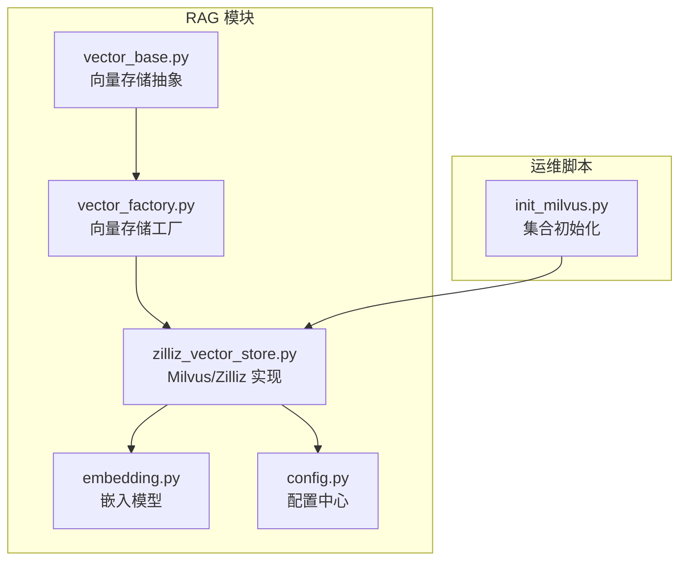
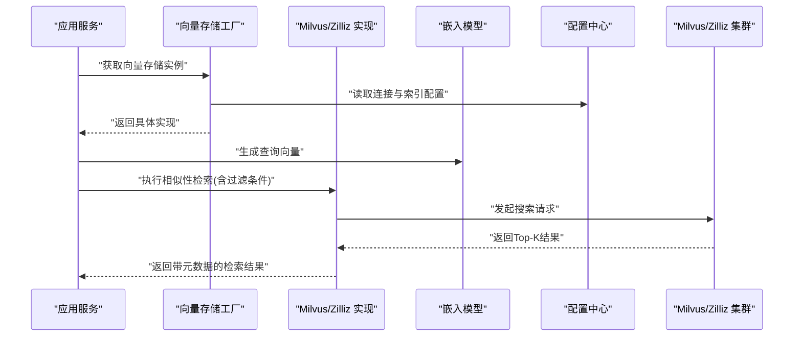
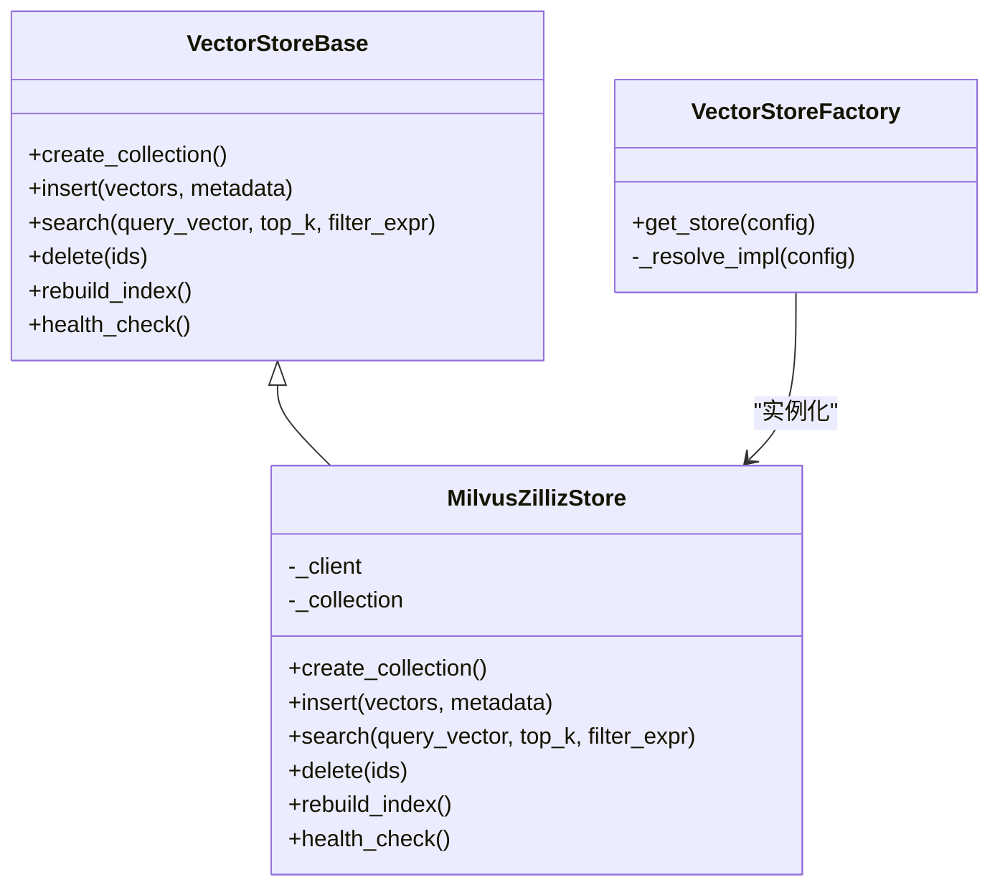
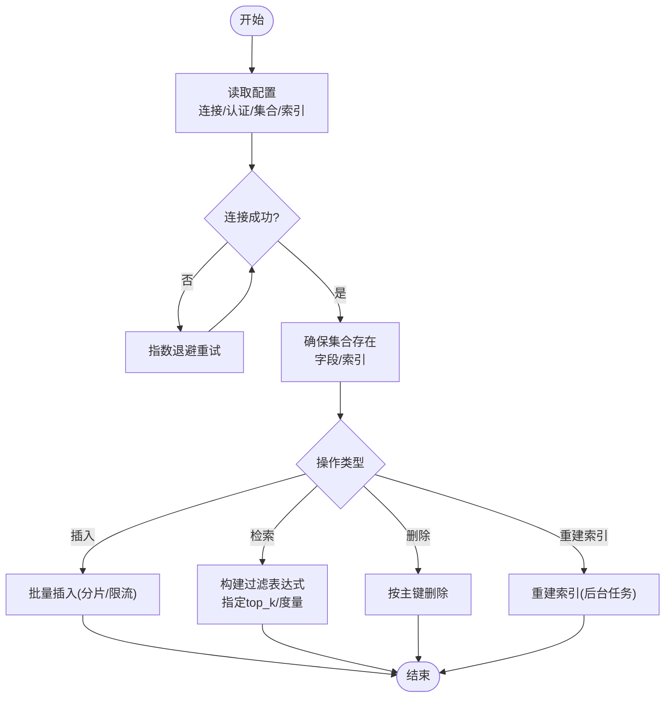
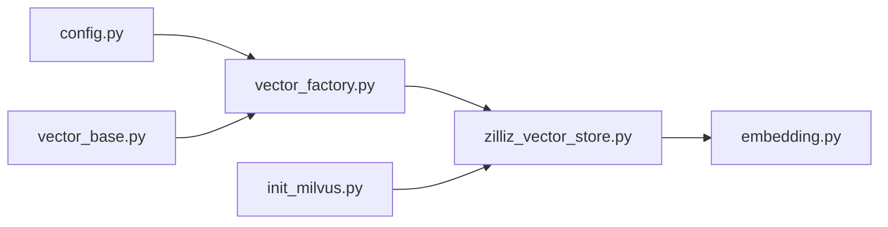

# Milvus向量数据库集成

<cite>
**本文引用的文件**   
- [backend_design/nexus/rag/zilliz_vector_store.py](file://backend_design/nexus/rag/zilliz_vector_store.py)
- [backend_design/nexus/rag/vector_base.py](file://backend_design/nexus/rag/vector_base.py)
- [backend_design/nexus/rag/vector_factory.py](file://backend_design/nexus/rag/vector_factory.py)
- [backend_design/nexus/rag/embedding.py](file://backend_design/nexus/rag/embedding.py)
- [backend_design/nexus/config.py](file://backend_design/nexus/config.py)
- [scripts/init_milvus.py](file://scripts/init_milvus.py)
</cite>

## 目录
1. [简介](#简介)
2. [项目结构](#项目结构)
3. [核心组件](#核心组件)
4. [架构总览](#架构总览)
5. [详细组件分析](#详细组件分析)
6. [依赖关系分析](#依赖关系分析)
7. [性能与内存优化](#性能与内存优化)
8. [故障恢复与可观测性](#故障恢复与可观测性)
9. [API调用示例与最佳实践](#api调用示例与最佳实践)
10. [结论](#结论)

## 简介
本技术文档聚焦于在 GraphRAG 检索系统中集成 Milvus 向量数据库的完整方案，涵盖：
- 向量数据模型与存储格式
- 嵌入模型配置与相似度计算策略
- 索引类型选择（HNSW、IVF_FLAT等）与参数调优
- 批量插入、增量更新、删除的实现路径
- 与 Zilliz Cloud 云服务的连接、认证与负载均衡
- 检索性能优化、内存管理与故障恢复机制
- API 调用示例与最佳实践

## 项目结构
与 Milvus 集成相关的代码主要位于后端 RAG 模块中，围绕“向量存储抽象—工厂—具体实现”的分层组织。关键文件如下：
- 向量存储抽象与工厂：定义统一接口与实例化策略
- Zilliz/Milvus 具体实现：封装连接、集合管理、CRUD 与检索
- 嵌入模型：提供文本到向量的转换能力
- 配置中心：集中管理 Milvus/Zilliz 连接与索引参数
- 初始化脚本：用于环境准备与集合创建

图表来源
- [backend_design/nexus/rag/vector_base.py](file://backend_design/nexus/rag/vector_base.py)
- [backend_design/nexus/rag/vector_factory.py](file://backend_design/nexus/rag/vector_factory.py)
- [backend_design/nexus/rag/zilliz_vector_store.py](file://backend_design/nexus/rag/zilliz_vector_store.py)
- [backend_design/nexus/rag/embedding.py](file://backend_design/nexus/rag/embedding.py)
- [backend_design/nexus/config.py](file://backend_design/nexus/config.py)
- [scripts/init_milvus.py](file://scripts/init_milvus.py)

章节来源
- [backend_design/nexus/rag/vector_base.py](file://backend_design/nexus/rag/vector_base.py)
- [backend_design/nexus/rag/vector_factory.py](file://backend_design/nexus/rag/vector_factory.py)
- [backend_design/nexus/rag/zilliz_vector_store.py](file://backend_design/nexus/rag/zilliz_vector_store.py)
- [backend_design/nexus/rag/embedding.py](file://backend_design/nexus/rag/embedding.py)
- [backend_design/nexus/config.py](file://backend_design/nexus/config.py)
- [scripts/init_milvus.py](file://scripts/init_milvus.py)

## 核心组件
- 向量存储抽象层：定义统一的向量库操作接口（如创建集合、插入、查询、删除、重建索引等），屏蔽底层差异。
- 向量存储工厂：根据配置动态选择并返回具体的向量存储实现（如 Milvus/Zilliz）。
- Milvus/Zilliz 实现：负责连接管理、集合生命周期、索引构建、批量写入、检索与元数据过滤。
- 嵌入模型：将自然语言或结构化片段转换为固定维度的稠密向量，供检索使用。
- 配置中心：集中管理 Milvus/Zilliz 的连接地址、认证信息、集合名、维度、索引类型与参数。
- 初始化脚本：在首次部署时创建集合、设置字段与索引，确保运行期可用。

章节来源
- [backend_design/nexus/rag/vector_base.py](file://backend_design/nexus/rag/vector_base.py)
- [backend_design/nexus/rag/vector_factory.py](file://backend_design/nexus/rag/vector_factory.py)
- [backend_design/nexus/rag/zilliz_vector_store.py](file://backend_design/nexus/rag/zilliz_vector_store.py)
- [backend_design/nexus/rag/embedding.py](file://backend_design/nexus/rag/embedding.py)
- [backend_design/nexus/config.py](file://backend_design/nexus/config.py)
- [scripts/init_milvus.py](file://scripts/init_milvus.py)

## 架构总览
下图展示了从业务请求到向量检索的端到端流程，以及各组件之间的交互关系。

图表来源
- [backend_design/nexus/rag/vector_factory.py](file://backend_design/nexus/rag/vector_factory.py)
- [backend_design/nexus/rag/zilliz_vector_store.py](file://backend_design/nexus/rag/zilliz_vector_store.py)
- [backend_design/nexus/rag/embedding.py](file://backend_design/nexus/rag/embedding.py)
- [backend_design/nexus/config.py](file://backend_design/nexus/config.py)

## 详细组件分析

### 组件一：向量存储抽象与工厂
- 抽象层职责
  - 定义统一的接口契约：集合创建、插入、查询、删除、索引重建、健康检查等。
  - 约定输入输出数据结构：如向量批次、元数据映射、过滤表达式、Top-K 数量等。
- 工厂职责
  - 依据配置决定使用 Milvus 本地还是 Zilliz Cloud。
  - 缓存实例，避免重复创建连接。
  - 暴露一致的构造入口，便于上层注入与测试替换。

图表来源
- [backend_design/nexus/rag/vector_base.py](file://backend_design/nexus/rag/vector_base.py)
- [backend_design/nexus/rag/vector_factory.py](file://backend_design/nexus/rag/vector_factory.py)
- [backend_design/nexus/rag/zilliz_vector_store.py](file://backend_design/nexus/rag/zilliz_vector_store.py)

章节来源
- [backend_design/nexus/rag/vector_base.py](file://backend_design/nexus/rag/vector_base.py)
- [backend_design/nexus/rag/vector_factory.py](file://backend_design/nexus/rag/vector_factory.py)
- [backend_design/nexus/rag/zilliz_vector_store.py](file://backend_design/nexus/rag/zilliz_vector_store.py)

### 组件二：Milvus/Zilliz 具体实现
- 连接与认证
  - 支持本地 Milvus 与 Zilliz Cloud 两种模式。
  - 通过配置项传入连接地址、用户名/密码或 Token、TLS 开关等。
- 集合与字段
  - 主键字段：用于标识每条记录（建议自增或外部唯一ID）。
  - 向量字段：固定维度，数据类型为浮点向量。
  - 标量字段：用于过滤（如租户ID、时间戳、来源等）。
- 索引类型与参数
  - HNSW：适合低延迟高召回场景；关键参数包括 M、efConstruction、efSearch。
  - IVF_FLAT：适合大规模离线构建、吞吐优先；关键参数包括 nlist、nprobe。
  - 其他可选：FLAT（精确但慢）、SCANN（近似且快）等，按需求选择。
- 相似度度量
  - 常用：余弦相似度、内积、欧氏距离；需与嵌入模型输出空间一致。
- 批处理与事务
  - 批量插入以提升吞吐；失败重试与幂等设计保障一致性。
- 删除与更新
  - 基于主键删除；更新采用“删旧插新”策略保证最终一致。
- 过滤与表达式
  - 支持对标量字段进行范围、等于、IN 等过滤。
- 健康检查与重连
  - 定期探测连接状态；异常自动重连与熔断降级。

图表来源
- [backend_design/nexus/rag/zilliz_vector_store.py](file://backend_design/nexus/rag/zilliz_vector_store.py)
- [backend_design/nexus/config.py](file://backend_design/nexus/config.py)

章节来源
- [backend_design/nexus/rag/zilliz_vector_store.py](file://backend_design/nexus/rag/zilliz_vector_store.py)
- [backend_design/nexus/config.py](file://backend_design/nexus/config.py)

### 组件三：嵌入模型配置
- 模型选择
  - 通用中文场景：BGE、M3E、GTE 等开源模型。
  - 多语言/跨域：bge-m3、text-embedding-ada-002 等。
- 维度对齐
  - 必须与集合向量字段维度一致，否则无法检索。
- 归一化与度量
  - 若使用余弦相似度，建议对向量做 L2 归一化。
- 批量化推理
  - 使用批处理提升吞吐；注意显存峰值控制。
- 缓存与复用
  - 对短文本或热点查询可做向量缓存，减少重复计算。

章节来源
- [backend_design/nexus/rag/embedding.py](file://backend_design/nexus/rag/embedding.py)

### 组件四：初始化脚本
- 功能
  - 创建集合、定义字段与索引、校验连通性。
- 适用场景
  - 首次部署、版本升级后重建集合、灰度切换前预检。
- 注意事项
  - 幂等执行：已存在集合不覆盖。
  - 回滚策略：失败时保留原集合或回滚到新集合。

章节来源
- [scripts/init_milvus.py](file://scripts/init_milvus.py)

## 依赖关系分析
- 耦合关系
  - 工厂仅依赖配置与抽象接口，降低与具体实现的耦合。
  - 具体实现依赖配置与客户端 SDK，屏蔽网络细节。
- 外部依赖
  - Milvus/Zilliz 服务端、嵌入模型运行时（CPU/GPU）。
- 潜在循环依赖
  - 通过抽象与工厂解耦，避免循环引用。

图表来源
- [backend_design/nexus/config.py](file://backend_design/nexus/config.py)
- [backend_design/nexus/rag/vector_factory.py](file://backend_design/nexus/rag/vector_factory.py)
- [backend_design/nexus/rag/vector_base.py](file://backend_design/nexus/rag/vector_base.py)
- [backend_design/nexus/rag/zilliz_vector_store.py](file://backend_design/nexus/rag/zilliz_vector_store.py)
- [backend_design/nexus/rag/embedding.py](file://backend_design/nexus/rag/embedding.py)
- [scripts/init_milvus.py](file://scripts/init_milvus.py)

章节来源
- [backend_design/nexus/config.py](file://backend_design/nexus/config.py)
- [backend_design/nexus/rag/vector_factory.py](file://backend_design/nexus/rag/vector_factory.py)
- [backend_design/nexus/rag/vector_base.py](file://backend_design/nexus/rag/vector_base.py)
- [backend_design/nexus/rag/zilliz_vector_store.py](file://backend_design/nexus/rag/zilliz_vector_store.py)
- [backend_design/nexus/rag/embedding.py](file://backend_design/nexus/rag/embedding.py)
- [scripts/init_milvus.py](file://scripts/init_milvus.py)

## 性能与内存优化
- 索引选择
  - HNSW：低延迟、高召回，适合在线实时检索；调参关注 M、efConstruction、efSearch。
  - IVF_FLAT：吞吐优先、离线构建；调参关注 nlist、nprobe。
- 批量写入
  - 合理分片大小（例如每批数千条），结合并发与背压控制。
- 过滤与投影
  - 尽量利用标量字段过滤减少扫描面；只返回必要字段。
- 度量与归一化
  - 与嵌入模型保持一致；必要时在入库前归一化以匹配余弦相似度。
- 连接池与超时
  - 合理设置连接池大小、读写超时与重试次数。
- 内存管理
  - 控制单批向量规模，避免 OOM；对热点数据做向量缓存。
- 监控指标
  - QPS、P99 延迟、错误率、索引构建耗时、磁盘/内存占用。

[本节为通用指导，无需源码引用]

## 故障恢复与可观测性
- 连接与重试
  - 指数退避重试、熔断器保护、快速失败与降级策略。
- 幂等与一致性
  - 插入幂等（基于主键去重）；更新采用“删旧插新”。
- 健康检查
  - 定时探测连接与集合可用性；异常告警。
- 日志与追踪
  - 记录关键操作与错误堆栈；关联 TraceId 便于定位。
- 备份与回滚
  - 定期导出集合快照；灰度切换时双写对比与快速回滚。

章节来源
- [backend_design/nexus/rag/zilliz_vector_store.py](file://backend_design/nexus/rag/zilliz_vector_store.py)
- [backend_design/nexus/config.py](file://backend_design/nexus/config.py)

## API调用示例与最佳实践
以下为面向使用者的典型调用流程说明（不包含具体代码内容，仅提供步骤与要点）：

- 初始化与连接
  - 从配置中心加载 Milvus/Zilliz 连接参数（地址、认证、TLS）。
  - 通过工厂获取向量存储实例，完成健康检查。
- 集合管理
  - 首次运行执行初始化脚本创建集合与索引。
  - 后续版本升级按需重建索引或迁移集合。
- 插入数据
  - 将文本经嵌入模型转为向量，连同元数据批量插入。
  - 建议开启幂等键，避免重复插入。
- 检索数据
  - 将查询文本转为向量，指定 Top-K、过滤条件与度量方式。
  - 返回结果包含相似度分数与元数据，供下游排序与展示。
- 更新与删除
  - 更新：先按主键删除旧记录，再插入新版本。
  - 删除：直接按主键列表删除。
- 索引重建
  - 在低峰期触发后台任务重建索引，完成后切换流量。
- 最佳实践
  - 维度与度量与嵌入模型严格对齐。
  - 合理设置批大小与并发，避免资源争用。
  - 使用标量字段做粗粒度过滤，缩小检索面。
  - 对热点查询做向量缓存，降低重复计算。
  - 建立完善的监控与告警体系。

章节来源
- [backend_design/nexus/rag/vector_factory.py](file://backend_design/nexus/rag/vector_factory.py)
- [backend_design/nexus/rag/zilliz_vector_store.py](file://backend_design/nexus/rag/zilliz_vector_store.py)
- [backend_design/nexus/rag/embedding.py](file://backend_design/nexus/rag/embedding.py)
- [backend_design/nexus/config.py](file://backend_design/nexus/config.py)
- [scripts/init_milvus.py](file://scripts/init_milvus.py)

## 结论
通过将向量存储抽象、工厂与 Milvus/Zilliz 具体实现解耦，系统在 GraphRAG 检索链路中实现了可扩展、可维护的语义检索能力。配合合理的索引选型、批处理策略与监控告警，可在不同规模与负载下稳定提供低延迟、高召回的检索体验。建议在上线前完成容量规划与压测，持续优化索引参数与批大小，并结合业务特征调整过滤与缓存策略。