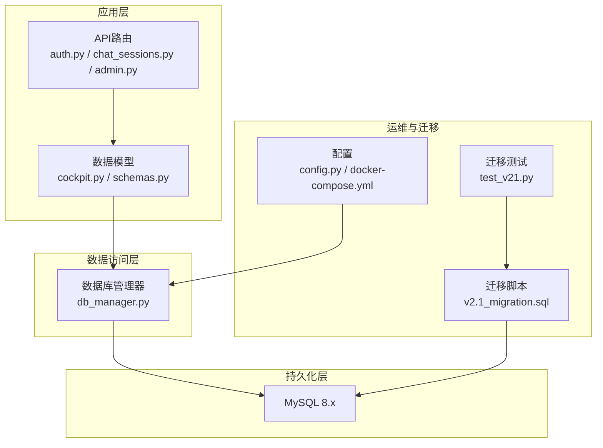
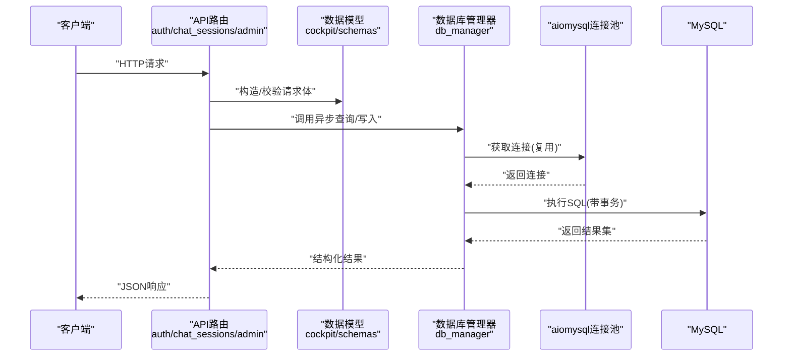
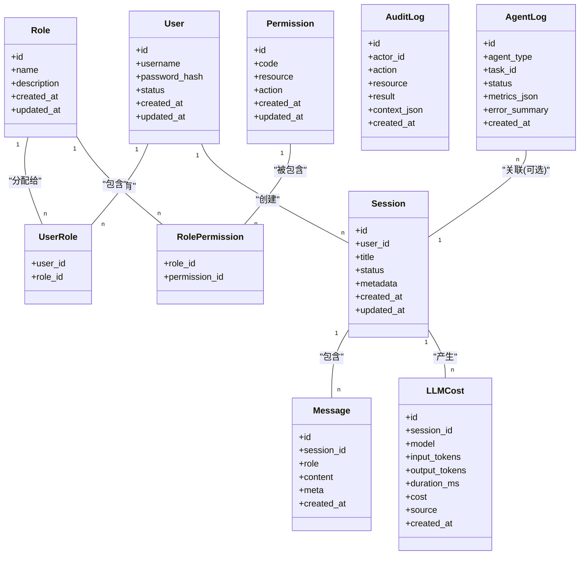
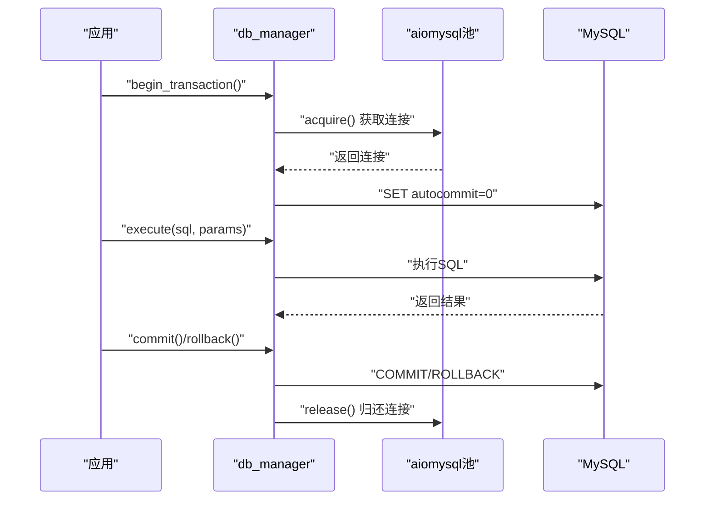
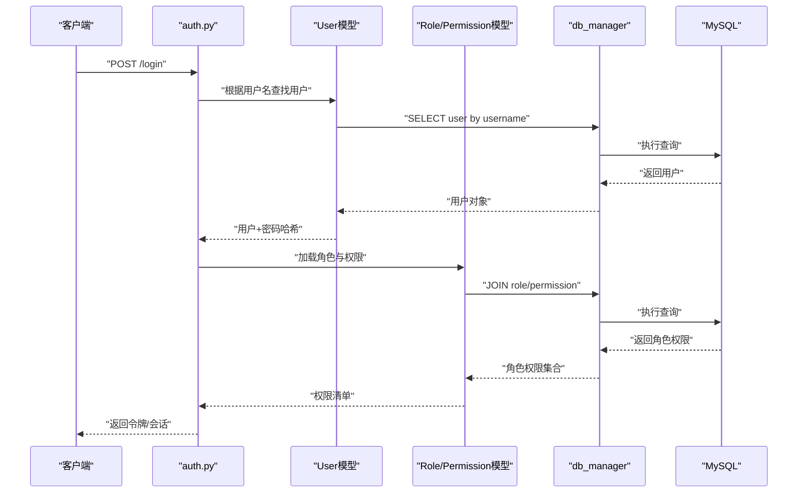
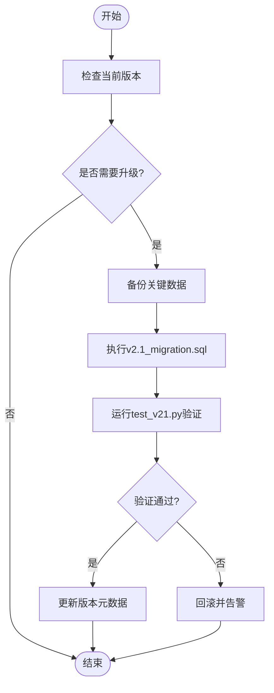
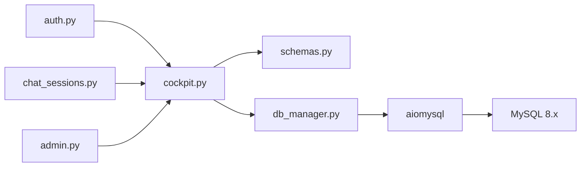

# MySQL关系型数据库设计

<cite>
**本文引用的文件**   
- [backend_design/nexus/core/db_manager.py](file://backend_design/nexus/core/db_manager.py)
- [backend_design/nexus/models/cockpit.py](file://backend_design/nexus/models/cockpit.py)
- [backend_design/nexus/models/schemas.py](file://backend_design/nexus/models/schemas.py)
- [backend_design/nexus/api/routes/auth.py](file://backend_design/nexus/api/routes/auth.py)
- [backend_design/nexus/api/routes/chat_sessions.py](file://backend_design/nexus/api/routes/chat_sessions.py)
- [backend_design/nexus/api/routes/admin.py](file://backend_design/nexus/api/routes/admin.py)
- [backend_design/scripts/v2.1_migration.sql](file://backend_design/scripts/v2.1_migration.sql)
- [backend_design/tests/test_v21.py](file://backend_design/tests/test_v21.py)
- [backend_design/nexus/config.py](file://backend_design/nexus/config.py)
- [docker-compose.yml](file://docker-compose.yml)
</cite>

## 目录
1. [简介](#简介)
2. [项目结构](#项目结构)
3. [核心组件](#核心组件)
4. [架构总览](#架构总览)
5. [详细组件分析](#详细组件分析)
6. [依赖分析](#依赖分析)
7. [性能考虑](#性能考虑)
8. [故障排查指南](#故障排查指南)
9. [结论](#结论)
10. [附录](#附录)

## 简介
本技术文档聚焦于NexusCockpit系统的MySQL关系型数据库设计，覆盖用户与权限（RBAC）、对话历史、审计日志、LLM成本追踪、SubAgent/MainAgent巡检日志等核心表结构设计；阐述字段定义、索引策略、外键约束与查询优化；说明aiomysql异步连接池配置、连接复用与事务模式；给出v2.1版本迁移策略与兼容性保证；并提供性能调优建议、容量规划与监控指标定义，以及完整SQL Schema与CRUD示例路径。

## 项目结构
与数据库相关的代码主要分布在以下位置：
- 数据模型与ORM映射：models/cockpit.py、models/schemas.py
- 数据库连接与连接池管理：core/db_manager.py
- API层对数据的读写入口：api/routes/*.py（如auth.py、chat_sessions.py、admin.py）
- 迁移脚本与测试：scripts/v2.1_migration.sql、tests/test_v21.py
- 配置项与容器编排：nexus/config.py、docker-compose.yml

图表来源
- [backend_design/nexus/api/routes/auth.py](file://backend_design/nexus/api/routes/auth.py)
- [backend_design/nexus/api/routes/chat_sessions.py](file://backend_design/nexus/api/routes/chat_sessions.py)
- [backend_design/nexus/api/routes/admin.py](file://backend_design/nexus/api/routes/admin.py)
- [backend_design/nexus/models/cockpit.py](file://backend_design/nexus/models/cockpit.py)
- [backend_design/nexus/models/schemas.py](file://backend_design/nexus/models/schemas.py)
- [backend_design/nexus/core/db_manager.py](file://backend_design/nexus/core/db_manager.py)
- [backend_design/scripts/v2.1_migration.sql](file://backend_design/scripts/v2.1_migration.sql)
- [backend_design/tests/test_v21.py](file://backend_design/tests/test_v21.py)
- [backend_design/nexus/config.py](file://backend_design/nexus/config.py)
- [docker-compose.yml](file://docker-compose.yml)

章节来源
- [backend_design/nexus/core/db_manager.py](file://backend_design/nexus/core/db_manager.py)
- [backend_design/nexus/models/cockpit.py](file://backend_design/nexus/models/cockpit.py)
- [backend_design/nexus/models/schemas.py](file://backend_design/nexus/models/schemas.py)
- [backend_design/nexus/api/routes/auth.py](file://backend_design/nexus/api/routes/auth.py)
- [backend_design/nexus/api/routes/chat_sessions.py](file://backend_design/nexus/api/routes/chat_sessions.py)
- [backend_design/nexus/api/routes/admin.py](file://backend_design/nexus/api/routes/admin.py)
- [backend_design/scripts/v2.1_migration.sql](file://backend_design/scripts/v2.1_migration.sql)
- [backend_design/tests/test_v21.py](file://backend_design/tests/test_v21.py)
- [backend_design/nexus/config.py](file://backend_design/nexus/config.py)
- [docker-compose.yml](file://docker-compose.yml)

## 核心组件
- 数据模型层
  - cockpit.py：定义业务实体（如会话、消息、审计、成本、巡检日志等）的ORM映射与关联关系。
  - schemas.py：定义Pydantic校验模型，用于请求/响应体与内部数据传输对象的结构化校验。
- 数据访问层
  - db_manager.py：封装aiomysql连接池、会话上下文、事务边界、重试与错误处理，提供统一的异步查询接口。
- API路由层
  - auth.py：用户认证与RBAC授权相关的数据访问。
  - chat_sessions.py：对话历史读写与会话生命周期管理。
  - admin.py：管理员操作（如用户/角色/权限维护、系统设置）。
- 迁移与测试
  - v2.1_migration.sql：v2.1版本DDL/DML变更脚本。
  - test_v21.py：针对迁移脚本的验证用例。
- 配置与部署
  - config.py：数据库连接参数、连接池大小、超时等配置。
  - docker-compose.yml：MySQL服务与网络、卷挂载等编排信息。

章节来源
- [backend_design/nexus/models/cockpit.py](file://backend_design/nexus/models/cockpit.py)
- [backend_design/nexus/models/schemas.py](file://backend_design/nexus/models/schemas.py)
- [backend_design/nexus/core/db_manager.py](file://backend_design/nexus/core/db_manager.py)
- [backend_design/nexus/api/routes/auth.py](file://backend_design/nexus/api/routes/auth.py)
- [backend_design/nexus/api/routes/chat_sessions.py](file://backend_design/nexus/api/routes/chat_sessions.py)
- [backend_design/nexus/api/routes/admin.py](file://backend_design/nexus/api/routes/admin.py)
- [backend_design/scripts/v2.1_migration.sql](file://backend_design/scripts/v2.1_migration.sql)
- [backend_design/tests/test_v21.py](file://backend_design/tests/test_v21.py)
- [backend_design/nexus/config.py](file://backend_design/nexus/config.py)
- [docker-compose.yml](file://docker-compose.yml)

## 架构总览
下图展示从API到MySQL的整体数据流，包括连接池、事务与模型映射。

图表来源
- [backend_design/nexus/api/routes/auth.py](file://backend_design/nexus/api/routes/auth.py)
- [backend_design/nexus/api/routes/chat_sessions.py](file://backend_design/nexus/api/routes/chat_sessions.py)
- [backend_design/nexus/api/routes/admin.py](file://backend_design/nexus/api/routes/admin.py)
- [backend_design/nexus/models/cockpit.py](file://backend_design/nexus/models/cockpit.py)
- [backend_design/nexus/models/schemas.py](file://backend_design/nexus/models/schemas.py)
- [backend_design/nexus/core/db_manager.py](file://backend_design/nexus/core/db_manager.py)

## 详细组件分析

### 数据模型与ORM映射（cockpit.py）
- 职责
  - 定义核心实体表映射：用户、角色、权限、会话、消息、审计日志、LLM成本记录、巡检日志（MainAgent/SubAgent）。
  - 维护实体间关系（一对多、多对多），并暴露常用查询方法。
- 关键设计点
  - 主键策略：使用自增或UUID作为主键，确保高并发写入稳定性。
  - 软删除：为高频查询表引入deleted_at字段，避免物理删除导致的历史丢失。
  - 时间戳：统一created_at/updated_at，便于审计与排序。
  - JSON字段：将非结构化扩展属性存入JSON列，提升灵活性。
- 典型实体
  - 用户与RBAC：用户、角色、权限、用户角色关联、角色权限关联。
  - 对话历史：会话、消息（含角色、内容、元数据）。
  - 审计日志：操作主体、动作、资源、结果、上下文快照。
  - LLM成本追踪：模型、输入输出token、耗时、费用、来源会话。
  - 巡检日志：Agent类型（Main/Sub）、任务ID、状态、指标、错误堆栈摘要。

章节来源
- [backend_design/nexus/models/cockpit.py](file://backend_design/nexus/models/cockpit.py)

#### 类图（数据模型）

图表来源
- [backend_design/nexus/models/cockpit.py](file://backend_design/nexus/models/cockpit.py)

### 数据校验与传输对象（schemas.py）
- 职责
  - 定义Pydantic模型，用于API入参/出参校验、默认值与格式约束。
  - 与ORM模型解耦，提高可测试性与前后端契约一致性。
- 设计要点
  - 严格类型约束与正则校验（如邮箱、手机号、URL）。
  - 可选字段与默认值，兼容历史数据。
  - 嵌套结构与枚举类型，增强可读性。

章节来源
- [backend_design/nexus/models/schemas.py](file://backend_design/nexus/models/schemas.py)

### 数据库连接与连接池（db_manager.py）
- 职责
  - 初始化aiomysql连接池，管理连接生命周期。
  - 提供异步查询、批量写入、事务边界封装。
  - 实现连接复用、超时控制、重试与错误分类。
- 关键机制
  - 连接池参数：最小/最大连接数、空闲超时、连接存活时间、查询超时。
  - 事务模式：自动提交/手动事务，支持嵌套事务语义（通过保存点）。
  - 错误处理：区分网络异常、死锁、唯一冲突、权限不足等，进行重试或降级。
  - 健康检查：定期ping与慢查询告警。
- 配置来源
  - nexus/config.py中的数据库连接字符串、池大小、超时等。
  - docker-compose.yml中MySQL服务端口、用户名、密码、时区等。

章节来源
- [backend_design/nexus/core/db_manager.py](file://backend_design/nexus/core/db_manager.py)
- [backend_design/nexus/config.py](file://backend_design/nexus/config.py)
- [docker-compose.yml](file://docker-compose.yml)

#### 连接池时序（简化）

图表来源
- [backend_design/nexus/core/db_manager.py](file://backend_design/nexus/core/db_manager.py)

### API路由与数据访问（auth.py、chat_sessions.py、admin.py）
- auth.py
  - 用户登录、注册、密码重置、RBAC鉴权中间件的数据访问。
  - 涉及用户表、角色/权限表的读取与缓存更新。
- chat_sessions.py
  - 会话创建、消息追加、分页查询、历史清理。
  - 高频写入场景，强调索引与批处理。
- admin.py
  - 用户/角色/权限的CRUD、系统配置、审计日志导出。
  - 需要严格的权限校验与审计记录。

章节来源
- [backend_design/nexus/api/routes/auth.py](file://backend_design/nexus/api/routes/auth.py)
- [backend_design/nexus/api/routes/chat_sessions.py](file://backend_design/nexus/api/routes/chat_sessions.py)
- [backend_design/nexus/api/routes/admin.py](file://backend_design/nexus/api/routes/admin.py)

#### 登录鉴权序列（RBAC）

图表来源
- [backend_design/nexus/api/routes/auth.py](file://backend_design/nexus/api/routes/auth.py)
- [backend_design/nexus/models/cockpit.py](file://backend_design/nexus/models/cockpit.py)
- [backend_design/nexus/core/db_manager.py](file://backend_design/nexus/core/db_manager.py)

### 迁移策略（v2.1）
- 目标
  - 在v2.1版本升级中新增/调整表结构、索引与初始数据。
  - 保证向后兼容，支持回滚与幂等执行。
- 策略
  - 增量式迁移：按版本号组织脚本，仅包含差异DDL/DML。
  - 幂等性：使用IF NOT EXISTS、ON DUPLICATE KEY UPDATE等。
  - 数据校验：迁移后运行test_v21.py验证关键路径。
  - 灰度发布：先在预发环境验证，再滚动至生产。
- 关键脚本与测试
  - v2.1_migration.sql：包含建表、加索引、填充字典数据等。
  - test_v21.py：断言迁移后的表结构、索引与基础查询正确性。

章节来源
- [backend_design/scripts/v2.1_migration.sql](file://backend_design/scripts/v2.1_migration.sql)
- [backend_design/tests/test_v21.py](file://backend_design/tests/test_v21.py)

#### 迁移流程（流程图）

图表来源
- [backend_design/scripts/v2.1_migration.sql](file://backend_design/scripts/v2.1_migration.sql)
- [backend_design/tests/test_v21.py](file://backend_design/tests/test_v21.py)

## 依赖分析
- 模块耦合
  - API路由依赖数据模型与db_manager，低耦合通过Pydantic schema隔离。
  - db_manager集中管理连接池与事务，降低各路由重复逻辑。
- 外部依赖
  - aiomysql：异步MySQL驱动，需关注连接池参数与超时。
  - MySQL 8.x：InnoDB引擎、字符集utf8mb4、时区配置。
- 潜在循环依赖
  - 模型与schema相互独立，避免循环导入。
  - db_manager不直接引用具体路由，保持通用性。

图表来源
- [backend_design/nexus/api/routes/auth.py](file://backend_design/nexus/api/routes/auth.py)
- [backend_design/nexus/api/routes/chat_sessions.py](file://backend_design/nexus/api/routes/chat_sessions.py)
- [backend_design/nexus/api/routes/admin.py](file://backend_design/nexus/api/routes/admin.py)
- [backend_design/nexus/models/cockpit.py](file://backend_design/nexus/models/cockpit.py)
- [backend_design/nexus/models/schemas.py](file://backend_design/nexus/models/schemas.py)
- [backend_design/nexus/core/db_manager.py](file://backend_design/nexus/core/db_manager.py)

章节来源
- [backend_design/nexus/api/routes/auth.py](file://backend_design/nexus/api/routes/auth.py)
- [backend_design/nexus/api/routes/chat_sessions.py](file://backend_design/nexus/api/routes/chat_sessions.py)
- [backend_design/nexus/api/routes/admin.py](file://backend_design/nexus/api/routes/admin.py)
- [backend_design/nexus/models/cockpit.py](file://backend_design/nexus/models/cockpit.py)
- [backend_design/nexus/models/schemas.py](file://backend_design/nexus/models/schemas.py)
- [backend_design/nexus/core/db_manager.py](file://backend_design/nexus/core/db_manager.py)

## 性能考虑
- 索引策略
  - 高频查询字段建立B-Tree索引（如user_id、session_id、created_at）。
  - 复合索引覆盖常见过滤条件（如(user_id, status)、(session_id, created_at)）。
  - 全文检索需求可使用MySQL全文索引或结合向量库。
- 连接池调优
  - max_connections：根据CPU核数与I/O能力设定，避免过多上下文切换。
  - pool_recycle：防止长连接失效，合理设置回收周期。
  - query_timeout：保护数据库免受慢查询拖垮。
- 事务与批处理
  - 批量插入减少往返开销，注意单事务大小限制。
  - 短事务优先，避免长时间持有锁。
- 存储与归档
  - 冷热分离：历史会话与审计日志按月归档。
  - JSON字段适度使用，避免过大行影响页利用率。
- 监控与告警
  - QPS、延迟P95/P99、连接池使用率、慢查询数量、锁等待。
  - 结合Prometheus/Grafana采集与应用指标。

[本节为通用指导，无需特定文件来源]

## 故障排查指南
- 常见问题
  - 连接池耗尽：检查max_connections与活跃事务数量，增加池大小或缩短事务时长。
  - 死锁：分析事务顺序与锁粒度，拆分大事务，添加合适索引。
  - 唯一冲突：捕获Duplicate entry异常，采用UPSERT或前置校验。
  - 权限不足：核对用户权限与白名单，确认SSL/TLS配置。
- 诊断步骤
  - 查看db_manager错误分类与重试策略。
  - 启用慢查询日志与EXPLAIN分析热点SQL。
  - 核对迁移脚本幂等性与回滚方案。

章节来源
- [backend_design/nexus/core/db_manager.py](file://backend_design/nexus/core/db_manager.py)
- [backend_design/scripts/v2.1_migration.sql](file://backend_design/scripts/v2.1_migration.sql)

## 结论
本设计以清晰的分层与模块化为基础，围绕RBAC、对话历史、审计日志、LLM成本与巡检日志构建稳定的MySQL数据模型；通过aiomysql连接池与事务封装提升并发与可靠性；配合v2.1迁移策略与测试保障平滑升级。建议在上线前完成容量规划与压测，持续完善监控与告警体系。

[本节为总结，无需特定文件来源]

## 附录

### SQL Schema定义（参考路径）
- 核心表DDL与索引定义请参考迁移脚本与模型映射：
  - [v2.1_migration.sql](file://backend_design/scripts/v2.1_migration.sql)
  - [cockpit.py](file://backend_design/nexus/models/cockpit.py)

章节来源
- [backend_design/scripts/v2.1_migration.sql](file://backend_design/scripts/v2.1_migration.sql)
- [backend_design/nexus/models/cockpit.py](file://backend_design/nexus/models/cockpit.py)

### CRUD操作示例（参考路径）
- 用户与RBAC
  - 创建用户、分配角色、授予权限：参见[auth.py](file://backend_design/nexus/api/routes/auth.py)与[admin.py](file://backend_design/nexus/api/routes/admin.py)
- 对话历史
  - 创建会话、追加消息、分页查询：参见[chat_sessions.py](file://backend_design/nexus/api/routes/chat_sessions.py)
- 审计与成本
  - 写入审计日志、统计LLM成本：参见[admin.py](file://backend_design/nexus/api/routes/admin.py)与[cockpit.py](file://backend_design/nexus/models/cockpit.py)
- 巡检日志
  - 记录MainAgent/SubAgent任务状态与指标：参见[cockpit.py](file://backend_design/nexus/models/cockpit.py)

章节来源
- [backend_design/nexus/api/routes/auth.py](file://backend_design/nexus/api/routes/auth.py)
- [backend_design/nexus/api/routes/chat_sessions.py](file://backend_design/nexus/api/routes/chat_sessions.py)
- [backend_design/nexus/api/routes/admin.py](file://backend_design/nexus/api/routes/admin.py)
- [backend_design/nexus/models/cockpit.py](file://backend_design/nexus/models/cockpit.py)

### 连接池与事务配置（参考路径）
- 连接池参数与超时：参见[db_manager.py](file://backend_design/nexus/core/db_manager.py)与[config.py](file://backend_design/nexus/config.py)
- 容器化部署与MySQL服务：参见[docker-compose.yml](file://docker-compose.yml)

章节来源
- [backend_design/nexus/core/db_manager.py](file://backend_design/nexus/core/db_manager.py)
- [backend_design/nexus/config.py](file://backend_design/nexus/config.py)
- [docker-compose.yml](file://docker-compose.yml)

### 迁移与兼容性（参考路径）
- v2.1迁移脚本与验证：参见[v2.1_migration.sql](file://backend_design/scripts/v2.1_migration.sql)与[test_v21.py](file://backend_design/tests/test_v21.py)

章节来源
- [backend_design/scripts/v2.1_migration.sql](file://backend_design/scripts/v2.1_migration.sql)
- [backend_design/tests/test_v21.py](file://backend_design/tests/test_v21.py)