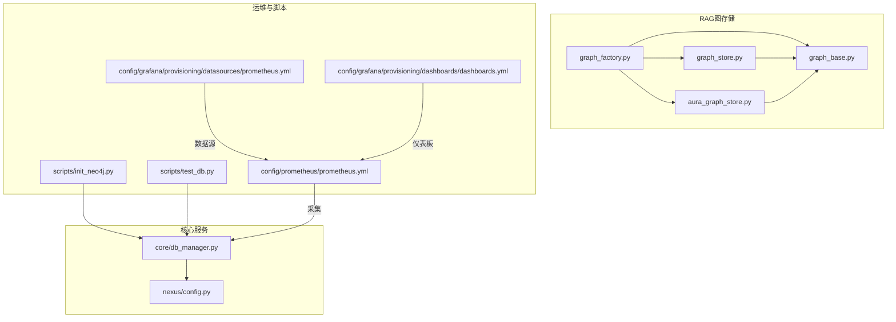
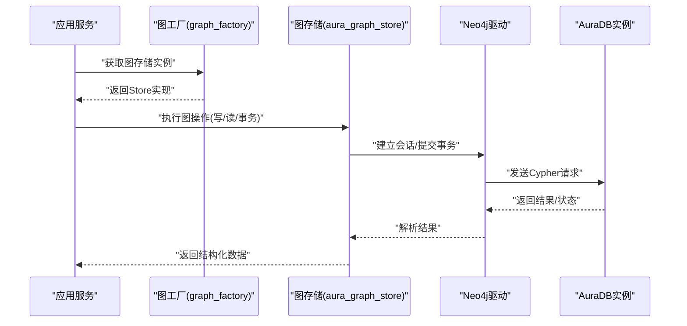
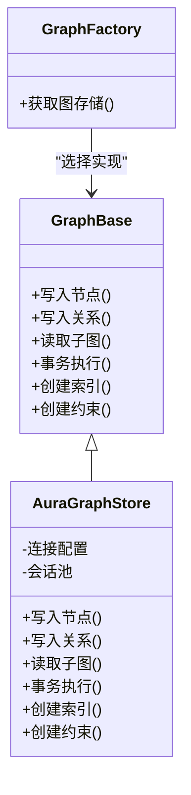
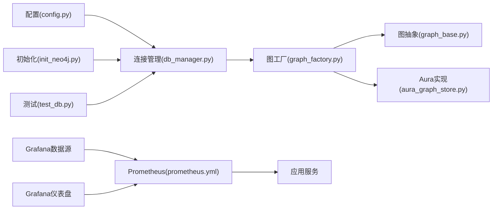

# Neo4j图数据库设计

<cite>
**本文引用的文件**   
- [backend_design/nexus/rag/aura_graph_store.py](file://backend_design/nexus/rag/aura_graph_store.py)
- [backend_design/nexus/rag/graph_base.py](file://backend_design/nexus/rag/graph_base.py)
- [backend_design/nexus/rag/graph_factory.py](file://backend_design/nexus/rag/graph_factory.py)
- [backend_design/nexus/rag/graph_store.py](file://backend_design/nexus/rag/graph_store.py)
- [backend_design/nexus/core/db_manager.py](file://backend_design/nexus/core/db_manager.py)
- [backend_design/nexus/config.py](file://backend_design/nexus/config.py)
- [backend_design/scripts/init_neo4j.py](file://backend_design/scripts/init_neo4j.py)
- [backend_design/scripts/test_db.py](file://backend_design/scripts/test_db.py)
- [config/prometheus/prometheus.yml](file://config/prometheus/prometheus.yml)
- [config/grafana/provisioning/dashboards/dashboards.yml](file://config/grafana/provisioning/dashboards/dashboards.yml)
- [config/grafana/provisioning/datasources/prometheus.yml](file://config/grafana/provisioning/datasources/prometheus.yml)
</cite>

## 目录
1. [引言](#引言)
2. [项目结构](#项目结构)
3. [核心组件](#核心组件)
4. [架构总览](#架构总览)
5. [详细组件分析](#详细组件分析)
6. [依赖分析](#依赖分析)
7. [性能考虑](#性能考虑)
8. [故障排查指南](#故障排查指南)
9. [结论](#结论)
10. [附录](#附录)

## 引言
本技术文档聚焦于系统在知识图谱构建与关系推理中对Neo4j的图数据库设计与集成。内容涵盖节点与关系建模、属性结构设计、Cypher查询规范与优化、与AuraDB云服务的连接与安全配置、数据导入导出与备份恢复策略、复杂查询场景实现示例，以及监控指标与容量规划建议。文档面向具备不同技术背景的读者，力求在可操作性和可读性之间取得平衡。

## 项目结构
本项目中与Neo4j相关的代码主要位于后端Python模块的RAG（检索增强生成）层与核心基础设施中：
- RAG图存储抽象与实现：graph_base.py、graph_store.py、aura_graph_store.py、graph_factory.py
- 数据库连接管理：core/db_manager.py
- 配置项：nexus/config.py
- 初始化脚本：scripts/init_neo4j.py
- 测试脚本：scripts/test_db.py
- 监控配置：prometheus.yml、grafana相关配置文件

图表来源
- [backend_design/nexus/rag/graph_base.py](file://backend_design/nexus/rag/graph_base.py)
- [backend_design/nexus/rag/graph_store.py](file://backend_design/nexus/rag/graph_store.py)
- [backend_design/nexus/rag/aura_graph_store.py](file://backend_design/nexus/rag/aura_graph_store.py)
- [backend_design/nexus/rag/graph_factory.py](file://backend_design/nexus/rag/graph_factory.py)
- [backend_design/nexus/core/db_manager.py](file://backend_design/nexus/core/db_manager.py)
- [backend_design/nexus/config.py](file://backend_design/nexus/config.py)
- [backend_design/scripts/init_neo4j.py](file://backend_design/scripts/init_neo4j.py)
- [backend_design/scripts/test_db.py](file://backend_design/scripts/test_db.py)
- [config/prometheus/prometheus.yml](file://config/prometheus/prometheus.yml)
- [config/grafana/provisioning/datasources/prometheus.yml](file://config/grafana/provisioning/datasources/prometheus.yml)
- [config/grafana/provisioning/dashboards/dashboards.yml](file://config/grafana/provisioning/dashboards/dashboards.yml)

章节来源
- [backend_design/nexus/rag/graph_base.py](file://backend_design/nexus/rag/graph_base.py)
- [backend_design/nexus/rag/graph_store.py](file://backend_design/nexus/rag/graph_store.py)
- [backend_design/nexus/rag/aura_graph_store.py](file://backend_design/nexus/rag/aura_graph_store.py)
- [backend_design/nexus/rag/graph_factory.py](file://backend_design/nexus/rag/graph_factory.py)
- [backend_design/nexus/core/db_manager.py](file://backend_design/nexus/core/db_manager.py)
- [backend_design/nexus/config.py](file://backend_design/nexus/config.py)
- [backend_design/scripts/init_neo4j.py](file://backend_design/scripts/init_neo4j.py)
- [backend_design/scripts/test_db.py](file://backend_design/scripts/test_db.py)
- [config/prometheus/prometheus.yml](file://config/prometheus/prometheus.yml)
- [config/grafana/provisioning/datasources/prometheus.yml](file://config/grafana/provisioning/datasources/prometheus.yml)
- [config/grafana/provisioning/dashboards/dashboards.yml](file://config/grafana/provisioning/dashboards/dashboards.yml)

## 核心组件
- 图存储抽象接口：定义统一的图写入、读取、事务与索引管理方法，屏蔽底层差异。
- AuraDB图存储实现：基于Neo4j官方驱动对接AuraDB云服务，负责连接管理、认证、安全传输与错误处理。
- 图工厂：根据配置选择具体图存储实现（如本地Neo4j或AuraDB）。
- 数据库管理器：集中管理数据库连接生命周期、重试与熔断等通用能力。
- 配置中心：提供Neo4j/AuraDB的连接参数、超时、重试、TLS等开关。
- 初始化脚本：用于创建标签、约束、索引与初始种子数据。
- 测试脚本：验证连通性、读写路径与基本事务语义。
- 监控配置：Prometheus抓取应用指标，Grafana展示仪表盘。

章节来源
- [backend_design/nexus/rag/graph_base.py](file://backend_design/nexus/rag/graph_base.py)
- [backend_design/nexus/rag/aura_graph_store.py](file://backend_design/nexus/rag/aura_graph_store.py)
- [backend_design/nexus/rag/graph_factory.py](file://backend_design/nexus/rag/graph_factory.py)
- [backend_design/nexus/core/db_manager.py](file://backend_design/nexus/core/db_manager.py)
- [backend_design/nexus/config.py](file://backend_design/nexus/config.py)
- [backend_design/scripts/init_neo4j.py](file://backend_design/scripts/init_neo4j.py)
- [backend_design/scripts/test_db.py](file://backend_design/scripts/test_db.py)

## 架构总览
系统通过RAG图存储抽象层统一访问Neo4j，支持本地部署与AuraDB云服务两种模式。上层业务（如对话、技能、记忆等）通过图工厂获取具体实现，执行图数据的增删改查与复杂遍历。监控侧由Prometheus采集应用指标，Grafana进行可视化。

图表来源
- [backend_design/nexus/rag/graph_factory.py](file://backend_design/nexus/rag/graph_factory.py)
- [backend_design/nexus/rag/aura_graph_store.py](file://backend_design/nexus/rag/aura_graph_store.py)
- [backend_design/nexus/rag/graph_base.py](file://backend_design/nexus/rag/graph_base.py)

## 详细组件分析

### 图存储抽象与实现
- 抽象接口：定义统一的写入、读取、事务边界、索引与约束管理方法，确保上层调用一致。
- AuraDB实现：封装Neo4j驱动连接、会话复用、错误重试、TLS加密与认证信息注入；对异常进行规范化转换，便于上层统一处理。
- 工厂模式：依据配置动态选择本地或云端实现，降低耦合度。

图表来源
- [backend_design/nexus/rag/graph_base.py](file://backend_design/nexus/rag/graph_base.py)
- [backend_design/nexus/rag/aura_graph_store.py](file://backend_design/nexus/rag/aura_graph_store.py)
- [backend_design/nexus/rag/graph_factory.py](file://backend_design/nexus/rag/graph_factory.py)

章节来源
- [backend_design/nexus/rag/graph_base.py](file://backend_design/nexus/rag/graph_base.py)
- [backend_design/nexus/rag/aura_graph_store.py](file://backend_design/nexus/rag/aura_graph_store.py)
- [backend_design/nexus/rag/graph_factory.py](file://backend_design/nexus/rag/graph_factory.py)

### 连接管理与配置
- 连接管理：集中管理连接生命周期、重试与熔断，避免资源泄漏与雪崩效应。
- 配置项：包含主机、端口、用户名、密码、数据库名、超时、最大连接数、TLS开关等；支持按环境切换本地与AuraDB。
- 安全配置：强制使用TLS、最小权限账户、敏感信息从环境变量注入。

章节来源
- [backend_design/nexus/core/db_manager.py](file://backend_design/nexus/core/db_manager.py)
- [backend_design/nexus/config.py](file://backend_design/nexus/config.py)

### 初始化与测试
- 初始化脚本：创建必要的标签、唯一性约束与索引，并可选加载种子数据，保证图模型一致性。
- 测试脚本：验证连通性、基础读写与事务语义，作为回归保障。

章节来源
- [backend_design/scripts/init_neo4j.py](file://backend_design/scripts/init_neo4j.py)
- [backend_design/scripts/test_db.py](file://backend_design/scripts/test_db.py)

### 监控与可观测性
- Prometheus抓取应用暴露的指标（如连接池状态、查询耗时、错误率）。
- Grafana数据源与仪表盘配置，提供直观监控视图。

章节来源
- [config/prometheus/prometheus.yml](file://config/prometheus/prometheus.yml)
- [config/grafana/provisioning/datasources/prometheus.yml](file://config/grafana/provisioning/datasources/prometheus.yml)
- [config/grafana/provisioning/dashboards/dashboards.yml](file://config/grafana/provisioning/dashboards/dashboards.yml)

## 依赖分析
- 组件内聚与耦合：
  - 图存储抽象与实现解耦良好，工厂模式降低选择逻辑耦合。
  - 连接管理与配置集中在核心层，便于统一治理。
- 外部依赖：
  - Neo4j官方驱动用于与Neo4j/AuraDB通信。
  - Prometheus/Grafana用于监控与可视化。
- 潜在循环依赖：
  - 当前分层清晰，未见明显循环依赖风险。

图表来源
- [backend_design/nexus/config.py](file://backend_design/nexus/config.py)
- [backend_design/nexus/core/db_manager.py](file://backend_design/nexus/core/db_manager.py)
- [backend_design/nexus/rag/graph_factory.py](file://backend_design/nexus/rag/graph_factory.py)
- [backend_design/nexus/rag/graph_base.py](file://backend_design/nexus/rag/graph_base.py)
- [backend_design/nexus/rag/aura_graph_store.py](file://backend_design/nexus/rag/aura_graph_store.py)
- [backend_design/scripts/init_neo4j.py](file://backend_design/scripts/init_neo4j.py)
- [backend_design/scripts/test_db.py](file://backend_design/scripts/test_db.py)
- [config/prometheus/prometheus.yml](file://config/prometheus/prometheus.yml)
- [config/grafana/provisioning/datasources/prometheus.yml](file://config/grafana/provisioning/datasources/prometheus.yml)
- [config/grafana/provisioning/dashboards/dashboards.yml](file://config/grafana/provisioning/dashboards/dashboards.yml)

章节来源
- [backend_design/nexus/config.py](file://backend_design/nexus/config.py)
- [backend_design/nexus/core/db_manager.py](file://backend_design/nexus/core/db_manager.py)
- [backend_design/nexus/rag/graph_factory.py](file://backend_design/nexus/rag/graph_factory.py)
- [backend_design/nexus/rag/graph_base.py](file://backend_design/nexus/rag/graph_base.py)
- [backend_design/nexus/rag/aura_graph_store.py](file://backend_design/nexus/rag/aura_graph_store.py)
- [backend_design/scripts/init_neo4j.py](file://backend_design/scripts/init_neo4j.py)
- [backend_design/scripts/test_db.py](file://backend_design/scripts/test_db.py)
- [config/prometheus/prometheus.yml](file://config/prometheus/prometheus.yml)
- [config/grafana/provisioning/datasources/prometheus.yml](file://config/grafana/provisioning/datasources/prometheus.yml)
- [config/grafana/provisioning/dashboards/dashboards.yml](file://config/grafana/provisioning/dashboards/dashboards.yml)

## 性能考虑
- 索引与约束
  - 为高频查询键（如实体ID、名称、类型）创建唯一性约束与索引，减少全表扫描。
  - 关系方向与类型明确化，避免无向遍历带来的组合爆炸。
- Cypher编写规范
  - 限制遍历深度，使用WITH分页与LIMIT控制结果集规模。
  - 避免在WHERE中使用函数包裹索引字段，保持索引命中。
  - 批量写入使用UNION ALL与MERGE，减少重复判断开销。
- 连接与事务
  - 合理设置连接池大小与超时，避免连接耗尽。
  - 将相关写入合并到单一事务，提升吞吐与一致性。
- 缓存与降级
  - 热点子图可引入Redis缓存，减轻Neo4j压力。
  - 当Neo4j不可用时，启用只读缓存或降级策略，保障可用性。
- 监控与调优
  - 关注查询耗时、锁等待、内存占用与GC情况，结合慢查询日志定位瓶颈。
  - 定期重建统计信息与评估索引有效性。

[本节为通用指导，不直接分析具体文件]

## 故障排查指南
- 连接失败
  - 检查主机、端口、用户名、密码、数据库名是否正确。
  - 确认TLS证书与网络可达性，核对防火墙与安全组规则。
- 认证与权限
  - 使用最小权限账户，仅授予必要数据库与角色。
  - 核对用户是否被锁定或密码过期。
- 查询缓慢
  - 查看执行计划，确认索引命中与遍历范围。
  - 拆分复杂查询，增加中间聚合与分页。
- 事务冲突
  - 识别长事务与热点节点，缩短事务粒度。
  - 调整并发度与重试策略，避免死锁。
- 监控告警
  - 利用Prometheus与Grafana观察关键指标，设置阈值告警。
  - 结合日志上下文快速定位问题根因。

章节来源
- [backend_design/nexus/core/db_manager.py](file://backend_design/nexus/core/db_manager.py)
- [backend_design/nexus/config.py](file://backend_design/nexus/config.py)
- [config/prometheus/prometheus.yml](file://config/prometheus/prometheus.yml)
- [config/grafana/provisioning/datasources/prometheus.yml](file://config/grafana/provisioning/datasources/prometheus.yml)
- [config/grafana/provisioning/dashboards/dashboards.yml](file://config/grafana/provisioning/dashboards/dashboards.yml)

## 结论
本设计通过抽象与工厂模式实现了Neo4j与AuraDB的统一接入，配合完善的连接管理、配置与安全策略，保障了系统的可扩展性与稳定性。在查询层面强调索引与Cypher规范，辅以监控与容量规划，形成闭环的性能与可靠性保障。后续可在图模型演进、复杂推理算法与多租户隔离方面持续深化。

[本节为总结性内容，不直接分析具体文件]

## 附录

### 图模型与属性结构建议
- 节点类型
  - 实体：如人物、组织、产品、地点等，包含标识、名称、描述、时间戳等属性。
  - 概念：领域术语、分类、标签，包含层级关系与同义词。
  - 事件：行为、变更、交互记录，包含时间、参与者、上下文。
- 关系类型
  - 关联类：属于、参与、拥有、影响、触发等，明确方向与权重。
  - 时序类：发生在之前/之后、导致、依赖等，支撑因果推理。
- 属性设计
  - 主键与唯一性：为实体ID、名称等设置唯一性约束。
  - 时间与时区：统一时间格式与时区，便于排序与窗口计算。
  - 元数据：版本、来源、置信度、审计字段，便于溯源与治理。

[本节为概念性说明，不直接分析具体文件]

### 导入导出流程与备份恢复
- 导入
  - 增量导入：基于时间戳或版本号，使用事务分批写入，避免大事务。
  - 去重策略：使用MERGE与唯一性约束保证幂等。
  - 校验：导入前后对比计数与抽样校验，确保完整性。
- 导出
  - 按需导出：基于条件过滤与分页，输出CSV/JSON供离线分析。
  - 快照：定期导出关键子图与元数据，便于迁移与回滚。
- 备份恢复
  - 使用Neo4j原生备份工具或云托管备份能力，制定RPO/RTO目标。
  - 演练恢复流程，验证数据一致性与可用性。

[本节为概念性说明，不直接分析具体文件]

### 复杂查询场景示例（思路与要点）
- 多跳关系查询
  - 限制跳数与分支因子，使用WITH聚合与LIMIT控制结果。
  - 预筛选条件以减少搜索空间。
- 路径发现
  - 指定起点与终点，限定最大长度与关系类型集合。
  - 使用最短路径或自定义评分函数进行排序。
- 社区检测
  - 基于局部连通性与相似度聚类，分阶段计算与缓存中间结果。
  - 周期性更新社区标签，避免实时高负载。

[本节为概念性说明，不直接分析具体文件]

### 监控指标与容量规划
- 关键指标
  - 连接池：活跃连接、等待队列、超时次数。
  - 查询性能：P95/P99延迟、慢查询数量、锁等待。
  - 资源使用：CPU、内存、磁盘I/O、页缓存命中率。
  - 错误率：认证失败、网络异常、事务冲突。
- 容量规划
  - 节点与关系规模估算，预留增长空间。
  - 索引数量与选择性评估，避免过度索引。
  - 集群与副本策略，满足可用性与一致性需求。

章节来源
- [config/prometheus/prometheus.yml](file://config/prometheus/prometheus.yml)
- [config/grafana/provisioning/datasources/prometheus.yml](file://config/grafana/provisioning/datasources/prometheus.yml)
- [config/grafana/provisioning/dashboards/dashboards.yml](file://config/grafana/provisioning/dashboards/dashboards.yml)