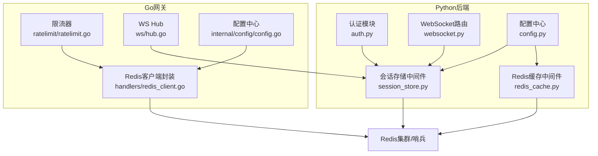
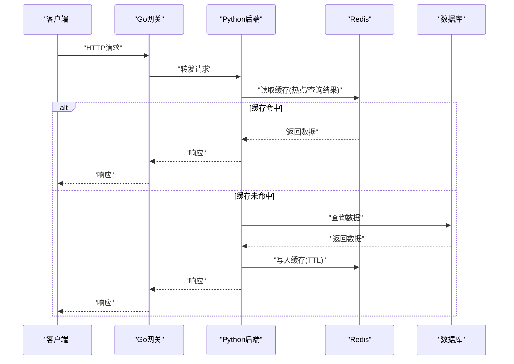
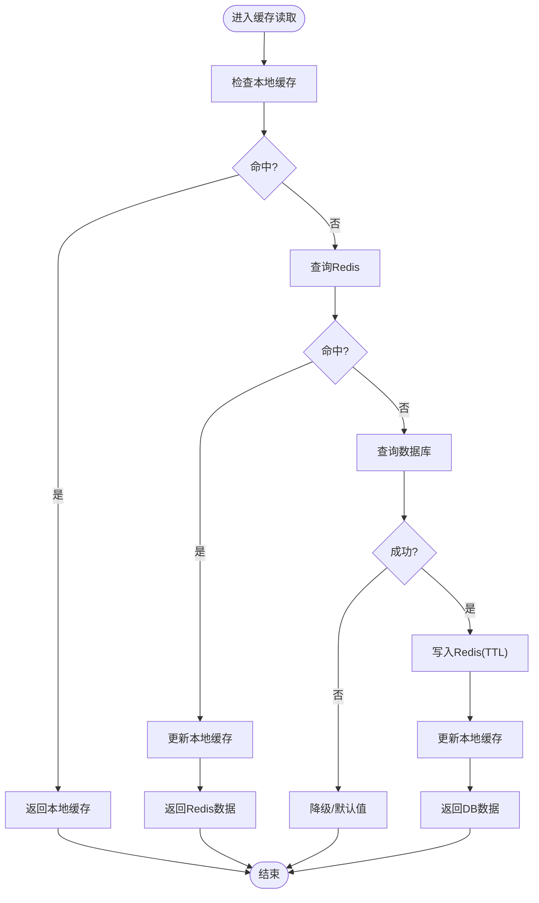
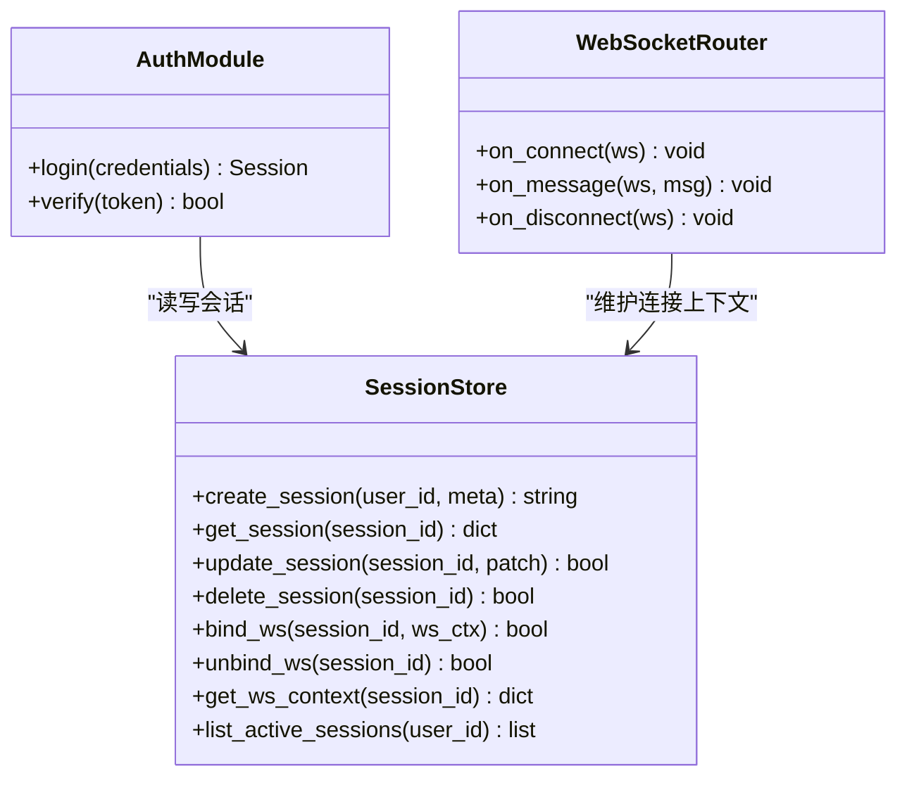
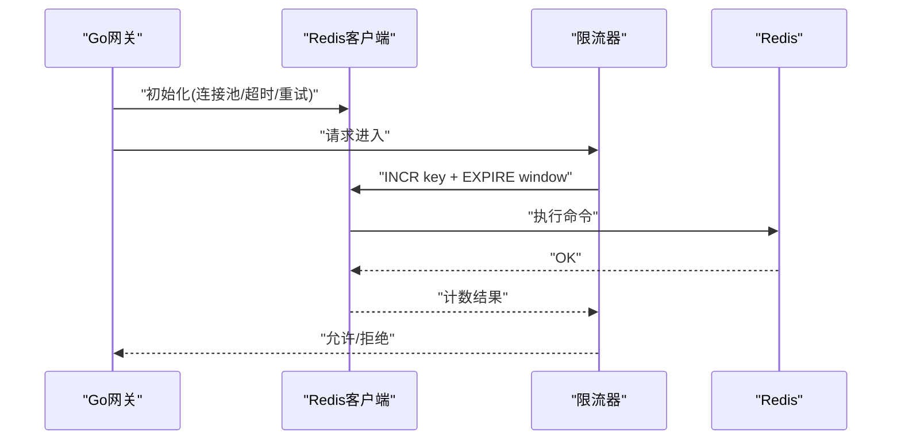
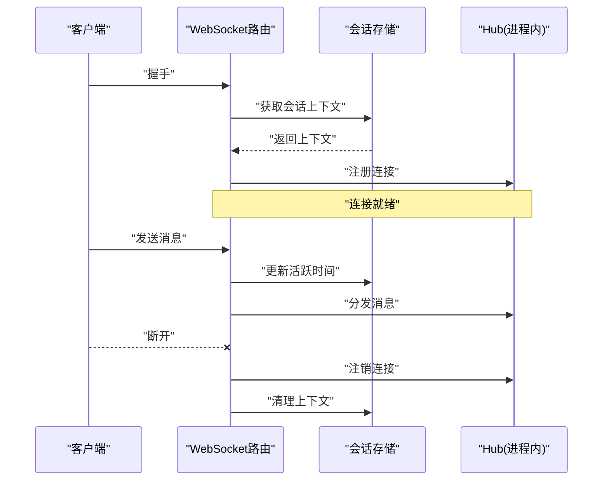
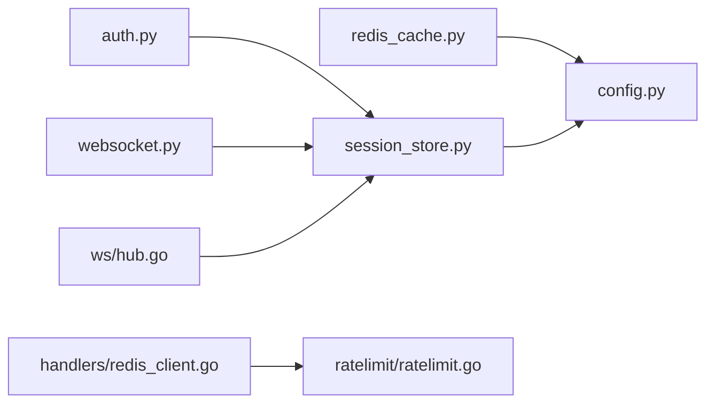

# Redis缓存与会话管理

<cite>
**本文引用的文件**   
- [backend_design/nexus/middleware/redis_cache.py](file://backend_design/nexus/middleware/redis_cache.py)
- [backend_design/nexus/middleware/session_store.py](file://backend_design/nexus/middleware/session_store.py)
- [backend_design/nexus/core/auth.py](file://backend_design/nexus/core/auth.py)
- [backend_design/nexus/api/websocket.py](file://backend_design/nexus/api/websocket.py)
- [backend_design/nexus_gate/internal/handlers/redis_client.go](file://backend_design/nexus_gate/internal/handlers/redis_client.go)
- [backend_design/nexus_gate/internal/ratelimit/ratelimit.go](file://backend_design/nexus_gate/internal/ratelimit/ratelimit.go)
- [backend_design/nexus_gate/internal/ws/hub.go](file://backend_design/nexus_gate/internal/ws/hub.go)
- [backend_design/nexus/config.py](file://backend_design/nexus/config.py)
- [backend_design/nexus_gate/internal/config/config.go](file://backend_design/nexus_gate/internal/config/config.go)
</cite>

## 目录
1. [简介](#简介)
2. [项目结构](#项目结构)
3. [核心组件](#核心组件)
4. [架构总览](#架构总览)
5. [详细组件分析](#详细组件分析)
6. [依赖关系分析](#依赖关系分析)
7. [性能考虑](#性能考虑)
8. [故障排查指南](#故障排查指南)
9. [结论](#结论)
10. [附录](#附录)

## 简介
本技术文档聚焦于系统在多级缓存架构中基于Redis的缓存与会话管理方案，覆盖以下主题：
- 会话存储机制：用户会话状态、WebSocket连接上下文与实时通信状态维护
- 缓存策略设计：热点数据缓存、查询结果缓存、分布式锁实现
- Go网关侧Redis客户端：连接池、错误重试、超时控制
- 失效策略、持久化配置与高可用部署
- 高级特性：缓存穿透防护、雪崩预防、内存优化
- 完整操作示例与监控指标定义

## 项目结构
本项目在Python后端与Go网关两侧分别实现了Redis相关能力：
- Python端提供通用Redis缓存中间件与会话存储中间件，并集成到认证与WebSocket流程
- Go网关侧提供轻量Redis客户端封装，用于限流等场景

图表来源
- [backend_design/nexus/middleware/redis_cache.py](file://backend_design/nexus/middleware/redis_cache.py)
- [backend_design/nexus/middleware/session_store.py](file://backend_design/nexus/middleware/session_store.py)
- [backend_design/nexus/core/auth.py](file://backend_design/nexus/core/auth.py)
- [backend_design/nexus/api/websocket.py](file://backend_design/nexus/api/websocket.py)
- [backend_design/nexus/config.py](file://backend_design/nexus/config.py)
- [backend_design/nexus_gate/internal/handlers/redis_client.go](file://backend_design/nexus_gate/internal/handlers/redis_client.go)
- [backend_design/nexus_gate/internal/ratelimit/ratelimit.go](file://backend_design/nexus_gate/internal/ratelimit/ratelimit.go)
- [backend_design/nexus_gate/internal/ws/hub.go](file://backend_design/nexus_gate/internal/ws/hub.go)
- [backend_design/nexus_gate/internal/config/config.go](file://backend_design/nexus_gate/internal/config/config.go)

章节来源
- [backend_design/nexus/middleware/redis_cache.py](file://backend_design/nexus/middleware/redis_cache.py)
- [backend_design/nexus/middleware/session_store.py](file://backend_design/nexus/middleware/session_store.py)
- [backend_design/nexus/core/auth.py](file://backend_design/nexus/core/auth.py)
- [backend_design/nexus/api/websocket.py](file://backend_design/nexus/api/websocket.py)
- [backend_design/nexus/config.py](file://backend_design/nexus/config.py)
- [backend_design/nexus_gate/internal/handlers/redis_client.go](file://backend_design/nexus_gate/internal/handlers/redis_client.go)
- [backend_design/nexus_gate/internal/ratelimit/ratelimit.go](file://backend_design/nexus_gate/internal/ratelimit/ratelimit.go)
- [backend_design/nexus_gate/internal/ws/hub.go](file://backend_design/nexus_gate/internal/ws/hub.go)
- [backend_design/nexus_gate/internal/config/config.go](file://backend_design/nexus_gate/internal/config/config.go)

## 核心组件
- Redis缓存中间件（Python）
  - 职责：统一封装Redis读写、序列化、TTL、键空间前缀、异常处理与降级
  - 典型用法：装饰器或显式调用，支持热点数据与查询结果缓存
- 会话存储中间件（Python）
  - 职责：用户会话生命周期管理、WebSocket连接上下文映射、实时状态维护
  - 典型用法：登录成功后写入会话；WS握手时建立连接上下文；消息广播时读取上下文
- 认证模块（Python）
  - 职责：鉴权、令牌校验、会话绑定
  - 与缓存交互：通过会话存储中间件存取会话
- WebSocket路由（Python）
  - 职责：接入WS连接、路由事件、维护在线状态
  - 与缓存交互：通过会话存储中间件维护连接上下文
- Go网关Redis客户端
  - 职责：为网关层提供统一的Redis访问能力（如限流），包含连接池、超时、重试
- 限流器（Go）
  - 职责：基于Redis的滑动窗口/固定窗口计数，支撑网关级限流
- WS Hub（Go）
  - 职责：管理长连接集合，配合会话存储进行跨进程广播

章节来源
- [backend_design/nexus/middleware/redis_cache.py](file://backend_design/nexus/middleware/redis_cache.py)
- [backend_design/nexus/middleware/session_store.py](file://backend_design/nexus/middleware/session_store.py)
- [backend_design/nexus/core/auth.py](file://backend_design/nexus/core/auth.py)
- [backend_design/nexus/api/websocket.py](file://backend_design/nexus/api/websocket.py)
- [backend_design/nexus_gate/internal/handlers/redis_client.go](file://backend_design/nexus_gate/internal/handlers/redis_client.go)
- [backend_design/nexus_gate/internal/ratelimit/ratelimit.go](file://backend_design/nexus_gate/internal/ratelimit/ratelimit.go)
- [backend_design/nexus_gate/internal/ws/hub.go](file://backend_design/nexus_gate/internal/ws/hub.go)

## 架构总览
系统采用“应用内缓存 + Redis分布式缓存”的多级缓存架构。热点数据优先命中本地缓存，未命中则回源至Redis，再落库。会话与实时状态统一落Redis，保证多实例共享与水平扩展。

图表来源
- [backend_design/nexus/middleware/redis_cache.py](file://backend_design/nexus/middleware/redis_cache.py)
- [backend_design/nexus/middleware/session_store.py](file://backend_design/nexus/middleware/session_store.py)
- [backend_design/nexus_gate/internal/handlers/redis_client.go](file://backend_design/nexus_gate/internal/handlers/redis_client.go)

## 详细组件分析

### Redis缓存中间件（Python）
- 设计要点
  - 键命名规范：业务域:子域:主键，便于隔离与批量清理
  - 序列化：JSON/MessagePack，按数据类型选择
  - TTL策略：热点短TTL、查询结果中等TTL、静态配置长TTL
  - 异常与降级：网络异常快速失败，返回默认值或走直连DB
  - 可观测性：记录命中率、延迟、错误率
- 使用模式
  - 装饰器式：对接口方法加注解自动缓存
  - 显式API：get/set/del/incr/decr/zset/hset/hgetall等
- 关键路径
  - 读路径：检查本地缓存 -> 查Redis -> 回源DB -> 回填缓存
  - 写路径：更新DB -> 删除/更新相关缓存键（失效优先）

图表来源
- [backend_design/nexus/middleware/redis_cache.py](file://backend_design/nexus/middleware/redis_cache.py)

章节来源
- [backend_design/nexus/middleware/redis_cache.py](file://backend_design/nexus/middleware/redis_cache.py)

### 会话存储中间件（Python）
- 设计要点
  - 会话模型：用户ID、设备信息、角色权限、时间戳、扩展字段
  - 连接上下文：WebSocket fd/通道、房间/频道、最后活跃时间
  - 一致性：会话变更原子化，避免并发覆盖
  - 过期清理：TTL+后台扫描双保险
- 典型流程
  - 登录：生成会话ID，写入Redis，绑定用户属性
  - 鉴权：从Redis拉取会话，校验有效期与权限
  - WS连接：建立连接上下文，注册到会话映射表
  - 断线：清理连接上下文，保留会话以便重连

图表来源
- [backend_design/nexus/middleware/session_store.py](file://backend_design/nexus/middleware/session_store.py)
- [backend_design/nexus/core/auth.py](file://backend_design/nexus/core/auth.py)
- [backend_design/nexus/api/websocket.py](file://backend_design/nexus/api/websocket.py)

章节来源
- [backend_design/nexus/middleware/session_store.py](file://backend_design/nexus/middleware/session_store.py)
- [backend_design/nexus/core/auth.py](file://backend_design/nexus/core/auth.py)
- [backend_design/nexus/api/websocket.py](file://backend_design/nexus/api/websocket.py)

### Go网关Redis客户端
- 设计要点
  - 连接池：最大空闲、最大连接数、最小空闲、连接存活时间
  - 超时控制：DialTimeout、ReadTimeout、WriteTimeout、PoolTimeout
  - 重试机制：指数退避、幂等命令重试、非幂等不重试
  - 健康检查：Ping检测、连接泄漏保护
- 适用场景
  - 网关限流、黑名单、白名单、动态开关
- 关键API
  - Get/Set/Del/Incr/Expire/ZAdd/ZRange等基础命令封装

图表来源
- [backend_design/nexus_gate/internal/handlers/redis_client.go](file://backend_design/nexus_gate/internal/handlers/redis_client.go)
- [backend_design/nexus_gate/internal/ratelimit/ratelimit.go](file://backend_design/nexus_gate/internal/ratelimit/ratelimit.go)

章节来源
- [backend_design/nexus_gate/internal/handlers/redis_client.go](file://backend_design/nexus_gate/internal/handlers/redis_client.go)
- [backend_design/nexus_gate/internal/ratelimit/ratelimit.go](file://backend_design/nexus_gate/internal/ratelimit/ratelimit.go)

### WebSocket连接上下文与会话联动
- 设计要点
  - 连接上下文：连接句柄、订阅频道、发送队列、心跳状态
  - 会话绑定：一个会话可绑定多个连接（多端在线）
  - 广播：按会话维度推送，避免重复投递
- 流程
  - 连接建立：创建上下文，注册到会话映射
  - 消息处理：根据会话权限路由，必要时更新活跃时间
  - 断开清理：移除上下文，若会话无连接则标记离线

图表来源
- [backend_design/nexus/api/websocket.py](file://backend_design/nexus/api/websocket.py)
- [backend_design/nexus/middleware/session_store.py](file://backend_design/nexus/middleware/session_store.py)
- [backend_design/nexus_gate/internal/ws/hub.go](file://backend_design/nexus_gate/internal/ws/hub.go)

章节来源
- [backend_design/nexus/api/websocket.py](file://backend_design/nexus/api/websocket.py)
- [backend_design/nexus/middleware/session_store.py](file://backend_design/nexus/middleware/session_store.py)
- [backend_design/nexus_gate/internal/ws/hub.go](file://backend_design/nexus_gate/internal/ws/hub.go)

### 分布式锁实现（建议）
- 目标：跨进程互斥，保护热点键更新、库存扣减等
- 推荐方案
  - SETNX + EXPIRE原子设置（SET key value NX EX ttl）
  - 看门狗续期：持有锁的协程定时续期，防止业务慢导致提前释放
  - 解锁：仅当value匹配时DEL，确保只释放自身锁
- 注意事项
  - 锁粒度尽量小，避免热点竞争
  - 死锁防护：设置合理TTL，结合监控告警
  - 幂等：锁内逻辑需幂等，避免重复执行副作用

章节来源
- [backend_design/nexus/middleware/redis_cache.py](file://backend_design/nexus/middleware/redis_cache.py)

## 依赖关系分析
- Python端
  - redis_cache.py 被各业务模块直接调用
  - session_store.py 被 auth.py 与 websocket.py 依赖
  - config.py 提供Redis连接参数与策略
- Go网关
  - redis_client.go 被 ratelimit.go 与可能的其他网关逻辑使用
  - hub.go 负责进程内连接管理，与Python会话存储协作

图表来源
- [backend_design/nexus/middleware/redis_cache.py](file://backend_design/nexus/middleware/redis_cache.py)
- [backend_design/nexus/middleware/session_store.py](file://backend_design/nexus/middleware/session_store.py)
- [backend_design/nexus/core/auth.py](file://backend_design/nexus/core/auth.py)
- [backend_design/nexus/api/websocket.py](file://backend_design/nexus/api/websocket.py)
- [backend_design/nexus/config.py](file://backend_design/nexus/config.py)
- [backend_design/nexus_gate/internal/handlers/redis_client.go](file://backend_design/nexus_gate/internal/handlers/redis_client.go)
- [backend_design/nexus_gate/internal/ratelimit/ratelimit.go](file://backend_design/nexus_gate/internal/ratelimit/ratelimit.go)
- [backend_design/nexus_gate/internal/ws/hub.go](file://backend_design/nexus_gate/internal/ws/hub.go)

章节来源
- [backend_design/nexus/middleware/redis_cache.py](file://backend_design/nexus/middleware/redis_cache.py)
- [backend_design/nexus/middleware/session_store.py](file://backend_design/nexus/middleware/session_store.py)
- [backend_design/nexus/core/auth.py](file://backend_design/nexus/core/auth.py)
- [backend_design/nexus/api/websocket.py](file://backend_design/nexus/api/websocket.py)
- [backend_design/nexus/config.py](file://backend_design/nexus/config.py)
- [backend_design/nexus_gate/internal/handlers/redis_client.go](file://backend_design/nexus_gate/internal/handlers/redis_client.go)
- [backend_design/nexus_gate/internal/ratelimit/ratelimit.go](file://backend_design/nexus_gate/internal/ratelimit/ratelimit.go)
- [backend_design/nexus_gate/internal/ws/hub.go](file://backend_design/nexus_gate/internal/ws/hub.go)

## 性能考虑
- 连接池
  - Python：合理设置max_connections、socket_timeout、retry_on_timeout
  - Go：MaxIdle、MaxActive、MinIdle、IdleTimeout、DialTimeout、ReadTimeout、WriteTimeout、PoolTimeout
- 超时与重试
  - 读路径短超时+快速失败；写路径谨慎重试，确保幂等
  - 指数退避与抖动，避免惊群
- 缓存策略
  - 热点数据：短TTL+随机抖动，降低集中过期
  - 查询结果：按查询特征分片缓存，避免大对象
  - 写扩散 vs 读扩散：热点写少读多用读扩散；热点写多用写扩散
- 内存优化
  - 压缩：启用LZF/ZSTD（视版本与CPU权衡）
  - 淘汰策略：volatile-lru/allkeys-lfu，依据业务冷热分布
  - 键空间：合理命名与哈希聚合，减少碎片
- 监控与告警
  - 命中率、P95/P99延迟、错误率、连接池利用率、内存碎片率、阻塞时长

[本节为通用指导，无需代码来源]

## 故障排查指南
- 常见问题
  - 连接失败：检查网络连通、认证凭据、端口与安全组
  - 超时频繁：调整超时参数、检查慢查询、评估热点键竞争
  - 内存不足：观察碎片率与淘汰策略，扩容或优化键大小
  - 会话丢失：确认TTL与后台清理任务，检查异常分支是否清理
- 定位手段
  - 日志：记录关键路径耗时与错误码
  - 指标：暴露Redis客户端SDK指标与应用自定义指标
  - 链路追踪：串联网关-后端-Redis调用链
- 恢复策略
  - 熔断与降级：Redis不可用时返回默认值或走直连
  - 快速重建：预热热点键，避免雪崩

章节来源
- [backend_design/nexus/middleware/redis_cache.py](file://backend_design/nexus/middleware/redis_cache.py)
- [backend_design/nexus/middleware/session_store.py](file://backend_design/nexus/middleware/session_store.py)
- [backend_design/nexus_gate/internal/handlers/redis_client.go](file://backend_design/nexus_gate/internal/handlers/redis_client.go)

## 结论
通过Python端Redis缓存与会话中间件，以及Go网关侧Redis客户端封装，系统实现了高效、可扩展的缓存与会话管理能力。结合合理的失效策略、高可用部署与完善的监控告警，可在保障一致性的同时获得良好的性能与稳定性。

[本节为总结，无需代码来源]

## 附录

### 配置项参考
- Python端（示例键名，具体以实现为准）
  - REDIS_HOST / REDIS_PORT / REDIS_DB / REDIS_PASSWORD
  - REDIS_MAX_CONNECTIONS / REDIS_SOCKET_TIMEOUT / REDIS_RETRY_ON_TIMEOUT
  - CACHE_TTL_DEFAULT / CACHE_TTL_HOT / CACHE_TTL_QUERY
  - SESSION_TTL_DEFAULT / SESSION_WS_IDLE_TIMEOUT
- Go网关（示例键名，具体以实现为准）
  - REDIS_ADDR / REDIS_PASSWORD / REDIS_DB
  - REDIS_POOL_MAX_IDLE / REDIS_POOL_MAX_ACTIVE / REDIS_POOL_MIN_IDLE / REDIS_POOL_IDLE_TIMEOUT
  - REDIS_DIAL_TIMEOUT / REDIS_READ_TIMEOUT / REDIS_WRITE_TIMEOUT / REDIS_POOL_TIMEOUT

章节来源
- [backend_design/nexus/config.py](file://backend_design/nexus/config.py)
- [backend_design/nexus_gate/internal/config/config.go](file://backend_design/nexus_gate/internal/config/config.go)

### 缓存操作示例（路径指引）
- 热点数据缓存
  - 读取：[backend_design/nexus/middleware/redis_cache.py](file://backend_design/nexus/middleware/redis_cache.py)
  - 写入/失效：[backend_design/nexus/middleware/redis_cache.py](file://backend_design/nexus/middleware/redis_cache.py)
- 查询结果缓存
  - 装饰器/显式API：[backend_design/nexus/middleware/redis_cache.py](file://backend_design/nexus/middleware/redis_cache.py)
- 会话创建与校验
  - 创建/更新/删除：[backend_design/nexus/middleware/session_store.py](file://backend_design/nexus/middleware/session_store.py)
  - 鉴权流程：[backend_design/nexus/core/auth.py](file://backend_design/nexus/core/auth.py)
- WebSocket上下文
  - 连接/消息/断开：[backend_design/nexus/api/websocket.py](file://backend_design/nexus/api/websocket.py)
- 网关限流
  - 计数器与窗口：[backend_design/nexus_gate/internal/ratelimit/ratelimit.go](file://backend_design/nexus_gate/internal/ratelimit/ratelimit.go)
  - Redis客户端封装：[backend_design/nexus_gate/internal/handlers/redis_client.go](file://backend_design/nexus_gate/internal/handlers/redis_client.go)

### 监控指标定义（建议）
- 缓存
  - 命中率、读/写延迟P50/P95/P99、错误率、键数量、内存使用、碎片率
- 会话
  - 在线会话数、平均会话时长、断线率、上下文清理成功率
- 网关
  - 限流通过率、Redis客户端连接池利用率、重试次数、超时次数

[本节为通用指导，无需代码来源]