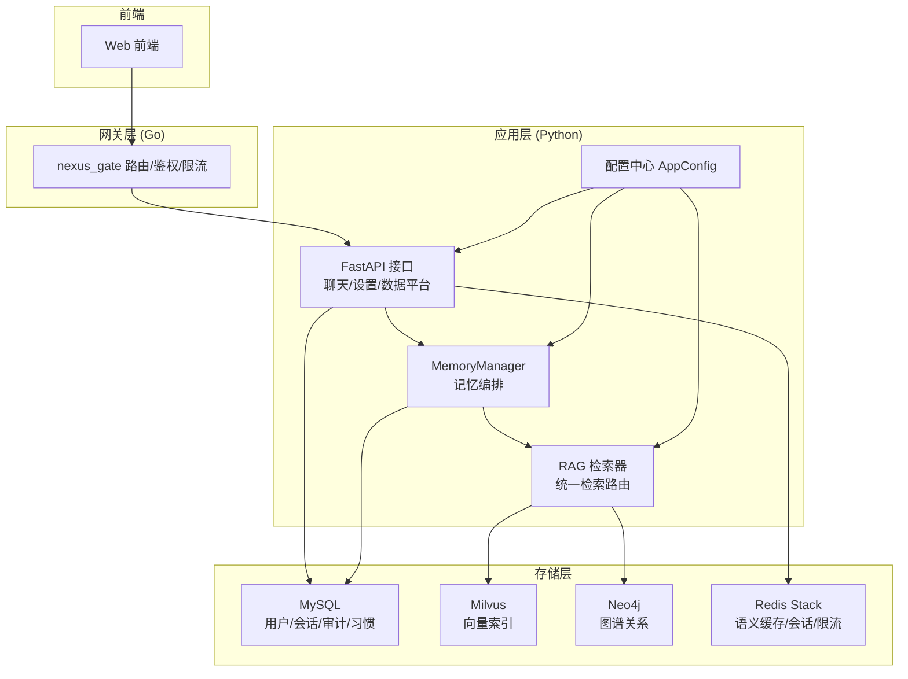
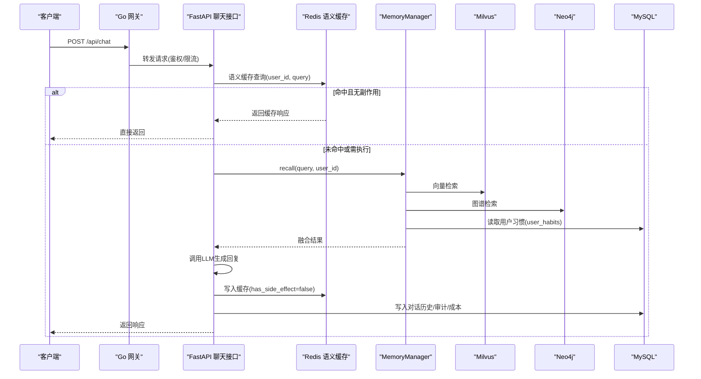
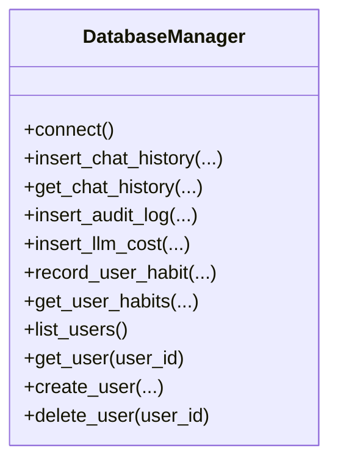
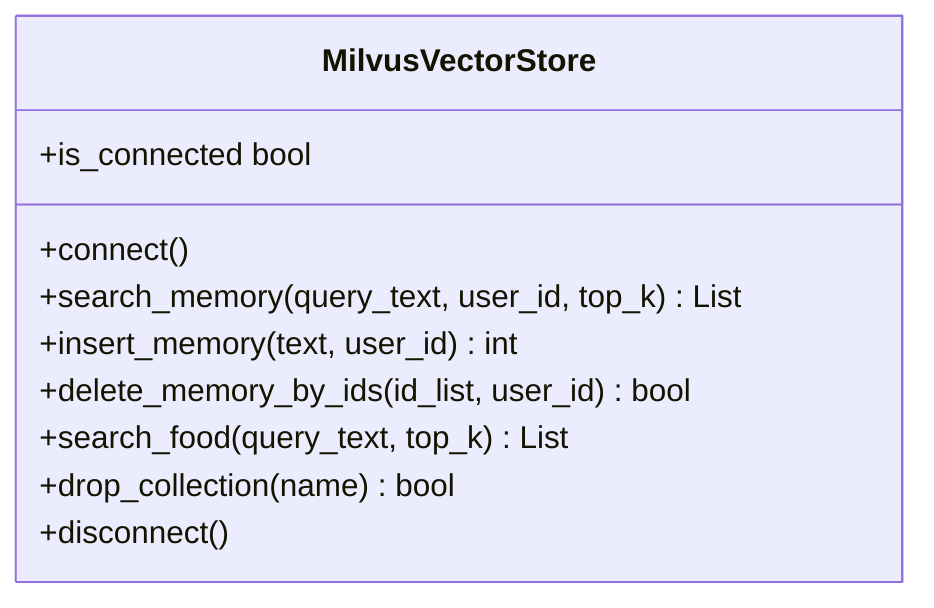
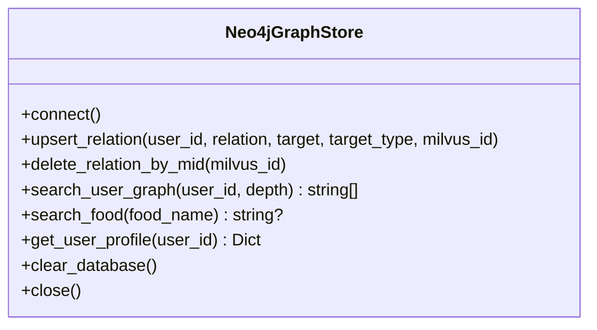
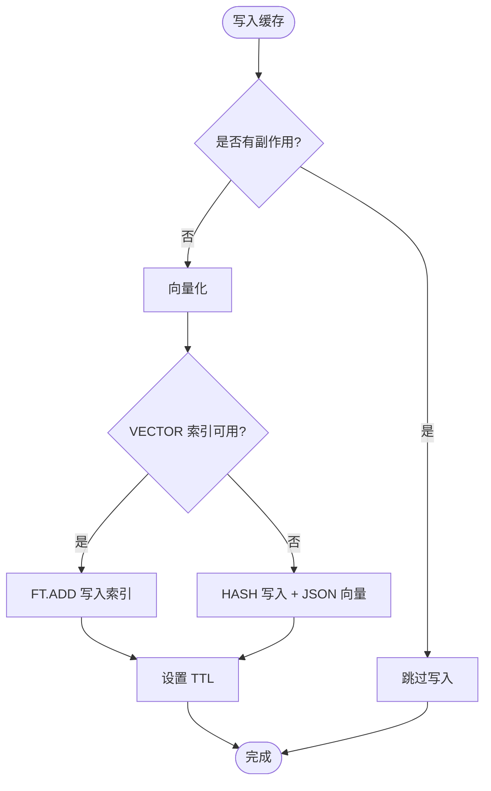
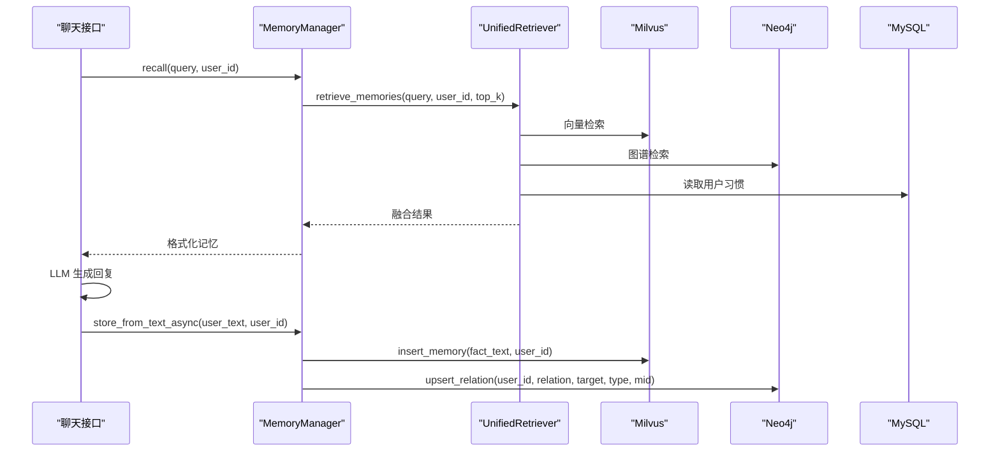
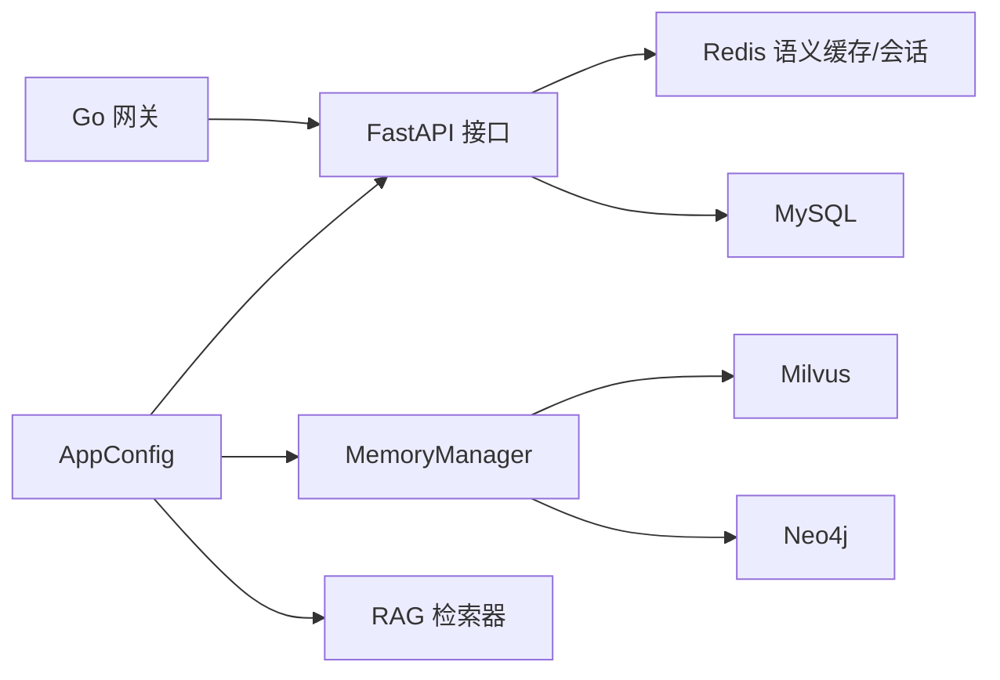

# 多数据库架构设计

<cite>
**本文引用的文件**   
- [config.py](file://backend_design/nexus/config.py)
- [db_manager.py](file://backend_design/nexus/core/db_manager.py)
- [vector_store.py](file://backend_design/nexus/rag/vector_store.py)
- [graph_store.py](file://backend_design/nexus/rag/graph_store.py)
- [redis_cache.py](file://backend_design/nexus/middleware/redis_cache.py)
- [session_store.py](file://backend_design/nexus/middleware/session_store.py)
- [manager.py](file://backend_design/nexus/memory/manager.py)
- [unified_retriever.py](file://backend_design/nexus/rag/unified_retriever.py)
- [chat.py](file://backend_design/nexus/api/routes/chat.py)
- [websocket.py](file://backend_design/nexus/api/websocket.py)
- [router.go](file://backend_design/nexus_gate/internal/router/router.go)
- [L5-middleware.md](file://docs/architecture/L5-middleware.md)
</cite>

## 目录
1. [引言](#引言)
2. [项目结构](#项目结构)
3. [核心组件](#核心组件)
4. [架构总览](#架构总览)
5. [详细组件分析](#详细组件分析)
6. [依赖关系分析](#依赖关系分析)
7. [性能与容量规划](#性能与容量规划)
8. [故障排查指南](#故障排查指南)
9. [结论](#结论)

## 引言
本技术文档围绕 NexusCockpit 的多数据库架构展开，系统采用“混合数据库策略”：MySQL 负责关系型数据（用户管理、对话历史、审计日志等），Milvus 负责向量检索（语义搜索与记忆召回），Neo4j 负责图谱数据（知识关联与画像），Redis 承担缓存与会话持久化。文档将深入解释各数据库的职责边界、数据分布策略、跨库事务处理方案、一致性保证机制（最终一致性与补偿）、连接池与负载均衡、故障转移等基础设施层面的设计考虑，并给出性能优化建议、容量规划指南与监控指标定义。

## 项目结构
NexusCockpit 后端以 Python FastAPI 为主服务，Go 网关作为前置路由与鉴权入口；RAG 层提供向量与图谱存储抽象，中间件层提供 Redis 语义缓存与会话持久化；配置中心集中管理所有外部依赖的连接参数与环境切换。

图表来源
- [config.py:601-631](file://backend_design/nexus/config.py#L601-L631)
- [db_manager.py:33-78](file://backend_design/nexus/core/db_manager.py#L33-L78)
- [vector_store.py:38-71](file://backend_design/nexus/rag/vector_store.py#L38-L71)
- [graph_store.py:24-43](file://backend_design/nexus/rag/graph_store.py#L24-L43)
- [redis_cache.py:55-111](file://backend_design/nexus/middleware/redis_cache.py#L55-L111)
- [session_store.py:35-62](file://backend_design/nexus/middleware/session_store.py#L35-L62)
- [manager.py:41-93](file://backend_design/nexus/memory/manager.py#L41-L93)
- [unified_retriever.py:33-61](file://backend_design/nexus/rag/unified_retriever.py#L33-L61)
- [router.go:121-146](file://backend_design/nexus_gate/internal/router/router.go#L121-L146)

章节来源
- [config.py:601-631](file://backend_design/nexus/config.py#L601-L631)
- [router.go:121-146](file://backend_design/nexus_gate/internal/router/router.go#L121-L146)

## 核心组件
- 配置中心 AppConfig：聚合 LLM、Milvus、Neo4j、Redis、MySQL、JWT、车控、可观测性等子配置，支持本地/云端 Provider 切换与安全校验。
- MySQL 数据库管理器 DatabaseManager：异步连接池、自动迁移、用户/会话/审计/成本追踪/习惯表 CRUD。
- Milvus 向量存储 MilvusVectorStore：集合初始化、HNSW 索引、语义检索与插入。
- Neo4j 图谱存储 Neo4jGraphStore：约束/索引初始化、关系 upsert、按 mid 联动删除、用户画像查询。
- Redis 语义缓存 SemanticCache：RediSearch VECTOR 索引 KNN 检索、TTL 分级、副作用隔离、scan 降级。
- Redis 会话存储 SessionStore：多实例共享会话历史、内存降级。
- MemoryManager：短期（Redis 会话）+长期（Milvus+Neo4j）+习惯（MySQL user_habits）三层记忆编排，三路召回+RRF+Rerank。
- UnifiedRetriever：统一检索路由，memory/knowledge/hybrid/auto 分发。

章节来源
- [config.py:167-275](file://backend_design/nexus/config.py#L167-L275)
- [db_manager.py:33-190](file://backend_design/nexus/core/db_manager.py#L33-L190)
- [vector_store.py:38-133](file://backend_design/nexus/rag/vector_store.py#L38-L133)
- [graph_store.py:24-97](file://backend_design/nexus/rag/graph_store.py#L24-L97)
- [redis_cache.py:55-159](file://backend_design/nexus/middleware/redis_cache.py#L55-L159)
- [session_store.py:35-116](file://backend_design/nexus/middleware/session_store.py#L35-L116)
- [manager.py:41-140](file://backend_design/nexus/memory/manager.py#L41-L140)
- [unified_retriever.py:33-92](file://backend_design/nexus/rag/unified_retriever.py#L33-L92)

## 架构总览
下图展示请求从 Go 网关进入 Python 应用后，如何协调多个数据库完成一次对话处理与记忆更新。

图表来源
- [router.go:121-146](file://backend_design/nexus_gate/internal/router/router.go#L121-L146)
- [chat.py:241-271](file://backend_design/nexus/api/routes/chat.py#L241-L271)
- [redis_cache.py:160-249](file://backend_design/nexus/middleware/redis_cache.py#L160-L249)
- [manager.py:95-140](file://backend_design/nexus/memory/manager.py#L95-L140)
- [vector_store.py:134-168](file://backend_design/nexus/rag/vector_store.py#L134-L168)
- [graph_store.py:98-133](file://backend_design/nexus/rag/graph_store.py#L98-L133)
- [db_manager.py:583-654](file://backend_design/nexus/core/db_manager.py#L583-L654)

## 详细组件分析

### MySQL 关系型数据层
职责边界
- 用户管理与 RBAC：users 表（user_id、username、cockpit_id、role）。
- 对话历史：chat_history 表（cockpit_id、user_id、session_id、intent、latency_ms、cache_hit）。
- 审计日志：audit_logs 表（cockpit_id、user_id、action、detail、ip_address）。
- LLM 成本追踪：llm_cost_tracking 表（cockpit_id、request_type、model_name、tokens、cost_yuan）。
- 用户习惯：user_habits 表（user_id、cockpit_id、habit_key、habit_value、hit_count、last_used_at）。
- 多会话：chat_sessions 表（session_id、cockpit_id、user_id、title、message_count、时间戳）。

数据分布策略
- 按 cockpit_id 与 user_id 建立索引，便于多租户与用户维度查询。
- 大字段 JSON 使用 utf8mb4 存储，避免编码问题。

跨库事务与一致性
- 写路径为“最终一致”：先写 Redis 缓存与 MySQL 主数据，再异步写入 Milvus/Neo4j（记忆向量化与图谱关系）。
- 补偿机制：若向量/图谱写入失败，记录错误日志并在后续重试任务中恢复。

连接池与可用性
- aiomysql.create_pool 管理连接池，minsize/maxsize 可调。
- 启动时自动迁移表结构与列，兼容旧版本升级。

图表来源
- [db_manager.py:33-190](file://backend_design/nexus/core/db_manager.py#L33-L190)
- [db_manager.py:583-737](file://backend_design/nexus/core/db_manager.py#L583-L737)

章节来源
- [db_manager.py:79-143](file://backend_design/nexus/core/db_manager.py#L79-L143)
- [db_manager.py:583-654](file://backend_design/nexus/core/db_manager.py#L583-L654)
- [db_manager.py:696-737](file://backend_design/nexus/core/db_manager.py#L696-L737)

### Milvus 向量检索层
职责边界
- Food_List 集合：食材知识库向量检索。
- User_Memory 集合：用户长期记忆向量检索与插入。
- HNSW 索引与 IP 度量，支持 top_k 近似最近邻搜索。

数据分布策略
- 按 user_id 过滤表达式进行用户隔离。
- 文本截断至固定长度，timestamp 用于 TTL 与排序。

一致性保障
- 与 Neo4j 通过 milvus_id 双向绑定，删除时按 ID 列表联动清理。

图表来源
- [vector_store.py:38-133](file://backend_design/nexus/rag/vector_store.py#L38-L133)
- [vector_store.py:134-207](file://backend_design/nexus/rag/vector_store.py#L134-L207)
- [vector_store.py:209-271](file://backend_design/nexus/rag/vector_store.py#L209-L271)

章节来源
- [vector_store.py:72-133](file://backend_design/nexus/rag/vector_store.py#L72-L133)
- [vector_store.py:134-168](file://backend_design/nexus/rag/vector_store.py#L134-L168)

### Neo4j 图谱数据层
职责边界
- 用户画像与实体关系：User 节点与 Entity 节点，关系类型动态映射。
- 与 Milvus 的 mid 绑定，支持按 mid 删除关系。
- 用户 N 阶关系查询与食物实体查找。

数据分布策略
- 唯一约束 user.id，实体 name 索引，提升查询效率。

一致性保障
- 删除操作按 mid 同步清理关系，确保与向量库一致。

图表来源
- [graph_store.py:24-97](file://backend_design/nexus/rag/graph_store.py#L24-L97)
- [graph_store.py:98-172](file://backend_design/nexus/rag/graph_store.py#L98-L172)

章节来源
- [graph_store.py:45-82](file://backend_design/nexus/rag/graph_store.py#L45-L82)
- [graph_store.py:98-133](file://backend_design/nexus/rag/graph_store.py#L98-L133)

### Redis 语义缓存与会话存储
职责边界
- 语义缓存：基于 RediSearch VECTOR 索引的 KNN 检索，支持相似度阈值与 TTL 分级；副作用响应禁止写入缓存。
- 会话存储：多实例共享会话历史，Redis 不可用时降级到内存 dict。

数据分布策略
- 缓存键前缀 nexus:cache:entry:*，包含 user_id、embedding、response、timestamp、has_side_effect。
- 会话键前缀 nexus:session:*，保留最近 N 条消息，TTL 默认 24h。

一致性保障
- 有副作用的响应永不写入缓存，避免车控指令被缓存后不执行的安全事故。
- Cloud Redis 无 RediSearch 模块时自动回退 scan 模式。

图表来源
- [redis_cache.py:315-380](file://backend_design/nexus/middleware/redis_cache.py#L315-L380)
- [redis_cache.py:112-159](file://backend_design/nexus/middleware/redis_cache.py#L112-L159)
- [session_store.py:93-116](file://backend_design/nexus/middleware/session_store.py#L93-L116)

章节来源
- [redis_cache.py:160-249](file://backend_design/nexus/middleware/redis_cache.py#L160-L249)
- [redis_cache.py:251-313](file://backend_design/nexus/middleware/redis_cache.py#L251-L313)
- [session_store.py:50-92](file://backend_design/nexus/middleware/session_store.py#L50-L92)

### 记忆编排与统一检索
职责边界
- MemoryManager：短期（Redis 会话）+长期（Milvus+Neo4j）+习惯（MySQL user_habits）三层记忆编排；渐进式披露调整 top_k；冲突检测与双向写入。
- UnifiedRetriever：根据 query_type 分发至 memory/knowledge/hybrid/auto，并行检索与 Rerank 合并。

数据流与一致性
- 记忆提取→冲突检测→删除冲突→双向写入（Milvus 向量 + Neo4j 图谱）。
- 检索管道：三路召回 → RRF 融合 → Rerank 重排 → 渐进式披露。

图表来源
- [manager.py:95-140](file://backend_design/nexus/memory/manager.py#L95-L140)
- [manager.py:204-279](file://backend_design/nexus/memory/manager.py#L204-L279)
- [unified_retriever.py:63-155](file://backend_design/nexus/rag/unified_retriever.py#L63-L155)
- [vector_store.py:170-192](file://backend_design/nexus/rag/vector_store.py#L170-L192)
- [graph_store.py:55-82](file://backend_design/nexus/rag/graph_store.py#L55-L82)

章节来源
- [manager.py:175-202](file://backend_design/nexus/memory/manager.py#L175-L202)
- [unified_retriever.py:93-108](file://backend_design/nexus/rag/unified_retriever.py#L93-L108)

## 依赖关系分析
- 配置中心 AppConfig 聚合所有子配置，并通过 get_config() 全局单例暴露。
- 中间件与业务层通过配置选择 Provider（local/cloud），如 CACHE_PROVIDER、VECTOR_STORE_PROVIDER、GRAPH_STORE_PROVIDER。
- Go 网关负责鉴权与部分原生处理（限流、中间件状态、座舱列表），其余转发 Python。

图表来源
- [config.py:601-631](file://backend_design/nexus/config.py#L601-L631)
- [router.go:121-146](file://backend_design/nexus_gate/internal/router/router.go#L121-L146)

章节来源
- [config.py:458-489](file://backend_design/nexus/config.py#L458-L489)
- [router.go:121-146](file://backend_design/nexus_gate/internal/router/router.go#L121-L146)

## 性能与容量规划
- 连接池与并发
  - MySQL：aiomysql.create_pool 的 minsize/maxsize 根据 QPS 与延迟目标调优，建议在高并发场景下适当增大 maxsize，并结合超时与重试策略。
  - Redis：语义缓存与限流均基于 Redis，注意网络 RTT 与序列化开销；Cloud Redis 无 RediSearch 时使用 scan 降级，需关注 O(n) 扫描延迟。
- 索引与检索
  - Milvus：HNSW 索引参数 M、efConstruction、ef 影响构建与查询延迟；高召回率场景可适当提高 ef。
  - Neo4j：user.id 唯一约束与 entity.name 索引已创建，复杂图查询建议限制深度 depth。
- 缓存命中率与 TTL
  - 语义缓存相似度阈值与 TTL 分级（闲聊 1h、知识库 24h）直接影响命中率与成本；副作用响应禁止写入缓存。
- 容量规划
  - Milvus：按 embedding_dim 估算向量存储大小；User_Memory 与 Food_List 分别评估增长曲线。
  - Neo4j：节点与关系数量随用户规模线性增长，定期清理无效关系。
  - MySQL：chat_history、audit_logs、llm_cost_tracking 表需按时间分区或归档策略控制体积。
  - Redis：缓存条目数与 TTL 决定内存占用，定期统计 size 与 hit_rate。

[本节为通用指导，无需具体文件引用]

## 故障排查指南
- 连接与初始化
  - MySQL 连接失败：检查 host/port/user/password/database，确认自动迁移是否成功。
  - Milvus 连接失败：确认 uri/token/alias，集合是否存在与索引是否加载。
  - Neo4j 连接失败：确认 uri/user/password，约束与索引是否创建。
  - Redis 连接失败：确认 url 与模块可用性（RediSearch），必要时回退 scan 模式。
- 一致性异常
  - 向量/图谱写入失败：查看日志中的错误码与堆栈，触发补偿任务重试。
  - 缓存未命中或误命中：检查相似度阈值、TTL、has_side_effect 标记。
- 限流与熔断
  - 限流触发：检查用户维度计数窗口与剩余次数；超出则抛出 RateLimitError。
  - 熔断器开启：检查下游服务健康度与熔断状态。

章节来源
- [db_manager.py:50-78](file://backend_design/nexus/core/db_manager.py#L50-L78)
- [vector_store.py:52-71](file://backend_design/nexus/rag/vector_store.py#L52-L71)
- [graph_store.py:31-43](file://backend_design/nexus/rag/graph_store.py#L31-L43)
- [redis_cache.py:83-111](file://backend_design/nexus/middleware/redis_cache.py#L83-L111)
- [L5-middleware.md:50-87](file://docs/architecture/L5-middleware.md#L50-L87)

## 结论
NexusCockpit 的多数据库架构通过清晰的职责划分与最终一致性的跨库协作，实现了高性能的语义检索、图谱关联与关系型数据管理。结合 Redis 语义缓存与会话持久化，系统在用户体验与资源成本之间取得平衡。未来可在 Redis FLAT→HNSW 迁移、RRF 权重调优、SubAgent 批处理等方面进一步优化，同时完善测试覆盖率与基准测试，持续提升稳定性与可观测性。