# 跨库数据一致性策略

<cite>
**本文引用的文件**   
- [backend_design/nexus/core/db_manager.py](file://backend_design/nexus/core/db_manager.py)
- [backend_design/nexus/middleware/redis_cache.py](file://backend_design/nexus/middleware/redis_cache.py)
- [backend_design/nexus/memory/conflict.py](file://backend_design/nexus/memory/conflict.py)
- [backend_design/nexus/memory/manager.py](file://backend_design/nexus/memory/manager.py)
- [backend_design/nexus/api/routes/dataplatform.py](file://backend_design/nexus/api/routes/dataplatform.py)
- [backend_design/nexus/observability/cockpit_metrics.py](file://backend_design/nexus/observability/cockpit_metrics.py)
- [backend_design/nexus/observability/metrics.py](file://backend_design/nexus/observability/metrics.py)
- [backend_design/nexus/config.py](file://backend_design/nexus/config.py)
- [backend_design/nexus/main.py](file://backend_design/nexus/main.py)
- [backend_design/nexus/core/circuit_breaker.py](file://backend_design/nexus/core/circuit_breaker.py)
- [backend_design/nexus/core/exceptions.py](file://backend_design/nexus/core/exceptions.py)
- [backend_design/nexus/middleware/task_queue.py](file://backend_design/nexus/middleware/task_queue.py)
- [backend_design/nexus/models/state.py](file://backend_design/nexus/models/state.py)
- [backend_design/nexus/rag/graph_store.py](file://backend_design/nexus/rag/graph_store.py)
- [backend_design/nexus/rag/vector_store.py](file://backend_design/nexus/rag/vector_store.py)
- [backend_design/nexus_gate/internal/handlers/redis_client.go](file://backend_design/nexus_gate/internal/handlers/redis_client.go)
- [config/prometheus/prometheus.yml](file://config/prometheus/prometheus.yml)
- [config/grafana/provisioning/dashboards/nexuscockpit-overview.json](file://config/grafana/provisioning/dashboards/nexuscockpit-overview.json)
</cite>

## 目录
1. [引言](#引言)
2. [项目结构](#项目结构)
3. [核心组件](#核心组件)
4. [架构总览](#架构总览)
5. [详细组件分析](#详细组件分析)
6. [依赖分析](#依赖分析)
7. [性能考虑](#性能考虑)
8. [故障排查指南](#故障排查指南)
9. [结论](#结论)
10. [附录](#附录)

## 引言
本技术文档聚焦于在混合数据库架构中实现跨库数据一致性的整体方案。结合项目现有能力，围绕最终一致性模型（BASE理论）、补偿事务、Saga/TCC模式、消息队列异步协调、CDC变更捕获与双向/增量同步、数据校验与修复、分布式锁与幂等性、重试机制、异常处理与故障恢复、监控告警指标等进行系统化阐述，并给出可落地的架构图与流程图，帮助读者快速理解与落地实施。

## 项目结构
本项目采用多语言微服务架构：Python 后端提供业务编排、存储抽象、可观测性与中间件集成；Go 网关负责鉴权、限流与代理；配置与监控通过 Prometheus/Grafana 暴露指标与可视化面板。与数据一致性相关的关键目录包括：
- 核心层：数据库管理、熔断器、异常定义、配置与主入口
- 中间件层：Redis 缓存、任务队列
- 记忆与冲突：记忆管理与冲突解决
- 可观测性：指标采集与仪表盘
- RAG 存储：图数据库与向量数据库访问封装
- 网关：Redis 客户端与处理器

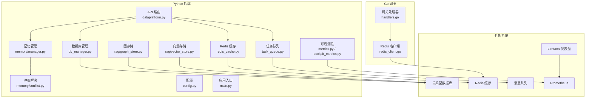

图表来源
- [backend_design/nexus/api/routes/dataplatform.py](file://backend_design/nexus/api/routes/dataplatform.py)
- [backend_design/nexus/core/db_manager.py](file://backend_design/nexus/core/db_manager.py)
- [backend_design/nexus/middleware/redis_cache.py](file://backend_design/nexus/middleware/redis_cache.py)
- [backend_design/nexus/middleware/task_queue.py](file://backend_design/nexus/middleware/task_queue.py)
- [backend_design/nexus/memory/manager.py](file://backend_design/nexus/memory/manager.py)
- [backend_design/nexus/memory/conflict.py](file://backend_design/nexus/memory/conflict.py)
- [backend_design/nexus/observability/metrics.py](file://backend_design/nexus/observability/metrics.py)
- [backend_design/nexus/observability/cockpit_metrics.py](file://backend_design/nexus/observability/cockpit_metrics.py)
- [backend_design/nexus/rag/graph_store.py](file://backend_design/nexus/rag/graph_store.py)
- [backend_design/nexus/rag/vector_store.py](file://backend_design/nexus/rag/vector_store.py)
- [backend_design/nexus_gate/internal/handlers/redis_client.go](file://backend_design/nexus_gate/internal/handlers/redis_client.go)
- [config/prometheus/prometheus.yml](file://config/prometheus/prometheus.yml)
- [config/grafana/provisioning/dashboards/nexuscockpit-overview.json](file://config/grafana/provisioning/dashboards/nexuscockpit-overview.json)

章节来源
- [backend_design/nexus/main.py](file://backend_design/nexus/main.py)
- [backend_design/nexus/config.py](file://backend_design/nexus/config.py)
- [backend_design/nexus/api/routes/dataplatform.py](file://backend_design/nexus/api/routes/dataplatform.py)
- [backend_design/nexus/core/db_manager.py](file://backend_design/nexus/core/db_manager.py)
- [backend_design/nexus/middleware/redis_cache.py](file://backend_design/nexus/middleware/redis_cache.py)
- [backend_design/nexus/middleware/task_queue.py](file://backend_design/nexus/middleware/task_queue.py)
- [backend_design/nexus/memory/manager.py](file://backend_design/nexus/memory/manager.py)
- [backend_design/nexus/memory/conflict.py](file://backend_design/nexus/memory/conflict.py)
- [backend_design/nexus/observability/metrics.py](file://backend_design/nexus/observability/metrics.py)
- [backend_design/nexus/observability/cockpit_metrics.py](file://backend_design/nexus/observability/cockpit_metrics.py)
- [backend_design/nexus/rag/graph_store.py](file://backend_design/nexus/rag/graph_store.py)
- [backend_design/nexus/rag/vector_store.py](file://backend_design/nexus/rag/vector_store.py)
- [backend_design/nexus_gate/internal/handlers/redis_client.go](file://backend_design/nexus_gate/internal/handlers/redis_client.go)
- [config/prometheus/prometheus.yml](file://config/prometheus/prometheus.yml)
- [config/grafana/provisioning/dashboards/nexuscockpit-overview.json](file://config/grafana/provisioning/dashboards/nexuscockpit-overview.json)

## 核心组件
- 数据库管理：统一封装多库连接、读写分离、事务边界与错误分类，为上层提供一致的持久化接口。
- 缓存与锁：基于 Redis 的缓存与分布式锁，保障热点数据一致性与并发安全。
- 任务队列：将跨库写操作或补偿动作异步化，提升吞吐与容错能力。
- 记忆与冲突：面向用户记忆的合并与冲突消解，体现最终一致性与幂等设计。
- 可观测性：指标采集与仪表盘，覆盖一致性关键路径的延迟、错误率与积压。
- 网关侧 Redis 客户端：为鉴权与会话等场景提供低延迟缓存访问。

章节来源
- [backend_design/nexus/core/db_manager.py](file://backend_design/nexus/core/db_manager.py)
- [backend_design/nexus/middleware/redis_cache.py](file://backend_design/nexus/middleware/redis_cache.py)
- [backend_design/nexus/middleware/task_queue.py](file://backend_design/nexus/middleware/task_queue.py)
- [backend_design/nexus/memory/manager.py](file://backend_design/nexus/memory/manager.py)
- [backend_design/nexus/memory/conflict.py](file://backend_design/nexus/memory/conflict.py)
- [backend_design/nexus/observability/metrics.py](file://backend_design/nexus/observability/metrics.py)
- [backend_design/nexus/observability/cockpit_metrics.py](file://backend_design/nexus/observability/cockpit_metrics.py)
- [backend_design/nexus_gate/internal/handlers/redis_client.go](file://backend_design/nexus_gate/internal/handlers/redis_client.go)

## 架构总览
下图展示跨库数据一致性在请求链路中的关键节点：API 路由进入后，通过数据库管理进行本地持久化，同时通过任务队列触发跨库同步与补偿；Redis 用于缓存与分布式锁；可观测性模块持续采集指标并上报 Prometheus，Grafana 提供可视化。

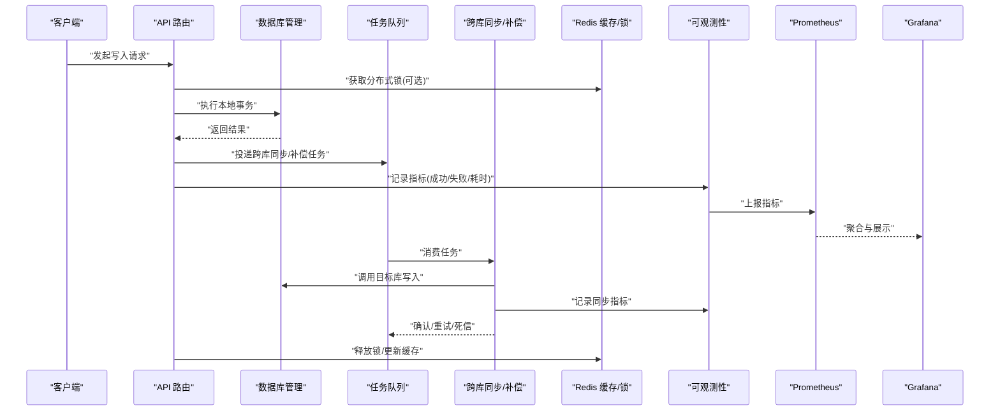

图表来源
- [backend_design/nexus/api/routes/dataplatform.py](file://backend_design/nexus/api/routes/dataplatform.py)
- [backend_design/nexus/core/db_manager.py](file://backend_design/nexus/core/db_manager.py)
- [backend_design/nexus/middleware/task_queue.py](file://backend_design/nexus/middleware/task_queue.py)
- [backend_design/nexus/middleware/redis_cache.py](file://backend_design/nexus/middleware/redis_cache.py)
- [backend_design/nexus/observability/metrics.py](file://backend_design/nexus/observability/metrics.py)
- [backend_design/nexus/observability/cockpit_metrics.py](file://backend_design/nexus/observability/cockpit_metrics.py)
- [config/prometheus/prometheus.yml](file://config/prometheus/prometheus.yml)
- [config/grafana/provisioning/dashboards/nexuscockpit-overview.json](file://config/grafana/provisioning/dashboards/nexuscockpit-overview.json)

## 详细组件分析

### 最终一致性模型与 BASE 实践
- 基本可用（BA）：通过任务队列与异步补偿保证核心流程不阻塞，非关键路径降级。
- 软状态（S）：允许中间态存在，通过幂等键与版本控制收敛到终态。
- 最终一致（E）：以本地事务+事件驱动的方式确保跨库最终一致。

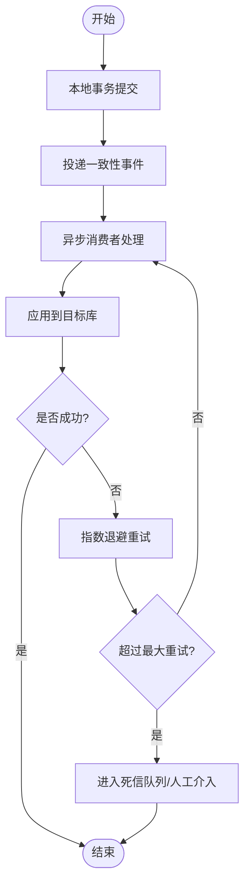

章节来源
- [backend_design/nexus/middleware/task_queue.py](file://backend_design/nexus/middleware/task_queue.py)
- [backend_design/nexus/core/db_manager.py](file://backend_design/nexus/core/db_manager.py)
- [backend_design/nexus/observability/metrics.py](file://backend_design/nexus/observability/metrics.py)

### Saga 模式与补偿事务
- 正向步骤：按顺序执行业务子事务，每个步骤成功后投递“完成事件”。
- 补偿步骤：任一子事务失败时，按逆序执行已完成的补偿动作，保证回滚语义。
- 幂等与去重：使用唯一请求 ID 与幂等键避免重复执行。

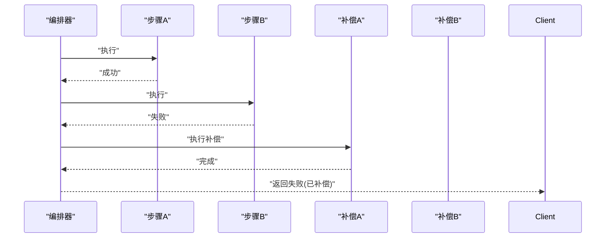

章节来源
- [backend_design/nexus/middleware/task_queue.py](file://backend_design/nexus/middleware/task_queue.py)
- [backend_design/nexus/core/exceptions.py](file://backend_design/nexus/core/exceptions.py)

### TCC 模式（Try-Confirm-Cancel）
- Try：预留资源与预检查，不提交最终状态。
- Confirm：资源确认后提交最终状态。
- Cancel：取消预留并释放资源。
- 适用场景：强一致要求较高且可拆分操作的跨库写。

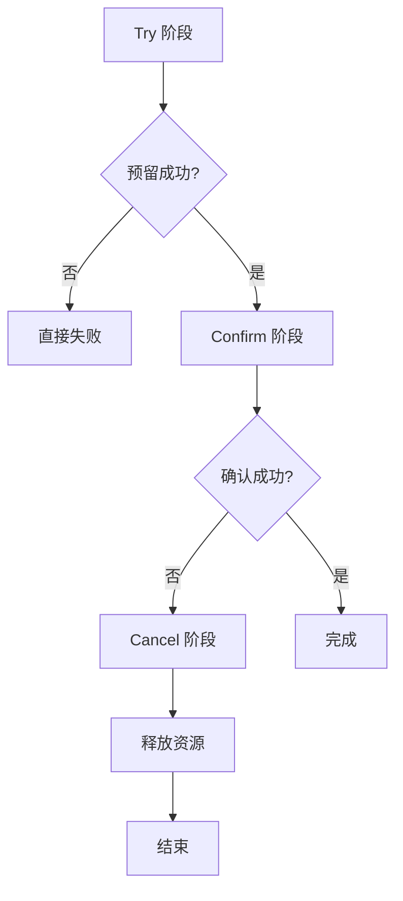

章节来源
- [backend_design/nexus/core/db_manager.py](file://backend_design/nexus/core/db_manager.py)
- [backend_design/nexus/core/exceptions.py](file://backend_design/nexus/core/exceptions.py)

### 消息队列异步协调
- 生产者：在本地事务内或事务后投递一致性事件，确保至少一次投递。
- 消费者：幂等处理、去重表/布隆过滤器、重试与死信。
- 背压与限流：根据队列深度与下游负载动态调整消费速率。

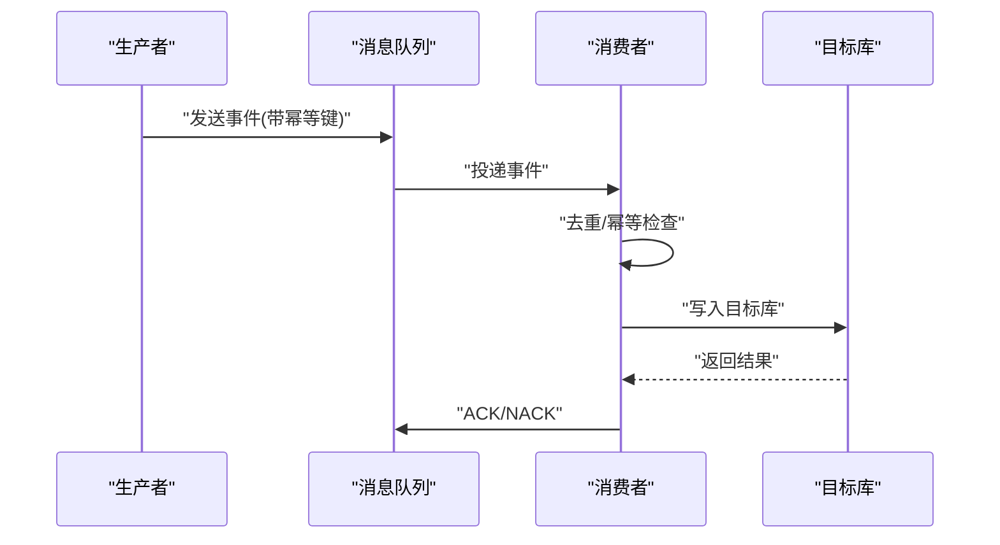

章节来源
- [backend_design/nexus/middleware/task_queue.py](file://backend_design/nexus/middleware/task_queue.py)
- [backend_design/nexus/observability/metrics.py](file://backend_design/nexus/observability/metrics.py)

### CDC 变更捕获与双向/增量同步
- CDC 捕获：监听源库 binlog/WAL，解析变更事件并投递至队列。
- 增量同步：按时间戳/LSN 推进位点，断点续传。
- 双向同步：为避免环路，需引入冲突检测与仲裁策略（如时间戳优先、字段级合并）。

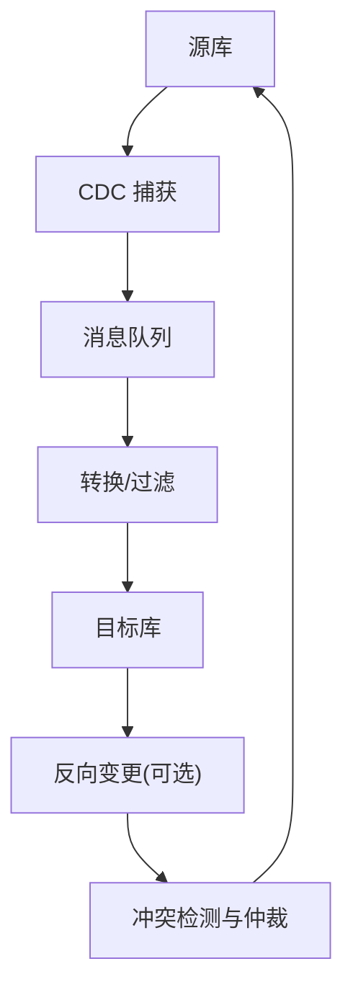

章节来源
- [backend_design/nexus/middleware/task_queue.py](file://backend_design/nexus/middleware/task_queue.py)
- [backend_design/nexus/core/db_manager.py](file://backend_design/nexus/core/db_manager.py)

### 数据校验与修复机制
- 一致性检查：定期抽样比对关键字段，计算差异率。
- 差异检测：基于哈希/指纹对比，定位不一致记录。
- 自动修复：对可自愈的差异执行幂等修复任务；不可自愈的记录进入人工工单。

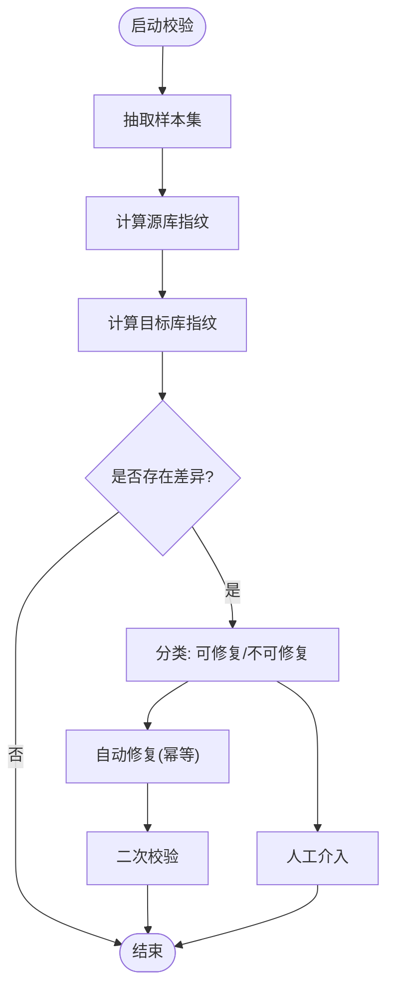

章节来源
- [backend_design/nexus/observability/metrics.py](file://backend_design/nexus/observability/metrics.py)
- [backend_design/nexus/middleware/task_queue.py](file://backend_design/nexus/middleware/task_queue.py)

### 分布式锁、幂等性与重试
- 分布式锁：基于 Redis 的原子操作实现，设置过期时间与看门狗续约。
- 幂等性：请求 ID + 幂等键 + 去重表，确保重复消费不产生副作用。
- 重试机制：指数退避、抖动、最大重试次数与死信队列兜底。

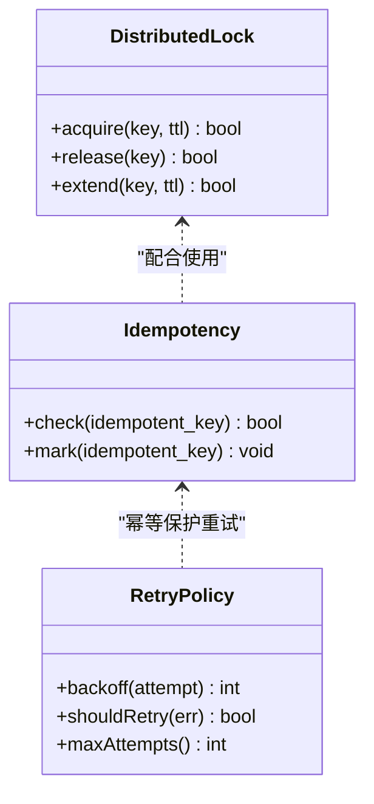

章节来源
- [backend_design/nexus/middleware/redis_cache.py](file://backend_design/nexus/middleware/redis_cache.py)
- [backend_design/nexus/middleware/task_queue.py](file://backend_design/nexus/middleware/task_queue.py)

### 记忆与冲突解决
- 记忆管理器：维护用户记忆的状态机与版本，支持合并与回溯。
- 冲突解决：基于时间戳、权重与规则引擎进行合并，保留审计轨迹。

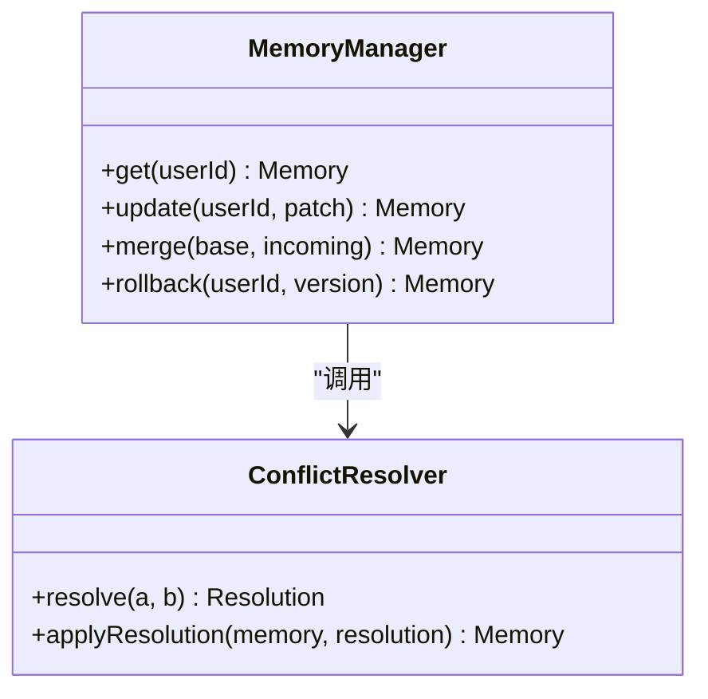

章节来源
- [backend_design/nexus/memory/manager.py](file://backend_design/nexus/memory/manager.py)
- [backend_design/nexus/memory/conflict.py](file://backend_design/nexus/memory/conflict.py)

### 网关侧缓存与鉴权一致性
- 网关通过 Redis 客户端读取会话与权限信息，降低认证开销。
- 缓存失效策略与一致性：写后失效、版本号比较、短 TTL 兜底。

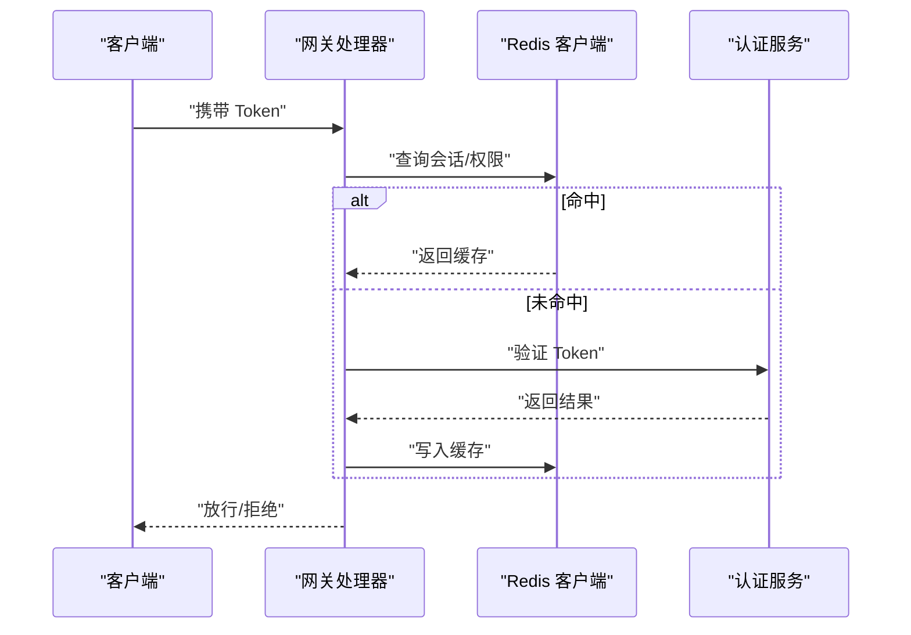

章节来源
- [backend_design/nexus_gate/internal/handlers/redis_client.go](file://backend_design/nexus_gate/internal/handlers/redis_client.go)
- [backend_design/nexus/middleware/redis_cache.py](file://backend_design/nexus/middleware/redis_cache.py)

### 存储层抽象（图与向量）
- 图存储与向量存储分别封装不同数据库的访问细节，对外提供统一接口，便于一致性策略在不同存储间复用。

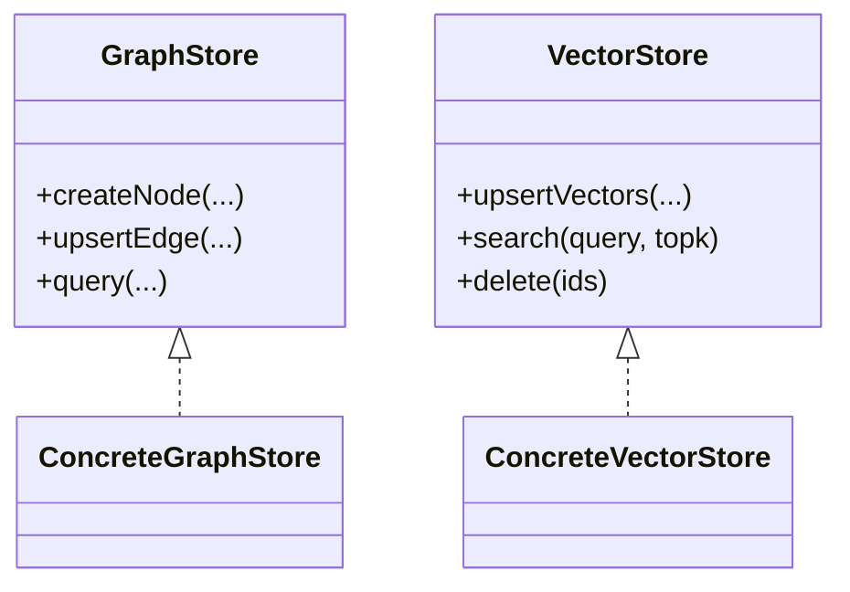

章节来源
- [backend_design/nexus/rag/graph_store.py](file://backend_design/nexus/rag/graph_store.py)
- [backend_design/nexus/rag/vector_store.py](file://backend_design/nexus/rag/vector_store.py)

## 依赖分析
- 耦合关系：API 路由依赖数据库管理、缓存与任务队列；记忆模块依赖冲突解决；可观测性贯穿各层。
- 外部依赖：Redis、消息队列、关系型/图/向量数据库、Prometheus/Grafana。
- 潜在环路与风险：双向同步需严格防环；重试风暴需限流与熔断。

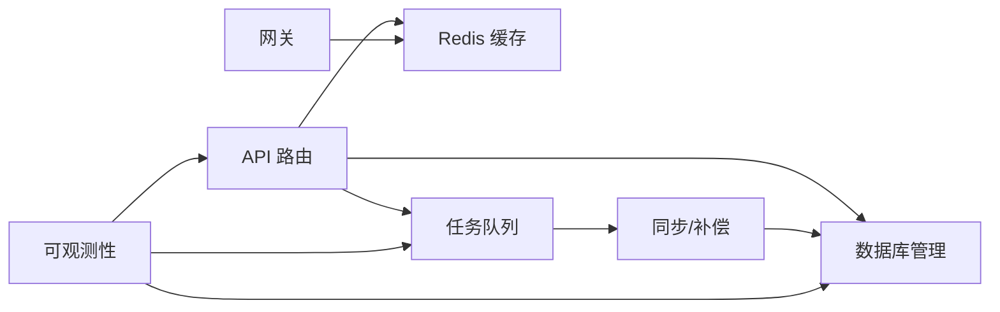

图表来源
- [backend_design/nexus/api/routes/dataplatform.py](file://backend_design/nexus/api/routes/dataplatform.py)
- [backend_design/nexus/core/db_manager.py](file://backend_design/nexus/core/db_manager.py)
- [backend_design/nexus/middleware/redis_cache.py](file://backend_design/nexus/middleware/redis_cache.py)
- [backend_design/nexus/middleware/task_queue.py](file://backend_design/nexus/middleware/task_queue.py)
- [backend_design/nexus/observability/metrics.py](file://backend_design/nexus/observability/metrics.py)
- [backend_design/nexus_gate/internal/handlers/redis_client.go](file://backend_design/nexus_gate/internal/handlers/redis_client.go)

章节来源
- [backend_design/nexus/api/routes/dataplatform.py](file://backend_design/nexus/api/routes/dataplatform.py)
- [backend_design/nexus/core/db_manager.py](file://backend_design/nexus/core/db_manager.py)
- [backend_design/nexus/middleware/redis_cache.py](file://backend_design/nexus/middleware/redis_cache.py)
- [backend_design/nexus/middleware/task_queue.py](file://backend_design/nexus/middleware/task_queue.py)
- [backend_design/nexus/observability/metrics.py](file://backend_design/nexus/observability/metrics.py)
- [backend_design/nexus_gate/internal/handlers/redis_client.go](file://backend_design/nexus_gate/internal/handlers/redis_client.go)

## 性能考虑
- 批处理与批量写入：减少网络往返与事务开销。
- 索引优化：针对高频查询与一致性校验字段建立合适索引。
- 缓存分层：热点读走缓存，写后及时失效或版本号比较。
- 背压与限流：依据队列深度与下游延迟动态调节消费速率。
- 熔断与降级：对不稳定依赖启用熔断，避免雪崩。

[本节为通用指导，无需特定文件引用]

## 故障排查指南
- 常见问题
  - 重复消费导致数据重复：检查幂等键与去重表。
  - 补偿失败：查看死信队列与补偿日志，必要时人工干预。
  - 缓存不一致：核对写后失效策略与 TTL 设置。
  - 同步积压：观察队列深度与消费者 CPU/IO 指标。
- 诊断手段
  - 指标看板：关注错误率、P99 延迟、重试次数、死信数量。
  - 链路追踪：定位慢调用与异常分支。
  - 快照比对：对关键实体生成快照，辅助差异定位。

章节来源
- [backend_design/nexus/observability/metrics.py](file://backend_design/nexus/observability/metrics.py)
- [backend_design/nexus/observability/cockpit_metrics.py](file://backend_design/nexus/observability/cockpit_metrics.py)
- [backend_design/nexus/core/circuit_breaker.py](file://backend_design/nexus/core/circuit_breaker.py)
- [backend_design/nexus/core/exceptions.py](file://backend_design/nexus/core/exceptions.py)

## 结论
通过在本地事务基础上引入事件驱动与异步补偿，结合幂等、重试、熔断与完善的可观测性体系，可以在混合数据库架构中实现高可用、可扩展的最终一致性。对于需要更强一致性的场景，可采用 TCC 或 Saga 模式细化控制；对于大规模数据同步，建议引入 CDC 与增量同步，辅以严格的冲突仲裁与校验修复流程。

[本节为总结性内容，无需特定文件引用]

## 附录

### 监控与告警指标定义
- 一致性相关
  - 跨库同步成功率、失败率、平均延迟、P99/P95 延迟
  - 重试次数分布、死信队列长度
  - 一致性校验差异率、修复成功率
- 资源与稳定性
  - 队列积压、消费者吞吐、CPU/内存占用
  - 熔断器状态切换次数、降级比例
- 缓存与锁
  - 缓存命中率、锁竞争等待时长、锁超时次数

章节来源
- [backend_design/nexus/observability/metrics.py](file://backend_design/nexus/observability/metrics.py)
- [backend_design/nexus/observability/cockpit_metrics.py](file://backend_design/nexus/observability/cockpit_metrics.py)
- [config/prometheus/prometheus.yml](file://config/prometheus/prometheus.yml)
- [config/grafana/provisioning/dashboards/nexuscockpit-overview.json](file://config/grafana/provisioning/dashboards/nexuscockpit-overview.json)