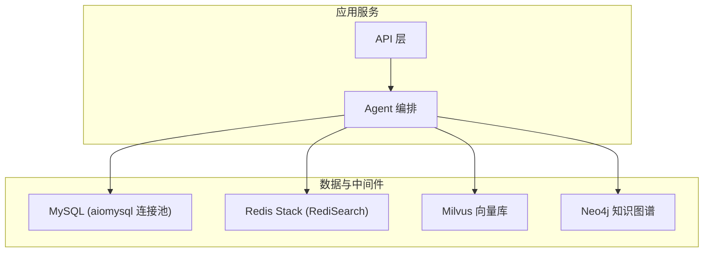
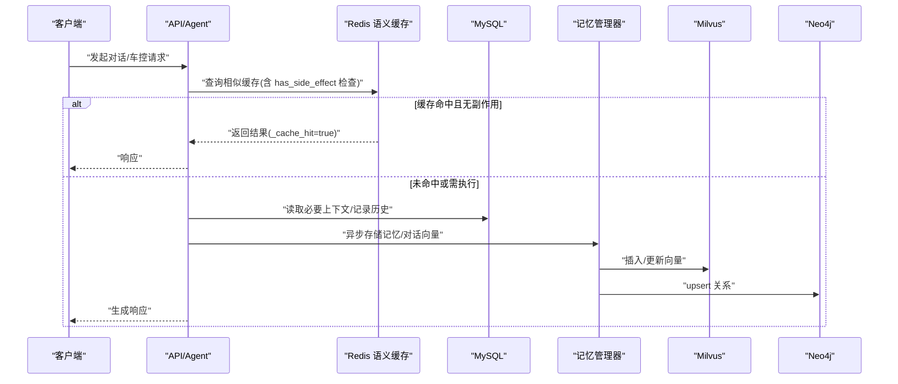
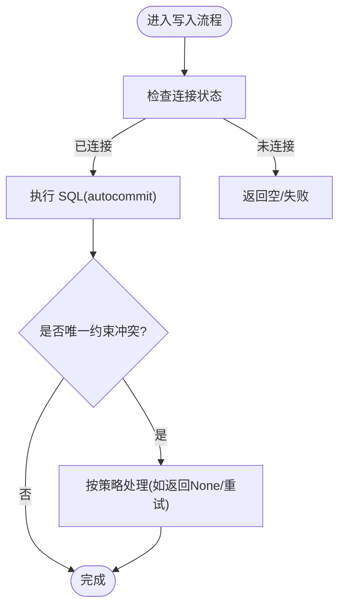
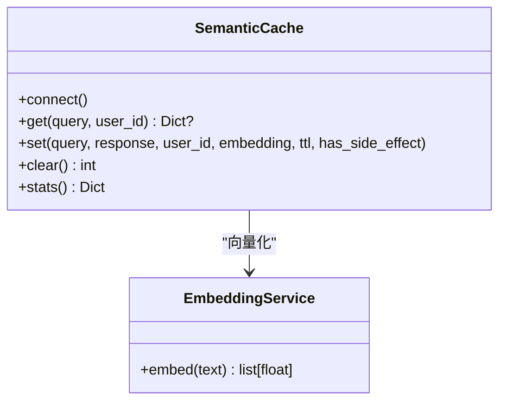
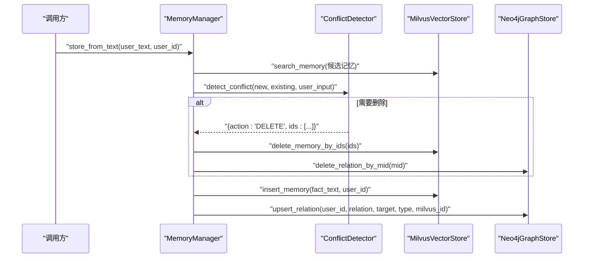
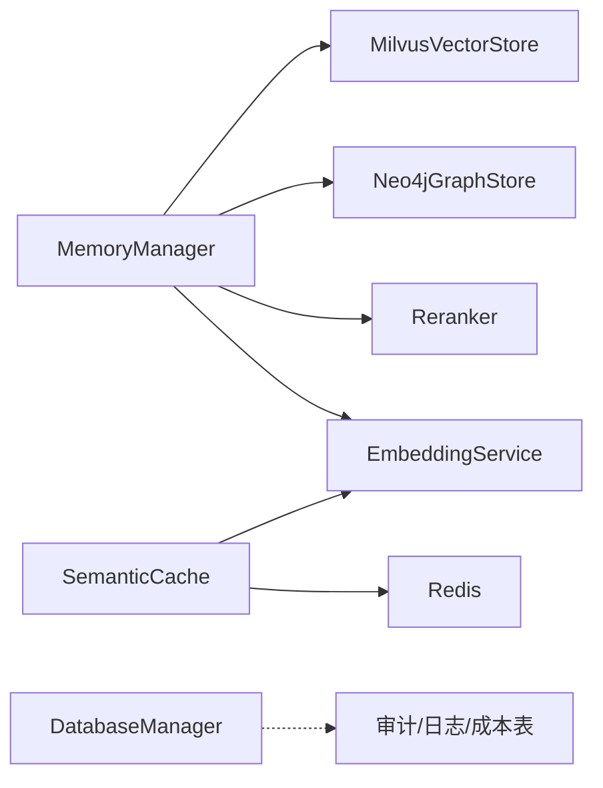

# 数据一致性策略

<cite>
**本文引用的文件**   
- [db_manager.py](file://backend_design/nexus/core/db_manager.py)
- [redis_cache.py](file://backend_design/nexus/middleware/redis_cache.py)
- [conflict.py](file://backend_design/nexus/memory/conflict.py)
- [manager.py](file://backend_design/nexus/memory/manager.py)
- [task_queue.py](file://backend_design/nexus/middleware/task_queue.py)
- [circuit_breaker.py](file://backend_design/nexus/core/circuit_breaker.py)
- [metrics.py](file://backend_design/nexus/observability/metrics.py)
- [exceptions.py](file://backend_design/nexus/core/exceptions.py)
- [v2.1_migration.sql](file://backend_design/scripts/v2.1_migration.sql)
- [L2-data.md](file://docs/architecture/L2-data.md)
</cite>

## 目录
1. [引言](#引言)
2. [项目结构](#项目结构)
3. [核心组件](#核心组件)
4. [架构总览](#架构总览)
5. [详细组件分析](#详细组件分析)
6. [依赖关系分析](#依赖关系分析)
7. [性能与一致性权衡](#性能与一致性权衡)
8. [故障排查指南](#故障排查指南)
9. [结论](#结论)
10. [附录](#附录)

## 引言
本文件面向 NexusCockpit 在分布式环境下的数据一致性策略，围绕 MySQL 事务、Redis 缓存一致性、跨数据库（MySQL/Milvus/Neo4j）数据同步、CAP 权衡、最终一致性模型、分布式锁与幂等设计、冲突解决、备份恢复、校验与监控告警以及常见问题排查进行系统化说明。文档以代码为依据，结合架构图与时序图帮助读者快速理解实现与取舍。

## 项目结构
NexusCockpit 的数据层与中间件主要分布在以下模块：
- 持久化与迁移：MySQL 连接池与表结构管理、迁移脚本
- 缓存与语义检索：Redis Stack + RediSearch 向量索引
- 记忆系统：Milvus 向量存储 + Neo4j 图谱 + 用户习惯（MySQL）
- 可靠性与可观测性：熔断器、指标采集、异常体系

图表来源
- [db_manager.py:33-750](file://backend_design/nexus/core/db_manager.py#L33-L750)
- [redis_cache.py:55-449](file://backend_design/nexus/middleware/redis_cache.py#L55-L449)
- [L2-data.md:1-241](file://docs/architecture/L2-data.md#L1-L241)

章节来源
- [db_manager.py:33-750](file://backend_design/nexus/core/db_manager.py#L33-L750)
- [redis_cache.py:55-449](file://backend_design/nexus/middleware/redis_cache.py#L55-L449)
- [L2-data.md:1-241](file://docs/architecture/L2-data.md#L1-L241)

## 核心组件
- 数据库管理器（DatabaseManager）：封装 aiomysql 连接池、自动迁移、常用 CRUD 与审计/日志写入。
- 语义缓存（SemanticCache）：基于 Redis Stack 的 KNN 向量检索，支持 TTL、相似度阈值、副作用隔离。
- 记忆管理器（MemoryManager）：协调 Milvus 向量与 Neo4j 图谱，提供三路召回、Rerank、渐进式披露与异步落盘。
- 冲突检测（ConflictDetector）：基于 LLM 裁决新/旧记忆冲突并执行删除或忽略。
- 任务队列（简化版）：使用 asyncio.create_task 进程内异步执行，替代 Celery/RabbitMQ。
- 熔断器（CircuitBreaker）：三态保护，防止级联故障。
- 指标与异常：Prometheus 指标暴露与统一异常体系。

章节来源
- [db_manager.py:33-750](file://backend_design/nexus/core/db_manager.py#L33-L750)
- [redis_cache.py:55-449](file://backend_design/nexus/middleware/redis_cache.py#L55-L449)
- [manager.py:41-398](file://backend_design/nexus/memory/manager.py#L41-L398)
- [conflict.py:24-174](file://backend_design/nexus/memory/conflict.py#L24-L174)
- [task_queue.py:1-80](file://backend_design/nexus/middleware/task_queue.py#L1-L80)
- [circuit_breaker.py:47-176](file://backend_design/nexus/core/circuit_breaker.py#L47-L176)
- [metrics.py:1-113](file://backend_design/nexus/observability/metrics.py#L1-L113)
- [exceptions.py:1-124](file://backend_design/nexus/core/exceptions.py#L1-L124)

## 架构总览
下图展示请求路径中数据一致性的关键节点：缓存命中优先、有副作用指令不缓存、记忆写入走异步管道、失败降级与熔断保护。

图表来源
- [redis_cache.py:160-380](file://backend_design/nexus/middleware/redis_cache.py#L160-L380)
- [manager.py:204-398](file://backend_design/nexus/memory/manager.py#L204-L398)
- [db_manager.py:583-654](file://backend_design/nexus/core/db_manager.py#L583-L654)

## 详细组件分析

### MySQL 事务与一致性
- 连接池与自动迁移：启动时确保多会话表、用户习惯表及 chat_logs.session_id 列存在；自动修复中文用户名/座舱名避免乱码。
- 写入模式：默认 autocommit=True，单条写入原子；复杂业务通过显式事务包裹（当前代码多为单语句操作）。
- 幂等与去重：用户创建对重复键返回 None；用户习惯 UPSERT 使用 ON DUPLICATE KEY UPDATE。
- 审计与追踪：所有关键动作写审计日志与成本追踪，便于事后核对。

图表来源
- [db_manager.py:49-78](file://backend_design/nexus/core/db_manager.py#L49-L78)
- [db_manager.py:79-143](file://backend_design/nexus/core/db_manager.py#L79-L143)
- [db_manager.py:525-563](file://backend_design/nexus/core/db_manager.py#L525-L563)
- [db_manager.py:696-737](file://backend_design/nexus/core/db_manager.py#L696-L737)

章节来源
- [db_manager.py:33-750](file://backend_design/nexus/core/db_manager.py#L33-L750)
- [v2.1_migration.sql:1-386](file://backend_design/scripts/v2.1_migration.sql#L1-L386)

### Redis 缓存一致性
- 语义缓存：KNN 向量检索（RediSearch），相似度阈值与 TTL 控制命中率。
- 副作用隔离：has_side_effect=True 的响应禁止写入与命中，避免“打开空调”被缓存后不执行的安全问题。
- 双模式兼容：本地 Redis Stack 使用 VECTOR 索引；云 Redis 无 RediSearch 时回退 scan 遍历。
- 统计与清理：维护 hit/miss 计数，支持清空与大小统计。

图表来源
- [redis_cache.py:55-449](file://backend_design/nexus/middleware/redis_cache.py#L55-L449)

章节来源
- [redis_cache.py:55-449](file://backend_design/nexus/middleware/redis_cache.py#L55-L449)

### 跨数据库数据同步（MySQL ↔ Milvus ↔ Neo4j）
- 记忆提取与冲突检测：从文本提取三元组 → 向量检索已有记忆 → LLM 裁决 DELETE/IGNORE/NONE → 联动删除冲突项。
- 双向写入：Milvus 存向量，Neo4j 存关系；两者通过 milvus_id 关联。
- 异步落盘：主流程不阻塞，后台任务负责持久化，失败通过回调记录。

图表来源
- [manager.py:204-279](file://backend_design/nexus/memory/manager.py#L204-L279)
- [conflict.py:34-92](file://backend_design/nexus/memory/conflict.py#L34-L92)

章节来源
- [manager.py:204-398](file://backend_design/nexus/memory/manager.py#L204-L398)
- [conflict.py:24-174](file://backend_design/nexus/memory/conflict.py#L24-L174)
- [L2-data.md:167-241](file://docs/architecture/L2-data.md#L167-L241)

### 分布式锁机制与幂等性设计
- 分布式锁：当前代码未引入外部分布式锁组件；通过 Redis 唯一键/自增 ID 与数据库唯一约束实现幂等。
- 幂等要点：
  - 用户创建：重复键返回 None，调用方可据此判定幂等。
  - 用户习惯：UPSERT 保证同一 key 仅更新计数与时间戳。
  - 会话/聊天：chat_sessions.session_id 唯一约束保障会话唯一。
- 建议扩展：在高并发场景下，可在热点写入前增加 Redis SETNX 锁或 Lua 原子操作，配合重试与退避。

章节来源
- [db_manager.py:525-563](file://backend_design/nexus/core/db_manager.py#L525-L563)
- [db_manager.py:696-737](file://backend_design/nexus/core/db_manager.py#L696-L737)
- [v2.1_migration.sql:321-332](file://backend_design/scripts/v2.1_migration.sql#L321-L332)

### CAP 权衡与最终一致性模型
- 选择：在车载/边缘场景中更重视可用性（A）与分区容错（P），对强一致性（C）做妥协，采用最终一致性。
- 体现：
  - 记忆写入异步化（fire-and-forget），允许短暂不一致。
  - 缓存命中优先，TTL 过期后回源。
  - 熔断器保护下游不可用，避免雪崩。
- 补偿：审计日志、成本追踪、错误码与指标用于事后核对与修复。

章节来源
- [task_queue.py:1-80](file://backend_design/nexus/middleware/task_queue.py#L1-L80)
- [circuit_breaker.py:47-176](file://backend_design/nexus/core/circuit_breaker.py#L47-L176)
- [metrics.py:1-113](file://backend_design/nexus/observability/metrics.py#L1-L113)

### 冲突解决策略
- 规则优先级：显式终止 > 状态/身份变更 > 属性冲突 > 冗余 > 共存。
- 决策输出：DELETE（附带待删ID）、IGNORE（丢弃新记忆）、NONE（无操作）。
- 联动删除：根据 IDs 同时清理向量与图谱中的相关条目，保持双端一致。

章节来源
- [conflict.py:34-92](file://backend_design/nexus/memory/conflict.py#L34-L92)
- [manager.py:243-279](file://backend_design/nexus/memory/manager.py#L243-L279)

### 数据备份与恢复方案
- 全量备份：对 MySQL 定期 mysqldump；对 Milvus/Neo4j 使用各自导出工具或快照。
- 增量备份：
  - MySQL：开启 binlog，基于时间点恢复。
  - Milvus/Neo4j：依据厂商能力配置增量快照或 WAL 归档。
- 灾难恢复流程：
  1) 停止写入 → 2) 恢复最新全量 → 3) 回放增量日志 → 4) 运行 v2.1 迁移脚本确保结构一致 → 5) 校验关键表行数与抽样数据。

章节来源
- [v2.1_migration.sql:1-386](file://backend_design/scripts/v2.1_migration.sql#L1-L386)

### 数据校验与一致性检查
- 内置校验：
  - 启动自动迁移：确保表结构与列存在。
  - 中文用户名/座舱名修复：避免编码导致的不一致。
- 建议补充：
  - 定时比对 MySQL 与 Redis/Milvus/Neo4j 的关键计数（如用户数、会话数、记忆条数）。
  - 对高频读写表做行级 checksum 对比。
  - 建立一致性巡检任务，发现偏差触发告警与自愈脚本。

章节来源
- [db_manager.py:79-143](file://backend_design/nexus/core/db_manager.py#L79-L143)
- [db_manager.py:144-180](file://backend_design/nexus/core/db_manager.py#L144-L180)

### 监控与告警策略
- 指标维度：请求总量/延迟、Agent 调用次数/延迟、技能执行、缓存命中/缺失、RAG 检索次数/延迟、LLM 调用/延迟、活跃连接/用户。
- 告警建议：
  - 缓存命中率低于阈值持续 N 分钟。
  - RAG/LLM 延迟 P95/P99 超阈。
  - 熔断器频繁 OPEN/HALF_OPEN。
  - 写入失败率上升（MySQL/向量/图谱）。

章节来源
- [metrics.py:1-113](file://backend_design/nexus/observability/metrics.py#L1-L113)
- [circuit_breaker.py:47-176](file://backend_design/nexus/core/circuit_breaker.py#L47-L176)

## 依赖关系分析
- 组件耦合：
  - MemoryManager 依赖 MilvusVectorStore、Neo4jGraphStore、Reranker、EmbeddingService。
  - SemanticCache 依赖 EmbeddingService 与 Redis。
  - DatabaseManager 独立于上层业务，提供通用数据访问。
- 潜在环依赖：当前未见循环导入；各模块通过工厂/单例解耦。
- 外部依赖：aiomysql、redis.asyncio、OpenAI 兼容 LLM、Milvus/Neo4j。

图表来源
- [manager.py:41-120](file://backend_design/nexus/memory/manager.py#L41-L120)
- [redis_cache.py:55-120](file://backend_design/nexus/middleware/redis_cache.py#L55-L120)
- [db_manager.py:308-464](file://backend_design/nexus/core/db_manager.py#L308-L464)

章节来源
- [manager.py:41-120](file://backend_design/nexus/memory/manager.py#L41-L120)
- [redis_cache.py:55-120](file://backend_design/nexus/middleware/redis_cache.py#L55-L120)
- [db_manager.py:308-464](file://backend_design/nexus/core/db_manager.py#L308-L464)

## 性能与一致性权衡
- 读多写少场景：优先缓存命中，降低 LLM 与后端压力；设置合理相似度阈值与 TTL。
- 写路径优化：异步落盘减少主链路延迟；批量写入与 UPSERT 降低竞争。
- 降级与熔断：当 LLM/向量/图谱不可用时，快速降级到可用路径，保障可用性。
- 资源隔离：按座舱/用户分片（Redis DB、Milvus collection 前缀）避免热点干扰。

[本节为通用指导，无需源码引用]

## 故障排查指南
- 事件循环关闭错误（Event loop is closed）
  - 现象：后台线程创建新事件循环导致 httpx.AsyncClient 跨循环报错。
  - 定位：记忆异步存储路径。
  - 修复：在当前事件循环中使用 asyncio.create_task 调度，并通过 done_callback 捕获异常。
- 缓存击穿/雪崩
  - 现象：高并发下大量缓存失效导致后端压力骤增。
  - 缓解：热点键加互斥锁（SETNX/Lua）、随机化 TTL、限流与熔断。
- 向量/图谱不可用
  - 现象：检索失败或超时。
  - 处理：熔断器触发，降级到无向量/图谱模式；记录指标与日志。
- 幂等性问题
  - 现象：重复提交导致重复记录。
  - 处理：利用唯一约束与 UPSERT；必要时增加 Redis 幂等键。

章节来源
- [task_queue.py:56-80](file://backend_design/nexus/middleware/task_queue.py#L56-L80)
- [manager.py:309-387](file://backend_design/nexus/memory/manager.py#L309-L387)
- [circuit_breaker.py:96-176](file://backend_design/nexus/core/circuit_breaker.py#L96-L176)
- [exceptions.py:119-124](file://backend_design/nexus/core/exceptions.py#L119-L124)

## 结论
NexusCockpit 在车载/边缘场景下采用“可用性优先、最终一致”的策略：通过语义缓存加速读路径、异步记忆落盘提升吞吐、熔断器保障稳定性，并以审计与指标支撑可观测性与事后修复。未来可在热点写入处引入分布式锁与更完善的校验/自愈机制，进一步提升一致性保障。

[本节为总结，无需源码引用]

## 附录
- 术语
  - 最终一致性：允许短暂不一致，但会在有限时间内收敛。
  - 副作用：会改变外部状态的响应（如车控指令），不应被缓存。
  - 渐进式披露：根据查询复杂度动态调整召回数量，平衡延迟与质量。

[本节为概念说明，无需源码引用]