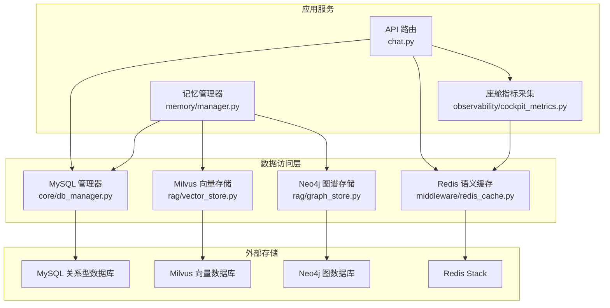
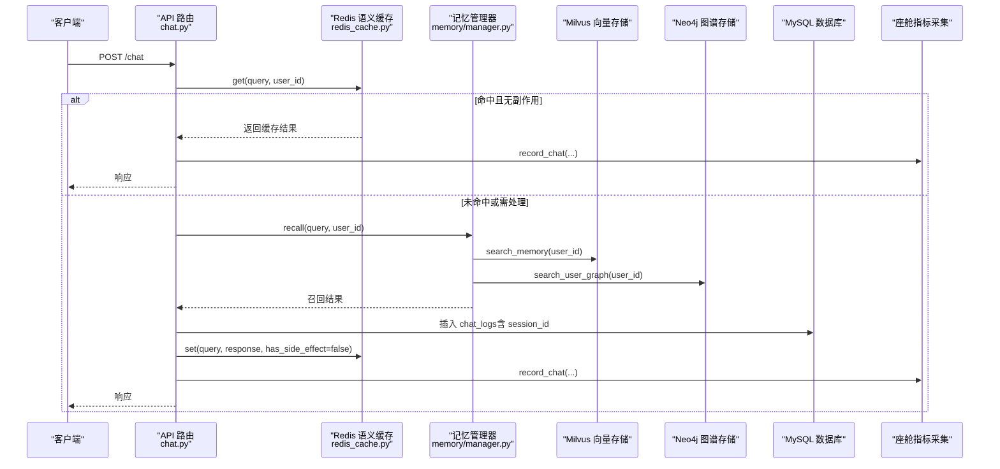
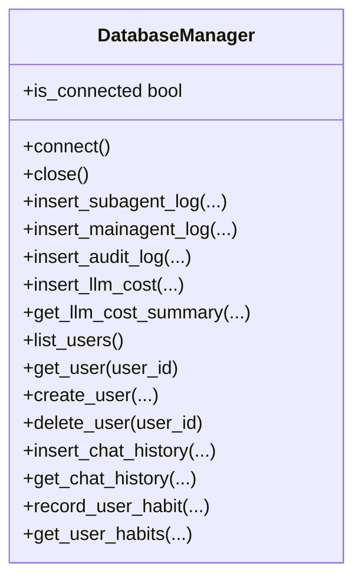
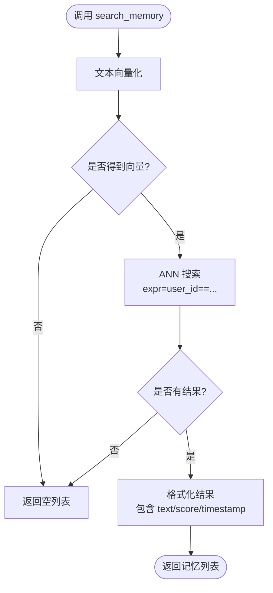
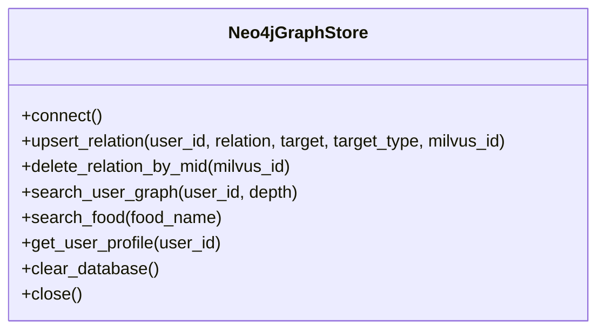
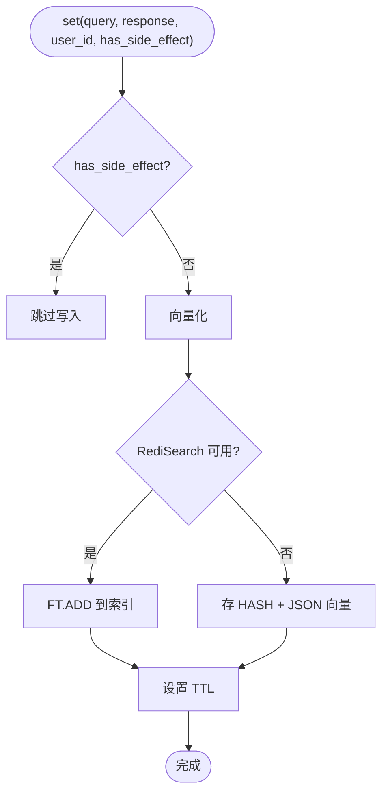
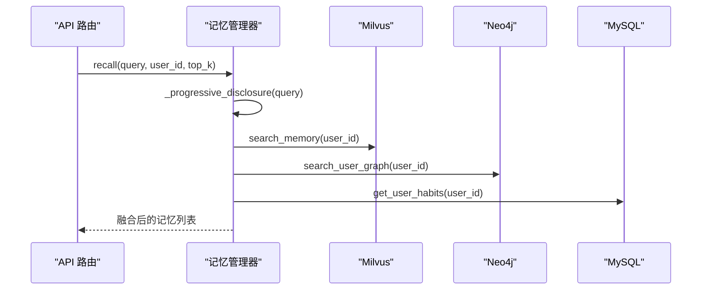
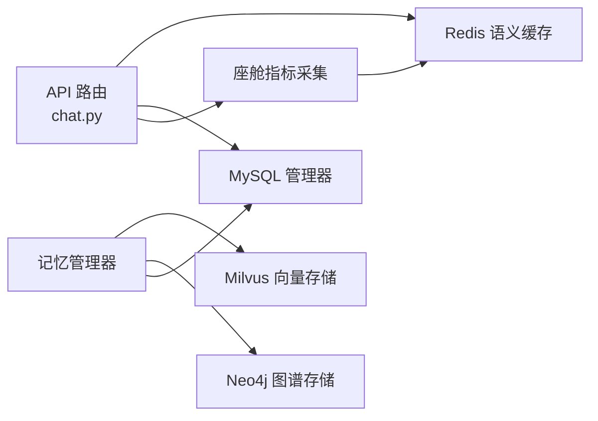

# 数据存储设计

<cite>
**本文引用的文件**   
- [db_manager.py](file://backend_design/nexus/core/db_manager.py)
- [v2.1_migration.sql](file://backend_design/scripts/v2.1_migration.sql)
- [vector_store.py](file://backend_design/nexus/rag/vector_store.py)
- [graph_store.py](file://backend_design/nexus/rag/graph_store.py)
- [redis_cache.py](file://backend_design/nexus/middleware/redis_cache.py)
- [manager.py](file://backend_design/nexus/memory/manager.py)
- [chat.py](file://backend_design/nexus/api/routes/chat.py)
- [cockpit_metrics.py](file://backend_design/nexus/observability/cockpit_metrics.py)
- [metrics.py](file://backend_design/nexus/observability/metrics.py)
- [cockpit_manager.py](file://backend_design/nexus/core/cockpit_manager.py)
</cite>

## 目录
1. [引言](#引言)
2. [项目结构](#项目结构)
3. [核心组件](#核心组件)
4. [架构总览](#架构总览)
5. [详细组件分析](#详细组件分析)
6. [依赖关系分析](#依赖关系分析)
7. [性能考量](#性能考量)
8. [故障排查指南](#故障排查指南)
9. [结论](#结论)
10. [附录](#附录)

## 引言
本文件面向 NexusCockpit 的数据存储设计与实现，系统性阐述多数据库架构：MySQL 关系型数据、Milvus 向量数据、Neo4j 图谱数据、Redis 缓存数据的存储策略与访问模式。文档覆盖 Schema 设计（表结构、字段类型、索引优化、约束）、一致性保障（事务、同步、备份恢复）、访问模式（连接池、查询优化、ORM 映射替代方案）、迁移与版本管理、以及性能监控最佳实践。目标是帮助读者快速理解并高效扩展系统的数据层。

## 项目结构
NexusCockpit 后端采用“按能力分层 + 按领域模块”的组织方式：
- 核心数据访问层：MySQL 连接池与通用 CRUD（DatabaseManager）
- RAG 检索层：Milvus 向量库、Neo4j 知识图谱、统一检索路由
- 中间件层：Redis 语义缓存与会话存储
- 记忆管理层：MemoryManager 协调三层记忆（短期 Redis、长期 Milvus+Neo4j、习惯 MySQL）
- API 层：对话接口记录指标与持久化日志
- 可观测性：Prometheus 指标与座舱级指标采集

图表来源
- [chat.py:77-120](file://backend_design/nexus/api/routes/chat.py#L77-L120)
- [manager.py:89-140](file://backend_design/nexus/memory/manager.py#L89-L140)
- [cockpit_metrics.py:41-101](file://backend_design/nexus/observability/cockpit_metrics.py#L41-L101)
- [db_manager.py:33-78](file://backend_design/nexus/core/db_manager.py#L33-L78)
- [vector_store.py:52-100](file://backend_design/nexus/rag/vector_store.py#L52-L100)
- [graph_store.py:31-54](file://backend_design/nexus/rag/graph_store.py#L31-L54)
- [redis_cache.py:83-110](file://backend_design/nexus/middleware/redis_cache.py#L83-L110)

章节来源
- [chat.py:77-120](file://backend_design/nexus/api/routes/chat.py#L77-L120)
- [manager.py:89-140](file://backend_design/nexus/memory/manager.py#L89-L140)
- [cockpit_metrics.py:41-101](file://backend_design/nexus/observability/cockpit_metrics.py#L41-L101)
- [db_manager.py:33-78](file://backend_design/nexus/core/db_manager.py#L33-L78)
- [vector_store.py:52-100](file://backend_design/nexus/rag/vector_store.py#L52-L100)
- [graph_store.py:31-54](file://backend_design/nexus/rag/graph_store.py#L31-L54)
- [redis_cache.py:83-110](file://backend_design/nexus/middleware/redis_cache.py#L83-L110)

## 核心组件
- MySQL 数据库管理器（DatabaseManager）
  - 使用 aiomysql 异步连接池，提供 SubAgent/MainAgent 日志、审计日志、LLM 成本追踪、用户管理（RBAC）、对话历史等读写方法；启动时自动迁移 v2.2.2 多会话相关结构与列，并修复中文用户名/座舱名。
- Milvus 向量存储（MilvusVectorStore）
  - 维护 Food_List 与 User_Memory 两个集合，支持 ANN 近似搜索、按 user_id 过滤、创建 HNSW/FLAT 向量索引与 Trie 标量索引。
- Neo4j 图谱存储（Neo4jGraphStore）
  - 维护 (User)-[:RELATION]->(Entity) 关系，关系属性绑定 Milvus ID（mid），支持 N 阶路径查询与用户画像导出。
- Redis 语义缓存（SemanticCache）
  - 基于 RediSearch VECTOR 索引的 KNN 检索，支持按 user_id 分片、TTL 分级、副作用响应禁止写入缓存的安全策略；无 RediSearch 时回退为 scan 遍历。
- 记忆管理器（MemoryManager）
  - 协调短期记忆（Redis SessionStore）、长期记忆（Milvus+Neo4j）、习惯记忆（MySQL user_habits），实现三路召回（向量+图谱+BM25）+ RRF 融合 + Rerank 重排，并按查询复杂度渐进式披露。
- 座舱指标采集（CockpitMetrics）
  - 将实时指标写入 Redis Hash，供看板展示；配合 Prometheus 指标暴露 /metrics。

章节来源
- [db_manager.py:33-78](file://backend_design/nexus/core/db_manager.py#L33-L78)
- [vector_store.py:52-132](file://backend_design/nexus/rag/vector_store.py#L52-L132)
- [graph_store.py:31-82](file://backend_design/nexus/rag/graph_store.py#L31-L82)
- [redis_cache.py:83-158](file://backend_design/nexus/middleware/redis_cache.py#L83-L158)
- [manager.py:89-140](file://backend_design/nexus/memory/manager.py#L89-L140)
- [cockpit_metrics.py:41-101](file://backend_design/nexus/observability/cockpit_metrics.py#L41-L101)

## 架构总览
多数据库协同工作流如下：
- 请求进入后，先查 Redis 语义缓存（KNN 相似度匹配），命中则直接返回；未命中则走 Agent 流程。
- Agent 执行过程中，记忆管理器通过 GraphRAGRetriever 进行三路召回（向量、图谱、全文），经 RRF 融合与 Rerank 重排，再注入用户习惯（MySQL）。
- 最终响应若存在副作用（如车控指令），禁止写入缓存；否则写入 Redis 并设置 TTL。
- 指标写入 Redis（实时）与 MySQL（聚合），同时暴露 Prometheus 指标。

图表来源
- [chat.py:254-293](file://backend_design/nexus/api/routes/chat.py#L254-L293)
- [redis_cache.py:160-249](file://backend_design/nexus/middleware/redis_cache.py#L160-L249)
- [manager.py:95-140](file://backend_design/nexus/memory/manager.py#L95-L140)
- [vector_store.py:134-168](file://backend_design/nexus/rag/vector_store.py#L134-L168)
- [graph_store.py:98-133](file://backend_design/nexus/rag/graph_store.py#L98-L133)
- [cockpit_metrics.py:41-65](file://backend_design/nexus/observability/cockpit_metrics.py#L41-L65)

## 详细组件分析

### MySQL 关系型数据
- 连接池与生命周期
  - 使用 aiomysql.create_pool 初始化连接池，最小/最大连接数可调；提供 connect/close/is_connected 状态管理。
- 自动迁移与修复
  - 启动时确保 chat_sessions、user_habits 表存在，并为 chat_logs 动态添加 session_id 列及索引；修复中文用户名/座舱名为英文以避免乱码。
- 表结构与索引
  - 主要表包括 cockpits、users、chat_history、chat_logs、subagent_logs、mainagent_logs、audit_logs、llm_cost_tracking、voiceprint_enrollments、user_habits、chat_sessions 等；广泛使用 Cockpit 维度复合索引以优化时间范围查询。
- 约束与一致性
  - users.cockpit_id 外键关联 cockpits(cockpit_id)，删除时置空；主键唯一约束保证实体唯一性；JSON 字段用于灵活扩展（如 check_items、decision_trace、detail）。
- 访问模式
  - 非 ORM，直接使用参数化 SQL 与 DictCursor；批量统计查询使用 SUM/COUNT/GROUP BY；异常捕获并记录日志，失败返回默认值避免级联错误。

图表来源
- [db_manager.py:33-78](file://backend_design/nexus/core/db_manager.py#L33-L78)
- [db_manager.py:79-143](file://backend_design/nexus/core/db_manager.py#L79-L143)
- [db_manager.py:206-402](file://backend_design/nexus/core/db_manager.py#L206-L402)
- [db_manager.py:470-577](file://backend_design/nexus/core/db_manager.py#L470-L577)
- [db_manager.py:583-654](file://backend_design/nexus/core/db_manager.py#L583-L654)
- [db_manager.py:696-737](file://backend_design/nexus/core/db_manager.py#L696-L737)

章节来源
- [db_manager.py:33-78](file://backend_design/nexus/core/db_manager.py#L33-L78)
- [db_manager.py:79-143](file://backend_design/nexus/core/db_manager.py#L79-L143)
- [db_manager.py:206-402](file://backend_design/nexus/core/db_manager.py#L206-L402)
- [db_manager.py:470-577](file://backend_design/nexus/core/db_manager.py#L470-L577)
- [db_manager.py:583-654](file://backend_design/nexus/core/db_manager.py#L583-L654)
- [db_manager.py:696-737](file://backend_design/nexus/core/db_manager.py#L696-L737)
- [v2.1_migration.sql:21-178](file://backend_design/scripts/v2.1_migration.sql#L21-L178)
- [v2.1_migration.sql:274-301](file://backend_design/scripts/v2.1_migration.sql#L274-L301)
- [v2.1_migration.sql:321-332](file://backend_design/scripts/v2.1_migration.sql#L321-L332)

### Milvus 向量数据
- 集合与字段
  - Food_List：id、vector(dim)、item_name、category_name、cate_1/2/3_name
  - User_Memory：id、user_id、vector(dim)、text、timestamp
- 索引策略
  - 向量字段使用 HNSW/FLAT 索引（metric_type 由配置决定）；user_id 使用 Trie 索引加速过滤。
- 检索与写入
  - 支持 ANN 近似搜索，按 user_id 表达式过滤；写入时生成向量并插入，返回主键 ID。
- 安全与降级
  - 连接失败抛出 VectorStoreError；集合不存在时自动创建并加载。

图表来源
- [vector_store.py:134-168](file://backend_design/nexus/rag/vector_store.py#L134-L168)
- [vector_store.py:170-192](file://backend_design/nexus/rag/vector_store.py#L170-L192)
- [vector_store.py:72-100](file://backend_design/nexus/rag/vector_store.py#L72-L100)
- [vector_store.py:102-132](file://backend_design/nexus/rag/vector_store.py#L102-L132)

章节来源
- [vector_store.py:52-100](file://backend_design/nexus/rag/vector_store.py#L52-L100)
- [vector_store.py:102-132](file://backend_design/nexus/rag/vector_store.py#L102-L132)
- [vector_store.py:134-168](file://backend_design/nexus/rag/vector_store.py#L134-L168)
- [vector_store.py:170-192](file://backend_design/nexus/rag/vector_store.py#L170-L192)

### Neo4j 图谱数据
- 节点与关系
  - 节点：User(id)、Entity(name)、Food(name) 等
  - 关系：(User)-[:LIKES|ALLERGY|...]->(Entity)，关系属性 mid 绑定 Milvus 主键，timestamp 记录更新时间
- 约束与索引
  - User.id 唯一约束；Entity.name 索引
- 查询能力
  - 支持 N 阶路径查询、用户画像导出（relation/target/type/milvus_id）
- 双向绑定
  - 写入时 upsert_relation(user_id, relation, target, type, milvus_id)；删除时根据 mid 联动删除关系

图表来源
- [graph_store.py:31-54](file://backend_design/nexus/rag/graph_store.py#L31-L54)
- [graph_store.py:55-82](file://backend_design/nexus/rag/graph_store.py#L55-L82)
- [graph_store.py:98-133](file://backend_design/nexus/rag/graph_store.py#L98-L133)
- [graph_store.py:153-172](file://backend_design/nexus/rag/graph_store.py#L153-L172)

章节来源
- [graph_store.py:31-54](file://backend_design/nexus/rag/graph_store.py#L31-L54)
- [graph_store.py:55-82](file://backend_design/nexus/rag/graph_store.py#L55-L82)
- [graph_store.py:98-133](file://backend_design/nexus/rag/graph_store.py#L98-L133)
- [graph_store.py:153-172](file://backend_design/nexus/rag/graph_store.py#L153-L172)

### Redis 缓存数据
- 语义缓存策略
  - 使用 RediSearch VECTOR 索引（COSINE 距离）实现 O(log n) KNN 检索；按 user_id TAG 隔离；TTL 分级控制过期；has_side_effect=True 的响应禁止写入缓存，防止车控指令被缓存后不执行。
- 兼容性与降级
  - 云 Redis 无 RediSearch 模块时，回退为 scan_iter 遍历计算余弦相似度；异常时自动降级。
- 统计与清理
  - 提供 hit_count/miss_count/hit_rate/size/index_ready 统计；支持 clear 清空所有条目。

图表来源
- [redis_cache.py:315-379](file://backend_design/nexus/middleware/redis_cache.py#L315-L379)
- [redis_cache.py:112-158](file://backend_design/nexus/middleware/redis_cache.py#L112-L158)
- [redis_cache.py:160-249](file://backend_design/nexus/middleware/redis_cache.py#L160-L249)
- [redis_cache.py:251-313](file://backend_design/nexus/middleware/redis_cache.py#L251-L313)

章节来源
- [redis_cache.py:83-110](file://backend_design/nexus/middleware/redis_cache.py#L83-L110)
- [redis_cache.py:112-158](file://backend_design/nexus/middleware/redis_cache.py#L112-L158)
- [redis_cache.py:160-249](file://backend_design/nexus/middleware/redis_cache.py#L160-L249)
- [redis_cache.py:251-313](file://backend_design/nexus/middleware/redis_cache.py#L251-L313)
- [redis_cache.py:315-379](file://backend_design/nexus/middleware/redis_cache.py#L315-L379)

### 记忆管理与多源融合
- 三层记忆
  - 短期：Redis SessionStore（会话历史）
  - 长期：Milvus 向量 + Neo4j 图谱（语义召回 + 关系图谱）
  - 习惯：MySQL user_habits（频次加权注入）
- 检索管道
  - GraphRAGRetriever 三路召回 → RRF 融合 → Rerank 重排 → 渐进式披露（简单指令 top_k=3，复杂查询 top_k=8）
- 冲突与一致性
  - 冲突检测器与提取器协作，必要时删除冲突记忆并在 Milvus 与 Neo4j 中联动删除。

图表来源
- [manager.py:95-140](file://backend_design/nexus/memory/manager.py#L95-L140)
- [manager.py:142-173](file://backend_design/nexus/memory/manager.py#L142-L173)
- [manager.py:175-197](file://backend_design/nexus/memory/manager.py#L175-L197)
- [vector_store.py:134-168](file://backend_design/nexus/rag/vector_store.py#L134-L168)
- [graph_store.py:98-133](file://backend_design/nexus/rag/graph_store.py#L98-L133)
- [db_manager.py:696-737](file://backend_design/nexus/core/db_manager.py#L696-L737)

章节来源
- [manager.py:95-140](file://backend_design/nexus/memory/manager.py#L95-L140)
- [manager.py:142-173](file://backend_design/nexus/memory/manager.py#L142-L173)
- [manager.py:175-197](file://backend_design/nexus/memory/manager.py#L175-L197)

## 依赖关系分析
- 组件耦合
  - API 路由依赖 Redis 缓存、MySQL 日志、座舱指标采集；记忆管理器依赖 Milvus、Neo4j、MySQL 习惯表；座舱指标采集依赖 Redis。
- 外部依赖
  - aiomysql、pymilvus、neo4j、redis.asyncio、prometheus_client
- 潜在循环依赖
  - 当前各模块通过函数导入（如 cockpit_manager 内部 import db_manager）避免强耦合；建议保持弱引用与单例模式。

图表来源
- [chat.py:254-293](file://backend_design/nexus/api/routes/chat.py#L254-L293)
- [manager.py:89-140](file://backend_design/nexus/memory/manager.py#L89-L140)
- [cockpit_metrics.py:41-101](file://backend_design/nexus/observability/cockpit_metrics.py#L41-L101)

章节来源
- [chat.py:254-293](file://backend_design/nexus/api/routes/chat.py#L254-L293)
- [manager.py:89-140](file://backend_design/nexus/memory/manager.py#L89-L140)
- [cockpit_metrics.py:41-101](file://backend_design/nexus/observability/cockpit_metrics.py#L41-L101)

## 性能考量
- MySQL
  - 使用连接池减少握手开销；广泛使用 Cockpit 维度复合索引优化时间范围查询；JSON 字段避免频繁 DDL；统计查询使用聚合函数降低往返次数。
- Milvus
  - 合理选择 index_type 与 metric_type；对高频过滤字段（user_id）建立 Trie 索引；批量插入提升吞吐。
- Neo4j
  - 利用 MERGE 幂等写入；限制查询深度避免全图扫描；按需创建索引与约束。
- Redis
  - 优先使用 RediSearch KNN 检索；无模块时回退 scan 模式；TTL 分级控制内存占用；副作用响应禁止缓存确保安全。
- 指标与可观测性
  - 使用 Prometheus 指标暴露关键延迟与计数；座舱级指标写入 Redis Hash 供看板展示。

[本节为通用指导，无需具体文件分析]

## 故障排查指南
- MySQL 连接失败
  - 检查连接池初始化与自动迁移步骤；查看日志中的 “MySQL connection failed” 与 “Auto-migrate tables failed”。
- Redis 不可用或无 RediSearch
  - 确认 Redis Stack 是否启用；若无模块，系统将回退 scan 模式；关注 “Redis connection failed, cache disabled” 与 “Failed to create RediSearch index”。
- Milvus 连接失败
  - 检查 URI/token/collection 前缀；连接失败会抛出 VectorStoreError；确认集合是否存在与索引是否创建成功。
- Neo4j 连接失败
  - 检查 uri/user/password；连接失败抛出 GraphStoreError；确认约束与索引是否创建。
- 对话日志未持久化
  - 检查 API 路由中 _record_chat_metrics 的执行路径与 DB 连接状态；确认 chat_logs 表结构与 session_id 列存在。

章节来源
- [db_manager.py:49-78](file://backend_design/nexus/core/db_manager.py#L49-L78)
- [db_manager.py:79-143](file://backend_design/nexus/core/db_manager.py#L79-L143)
- [redis_cache.py:83-110](file://backend_design/nexus/middleware/redis_cache.py#L83-L110)
- [redis_cache.py:112-158](file://backend_design/nexus/middleware/redis_cache.py#L112-L158)
- [vector_store.py:52-70](file://backend_design/nexus/rag/vector_store.py#L52-L70)
- [graph_store.py:31-43](file://backend_design/nexus/rag/graph_store.py#L31-L43)
- [chat.py:111-120](file://backend_design/nexus/api/routes/chat.py#L111-L120)

## 结论
NexusCockpit 的多数据库架构围绕“高性能检索 + 强一致业务数据 + 灵活图谱关系 + 安全语义缓存”展开。通过连接池、索引优化、KNN 检索、Rerank 重排与副作用安全策略，系统在车载语音助手场景下实现了低延迟与高可用性。建议在后续演进中持续完善备份恢复策略、跨库事务补偿机制与容量规划。

[本节为总结，无需具体文件分析]

## 附录

### MySQL Schema 概览（节选）
- cockpits：cockpit_id(PK), name, user_id, vehicle_adapter, redis_db, milvus_prefix, theme_color, is_active, created_at, updated_at, idx_active
- users：user_id(PK), username, password_hash, cockpit_id(FK), role(ENUM), created_at, idx_cockpit, idx_role
- chat_history：id(AI PK), cockpit_id, user_id, session_id, user_input, assistant_reply, intent, experts_involved(JSON), latency_ms, cache_hit, created_at, idx_cockpit_time, idx_user_time, idx_session
- chat_logs：id(AI PK), cockpit_id, user_id, session_id, user_input, assistant_response, intent, action, latency_ms, cache_hit, created_at, idx_cockpit_user, idx_cockpit_time
- subagent_logs/mainagent_logs/audit_logs/llm_cost_tracking/voiceprint_enrollments/user_habits/chat_sessions：详见迁移脚本

章节来源
- [v2.1_migration.sql:21-178](file://backend_design/scripts/v2.1_migration.sql#L21-L178)
- [v2.1_migration.sql:274-301](file://backend_design/scripts/v2.1_migration.sql#L274-L301)
- [v2.1_migration.sql:321-332](file://backend_design/scripts/v2.1_migration.sql#L321-L332)

### 数据一致性保障与备份恢复
- 一致性
  - 会话并发：API 路由使用 asyncio.Lock 保护同一 session_key 的历史更新，避免交叉污染。
  - 副作用安全：has_side_effect=True 的响应禁止写入缓存，防止车控指令被缓存后不执行。
  - 双向绑定：Milvus 主键与 Neo4j 关系 mid 绑定，删除时联动清理。
- 事务与补偿
  - 当前未使用显式跨库事务；通过幂等写入（MERGE/ON DUPLICATE KEY UPDATE）与重试机制保证最终一致性。
- 备份恢复
  - MySQL：定期 mysqldump 或逻辑备份；结合 binlog 增量恢复。
  - Milvus：集合级导出/导入或集群快照（依据部署环境）。
  - Neo4j：dump/load 或在线备份工具。
  - Redis：AOF/RDB 持久化与定期快照。

章节来源
- [chat.py:67-74](file://backend_design/nexus/api/routes/chat.py#L67-L74)
- [redis_cache.py:315-379](file://backend_design/nexus/middleware/redis_cache.py#L315-L379)
- [graph_store.py:84-96](file://backend_design/nexus/rag/graph_store.py#L84-L96)
- [vector_store.py:194-207](file://backend_design/nexus/rag/vector_store.py#L194-L207)

### 数据访问模式与连接池管理
- MySQL：aiomysql 连接池，autocommit=True，DictCursor 返回字典；异常捕获并记录日志。
- Milvus：pymilvus Collection 对象复用，连接失败抛错；集合懒加载与自动创建。
- Neo4j：GraphDatabase.driver 单例，verify_connectivity 校验连通性。
- Redis：aioredis.from_url 异步客户端；RediSearch 索引懒创建；scan 降级。

章节来源
- [db_manager.py:49-78](file://backend_design/nexus/core/db_manager.py#L49-L78)
- [vector_store.py:52-70](file://backend_design/nexus/rag/vector_store.py#L52-L70)
- [graph_store.py:31-43](file://backend_design/nexus/rag/graph_store.py#L31-L43)
- [redis_cache.py:83-110](file://backend_design/nexus/middleware/redis_cache.py#L83-L110)

### 数据迁移与版本管理
- 迁移脚本：v2.1_migration.sql 包含新增表、ALTER TABLE 安全升级、默认数据插入、中文名称修复、多会话支持。
- 运行时迁移：DatabaseManager._auto_migrate_tables 在启动时确保必要结构与列存在。
- 版本策略：以 SQL 脚本为主，代码层仅做幂等校验与修复。

章节来源
- [v2.1_migration.sql:1-12](file://backend_design/scripts/v2.1_migration.sql#L1-L12)
- [v2.1_migration.sql:181-246](file://backend_design/scripts/v2.1_migration.sql#L181-L246)
- [v2.1_migration.sql:248-267](file://backend_design/scripts/v2.1_migration.sql#L248-L267)
- [v2.1_migration.sql:269-315](file://backend_design/scripts/v2.1_migration.sql#L269-L315)
- [v2.1_migration.sql:317-386](file://backend_design/scripts/v2.1_migration.sql#L317-L386)
- [db_manager.py:79-143](file://backend_design/nexus/core/db_manager.py#L79-L143)

### 性能监控与最佳实践
- Prometheus 指标：请求计数/延迟、Agent 调用/延迟、技能执行、缓存命中/缺失、RAG 检索/延迟、LLM 调用/延迟、活跃连接/用户。
- 座舱级指标：Redis Hash 记录聊天/车控/缓存/错误计数与最后延迟；计算命中率与错误率。
- 最佳实践：合理设置 buckets 与阈值；对热点 key 使用 pipeline；避免大对象写入；定期清理过期数据。

章节来源
- [metrics.py:1-113](file://backend_design/nexus/observability/metrics.py#L1-L113)
- [cockpit_metrics.py:41-101](file://backend_design/nexus/observability/cockpit_metrics.py#L41-L101)
- [cockpit_metrics.py:103-147](file://backend_design/nexus/observability/cockpit_metrics.py#L103-L147)