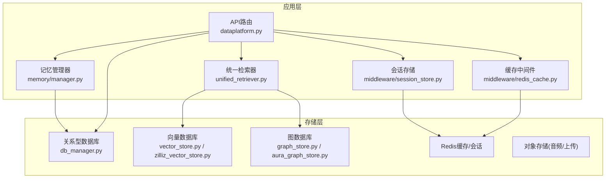
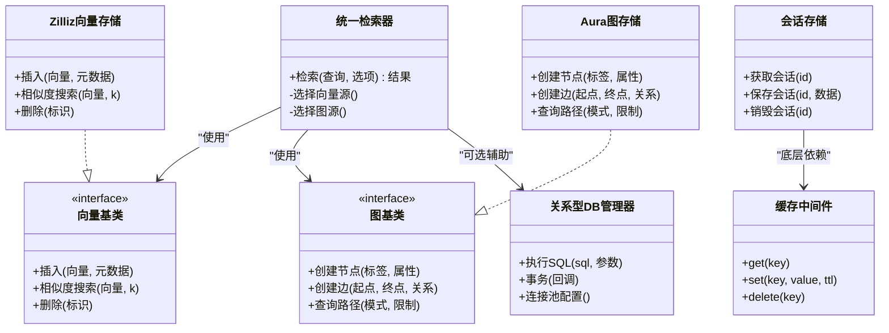
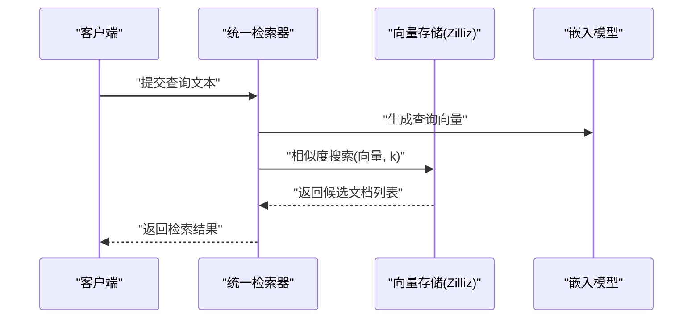
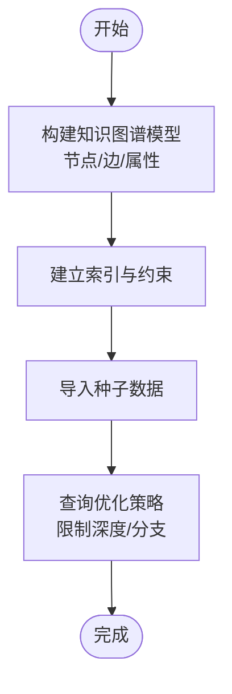
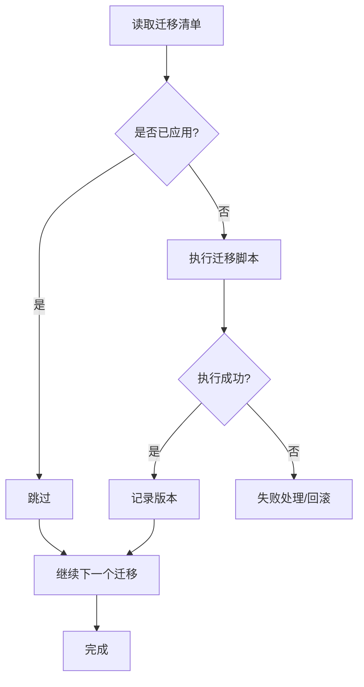
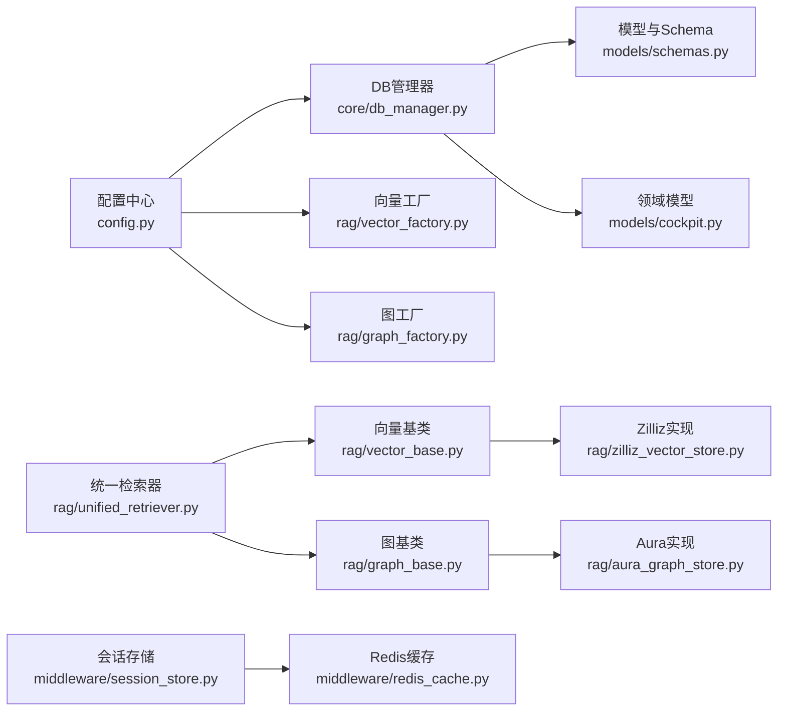

# 数据存储设计

<cite>
**本文引用的文件**   
- [backend_design/nexus/core/db_manager.py](file://backend_design/nexus/core/db_manager.py)
- [backend_design/nexus/models/cockpit.py](file://backend_design/nexus/models/cockpit.py)
- [backend_design/nexus/models/schemas.py](file://backend_design/nexus/models/schemas.py)
- [backend_design/nexus/memory/manager.py](file://backend_design/nexus/memory/manager.py)
- [backend_design/nexus/middleware/session_store.py](file://backend_design/nexus/middleware/session_store.py)
- [backend_design/nexus/middleware/redis_cache.py](file://backend_design/nexus/middleware/redis_cache.py)
- [backend_design/nexus/rag/vector_base.py](file://backend_design/nexus/rag/vector_base.py)
- [backend_design/nexus/rag/vector_factory.py](file://backend_design/nexus/rag/vector_factory.py)
- [backend_design/nexus/rag/vector_store.py](file://backend_design/nexus/rag/vector_store.py)
- [backend_design/nexus/rag/zilliz_vector_store.py](file://backend_design/nexus/rag/zilliz_vector_store.py)
- [backend_design/nexus/rag/graph_base.py](file://backend_design/nexus/rag/graph_base.py)
- [backend_design/nexus/rag/graph_factory.py](file://backend_design/nexus/rag/graph_factory.py)
- [backend_design/nexus/rag/graph_store.py](file://backend_design/nexus/rag/graph_store.py)
- [backend_design/nexus/rag/aura_graph_store.py](file://backend_design/nexus/rag/aura_graph_store.py)
- [backend_design/nexus/rag/unified_retriever.py](file://backend_design/nexus/rag/unified_retriever.py)
- [backend_design/nexus/rag/cherry_kb.py](file://backend_design/nexus/rag/cherry_kb.py)
- [scripts/init_milvus.py](file://scripts/init_milvus.py)
- [scripts/init_neo4j.py](file://scripts/init_neo4j.py)
- [scripts/v2.1_migration.sql](file://scripts/v2.1_migration.sql)
- [backend_design/nexus/config.py](file://backend_design/nexus/config.py)
- [docker-compose.yml](file://docker-compose.yml)
- [backend_design/nexus/api/routes/dataplatform.py](file://backend_design/nexus/api/routes/dataplatform.py)
</cite>

## 目录
1. [简介](#简介)
2. [项目结构](#项目结构)
3. [核心组件](#核心组件)
4. [架构总览](#架构总览)
5. [详细组件分析](#详细组件分析)
6. [依赖关系分析](#依赖关系分析)
7. [性能考虑](#性能考虑)
8. [故障排查指南](#故障排查指南)
9. [结论](#结论)
10. [附录](#附录)

## 简介
本文件聚焦于NexusCockpit的数据存储设计，覆盖多数据库架构、数据分布策略、关系型数据库表结构与索引优化、向量数据库的存储格式与相似度搜索实现、图数据库的知识图谱建模与查询优化、数据迁移与版本管理、备份恢复与灾难恢复策略，以及数据安全与隐私保护方案。文档面向具备不同技术背景的读者，提供从高层架构到代码级实现的系统性说明。

## 项目结构
后端采用Python服务（FastAPI）+ Go网关的多语言架构，数据存储层由多种数据库协同构成：
- 关系型数据库：用于会话、用户、配置等结构化数据
- 向量数据库：用于RAG检索与语义相似度搜索
- 图数据库：用于知识图谱建模与复杂关系查询
- 缓存与会话存储：Redis用于高性能读写与分布式会话
- 对象存储：音频、上传文件等二进制资源

图表来源
- [backend_design/nexus/api/routes/dataplatform.py](file://backend_design/nexus/api/routes/dataplatform.py)
- [backend_design/nexus/rag/unified_retriever.py](file://backend_design/nexus/rag/unified_retriever.py)
- [backend_design/nexus/memory/manager.py](file://backend_design/nexus/memory/manager.py)
- [backend_design/nexus/middleware/session_store.py](file://backend_design/nexus/middleware/session_store.py)
- [backend_design/nexus/middleware/redis_cache.py](file://backend_design/nexus/middleware/redis_cache.py)
- [backend_design/nexus/core/db_manager.py](file://backend_design/nexus/core/db_manager.py)
- [backend_design/nexus/rag/vector_store.py](file://backend_design/nexus/rag/vector_store.py)
- [backend_design/nexus/rag/zilliz_vector_store.py](file://backend_design/nexus/rag/zilliz_vector_store.py)
- [backend_design/nexus/rag/graph_store.py](file://backend_design/nexus/rag/graph_store.py)
- [backend_design/nexus/rag/aura_graph_store.py](file://backend_design/nexus/rag/aura_graph_store.py)

章节来源
- [backend_design/nexus/api/routes/dataplatform.py](file://backend_design/nexus/api/routes/dataplatform.py)
- [backend_design/nexus/core/db_manager.py](file://backend_design/nexus/core/db_manager.py)
- [backend_design/nexus/rag/unified_retriever.py](file://backend_design/nexus/rag/unified_retriever.py)
- [backend_design/nexus/middleware/session_store.py](file://backend_design/nexus/middleware/session_store.py)
- [backend_design/nexus/middleware/redis_cache.py](file://backend_design/nexus/middleware/redis_cache.py)

## 核心组件
本节概述各存储组件的职责与交互方式：
- 关系型数据库访问：通过统一的DB管理器进行连接池、事务与SQL执行封装
- 模型与Schema：使用Pydantic定义输入输出结构，确保类型安全与校验
- 记忆系统：持久化用户偏好、历史对话摘要等，支撑个性化体验
- 会话与缓存：基于Redis的会话存储与通用缓存中间件，提升吞吐与降低延迟
- RAG检索：统一检索器协调向量与图检索，返回融合结果
- 向量存储：抽象接口+具体实现（如Zilliz），支持高维向量写入与相似度搜索
- 图存储：抽象接口+具体实现（如Aura），支持节点/边增删改查与路径查询

章节来源
- [backend_design/nexus/core/db_manager.py](file://backend_design/nexus/core/db_manager.py)
- [backend_design/nexus/models/schemas.py](file://backend_design/nexus/models/schemas.py)
- [backend_design/nexus/memory/manager.py](file://backend_design/nexus/memory/manager.py)
- [backend_design/nexus/middleware/session_store.py](file://backend_design/nexus/middleware/session_store.py)
- [backend_design/nexus/middleware/redis_cache.py](file://backend_design/nexus/middleware/redis_cache.py)
- [backend_design/nexus/rag/unified_retriever.py](file://backend_design/nexus/rag/unified_retriever.py)
- [backend_design/nexus/rag/vector_base.py](file://backend_design/nexus/rag/vector_base.py)
- [backend_design/nexus/rag/vector_store.py](file://backend_design/nexus/rag/vector_store.py)
- [backend_design/nexus/rag/zilliz_vector_store.py](file://backend_design/nexus/rag/zilliz_vector_store.py)
- [backend_design/nexus/rag/graph_base.py](file://backend_design/nexus/rag/graph_base.py)
- [backend_design/nexus/rag/graph_store.py](file://backend_design/nexus/rag/graph_store.py)
- [backend_design/nexus/rag/aura_graph_store.py](file://backend_design/nexus/rag/aura_graph_store.py)

## 架构总览
下图展示多数据库架构的整体视图与各组件间的调用关系。

图表来源
- [backend_design/nexus/rag/unified_retriever.py](file://backend_design/nexus/rag/unified_retriever.py)
- [backend_design/nexus/rag/vector_base.py](file://backend_design/nexus/rag/vector_base.py)
- [backend_design/nexus/rag/zilliz_vector_store.py](file://backend_design/nexus/rag/zilliz_vector_store.py)
- [backend_design/nexus/rag/graph_base.py](file://backend_design/nexus/rag/graph_base.py)
- [backend_design/nexus/rag/aura_graph_store.py](file://backend_design/nexus/rag/aura_graph_store.py)
- [backend_design/nexus/core/db_manager.py](file://backend_design/nexus/core/db_manager.py)
- [backend_design/nexus/middleware/session_store.py](file://backend_design/nexus/middleware/session_store.py)
- [backend_design/nexus/middleware/redis_cache.py](file://backend_design/nexus/middleware/redis_cache.py)

## 详细组件分析

### 关系型数据库设计与索引优化
- 设计目标
  - 支撑会话、用户、设置、车辆状态等结构化数据的强一致读写
  - 提供可扩展的表结构以适配业务演进
- 表结构设计要点
  - 主键与外键：明确实体关系，避免循环引用
  - 字段类型与约束：使用合适的数据类型与NOT NULL约束，减少空值分支
  - 分区与分片：按租户或时间维度进行水平拆分，提升查询局部性
- 索引优化策略
  - 复合索引：针对高频过滤条件组合建立索引
  - 覆盖索引：尽量让查询命中索引列，减少回表
  - 前缀索引：对长文本字段使用前缀匹配
  - 唯一索引：保证关键业务字段唯一性
- 事务与一致性
  - 短事务原则，避免长时间持有锁
  - 幂等写入：通过唯一约束或去重表防止重复数据
- 参考实现位置
  - 连接与执行封装：[db_manager.py](file://backend_design/nexus/core/db_manager.py)
  - 模型与Schema定义：[schemas.py](file://backend_design/nexus/models/schemas.py)、[cockpit.py](file://backend_design/nexus/models/cockpit.py)

章节来源
- [backend_design/nexus/core/db_manager.py](file://backend_design/nexus/core/db_manager.py)
- [backend_design/nexus/models/schemas.py](file://backend_design/nexus/models/schemas.py)
- [backend_design/nexus/models/cockpit.py](file://backend_design/nexus/models/cockpit.py)

### 向量数据库存储格式与相似度搜索
- 存储格式
  - 向量维度：根据嵌入模型确定固定维度
  - 元数据：包含文档ID、来源、时间戳、租户ID等，便于过滤与溯源
  - 集合/命名空间：按业务域或租户隔离
- 相似度搜索实现
  - 距离度量：余弦相似度或内积，依据嵌入模型特性选择
  - 召回策略：Top-K检索，结合权重排序与重排
  - 批量操作：批量插入与更新以提升吞吐
- 工厂与抽象
  - 抽象接口：定义插入、搜索、删除等标准方法
  - 具体实现：如Zilliz向量存储，对接云服务或自建集群
- 初始化脚本
  - 集合创建、索引构建、默认配置注入

图表来源
- [backend_design/nexus/rag/unified_retriever.py](file://backend_design/nexus/rag/unified_retriever.py)
- [backend_design/nexus/rag/vector_base.py](file://backend_design/nexus/rag/vector_base.py)
- [backend_design/nexus/rag/zilliz_vector_store.py](file://backend_design/nexus/rag/zilliz_vector_store.py)
- [scripts/init_milvus.py](file://scripts/init_milvus.py)

章节来源
- [backend_design/nexus/rag/vector_base.py](file://backend_design/nexus/rag/vector_base.py)
- [backend_design/nexus/rag/vector_store.py](file://backend_design/nexus/rag/vector_store.py)
- [backend_design/nexus/rag/zilliz_vector_store.py](file://backend_design/nexus/rag/zilliz_vector_store.py)
- [scripts/init_milvus.py](file://scripts/init_milvus.py)

### 图数据库知识图谱建模与查询优化
- 建模策略
  - 节点标签：实体类型（如“用户”、“车辆”、“技能”）
  - 边关系：动作或关联（如“拥有”、“控制”、“属于”）
  - 属性：节点与边的附加信息（时间戳、权限、权重）
- 查询优化
  - 路径限制：限制跳数与分支因子，避免全图扫描
  - 索引与约束：为常用查询字段建立索引
  - 预计算：热点路径或聚合结果缓存
- 抽象与实现
  - 图基类：定义节点/边操作与路径查询接口
  - 具体实现：如Aura图存储，对接Neo4j云或本地实例
- 初始化脚本
  - 创建约束、索引、种子数据

图表来源
- [backend_design/nexus/rag/graph_base.py](file://backend_design/nexus/rag/graph_base.py)
- [backend_design/nexus/rag/aura_graph_store.py](file://backend_design/nexus/rag/aura_graph_store.py)
- [scripts/init_neo4j.py](file://scripts/init_neo4j.py)

章节来源
- [backend_design/nexus/rag/graph_base.py](file://backend_design/nexus/rag/graph_base.py)
- [backend_design/nexus/rag/graph_store.py](file://backend_design/nexus/rag/graph_store.py)
- [backend_design/nexus/rag/aura_graph_store.py](file://backend_design/nexus/rag/aura_graph_store.py)
- [scripts/init_neo4j.py](file://scripts/init_neo4j.py)

### 数据迁移工具与版本管理机制
- 迁移脚本
  - SQL迁移：v2.1版本的结构变更脚本，包含新增表、字段、索引与数据修复
  - 初始化脚本：向量与图数据库的集合/索引/种子数据初始化
- 版本管理
  - 版本号与变更日志：每个迁移脚本对应一个版本，确保可回滚
  - 幂等执行：迁移脚本需支持重复执行不产生副作用
- 执行流程
  - 部署前检查：验证目标环境版本与兼容性
  - 执行迁移：顺序执行未应用的迁移脚本
  - 回滚策略：提供反向脚本或快照恢复

图表来源
- [scripts/v2.1_migration.sql](file://scripts/v2.1_migration.sql)
- [scripts/init_milvus.py](file://scripts/init_milvus.py)
- [scripts/init_neo4j.py](file://scripts/init_neo4j.py)

章节来源
- [scripts/v2.1_migration.sql](file://scripts/v2.1_migration.sql)
- [scripts/init_milvus.py](file://scripts/init_milvus.py)
- [scripts/init_neo4j.py](file://scripts/init_neo4j.py)

### 数据备份恢复与灾难恢复策略
- 备份策略
  - 关系型数据库：定期全量与增量备份，保留多份副本
  - 向量与图数据库：导出集合/图快照，并同步至异地存储
  - 对象存储：跨地域复制与版本控制
- 恢复流程
  - 演练计划：定期演练恢复流程，验证RTO/RPO指标
  - 自动化恢复：编排脚本自动执行恢复步骤
- 灾难恢复
  - 多可用区部署：关键服务与存储冗余
  - 故障切换：DNS或服务发现自动切换至健康实例

章节来源
- [docker-compose.yml](file://docker-compose.yml)

### 数据安全与隐私保护
- 传输安全
  - TLS/HTTPS：所有外部通信启用加密
  - 证书管理：集中管理与轮换
- 认证与授权
  - JWT鉴权：网关层校验令牌，传递上下文
  - 细粒度权限：基于角色与资源的访问控制
- 数据脱敏与最小化
  - 敏感字段加密存储
  - 日志脱敏与审计
- 合规与审计
  - 访问日志与操作审计
  - 数据留存策略与清理

章节来源
- [backend_design/nexus/config.py](file://backend_design/nexus/config.py)
- [backend_design/nexus/api/routes/dataplatform.py](file://backend_design/nexus/api/routes/dataplatform.py)

## 依赖关系分析
下图展示核心模块之间的依赖关系，帮助识别耦合点与潜在风险。

图表来源
- [backend_design/nexus/config.py](file://backend_design/nexus/config.py)
- [backend_design/nexus/core/db_manager.py](file://backend_design/nexus/core/db_manager.py)
- [backend_design/nexus/models/schemas.py](file://backend_design/nexus/models/schemas.py)
- [backend_design/nexus/models/cockpit.py](file://backend_design/nexus/models/cockpit.py)
- [backend_design/nexus/rag/unified_retriever.py](file://backend_design/nexus/rag/unified_retriever.py)
- [backend_design/nexus/rag/vector_base.py](file://backend_design/nexus/rag/vector_base.py)
- [backend_design/nexus/rag/vector_factory.py](file://backend_design/nexus/rag/vector_factory.py)
- [backend_design/nexus/rag/zilliz_vector_store.py](file://backend_design/nexus/rag/zilliz_vector_store.py)
- [backend_design/nexus/rag/graph_base.py](file://backend_design/nexus/rag/graph_base.py)
- [backend_design/nexus/rag/graph_factory.py](file://backend_design/nexus/rag/graph_factory.py)
- [backend_design/nexus/rag/aura_graph_store.py](file://backend_design/nexus/rag/aura_graph_store.py)
- [backend_design/nexus/middleware/session_store.py](file://backend_design/nexus/middleware/session_store.py)
- [backend_design/nexus/middleware/redis_cache.py](file://backend_design/nexus/middleware/redis_cache.py)

章节来源
- [backend_design/nexus/config.py](file://backend_design/nexus/config.py)
- [backend_design/nexus/core/db_manager.py](file://backend_design/nexus/core/db_manager.py)
- [backend_design/nexus/rag/unified_retriever.py](file://backend_design/nexus/rag/unified_retriever.py)
- [backend_design/nexus/middleware/session_store.py](file://backend_design/nexus/middleware/session_store.py)
- [backend_design/nexus/middleware/redis_cache.py](file://backend_design/nexus/middleware/redis_cache.py)

## 性能考虑
- 连接池与并发
  - 合理设置连接池大小，避免过度竞争
  - 异步I/O与批处理提升吞吐
- 缓存策略
  - 多级缓存：本地内存+Redis，热点数据就近读取
  - TTL与失效策略：避免雪崩与穿透
- 检索优化
  - 向量检索：调整k值与阈值，平衡召回率与延迟
  - 图检索：限制路径深度与分支，必要时引入物化视图
- 资源隔离
  - 按租户或业务域隔离存储实例，避免相互影响
- 监控与告警
  - 关键指标：QPS、P99延迟、错误率、连接池利用率
  - 容量规划：基于增长趋势提前扩容

## 故障排查指南
- 常见问题定位
  - 连接超时：检查网络连通性与防火墙规则
  - 认证失败：核对JWT密钥与权限配置
  - 检索为空：确认向量/图索引是否构建成功
- 诊断工具
  - 日志采集：集中式日志与链路追踪
  - 指标面板：Prometheus/Grafana可视化
- 回滚与降级
  - 迁移失败：执行反向脚本或恢复到上一版本
  - 服务降级：关闭非核心功能，保障核心链路

章节来源
- [backend_design/nexus/config.py](file://backend_design/nexus/config.py)
- [backend_design/nexus/api/routes/dataplatform.py](file://backend_design/nexus/api/routes/dataplatform.py)

## 结论
本项目采用多数据库协同的存储架构，兼顾结构化、语义与关系型查询需求。通过抽象接口与工厂模式实现可插拔的向量与图存储，配合迁移脚本与备份恢复策略，形成完整的数据生命周期管理能力。后续可在索引优化、缓存命中率与检索质量方面持续改进，以满足更高性能与更稳定性的要求。

## 附录
- 术语表
  - RAG：检索增强生成
  - RTO/RPO：恢复时间目标/恢复点目标
- 参考文档
  - 架构文档：docs/architecture/L2-data.md
  - 部署指南：docs/deployment/SETUP.md