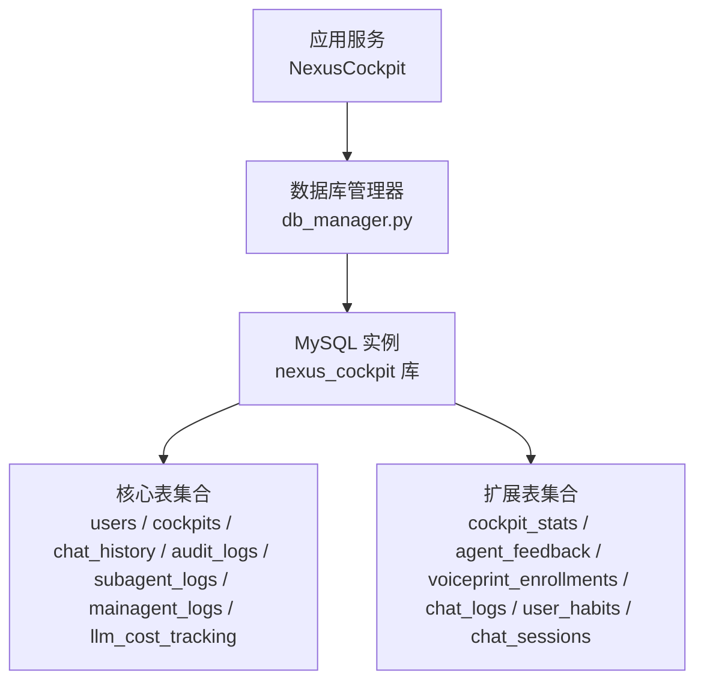
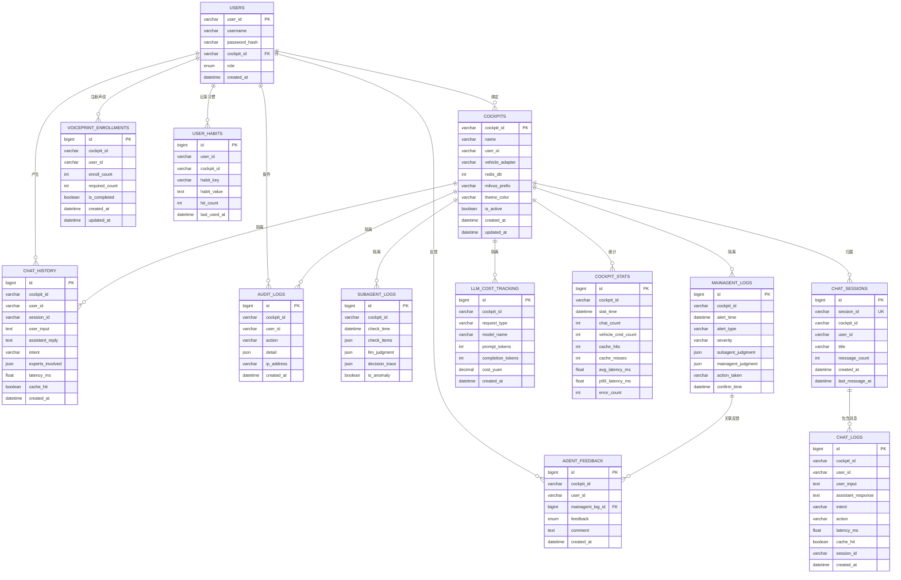
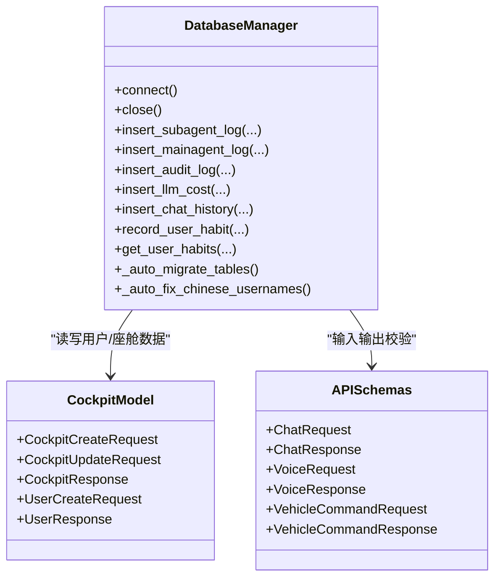

# 数据库Schema设计

<cite>
**本文引用的文件**   
- [v2.1迁移脚本](file://backend_design/scripts/v2.1_migration.sql)
- [数据库管理器](file://backend_design/nexus/core/db_manager.py)
- [座舱数据模型](file://backend_design/nexus/models/cockpit.py)
- [API Schemas](file://backend_design/nexus/models/schemas.py)
</cite>

## 目录
1. [简介](#简介)
2. [项目结构](#项目结构)
3. [核心组件](#核心组件)
4. [架构总览](#架构总览)
5. [详细组件分析](#详细组件分析)
6. [依赖关系分析](#依赖关系分析)
7. [性能与索引优化](#性能与索引优化)
8. [故障排查指南](#故障排查指南)
9. [结论](#结论)
10. [附录：DDL参考与最佳实践](#附录dd l参考与最佳实践)

## 简介
本技术文档聚焦 NexusCockpit 的数据库 Schema 设计，围绕以下核心表展开：users、cockpits、chat_history、audit_logs、subagent_logs、mainagent_logs、llm_cost_tracking，并补充说明 v2.1 新增的 cockpit_stats、agent_feedback、voiceprint_enrollments、chat_logs、user_habits、chat_sessions 等辅助表。文档将深入解释字段类型、约束规则、索引设计、外键与唯一性约束的设计原则；阐述字符集与排序规则配置；给出索引优化策略（复合索引、全文索引、空间索引的使用场景）；并提供数据迁移脚本、版本管理策略与向后兼容性保证机制；最后提供完整的 DDL 示例路径与最佳实践指导。

## 项目结构
与数据库相关的代码主要分布在如下位置：
- 迁移脚本与初始化 SQL：backend_design/scripts/v2.1_migration.sql
- 运行时自动迁移与连接池管理：backend_design/nexus/core/db_manager.py
- API 层数据模型（用于请求/响应校验，间接反映业务字段）：backend_design/nexus/models/cockpit.py、backend_design/nexus/models/schemas.py

图表来源
- [数据库管理器:33-78](file://backend_design/nexus/core/db_manager.py#L33-L78)
- [v2.1迁移脚本:1-386](file://backend_design/scripts/v2.1_migration.sql#L1-L386)

章节来源
- [数据库管理器:33-78](file://backend_design/nexus/core/db_manager.py#L33-L78)
- [v2.1迁移脚本:1-386](file://backend_design/scripts/v2.1_migration.sql#L1-L386)

## 核心组件
- 数据库管理器 DatabaseManager：负责 MySQL 连接池、自动迁移（启动时确保必要表与列存在）、常用 CRUD 封装（用户、对话历史、审计日志、LLM 成本追踪、SubAgent/MainAgent 日志、用户习惯等）。
- 迁移脚本 v2.1_migration.sql：定义所有表的 DDL、安全升级存储过程、默认数据插入、以及 v2.2.2 多会话相关结构的增量变更。
- API 模型：Pydantic 模型定义了对外暴露的请求/响应结构，体现业务字段语义，便于理解各表字段的用途与取值范围。

章节来源
- [数据库管理器:33-78](file://backend_design/nexus/core/db_manager.py#L33-L78)
- [v2.1迁移脚本:1-386](file://backend_design/scripts/v2.1_migration.sql#L1-L386)
- [座舱数据模型:1-216](file://backend_design/nexus/models/cockpit.py#L1-L216)
- [API Schemas:1-88](file://backend_design/nexus/models/schemas.py#L1-L88)

## 架构总览
下图展示了数据库在系统中的作用及核心表之间的关系。

图表来源
- [v2.1迁移脚本:20-386](file://backend_design/scripts/v2.1_migration.sql#L20-L386)
- [数据库管理器:92-140](file://backend_design/nexus/core/db_manager.py#L92-L140)

## 详细组件分析

### 表结构与字段说明

- users（用户表）
  - 主键：user_id（VARCHAR(64)）
  - 关键字段：username、password_hash、cockpit_id、role（枚举：super_admin、cockpit_admin、cockpit_user、cockpit_viewer）、created_at
  - 约束：cockpit_id 外键指向 cockpits(cockpit_id)，删除时置空；索引 idx_cockpit、idx_role
  - 设计要点：RBAC 四级角色；cockpit_id 支持多租户隔离；密码以哈希形式存储

- cockpits（座舱表）
  - 主键：cockpit_id（VARCHAR(32)）
  - 关键字段：name、user_id、vehicle_adapter、redis_db、milvus_prefix、theme_color、is_active、created_at、updated_at
  - 约束：索引 idx_active
  - 设计要点：每个座舱对应独立资源前缀（Redis/Milvus），主题色可配置

- chat_history（对话历史表）
  - 主键：id（BIGINT AUTO_INCREMENT）
  - 关键字段：cockpit_id、user_id、session_id、user_input、assistant_reply、intent、experts_involved（JSON）、latency_ms、cache_hit、created_at
  - 索引：idx_cockpit_time、idx_user_time、idx_session
  - 设计要点：按座舱隔离；支持会话维度查询；专家参与列表使用 JSON 存储

- audit_logs（审计日志表）
  - 主键：id（BIGINT AUTO_INCREMENT）
  - 关键字段：cockpit_id、user_id、action、detail（JSON）、ip_address、created_at
  - 索引：idx_cockpit_time、idx_user_time
  - 设计要点：记录关键操作，便于合规审计

- subagent_logs（SubAgent 巡检日志）
  - 主键：id（BIGINT AUTO_INCREMENT）
  - 关键字段：cockpit_id、check_time、check_items（JSON）、llm_judgment（JSON）、decision_trace（JSON）、is_anomaly
  - 索引：idx_cockpit_time
  - 设计要点：结构化指标与决策链路以 JSON 存储，灵活扩展

- mainagent_logs（MainAgent 确认日志）
  - 主键：id（BIGINT AUTO_INCREMENT）
  - 关键字段：cockpit_id、alert_time、alert_type、severity、subagent_judgment（JSON）、mainagent_judgment（JSON）、action_taken、confirm_time
  - 索引：idx_cockpit_time
  - 设计要点：告警生命周期记录，支持后续反馈关联

- llm_cost_tracking（LLM 成本追踪表）
  - 主键：id（BIGINT AUTO_INCREMENT）
  - 关键字段：cockpit_id、request_type、model_name、prompt_tokens、completion_tokens、cost_yuan（DECIMAL(10,6)）、created_at
  - 索引：idx_cockpit_time、idx_type_time
  - 设计要点：按座舱与请求类型聚合成本，便于计费与预算控制

- cockpit_stats（座舱使用统计表）
  - 主键：id（BIGINT AUTO_INCREMENT）
  - 关键字段：cockpit_id、stat_time、chat_count、vehicle_cmd_count、cache_hits、cache_misses、avg_latency_ms、p95_latency_ms、error_count
  - 索引：idx_cockpit_time
  - 设计要点：分钟级聚合，支撑数据中台看板

- agent_feedback（用户反馈表）
  - 主键：id（BIGINT AUTO_INCREMENT）
  - 关键字段：cockpit_id、user_id、mainagent_log_id（外键）、feedback（正/负）、comment、created_at
  - 索引：idx_cockpit_time
  - 设计要点：与 MainAgent 告警记录关联，形成闭环改进

- voiceprint_enrollments（声纹注册记录表）
  - 主键：id（BIGINT AUTO_INCREMENT）
  - 关键字段：cockpit_id、user_id、enroll_count、required_count、is_completed、created_at、updated_at
  - 唯一约束：uk_cockpit_user（cockpit_id, user_id）
  - 索引：idx_cockpit
  - 设计要点：跟踪声纹注册进度与完成状态

- chat_logs（聊天日志表，隐私数据）
  - 主键：id（BIGINT AUTO_INCREMENT）
  - 关键字段：cockpit_id、user_id、user_input、assistant_response、intent、action、latency_ms、cache_hit、session_id、created_at
  - 索引：idx_cockpit_user、idx_cockpit_time、idx_session
  - 设计要点：管理员不可查看内容，仅保留必要元数据；支持会话维度

- user_habits（用户习惯表）
  - 主键：id（BIGINT AUTO_INCREMENT）
  - 关键字段：user_id、cockpit_id、habit_key、habit_value、hit_count、last_used_at
  - 唯一约束：uk_user_cockpit_habit（user_id, cockpit_id, habit_key）
  - 索引：idx_user、idx_cockpit
  - 设计要点：UPSERT 模式更新使用频次与最近使用时间

- chat_sessions（会话表，v2.2.2 新增）
  - 主键：id（BIGINT AUTO_INCREMENT）
  - 关键字段：session_id（UNIQUE）、cockpit_id、user_id、title、message_count、created_at、last_message_at
  - 索引：idx_cockpit_time、idx_user
  - 设计要点：多会话管理，支持按座舱与用户检索

章节来源
- [v2.1迁移脚本:20-386](file://backend_design/scripts/v2.1_migration.sql#L20-L386)
- [数据库管理器:92-140](file://backend_design/nexus/core/db_manager.py#L92-L140)

### 数据类型选择依据与字符集设置
- 文本类字段：VARCHAR 长度根据业务上限设定（如 cockpit_id VARCHAR(32)、user_id VARCHAR(64)），避免过度分配；大文本使用 TEXT。
- 数值类字段：时间戳使用 DATETIME；延迟使用 FLOAT；成本使用 DECIMAL(10,6) 保证金额精度。
- 布尔与枚举：BOOLEAN 表示开关；ENUM 限制角色与反馈值域，增强一致性。
- 复杂结构：JSON 类型用于非结构化或半结构化数据（如 check_items、llm_judgment、detail），提升扩展性。
- 字符集与排序规则：
  - 数据库级别：utf8mb4 + utf8mb4_unicode_ci（兼容 Emoji 与多语言）
  - 部分表显式指定 COLLATE=utf8mb4_unicode_ci，确保中文与英文混合排序一致

章节来源
- [v2.1迁移脚本:11-386](file://backend_design/scripts/v2.1_migration.sql#L11-L386)
- [数据库管理器:56-66](file://backend_design/nexus/core/db_manager.py#L56-L66)

### 索引设计与优化策略
- 复合索引：
  - idx_cockpit_time：广泛用于按座舱+时间的范围查询（如 chat_history、audit_logs、subagent_logs、mainagent_logs、llm_cost_tracking、cockpit_stats）
  - idx_user_time：按用户+时间查询（chat_history、audit_logs）
  - idx_cockpit_user：chat_logs 的用户维度过滤
  - idx_type_time：llm_cost_tracking 按请求类型+时间聚合
- 唯一索引：
  - users.cockpit_id 外键引用 cockpits(cockpit_id)
  - chat_sessions.session_id UNIQUE
  - user_habits.uk_user_cockpit_habit 防止重复习惯键
- 全文索引与空间索引：
  - 当前未使用 FULLTEXT 或 SPATIAL 索引。若未来需要对话内容全文检索或地理位置查询，可在 TEXT 字段上添加 FULLTEXT，或在坐标字段上添加 SPATIAL 索引，并结合 MATCH...AGAINST 或空间函数进行查询。

章节来源
- [v2.1迁移脚本:20-386](file://backend_design/scripts/v2.1_migration.sql#L20-L386)

### 外键与唯一性约束设计原则
- 外键：
  - users.cockpit_id → cockpits(cockpit_id) ON DELETE SET NULL：用户解绑座舱后保留用户记录
  - agent_feedback.mainagent_log_id → mainagent_logs(id) ON DELETE SET NULL：告警记录删除不影响反馈
- 唯一性：
  - chat_sessions.session_id 全局唯一，保障会话标识不冲突
  - user_habits.uk_user_cockpit_habit 保证同一用户在特定座舱下的习惯键唯一

章节来源
- [v2.1迁移脚本:37-178](file://backend_design/scripts/v2.1_migration.sql#L37-L178)

### 运行期自动迁移与兼容性保证
- 启动时自动迁移：
  - 检查并创建 chat_sessions、user_habits 表
  - 为 chat_logs 表动态添加 session_id 列与索引（若不存在）
- 数据修复：
  - 自动将中文用户名与座舱名替换为英文，避免编码乱码
- 幂等性与回滚：
  - 使用 IF NOT EXISTS 与条件判断，确保多次执行安全
  - 建议在生产环境配合事务与备份策略，失败时回滚到上一稳定版本

章节来源
- [数据库管理器:79-180](file://backend_design/nexus/core/db_manager.py#L79-L180)

## 依赖关系分析

图表来源
- [数据库管理器:33-750](file://backend_design/nexus/core/db_manager.py#L33-L750)
- [座舱数据模型:1-216](file://backend_design/nexus/models/cockpit.py#L1-L216)
- [API Schemas:1-88](file://backend_design/nexus/models/schemas.py#L1-L88)

章节来源
- [数据库管理器:33-750](file://backend_design/nexus/core/db_manager.py#L33-L750)
- [座舱数据模型:1-216](file://backend_design/nexus/models/cockpit.py#L1-L216)
- [API Schemas:1-88](file://backend_design/nexus/models/schemas.py#L1-L88)

## 性能与索引优化
- 写入优化：
  - 批量插入：对高频日志表（subagent_logs、mainagent_logs、audit_logs）采用批处理减少往返开销
  - JSON 字段：合理拆分热点字段为独立列以提升过滤性能
- 读取优化：
  - 利用复合索引覆盖常见查询（cockpit_id + time）
  - 分页查询：结合 LIMIT/OFFSET 或游标分页，避免全表扫描
- 成本追踪：
  - 按月/周分区 llm_cost_tracking，降低历史数据查询成本
- 缓存与聚合：
  - cockpit_stats 由定时任务聚合，避免实时计算压力
- 监控与调优：
  - 使用 EXPLAIN 分析慢查询，调整索引顺序
  - 关注 InnoDB 缓冲池命中率与锁等待

[本节为通用性能建议，无需具体文件来源]

## 故障排查指南
- 连接失败：
  - 检查 MySQL 配置（host/port/user/password/database）与网络连通性
  - 查看连接池初始化日志与异常堆栈
- 自动迁移失败：
  - 检查权限（CREATE TABLE/ALTER TABLE/INDEX）
  - 查看 _auto_migrate_tables 与 _auto_fix_chinese_usernames 的警告日志
- 重复键冲突：
  - users.user_id、chat_sessions.session_id、user_habits.uk_user_cockpit_habit 触发唯一约束错误
  - 建议在应用层做幂等写入与重试逻辑
- 外键约束错误：
  - 删除 cockpits 导致 users.cockpit_id 置空；删除 mainagent_logs 导致 agent_feedback.mainagent_log_id 置空
  - 注意业务侧是否需要级联删除或软删除策略

章节来源
- [数据库管理器:79-180](file://backend_design/nexus/core/db_manager.py#L79-L180)
- [v2.1迁移脚本:186-246](file://backend_design/scripts/v2.1_migration.sql#L186-L246)

## 结论
NexusCockpit 的数据库 Schema 以多租户隔离为核心，通过 cockpits 作为租户边界，结合 users、chat_history、audit_logs、subagent_logs、mainagent_logs、llm_cost_tracking 等核心表实现功能完备的数据持久化。索引设计围绕“座舱+时间”的常见查询模式，兼顾扩展性与性能。运行期自动迁移与数据修复提升了部署与升级的鲁棒性。建议在后续演进中引入分区、归档与更细粒度的权限控制，以满足更大规模生产环境的稳定性与可观测性需求。

[本节为总结性内容，无需具体文件来源]

## 附录：DDL参考与最佳实践

- 完整 DDL 参考路径
  - [v2.1迁移脚本:20-386](file://backend_design/scripts/v2.1_migration.sql#L20-L386)
  - [自动迁移（运行时）:92-140](file://backend_design/nexus/core/db_manager.py#L92-L140)

- 最佳实践清单
  - 统一字符集与排序规则：utf8mb4 + utf8mb4_unicode_ci
  - 明确主键与唯一约束：避免重复键冲突，保障数据一致性
  - 合理使用外键：维护引用完整性，必要时使用 ON DELETE SET NULL
  - 索引设计遵循查询模式：优先复合索引（cockpit_id + time）
  - 敏感数据脱敏：chat_logs 仅保留必要元数据，避免明文存储
  - 幂等迁移：IF NOT EXISTS 与条件判断，确保多次执行安全
  - 版本管理：迁移脚本分阶段发布，配套回滚方案与备份策略
  - 监控与审计：开启慢查询日志与审计日志，定期评估索引有效性

章节来源
- [v2.1迁移脚本:20-386](file://backend_design/scripts/v2.1_migration.sql#L20-L386)
- [数据库管理器:92-140](file://backend_design/nexus/core/db_manager.py#L92-L140)