# 数据访问优化

<cite>
**本文引用的文件**   
- [backend_design/nexus/core/db_manager.py](file://backend_design/nexus/core/db_manager.py)
- [backend_design/nexus/middleware/redis_cache.py](file://backend_design/nexus/middleware/redis_cache.py)
- [backend_design/nexus/config.py](file://backend_design/nexus/config.py)
- [backend_design/nexus/api/routes/cockpit.py](file://backend_design/nexus/api/routes/cockpit.py)
- [backend_design/nexus/models/cockpit.py](file://backend_design/nexus/models/cockpit.py)
- [backend_design/nexus/observability/cockpit_metrics.py](file://backend_design/nexus/observability/cockpit_metrics.py)
- [backend_design/nexus/observability/metrics.py](file://backend_design/nexus/observability/metrics.py)
- [backend_design/nexus/core/circuit_breaker.py](file://backend_design/nexus/core/circuit_breaker.py)
- [backend_design/nexus/core/logger.py](file://backend_design/nexus/core/logger.py)
- [backend_design/nexus/memory/manager.py](file://backend_design/nexus/memory/manager.py)
- [backend_design/nexus/rag/vector_store.py](file://backend_design/nexus/rag/vector_store.py)
- [backend_design/nexus/rag/graph_store.py](file://backend_design/nexus/rag/graph_store.py)
- [backend_design/nexus/skills/orchestrator.py](file://backend_design/nexus/skills/orchestrator.py)
- [backend_design/nexus/intent/router.py](file://backend_design/nexus/intent/router.py)
- [backend_design/nexus/api/websocket.py](file://backend_design/nexus/api/websocket.py)
- [backend_design/nexus/core/cockpit_manager.py](file://backend_design/nexus/core/cockpit_manager.py)
- [backend_design/nexus/core/personalization.py](file://backend_design/nexus/core/personalization.py)
- [backend_design/nexus/core/auth.py](file://backend_design/nexus/core/auth.py)
- [backend_design/nexus/core/tenant_context.py](file://backend_design/nexus/core/tenant_context.py)
- [backend_design/nexus/models/state.py](file://backend_design/nexus/models/state.py)
- [backend_design/nexus/models/schemas.py](file://backend_design/nexus/models/schemas.py)
- [backend_design/nexus/rag/embedding.py](file://backend_design/nexus/rag/embedding.py)
- [backend_design/nexus/rag/retriever.py](file://backend_design/nexus/rag/retriever.py)
- [backend_design/nexus/rag/reranker.py](file://backend_design/nexus/rag/reranker.py)
- [backend_design/nexus/rag/unified_retriever.py](file://backend_design/nexus/rag/unified_retriever.py)
- [backend_design/nexus/rag/zilliz_vector_store.py](file://backend_design/nexus/rag/zilliz_vector_store.py)
- [backend_design/nexus/rag/aura_graph_store.py](file://backend_design/nexus/rag/aura_graph_store.py)
- [backend_design/nexus/rag/cherry_kb.py](file://backend_design/nexus/rag/cherry_kb.py)
- [backend_design/nexus/rag/graph_base.py](file://backend_design/nexus/rag/graph_base.py)
- [backend_design/nexus/rag/vector_base.py](file://backend_design/nexus/rag/vector_base.py)
- [backend_design/nexus/rag/graph_factory.py](file://backend_design/nexus/rag/graph_factory.py)
- [backend_design/nexus/rag/vector_factory.py](file://backend_design/nexus/rag/vector_factory.py)
- [backend_design/nexus/rag/reranker_base.py](file://backend_design/nexus/rag/reranker_base.py)
- [backend_design/nexus/rag/siliconflow_reranker.py](file://backend_design/nexus/rag/siliconflow_reranker.py)
- [backend_design/nexus/middleware/task_queue.py](file://backend_design/nexus/middleware/task_queue.py)
- [backend_design/nexus/middleware/session_store.py](file://backend_design/nexus/middleware/session_store.py)
- [backend_design/nexus/middleware/rate_limiter.py](file://backend_design/nexus/middleware/rate_limiter.py)
- [backend_design/nexus/observability/data_retention.py](file://backend_design/nexus/observability/data_retention.py)
- [backend_design/nexus/observability/langfuse.py](file://backend_design/nexus/observability/langfuse.py)
- [backend_design/nexus/main.py](file://backend_design/nexus/main.py)
</cite>

## 目录
1. [简介](#简介)
2. [项目结构](#项目结构)
3. [核心组件](#核心组件)
4. [架构总览](#架构总览)
5. [详细组件分析](#详细组件分析)
6. [依赖关系分析](#依赖关系分析)
7. [性能考量](#性能考量)
8. [故障排查指南](#故障排查指南)
9. [结论](#结论)
10. [附录](#附录)

## 简介
本技术文档聚焦 NexusCockpit 的数据访问优化，围绕高性能数据访问模式、连接池配置、查询优化、批量操作、异步IO处理、多级缓存策略、SQL与向量/图检索优化、大数据量处理方案（分页、流式、分片）、监控指标与瓶颈分析方法、调优最佳实践以及测试方法展开。文档以代码级为依据，结合架构图与时序图帮助读者快速定位关键路径并落地优化。

## 项目结构
NexusCockpit 后端采用分层与模块化组织：
- API 层：路由与请求处理
- 领域服务：业务编排与流程控制
- 数据访问层：数据库、缓存、向量库、图数据库等
- 可观测性：指标、日志、链路追踪
- 中间件：限流、会话、任务队列、Redis 缓存
- 模型与配置：Pydantic 模型、全局配置

```mermaid
graph TB
subgraph "API 层"
R_COCKPIT["cockpit.py"]
WS["websocket.py"]
end
subgraph "领域服务"
CM["cockpit_manager.py"]
ORCH["skills/orchestrator.py"]
INTENT["intent/router.py"]
PERSON["core/personalization.py"]
AUTH["core/auth.py"]
TENANT["core/tenant_context.py"]
end
subgraph "数据访问层"
DBM["core/db_manager.py"]
REDIS["middleware/redis_cache.py"]
VSTORE["rag/vector_store.py"]
GSTORE["rag/graph_store.py"]
ZILLIZ["rag/zilliz_vector_store.py"]
AURA["rag/aura_graph_store.py"]
CHERRY["rag/cherry_kb.py"]
end
subgraph "可观测性"
METRICS["observability/metrics.py"]
COCKPIT_METRICS["observability/cockpit_metrics.py"]
RETENTION["observability/data_retention.py"]
LANGFUSE["observability/langfuse.py"]
end
subgraph "中间件"
RL["middleware/rate_limiter.py"]
SQ["middleware/task_queue.py"]
SS["middleware/session_store.py"]
end
CFG["config.py"]
MAIN["main.py"]
R_COCKPIT --> CM
WS --> CM
CM --> DBM
CM --> REDIS
CM --> VSTORE
CM --> GSTORE
CM --> ZILLIZ
CM --> AURA
CM --> CHERRY
CM --> METRICS
CM --> COCKPIT_METRICS
CM --> RETENTION
CM --> LANGFUSE
CM --> RL
CM --> SQ
CM --> SS
CM --> PERSON
CM --> AUTH
CM --> TENANT
CM --> ORCH
CM --> INTENT
MAIN --> CM
MAIN --> CFG
```

图表来源
- [backend_design/nexus/api/routes/cockpit.py](file://backend_design/nexus/api/routes/cockpit.py)
- [backend_design/nexus/api/websocket.py](file://backend_design/nexus/api/websocket.py)
- [backend_design/nexus/core/cockpit_manager.py](file://backend_design/nexus/core/cockpit_manager.py)
- [backend_design/nexus/core/db_manager.py](file://backend_design/nexus/core/db_manager.py)
- [backend_design/nexus/middleware/redis_cache.py](file://backend_design/nexus/middleware/redis_cache.py)
- [backend_design/nexus/rag/vector_store.py](file://backend_design/nexus/rag/vector_store.py)
- [backend_design/nexus/rag/graph_store.py](file://backend_design/nexus/rag/graph_store.py)
- [backend_design/nexus/rag/zilliz_vector_store.py](file://backend_design/nexus/rag/zilliz_vector_store.py)
- [backend_design/nexus/rag/aura_graph_store.py](file://backend_design/nexus/rag/aura_graph_store.py)
- [backend_design/nexus/rag/cherry_kb.py](file://backend_design/nexus/rag/cherry_kb.py)
- [backend_design/nexus/observability/metrics.py](file://backend_design/nexus/observability/metrics.py)
- [backend_design/nexus/observability/cockpit_metrics.py](file://backend_design/nexus/observability/cockpit_metrics.py)
- [backend_design/nexus/observability/data_retention.py](file://backend_design/nexus/observability/data_retention.py)
- [backend_design/nexus/observability/langfuse.py](file://backend_design/nexus/observability/langfuse.py)
- [backend_design/nexus/middleware/rate_limiter.py](file://backend_design/nexus/middleware/rate_limiter.py)
- [backend_design/nexus/middleware/task_queue.py](file://backend_design/nexus/middleware/task_queue.py)
- [backend_design/nexus/middleware/session_store.py](file://backend_design/nexus/middleware/session_store.py)
- [backend_design/nexus/core/personalization.py](file://backend_design/nexus/core/personalization.py)
- [backend_design/nexus/core/auth.py](file://backend_design/nexus/core/auth.py)
- [backend_design/nexus/core/tenant_context.py](file://backend_design/nexus/core/tenant_context.py)
- [backend_design/nexus/skills/orchestrator.py](file://backend_design/nexus/skills/orchestrator.py)
- [backend_design/nexus/intent/router.py](file://backend_design/nexus/intent/router.py)
- [backend_design/nexus/config.py](file://backend_design/nexus/config.py)
- [backend_design/nexus/main.py](file://backend_design/nexus/main.py)

章节来源
- [backend_design/nexus/main.py](file://backend_design/nexus/main.py)
- [backend_design/nexus/config.py](file://backend_design/nexus/config.py)

## 核心组件
- 数据库管理器：负责连接池、事务、执行计划采集、慢查询记录、批量写入等
- Redis 缓存：提供多级缓存能力（本地内存+Redis），支持热点识别与失效策略
- 向量/图存储：统一抽象接口，对接多种后端（Zilliz、Aura 等）
- 可观测性：指标埋点、数据保留策略、Langfuse 链路追踪
- 中间件：限流、任务队列、会话存储
- 领域服务：CockpitManager 作为数据访问编排中心，串联各子系统

章节来源
- [backend_design/nexus/core/db_manager.py](file://backend_design/nexus/core/db_manager.py)
- [backend_design/nexus/middleware/redis_cache.py](file://backend_design/nexus/middleware/redis_cache.py)
- [backend_design/nexus/rag/vector_store.py](file://backend_design/nexus/rag/vector_store.py)
- [backend_design/nexus/rag/graph_store.py](file://backend_design/nexus/rag/graph_store.py)
- [backend_design/nexus/observability/metrics.py](file://backend_design/nexus/observability/metrics.py)
- [backend_design/nexus/observability/cockpit_metrics.py](file://backend_design/nexus/observability/cockpit_metrics.py)
- [backend_design/nexus/middleware/rate_limiter.py](file://backend_design/nexus/middleware/rate_limiter.py)
- [backend_design/nexus/middleware/task_queue.py](file://backend_design/nexus/middleware/task_queue.py)
- [backend_design/nexus/middleware/session_store.py](file://backend_design/nexus/middleware/session_store.py)
- [backend_design/nexus/core/cockpit_manager.py](file://backend_design/nexus/core/cockpit_manager.py)

## 架构总览
下图展示一次典型 Cockpit 查询的数据访问路径，涵盖缓存命中、数据库访问、向量/图检索、指标上报与降级保护。

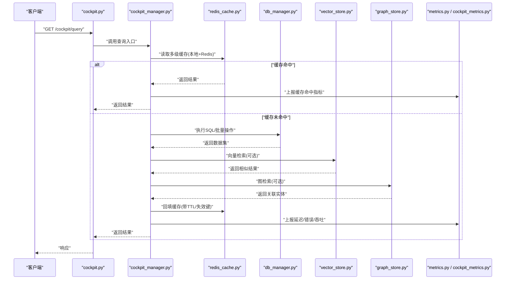

图表来源
- [backend_design/nexus/api/routes/cockpit.py](file://backend_design/nexus/api/routes/cockpit.py)
- [backend_design/nexus/core/cockpit_manager.py](file://backend_design/nexus/core/cockpit_manager.py)
- [backend_design/nexus/middleware/redis_cache.py](file://backend_design/nexus/middleware/redis_cache.py)
- [backend_design/nexus/core/db_manager.py](file://backend_design/nexus/core/db_manager.py)
- [backend_design/nexus/rag/vector_store.py](file://backend_design/nexus/rag/vector_store.py)
- [backend_design/nexus/rag/graph_store.py](file://backend_design/nexus/rag/graph_store.py)
- [backend_design/nexus/observability/metrics.py](file://backend_design/nexus/observability/metrics.py)
- [backend_design/nexus/observability/cockpit_metrics.py](file://backend_design/nexus/observability/cockpit_metrics.py)

## 详细组件分析

### 数据库访问与连接池
- 连接池配置：集中管理最大连接数、最小空闲、超时、重试与回退策略，避免连接风暴
- 事务与批处理：封装事务边界，支持批量插入/更新，降低往返开销
- 执行计划与慢查询：采集执行计划、记录慢查询阈值，辅助索引优化
- 异步IO：在长耗时查询中使用异步上下文，提升并发吞吐

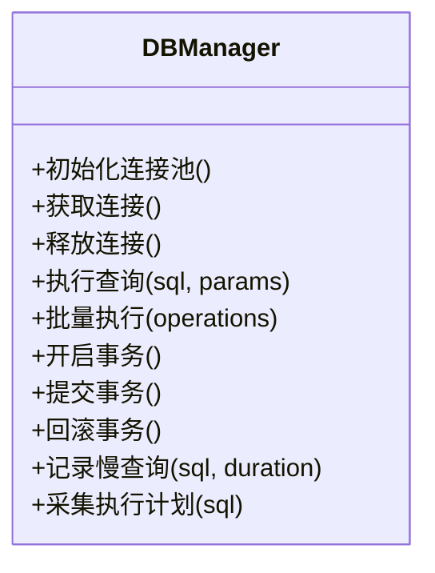

图表来源
- [backend_design/nexus/core/db_manager.py](file://backend_design/nexus/core/db_manager.py)

章节来源
- [backend_design/nexus/core/db_manager.py](file://backend_design/nexus/core/db_manager.py)

### 多级缓存与热点识别
- 多级缓存：进程内 L1 缓存 + Redis L2 缓存，按租户/用户维度隔离
- 热点识别：基于访问频率与时间衰减统计，动态提升 TTL 或预热
- 失效策略：键前缀+版本戳，写后失效；支持软失效与延迟双删
- 一致性：读写分离场景下使用版本号或事件驱动刷新

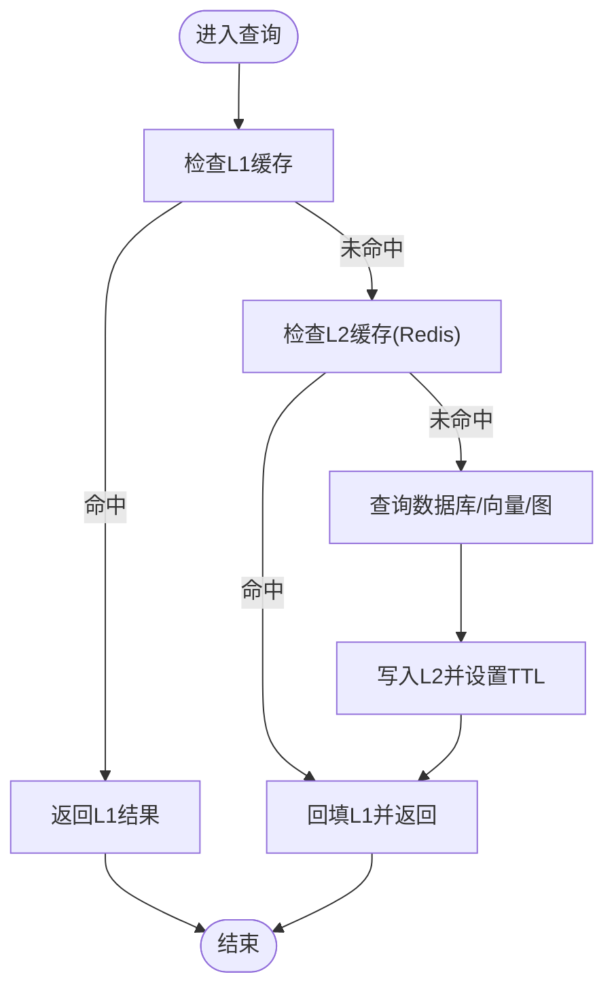

图表来源
- [backend_design/nexus/middleware/redis_cache.py](file://backend_design/nexus/middleware/redis_cache.py)

章节来源
- [backend_design/nexus/middleware/redis_cache.py](file://backend_design/nexus/middleware/redis_cache.py)

### 向量与图检索优化
- 统一接口：通过 vector_store.py 与 graph_store.py 抽象不同后端实现
- 相似度检索：topK、过滤条件、权重排序，减少不必要字段加载
- 图遍历优化：限制深度、剪枝策略、预计算常用子图
- 多后端适配：Zilliz、Aura 等通过工厂类切换

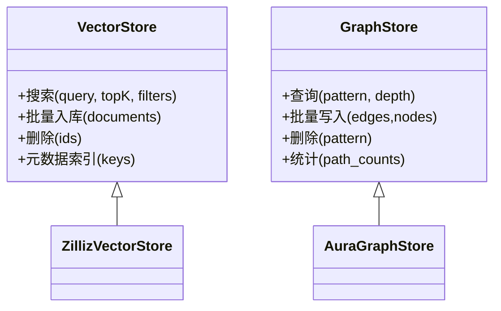

图表来源
- [backend_design/nexus/rag/vector_store.py](file://backend_design/nexus/rag/vector_store.py)
- [backend_design/nexus/rag/graph_store.py](file://backend_design/nexus/rag/graph_store.py)
- [backend_design/nexus/rag/zilliz_vector_store.py](file://backend_design/nexus/rag/zilliz_vector_store.py)
- [backend_design/nexus/rag/aura_graph_store.py](file://backend_design/nexus/rag/aura_graph_store.py)

章节来源
- [backend_design/nexus/rag/vector_store.py](file://backend_design/nexus/rag/vector_store.py)
- [backend_design/nexus/rag/graph_store.py](file://backend_design/nexus/rag/graph_store.py)
- [backend_design/nexus/rag/zilliz_vector_store.py](file://backend_design/nexus/rag/zilliz_vector_store.py)
- [backend_design/nexus/rag/aura_graph_store.py](file://backend_design/nexus/rag/aura_graph_store.py)

### 可观测性与指标
- 指标埋点：QPS、延迟分布、错误率、缓存命中率、慢查询计数
- 数据保留：按策略清理历史指标与日志，控制存储成本
- 链路追踪：Langfuse 集成，端到端追踪关键路径

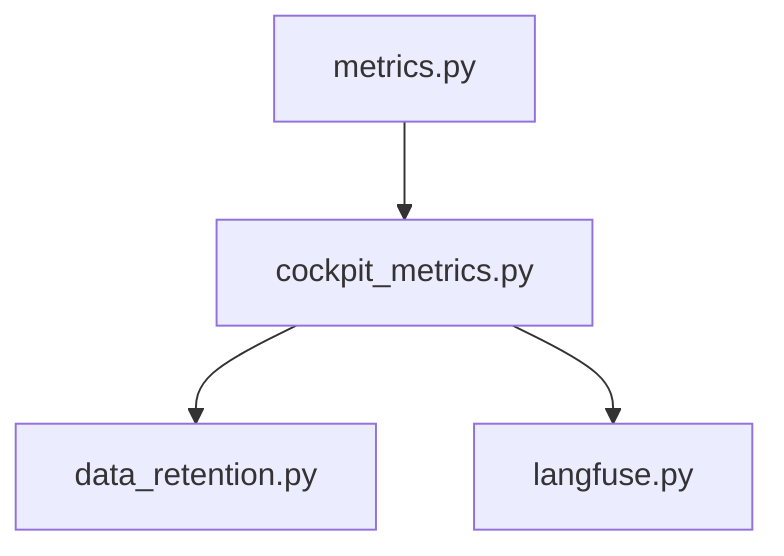

图表来源
- [backend_design/nexus/observability/metrics.py](file://backend_design/nexus/observability/metrics.py)
- [backend_design/nexus/observability/cockpit_metrics.py](file://backend_design/nexus/observability/cockpit_metrics.py)
- [backend_design/nexus/observability/data_retention.py](file://backend_design/nexus/observability/data_retention.py)
- [backend_design/nexus/observability/langfuse.py](file://backend_design/nexus/observability/langfuse.py)

章节来源
- [backend_design/nexus/observability/metrics.py](file://backend_design/nexus/observability/metrics.py)
- [backend_design/nexus/observability/cockpit_metrics.py](file://backend_design/nexus/observability/cockpit_metrics.py)
- [backend_design/nexus/observability/data_retention.py](file://backend_design/nexus/observability/data_retention.py)
- [backend_design/nexus/observability/langfuse.py](file://backend_design/nexus/observability/langfuse.py)

### 中间件与编排
- 限流：令牌桶/滑动窗口，保护下游资源
- 任务队列：异步批量写入、离线聚合
- 会话存储：状态持久化与过期清理
- 编排器：orchestrator 协调技能与意图路由，组合数据源

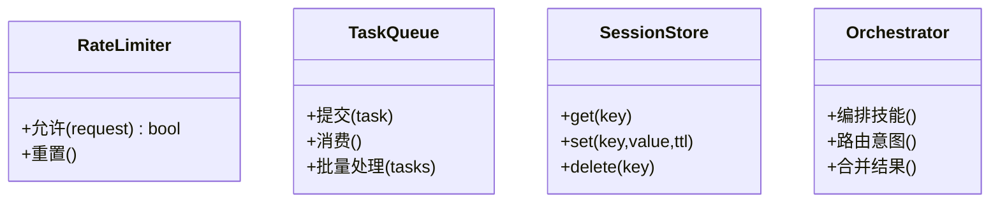

图表来源
- [backend_design/nexus/middleware/rate_limiter.py](file://backend_design/nexus/middleware/rate_limiter.py)
- [backend_design/nexus/middleware/task_queue.py](file://backend_design/nexus/middleware/task_queue.py)
- [backend_design/nexus/middleware/session_store.py](file://backend_design/nexus/middleware/session_store.py)
- [backend_design/nexus/skills/orchestrator.py](file://backend_design/nexus/skills/orchestrator.py)
- [backend_design/nexus/intent/router.py](file://backend_design/nexus/intent/router.py)

章节来源
- [backend_design/nexus/middleware/rate_limiter.py](file://backend_design/nexus/middleware/rate_limiter.py)
- [backend_design/nexus/middleware/task_queue.py](file://backend_design/nexus/middleware/task_queue.py)
- [backend_design/nexus/middleware/session_store.py](file://backend_design/nexus/middleware/session_store.py)
- [backend_design/nexus/skills/orchestrator.py](file://backend_design/nexus/skills/orchestrator.py)
- [backend_design/nexus/intent/router.py](file://backend_design/nexus/intent/router.py)

### 领域服务与上下文
- CockpitManager：数据访问编排中心，统一缓存、DB、向量/图、指标
- 个性化与认证：按用户/租户维度进行权限校验与偏好注入
- 租户上下文：跨请求传递租户标识，影响缓存键与数据隔离

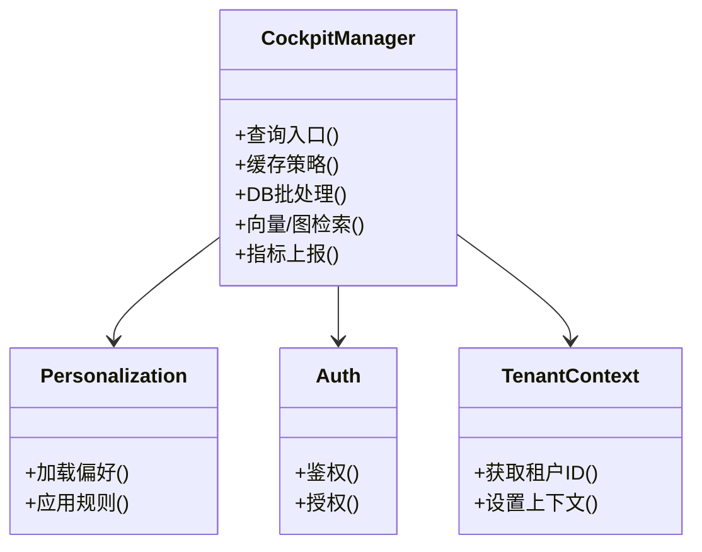

图表来源
- [backend_design/nexus/core/cockpit_manager.py](file://backend_design/nexus/core/cockpit_manager.py)
- [backend_design/nexus/core/personalization.py](file://backend_design/nexus/core/personalization.py)
- [backend_design/nexus/core/auth.py](file://backend_design/nexus/core/auth.py)
- [backend_design/nexus/core/tenant_context.py](file://backend_design/nexus/core/tenant_context.py)

章节来源
- [backend_design/nexus/core/cockpit_manager.py](file://backend_design/nexus/core/cockpit_manager.py)
- [backend_design/nexus/core/personalization.py](file://backend_design/nexus/core/personalization.py)
- [backend_design/nexus/core/auth.py](file://backend_design/nexus/core/auth.py)
- [backend_design/nexus/core/tenant_context.py](file://backend_design/nexus/core/tenant_context.py)

### 模型与Schema
- Cockpit 模型：定义数据结构与约束
- 状态与Schema：用于序列化/反序列化与校验

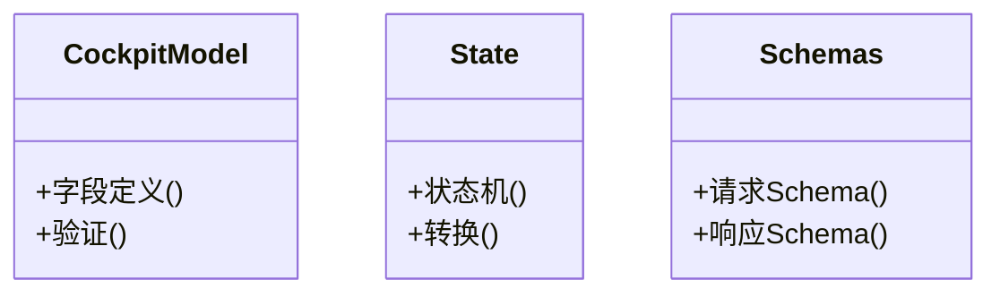

图表来源
- [backend_design/nexus/models/cockpit.py](file://backend_design/nexus/models/cockpit.py)
- [backend_design/nexus/models/state.py](file://backend_design/nexus/models/state.py)
- [backend_design/nexus/models/schemas.py](file://backend_design/nexus/models/schemas.py)

章节来源
- [backend_design/nexus/models/cockpit.py](file://backend_design/nexus/models/cockpit.py)
- [backend_design/nexus/models/state.py](file://backend_design/nexus/models/state.py)
- [backend_design/nexus/models/schemas.py](file://backend_design/nexus/models/schemas.py)

### RAG 检索增强
- Embedding：文本向量化
- Retriever：召回策略与过滤
- Reranker：重排提升相关性
- UnifiedRetriever：统一入口，组合多路召回

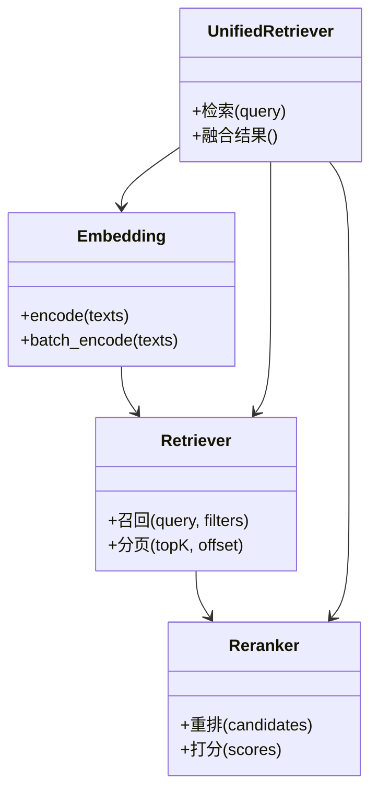

图表来源
- [backend_design/nexus/rag/embedding.py](file://backend_design/nexus/rag/embedding.py)
- [backend_design/nexus/rag/retriever.py](file://backend_design/nexus/rag/retriever.py)
- [backend_design/nexus/rag/reranker.py](file://backend_design/nexus/rag/reranker.py)
- [backend_design/nexus/rag/unified_retriever.py](file://backend_design/nexus/rag/unified_retriever.py)

章节来源
- [backend_design/nexus/rag/embedding.py](file://backend_design/nexus/rag/embedding.py)
- [backend_design/nexus/rag/retriever.py](file://backend_design/nexus/rag/retriever.py)
- [backend_design/nexus/rag/reranker.py](file://backend_design/nexus/rag/reranker.py)
- [backend_design/nexus/rag/unified_retriever.py](file://backend_design/nexus/rag/unified_retriever.py)

## 依赖关系分析
- 低耦合高内聚：API 仅依赖 CockpitManager，后者再按需调用 DB、缓存、向量/图
- 外部依赖：Redis、向量库、图数据库、对象存储（如需要）
- 潜在循环依赖：通过接口抽象与工厂类解耦，避免直接导入实现

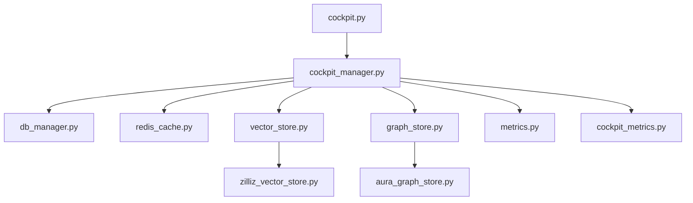

图表来源
- [backend_design/nexus/api/routes/cockpit.py](file://backend_design/nexus/api/routes/cockpit.py)
- [backend_design/nexus/core/cockpit_manager.py](file://backend_design/nexus/core/cockpit_manager.py)
- [backend_design/nexus/core/db_manager.py](file://backend_design/nexus/core/db_manager.py)
- [backend_design/nexus/middleware/redis_cache.py](file://backend_design/nexus/middleware/redis_cache.py)
- [backend_design/nexus/rag/vector_store.py](file://backend_design/nexus/rag/vector_store.py)
- [backend_design/nexus/rag/graph_store.py](file://backend_design/nexus/rag/graph_store.py)
- [backend_design/nexus/rag/zilliz_vector_store.py](file://backend_design/nexus/rag/zilliz_vector_store.py)
- [backend_design/nexus/rag/aura_graph_store.py](file://backend_design/nexus/rag/aura_graph_store.py)
- [backend_design/nexus/observability/metrics.py](file://backend_design/nexus/observability/metrics.py)
- [backend_design/nexus/observability/cockpit_metrics.py](file://backend_design/nexus/observability/cockpit_metrics.py)

章节来源
- [backend_design/nexus/api/routes/cockpit.py](file://backend_design/nexus/api/routes/cockpit.py)
- [backend_design/nexus/core/cockpit_manager.py](file://backend_design/nexus/core/cockpit_manager.py)
- [backend_design/nexus/core/db_manager.py](file://backend_design/nexus/core/db_manager.py)
- [backend_design/nexus/middleware/redis_cache.py](file://backend_design/nexus/middleware/redis_cache.py)
- [backend_design/nexus/rag/vector_store.py](file://backend_design/nexus/rag/vector_store.py)
- [backend_design/nexus/rag/graph_store.py](file://backend_design/nexus/rag/graph_store.py)
- [backend_design/nexus/rag/zilliz_vector_store.py](file://backend_design/nexus/rag/zilliz_vector_store.py)
- [backend_design/nexus/rag/aura_graph_store.py](file://backend_design/nexus/rag/aura_graph_store.py)
- [backend_design/nexus/observability/metrics.py](file://backend_design/nexus/observability/metrics.py)
- [backend_design/nexus/observability/cockpit_metrics.py](file://backend_design/nexus/observability/cockpit_metrics.py)

## 性能考量
- 连接池调优：根据 QPS 与平均延迟估算最大连接数，预留余量；合理设置最小空闲与超时
- 查询优化：优先走缓存；对热点 SQL 建立覆盖索引；避免 SELECT *；使用 EXPLAIN 分析执行计划
- 批量操作：合并小事务为批量写入；使用 UPSERT 减少冲突
- 异步IO：长耗时查询与外部调用使用异步；注意背压与限流
- 多级缓存：热点数据 TTL 自适应；写后失效与延迟双删；键空间隔离
- 向量/图检索：限制 topK 与深度；预计算常用子图；重排阶段只加载必要字段
- 分页与流式：游标分页优于偏移分页；大结果集使用流式迭代
- 分库分表：按租户/时间维度拆分；路由键选择需考虑热点与倾斜
- 监控与告警：QPS、P95/P99 延迟、错误率、缓存命中率、慢查询计数、连接池等待时长
- 熔断与降级：circuit_breaker 保护下游；失败快速返回默认值或缓存兜底

[本节为通用指导，不直接分析具体文件]

## 故障排查指南
- 慢查询定位：查看慢查询日志与执行计划，确认缺失索引或全表扫描
- 缓存问题：检查键前缀与版本戳；观察命中率与过期行为；确认写后失效是否生效
- 连接泄漏：监控连接池使用率与等待队列；排查未释放连接的异常路径
- 向量/图检索超时：调整 topK、深度与过滤条件；增加重试与熔断
- 指标异常：核对埋点位置与标签维度；确认数据保留策略是否导致采样丢失
- 日志与链路：结合 logger 与 Langfuse 链路，定位端到端瓶颈

章节来源
- [backend_design/nexus/core/logger.py](file://backend_design/nexus/core/logger.py)
- [backend_design/nexus/observability/langfuse.py](file://backend_design/nexus/observability/langfuse.py)
- [backend_design/nexus/core/circuit_breaker.py](file://backend_design/nexus/core/circuit_breaker.py)

## 结论
通过连接池精细化配置、多级缓存与热点识别、SQL 与向量/图检索优化、批量与异步 IO、分页与流式处理、分库分表策略以及完善的监控与熔断机制，NexusCockpit 可在高并发与大数据量场景下保持稳定与高效。建议持续跟踪关键指标，结合执行计划与链路追踪进行闭环优化。

[本节为总结，不直接分析具体文件]

## 附录

### 代码示例路径（不含具体代码内容）
- 连接池与事务封装：[db_manager.py](file://backend_design/nexus/core/db_manager.py)
- 多级缓存与失效策略：[redis_cache.py](file://backend_design/nexus/middleware/redis_cache.py)
- 向量检索统一接口：[vector_store.py](file://backend_design/nexus/rag/vector_store.py)
- 图检索统一接口：[graph_store.py](file://backend_design/nexus/rag/graph_store.py)
- 指标埋点与数据保留：[metrics.py](file://backend_design/nexus/observability/metrics.py)、[cockpit_metrics.py](file://backend_design/nexus/observability/cockpit_metrics.py)、[data_retention.py](file://backend_design/nexus/observability/data_retention.py)
- 熔断与降级：[circuit_breaker.py](file://backend_design/nexus/core/circuit_breaker.py)
- 限流与任务队列：[rate_limiter.py](file://backend_design/nexus/middleware/rate_limiter.py)、[task_queue.py](file://backend_design/nexus/middleware/task_queue.py)
- 会话存储：[session_store.py](file://backend_design/nexus/middleware/session_store.py)
- 领域编排与上下文：[cockpit_manager.py](file://backend_design/nexus/core/cockpit_manager.py)、[personalization.py](file://backend_design/nexus/core/personalization.py)、[auth.py](file://backend_design/nexus/core/auth.py)、[tenant_context.py](file://backend_design/nexus/core/tenant_context.py)
- RAG 检索增强：[embedding.py](file://backend_design/nexus/rag/embedding.py)、[retriever.py](file://backend_design/nexus/rag/retriever.py)、[reranker.py](file://backend_design/nexus/rag/reranker.py)、[unified_retriever.py](file://backend_design/nexus/rag/unified_retriever.py)
- 后端实现：[zilliz_vector_store.py](file://backend_design/nexus/rag/zilliz_vector_store.py)、[aura_graph_store.py](file://backend_design/nexus/rag/aura_graph_store.py)

### 性能测试方法
- 基准测试：使用压测工具模拟峰值 QPS，测量 P95/P99 延迟与错误率
- 缓存命中率测试：构造热点键集合，验证 L1/L2 命中率与失效行为
- 慢查询回归：定期运行 EXPLAIN 对比执行计划变化
- 向量/图检索压力：评估 topK 与深度对延迟的影响，确定最优参数
- 批量写入吞吐：对比单条与批量写入的 TPS 与 CPU/IO 占用
- 熔断与降级演练：模拟下游故障，验证快速失败与兜底策略

[本节为方法论说明，不直接分析具体文件]