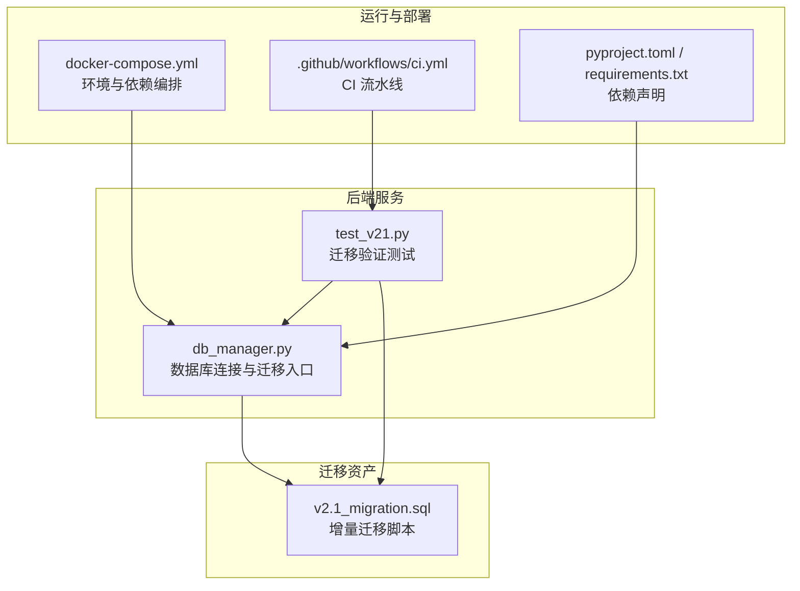
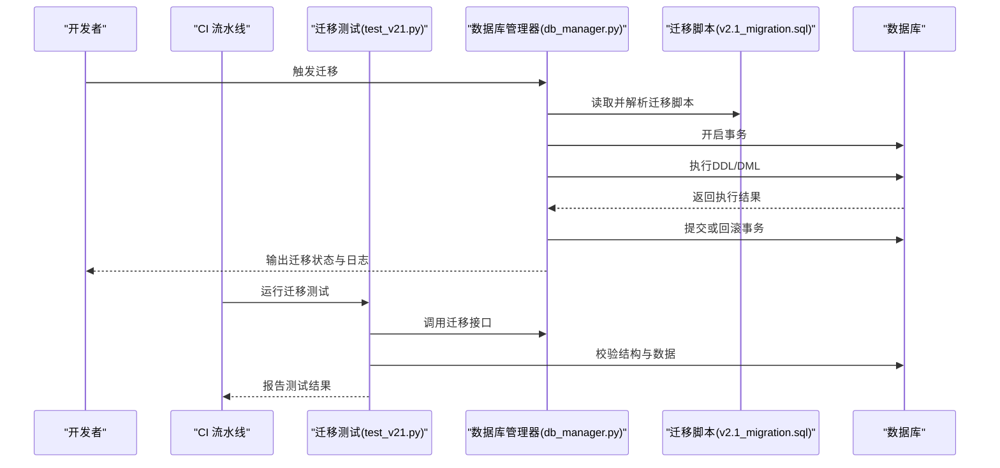
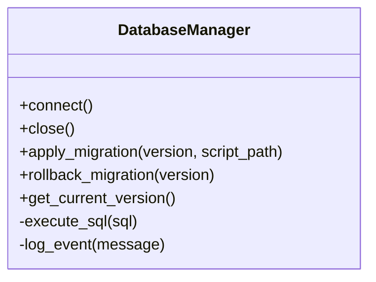
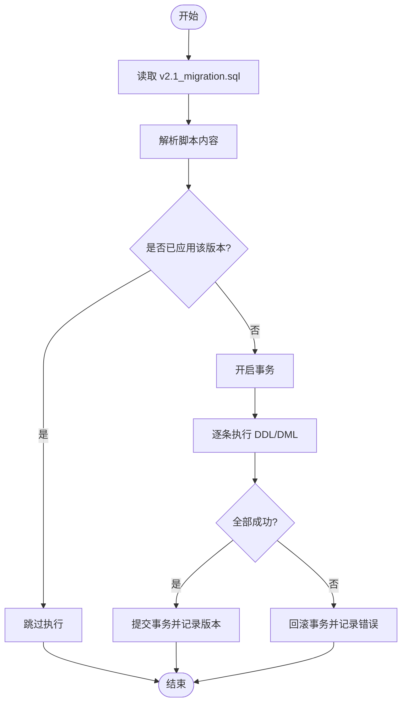
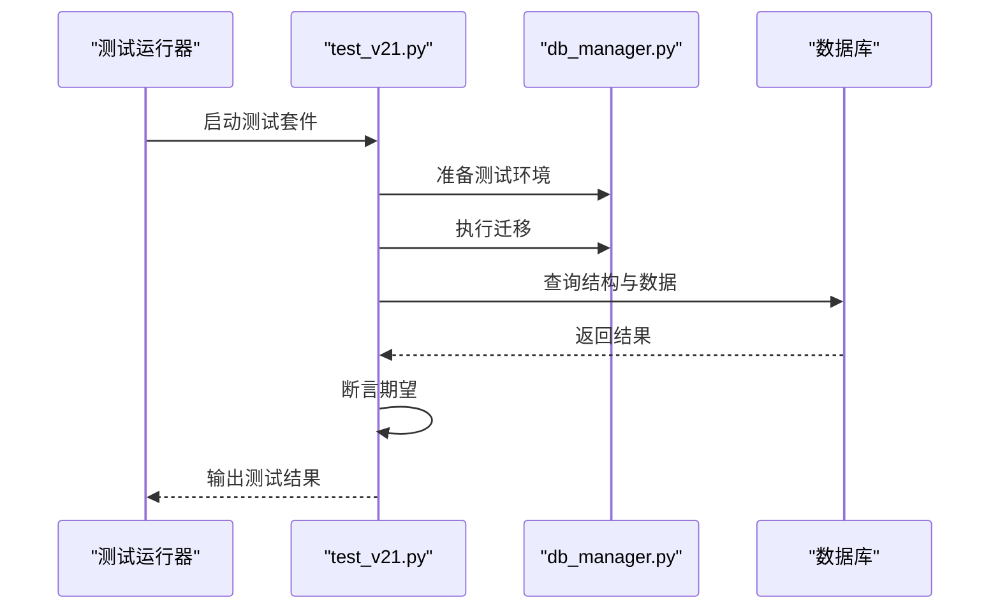
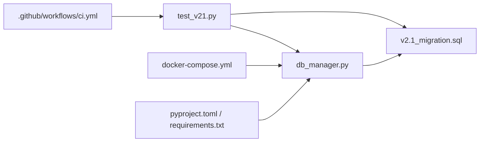

# 数据迁移与版本管理

<cite>
**本文引用的文件**   
- [backend_design/nexus/core/db_manager.py](file://backend_design/nexus/core/db_manager.py)
- [backend_design/scripts/v2.1_migration.sql](file://backend_design/scripts/v2.1_migration.sql)
- [backend_design/tests/test_v21.py](file://backend_design/tests/test_v21.py)
- [backend_design/pyproject.toml](file://backend_design/pyproject.toml)
- [backend_design/requirements.txt](file://backend_design/requirements.txt)
- [docker-compose.yml](file://docker-compose.yml)
- [.github/workflows/ci.yml](file://.github/workflows/ci.yml)
</cite>

## 目录
1. [简介](#简介)
2. [项目结构](#项目结构)
3. [核心组件](#核心组件)
4. [架构总览](#架构总览)
5. [详细组件分析](#详细组件分析)
6. [依赖分析](#依赖分析)
7. [性能考虑](#性能考虑)
8. [故障排查指南](#故障排查指南)
9. [结论](#结论)
10. [附录](#附录)

## 简介
本文件面向后端数据库的数据迁移与版本管理，聚焦以下目标：
- 明确数据库版本控制策略与迁移脚本编写规范
- 解释增量迁移与回滚机制的实现原理
- 描述迁移执行流程与错误处理策略
- 提供多环境迁移管理与自动化部署方法
- 说明数据兼容性检查与验证测试方法
- 解释迁移过程中的锁机制与并发控制
- 给出迁移失败的回滚方案与修复策略

## 项目结构
与数据迁移相关的代码与配置主要分布在以下位置：
- 数据库连接与迁移入口：backend_design/nexus/core/db_manager.py
- 迁移脚本（SQL）：backend_design/scripts/v2.1_migration.sql
- 迁移相关测试：backend_design/tests/test_v21.py
- 依赖与工具声明：backend_design/pyproject.toml、backend_design/requirements.txt
- 容器编排与环境定义：docker-compose.yml
- CI 流水线：.github/workflows/ci.yml

图表来源
- [backend_design/nexus/core/db_manager.py](file://backend_design/nexus/core/db_manager.py)
- [backend_design/scripts/v2.1_migration.sql](file://backend_design/scripts/v2.1_migration.sql)
- [backend_design/tests/test_v21.py](file://backend_design/tests/test_v21.py)
- [docker-compose.yml](file://docker-compose.yml)
- [.github/workflows/ci.yml](file://.github/workflows/ci.yml)
- [backend_design/pyproject.toml](file://backend_design/pyproject.toml)
- [backend_design/requirements.txt](file://backend_design/requirements.txt)

章节来源
- [backend_design/nexus/core/db_manager.py](file://backend_design/nexus/core/db_manager.py)
- [backend_design/scripts/v2.1_migration.sql](file://backend_design/scripts/v2.1_migration.sql)
- [backend_design/tests/test_v21.py](file://backend_design/tests/test_v21.py)
- [docker-compose.yml](file://docker-compose.yml)
- [.github/workflows/ci.yml](file://.github/workflows/ci.yml)
- [backend_design/pyproject.toml](file://backend_design/pyproject.toml)
- [backend_design/requirements.txt](file://backend_design/requirements.txt)

## 核心组件
- 数据库管理器（db_manager.py）
  - 负责数据库连接生命周期管理、事务边界控制、迁移脚本加载与执行、错误捕获与日志记录。
  - 作为迁移的单一入口，对外暴露“应用迁移”“校验状态”等能力。
- 迁移脚本（v2.1_migration.sql）
  - 以增量方式描述数据结构变更，包含建表、字段增删改、索引与约束调整等。
  - 建议幂等设计，避免重复执行导致异常。
- 迁移测试（test_v21.py）
  - 在测试环境中对迁移前后数据进行一致性校验、兼容性断言与回归保障。
- 依赖与构建（pyproject.toml、requirements.txt）
  - 声明数据库驱动、迁移工具链与运行时依赖，确保可重现构建。
- 编排与部署（docker-compose.yml）
  - 定义数据库与服务实例，支持本地与集成环境的快速拉起。
- CI 流水线（ci.yml）
  - 在流水线中执行迁移测试与基础验证，保证每次提交的可迁移性。

章节来源
- [backend_design/nexus/core/db_manager.py](file://backend_design/nexus/core/db_manager.py)
- [backend_design/scripts/v2.1_migration.sql](file://backend_design/scripts/v2.1_migration.sql)
- [backend_design/tests/test_v21.py](file://backend_design/tests/test_v21.py)
- [backend_design/pyproject.toml](file://backend_design/pyproject.toml)
- [backend_design/requirements.txt](file://backend_design/requirements.txt)
- [docker-compose.yml](file://docker-compose.yml)
- [.github/workflows/ci.yml](file://.github/workflows/ci.yml)

## 架构总览
下图展示了从代码到数据库的迁移执行路径，以及测试与 CI 的协同关系。

图表来源
- [backend_design/nexus/core/db_manager.py](file://backend_design/nexus/core/db_manager.py)
- [backend_design/scripts/v2.1_migration.sql](file://backend_design/scripts/v2.1_migration.sql)
- [backend_design/tests/test_v21.py](file://backend_design/tests/test_v21.py)
- [.github/workflows/ci.yml](file://.github/workflows/ci.yml)

## 详细组件分析

### 数据库管理器（db_manager.py）
职责与要点：
- 连接管理：封装数据库连接池、重试与超时策略。
- 事务控制：为迁移操作提供原子性保障，失败自动回滚。
- 迁移执行：按版本顺序加载并执行 SQL 脚本，记录版本元信息。
- 错误处理：捕获并分类异常，记录上下文以便定位问题。
- 并发控制：通过排他锁或唯一版本号约束防止并行迁移冲突。

图表来源
- [backend_design/nexus/core/db_manager.py](file://backend_design/nexus/core/db_manager.py)

章节来源
- [backend_design/nexus/core/db_manager.py](file://backend_design/nexus/core/db_manager.py)

### 迁移脚本（v2.1_migration.sql）
编写规范与建议：
- 幂等性：使用条件判断或 IF NOT EXISTS 等机制，避免重复执行报错。
- 增量式：每个脚本仅描述一次变更，保持小步快跑与可追溯。
- 命名约定：采用“主版本_次版本_修订号_描述.sql”，便于排序与识别。
- 事务包裹：尽量将多条语句置于同一事务，保证一致性与回滚能力。
- 兼容策略：新增字段默认值、保留旧字段过渡期、灰度切换逻辑。

图表来源
- [backend_design/scripts/v2.1_migration.sql](file://backend_design/scripts/v2.1_migration.sql)
- [backend_design/nexus/core/db_manager.py](file://backend_design/nexus/core/db_manager.py)

章节来源
- [backend_design/scripts/v2.1_migration.sql](file://backend_design/scripts/v2.1_migration.sql)

### 迁移测试（test_v21.py）
测试范围与方法：
- 结构校验：验证表、列、索引、约束是否符合预期。
- 数据兼容：检查历史数据在新结构下的可读性与完整性。
- 幂等验证：多次执行迁移不应改变最终状态。
- 回滚验证：模拟失败场景，确认回滚后状态一致。

图表来源
- [backend_design/tests/test_v21.py](file://backend_design/tests/test_v21.py)
- [backend_design/nexus/core/db_manager.py](file://backend_design/nexus/core/db_manager.py)

章节来源
- [backend_design/tests/test_v21.py](file://backend_design/tests/test_v21.py)

### 依赖与构建（pyproject.toml、requirements.txt）
- 依赖声明：列出数据库驱动、迁移工具与测试框架。
- 可重现构建：固定版本，避免环境差异导致的迁移失败。
- 安装指引：在容器镜像或 CI 环境中统一安装依赖。

章节来源
- [backend_design/pyproject.toml](file://backend_design/pyproject.toml)
- [backend_design/requirements.txt](file://backend_design/requirements.txt)

### 编排与部署（docker-compose.yml）
- 环境定义：数据库、缓存、消息队列等服务一键拉起。
- 环境变量：注入数据库连接参数与迁移开关。
- 健康检查：确保依赖服务就绪后再执行迁移。

章节来源
- [docker-compose.yml](file://docker-compose.yml)

### CI 流水线（.github/workflows/ci.yml）
- 任务编排：拉取代码、安装依赖、构建镜像、运行测试。
- 迁移验证：在隔离数据库中执行迁移与兼容性测试。
- 质量门禁：失败即阻断合并，保证主干稳定。

章节来源
- [.github/workflows/ci.yml](file://.github/workflows/ci.yml)

## 依赖分析
迁移子系统的关键依赖关系如下：

图表来源
- [backend_design/nexus/core/db_manager.py](file://backend_design/nexus/core/db_manager.py)
- [backend_design/scripts/v2.1_migration.sql](file://backend_design/scripts/v2.1_migration.sql)
- [backend_design/tests/test_v21.py](file://backend_design/tests/test_v21.py)
- [docker-compose.yml](file://docker-compose.yml)
- [.github/workflows/ci.yml](file://.github/workflows/ci.yml)
- [backend_design/pyproject.toml](file://backend_design/pyproject.toml)
- [backend_design/requirements.txt](file://backend_design/requirements.txt)

章节来源
- [backend_design/nexus/core/db_manager.py](file://backend_design/nexus/core/db_manager.py)
- [backend_design/scripts/v2.1_migration.sql](file://backend_design/scripts/v2.1_migration.sql)
- [backend_design/tests/test_v21.py](file://backend_design/tests/test_v21.py)
- [docker-compose.yml](file://docker-compose.yml)
- [.github/workflows/ci.yml](file://.github/workflows/ci.yml)
- [backend_design/pyproject.toml](file://backend_design/pyproject.toml)
- [backend_design/requirements.txt](file://backend_design/requirements.txt)

## 性能考虑
- 大表变更：优先采用在线 DDL 或分阶段变更，降低锁等待与复制延迟。
- 批量操作：分批写入与更新，避免长事务与大事务。
- 索引优化：先创建新索引再删除旧索引，减少重建开销。
- 监控指标：关注慢查询、锁等待、复制滞后与磁盘 I/O。

[本节为通用指导，不直接分析具体文件]

## 故障排查指南
常见问题与定位步骤：
- 迁移失败
  - 查看数据库错误码与堆栈，定位具体语句。
  - 检查事务是否回滚，版本元数据是否一致。
- 并发冲突
  - 确认是否存在排他锁或唯一版本约束。
  - 避免多实例同时执行迁移。
- 数据不一致
  - 对比迁移前后关键指标（行数、空值率、外键约束）。
  - 使用测试用例进行回归验证。
- 回滚策略
  - 基于事务的自动回滚；对于不可逆变更，准备反向脚本。
  - 在低峰窗口执行回滚，并通知相关方。

章节来源
- [backend_design/nexus/core/db_manager.py](file://backend_design/nexus/core/db_manager.py)
- [backend_design/tests/test_v21.py](file://backend_design/tests/test_v21.py)

## 结论
通过统一的数据库管理器、幂等的增量迁移脚本、完善的测试与 CI 流水线，本项目实现了安全可控的数据迁移与版本管理。建议在后续迭代中持续完善：
- 引入更细粒度的版本元数据与审计日志
- 增加灰度发布与特性开关，提升兼容性
- 强化性能与稳定性监控，建立告警与自愈机制

[本节为总结性内容，不直接分析具体文件]

## 附录

### 版本控制策略
- 语义化版本：主版本（破坏性变更）、次版本（向后兼容功能）、修订号（缺陷修复）。
- 迁移顺序：严格递增，禁止覆盖或重放历史版本。
- 元数据表：记录已应用版本、时间戳、执行人与备注。

### 迁移脚本编写规范
- 幂等与可重入：避免重复执行报错。
- 事务包裹：整批变更在同一事务内。
- 注释清晰：标注变更原因、影响范围与回滚方式。
- 兼容性：新增字段设置合理默认值，保留旧字段过渡期。

### 增量迁移与回滚机制
- 增量：每次只描述最小必要变更。
- 回滚：基于事务自动回滚；不可逆变更需准备反向脚本并在低峰执行。

### 执行流程与错误处理
- 加载脚本 -> 解析 -> 检查版本 -> 开启事务 -> 执行 -> 提交/回滚 -> 记录状态。
- 错误分类：语法错误、约束冲突、锁等待、权限不足等，分别采取重试、人工介入或回滚。

### 多环境管理与自动化部署
- 环境隔离：开发、测试、预生产、生产独立数据库实例。
- 配置注入：通过环境变量或配置中心注入连接参数。
- CI/CD：在流水线中执行迁移测试与冒烟验证，通过后进入部署。

### 数据兼容性检查与验证测试
- 结构断言：表、列、索引、约束存在性与类型正确。
- 数据断言：非空约束、外键约束、统计指标符合预期。
- 幂等断言：重复执行不改变最终状态。

### 锁机制与并发控制
- 排他锁：DDL 通常加排他锁，避免并发写。
- 唯一版本：通过唯一约束或分布式锁防止并行迁移。
- 长事务规避：拆分大事务，降低锁持有时间。

### 迁移失败的回滚方案与修复策略
- 自动回滚：事务失败立即回滚，恢复至迁移前状态。
- 手动修复：修正脚本后重新执行，注意幂等与审计。
- 灰度回退：结合特性开关逐步回退，降低风险。