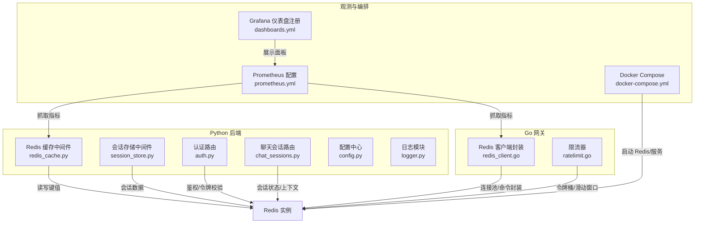
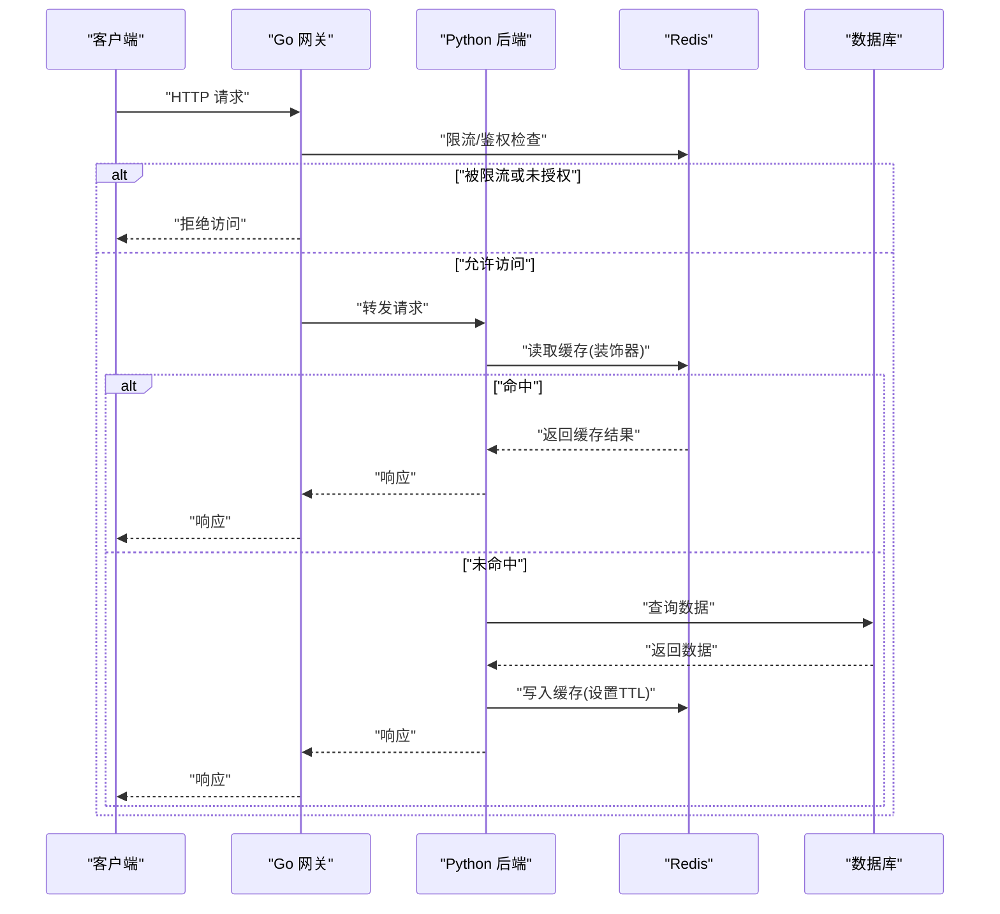
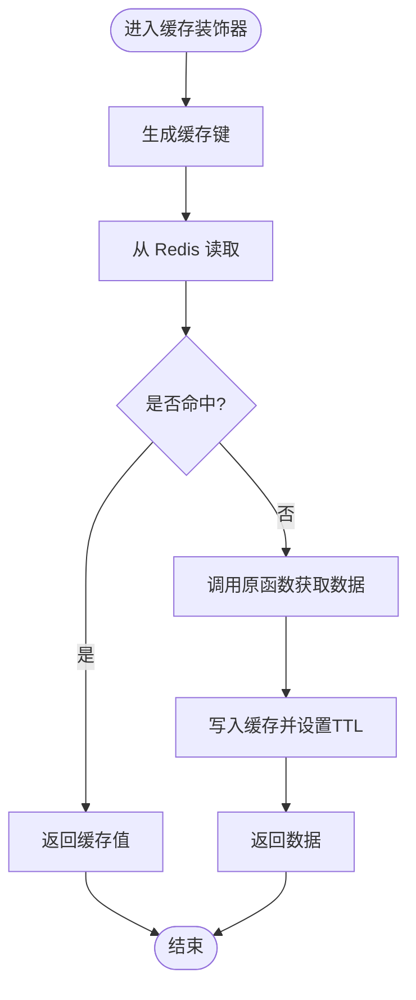
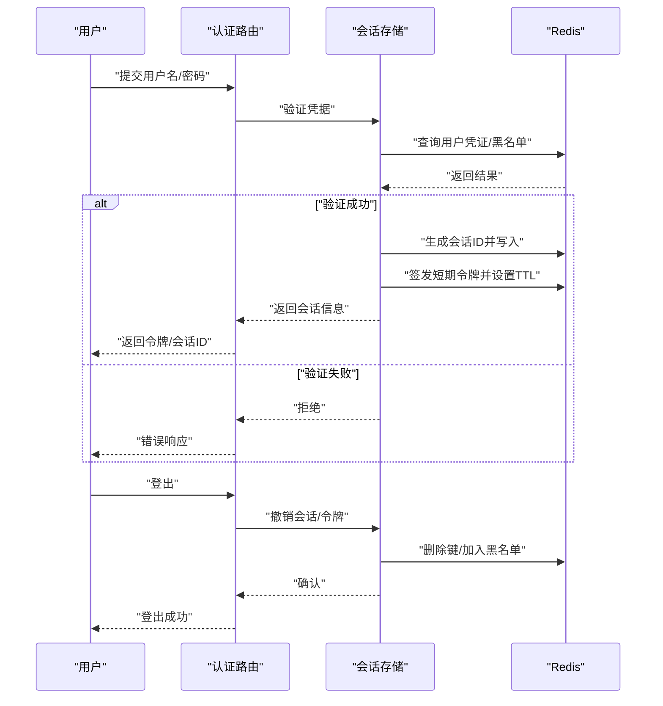
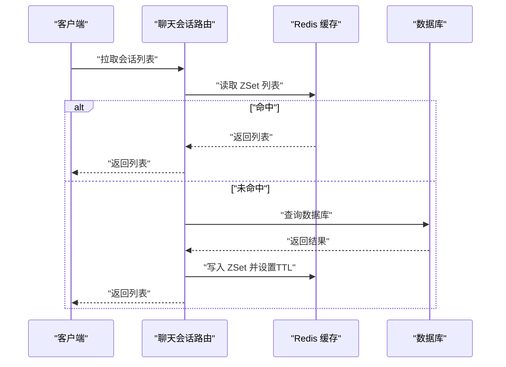
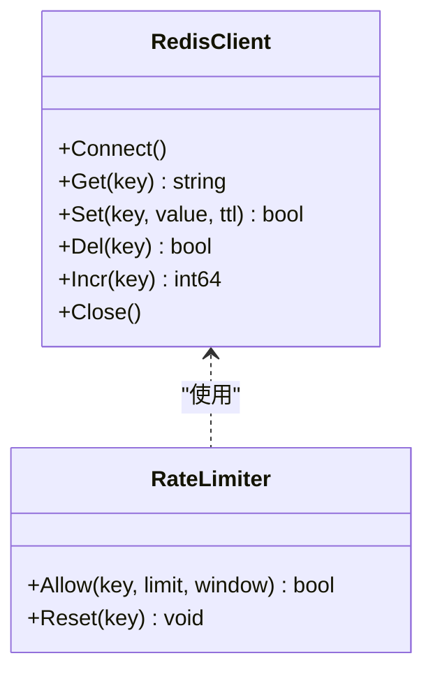
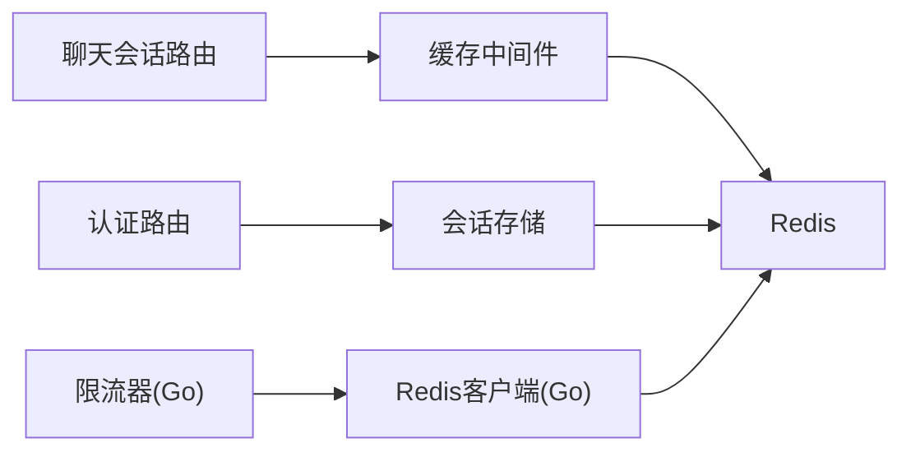

# 缓存系统设计

<cite>
**本文引用的文件**   
- [backend_design/nexus/middleware/redis_cache.py](file://backend_design/nexus/middleware/redis_cache.py)
- [backend_design/nexus/middleware/session_store.py](file://backend_design/nexus/middleware/session_store.py)
- [backend_design/nexus/config.py](file://backend_design/nexus/config.py)
- [backend_design/nexus/core/logger.py](file://backend_design/nexus/core/logger.py)
- [backend_design/nexus/api/routes/auth.py](file://backend_design/nexus/api/routes/auth.py)
- [backend_design/nexus/api/routes/chat_sessions.py](file://backend_design/nexus/api/routes/chat_sessions.py)
- [backend_design/nexus_gate/internal/handlers/redis_client.go](file://backend_design/nexus_gate/internal/handlers/redis_client.go)
- [backend_design/nexus_gate/internal/ratelimit/ratelimit.go](file://backend_design/nexus_gate/internal/ratelimit/ratelimit.go)
- [config/prometheus/prometheus.yml](file://config/prometheus/prometheus.yml)
- [config/grafana/provisioning/dashboards/dashboards.yml](file://config/grafana/provisioning/dashboards/dashboards.yml)
- [docker-compose.yml](file://docker-compose.yml)
</cite>

## 目录
1. [引言](#引言)
2. [项目结构](#项目结构)
3. [核心组件](#核心组件)
4. [架构总览](#架构总览)
5. [详细组件分析](#详细组件分析)
6. [依赖关系分析](#依赖关系分析)
7. [性能考量](#性能考量)
8. [故障排查指南](#故障排查指南)
9. [结论](#结论)
10. [附录](#附录)

## 引言
本技术文档围绕 Redis 缓存系统的设计与实现，覆盖架构设计、数据结构选择、会话存储机制与过期策略、缓存预热/更新/失效流程、穿透/雪崩/击穿防护、分布式一致性同步、监控指标与优化策略，以及集群部署与故障转移方案。文档基于仓库中后端 Python 服务与网关 Go 服务的实际代码进行梳理，并结合配置与编排文件给出可落地的工程化建议。

## 项目结构
本项目在 Python 后端与 Go 网关两侧均使用 Redis：
- Python 后端通过中间件提供通用缓存能力与会话存储能力，并在路由层按需使用。
- Go 网关侧提供 Redis 客户端封装与限流等能力。
- Prometheus/Grafana 配置用于采集与可视化监控指标。
- docker-compose 用于本地或测试环境一键拉起 Redis 等基础设施。

图表来源
- [backend_design/nexus/middleware/redis_cache.py](file://backend_design/nexus/middleware/redis_cache.py)
- [backend_design/nexus/middleware/session_store.py](file://backend_design/nexus/middleware/session_store.py)
- [backend_design/nexus/api/routes/auth.py](file://backend_design/nexus/api/routes/auth.py)
- [backend_design/nexus/api/routes/chat_sessions.py](file://backend_design/nexus/api/routes/chat_sessions.py)
- [backend_design/nexus/config.py](file://backend_design/nexus/config.py)
- [backend_design/nexus/core/logger.py](file://backend_design/nexus/core/logger.py)
- [backend_design/nexus_gate/internal/handlers/redis_client.go](file://backend_design/nexus_gate/internal/handlers/redis_client.go)
- [backend_design/nexus_gate/internal/ratelimit/ratelimit.go](file://backend_design/nexus_gate/internal/ratelimit/ratelimit.go)
- [config/prometheus/prometheus.yml](file://config/prometheus/prometheus.yml)
- [config/grafana/provisioning/dashboards/dashboards.yml](file://config/grafana/provisioning/dashboards/dashboards.yml)
- [docker-compose.yml](file://docker-compose.yml)

章节来源
- [backend_design/nexus/middleware/redis_cache.py](file://backend_design/nexus/middleware/redis_cache.py)
- [backend_design/nexus/middleware/session_store.py](file://backend_design/nexus/middleware/session_store.py)
- [backend_design/nexus/config.py](file://backend_design/nexus/config.py)
- [backend_design/nexus/core/logger.py](file://backend_design/nexus/core/logger.py)
- [backend_design/nexus/api/routes/auth.py](file://backend_design/nexus/api/routes/auth.py)
- [backend_design/nexus/api/routes/chat_sessions.py](file://backend_design/nexus/api/routes/chat_sessions.py)
- [backend_design/nexus_gate/internal/handlers/redis_client.go](file://backend_design/nexus_gate/internal/handlers/redis_client.go)
- [backend_design/nexus_gate/internal/ratelimit/ratelimit.go](file://backend_design/nexus_gate/internal/ratelimit/ratelimit.go)
- [config/prometheus/prometheus.yml](file://config/prometheus/prometheus.yml)
- [config/grafana/provisioning/dashboards/dashboards.yml](file://config/grafana/provisioning/dashboards/dashboards.yml)
- [docker-compose.yml](file://docker-compose.yml)

## 核心组件
- Redis 缓存中间件（Python）
  - 职责：为业务方法提供装饰器式缓存能力，支持键生成、序列化、TTL 管理、异常降级与日志记录。
  - 关键特性：键前缀隔离、可选 TTL、失败回退到直读数据库、统一错误处理与可观测性埋点。
- 会话存储中间件（Python）
  - 职责：以 Redis 作为持久化载体，维护用户会话状态、登录态、短期令牌与上下文信息；支持过期策略与清理。
- 认证路由（Python）
  - 职责：登录/登出、令牌签发与校验，结合 Redis 做黑名单/白名单与快速校验。
- 聊天会话路由（Python）
  - 职责：会话列表、消息历史、上下文快照的缓存读写，提升高并发下的响应速度。
- Redis 客户端封装（Go 网关）
  - 职责：连接池、重试、超时控制、命令封装，供网关内部限流、鉴权、路由决策等使用。
- 限流器（Go 网关）
  - 职责：基于 Redis 的令牌桶/滑动窗口实现，保护后端免受突发流量冲击。
- 配置与日志
  - 配置中心集中管理 Redis 连接参数、TTL 默认值、键空间命名规范等。
  - 日志模块输出缓存命中/未命中、异常堆栈与耗时，便于定位问题。

章节来源
- [backend_design/nexus/middleware/redis_cache.py](file://backend_design/nexus/middleware/redis_cache.py)
- [backend_design/nexus/middleware/session_store.py](file://backend_design/nexus/middleware/session_store.py)
- [backend_design/nexus/api/routes/auth.py](file://backend_design/nexus/api/routes/auth.py)
- [backend_design/nexus/api/routes/chat_sessions.py](file://backend_design/nexus/api/routes/chat_sessions.py)
- [backend_design/nexus_gate/internal/handlers/redis_client.go](file://backend_design/nexus_gate/internal/handlers/redis_client.go)
- [backend_design/nexus_gate/internal/ratelimit/ratelimit.go](file://backend_design/nexus_gate/internal/ratelimit/ratelimit.go)
- [backend_design/nexus/config.py](file://backend_design/nexus/config.py)
- [backend_design/nexus/core/logger.py](file://backend_design/nexus/core/logger.py)

## 架构总览
整体采用“网关 + 后端 + Redis”的分层架构：
- 网关层（Go）：负责鉴权、限流、转发，借助 Redis 完成高频判断与计数。
- 应用层（Python）：通过中间件对热点数据进行缓存，减少下游压力。
- 数据层（Redis）：提供高性能键值存储，承载会话、令牌、限流计数与热点缓存。

图表来源
- [backend_design/nexus_gate/internal/ratelimit/ratelimit.go](file://backend_design/nexus_gate/internal/ratelimit/ratelimit.go)
- [backend_design/nexus_gate/internal/handlers/redis_client.go](file://backend_design/nexus_gate/internal/handlers/redis_client.go)
- [backend_design/nexus/middleware/redis_cache.py](file://backend_design/nexus/middleware/redis_cache.py)

## 详细组件分析

### Redis 缓存中间件（Python）
- 设计要点
  - 装饰器模式：对目标函数进行包装，自动完成键生成、序列化、TTL 设置与异常处理。
  - 键空间规划：按功能域+实体+标识组合键名，避免冲突并便于批量操作。
  - 序列化策略：根据数据类型选择 JSON/MessagePack 等，兼顾可读性与体积。
  - 容错与降级：缓存不可用时直接走数据库，保证可用性。
  - 可观测性：记录命中率、延迟、异常次数，暴露指标给 Prometheus。
- 数据结构选择
  - String：简单 KV 缓存、计数器、令牌。
  - Hash：结构化对象（如会话摘要、用户偏好）。
  - List/Set/ZSet：排行榜、去重集合、时间序列索引。
- 过期策略
  - 短 TTL：热点但易变数据（如验证码、临时令牌）。
  - 长 TTL：低频变更的配置或字典表。
  - 惰性删除 + 定期扫描：由 Redis 原生机制配合业务逻辑清理。
- 更新与失效
  - 主动失效：写路径成功后删除对应缓存键或缩短 TTL。
  - 延迟双删：先删缓存，再写库，必要时二次删除，降低不一致窗口。
  - 版本化键：通过版本号后缀避免脏读。
- 穿透/雪崩/击穿防护
  - 穿透：空值缓存（短 TTL）、布隆过滤器前置拦截。
  - 雪崩：随机抖动 TTL、分片过期、多级缓存。
  - 击穿：互斥锁（SETNX/分布式锁）或逻辑内防抖，单点重建。
- 监控指标
  - 命中率、QPS、P95/P99 延迟、错误率、内存占用、连接数。
  - 通过装饰器埋点上报至 Prometheus。

图表来源
- [backend_design/nexus/middleware/redis_cache.py](file://backend_design/nexus/middleware/redis_cache.py)

章节来源
- [backend_design/nexus/middleware/redis_cache.py](file://backend_design/nexus/middleware/redis_cache.py)
- [backend_design/nexus/core/logger.py](file://backend_design/nexus/core/logger.py)

### 会话存储（Python）
- 存储模型
  - 会话元数据：Hash 结构，包含用户 ID、设备指纹、创建时间、最后活跃时间等。
  - 会话上下文：String/JSON，保存对话片段、偏好、临时状态。
  - 登录态：String/Hash，存储短期令牌与权限标签。
- 过期策略
  - 会话级 TTL：基于活跃度续期，空闲超时自动失效。
  - 令牌级 TTL：短生命周期，配合刷新令牌机制。
- 安全与一致性
  - 令牌签名校验、绑定 IP/UA、敏感字段加密。
  - 跨节点共享：所有实例指向同一 Redis 集群，保证会话一致性。
- 典型流程（登录/登出）

图表来源
- [backend_design/nexus/api/routes/auth.py](file://backend_design/nexus/api/routes/auth.py)
- [backend_design/nexus/middleware/session_store.py](file://backend_design/nexus/middleware/session_store.py)

章节来源
- [backend_design/nexus/middleware/session_store.py](file://backend_design/nexus/middleware/session_store.py)
- [backend_design/nexus/api/routes/auth.py](file://backend_design/nexus/api/routes/auth.py)

### 聊天会话缓存（Python）
- 场景
  - 会话列表、最近消息、上下文快照频繁读取，适合缓存。
- 策略
  - 会话列表：ZSet 按更新时间排序，分页高效。
  - 消息历史：List 或 Stream，结合游标分页。
  - 上下文快照：Hash/JSON，短 TTL，随新消息追加而更新。
- 一致性
  - 写后失效：新增消息后删除或更新相关缓存键。
  - 幂等写入：防止重复消息导致状态漂移。

图表来源
- [backend_design/nexus/api/routes/chat_sessions.py](file://backend_design/nexus/api/routes/chat_sessions.py)
- [backend_design/nexus/middleware/redis_cache.py](file://backend_design/nexus/middleware/redis_cache.py)

章节来源
- [backend_design/nexus/api/routes/chat_sessions.py](file://backend_design/nexus/api/routes/chat_sessions.py)
- [backend_design/nexus/middleware/redis_cache.py](file://backend_design/nexus/middleware/redis_cache.py)

### 网关侧 Redis 客户端与限流（Go）
- Redis 客户端封装
  - 连接池、超时、重试、健康检查。
  - 统一错误码与指标上报。
- 限流器
  - 基于 Redis 的令牌桶/滑动窗口算法，支持按用户/IP/接口维度限流。
  - 原子操作保证多实例一致性。

图表来源
- [backend_design/nexus_gate/internal/handlers/redis_client.go](file://backend_design/nexus_gate/internal/handlers/redis_client.go)
- [backend_design/nexus_gate/internal/ratelimit/ratelimit.go](file://backend_design/nexus_gate/internal/ratelimit/ratelimit.go)

章节来源
- [backend_design/nexus_gate/internal/handlers/redis_client.go](file://backend_design/nexus_gate/internal/handlers/redis_client.go)
- [backend_design/nexus_gate/internal/ratelimit/ratelimit.go](file://backend_design/nexus_gate/internal/ratelimit/ratelimit.go)

## 依赖关系分析
- 组件耦合
  - 缓存中间件与业务路由低耦合，通过装饰器注入。
  - 会话存储与认证路由强关联，需保证事务边界与幂等。
  - 网关限流与 Redis 客户端紧密耦合，需关注连接复用与错误恢复。
- 外部依赖
  - Redis 集群/哨兵：决定可用性与一致性模型。
  - Prometheus/Grafana：采集与可视化指标。
- 潜在循环依赖
  - 中间件不应反向依赖具体路由实现，保持横切能力。

图表来源
- [backend_design/nexus/api/routes/auth.py](file://backend_design/nexus/api/routes/auth.py)
- [backend_design/nexus/api/routes/chat_sessions.py](file://backend_design/nexus/api/routes/chat_sessions.py)
- [backend_design/nexus/middleware/redis_cache.py](file://backend_design/nexus/middleware/redis_cache.py)
- [backend_design/nexus/middleware/session_store.py](file://backend_design/nexus/middleware/session_store.py)
- [backend_design/nexus_gate/internal/handlers/redis_client.go](file://backend_design/nexus_gate/internal/handlers/redis_client.go)
- [backend_design/nexus_gate/internal/ratelimit/ratelimit.go](file://backend_design/nexus_gate/internal/ratelimit/ratelimit.go)

章节来源
- [backend_design/nexus/api/routes/auth.py](file://backend_design/nexus/api/routes/auth.py)
- [backend_design/nexus/api/routes/chat_sessions.py](file://backend_design/nexus/api/routes/chat_sessions.py)
- [backend_design/nexus/middleware/redis_cache.py](file://backend_design/nexus/middleware/redis_cache.py)
- [backend_design/nexus/middleware/session_store.py](file://backend_design/nexus/middleware/session_store.py)
- [backend_design/nexus_gate/internal/handlers/redis_client.go](file://backend_design/nexus_gate/internal/handlers/redis_client.go)
- [backend_design/nexus_gate/internal/ratelimit/ratelimit.go](file://backend_design/nexus_gate/internal/ratelimit/ratelimit.go)

## 性能考量
- 键设计与序列化
  - 扁平化键空间，避免深层嵌套；合理选择序列化格式，平衡体积与解析开销。
- 批量与流水线
  - 使用 Pipeline/MGET/MSET 减少网络往返；注意大 Key 与小 Key 的权衡。
- 过期与淘汰
  - 避免集中过期，引入随机抖动；合理设置 maxmemory-policy。
- 连接与线程模型
  - 连接池大小与并发度匹配；避免阻塞型操作。
- 监控与告警
  - 指标：命中率、延迟分布、错误率、内存碎片率、连接数、慢查询。
  - 阈值：命中率低于阈值、P99 延迟突增、内存接近上限时触发告警。

[本节为通用指导，不直接分析具体文件]

## 故障排查指南
- 常见问题
  - 缓存未命中率高：检查键生成规则、TTL 设置、序列化兼容性。
  - 雪崩：观察到期曲线是否集中，调整 TTL 抖动与分片。
  - 击穿：检查是否存在热点键无锁重建，增加互斥锁或预加载。
  - 穿透：确认空值缓存与布隆过滤器是否生效。
  - 会话丢失：核对 TTL 续期逻辑、跨节点一致性、网络分区。
- 定位手段
  - 查看日志中的缓存命中/未命中与异常堆栈。
  - 通过 Prometheus 面板观察指标趋势。
  - 使用 Redis CLI 检查键空间、内存与慢查询日志。

章节来源
- [backend_design/nexus/core/logger.py](file://backend_design/nexus/core/logger.py)
- [config/prometheus/prometheus.yml](file://config/prometheus/prometheus.yml)
- [config/grafana/provisioning/dashboards/dashboards.yml](file://config/grafana/provisioning/dashboards/dashboards.yml)

## 结论
本缓存系统以 Redis 为核心，结合装饰器式缓存中间件与会话存储，形成高可用、可扩展的热点数据与状态管理能力。通过合理的键空间设计、过期策略与防护机制，有效应对穿透、雪崩、击穿等问题。配合网关限流与完善的监控体系，可在保障一致性的同时获得优异的性能表现。生产部署建议采用 Redis 集群或哨兵模式，并制定明确的故障转移与容量规划策略。

[本节为总结性内容，不直接分析具体文件]

## 附录

### 监控与可视化配置
- Prometheus 抓取配置
  - 定义 Python 后端与 Go 网关的指标端点抓取任务。
- Grafana 仪表盘注册
  - 注册自定义仪表盘，展示缓存命中率、延迟、错误率等关键指标。

章节来源
- [config/prometheus/prometheus.yml](file://config/prometheus/prometheus.yml)
- [config/grafana/provisioning/dashboards/dashboards.yml](file://config/grafana/provisioning/dashboards/dashboards.yml)

### 集群部署与故障转移
- 部署方式
  - 使用 docker-compose 拉起 Redis 集群/哨兵与后端服务，便于本地与测试环境验证。
- 故障转移
  - 哨兵模式：主从切换自动，客户端需支持故障转移。
  - 集群模式：分片与副本，客户端需支持槽位路由与重试。
- 容量规划
  - 预估 QPS、数据量与内存占用，预留冗余；设置合适的淘汰策略与持久化开关。

章节来源
- [docker-compose.yml](file://docker-compose.yml)