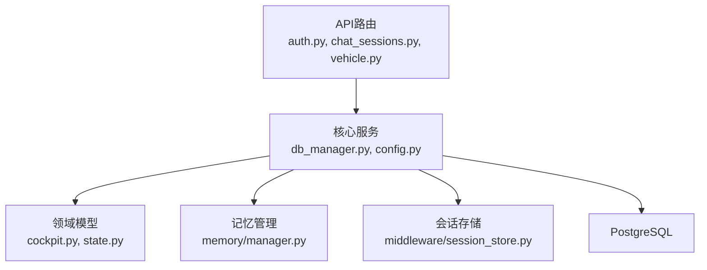
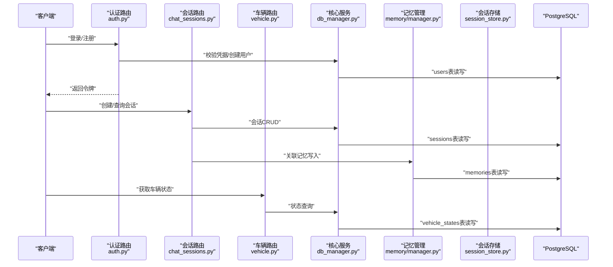
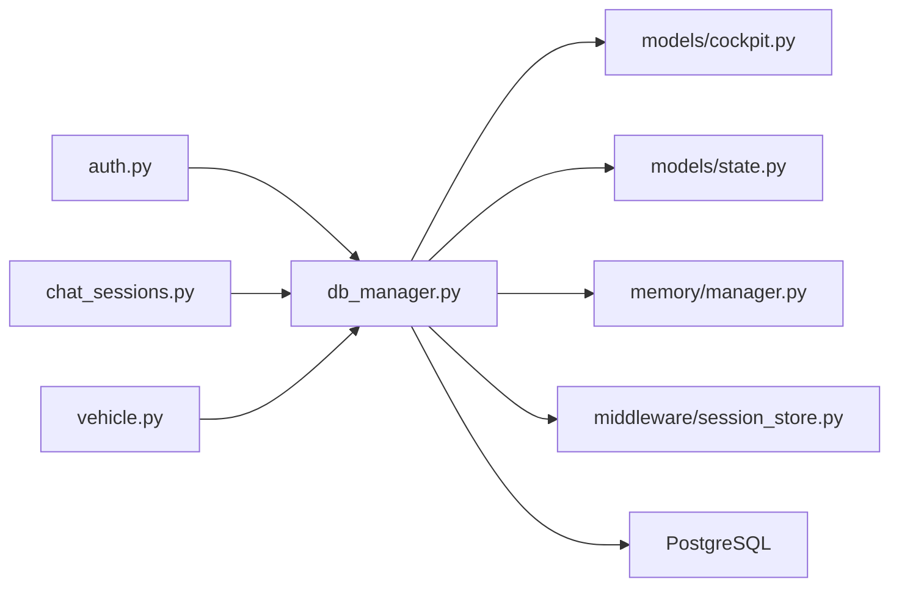

# 关系型数据库设计

<cite>
**本文引用的文件**   
- [backend_design/nexus/core/db_manager.py](file://backend_design/nexus/core/db_manager.py)
- [backend_design/nexus/models/cockpit.py](file://backend_design/nexus/models/cockpit.py)
- [backend_design/nexus/models/state.py](file://backend_design/nexus/models/state.py)
- [backend_design/nexus/memory/manager.py](file://backend_design/nexus/memory/manager.py)
- [backend_design/nexus/middleware/session_store.py](file://backend_design/nexus/middleware/session_store.py)
- [backend_design/nexus/api/routes/auth.py](file://backend_design/nexus/api/routes/auth.py)
- [backend_design/nexus/api/routes/chat_sessions.py](file://backend_design/nexus/api/routes/chat_sessions.py)
- [backend_design/nexus/api/routes/vehicle.py](file://backend_design/nexus/api/routes/vehicle.py)
- [backend_design/nexus/config.py](file://backend_design/nexus/config.py)
- [backend_design/scripts/v2.1_migration.sql](file://backend_design/scripts/v2.1_migration.sql)
- [backend_design/tests/test_db.py](file://backend_design/tests/test_db.py)
</cite>

## 目录
1. [简介](#简介)
2. [项目结构](#项目结构)
3. [核心组件](#核心组件)
4. [架构总览](#架构总览)
5. [详细组件分析](#详细组件分析)
6. [依赖分析](#依赖分析)
7. [性能考虑](#性能考虑)
8. [故障排查指南](#故障排查指南)
9. [结论](#结论)
10. [附录](#附录)

## 简介
本设计文档面向NexusCockpit系统的关系型数据库（PostgreSQL），围绕用户管理、会话管理、车辆状态与记忆数据等核心实体，给出表结构设计、字段定义、约束与索引策略、事务与连接池配置、迁移策略、备份恢复与故障处理机制。文档同时提供SQL建表示例与查询最佳实践，帮助读者快速理解并落地实施。

## 项目结构
后端采用Python实现，数据库访问集中在核心模块中，模型定义位于models目录，API路由负责暴露接口，中间件提供会话存储能力，脚本目录包含迁移与测试用例。整体分层清晰：API层 -> 业务逻辑层 -> 数据访问层 -> 数据库。



图表来源
- [backend_design/nexus/api/routes/auth.py](file://backend_design/nexus/api/routes/auth.py)
- [backend_design/nexus/api/routes/chat_sessions.py](file://backend_design/nexus/api/routes/chat_sessions.py)
- [backend_design/nexus/api/routes/vehicle.py](file://backend_design/nexus/api/routes/vehicle.py)
- [backend_design/nexus/core/db_manager.py](file://backend_design/nexus/core/db_manager.py)
- [backend_design/nexus/config.py](file://backend_design/nexus/config.py)
- [backend_design/nexus/models/cockpit.py](file://backend_design/nexus/models/cockpit.py)
- [backend_design/nexus/models/state.py](file://backend_design/nexus/models/state.py)
- [backend_design/nexus/memory/manager.py](file://backend_design/nexus/memory/manager.py)
- [backend_design/nexus/middleware/session_store.py](file://backend_design/nexus/middleware/session_store.py)

章节来源
- [backend_design/nexus/core/db_manager.py](file://backend_design/nexus/core/db_manager.py)
- [backend_design/nexus/config.py](file://backend_design/nexus/config.py)
- [backend_design/nexus/models/cockpit.py](file://backend_design/nexus/models/cockpit.py)
- [backend_design/nexus/models/state.py](file://backend_design/nexus/models/state.py)
- [backend_design/nexus/memory/manager.py](file://backend_design/nexus/memory/manager.py)
- [backend_design/nexus/middleware/session_store.py](file://backend_design/nexus/middleware/session_store.py)
- [backend_design/nexus/api/routes/auth.py](file://backend_design/nexus/api/routes/auth.py)
- [backend_design/nexus/api/routes/chat_sessions.py](file://backend_design/nexus/api/routes/chat_sessions.py)
- [backend_design/nexus/api/routes/vehicle.py](file://backend_design/nexus/api/routes/vehicle.py)

## 核心组件
- 数据库管理器：封装连接池、事务边界、重试与错误处理，统一对外提供查询与写入接口。
- 领域模型：定义用户、会话、车辆状态、记忆等实体的字段与约束，映射到数据库表。
- 记忆管理：负责记忆的持久化、冲突检测与合并策略。
- 会话存储：提供会话的创建、更新与过期清理能力。
- API路由：承载认证与会话、车辆状态读取等HTTP接口，调用核心服务完成数据读写。

章节来源
- [backend_design/nexus/core/db_manager.py](file://backend_design/nexus/core/db_manager.py)
- [backend_design/nexus/models/cockpit.py](file://backend_design/nexus/models/cockpit.py)
- [backend_design/nexus/models/state.py](file://backend_design/nexus/models/state.py)
- [backend_design/nexus/memory/manager.py](file://backend_design/nexus/memory/manager.py)
- [backend_design/nexus/middleware/session_store.py](file://backend_design/nexus/middleware/session_store.py)
- [backend_design/nexus/api/routes/auth.py](file://backend_design/nexus/api/routes/auth.py)
- [backend_design/nexus/api/routes/chat_sessions.py](file://backend_design/nexus/api/routes/chat_sessions.py)
- [backend_design/nexus/api/routes/vehicle.py](file://backend_design/nexus/api/routes/vehicle.py)

## 架构总览
下图展示了从API请求到数据库访问的整体流程，包括认证、会话管理、车辆状态与记忆数据的读写路径。



图表来源
- [backend_design/nexus/api/routes/auth.py](file://backend_design/nexus/api/routes/auth.py)
- [backend_design/nexus/api/routes/chat_sessions.py](file://backend_design/nexus/api/routes/chat_sessions.py)
- [backend_design/nexus/api/routes/vehicle.py](file://backend_design/nexus/api/routes/vehicle.py)
- [backend_design/nexus/core/db_manager.py](file://backend_design/nexus/core/db_manager.py)
- [backend_design/nexus/memory/manager.py](file://backend_design/nexus/memory/manager.py)
- [backend_design/nexus/middleware/session_store.py](file://backend_design/nexus/middleware/session_store.py)

## 详细组件分析

### 用户管理表（users）
- 业务含义：存储系统用户的基本信息与认证相关数据。
- 关键字段建议：
  - id：主键，UUID或自增整数，唯一标识用户。
  - username：用户名，唯一，非空。
  - email：邮箱，唯一，非空。
  - password_hash：密码哈希值，非空。
  - role：角色（如admin、user），默认普通用户。
  - created_at、updated_at：时间戳，记录创建与更新时间。
  - is_active：是否启用，默认启用。
- 约束与索引：
  - 主键：id。
  - 唯一约束：username、email。
  - 索引：按role、is_active建立复合索引以支持管理端筛选。
- 默认值：created_at为当前时间；is_active默认true。
- 关联关系：与会话表通过user_id外键关联。

章节来源
- [backend_design/nexus/models/cockpit.py](file://backend_design/nexus/models/cockpit.py)
- [backend_design/nexus/api/routes/auth.py](file://backend_design/nexus/api/routes/auth.py)

### 会话管理表（sessions）
- 业务含义：记录用户的聊天会话元数据与状态。
- 关键字段建议：
  - id：主键，UUID或自增整数。
  - user_id：外键，关联users.id。
  - title：会话标题，可选。
  - status：会话状态（active、closed等）。
  - created_at、updated_at：时间戳。
  - metadata：JSONB扩展字段，存储额外上下文。
- 约束与索引：
  - 主键：id。
  - 外键：user_id引用users(id)。
  - 索引：user_id、status、updated_at用于常见查询优化。
- 默认值：created_at为当前时间；status默认active。
- 关联关系：与记忆表通过session_id外键关联。

章节来源
- [backend_design/nexus/models/cockpit.py](file://backend_design/nexus/models/cockpit.py)
- [backend_design/nexus/api/routes/chat_sessions.py](file://backend_design/nexus/api/routes/chat_sessions.py)

### 车辆状态表（vehicle_states）
- 业务含义：持久化车辆的实时或历史状态快照，供仪表盘与技能模块使用。
- 关键字段建议：
  - id：主键。
  - session_id：外键，关联sessions.id（可选，按会话维度聚合）。
  - vehicle_id：车辆标识，唯一或组合唯一（与tenant_id）。
  - snapshot：JSONB，存储状态快照（电量、温度、导航信息等）。
  - ts：时间戳，记录状态采集时间。
  - source：数据来源（canbus、http、mock等）。
- 约束与索引：
  - 主键：id。
  - 外键：session_id引用sessions(id)。
  - 索引：vehicle_id、ts、source；对snapshot中的常用键建立GIN索引（JSONB）。
- 默认值：ts为当前时间；source默认“system”。
- 关联关系：可与会话表关联，便于按会话维度回溯。

章节来源
- [backend_design/nexus/models/state.py](file://backend_design/nexus/models/state.py)
- [backend_design/nexus/api/routes/vehicle.py](file://backend_design/nexus/api/routes/vehicle.py)

### 记忆数据表（memories）
- 业务含义：存储用户偏好、习惯与健康相关的长期记忆，支持冲突检测与合并。
- 关键字段建议：
  - id：主键。
  - session_id：外键，关联sessions.id。
  - user_id：外键，关联users.id。
  - category：类别（preference、habit、health等）。
  - key：记忆键，同类别内唯一。
  - value：JSONB，存储具体值。
  - version：版本号，用于冲突检测与合并。
  - created_at、updated_at：时间戳。
- 约束与索引：
  - 主键：id。
  - 外键：session_id、user_id分别引用对应表。
  - 唯一约束：(category, key, user_id)保证同一用户同类别下键唯一。
  - 索引：user_id、category、updated_at；对value建立GIN索引以便检索。
- 默认值：version初始为1；created_at为当前时间。
- 关联关系：与会话和用户双向关联，支撑个性化推荐与记忆一致性。

章节来源
- [backend_design/nexus/memory/manager.py](file://backend_design/nexus/memory/manager.py)
- [backend_design/nexus/models/cockpit.py](file://backend_design/nexus/models/cockpit.py)

### 类图（核心实体关系）
```mermaid
classDiagram
class Users {
+uuid id PK
+string username UK
+string email UK
+string password_hash
+string role
+boolean is_active
+timestamp created_at
+timestamp updated_at
}
class Sessions {
+uuid id PK
+uuid user_id FK
+string title
+string status
+jsonb metadata
+timestamp created_at
+timestamp updated_at
}
class VehicleStates {
+uuid id PK
+uuid session_id FK
+string vehicle_id
+jsonb snapshot
+timestamp ts
+string source
}
class Memories {
+uuid id PK
+uuid session_id FK
+uuid user_id FK
+string category
+string key
+jsonb value
+int version
+timestamp created_at
+timestamp updated_at
}
Users ||--o{ Sessions : "拥有"
Sessions ||--o{ VehicleStates : "包含"
Sessions ||--o{ Memories : "产生"
Users ||--o{ Memories : "拥有"
```

图表来源
- [backend_design/nexus/models/cockpit.py](file://backend_design/nexus/models/cockpit.py)
- [backend_design/nexus/models/state.py](file://backend_design/nexus/models/state.py)
- [backend_design/nexus/memory/manager.py](file://backend_design/nexus/memory/manager.py)

### 数据迁移策略
- 版本化管理：使用脚本进行增量迁移，确保幂等与回滚能力。
- 示例迁移：参考v2.1迁移脚本，新增索引、调整字段类型与约束。
- 执行时机：在应用启动前或部署流水线中执行，失败则中止部署。
- 回滚方案：保留反向迁移脚本，支持一键回滚。

章节来源
- [backend_design/scripts/v2.1_migration.sql](file://backend_design/scripts/v2.1_migration.sql)

### 连接池与事务管理
- 连接池配置：
  - 最大连接数：根据并发与数据库容量设置。
  - 最小空闲连接：保持一定预热连接，降低冷启动延迟。
  - 连接超时与空闲回收：避免资源泄漏。
- 事务边界：
  - 写操作包裹在事务中，确保原子性与一致性。
  - 长事务避免，尽量拆分批处理。
- 重试与退避：
  - 对瞬态错误（锁等待、网络抖动）进行有限次重试。
  - 指数退避与上限控制，防止雪崩。

章节来源
- [backend_design/nexus/core/db_manager.py](file://backend_design/nexus/core/db_manager.py)
- [backend_design/nexus/config.py](file://backend_design/nexus/config.py)

### 查询最佳实践
- 选择性索引：针对高频过滤条件（user_id、category、status、ts）建立索引。
- JSONB优化：对snapshot与value字段使用GIN索引，配合表达式索引提升检索效率。
- 分页与限流：大结果集使用分页，限制单次返回量。
- 批量写入：合并多次插入为批量操作，减少往返开销。
- 避免SELECT *：仅选择必要字段，降低IO与序列化成本。

章节来源
- [backend_design/nexus/models/state.py](file://backend_design/nexus/models/state.py)
- [backend_design/nexus/memory/manager.py](file://backend_design/nexus/memory/manager.py)

## 依赖分析
- 模块耦合：
  - API路由依赖核心服务与领域模型。
  - 记忆管理与会话存储均依赖数据库管理器。
- 外部依赖：
  - PostgreSQL驱动与ORM/SQL构建库。
  - 监控与指标上报（可选）。
- 潜在循环依赖：
  - 确保API不直接依赖中间件内部实现，通过核心服务解耦。



图表来源
- [backend_design/nexus/api/routes/auth.py](file://backend_design/nexus/api/routes/auth.py)
- [backend_design/nexus/api/routes/chat_sessions.py](file://backend_design/nexus/api/routes/chat_sessions.py)
- [backend_design/nexus/api/routes/vehicle.py](file://backend_design/nexus/api/routes/vehicle.py)
- [backend_design/nexus/core/db_manager.py](file://backend_design/nexus/core/db_manager.py)
- [backend_design/nexus/models/cockpit.py](file://backend_design/nexus/models/cockpit.py)
- [backend_design/nexus/models/state.py](file://backend_design/nexus/models/state.py)
- [backend_design/nexus/memory/manager.py](file://backend_design/nexus/memory/manager.py)
- [backend_design/nexus/middleware/session_store.py](file://backend_design/nexus/middleware/session_store.py)

章节来源
- [backend_design/nexus/core/db_manager.py](file://backend_design/nexus/core/db_manager.py)
- [backend_design/nexus/models/cockpit.py](file://backend_design/nexus/models/cockpit.py)
- [backend_design/nexus/models/state.py](file://backend_design/nexus/models/state.py)
- [backend_design/nexus/memory/manager.py](file://backend_design/nexus/memory/manager.py)
- [backend_design/nexus/middleware/session_store.py](file://backend_design/nexus/middleware/session_store.py)
- [backend_design/nexus/api/routes/auth.py](file://backend_design/nexus/api/routes/auth.py)
- [backend_design/nexus/api/routes/chat_sessions.py](file://backend_design/nexus/api/routes/chat_sessions.py)
- [backend_design/nexus/api/routes/vehicle.py](file://backend_design/nexus/api/routes/vehicle.py)

## 性能考虑
- 索引策略：
  - 单列索引：user_id、category、status、vehicle_id。
  - 复合索引：(user_id, category)、(vehicle_id, ts)、(user_id, updated_at)。
  - GIN索引：JSONB字段snapshot与value。
- 分区与归档：
  - 对vehicle_states按时间分区，冷热数据分离。
  - 定期归档旧会话与记忆，释放空间。
- 缓存与降级：
  - 热点状态读多写少场景引入Redis缓存。
  - 数据库不可用时降级为内存缓存或只读模式。
- 监控与告警：
  - 慢查询日志与指标上报，定位瓶颈。
  - 连接池利用率与锁等待告警。

[本节为通用性能指导，无需列出具体文件来源]

## 故障排查指南
- 常见问题：
  - 连接池耗尽：检查最大连接数与长事务，增加池大小或优化事务范围。
  - 死锁与锁等待：分析事务顺序与索引缺失，拆分大事务。
  - JSONB查询缓慢：确认GIN索引存在且统计信息更新。
- 诊断步骤：
  - 查看数据库日志与慢查询报告。
  - 使用EXPLAIN ANALYZE验证执行计划。
  - 核对迁移脚本执行状态与回滚点。
- 恢复策略：
  - 基于全量+增量备份恢复。
  - 关键表开启WAL归档与时间点恢复（PITR）。

章节来源
- [backend_design/tests/test_db.py](file://backend_design/tests/test_db.py)
- [backend_design/nexus/core/db_manager.py](file://backend_design/nexus/core/db_manager.py)

## 结论
本设计围绕用户、会话、车辆状态与记忆四大核心实体，构建了清晰的表结构与约束体系，结合连接池与事务管理、索引与分区策略、迁移与备份恢复方案，形成高可用、可扩展的关系型数据库基础。建议在上线前完善监控与演练，持续优化查询与索引，保障系统稳定运行。

## 附录

### SQL建表示例（PostgreSQL）
以下为各表的建表示例，涵盖主键、外键、唯一约束、索引与默认值。请根据实际环境调整数据类型与约束。

- users表
  - 主键：id
  - 唯一约束：username、email
  - 索引：role、is_active
  - 默认值：created_at、is_active

- sessions表
  - 主键：id
  - 外键：user_id引用users(id)
  - 索引：user_id、status、updated_at
  - 默认值：created_at、status

- vehicle_states表
  - 主键：id
  - 外键：session_id引用sessions(id)
  - 索引：vehicle_id、ts、source；snapshot的GIN索引
  - 默认值：ts、source

- memories表
  - 主键：id
  - 外键：session_id、user_id
  - 唯一约束：(category, key, user_id)
  - 索引：user_id、category、updated_at；value的GIN索引
  - 默认值：version、created_at

章节来源
- [backend_design/nexus/models/cockpit.py](file://backend_design/nexus/models/cockpit.py)
- [backend_design/nexus/models/state.py](file://backend_design/nexus/models/state.py)
- [backend_design/nexus/memory/manager.py](file://backend_design/nexus/memory/manager.py)

### 数据备份与恢复方案
- 全量备份：每日定时pg_dump或物理备份工具。
- 增量备份：开启WAL归档，按时间点恢复。
- 恢复演练：定期在预生产环境演练恢复流程。
- 一致性：备份期间冻结写入或使用快照技术。

章节来源
- [backend_design/scripts/v2.1_migration.sql](file://backend_design/scripts/v2.1_migration.sql)

### 事务与连接池配置要点
- 连接池参数：max_connections、min_idle、connect_timeout、idle_timeout。
- 事务隔离级别：根据业务选择READ COMMITTED或REPEATABLE READ。
- 重试策略：限定次数与退避间隔，避免无限重试。

章节来源
- [backend_design/nexus/core/db_manager.py](file://backend_design/nexus/core/db_manager.py)
- [backend_design/nexus/config.py](file://backend_design/nexus/config.py)