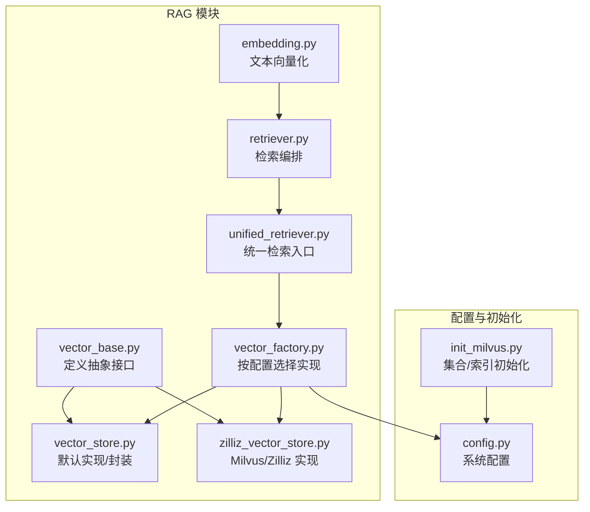
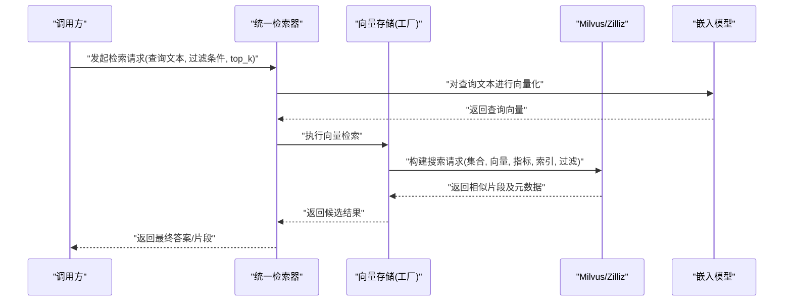
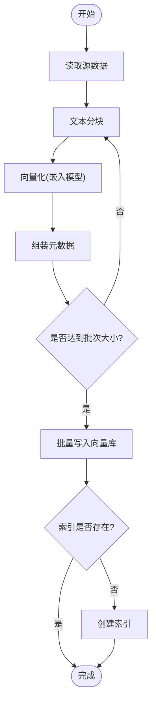
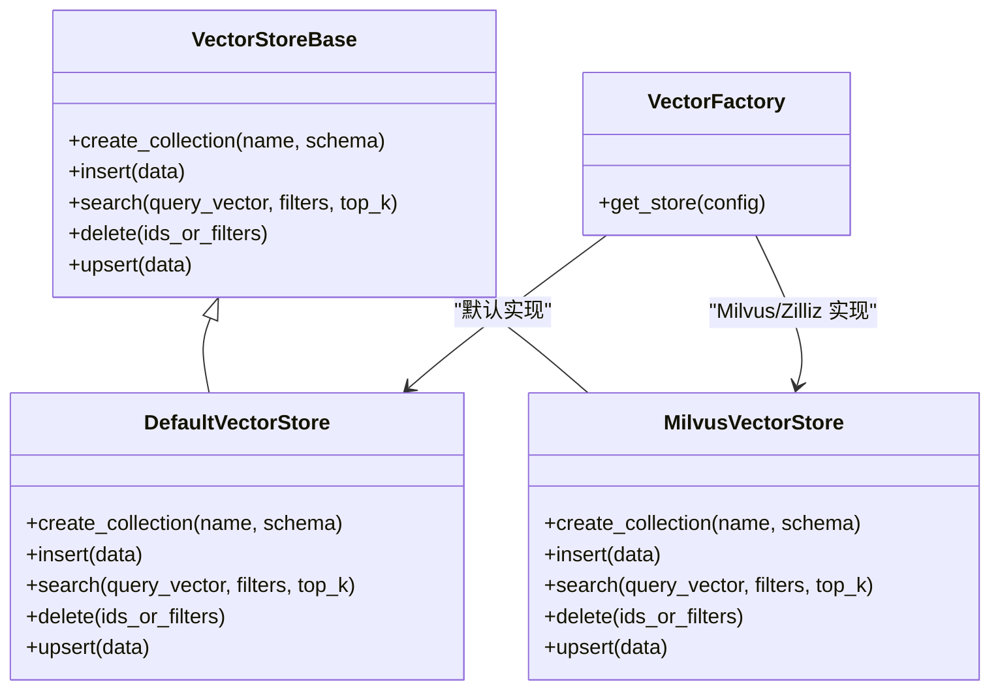
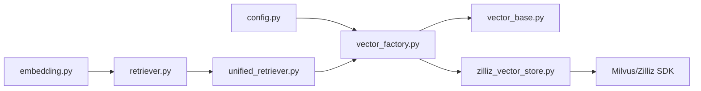

# 向量数据库设计

<cite>
**本文引用的文件**   
- [backend_design/nexus/rag/vector_store.py](file://backend_design/nexus/rag/vector_store.py)
- [backend_design/nexus/rag/vector_base.py](file://backend_design/nexus/rag/vector_base.py)
- [backend_design/nexus/rag/vector_factory.py](file://backend_design/nexus/rag/vector_factory.py)
- [backend_design/nexus/rag/zilliz_vector_store.py](file://backend_design/nexus/rag/zilliz_vector_store.py)
- [backend_design/nexus/config.py](file://backend_design/nexus/config.py)
- [backend_design/scripts/init_milvus.py](file://backend_design/scripts/init_milvus.py)
- [backend_design/nexus/rag/embedding.py](file://backend_design/nexus/rag/embedding.py)
- [backend_design/nexus/rag/retriever.py](file://backend_design/nexus/rag/retriever.py)
- [backend_design/nexus/rag/unified_retriever.py](file://backend_design/nexus/rag/unified_retriever.py)
</cite>

## 目录
1. [简介](#简介)
2. [项目结构](#项目结构)
3. [核心组件](#核心组件)
4. [架构总览](#架构总览)
5. [详细组件分析](#详细组件分析)
6. [依赖关系分析](#依赖关系分析)
7. [性能考虑](#性能考虑)
8. [故障排查指南](#故障排查指南)
9. [结论](#结论)
10. [附录](#附录)

## 简介
本设计文档聚焦于 NexusCockpit 系统中的向量数据库层，围绕 Milvus（含 Zilliz Cloud）的集合设计、向量维度与相似度度量、索引类型选择、检索参数调优、数据导入/更新/删除流程以及性能监控与优化建议进行系统化说明。文档面向研发与运维人员，兼顾可落地性与可维护性。

## 项目结构
NexusCockpit 后端采用分层与模块化组织，RAG（检索增强生成）相关代码集中于 backend_design/nexus/rag 目录。向量存储抽象、工厂与具体实现分离，便于扩展不同后端（如 Milvus/Zilliz）。初始化脚本位于 scripts 目录，用于在启动或部署时创建集合与索引。

图表来源
- [backend_design/nexus/rag/vector_base.py](file://backend_design/nexus/rag/vector_base.py)
- [backend_design/nexus/rag/vector_store.py](file://backend_design/nexus/rag/vector_store.py)
- [backend_design/nexus/rag/zilliz_vector_store.py](file://backend_design/nexus/rag/zilliz_vector_store.py)
- [backend_design/nexus/rag/vector_factory.py](file://backend_design/nexus/rag/vector_factory.py)
- [backend_design/nexus/rag/embedding.py](file://backend_design/nexus/rag/embedding.py)
- [backend_design/nexus/rag/retriever.py](file://backend_design/nexus/rag/retriever.py)
- [backend_design/nexus/rag/unified_retriever.py](file://backend_design/nexus/rag/unified_retriever.py)
- [backend_design/nexus/config.py](file://backend_design/nexus/config.py)
- [backend_design/scripts/init_milvus.py](file://backend_design/scripts/init_milvus.py)

章节来源
- [backend_design/nexus/rag/vector_base.py](file://backend_design/nexus/rag/vector_base.py)
- [backend_design/nexus/rag/vector_store.py](file://backend_design/nexus/rag/vector_store.py)
- [backend_design/nexus/rag/zilliz_vector_store.py](file://backend_design/nexus/rag/zilliz_vector_store.py)
- [backend_design/nexus/rag/vector_factory.py](file://backend_design/nexus/rag/vector_factory.py)
- [backend_design/nexus/rag/embedding.py](file://backend_design/nexus/rag/embedding.py)
- [backend_design/nexus/rag/retriever.py](file://backend_design/nexus/rag/retriever.py)
- [backend_design/nexus/rag/unified_retriever.py](file://backend_design/nexus/rag/unified_retriever.py)
- [backend_design/nexus/config.py](file://backend_design/nexus/config.py)
- [backend_design/scripts/init_milvus.py](file://backend_design/scripts/init_milvus.py)

## 核心组件
- 向量存储抽象与默认实现：定义统一的增删改查与批量操作接口，屏蔽底层差异。
- Milvus/Zilliz 具体实现：基于 Milvus SDK 提供高性能向量检索能力，支持多种索引与度量方法。
- 向量工厂：根据运行时配置动态选择具体向量存储实现。
- 嵌入模型：将文本切块后转换为固定维度的向量，供向量库存储与检索。
- 检索编排：结合过滤条件、排序策略与重排器完成端到端检索流程。
- 初始化脚本：在部署阶段创建集合、字段与索引，确保运行期可用性。

章节来源
- [backend_design/nexus/rag/vector_base.py](file://backend_design/nexus/rag/vector_base.py)
- [backend_design/nexus/rag/vector_store.py](file://backend_design/nexus/rag/vector_store.py)
- [backend_design/nexus/rag/zilliz_vector_store.py](file://backend_design/nexus/rag/zilliz_vector_store.py)
- [backend_design/nexus/rag/vector_factory.py](file://backend_design/nexus/rag/vector_factory.py)
- [backend_design/nexus/rag/embedding.py](file://backend_design/nexus/rag/embedding.py)
- [backend_design/nexus/rag/retriever.py](file://backend_design/nexus/rag/retriever.py)
- [backend_design/nexus/rag/unified_retriever.py](file://backend_design/nexus/rag/unified_retriever.py)

## 架构总览
下图展示了从“文本输入”到“向量检索”的完整链路，包括分块、向量化、入库、检索与结果返回。

图表来源
- [backend_design/nexus/rag/unified_retriever.py](file://backend_design/nexus/rag/unified_retriever.py)
- [backend_design/nexus/rag/retriever.py](file://backend_design/nexus/rag/retriever.py)
- [backend_design/nexus/rag/vector_factory.py](file://backend_design/nexus/rag/vector_factory.py)
- [backend_design/nexus/rag/zilliz_vector_store.py](file://backend_design/nexus/rag/zilliz_vector_store.py)
- [backend_design/nexus/rag/embedding.py](file://backend_design/nexus/rag/embedding.py)

## 详细组件分析

### 集合（Collection）设计与字段规划
- 主键字段：建议使用自增整型或字符串 ID，作为唯一标识。
- 向量字段：固定维度（例如 768、1536），数据类型为浮点数组；维度由嵌入模型决定。
- 标量字段：用于过滤与展示，如 source_id、tenant_id、doc_type、chunk_index、created_at、updated_at、title、content_hash 等。
- 分区策略：可按租户或业务域划分集合或分区，便于权限隔离与冷热数据管理。
- 元数据设计：除内容外，保留来源、版本、时间戳、哈希等，便于审计与去重。

章节来源
- [backend_design/nexus/rag/vector_store.py](file://backend_design/nexus/rag/vector_store.py)
- [backend_design/nexus/rag/zilliz_vector_store.py](file://backend_design/nexus/rag/zilliz_vector_store.py)
- [backend_design/scripts/init_milvus.py](file://backend_design/scripts/init_milvus.py)

### 向量维度与相似度度量
- 向量维度：由嵌入模型输出维度决定，常见为 768、1536 等；需在集合创建时严格匹配。
- 相似度度量：
  - 余弦相似度：适合归一化后的文本向量，语义检索常用。
  - 欧氏距离：对数值尺度敏感，适用于特定场景。
  - 内积：当向量已做 L2 归一化时等价于余弦相似度。
- 选择建议：优先使用余弦相似度；若下游任务对绝对距离更敏感，再评估欧氏距离。

章节来源
- [backend_design/nexus/rag/vector_store.py](file://backend_design/nexus/rag/vector_store.py)
- [backend_design/nexus/rag/zilliz_vector_store.py](file://backend_design/nexus/rag/zilliz_vector_store.py)

### 索引类型选择与适用场景
- IVF_FLAT：
  - 优点：构建快、内存占用低、召回稳定。
  - 缺点：大规模数据下延迟较高。
  - 适用：中小规模数据、离线批处理、对延迟不敏感的场景。
- HNSW：
  - 优点：高召回、低延迟，适合在线实时检索。
  - 缺点：构建与内存开销较大，需调参（efConstruction、M 等）。
  - 适用：大规模数据、在线高并发检索。
- 其他可选：SCANN、DISKANN（视部署环境而定）。

章节来源
- [backend_design/nexus/rag/vector_store.py](file://backend_design/nexus/rag/vector_store.py)
- [backend_design/nexus/rag/zilliz_vector_store.py](file://backend_design/nexus/rag/zilliz_vector_store.py)

### 文本分块策略与元数据设计
- 分块策略：
  - 固定长度分块：简单可控，但可能破坏语义边界。
  - 语义分块：按段落/句子/标题层级切分，提升检索质量。
  - 重叠窗口：相邻块设置一定重叠，避免关键信息被截断。
- 元数据设计：
  - 基础信息：source_id、tenant_id、doc_type、chunk_index、title。
  - 溯源信息：url、author、version、created_at、updated_at。
  - 校验信息：content_hash、length、language。
- 过滤条件：
  - 精确匹配：tenant_id、doc_type、source_id。
  - 范围过滤：时间区间、长度阈值。
  - 组合条件：多字段 AND/OR 组合，减少候选集。

章节来源
- [backend_design/nexus/rag/embedding.py](file://backend_design/nexus/rag/embedding.py)
- [backend_design/nexus/rag/vector_store.py](file://backend_design/nexus/rag/vector_store.py)

### 检索参数调优
- top_k：
  - 小值（如 5-20）：低延迟、高精准度，适合强过滤场景。
  - 大值（如 50-200）：提高召回率，配合重排器提升最终质量。
- 搜索半径/阈值：
  - 针对欧氏距离或内积场景，可设定阈值过滤低相关结果。
- 过滤条件：
  - 先过滤再检索，显著降低计算量。
  - 利用标量索引（如 tenant_id、doc_type）加速筛选。
- 索引参数：
  - IVF_FLAT：nlist 控制聚类数，需与数据规模匹配。
  - HNSW：efConstruction 影响构建质量，ef 影响检索精度与延迟。

章节来源
- [backend_design/nexus/rag/retriever.py](file://backend_design/nexus/rag/retriever.py)
- [backend_design/nexus/rag/unified_retriever.py](file://backend_design/nexus/rag/unified_retriever.py)
- [backend_design/nexus/rag/vector_store.py](file://backend_design/nexus/rag/vector_store.py)

### 批量导入、更新与删除示例流程
- 批量导入：
  - 步骤：读取源数据 → 分块 → 向量化 → 组装元数据 → 批量写入 → 建索引（若未预建）。
  - 注意：分批提交，控制单次批次大小，避免超时与内存峰值。
- 更新：
  - 策略：删除旧记录并插入新记录；或使用 Upsert（若后端支持）。
  - 建议：通过 content_hash 判断是否需要更新，减少无效写入。
- 删除：
  - 依据主键或过滤条件批量删除；定期清理过期数据。
- 幂等与一致性：
  - 写入前计算 content_hash，保证幂等。
  - 事务不可用场景下，采用补偿机制与重试策略。

图表来源
- [backend_design/nexus/rag/vector_store.py](file://backend_design/nexus/rag/vector_store.py)
- [backend_design/nexus/rag/embedding.py](file://backend_design/nexus/rag/embedding.py)
- [backend_design/scripts/init_milvus.py](file://backend_design/scripts/init_milvus.py)

章节来源
- [backend_design/nexus/rag/vector_store.py](file://backend_design/nexus/rag/vector_store.py)
- [backend_design/nexus/rag/embedding.py](file://backend_design/nexus/rag/embedding.py)
- [backend_design/scripts/init_milvus.py](file://backend_design/scripts/init_milvus.py)

### 类图：向量存储抽象与实现

图表来源
- [backend_design/nexus/rag/vector_base.py](file://backend_design/nexus/rag/vector_base.py)
- [backend_design/nexus/rag/vector_store.py](file://backend_design/nexus/rag/vector_store.py)
- [backend_design/nexus/rag/zilliz_vector_store.py](file://backend_design/nexus/rag/zilliz_vector_store.py)
- [backend_design/nexus/rag/vector_factory.py](file://backend_design/nexus/rag/vector_factory.py)

章节来源
- [backend_design/nexus/rag/vector_base.py](file://backend_design/nexus/rag/vector_base.py)
- [backend_design/nexus/rag/vector_store.py](file://backend_design/nexus/rag/vector_store.py)
- [backend_design/nexus/rag/zilliz_vector_store.py](file://backend_design/nexus/rag/zilliz_vector_store.py)
- [backend_design/nexus/rag/vector_factory.py](file://backend_design/nexus/rag/vector_factory.py)

## 依赖关系分析
- 组件耦合：
  - 检索器依赖向量工厂，工厂根据配置选择具体实现，降低耦合度。
  - 嵌入模型独立于向量库，便于替换不同模型。
- 外部依赖：
  - Milvus/Zilliz SDK：提供连接、集合管理与检索能力。
  - 配置中心：集中管理连接参数、索引与检索参数。
- 潜在风险：
  - 循环依赖：通过工厂模式解耦。
  - 配置不一致：集合维度与模型输出维度必须一致。

图表来源
- [backend_design/nexus/config.py](file://backend_design/nexus/config.py)
- [backend_design/nexus/rag/vector_factory.py](file://backend_design/nexus/rag/vector_factory.py)
- [backend_design/nexus/rag/vector_base.py](file://backend_design/nexus/rag/vector_base.py)
- [backend_design/nexus/rag/zilliz_vector_store.py](file://backend_design/nexus/rag/zilliz_vector_store.py)
- [backend_design/nexus/rag/embedding.py](file://backend_design/nexus/rag/embedding.py)
- [backend_design/nexus/rag/retriever.py](file://backend_design/nexus/rag/retriever.py)
- [backend_design/nexus/rag/unified_retriever.py](file://backend_design/nexus/rag/unified_retriever.py)

章节来源
- [backend_design/nexus/config.py](file://backend_design/nexus/config.py)
- [backend_design/nexus/rag/vector_factory.py](file://backend_design/nexus/rag/vector_factory.py)
- [backend_design/nexus/rag/vector_base.py](file://backend_design/nexus/rag/vector_base.py)
- [backend_design/nexus/rag/zilliz_vector_store.py](file://backend_design/nexus/rag/zilliz_vector_store.py)
- [backend_design/nexus/rag/embedding.py](file://backend_design/nexus/rag/embedding.py)
- [backend_design/nexus/rag/retriever.py](file://backend_design/nexus/rag/retriever.py)
- [backend_design/nexus/rag/unified_retriever.py](file://backend_design/nexus/rag/unified_retriever.py)

## 性能考虑
- 索引与参数：
  - HNSW：调整 efConstruction 与 ef，平衡构建时间与检索延迟。
  - IVF_FLAT：合理设置 nlist，避免过小导致召回下降或过大导致延迟上升。
- 过滤前置：
  - 使用标量索引与精确过滤缩小候选集，显著提升吞吐。
- 批量写入：
  - 控制批次大小与并发度，避免服务端压力与客户端超时。
- 缓存与降级：
  - 热点查询结果短期缓存；向量库异常时回退到关键词检索或空结果。
- 资源规划：
  - CPU/内存与磁盘容量按数据规模与 QPS 预估；Zilliz Cloud 按需扩容。

[本节为通用指导，无需列出具体文件来源]

## 故障排查指南
- 连接失败：
  - 检查 Milvus/Zilliz 地址、端口、认证信息与网络连通性。
- 维度不匹配：
  - 确认集合向量字段维度与嵌入模型输出维度一致。
- 索引未就绪：
  - 确认初始化脚本成功执行，集合与索引状态正常。
- 检索超时：
  - 降低 top_k、增加过滤条件、调整索引参数或扩容集群。
- 写入失败：
  - 检查批次大小、重复数据与 content_hash 逻辑；重试与幂等保护。

章节来源
- [backend_design/nexus/rag/vector_store.py](file://backend_design/nexus/rag/vector_store.py)
- [backend_design/nexus/rag/zilliz_vector_store.py](file://backend_design/nexus/rag/zilliz_vector_store.py)
- [backend_design/scripts/init_milvus.py](file://backend_design/scripts/init_milvus.py)

## 结论
通过抽象与工厂模式，NexusCockpit 的向量存储层具备良好的可扩展性与可维护性。结合合理的集合设计、索引选择与检索参数调优，可在保证召回质量的同时满足在线检索的性能要求。建议在上线前进行压测与回归验证，持续监控关键指标并迭代优化。

[本节为总结性内容，无需列出具体文件来源]

## 附录
- 配置项建议：
  - 连接参数：host、port、token/collection_name、index_type、metric_type。
  - 检索参数：top_k、filters、timeout。
  - 索引参数：nlist/efConstruction/ef 等。
- 监控指标：
  - 检索延迟 P95/P99、QPS、错误率、索引构建耗时、内存/CPU 使用率。
- 最佳实践：
  - 先过滤后检索、小步快跑式增量更新、定期重建索引与清理过期数据。

[本节为补充信息，无需列出具体文件来源]