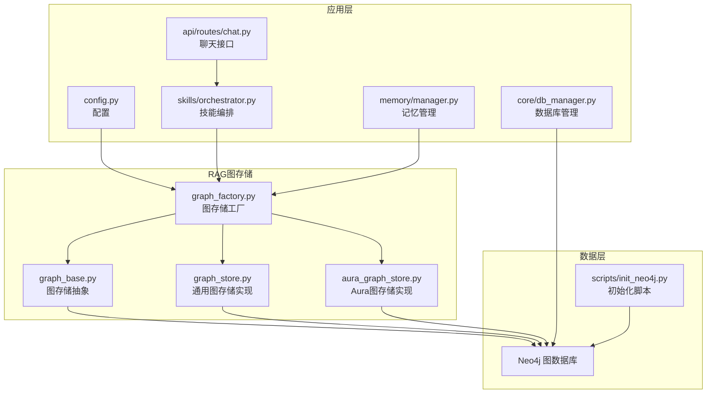
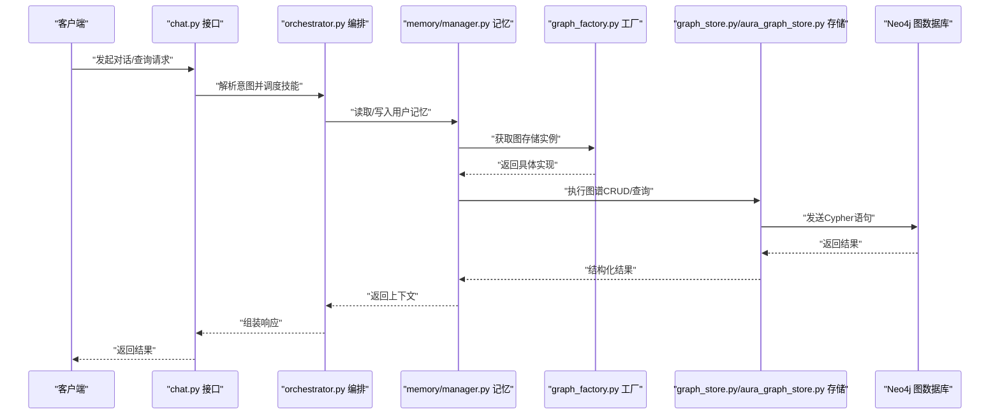
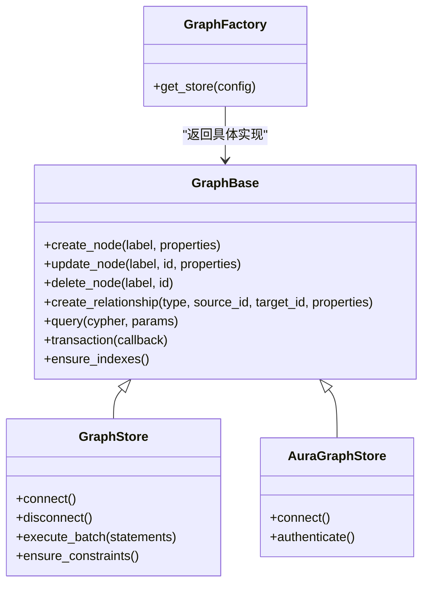
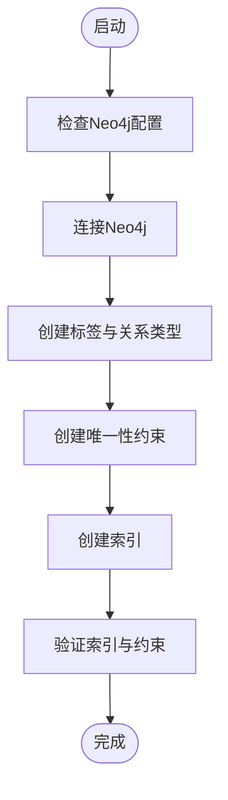
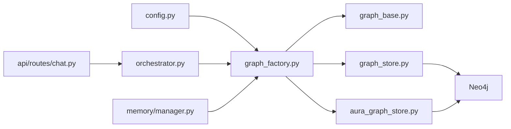

# 图数据库设计

<cite>
**本文引用的文件**   
- [backend_design/nexus/rag/graph_base.py](file://backend_design/nexus/rag/graph_base.py)
- [backend_design/nexus/rag/graph_store.py](file://backend_design/nexus/rag/graph_store.py)
- [backend_design/nexus/rag/aura_graph_store.py](file://backend_design/nexus/rag/aura_graph_store.py)
- [backend_design/nexus/rag/graph_factory.py](file://backend_design/nexus/rag/graph_factory.py)
- [scripts/init_neo4j.py](file://scripts/init_neo4j.py)
- [backend_design/nexus/core/db_manager.py](file://backend_design/nexus/core/db_manager.py)
- [backend_design/nexus/skills/orchestrator.py](file://backend_design/nexus/skills/orchestrator.py)
- [backend_design/nexus/memory/manager.py](file://backend_design/nexus/memory/manager.py)
- [backend_design/nexus/api/routes/chat.py](file://backend_design/nexus/api/routes/chat.py)
- [backend_design/nexus/config.py](file://backend_design/nexus/config.py)
</cite>

## 目录
1. [简介](#简介)
2. [项目结构](#项目结构)
3. [核心组件](#核心组件)
4. [架构总览](#架构总览)
5. [详细组件分析](#详细组件分析)
6. [依赖关系分析](#依赖关系分析)
7. [性能考虑](#性能考虑)
8. [故障排查指南](#故障排查指南)
9. [结论](#结论)
10. [附录](#附录)

## 简介
本文件面向NexusCockpit系统的Neo4j知识图谱设计与实现，聚焦以下目标：
- 定义节点类型（用户、车辆、健康、导航等实体）与关系类型（拥有、控制、相关等），并给出属性设计建议。
- 描述知识图谱构建流程：实体抽取、关系识别、图谱融合。
- 说明Cypher查询语言的使用场景与优化策略，包括复杂查询、路径查找、子图匹配。
- 提供增删改查示例与批量导入方法。
- 给出可视化展示与性能调优建议。

## 项目结构
与图数据库相关的代码主要位于后端RAG层与初始化脚本中，并通过配置与API路由进行集成。关键位置如下：
- RAG图存储抽象与实现：graph_base.py、graph_store.py、aura_graph_store.py、graph_factory.py
- Neo4j初始化脚本：init_neo4j.py
- 应用配置与数据库管理：config.py、db_manager.py
- 技能编排与记忆模块：skills/orchestrator.py、memory/manager.py
- API入口：api/routes/chat.py

图表来源
- [backend_design/nexus/rag/graph_base.py](file://backend_design/nexus/rag/graph_base.py)
- [backend_design/nexus/rag/graph_store.py](file://backend_design/nexus/rag/graph_store.py)
- [backend_design/nexus/rag/aura_graph_store.py](file://backend_design/nexus/rag/aura_graph_store.py)
- [backend_design/nexus/rag/graph_factory.py](file://backend_design/nexus/rag/graph_factory.py)
- [backend_design/nexus/config.py](file://backend_design/nexus/config.py)
- [backend_design/nexus/core/db_manager.py](file://backend_design/nexus/core/db_manager.py)
- [backend_design/nexus/skills/orchestrator.py](file://backend_design/nexus/skills/orchestrator.py)
- [backend_design/nexus/memory/manager.py](file://backend_design/nexus/memory/manager.py)
- [backend_design/nexus/api/routes/chat.py](file://backend_design/nexus/api/routes/chat.py)
- [scripts/init_neo4j.py](file://scripts/init_neo4j.py)

章节来源
- [backend_design/nexus/rag/graph_base.py](file://backend_design/nexus/rag/graph_base.py)
- [backend_design/nexus/rag/graph_store.py](file://backend_design/nexus/rag/graph_store.py)
- [backend_design/nexus/rag/aura_graph_store.py](file://backend_design/nexus/rag/aura_graph_store.py)
- [backend_design/nexus/rag/graph_factory.py](file://backend_design/nexus/rag/graph_factory.py)
- [backend_design/nexus/config.py](file://backend_design/nexus/config.py)
- [backend_design/nexus/core/db_manager.py](file://backend_design/nexus/core/db_manager.py)
- [backend_design/nexus/skills/orchestrator.py](file://backend_design/nexus/skills/orchestrator.py)
- [backend_design/nexus/memory/manager.py](file://backend_design/nexus/memory/manager.py)
- [backend_design/nexus/api/routes/chat.py](file://backend_design/nexus/api/routes/chat.py)
- [scripts/init_neo4j.py](file://scripts/init_neo4j.py)

## 核心组件
- 图存储抽象层：定义统一的图操作接口（创建/更新/删除节点与关系、查询、事务、索引管理等）。
- 具体图存储实现：
  - 通用实现：封装对Neo4j的驱动调用与常用操作。
  - Aura实现：针对云托管Neo4j（Aura）的连接与认证细节。
- 图存储工厂：根据配置选择具体实现，便于扩展其他图数据库或不同部署环境。
- 初始化脚本：用于在启动时创建必要的标签、关系类型、约束与索引。
- 应用集成点：
  - 配置：集中管理Neo4j连接参数与特性开关。
  - 数据库管理：统一生命周期管理与错误处理。
  - 技能编排与记忆：在业务场景中读写图谱。
  - API路由：对外暴露基于图谱的查询能力。

章节来源
- [backend_design/nexus/rag/graph_base.py](file://backend_design/nexus/rag/graph_base.py)
- [backend_design/nexus/rag/graph_store.py](file://backend_design/nexus/rag/graph_store.py)
- [backend_design/nexus/rag/aura_graph_store.py](file://backend_design/nexus/rag/aura_graph_store.py)
- [backend_design/nexus/rag/graph_factory.py](file://backend_design/nexus/rag/graph_factory.py)
- [scripts/init_neo4j.py](file://scripts/init_neo4j.py)
- [backend_design/nexus/config.py](file://backend_design/nexus/config.py)
- [backend_design/nexus/core/db_manager.py](file://backend_design/nexus/core/db_manager.py)
- [backend_design/nexus/skills/orchestrator.py](file://backend_design/nexus/skills/orchestrator.py)
- [backend_design/nexus/memory/manager.py](file://backend_design/nexus/memory/manager.py)
- [backend_design/nexus/api/routes/chat.py](file://backend_design/nexus/api/routes/chat.py)

## 架构总览
下图展示了从API到图数据库的整体调用链与职责划分。

图表来源
- [backend_design/nexus/api/routes/chat.py](file://backend_design/nexus/api/routes/chat.py)
- [backend_design/nexus/skills/orchestrator.py](file://backend_design/nexus/skills/orchestrator.py)
- [backend_design/nexus/memory/manager.py](file://backend_design/nexus/memory/manager.py)
- [backend_design/nexus/rag/graph_factory.py](file://backend_design/nexus/rag/graph_factory.py)
- [backend_design/nexus/rag/graph_store.py](file://backend_design/nexus/rag/graph_store.py)
- [backend_design/nexus/rag/aura_graph_store.py](file://backend_design/nexus/rag/aura_graph_store.py)

## 详细组件分析

### 图存储抽象与实现
- 抽象层定义统一接口，屏蔽底层差异，便于替换实现与测试。
- 通用实现负责与Neo4j驱动交互，封装事务、批处理、索引维护等。
- Aura实现适配云托管环境的连接与认证方式。

图表来源
- [backend_design/nexus/rag/graph_base.py](file://backend_design/nexus/rag/graph_base.py)
- [backend_design/nexus/rag/graph_store.py](file://backend_design/nexus/rag/graph_store.py)
- [backend_design/nexus/rag/aura_graph_store.py](file://backend_design/nexus/rag/aura_graph_store.py)
- [backend_design/nexus/rag/graph_factory.py](file://backend_design/nexus/rag/graph_factory.py)

章节来源
- [backend_design/nexus/rag/graph_base.py](file://backend_design/nexus/rag/graph_base.py)
- [backend_design/nexus/rag/graph_store.py](file://backend_design/nexus/rag/graph_store.py)
- [backend_design/nexus/rag/aura_graph_store.py](file://backend_design/nexus/rag/aura_graph_store.py)
- [backend_design/nexus/rag/graph_factory.py](file://backend_design/nexus/rag/graph_factory.py)

### 初始化与索引管理
- 初始化脚本负责创建必要的标签、关系类型、唯一性约束与索引，确保查询性能与数据一致性。
- 建议在系统启动阶段执行，或在CI/CD流水线中作为预置步骤。

图表来源
- [scripts/init_neo4j.py](file://scripts/init_neo4j.py)

章节来源
- [scripts/init_neo4j.py](file://scripts/init_neo4j.py)

### 应用集成点
- 配置中心：集中管理Neo4j连接参数、超时、重试、连接池大小等。
- 数据库管理：统一生命周期管理、错误处理与监控埋点。
- 技能编排：在技能执行过程中按需访问图谱，增强上下文理解。
- 记忆管理：持久化用户偏好、历史行为与状态，支撑个性化服务。
- API路由：将图谱查询能力以REST/WebSocket形式暴露给前端。

章节来源
- [backend_design/nexus/config.py](file://backend_design/nexus/config.py)
- [backend_design/nexus/core/db_manager.py](file://backend_design/nexus/core/db_manager.py)
- [backend_design/nexus/skills/orchestrator.py](file://backend_design/nexus/skills/orchestrator.py)
- [backend_design/nexus/memory/manager.py](file://backend_design/nexus/memory/manager.py)
- [backend_design/nexus/api/routes/chat.py](file://backend_design/nexus/api/routes/chat.py)

## 依赖关系分析
- 低耦合：通过抽象层与工厂模式解耦上层业务与底层图数据库实现。
- 可插拔：新增图存储实现只需遵循抽象接口，并在工厂中注册。
- 外部依赖：Neo4j驱动、连接池、认证库等由具体实现管理。

图表来源
- [backend_design/nexus/config.py](file://backend_design/nexus/config.py)
- [backend_design/nexus/rag/graph_factory.py](file://backend_design/nexus/rag/graph_factory.py)
- [backend_design/nexus/rag/graph_base.py](file://backend_design/nexus/rag/graph_base.py)
- [backend_design/nexus/rag/graph_store.py](file://backend_design/nexus/rag/graph_store.py)
- [backend_design/nexus/rag/aura_graph_store.py](file://backend_design/nexus/rag/aura_graph_store.py)
- [backend_design/nexus/skills/orchestrator.py](file://backend_design/nexus/skills/orchestrator.py)
- [backend_design/nexus/memory/manager.py](file://backend_design/nexus/memory/manager.py)
- [backend_design/nexus/api/routes/chat.py](file://backend_design/nexus/api/routes/chat.py)

章节来源
- [backend_design/nexus/config.py](file://backend_design/nexus/config.py)
- [backend_design/nexus/rag/graph_factory.py](file://backend_design/nexus/rag/graph_factory.py)
- [backend_design/nexus/rag/graph_base.py](file://backend_design/nexus/rag/graph_base.py)
- [backend_design/nexus/rag/graph_store.py](file://backend_design/nexus/rag/graph_store.py)
- [backend_design/nexus/rag/aura_graph_store.py](file://backend_design/nexus/rag/aura_graph_store.py)
- [backend_design/nexus/skills/orchestrator.py](file://backend_design/nexus/skills/orchestrator.py)
- [backend_design/nexus/memory/manager.py](file://backend_design/nexus/memory/manager.py)
- [backend_design/nexus/api/routes/chat.py](file://backend_design/nexus/api/routes/chat.py)

## 性能考虑
- 索引与约束
  - 为高频查询字段建立索引与唯一性约束，减少全图扫描。
  - 使用复合索引优化多条件过滤。
- 查询优化
  - 避免深层递归与无界路径；限制跳数与返回数量。
  - 使用WITH聚合与RETURN投影减少数据传输量。
  - 利用变量长度路径的上下界，避免指数级增长。
- 批处理与事务
  - 批量写入使用UNION ALL与apoc.periodic.iterate提升吞吐。
  - 合理拆分事务边界，避免长事务锁竞争。
- 连接与资源
  - 调整连接池大小与超时参数，避免连接耗尽。
  - 监控慢查询与热点节点，必要时引入缓存层。
- 数据模型
  - 扁平化冗余属性以减少JOIN复杂度。
  - 使用标签区分实体族类，提高选择性。

[本节为通用指导，不直接分析具体文件]

## 故障排查指南
- 连接失败
  - 检查配置中的主机、端口、用户名、密码与TLS设置。
  - 确认防火墙与安全组放行Neo4j端口。
- 认证异常
  - 对于Aura环境，核对令牌与集群地址。
- 索引缺失
  - 运行初始化脚本后验证索引是否存在。
  - 若迁移后失效，重新创建约束与索引。
- 慢查询
  - 启用Neo4j查询日志，定位热点语句。
  - 结合EXPLAIN/APIOPTIMIZE分析执行计划。
- 事务阻塞
  - 缩短事务范围，拆分大事务。
  - 避免长时间持有写锁。

章节来源
- [backend_design/nexus/config.py](file://backend_design/nexus/config.py)
- [backend_design/nexus/core/db_manager.py](file://backend_design/nexus/core/db_manager.py)
- [scripts/init_neo4j.py](file://scripts/init_neo4j.py)

## 结论
通过抽象层与工厂模式，NexusCockpit实现了与Neo4j的松耦合集成，具备可扩展性与可维护性。配合合理的索引与查询优化策略，可在复杂业务场景下保持良好性能。初始化脚本与配置管理保障了部署的一致性与稳定性。

[本节为总结，不直接分析具体文件]

## 附录

### 知识图谱概念模型（建议）
以下为建议的节点类型与关系类型，供建模参考：
- 节点类型
  - 用户：标识、姓名、角色、偏好、注册时间等
  - 车辆：车牌号、型号、VIN、状态、位置等
  - 健康：指标类型、数值、时间戳、来源设备等
  - 导航：目的地、路线ID、预计到达时间、路况等
  - 会话：会话ID、开始时间、结束时间、状态等
- 关系类型
  - 拥有：用户-车辆
  - 控制：用户-车辆（功能控制）
  - 记录：用户-健康（健康数据）
  - 规划：用户-导航（导航任务）
  - 参与：用户-会话（对话历史）
  - 相关：任意实体间关联（如车辆-导航）

[本节为概念性内容，不直接分析具体文件]

### Cypher使用要点与示例路径
- 复杂查询优化
  - 使用WITH聚合与RETURN投影减少中间结果集。
  - 限定变量长度路径范围，避免全图遍历。
- 路径查找
  - 使用最短路径与K短路径算法，限制深度与分支因子。
- 子图匹配
  - 使用模式匹配与WHERE条件裁剪候选集。
- 增删改查示例（路径指引）
  - 插入节点与关系：参考图存储实现的创建方法。
  - 更新属性：参考更新方法的事务封装。
  - 删除节点与关系：参考删除方法并清理外键关系。
  - 批量导入：参考初始化脚本的批处理写法。

章节来源
- [backend_design/nexus/rag/graph_store.py](file://backend_design/nexus/rag/graph_store.py)
- [backend_design/nexus/rag/aura_graph_store.py](file://backend_design/nexus/rag/aura_graph_store.py)
- [scripts/init_neo4j.py](file://scripts/init_neo4j.py)

### 批量导入方法
- 使用UNION ALL合并多条CREATE语句，减少网络往返。
- 借助apoc.periodic.iterate分批提交，控制内存占用。
- 先建索引再导入，导入后再重建统计信息。

章节来源
- [scripts/init_neo4j.py](file://scripts/init_neo4j.py)

### 可视化展示建议
- 使用Neo4j Browser或第三方可视化工具加载子图。
- 在前端通过REST接口返回精简的子图数据，渲染为力导向图。
- 对大规模图采用分页与采样策略，避免一次性加载过多节点。

[本节为通用指导，不直接分析具体文件]