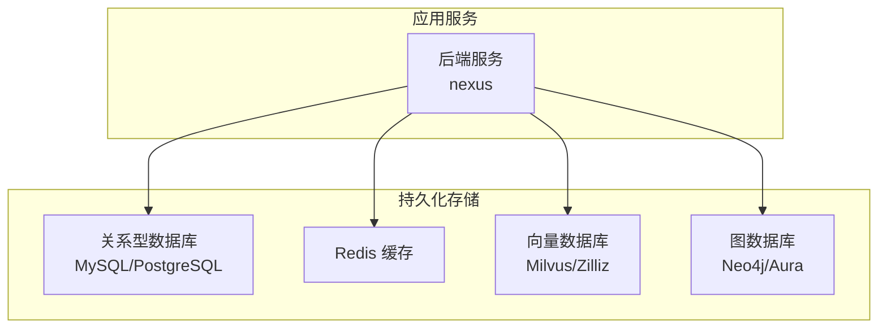
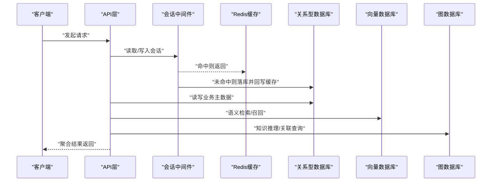
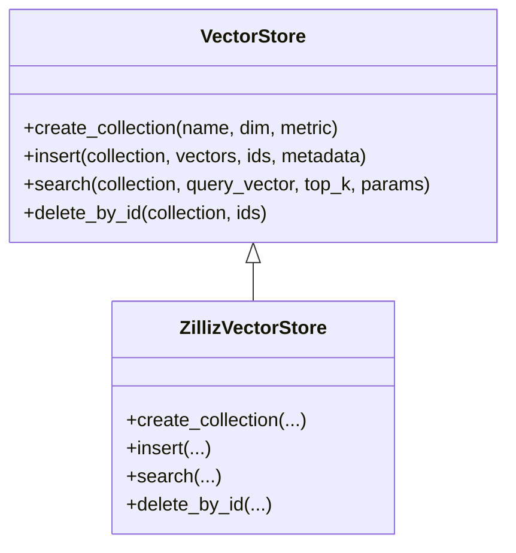
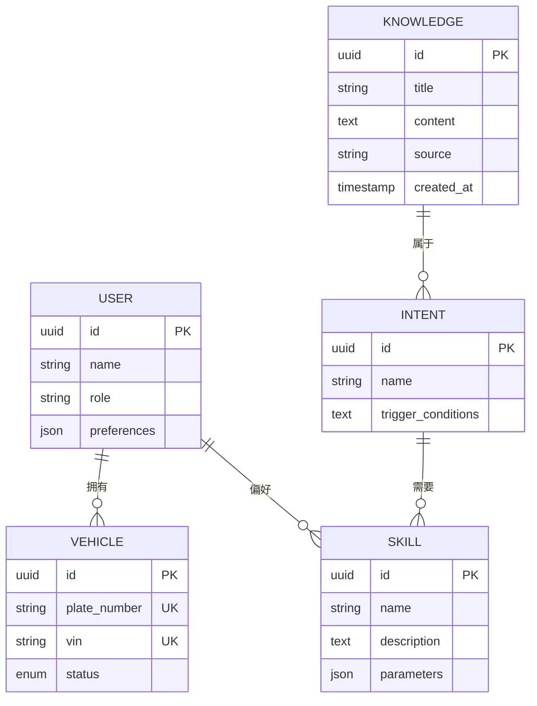
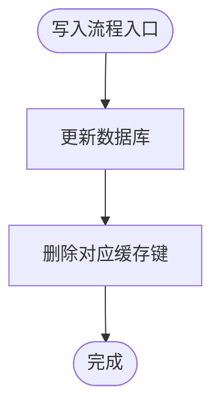
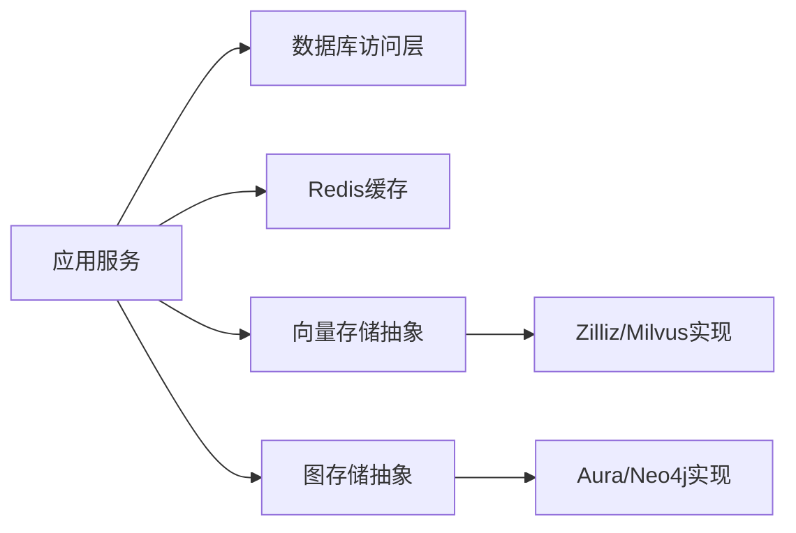

# 数据库设计

<cite>
**本文引用的文件**   
- [backend_design/nexus/core/db_manager.py](file://backend_design/nexus/core/db_manager.py)
- [backend_design/nexus/models/cockpit.py](file://backend_design/nexus/models/cockpit.py)
- [backend_design/nexus/models/state.py](file://backend_design/nexus/models/state.py)
- [backend_design/nexus/middleware/session_store.py](file://backend_design/nexus/middleware/session_store.py)
- [backend_design/nexus/middleware/redis_cache.py](file://backend_design/nexus/middleware/redis_cache.py)
- [backend_design/nexus/rag/vector_store.py](file://backend_design/nexus/rag/vector_store.py)
- [backend_design/nexus/rag/zilliz_vector_store.py](file://backend_design/nexus/rag/zilliz_vector_store.py)
- [backend_design/nexus/rag/graph_store.py](file://backend_design/nexus/rag/graph_store.py)
- [backend_design/nexus/rag/aura_graph_store.py](file://backend_design/nexus/rag/aura_graph_store.py)
- [backend_design/scripts/init_milvus.py](file://backend_design/scripts/init_milvus.py)
- [backend_design/scripts/init_neo4j.py](file://backend_design/scripts/init_neo4j.py)
- [backend_design/scripts/v2.1_migration.sql](file://backend_design/scripts/v2.1_migration.sql)
- [backend_design/nexus/config.py](file://backend_design/nexus/config.py)
- [docker-compose.yml](file://docker-compose.yml)
</cite>

## 目录
1. [引言](#引言)
2. [项目结构](#项目结构)
3. [核心组件](#核心组件)
4. [架构总览](#架构总览)
5. [详细组件分析](#详细组件分析)
6. [依赖关系分析](#依赖关系分析)
7. [性能考虑](#性能考虑)
8. [故障排查指南](#故障排查指南)
9. [结论](#结论)
10. [附录](#附录)

## 引言
本文件面向NexusCockpit系统的数据层设计与实现，覆盖以下方面：
- 关系型数据库的表结构设计（用户、会话、车辆状态等）
- 向量数据库（Milvus/Zilliz）的集合与检索参数配置
- 图数据库（Neo4j/Aura）的知识图谱节点与关系定义及查询优化
- Redis缓存策略（键命名、过期、一致性）
- 数据迁移脚本管理与版本控制
- 数据备份恢复与灾难恢复计划

## 项目结构
与数据层相关的代码主要分布在以下模块：
- 关系型数据库访问：db_manager、models
- 会话与缓存：session_store、redis_cache
- 向量检索：vector_store、zilliz_vector_store、init_milvus
- 知识图谱：graph_store、aura_graph_store、init_neo4j
- 配置与编排：config、docker-compose

图表来源
- [backend_design/nexus/core/db_manager.py](file://backend_design/nexus/core/db_manager.py)
- [backend_design/nexus/middleware/redis_cache.py](file://backend_design/nexus/middleware/redis_cache.py)
- [backend_design/nexus/rag/vector_store.py](file://backend_design/nexus/rag/vector_store.py)
- [backend_design/nexus/rag/zilliz_vector_store.py](file://backend_design/nexus/rag/zilliz_vector_store.py)
- [backend_design/nexus/rag/graph_store.py](file://backend_design/nexus/rag/graph_store.py)
- [backend_design/nexus/rag/aura_graph_store.py](file://backend_design/nexus/rag/aura_graph_store.py)
- [docker-compose.yml](file://docker-compose.yml)

章节来源
- [backend_design/nexus/core/db_manager.py](file://backend_design/nexus/core/db_manager.py)
- [backend_design/nexus/models/cockpit.py](file://backend_design/nexus/models/cockpit.py)
- [backend_design/nexus/models/state.py](file://backend_design/nexus/models/state.py)
- [backend_design/nexus/middleware/session_store.py](file://backend_design/nexus/middleware/session_store.py)
- [backend_design/nexus/middleware/redis_cache.py](file://backend_design/nexus/middleware/redis_cache.py)
- [backend_design/nexus/rag/vector_store.py](file://backend_design/nexus/rag/vector_store.py)
- [backend_design/nexus/rag/zilliz_vector_store.py](file://backend_design/nexus/rag/zilliz_vector_store.py)
- [backend_design/nexus/rag/graph_store.py](file://backend_design/nexus/rag/graph_store.py)
- [backend_design/nexus/rag/aura_graph_store.py](file://backend_design/nexus/rag/aura_graph_store.py)
- [backend_design/scripts/init_milvus.py](file://backend_design/scripts/init_milvus.py)
- [backend_design/scripts/init_neo4j.py](file://backend_design/scripts/init_neo4j.py)
- [backend_design/scripts/v2.1_migration.sql](file://backend_design/scripts/v2.1_migration.sql)
- [backend_design/nexus/config.py](file://backend_design/nexus/config.py)
- [docker-compose.yml](file://docker-compose.yml)

## 核心组件
本节概述各数据组件的职责与交互方式。

- 关系型数据库访问层
  - 负责连接管理、事务封装、模型映射与基础CRUD操作
  - 提供统一的数据库上下文与错误处理
- 会话与缓存中间件
  - 会话存储：基于Redis或内存的会话存取
  - 通用缓存：热点数据、配置、限流计数等
- 向量检索
  - 抽象接口统一不同向量库实现
  - Milvus/Zilliz具体实现，支持集合创建、索引构建、相似度检索
- 知识图谱
  - 抽象接口统一图数据库访问
  - Neo4j/Aura具体实现，支持节点/关系增删改查与Cypher查询

章节来源
- [backend_design/nexus/core/db_manager.py](file://backend_design/nexus/core/db_manager.py)
- [backend_design/nexus/middleware/session_store.py](file://backend_design/nexus/middleware/session_store.py)
- [backend_design/nexus/middleware/redis_cache.py](file://backend_design/nexus/middleware/redis_cache.py)
- [backend_design/nexus/rag/vector_store.py](file://backend_design/nexus/rag/vector_store.py)
- [backend_design/nexus/rag/zilliz_vector_store.py](file://backend_design/nexus/rag/zilliz_vector_store.py)
- [backend_design/nexus/rag/graph_store.py](file://backend_design/nexus/rag/graph_store.py)
- [backend_design/nexus/rag/aura_graph_store.py](file://backend_design/nexus/rag/aura_graph_store.py)

## 架构总览
下图展示NexusCockpit在数据层的整体架构与各组件间的调用关系。

图表来源
- [backend_design/nexus/middleware/session_store.py](file://backend_design/nexus/middleware/session_store.py)
- [backend_design/nexus/middleware/redis_cache.py](file://backend_design/nexus/middleware/redis_cache.py)
- [backend_design/nexus/core/db_manager.py](file://backend_design/nexus/core/db_manager.py)
- [backend_design/nexus/rag/vector_store.py](file://backend_design/nexus/rag/vector_store.py)
- [backend_design/nexus/rag/graph_store.py](file://backend_design/nexus/rag/graph_store.py)

## 详细组件分析

### 关系型数据库设计
- 设计目标
  - 支撑用户认证与会话管理
  - 记录对话会话与消息
  - 持久化车辆状态与设备信息
  - 提供审计日志与系统配置
- 核心实体与字段建议
  - 用户表
    - 主键：用户ID（自增或UUID）
    - 用户名、邮箱、密码哈希、角色、状态、创建/更新时间
    - 唯一约束：用户名、邮箱
    - 索引：用户名、邮箱、状态
  - 会话表
    - 主键：会话ID
    - 外键：用户ID
    - 标题、描述、状态、创建/更新时间
    - 索引：用户ID、状态、创建时间
  - 消息表
    - 主键：消息ID
    - 外键：会话ID
    - 角色（用户/助手）、内容、元数据、创建时间
    - 索引：会话ID、创建时间
  - 车辆状态表
    - 主键：状态ID
    - 外键：车辆ID
    - 属性JSON（电量、温度、位置等）、采集时间
    - 索引：车辆ID、采集时间
  - 车辆表
    - 主键：车辆ID
    - 车牌号、VIN、品牌型号、状态、创建/更新时间
    - 唯一约束：车牌号、VIN
    - 索引：状态、创建时间
  - 审计日志表
    - 主键：日志ID
    - 操作人、动作、资源、详情、时间戳
    - 索引：操作人、时间戳
- 约束与索引策略
  - 所有外键建立索引以加速关联查询
  - 高频过滤字段建立B-Tree索引
  - JSON字段按需使用生成列或二级索引（视数据库能力）
- 示例参考路径
  - 模型定义与ORM映射：[backend_design/nexus/models/cockpit.py](file://backend_design/nexus/models/cockpit.py)、[backend_design/nexus/models/state.py](file://backend_design/nexus/models/state.py)
  - 数据库连接与事务封装：[backend_design/nexus/core/db_manager.py](file://backend_design/nexus/core/db_manager.py)

章节来源
- [backend_design/nexus/core/db_manager.py](file://backend_design/nexus/core/db_manager.py)
- [backend_design/nexus/models/cockpit.py](file://backend_design/nexus/models/cockpit.py)
- [backend_design/nexus/models/state.py](file://backend_design/nexus/models/state.py)

### 向量数据库（Milvus/Zilliz）设计
- 集合设计
  - 集合名称：按领域划分（如“文档”、“车控指令”、“健康建议”）
  - 字段
    - id：标量主键
    - vector：浮点向量，维度由嵌入模型决定
    - metadata：JSON或标量字段（文本摘要、来源、时间戳等）
  - 索引类型
    - 向量索引：HNSW、IVF_FLAT、SCANN（根据QPS/延迟权衡选择）
    - 标量索引：对metadata常用过滤字段建立索引
- 相似度搜索参数
  - top_k：返回条数
  - distance_metric：余弦或内积（与嵌入模型一致）
  - search_params：ef、M、nprobe等（依索引类型调整）
- 初始化与运维
  - 集合创建、索引构建、分区策略（按时间或租户）
  - 参考脚本：[backend_design/scripts/init_milvus.py](file://backend_design/scripts/init_milvus.py)
- 实现参考路径
  - 向量存储抽象与工厂：[backend_design/nexus/rag/vector_store.py](file://backend_design/nexus/rag/vector_store.py)
  - Zilliz/Milvus实现：[backend_design/nexus/rag/zilliz_vector_store.py](file://backend_design/nexus/rag/zilliz_vector_store.py)

图表来源
- [backend_design/nexus/rag/vector_store.py](file://backend_design/nexus/rag/vector_store.py)
- [backend_design/nexus/rag/zilliz_vector_store.py](file://backend_design/nexus/rag/zilliz_vector_store.py)

章节来源
- [backend_design/nexus/rag/vector_store.py](file://backend_design/nexus/rag/vector_store.py)
- [backend_design/nexus/rag/zilliz_vector_store.py](file://backend_design/nexus/rag/zilliz_vector_store.py)
- [backend_design/scripts/init_milvus.py](file://backend_design/scripts/init_milvus.py)

### 图数据库（Neo4j/Aura）知识图谱设计
- 节点类型
  - 用户：id、姓名、角色、偏好
  - 车辆：id、车牌号、VIN、状态
  - 技能/工具：id、名称、描述、参数
  - 意图/场景：id、名称、触发条件
  - 知识条目：id、标题、内容、来源、时间戳
- 关系定义
  - 用户-拥有-车辆
  - 用户-偏好-技能
  - 意图-需要-技能
  - 知识-属于-场景
- 查询优化
  - 为高频匹配属性建立索引（如id、车牌号、名称）
  - 使用标签+属性组合进行快速过滤
  - 避免深层递归，必要时引入物化视图或预计算路径
- 实现参考路径
  - 图存储抽象与工厂：[backend_design/nexus/rag/graph_store.py](file://backend_design/nexus/rag/graph_store.py)
  - Aura实现：[backend_design/nexus/rag/aura_graph_store.py](file://backend_design/nexus/rag/aura_graph_store.py)
  - 初始化脚本：[backend_design/scripts/init_neo4j.py](file://backend_design/scripts/init_neo4j.py)

图表来源
- [backend_design/nexus/rag/graph_store.py](file://backend_design/nexus/rag/graph_store.py)
- [backend_design/nexus/rag/aura_graph_store.py](file://backend_design/nexus/rag/aura_graph_store.py)
- [backend_design/scripts/init_neo4j.py](file://backend_design/scripts/init_neo4j.py)

章节来源
- [backend_design/nexus/rag/graph_store.py](file://backend_design/nexus/rag/graph_store.py)
- [backend_design/nexus/rag/aura_graph_store.py](file://backend_design/nexus/rag/aura_graph_store.py)
- [backend_design/scripts/init_neo4j.py](file://backend_design/scripts/init_neo4j.py)

### 缓存策略（Redis）
- 缓存用途
  - 会话存储、鉴权令牌、限流计数、热点配置与字典
- 键命名规范
  - 前缀+作用域+标识：例如“nc:sess:{tenant}:{user}”、“nc:rl:{ip}:{api}”、“nc:cfg:{key}”
- 过期策略
  - 会话：TTL=会话有效期（如30分钟），可续期
  - 限流：滑动窗口或固定窗口TTL
  - 配置：短TTL配合主动失效
- 一致性保证
  - 先更新数据库，再删除缓存（Cache-Aside）
  - 热点写多场景采用双删或延迟双删
  - 读多写少场景允许短暂不一致，设置合理TTL
- 实现参考路径
  - 会话存储：[backend_design/nexus/middleware/session_store.py](file://backend_design/nexus/middleware/session_store.py)
  - 通用缓存：[backend_design/nexus/middleware/redis_cache.py](file://backend_design/nexus/middleware/redis_cache.py)

图表来源
- [backend_design/nexus/middleware/redis_cache.py](file://backend_design/nexus/middleware/redis_cache.py)

章节来源
- [backend_design/nexus/middleware/session_store.py](file://backend_design/nexus/middleware/session_store.py)
- [backend_design/nexus/middleware/redis_cache.py](file://backend_design/nexus/middleware/redis_cache.py)

### 数据迁移与版本控制
- 迁移脚本管理
  - 使用SQL脚本集中管理DDL/DML变更
  - 版本号命名：vX.Y.Z_migration.sql，包含增量变更说明
  - 执行顺序：按版本号升序执行，幂等性设计（IF NOT EXISTS、ON CONFLICT DO NOTHING）
- 版本控制策略
  - 与代码仓库同步提交，附带变更影响评估与回滚方案
  - 发布前在测试环境验证，生产环境灰度执行
- 参考路径
  - 迁移脚本示例：[backend_design/scripts/v2.1_migration.sql](file://backend_design/scripts/v2.1_migration.sql)

章节来源
- [backend_design/scripts/v2.1_migration.sql](file://backend_design/scripts/v2.1_migration.sql)

### 备份恢复与灾难恢复
- 备份策略
  - 全量备份：每日一次，保留N天
  - 增量备份：每小时一次，保留M小时
  - 异地容灾：跨可用区/跨地域复制
- 恢复演练
  - 定期演练RTO/RPO指标
  - 关键数据优先恢复（用户、会话、车辆状态）
- 配置与编排
  - 通过容器编排统一管理依赖服务与备份任务
  - 参考编排文件：[docker-compose.yml](file://docker-compose.yml)

章节来源
- [docker-compose.yml](file://docker-compose.yml)

## 依赖关系分析
- 组件耦合
  - 应用服务依赖数据库访问层、缓存与检索组件
  - 向量与图存储通过抽象接口解耦，便于替换实现
- 外部依赖
  - MySQL/PostgreSQL、Redis、Milvus/Zilliz、Neo4j/Aura
- 循环依赖
  - 数据层无循环依赖；上层业务逻辑应避免反向依赖

图表来源
- [backend_design/nexus/core/db_manager.py](file://backend_design/nexus/core/db_manager.py)
- [backend_design/nexus/middleware/redis_cache.py](file://backend_design/nexus/middleware/redis_cache.py)
- [backend_design/nexus/rag/vector_store.py](file://backend_design/nexus/rag/vector_store.py)
- [backend_design/nexus/rag/zilliz_vector_store.py](file://backend_design/nexus/rag/zilliz_vector_store.py)
- [backend_design/nexus/rag/graph_store.py](file://backend_design/nexus/rag/graph_store.py)
- [backend_design/nexus/rag/aura_graph_store.py](file://backend_design/nexus/rag/aura_graph_store.py)

章节来源
- [backend_design/nexus/core/db_manager.py](file://backend_design/nexus/core/db_manager.py)
- [backend_design/nexus/middleware/redis_cache.py](file://backend_design/nexus/middleware/redis_cache.py)
- [backend_design/nexus/rag/vector_store.py](file://backend_design/nexus/rag/vector_store.py)
- [backend_design/nexus/rag/zilliz_vector_store.py](file://backend_design/nexus/rag/zilliz_vector_store.py)
- [backend_design/nexus/rag/graph_store.py](file://backend_design/nexus/rag/graph_store.py)
- [backend_design/nexus/rag/aura_graph_store.py](file://backend_design/nexus/rag/aura_graph_store.py)

## 性能考虑
- 关系型数据库
  - 合理索引与分页查询，避免大事务长事务
  - 冷热数据分离，历史数据归档
- 向量检索
  - 选择合适的索引与top_k，平衡召回率与延迟
  - 批量插入与异步索引构建
- 图查询
  - 限制遍历深度，使用索引与标签过滤
  - 复杂查询拆分为多次简单查询
- 缓存
  - 热点键预热，避免雪崩与穿透
  - 合理TTL与分布式锁保护热点更新

## 故障排查指南
- 常见问题
  - 连接失败：检查网络、端口、凭据与白名单
  - 索引缺失：确认集合/索引是否初始化成功
  - 缓存不一致：核对写入顺序与TTL
- 定位方法
  - 查看初始化脚本执行日志
  - 监控关键指标（QPS、延迟、错误率）
  - 复现最小用例并抓取慢查询与堆栈

章节来源
- [backend_design/scripts/init_milvus.py](file://backend_design/scripts/init_milvus.py)
- [backend_design/scripts/init_neo4j.py](file://backend_design/scripts/init_neo4j.py)
- [backend_design/nexus/config.py](file://backend_design/nexus/config.py)

## 结论
本设计围绕高可用、可扩展与可维护的目标，构建了关系型、向量、图与缓存的多模态数据体系。通过抽象接口与标准化脚本，降低实现差异带来的风险，并为后续演进预留空间。

## 附录
- 配置项建议
  - 数据库连接池大小、超时与重试策略
  - 向量检索距离度量与索引参数
  - 图查询超时与最大跳数
  - Redis连接池与序列化格式
- 参考路径
  - 配置中心：[backend_design/nexus/config.py](file://backend_design/nexus/config.py)