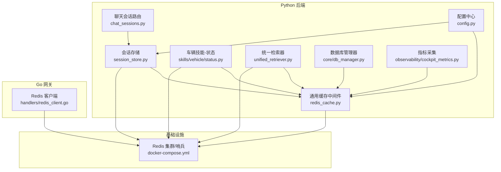
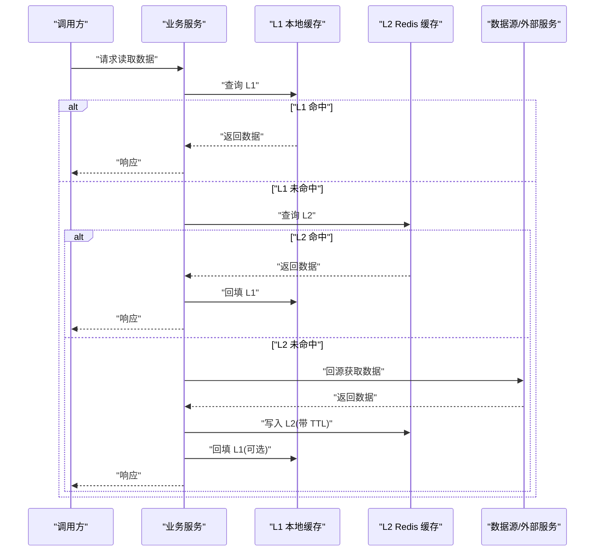
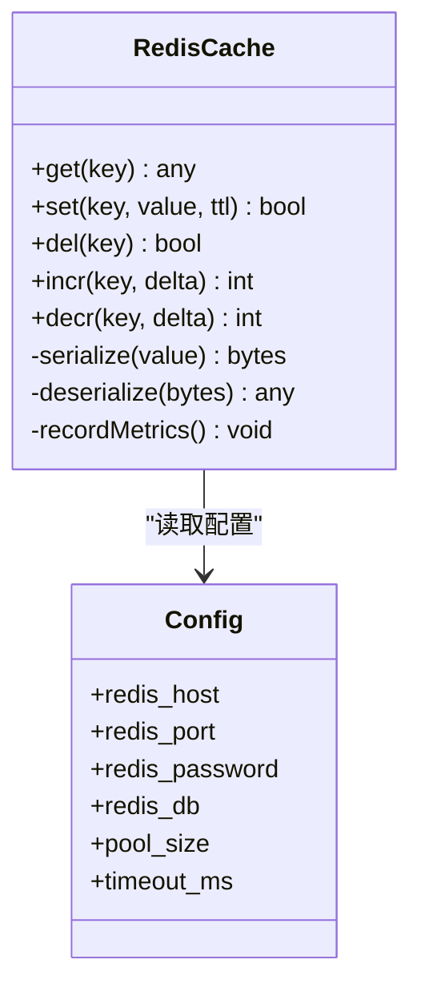
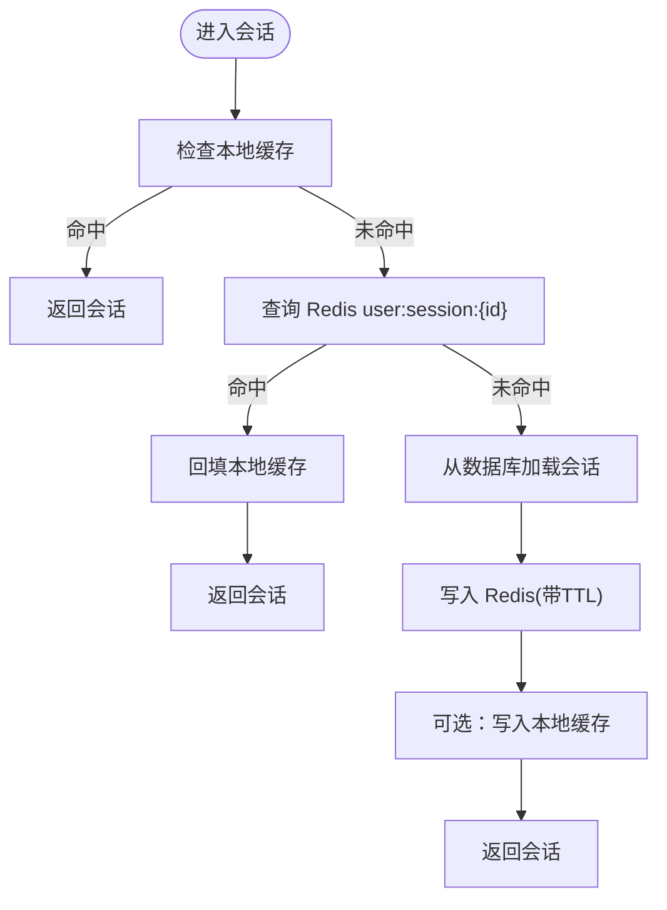
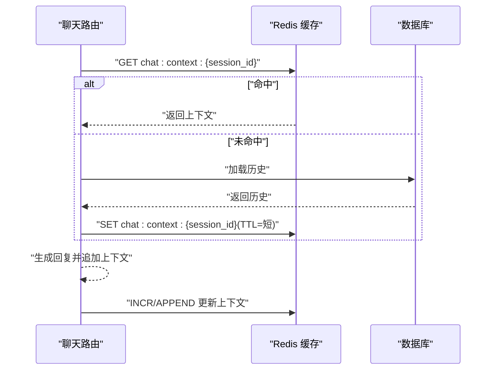
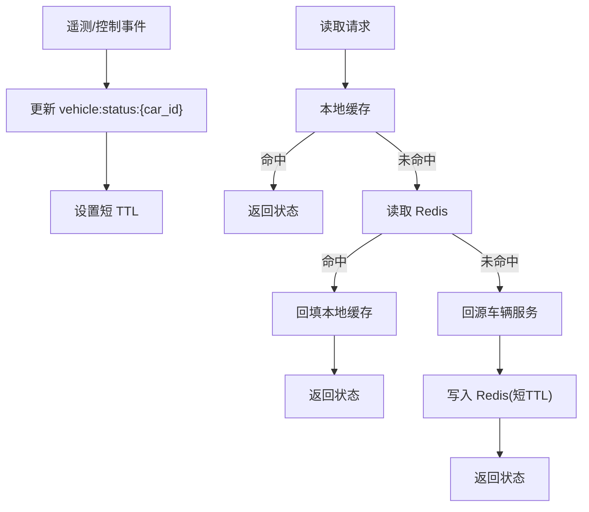
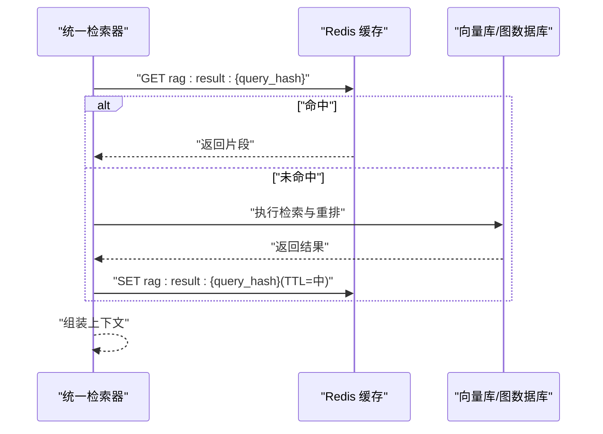
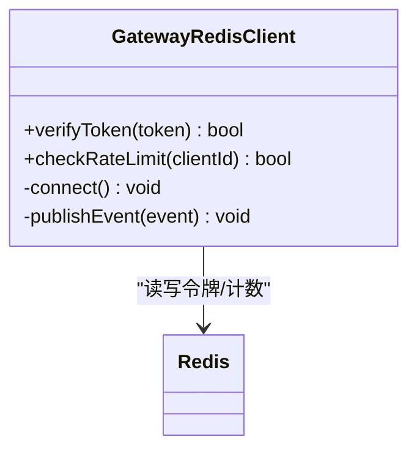
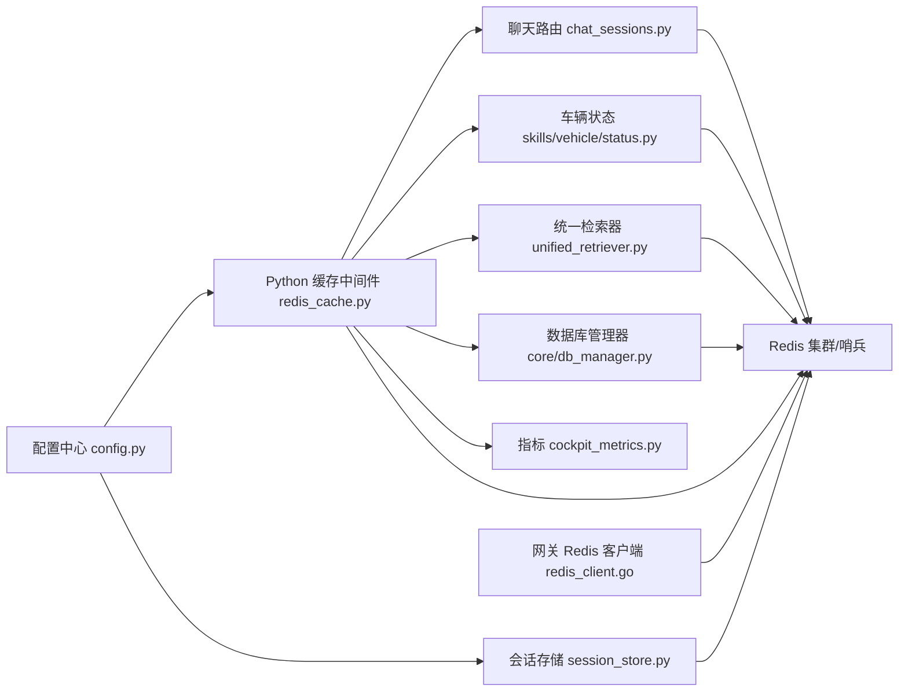

# 缓存系统设计

<cite>
**本文引用的文件**
- [backend_design/nexus/middleware/redis_cache.py](file://backend_design/nexus/middleware/redis_cache.py)
- [backend_design/nexus/middleware/session_store.py](file://backend_design/nexus/middleware/session_store.py)
- [backend_design/nexus/api/routes/chat_sessions.py](file://backend_design/nexus/api/routes/chat_sessions.py)
- [backend_design/nexus/api/routes/vehicle.py](file://backend_design/nexus/api/routes/vehicle.py)
- [backend_design/nexus/core/db_manager.py](file://backend_design/nexus/core/db_manager.py)
- [backend_design/nexus/config.py](file://backend_design/nexus/config.py)
- [backend_design/nexus/observability/cockpit_metrics.py](file://backend_design/nexus/observability/cockpit_metrics.py)
- [backend_design/nexus/rag/unified_retriever.py](file://backend_design/nexus/rag/unified_retriever.py)
- [backend_design/nexus/skills/vehicle/status.py](file://backend_design/nexus/skills/vehicle/status.py)
- [backend_design/nexus_gate/internal/handlers/redis_client.go](file://backend_design/nexus_gate/internal/handlers/redis_client.go)
- [docker-compose.yml](file://docker-compose.yml)
</cite>

## 目录
1. [引言](#引言)
2. [项目结构](#项目结构)
3. [核心组件](#核心组件)
4. [架构总览](#架构总览)
5. [详细组件分析](#详细组件分析)
6. [依赖分析](#依赖分析)
7. [性能考虑](#性能考虑)
8. [故障排查指南](#故障排查指南)
9. [结论](#结论)
10. [附录](#附录)

## 引言
本设计文档聚焦于 NexusCockpit 系统的缓存体系，围绕 Redis 作为分布式缓存的核心角色，结合本地缓存与分布式缓存的分层策略，给出统一的键命名规范、数据分层与过期策略、一致性保障机制、高可用部署方案以及监控与优化建议。目标是让读者在理解现有实现的基础上，能够安全扩展新的缓存场景并保持系统稳定与高性能。

## 项目结构
NexusCockpit 的缓存相关能力主要分布在以下模块：
- Python 后端（FastAPI）：提供会话存储、通用缓存中间件、RAG 检索结果缓存、车辆状态缓存等
- Go 网关：提供轻量级 Redis 客户端用于鉴权、限流等场景
- 配置与编排：集中管理 Redis 连接参数与集群/哨兵模式配置
- 可观测性：暴露缓存命中率、延迟等指标

图表来源
- [backend_design/nexus/middleware/redis_cache.py](file://backend_design/nexus/middleware/redis_cache.py)
- [backend_design/nexus/middleware/session_store.py](file://backend_design/nexus/middleware/session_store.py)
- [backend_design/nexus/api/routes/chat_sessions.py](file://backend_design/nexus/api/routes/chat_sessions.py)
- [backend_design/nexus/skills/vehicle/status.py](file://backend_design/nexus/skills/vehicle/status.py)
- [backend_design/nexus/rag/unified_retriever.py](file://backend_design/nexus/rag/unified_retriever.py)
- [backend_design/nexus/core/db_manager.py](file://backend_design/nexus/core/db_manager.py)
- [backend_design/nexus/config.py](file://backend_design/nexus/config.py)
- [backend_design/nexus/observability/cockpit_metrics.py](file://backend_design/nexus/observability/cockpit_metrics.py)
- [backend_design/nexus_gate/internal/handlers/redis_client.go](file://backend_design/nexus_gate/internal/handlers/redis_client.go)
- [docker-compose.yml](file://docker-compose.yml)

章节来源
- [backend_design/nexus/middleware/redis_cache.py](file://backend_design/nexus/middleware/redis_cache.py)
- [backend_design/nexus/middleware/session_store.py](file://backend_design/nexus/middleware/session_store.py)
- [backend_design/nexus/api/routes/chat_sessions.py](file://backend_design/nexus/api/routes/chat_sessions.py)
- [backend_design/nexus/skills/vehicle/status.py](file://backend_design/nexus/skills/vehicle/status.py)
- [backend_design/nexus/rag/unified_retriever.py](file://backend_design/nexus/rag/unified_retriever.py)
- [backend_design/nexus/core/db_manager.py](file://backend_design/nexus/core/db_manager.py)
- [backend_design/nexus/config.py](file://backend_design/nexus/config.py)
- [backend_design/nexus/observability/cockpit_metrics.py](file://backend_design/nexus/observability/cockpit_metrics.py)
- [backend_design/nexus_gate/internal/handlers/redis_client.go](file://backend_design/nexus_gate/internal/handlers/redis_client.go)
- [docker-compose.yml](file://docker-compose.yml)

## 核心组件
- 通用缓存中间件：封装 Redis 连接、序列化、TTL 管理、错误处理与指标上报，为上层业务提供 get/set/del 等原子操作
- 会话存储：基于 Redis 的用户会话持久化，支持按用户维度隔离与自动过期
- RAG 检索结果缓存：对向量检索与重排后的片段进行短期缓存，降低重复计算
- 车辆状态缓存：将车辆实时状态写入 Redis，供多服务共享读取
- 网关侧 Redis 客户端：用于鉴权令牌校验、限流计数等轻量读写

章节来源
- [backend_design/nexus/middleware/redis_cache.py](file://backend_design/nexus/middleware/redis_cache.py)
- [backend_design/nexus/middleware/session_store.py](file://backend_design/nexus/middleware/session_store.py)
- [backend_design/nexus/rag/unified_retriever.py](file://backend_design/nexus/rag/unified_retriever.py)
- [backend_design/nexus/skills/vehicle/status.py](file://backend_design/nexus/skills/vehicle/status.py)
- [backend_design/nexus_gate/internal/handlers/redis_client.go](file://backend_design/nexus_gate/internal/handlers/redis_client.go)

## 架构总览
整体采用“本地缓存 + 分布式缓存”的分层策略：
- L1 本地缓存：进程内内存缓存，适合热点小对象，减少跨进程网络开销
- L2 分布式缓存：Redis 集群/哨兵，保证跨实例一致性与高可用
- 写路径：优先更新 L2，再异步或同步刷新 L1；必要时使用失效通知或版本号避免脏读
- 读路径：先查 L1，未命中再查 L2，最后回源 DB/外部服务并回填 L1/L2

[此图为概念流程，不直接映射具体源码文件]

## 详细组件分析

### 通用缓存中间件（Redis 抽象层）
职责与特性
- 连接管理：从配置加载 Redis 地址、密码、DB 索引、连接池大小、超时等
- 序列化：统一 JSON 序列化/反序列化，支持自定义编码器
- 原子操作：提供 get/set/del/incr/decr 等基础接口
- 过期策略：统一 TTL 设置，支持按业务域差异化过期时间
- 错误处理：连接异常重试、降级到直连数据源
- 指标上报：记录命中率、延迟、错误率等

图表来源
- [backend_design/nexus/middleware/redis_cache.py](file://backend_design/nexus/middleware/redis_cache.py)
- [backend_design/nexus/config.py](file://backend_design/nexus/config.py)

章节来源
- [backend_design/nexus/middleware/redis_cache.py](file://backend_design/nexus/middleware/redis_cache.py)
- [backend_design/nexus/config.py](file://backend_design/nexus/config.py)

### 用户会话缓存（Session Store）
设计要点
- 键命名规范：user:session:{id}，其中 id 为用户会话标识
- 数据结构：JSON 序列化的会话上下文（如用户信息、权限、偏好）
- 过期策略：根据登录态与活动频率设置合理 TTL，空闲会话主动清理
- 一致性：会话更新时先写 Redis，再按需同步至持久化存储
- 安全性：敏感字段加密存储，限制访问范围

图表来源
- [backend_design/nexus/middleware/session_store.py](file://backend_design/nexus/middleware/session_store.py)
- [backend_design/nexus/middleware/redis_cache.py](file://backend_design/nexus/middleware/redis_cache.py)

章节来源
- [backend_design/nexus/middleware/session_store.py](file://backend_design/nexus/middleware/session_store.py)
- [backend_design/nexus/middleware/redis_cache.py](file://backend_design/nexus/middleware/redis_cache.py)

### 聊天会话与对话上下文缓存
设计要点
- 键命名规范：chat:context:{session_id}，用于保存 AI 对话历史摘要或关键上下文
- 过期策略：短 TTL（分钟级），随会话生命周期清理
- 更新策略：增量追加，定期压缩摘要，避免键过大
- 一致性：会话结束或切换时触发失效，确保新会话上下文干净

图表来源
- [backend_design/nexus/api/routes/chat_sessions.py](file://backend_design/nexus/api/routes/chat_sessions.py)
- [backend_design/nexus/middleware/redis_cache.py](file://backend_design/nexus/middleware/redis_cache.py)

章节来源
- [backend_design/nexus/api/routes/chat_sessions.py](file://backend_design/nexus/api/routes/chat_sessions.py)
- [backend_design/nexus/middleware/redis_cache.py](file://backend_design/nexus/middleware/redis_cache.py)

### 车辆状态缓存
设计要点
- 键命名规范：vehicle:status:{car_id}，value 为车辆状态 JSON
- 更新策略：由车辆遥测或服务推送触发更新，设置较短 TTL（秒级）
- 一致性：多实例共享同一 key，后写覆盖前值；必要时引入版本号或时间戳
- 热点保护：对高频读取的热门车辆状态启用本地缓存

图表来源
- [backend_design/nexus/skills/vehicle/status.py](file://backend_design/nexus/skills/vehicle/status.py)
- [backend_design/nexus/middleware/redis_cache.py](file://backend_design/nexus/middleware/redis_cache.py)

章节来源
- [backend_design/nexus/skills/vehicle/status.py](file://backend_design/nexus/skills/vehicle/status.py)
- [backend_design/nexus/middleware/redis_cache.py](file://backend_design/nexus/middleware/redis_cache.py)

### RAG 检索结果缓存
设计要点
- 键命名规范：rag:result:{query_hash}，hash 基于标准化后的查询文本
- 过期策略：中等 TTL（分钟级），兼顾新鲜度与复用率
- 更新策略：当底层知识库变更时，按集合或标签批量失效
- 一致性：检索结果包含版本标记，避免旧结果被复用

图表来源
- [backend_design/nexus/rag/unified_retriever.py](file://backend_design/nexus/rag/unified_retriever.py)
- [backend_design/nexus/middleware/redis_cache.py](file://backend_design/nexus/middleware/redis_cache.py)

章节来源
- [backend_design/nexus/rag/unified_retriever.py](file://backend_design/nexus/rag/unified_retriever.py)
- [backend_design/nexus/middleware/redis_cache.py](file://backend_design/nexus/middleware/redis_cache.py)

### 网关侧 Redis 客户端（鉴权与限流）
职责
- 鉴权：校验 JWT 或临时令牌，维护黑名单/白名单
- 限流：基于滑动窗口或固定窗口计数器，防止滥用
- 低耦合：通过独立客户端与主业务解耦，提升稳定性

图表来源
- [backend_design/nexus_gate/internal/handlers/redis_client.go](file://backend_design/nexus_gate/internal/handlers/redis_client.go)

章节来源
- [backend_design/nexus_gate/internal/handlers/redis_client.go](file://backend_design/nexus_gate/internal/handlers/redis_client.go)

## 依赖分析
- 配置依赖：所有缓存组件均依赖统一配置中心，便于切换集群/哨兵模式与参数调优
- 运行时依赖：Python 服务依赖 Redis 客户端库；Go 网关依赖 go-redis 或等效驱动
- 外部依赖：RAG 检索依赖向量库/图数据库；车辆状态依赖遥测服务

图表来源
- [backend_design/nexus/config.py](file://backend_design/nexus/config.py)
- [backend_design/nexus/middleware/redis_cache.py](file://backend_design/nexus/middleware/redis_cache.py)
- [backend_design/nexus/middleware/session_store.py](file://backend_design/nexus/middleware/session_store.py)
- [backend_design/nexus/api/routes/chat_sessions.py](file://backend_design/nexus/api/routes/chat_sessions.py)
- [backend_design/nexus/skills/vehicle/status.py](file://backend_design/nexus/skills/vehicle/status.py)
- [backend_design/nexus/rag/unified_retriever.py](file://backend_design/nexus/rag/unified_retriever.py)
- [backend_design/nexus/core/db_manager.py](file://backend_design/nexus/core/db_manager.py)
- [backend_design/nexus/observability/cockpit_metrics.py](file://backend_design/nexus/observability/cockpit_metrics.py)
- [backend_design/nexus_gate/internal/handlers/redis_client.go](file://backend_design/nexus_gate/internal/handlers/redis_client.go)

章节来源
- [backend_design/nexus/config.py](file://backend_design/nexus/config.py)
- [backend_design/nexus/middleware/redis_cache.py](file://backend_design/nexus/middleware/redis_cache.py)
- [backend_design/nexus/middleware/session_store.py](file://backend_design/nexus/middleware/session_store.py)
- [backend_design/nexus/api/routes/chat_sessions.py](file://backend_design/nexus/api/routes/chat_sessions.py)
- [backend_design/nexus/skills/vehicle/status.py](file://backend_design/nexus/skills/vehicle/status.py)
- [backend_design/nexus/rag/unified_retriever.py](file://backend_design/nexus/rag/unified_retriever.py)
- [backend_design/nexus/core/db_manager.py](file://backend_design/nexus/core/db_manager.py)
- [backend_design/nexus/observability/cockpit_metrics.py](file://backend_design/nexus/observability/cockpit_metrics.py)
- [backend_design/nexus_gate/internal/handlers/redis_client.go](file://backend_design/nexus_gate/internal/handlers/redis_client.go)

## 性能考虑
- 键空间与序列化
  - 使用紧凑的键命名与扁平结构，避免深层嵌套
  - 选择高效序列化格式（如 MessagePack）以降低带宽与 CPU 消耗
- 过期与淘汰
  - 按业务域设置差异化 TTL，热点数据短 TTL+本地缓存，冷数据长 TTL
  - 避免大量同时过期导致的雪崩，采用随机抖动
- 热点保护
  - 对高频读取的键启用本地缓存与互斥锁，避免缓存击穿
  - 使用布隆过滤器预判不存在键，减少穿透
- 批量与流水线
  - 合并多次读写为 pipeline，降低 RTT
  - 使用哈希类型聚合小对象，减少键数量
- 连接与资源
  - 合理设置连接池大小与超时，避免阻塞
  - 监控慢查询与大对象，及时拆分或归档

[本节为通用指导，不直接分析具体文件]

## 故障排查指南
常见问题与定位步骤
- 连接失败
  - 检查配置中的主机、端口、密码、DB 索引是否正确
  - 确认防火墙与安全组放行
  - 查看连接池是否耗尽
- 命中率低
  - 审查键命名与 TTL 是否合理
  - 分析热点分布，调整本地缓存策略
- 数据不一致
  - 检查写路径是否先写 Redis 再更新本地缓存
  - 确认失效策略是否覆盖所有更新入口
- 性能退化
  - 监控大对象与慢命令，优化序列化与键结构
  - 评估是否需要分片或扩容节点

章节来源
- [backend_design/nexus/middleware/redis_cache.py](file://backend_design/nexus/middleware/redis_cache.py)
- [backend_design/nexus/observability/cockpit_metrics.py](file://backend_design/nexus/observability/cockpit_metrics.py)

## 结论
通过“本地缓存 + Redis 分布式缓存”的分层设计与统一的键命名规范、过期策略与一致性机制，NexusCockpit 能够在高并发与多实例环境下保持稳定的性能与可用性。配合完善的监控与优化手段，系统可平滑应对热点数据、突发流量与知识更新带来的挑战。

[本节为总结，不直接分析具体文件]

## 附录

### 键命名规范
- 用户会话：user:session:{id}
- 车辆状态：vehicle:status:{car_id}
- 聊天上下文：chat:context:{session_id}
- RAG 检索结果：rag:result:{query_hash}

[本节为规范说明，不直接分析具体文件]

### 过期时间与更新策略建议
- 用户会话：TTL 与登录态一致，空闲会话主动清理
- 车辆状态：短 TTL（秒级），事件驱动更新
- 聊天上下文：短 TTL（分钟级），会话结束时失效
- RAG 结果：中 TTL（分钟级），知识库变更时批量失效

[本节为策略建议，不直接分析具体文件]

### 一致性保障机制
- 失效策略：写后即删或写后即改版本号，消费者感知变化
- 数据同步：先写 Redis，再异步落库；必要时引入补偿任务
- 热点处理：本地缓存+互斥锁+布隆过滤器组合防护

[本节为机制说明，不直接分析具体文件]

### Redis 集群与哨兵部署
- 集群模式：多主多从，水平扩展，适合大规模键空间
- 哨兵模式：主从复制+自动故障转移，适合中小规模
- 配置项：host/port/password/db/pool_size/timeout 等由配置中心统一管理

章节来源
- [docker-compose.yml](file://docker-compose.yml)
- [backend_design/nexus/config.py](file://backend_design/nexus/config.py)

### 监控指标与告警
- 命中率：成功读取数/总读取数
- 延迟：P50/P95/P99 延迟
- 错误率：连接失败、序列化失败、超时等
- 容量：内存使用量、键数量、淘汰率

章节来源
- [backend_design/nexus/observability/cockpit_metrics.py](file://backend_design/nexus/observability/cockpit_metrics.py)