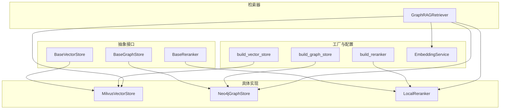
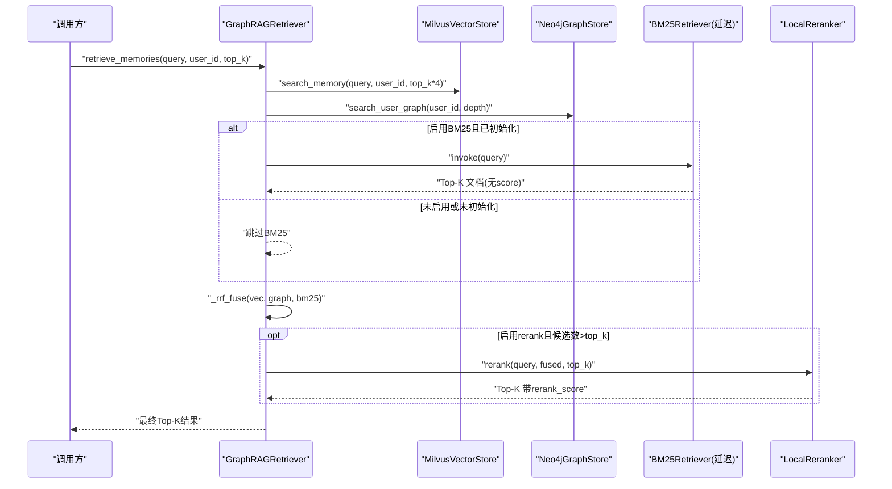
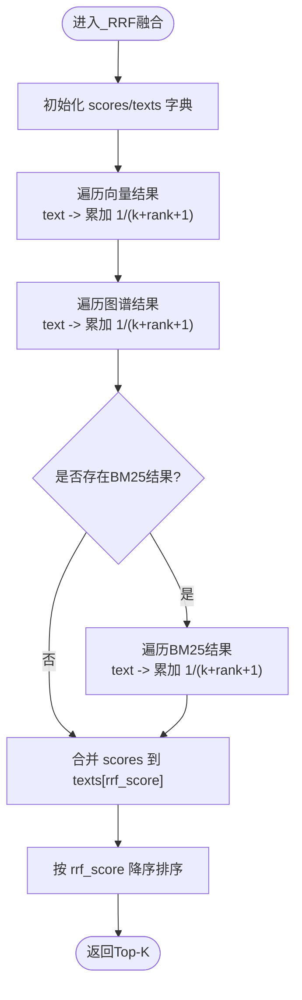
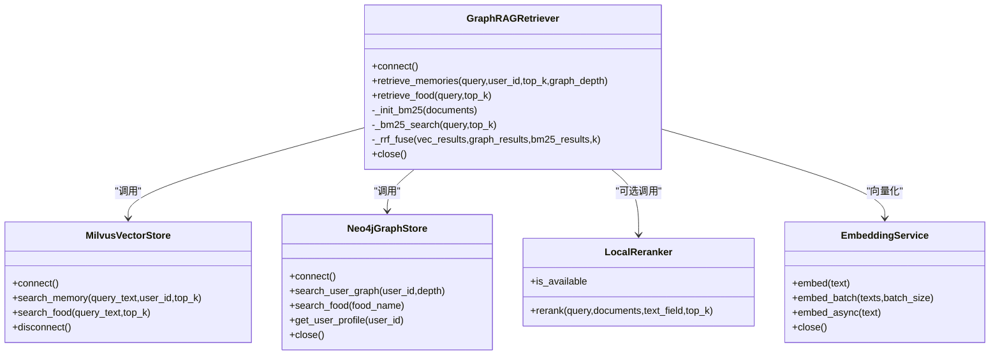

# GraphRAG检索器核心

<cite>
**本文引用的文件**   
- [retriever.py](file://backend_design/nexus/rag/retriever.py)
- [vector_store.py](file://backend_design/nexus/rag/vector_store.py)
- [graph_store.py](file://backend_design/nexus/rag/graph_store.py)
- [reranker.py](file://backend_design/nexus/rag/reranker.py)
- [reranker_base.py](file://backend_design/nexus/rag/reranker_base.py)
- [embedding.py](file://backend_design/nexus/rag/embedding.py)
- [vector_factory.py](file://backend_design/nexus/rag/vector_factory.py)
- [graph_factory.py](file://backend_design/nexus/rag/graph_factory.py)
- [reranker_factory.py](file://backend_design/nexus/rag/reranker_factory.py)
</cite>

## 目录
1. [简介](#简介)
2. [项目结构](#项目结构)
3. [核心组件](#核心组件)
4. [架构总览](#架构总览)
5. [详细组件分析](#详细组件分析)
6. [依赖关系分析](#依赖关系分析)
7. [性能考量](#性能考量)
8. [故障排查指南](#故障排查指南)
9. [结论](#结论)
10. [附录：使用示例与参数调优](#附录使用示例与参数调优)

## 简介
本技术文档围绕 GraphRAGRetriever 核心检索器，系统阐述三路融合检索架构（向量搜索 Milvus、图谱查询 Neo4j、BM25 全文检索）的协同工作机制；深入解析 RRF（Reciprocal Rank Fusion）融合算法的实现原理与参数调优策略；说明延迟初始化机制、BM25Retriever 集成与中文分词处理；并提供 retrieve_memories 与 retrieve_food 方法的使用示例，展示 enable_rerank 与 enable_bm25 开关的配置方式。同时给出性能优化建议与常见问题的故障排查指南。

## 项目结构
GraphRAGRetriever 位于 RAG 模块中，围绕“抽象基类 + 工厂构建 + 具体实现”的分层组织：
- 抽象接口：BaseVectorStore、BaseGraphStore、BaseReranker
- 具体实现：MilvusVectorStore、Neo4jGraphStore、LocalReranker
- 工厂构建：build_vector_store、build_graph_store、build_reranker
- 统一嵌入服务：EmbeddingService
- 检索器编排：GraphRAGRetriever（三路召回 + RRF 融合 + 可选 Rerank）

图表来源
- [vector_base.py:1-76](file://backend_design/nexus/rag/vector_base.py#L1-L76)
- [graph_base.py:1-61](file://backend_design/nexus/rag/graph_base.py#L1-L61)
- [reranker_base.py:1-50](file://backend_design/nexus/rag/reranker_base.py#L1-L50)
- [vector_store.py:1-417](file://backend_design/nexus/rag/vector_store.py#L1-L417)
- [graph_store.py:1-184](file://backend_design/nexus/rag/graph_store.py#L1-L184)
- [reranker.py:1-148](file://backend_design/nexus/rag/reranker.py#L1-L148)
- [vector_factory.py:1-34](file://backend_design/nexus/rag/vector_factory.py#L1-L34)
- [graph_factory.py:1-28](file://backend_design/nexus/rag/graph_factory.py#L1-L28)
- [reranker_factory.py:1-59](file://backend_design/nexus/rag/reranker_factory.py#L1-L59)
- [embedding.py:1-63](file://backend_design/nexus/rag/embedding.py#L1-L63)
- [retriever.py:1-189](file://backend_design/nexus/rag/retriever.py#L1-L189)

章节来源
- [retriever.py:1-189](file://backend_design/nexus/rag/retriever.py#L1-L189)
- [vector_store.py:1-417](file://backend_design/nexus/rag/vector_store.py#L1-L417)
- [graph_store.py:1-184](file://backend_design/nexus/rag/graph_store.py#L1-L184)
- [reranker.py:1-148](file://backend_design/nexus/rag/reranker.py#L1-L148)
- [embedding.py:1-63](file://backend_design/nexus/rag/embedding.py#L1-L63)
- [vector_factory.py:1-34](file://backend_design/nexus/rag/vector_factory.py#L1-L34)
- [graph_factory.py:1-28](file://backend_design/nexus/rag/graph_factory.py#L1-L28)
- [reranker_factory.py:1-59](file://backend_design/nexus/rag/reranker_factory.py#L1-L59)

## 核心组件
- GraphRAGRetriever：三路召回编排器，负责调用向量、图谱、BM25 并执行 RRF 融合与可选重排。
- MilvusVectorStore：基于 MilvusClient 的向量存储，维护 Food_List 与 User_Memory 两个集合，提供语义检索与插入删除能力。
- Neo4jGraphStore：基于 langchain_neo4j.Neo4jGraph 的图谱存储，支持用户关系图查询、食材匹配与画像获取。
- LocalReranker：本地 BGE CrossEncoder 重排器，对 Top-N 结果进行二次排序。
- EmbeddingService：统一文本向量化服务，封装 OpenAIEmbeddings 的异步批量能力。
- 工厂类：固定返回本地 Milvus、Neo4j 与本地 BGE reranker（或 none 模式）。

章节来源
- [retriever.py:48-189](file://backend_design/nexus/rag/retriever.py#L48-L189)
- [vector_store.py:36-417](file://backend_design/nexus/rag/vector_store.py#L36-L417)
- [graph_store.py:26-184](file://backend_design/nexus/rag/graph_store.py#L26-L184)
- [reranker.py:34-148](file://backend_design/nexus/rag/reranker.py#L34-L148)
- [embedding.py:23-63](file://backend_design/nexus/rag/embedding.py#L23-L63)
- [vector_factory.py:21-34](file://backend_design/nexus/rag/vector_factory.py#L21-L34)
- [graph_factory.py:20-28](file://backend_design/nexus/rag/graph_factory.py#L20-L28)
- [reranker_factory.py:45-59](file://backend_design/nexus/rag/reranker_factory.py#L45-L59)

## 架构总览
GraphRAGRetriever 在检索时并行触发三条召回路径，随后通过 RRF 合并排序，最后可进入 reranker 做精细重排。

图表来源
- [retriever.py:128-148](file://backend_design/nexus/rag/retriever.py#L128-L148)
- [vector_store.py:201-231](file://backend_design/nexus/rag/vector_store.py#L201-L231)
- [graph_store.py:102-132](file://backend_design/nexus/rag/graph_store.py#L102-L132)
- [reranker.py:79-139](file://backend_design/nexus/rag/reranker.py#L79-L139)

## 详细组件分析

### GraphRAGRetriever 三路融合与RRF
- 三路召回
  - 向量路：MilvusVectorStore.search_memory 返回结构化记忆条目（含 text、score、timestamp 等）。
  - 图谱路：Neo4jGraphStore.search_user_graph 返回用户关系的自然语言描述字符串列表。
  - BM25路：langchain_community.BM25Retriever 按关键词匹配，返回文档列表（无分数），内部用 rank 近似为 score。
- RRF 融合
  - 以文本内容为键聚合得分，累加 1/(k+rank+1)，默认 k=60。
  - 将各路的 source 标记为 vector/graph/bm25，并写入 rrf_score。
- 可选重排
  - 若 enable_rerank=True 且候选数大于 top_k，则调用 reranker.rerank 输出 rerank_score。
- 延迟初始化
  - BM25Retriever 仅在首次需要时通过 _init_bm25(documents) 创建，避免不必要的依赖加载。
  - 中文分词：_chinese_tokenize 优先 jieba 分词，降级为逐字切分；英文按空格提取。

图表来源
- [retriever.py:150-182](file://backend_design/nexus/rag/retriever.py#L150-L182)

章节来源
- [retriever.py:34-46](file://backend_design/nexus/rag/retriever.py#L34-L46)
- [retriever.py:89-108](file://backend_design/nexus/rag/retriever.py#L89-L108)
- [retriever.py:110-127](file://backend_design/nexus/rag/retriever.py#L110-L127)
- [retriever.py:128-148](file://backend_design/nexus/rag/retriever.py#L128-L148)
- [retriever.py:150-182](file://backend_design/nexus/rag/retriever.py#L150-L182)

### MilvusVectorStore 向量检索
- 集合管理
  - Food_List：item_name/category/cate_* 字段，用于食材库检索。
  - User_Memory：user_id/session_id/vector/text/timestamp，支持会话级隔离与清理。
- 维度与Schema校验
  - 连接时检查向量维度与字段完整性，不匹配则重建集合，避免数据不一致。
- 检索接口
  - search_memory：按 user_id 过滤，返回 text/score/timestamp。
  - search_food：返回 item_name 及分类信息。
- LangChain 适配
  - as_langchain_store 暴露标准 Milvus 实例，便于通用 RAG 场景。

章节来源
- [vector_store.py:45-57](file://backend_design/nexus/rag/vector_store.py#L45-L57)
- [vector_store.py:106-146](file://backend_design/nexus/rag/vector_store.py#L106-L146)
- [vector_store.py:148-199](file://backend_design/nexus/rag/vector_store.py#L148-L199)
- [vector_store.py:201-231](file://backend_design/nexus/rag/vector_store.py#L201-L231)
- [vector_store.py:326-358](file://backend_design/nexus/rag/vector_store.py#L326-L358)
- [vector_store.py:360-390](file://backend_design/nexus/rag/vector_store.py#L360-L390)

### Neo4jGraphStore 图谱查询
- 连接与约束
  - 使用 langchain_neo4j.Neo4jGraph 自动管理连接池与索引，初始化唯一性与名称索引。
- 查询能力
  - search_user_graph：支持 1 阶与多阶关系遍历，返回关系路径字符串。
  - search_food：精确匹配 Food.name。
  - get_user_profile：返回用户画像（关系、目标类型、milvus_id）。
- 生命周期
  - connect/close 幂等管理连接状态。

章节来源
- [graph_store.py:40-58](file://backend_design/nexus/rag/graph_store.py#L40-L58)
- [graph_store.py:60-68](file://backend_design/nexus/rag/graph_store.py#L60-L68)
- [graph_store.py:102-132](file://backend_design/nexus/rag/graph_store.py#L102-L132)
- [graph_store.py:134-144](file://backend_design/nexus/rag/graph_store.py#L134-L144)
- [graph_store.py:146-166](file://backend_design/nexus/rag/graph_store.py#L146-L166)
- [graph_store.py:178-184](file://backend_design/nexus/rag/graph_store.py#L178-L184)

### LocalReranker 重排器
- 模型加载
  - 首次调用时延迟加载 bge-reranker-v2-m3（CrossEncoder），失败则回退原序。
- 推理流程
  - 构造 query-doc 对，批量 predict，按分数降序取 Top-K，写入 rerank_score。
- 可用性检测
  - is_available 不触发加载，仅检查模型路径与错误状态。

章节来源
- [reranker.py:52-77](file://backend_design/nexus/rag/reranker.py#L52-L77)
- [reranker.py:79-139](file://backend_design/nexus/rag/reranker.py#L79-L139)
- [reranker.py:141-147](file://backend_design/nexus/rag/reranker.py#L141-L147)

### EmbeddingService 统一向量化
- 封装 OpenAIEmbeddings，提供 embed/embed_batch/embed_async 异步接口。
- 异常与空输入保护，返回零向量兜底。

章节来源
- [embedding.py:30-63](file://backend_design/nexus/rag/embedding.py#L30-L63)

### 工厂与配置
- build_vector_store：固定返回 MilvusVectorStore。
- build_graph_store：固定返回 Neo4jGraphStore。
- build_reranker：根据配置选择 local BGE 或 none（NoneReranker）。

章节来源
- [vector_factory.py:21-34](file://backend_design/nexus/rag/vector_factory.py#L21-L34)
- [graph_factory.py:20-28](file://backend_design/nexus/rag/graph_factory.py#L20-L28)
- [reranker_factory.py:45-59](file://backend_design/nexus/rag/reranker_factory.py#L45-L59)

## 依赖关系分析
- GraphRAGRetriever 依赖：
  - BaseVectorStore/MilvusVectorStore（向量检索）
  - Neo4jGraphStore（图谱检索）
  - BaseReranker/LocalReranker（可选重排）
  - EmbeddingService（向量化）
  - langchain_community.BM25Retriever（全文检索，延迟加载）
- 工厂解耦：
  - 通过 build_* 函数屏蔽后端差异，便于替换与降级。

图表来源
- [retriever.py:48-189](file://backend_design/nexus/rag/retriever.py#L48-L189)
- [vector_store.py:36-417](file://backend_design/nexus/rag/vector_store.py#L36-L417)
- [graph_store.py:26-184](file://backend_design/nexus/rag/graph_store.py#L26-L184)
- [reranker.py:34-148](file://backend_design/nexus/rag/reranker.py#L34-L148)
- [embedding.py:23-63](file://backend_design/nexus/rag/embedding.py#L23-L63)

章节来源
- [retriever.py:48-189](file://backend_design/nexus/rag/retriever.py#L48-L189)
- [vector_store.py:36-417](file://backend_design/nexus/rag/vector_store.py#L36-L417)
- [graph_store.py:26-184](file://backend_design/nexus/rag/graph_store.py#L26-L184)
- [reranker.py:34-148](file://backend_design/nexus/rag/reranker.py#L34-L148)
- [embedding.py:23-63](file://backend_design/nexus/rag/embedding.py#L23-L63)

## 性能考量
- 召回规模控制
  - 向量路 top_k*4 召回，BM25 路 top_k*2，RRF 后取 top_k，平衡召回率与延迟。
- 延迟初始化
  - BM25Retriever 按需创建，避免冷启动开销；reranker 模型懒加载，首次调用才加载。
- 索引与维度一致性
  - Milvus 连接时校验向量维度与字段完整性，不匹配自动重建，减少运行时异常。
- 资源占用
  - reranker 本地模型约数百 MB，CPU 推理约 200ms/20条；可按需关闭 rerank 降低延迟。
- 并发与批处理
  - EmbeddingService 支持批量向量化，提升吞吐；BM25 单次 invoke 适合小批量。

[本节为通用指导，不直接分析具体文件]

## 故障排查指南
- BM25 不可用
  - 现象：BM25 检索结果为空或日志提示未安装依赖。
  - 排查：确认 langchain-community 已安装；检查 _init_bm25 是否被调用；查看 enable_bm25 标志位。
  - 参考：[retriever.py:89-108](file://backend_design/nexus/rag/retriever.py#L89-L108)
- 重排失败或不可用
  - 现象：rerank 抛出异常或 is_available=False。
  - 排查：确认模型路径存在；检查 sentence-transformers 依赖；查看 _ensure_loaded 的错误信息。
  - 参考：[reranker.py:52-77](file://backend_design/nexus/rag/reranker.py#L52-L77), [reranker.py:141-147](file://backend_design/nexus/rag/reranker.py#L141-L147)
- 向量库连接失败
  - 现象：connect 抛错或 is_connected=False。
  - 排查：检查 Milvus uri、index_type/metric_type/search_params 配置；确认集合维度一致。
  - 参考：[vector_store.py:45-57](file://backend_design/nexus/rag/vector_store.py#L45-L57), [vector_store.py:59-84](file://backend_design/nexus/rag/vector_store.py#L59-L84)
- 图谱连接失败
  - 现象：connect 抛错或 health/admin 路由无法探测连接。
  - 排查：检查 Neo4j uri/user/password；确认驱动可用；查看 _init_constraints 是否成功。
  - 参考：[graph_store.py:40-58](file://backend_design/nexus/rag/graph_store.py#L40-L58), [graph_store.py:60-68](file://backend_design/nexus/rag/graph_store.py#L60-L68)
- 中文分词效果不佳
  - 现象：BM25 召回质量低。
  - 排查：确认 jieba 可用；否则回退逐字切分；必要时调整 preprocess_func。
  - 参考：[retriever.py:34-46](file://backend_design/nexus/rag/retriever.py#L34-L46)

章节来源
- [retriever.py:89-108](file://backend_design/nexus/rag/retriever.py#L89-L108)
- [reranker.py:52-77](file://backend_design/nexus/rag/reranker.py#L52-L77)
- [vector_store.py:45-57](file://backend_design/nexus/rag/vector_store.py#L45-L57)
- [graph_store.py:40-58](file://backend_design/nexus/rag/graph_store.py#L40-L58)
- [retriever.py:34-46](file://backend_design/nexus/rag/retriever.py#L34-L46)

## 结论
GraphRAGRetriever 通过向量、图谱与 BM25 三路召回，结合 RRF 融合与可选 reranker 重排，兼顾召回广度与排序精度。其延迟初始化与工厂化设计有效降低了冷启动成本与耦合度。合理配置 enable_rerank、enable_bm25 与召回规模，可在延迟与精度之间取得良好平衡。

[本节为总结性内容，不直接分析具体文件]

## 附录：使用示例与参数调优

### 基本用法示例
- 初始化与连接
  - 通过工厂构建向量与图谱存储，传入可选 embedding_service；如需自建 vector_store 可直接传入。
  - 调用 connect() 建立所有后端连接。
- 检索用户记忆
  - 调用 retrieve_memories(query, user_id, top_k, graph_depth)。
  - 若 enable_bm25=True 且已初始化 BM25，将参与融合；若 enable_rerank=True 且候选数>top_k，将进行重排。
- 检索食材
  - 调用 retrieve_food(query, top_k)。
  - 先走向量检索，再尝试图谱精确匹配，若命中且不在向量结果中则前置插入。

章节来源
- [retriever.py:59-87](file://backend_design/nexus/rag/retriever.py#L59-L87)
- [retriever.py:128-148](file://backend_design/nexus/rag/retriever.py#L128-L148)

### RRF 参数调优
- k 值（默认 60）
  - 增大 k 会弱化排名位置的影响，使更多候选有机会进入 Top-K；减小 k 更强调头部排名。
- 三路召回规模
  - 向量路 top_k*4、BM25 路 top_k*2，可根据业务数据分布与延迟预算调整。
- 重排开关
  - enable_rerank=True 提升精度但增加延迟；生产环境可按 QPS 与延迟目标动态切换。

章节来源
- [retriever.py:150-182](file://backend_design/nexus/rag/retriever.py#L150-L182)

### 开关与配置
- enable_rerank
  - True：启用 reranker（本地 BGE 或 none 模式）；False：跳过重排。
- enable_bm25
  - True：启用 BM25 全文检索（需 langchain-community）；False：禁用。
- 工厂选择
  - build_reranker 根据配置选择 local BGE 或 none；build_vector_store/build_graph_store 固定本地实现。

章节来源
- [retriever.py:65-80](file://backend_design/nexus/rag/retriever.py#L65-L80)
- [reranker_factory.py:45-59](file://backend_design/nexus/rag/reranker_factory.py#L45-L59)
- [vector_factory.py:21-34](file://backend_design/nexus/rag/vector_factory.py#L21-L34)
- [graph_factory.py:20-28](file://backend_design/nexus/rag/graph_factory.py#L20-L28)

### 中文分词处理
- 优先级：jieba 分词 > 逐字切分；英文按空格提取。
- 若 jieba 缺失，将退化至逐字切分，可能影响 BM25 召回质量。

章节来源
- [retriever.py:34-46](file://backend_design/nexus/rag/retriever.py#L34-L46)