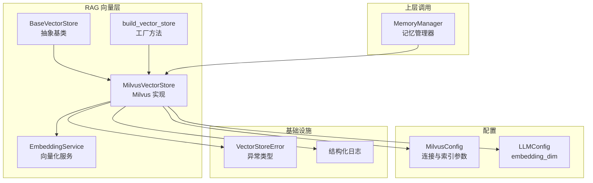
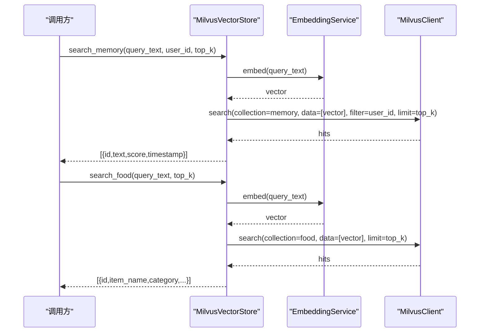
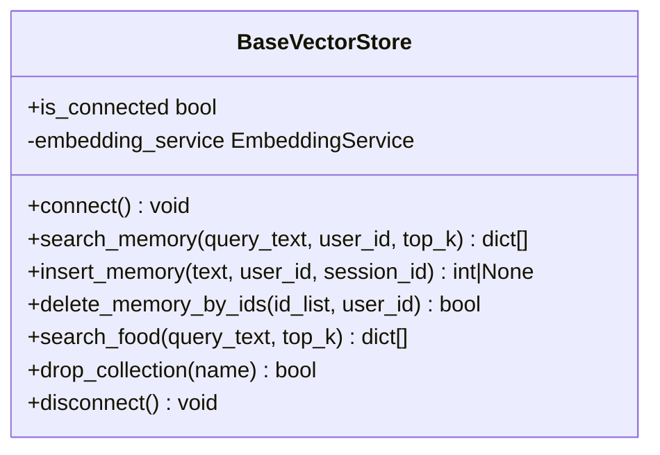
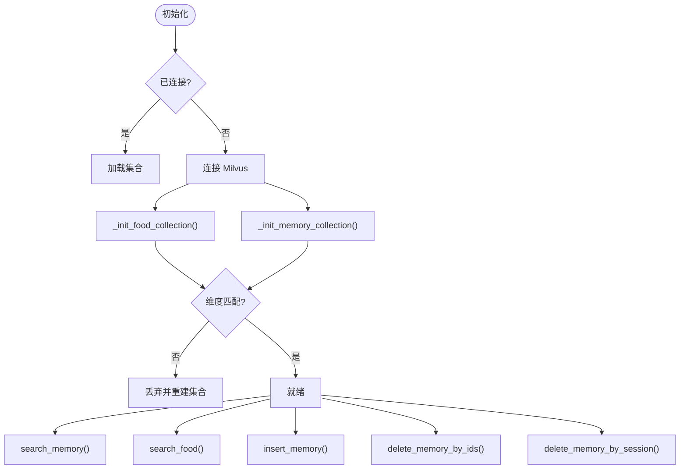
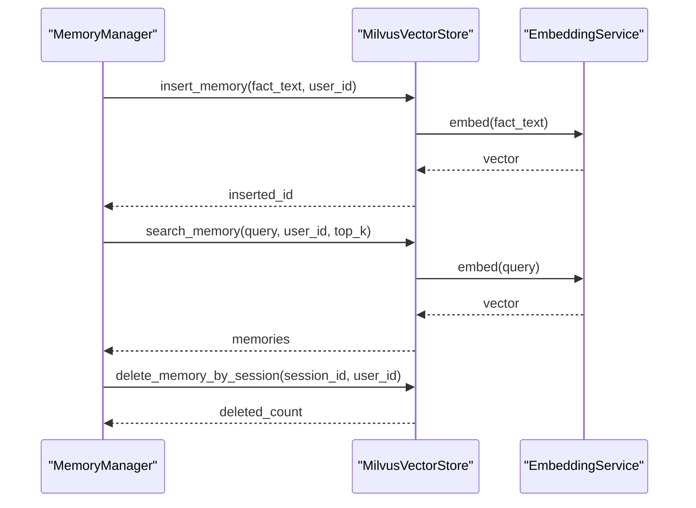
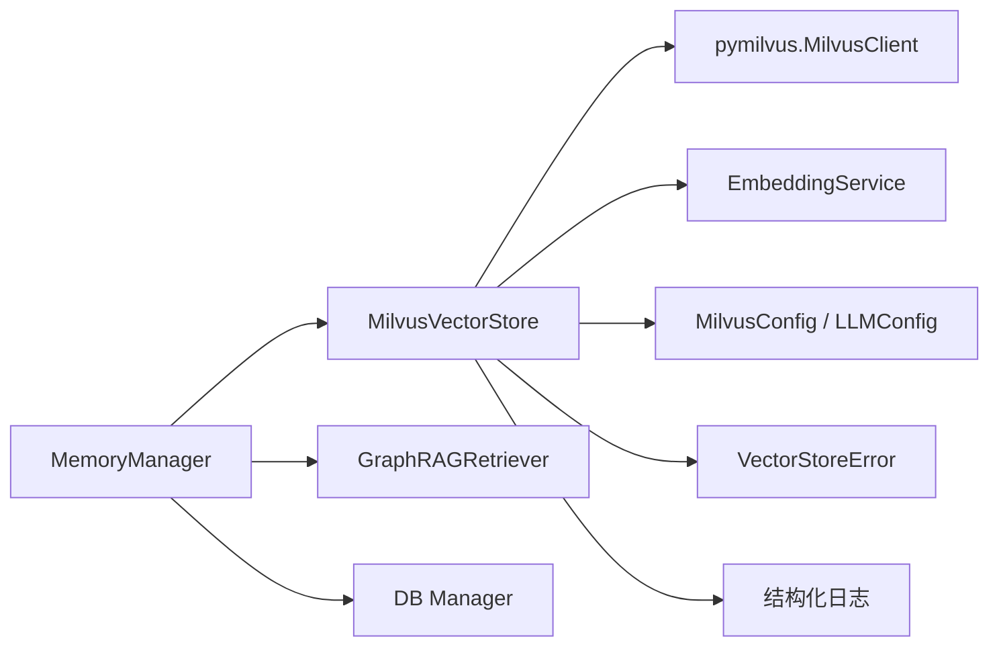

# 向量存储层

<cite>
**本文引用的文件**   
- [vector_base.py](file://backend_design/nexus/rag/vector_base.py)
- [vector_store.py](file://backend_design/nexus/rag/vector_store.py)
- [vector_factory.py](file://backend_design/nexus/rag/vector_factory.py)
- [embedding.py](file://backend_design/nexus/rag/embedding.py)
- [database.py](file://backend_design/nexus/config/database.py)
- [llm.py](file://backend_design/nexus/config/llm.py)
- [exceptions.py](file://backend_design/nexus/core/exceptions.py)
- [logger.py](file://backend_design/nexus/core/logger.py)
- [manager.py](file://backend_design/nexus/memory/manager.py)
</cite>

## 目录
1. [简介](#简介)
2. [项目结构](#项目结构)
3. [核心组件](#核心组件)
4. [架构总览](#架构总览)
5. [详细组件分析](#详细组件分析)
6. [依赖关系分析](#依赖关系分析)
7. [性能考量](#性能考量)
8. [故障排查指南](#故障排查指南)
9. [结论](#结论)
10. [附录](#附录)

## 简介
本技术文档聚焦于向量存储层的设计与实现，覆盖抽象基类 BaseVectorStore、Milvus 具体实现 MilvusVectorStore、向量工厂模式、索引构建与相似度计算、批量操作接口，以及 search_memory 与 search_food 方法的实现逻辑（含用户隔离与领域特定检索）。同时给出维度选择、索引参数配置、大规模数据处理最佳实践，以及连接池管理、错误重试与性能监控的实现示例。

## 项目结构
向量存储相关代码主要位于 backend_design/nexus/rag 目录下，配合配置模块 nexus/config 与异常/日志基础设施 nexus/core，记忆管理层 nexus/memory 通过统一管理器调用向量存储。

图表来源 
- [vector_base.py:22-76](file://backend_design/nexus/rag/vector_base.py#L22-L76)
- [vector_store.py:36-417](file://backend_design/nexus/rag/vector_store.py#L36-L417)
- [vector_factory.py:21-34](file://backend_design/nexus/rag/vector_factory.py#L21-L34)
- [embedding.py:23-63](file://backend_design/nexus/rag/embedding.py#L23-L63)
- [database.py:15-28](file://backend_design/nexus/config/database.py#L15-L28)
- [llm.py:15-31](file://backend_design/nexus/config/llm.py#L15-L31)
- [exceptions.py:56-61](file://backend_design/nexus/core/exceptions.py#L56-L61)
- [logger.py:218-228](file://backend_design/nexus/core/logger.py#L218-L228)

章节来源
- [vector_base.py:22-76](file://backend_design/nexus/rag/vector_base.py#L22-L76)
- [vector_store.py:36-417](file://backend_design/nexus/rag/vector_store.py#L36-L417)
- [vector_factory.py:21-34](file://backend_design/nexus/rag/vector_factory.py#L21-L34)
- [embedding.py:23-63](file://backend_design/nexus/rag/embedding.py#L23-L63)
- [database.py:15-28](file://backend_design/nexus/config/database.py#L15-L28)
- [llm.py:15-31](file://backend_design/nexus/config/llm.py#L15-L31)
- [exceptions.py:56-61](file://backend_design/nexus/core/exceptions.py#L56-L61)
- [logger.py:218-228](file://backend_design/nexus/core/logger.py#L218-L228)

## 核心组件
- BaseVectorStore：定义统一的向量存储接口（连接、搜索、插入、删除、集合管理、断开等），屏蔽后端差异。
- MilvusVectorStore：基于 pymilvus 3.x MilvusClient API 的具体实现，维护 Food_List 与 User_Memory 两个集合，提供语义检索与领域检索。
- EmbeddingService：统一文本向量化服务，内部委托给 LangChain 的 OpenAIEmbeddings，具备连接池、自动重试与异步能力。
- Vector Store Factory：固定返回本地 Milvus 实例，便于扩展其他后端时保持调用方不变。
- MemoryManager：记忆管理层，协调向量与图谱召回，并调用向量存储进行会话级清理与批量写入。

章节来源
- [vector_base.py:22-76](file://backend_design/nexus/rag/vector_base.py#L22-L76)
- [vector_store.py:36-417](file://backend_design/nexus/rag/vector_store.py#L36-L417)
- [embedding.py:23-63](file://backend_design/nexus/rag/embedding.py#L23-L63)
- [vector_factory.py:21-34](file://backend_design/nexus/rag/vector_factory.py#L21-L34)
- [manager.py:38-96](file://backend_design/nexus/memory/manager.py#L38-L96)

## 架构总览
下图展示从上层调用到向量存储的完整链路，包括嵌入生成、索引查询与结果组装。

图表来源 
- [vector_store.py:201-231](file://backend_design/nexus/rag/vector_store.py#L201-L231)
- [vector_store.py:326-358](file://backend_design/nexus/rag/vector_store.py#L326-L358)
- [embedding.py:36-48](file://backend_design/nexus/rag/embedding.py#L36-L48)

## 详细组件分析

### BaseVectorStore 抽象基类设计
- 职责：定义 connect、search_memory、insert_memory、delete_memory_by_ids、search_food、drop_collection、disconnect、is_connected 等统一接口。
- 设计要点：
  - 注入 EmbeddingService，使子类无需关心向量化细节。
  - 所有方法签名稳定，便于上层（如 MemoryManager）无感切换后端。
  - 支持 session_id 字段用于会话级隔离（由实现类在 schema 中体现）。

图表来源 
- [vector_base.py:22-76](file://backend_design/nexus/rag/vector_base.py#L22-L76)

章节来源
- [vector_base.py:22-76](file://backend_design/nexus/rag/vector_base.py#L22-L76)

### MilvusVectorStore 实现细节
- 集合与 Schema：
  - Food_List：包含 item_name、category_name、cate_1..3_name 及 vector 字段。
  - User_Memory：包含 user_id、session_id、text、timestamp 及 vector 字段，支持会话级隔离与清理。
- 索引与相似度：
  - 使用 HNSW 索引，metric_type 默认 IP（内积），可通过配置调整；search_params 控制 ef 等参数。
  - 维度来自 LLMConfig.embedding_dim，初始化时校验集合维度是否匹配，不匹配则重建。
- 连接与生命周期：
  - connect() 幂等创建/加载集合；disconnect() 关闭客户端；is_connected 标记状态。
- 领域检索：
  - search_memory：按 user_id 过滤进行语义检索，输出 text/id/score/timestamp。
  - search_food：面向食材库的通用检索，输出分类与名称字段。
- 批量与删除：
  - insert_memory：单条插入，返回主键 ID。
  - delete_memory_by_ids：按 id_list 与 user_id 安全删除。
  - delete_memory_by_session：按 session_id（可选 user_id）批量删除会话级向量。
- LangChain 集成：
  - as_langchain_store() 返回 langchain_milvus.Milvus 实例，适用于标准 schema 的通用知识库。

图表来源 
- [vector_store.py:45-57](file://backend_design/nexus/rag/vector_store.py#L45-L57)
- [vector_store.py:106-146](file://backend_design/nexus/rag/vector_store.py#L106-L146)
- [vector_store.py:148-199](file://backend_design/nexus/rag/vector_store.py#L148-L199)
- [vector_store.py:201-231](file://backend_design/nexus/rag/vector_store.py#L201-L231)
- [vector_store.py:233-262](file://backend_design/nexus/rag/vector_store.py#L233-L262)
- [vector_store.py:264-277](file://backend_design/nexus/rag/vector_store.py#L264-L277)
- [vector_store.py:279-324](file://backend_design/nexus/rag/vector_store.py#L279-L324)
- [vector_store.py:326-358](file://backend_design/nexus/rag/vector_store.py#L326-L358)

章节来源
- [vector_store.py:36-417](file://backend_design/nexus/rag/vector_store.py#L36-L417)

### EmbeddingService 向量化服务
- 功能：封装 aembed_query/aembed_documents，提供 embed、embed_async、embed_batch、close 接口。
- 特性：
  - 内部使用 LangChain 的 OpenAIEmbeddings，自带连接池与重试。
  - 空输入或关闭状态返回零向量，避免上层崩溃。
  - 异常统一抛出 LLMError，便于上层捕获与降级。

章节来源
- [embedding.py:23-63](file://backend_design/nexus/rag/embedding.py#L23-L63)

### Vector Store Factory 工厂模式
- 作用：固定返回 MilvusVectorStore 实例，屏蔽后端选择细节。
- 扩展性：新增后端时，可在工厂中增加分支或策略映射，保持 build_vector_store 接口稳定。

章节来源
- [vector_factory.py:21-34](file://backend_design/nexus/rag/vector_factory.py#L21-L34)

### MemoryManager 与向量存储协作
- 调用流程：
  - recall() 优先走 GraphRAGRetriever 三路融合，失败回退到向量检索。
  - store_from_text() 提取事实后双向写入 Milvus 与 Neo4j，失败补偿回滚。
  - store_conversation() 将对话片段向量化存储，支持 session_id 隔离。
  - delete_session_memories() 调用向量存储的会话级清理接口。

图表来源 
- [manager.py:212-300](file://backend_design/nexus/memory/manager.py#L212-L300)
- [manager.py:302-335](file://backend_design/nexus/memory/manager.py#L302-L335)
- [manager.py:434-453](file://backend_design/nexus/memory/manager.py#L434-L453)
- [vector_store.py:233-262](file://backend_design/nexus/rag/vector_store.py#L233-L262)
- [vector_store.py:201-231](file://backend_design/nexus/rag/vector_store.py#L201-L231)
- [vector_store.py:279-324](file://backend_design/nexus/rag/vector_store.py#L279-L324)

章节来源
- [manager.py:38-96](file://backend_design/nexus/memory/manager.py#L38-L96)
- [manager.py:212-300](file://backend_design/nexus/memory/manager.py#L212-L300)
- [manager.py:302-335](file://backend_design/nexus/memory/manager.py#L302-L335)
- [manager.py:434-453](file://backend_design/nexus/memory/manager.py#L434-L453)

## 依赖关系分析
- MilvusVectorStore 依赖：
  - pymilvus.MilvusClient：执行集合管理与向量检索。
  - EmbeddingService：生成 query/text 的 embedding。
  - 配置：MilvusConfig（连接、集合名、索引与搜索参数）、LLMConfig（embedding_dim）。
  - 异常与日志：VectorStoreError、结构化日志。
- MemoryManager 依赖：
  - MilvusVectorStore、Neo4jGraphStore、Reranker、LLM 客户端。
  - 数据库管理器：读取用户习惯与有效 session_id。

图表来源 
- [vector_store.py:25-33](file://backend_design/nexus/rag/vector_store.py#L25-L33)
- [database.py:15-28](file://backend_design/nexus/config/database.py#L15-L28)
- [llm.py:15-31](file://backend_design/nexus/config/llm.py#L15-L31)
- [exceptions.py:56-61](file://backend_design/nexus/core/exceptions.py#L56-L61)
- [logger.py:218-228](file://backend_design/nexus/core/logger.py#L218-L228)
- [manager.py:38-96](file://backend_design/nexus/memory/manager.py#L38-L96)

章节来源
- [vector_store.py:25-33](file://backend_design/nexus/rag/vector_store.py#L25-L33)
- [database.py:15-28](file://backend_design/nexus/config/database.py#L15-L28)
- [llm.py:15-31](file://backend_design/nexus/config/llm.py#L15-L31)
- [exceptions.py:56-61](file://backend_design/nexus/core/exceptions.py#L56-L61)
- [logger.py:218-228](file://backend_design/nexus/core/logger.py#L218-L228)
- [manager.py:38-96](file://backend_design/nexus/memory/manager.py#L38-L96)

## 性能考量
- 索引与相似度
  - 默认 HNSW + IP（内积），适合归一化后的向量；如需欧氏距离可改为 L2，但需确保向量尺度一致。
  - index_params 中的 M、efConstruction 影响构建质量与内存占用；search_params.ef 影响召回精度与延迟。
- 维度选择
  - 以 LLMConfig.embedding_dim 为准，集合初始化时校验维度，不匹配自动重建，避免混用不同模型导致的检索失效。
- 批量操作
  - 使用 EmbeddingService.embed_batch 批量生成向量，减少网络往返；Milvus 侧建议分批 insert，避免单次 payload 过大。
- 连接池与重试
  - EmbeddingService 底层 OpenAIEmbeddings 自带连接池与重试；MilvusClient 连接复用，避免频繁握手。
- 监控与日志
  - 结构化日志记录关键路径（连接、建集、检索、删除），生产环境 JSON 输出便于采集与告警。

[本节为通用指导，不直接分析具体文件]

## 故障排查指南
- 连接失败
  - 现象：connect() 抛出 VectorStoreError。
  - 排查：检查 MILVUS_URI、网络连通性、权限；查看日志 URI 与错误堆栈。
- 维度不匹配
  - 现象：初始化集合时警告并重建。
  - 排查：确认 LLMConfig.embedding_dim 与模型一致；必要时 drop 并重建集合。
- 检索为空
  - 现象：search_memory/search_food 返回空列表。
  - 排查：确认数据已入库、user_id/session_id 过滤条件正确、top_k 合理；检查 metric_type 与向量尺度。
- 删除失败
  - 现象：delete_memory_by_ids/delete_memory_by_session 返回 False/0。
  - 排查：检查 id_list/user_id/session_id 合法性；查看日志错误信息。
- 会话清理
  - 现象：清理任务未生效或误删。
  - 排查：确认有效 session_id 列表、TTL 设置、Milvus 查询表达式；观察清理日志。

章节来源
- [vector_store.py:45-57](file://backend_design/nexus/rag/vector_store.py#L45-L57)
- [vector_store.py:106-146](file://backend_design/nexus/rag/vector_store.py#L106-L146)
- [vector_store.py:148-199](file://backend_design/nexus/rag/vector_store.py#L148-L199)
- [vector_store.py:201-231](file://backend_design/nexus/rag/vector_store.py#L201-L231)
- [vector_store.py:264-277](file://backend_design/nexus/rag/vector_store.py#L264-L277)
- [vector_store.py:279-324](file://backend_design/nexus/rag/vector_store.py#L279-L324)
- [exceptions.py:56-61](file://backend_design/nexus/core/exceptions.py#L56-L61)
- [logger.py:218-228](file://backend_design/nexus/core/logger.py#L218-L228)

## 结论
向量存储层通过 BaseVectorStore 抽象与 MilvusVectorStore 实现，提供了稳定的检索与写入接口，结合 EmbeddingService 的连接池与重试机制，满足高并发与稳定性要求。Factory 模式简化后端切换，MemoryManager 协调多源召回与一致性保障。通过合理的索引与维度配置、批处理与监控手段，可在大规模数据场景下保持良好性能与可运维性。

[本节为总结，不直接分析具体文件]

## 附录

### 向量维度选择与索引参数配置
- 维度：由 LLMConfig.embedding_dim 决定，必须与所用 embedding 模型一致。
- 索引类型：HNSW（默认），参数 M、efConstruction 影响构建质量与内存。
- 相似度：IP（默认），如需欧氏距离可改为 L2，并确保向量尺度一致。
- 搜索参数：ef 控制检索精度与延迟，可按业务需求调优。

章节来源
- [llm.py:15-31](file://backend_design/nexus/config/llm.py#L15-L31)
- [database.py:15-28](file://backend_design/nexus/config/database.py#L15-L28)
- [vector_store.py:106-146](file://backend_design/nexus/rag/vector_store.py#L106-L146)
- [vector_store.py:148-199](file://backend_design/nexus/rag/vector_store.py#L148-L199)

### 连接池管理、错误重试与性能监控示例
- 连接池：EmbeddingService 底层 OpenAIEmbeddings 内置连接池；MilvusClient 复用连接。
- 错误重试：EmbeddingService 内部重试；Milvus 操作异常统一记录日志并返回空结果或布尔值。
- 性能监控：结构化日志输出关键指标（连接、建集、检索、删除、清理），生产环境 JSON 格式便于采集。

章节来源
- [embedding.py:23-63](file://backend_design/nexus/rag/embedding.py#L23-L63)
- [vector_store.py:201-231](file://backend_design/nexus/rag/vector_store.py#L201-L231)
- [logger.py:218-228](file://backend_design/nexus/core/logger.py#L218-L228)

### 扩展新存储后端的步骤
- 新建实现类继承 BaseVectorStore，实现 connect、search_memory、insert_memory、delete_memory_by_ids、search_food、drop_collection、disconnect、is_connected。
- 在 vector_factory.py 的 build_vector_store 中增加分支或策略映射，返回新实现。
- 若需要 LangChain 兼容，参考 as_langchain_store 返回对应后端实例。

章节来源
- [vector_base.py:22-76](file://backend_design/nexus/rag/vector_base.py#L22-L76)
- [vector_factory.py:21-34](file://backend_design/nexus/rag/vector_factory.py#L21-L34)
- [vector_store.py:360-390](file://backend_design/nexus/rag/vector_store.py#L360-L390)