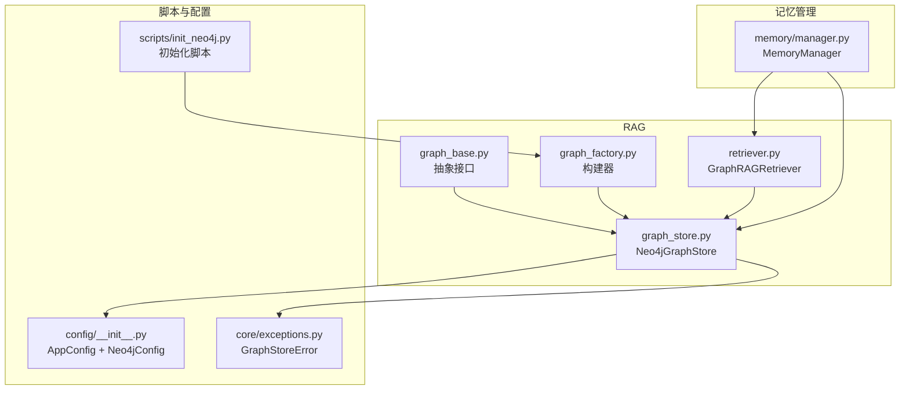
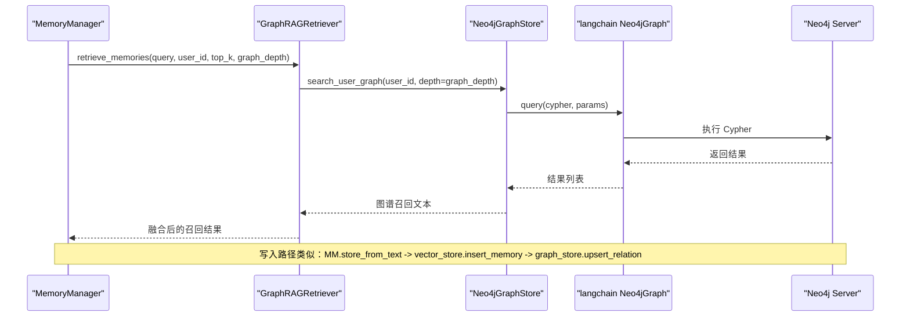
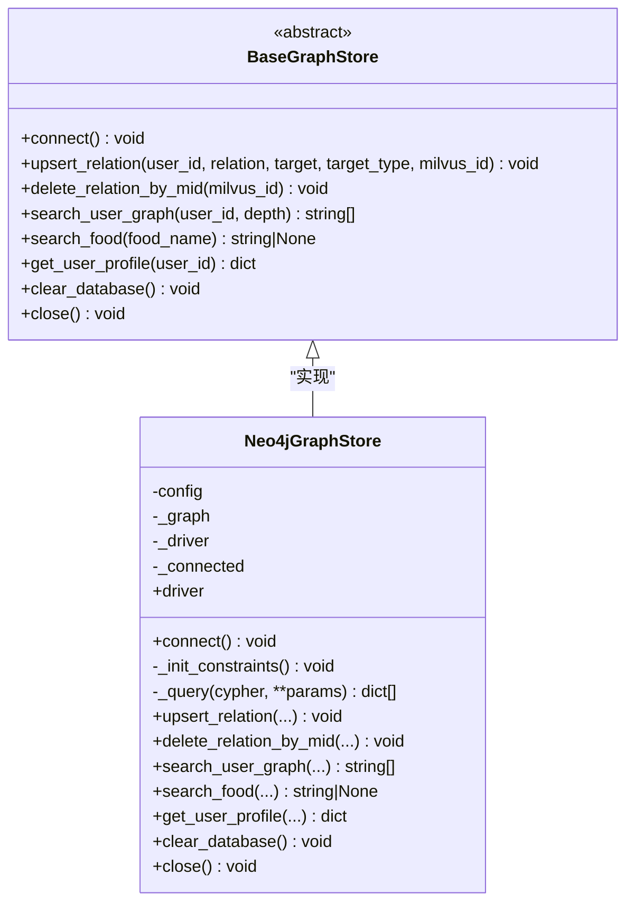
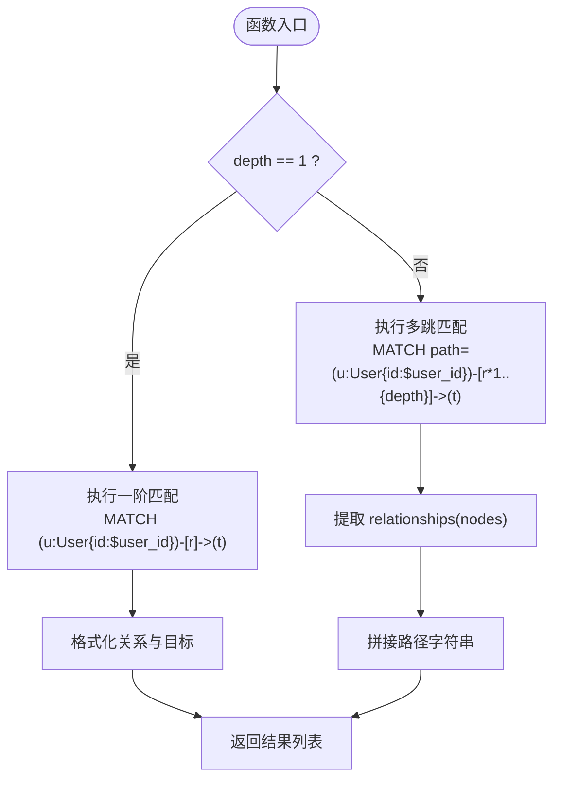
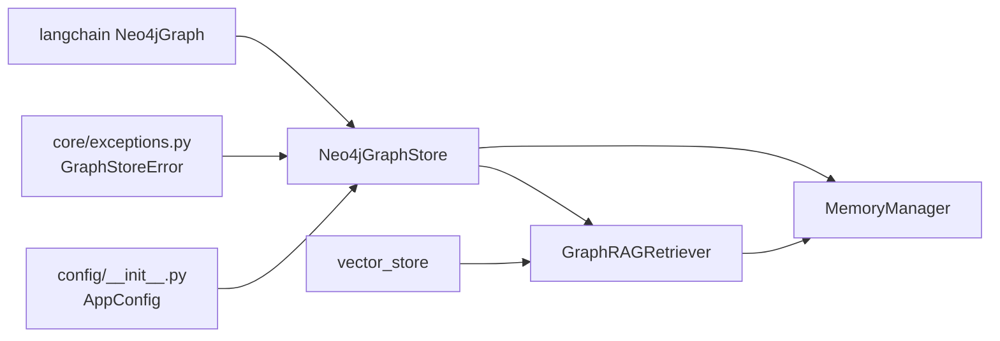

# 图数据库存储

<cite>
**本文引用的文件**   
- [graph_store.py](file://backend_design/nexus/rag/graph_store.py)
- [graph_base.py](file://backend_design/nexus/rag/graph_base.py)
- [graph_factory.py](file://backend_design/nexus/rag/graph_factory.py)
- [retriever.py](file://backend_design/nexus/rag/retriever.py)
- [manager.py](file://backend_design/nexus/memory/manager.py)
- [init_neo4j.py](file://backend_design/scripts/init_neo4j.py)
- [exceptions.py](file://backend_design/nexus/core/exceptions.py)
- [__init__.py](file://backend_design/nexus/config/__init__.py)
</cite>

## 目录
1. [简介](#简介)
2. [项目结构](#项目结构)
3. [核心组件](#核心组件)
4. [架构总览](#架构总览)
5. [详细组件分析](#详细组件分析)
6. [依赖关系分析](#依赖关系分析)
7. [性能考量与优化](#性能考量与优化)
8. [故障排查指南](#故障排查指南)
9. [结论](#结论)
10. [附录](#附录)

## 简介
本技术文档聚焦于图数据库存储层，围绕 Neo4jGraphStore 的实现架构、Cypher 查询优化策略、用户图谱搜索、食材关系查询与深度遍历算法展开。文档同时覆盖图节点建模、关系定义与索引策略，深入解析 graph_depth 参数对查询性能的影响与路径剪枝优化思路，并给出图数据导入、增量更新与一致性保证的实施方案。最后提供扩展新查询方法与自定义关系类型的指导，以及连接池配置、事务管理与错误恢复的最佳实践。

## 项目结构
图存储相关代码位于 backend_design/nexus/rag 与 backend_design/nexus/memory 两个模块中：
- rag/graph_store.py：Neo4jGraphStore 实现，封装连接、约束初始化、Cypher 执行、关系增删查、画像获取等。
- rag/graph_base.py：BaseGraphStore 抽象接口，统一图谱存储能力契约。
- rag/graph_factory.py：构建器，固定返回本地 Neo4j 实例。
- rag/retriever.py：GraphRAGRetriever 三路融合检索（向量+图谱+BM25），调用图谱进行关系召回。
- memory/manager.py：MemoryManager 协调记忆写入与检索，包含双向写入一致性与回滚补偿。
- scripts/init_neo4j.py：初始化脚本，创建约束与索引。
- core/exceptions.py：异常体系，含 GraphStoreError。
- config/__init__.py：全局配置聚合，包含 Neo4jConfig。

图表来源
- [graph_base.py:17-61](file://backend_design/nexus/rag/graph_base.py#L17-L61)
- [graph_store.py:26-184](file://backend_design/nexus/rag/graph_store.py#L26-L184)
- [graph_factory.py:20-28](file://backend_design/nexus/rag/graph_factory.py#L20-L28)
- [retriever.py:48-189](file://backend_design/nexus/rag/retriever.py#L48-L189)
- [manager.py:38-100](file://backend_design/nexus/memory/manager.py#L38-L100)
- [init_neo4j.py:18-39](file://backend_design/scripts/init_neo4j.py#L18-L39)
- [__init__.py:84-132](file://backend_design/nexus/config/__init__.py#L84-L132)
- [exceptions.py:63-67](file://backend_design/nexus/core/exceptions.py#L63-L67)

章节来源
- [graph_store.py:26-184](file://backend_design/nexus/rag/graph_store.py#L26-L184)
- [graph_base.py:17-61](file://backend_design/nexus/rag/graph_base.py#L17-L61)
- [graph_factory.py:20-28](file://backend_design/nexus/rag/graph_factory.py#L20-L28)
- [retriever.py:48-189](file://backend_design/nexus/rag/retriever.py#L48-L189)
- [manager.py:38-100](file://backend_design/nexus/memory/manager.py#L38-L100)
- [init_neo4j.py:18-39](file://backend_design/scripts/init_neo4j.py#L18-L39)
- [__init__.py:84-132](file://backend_design/nexus/config/__init__.py#L84-L132)
- [exceptions.py:63-67](file://backend_design/nexus/core/exceptions.py#L63-L67)

## 核心组件
- BaseGraphStore：定义图谱存储的统一接口，包括 connect、upsert_relation、delete_relation_by_mid、search_user_graph、search_food、get_user_profile、clear_database、close。
- Neo4jGraphStore：基于 langchain_community.graphs.Neo4jGraph 的封装实现，负责连接、约束与索引初始化、Cypher 查询执行、关系增删、用户图谱搜索、食材匹配、画像获取、清库与关闭。
- GraphRAGRetriever：在检索流程中调用 Neo4jGraphStore.search_user_graph 进行图谱召回，并与向量、BM25 结果进行 RRF 融合。
- MemoryManager：在 store_from_text 中实现 Milvus 与 Neo4j 的双向写入与一致性补偿；在 recall 中通过 GraphRAGRetriever 调用图谱检索。
- 初始化脚本 init_neo4j.py：通过 build_graph_store 获取实例并调用 connect，确保约束与索引存在。
- 配置中心 AppConfig：集中管理 Neo4jConfig，供 Neo4jGraphStore.connect 使用。

章节来源
- [graph_base.py:17-61](file://backend_design/nexus/rag/graph_base.py#L17-L61)
- [graph_store.py:26-184](file://backend_design/nexus/rag/graph_store.py#L26-L184)
- [retriever.py:48-189](file://backend_design/nexus/rag/retriever.py#L48-L189)
- [manager.py:212-300](file://backend_design/nexus/memory/manager.py#L212-L300)
- [init_neo4j.py:18-39](file://backend_design/scripts/init_neo4j.py#L18-L39)
- [__init__.py:84-132](file://backend_design/nexus/config/__init__.py#L84-L132)

## 架构总览
下图展示从上层调用到 Neo4j 的端到端流程：MemoryManager 发起记忆写入或检索，GraphRAGRetriever 调用 Neo4jGraphStore 执行 Cypher，最终由底层 Neo4jGraph（langchain）驱动连接池与事务。

图表来源
- [retriever.py:128-149](file://backend_design/nexus/rag/retriever.py#L128-L149)
- [graph_store.py:69-132](file://backend_design/nexus/rag/graph_store.py#L69-L132)
- [manager.py:212-300](file://backend_design/nexus/memory/manager.py#L212-L300)

## 详细组件分析

### Neo4jGraphStore 类结构与职责
- 连接与生命周期：connect 幂等建立连接，缓存 _graph 与 _driver；close 释放 driver。
- 约束与索引：_init_constraints 创建 User.id 唯一约束与 Entity.name 索引，提升查询性能。
- Cypher 执行：_query 封装 Neo4jGraph.query，统一参数化执行。
- 关系操作：upsert_relation 使用 MERGE 插入/更新关系并绑定 milvus_id；delete_relation_by_mid 按 mid 删除关系。
- 图谱搜索：search_user_graph 支持 depth=1 的一阶关系与 depth>1 的多跳路径；返回字符串化路径用于召回。
- 食材搜索：search_food 精确匹配 Food.name。
- 画像获取：get_user_profile 聚合用户出边关系及目标标签与 mid。
- 清库：clear_database 仅开发环境使用，DETACH DELETE 所有节点并清理索引与约束。

图表来源
- [graph_base.py:17-61](file://backend_design/nexus/rag/graph_base.py#L17-L61)
- [graph_store.py:26-184](file://backend_design/nexus/rag/graph_store.py#L26-L184)

章节来源
- [graph_store.py:26-184](file://backend_design/nexus/rag/graph_store.py#L26-L184)
- [graph_base.py:17-61](file://backend_design/nexus/rag/graph_base.py#L17-L61)

### 用户图谱搜索与深度遍历算法
- 一阶搜索（depth=1）：直接匹配 (u:User{id:$user_id})-[r]->(t)，返回关系类型、目标名称与标签。
- 多跳搜索（depth>1）：使用 MATCH path = (u:User{id:$user_id})-[r*1..{depth}]->(t)，提取 relationships(path) 与 nodes(path)，拼接为可读路径字符串。
- 复杂度与风险：当 depth 较大时，路径组合呈指数增长，可能引发内存与延迟问题。建议限制最大 depth 并结合业务场景选择合理值。

图表来源
- [graph_store.py:102-132](file://backend_design/nexus/rag/graph_store.py#L102-L132)

章节来源
- [graph_store.py:102-132](file://backend_design/nexus/rag/graph_store.py#L102-L132)

### 食材关系查询
- 精确匹配：MATCH (f:Food{name:$name}) RETURN f.name LIMIT 1。
- 融合召回：GraphRAGRetriever.retrieve_food 将向量检索结果与图谱精确匹配合并，优先插入图谱命中项。

章节来源
- [graph_store.py:134-144](file://backend_design/nexus/rag/graph_store.py#L134-L144)
- [retriever.py:142-148](file://backend_design/nexus/rag/retriever.py#L142-L148)

### 图节点建模、关系定义与索引策略
- 节点模型：
  - User：主键 id（唯一约束）。
  - Entity：通用实体，name 字段建索引。
  - Food：具体实体类型，name 字段参与精确匹配。
- 关系定义：
  - 动态关系类型：relation.upper() 作为关系名（如 LIKES、LIKED_BY 等）。
  - 属性：r.mid（关联 Milvus ID）、r.timestamp（时间戳）。
- 索引策略：
  - User.id 唯一约束，保障用户身份唯一性。
  - Entity.name 普通索引，加速名称匹配。
  - 建议在 Food.name 上建立独立索引以提升食材搜索性能（若查询频繁且数据量大）。

章节来源
- [graph_store.py:60-68](file://backend_design/nexus/rag/graph_store.py#L60-L68)
- [graph_store.py:73-89](file://backend_design/nexus/rag/graph_store.py#L73-L89)
- [graph_store.py:134-144](file://backend_design/nexus/rag/graph_store.py#L134-L144)

### 连接池配置、事务管理与错误恢复
- 连接池：Neo4jGraphStore 使用 langchain_community.graphs.Neo4jGraph，内部维护连接池与自动重连；可通过环境变量或配置文件设置 URI、用户名、密码。
- 事务管理：当前实现以单次 query 为主，未显式开启事务块；如需批量写入或强一致，可在上层封装事务边界。
- 错误恢复：
  - 连接失败抛出 GraphStoreError。
  - 写入失败记录日志并抛出异常，便于上层重试或降级。
  - MemoryManager 在双向写入时实现补偿回滚：若 Neo4j 写入失败则删除已写入的 Milvus 记录，保证一致性。

章节来源
- [graph_store.py:40-58](file://backend_design/nexus/rag/graph_store.py#L40-L58)
- [graph_store.py:84-89](file://backend_design/nexus/rag/graph_store.py#L84-L89)
- [manager.py:278-296](file://backend_design/nexus/memory/manager.py#L278-L296)
- [exceptions.py:63-67](file://backend_design/nexus/core/exceptions.py#L63-L67)

### 图数据导入、增量更新与一致性保证
- 导入与初始化：运行 init_neo4j.py 创建约束与索引；应用启动时 Neo4jGraphStore.connect 会再次确保约束存在。
- 增量更新：
  - upsert_relation 使用 MERGE 实现幂等更新，避免重复插入。
  - delete_relation_by_mid 通过 mid 精准删除关系，保持与向量库的一致性。
- 一致性保证：
  - MemoryManager.store_from_text 先写 Milvus，再写 Neo4j；若 Neo4j 失败则回滚 Milvus 记录。
  - 冲突检测与裁决：根据现有记忆与新事实决定 IGNORE/DELETE/NONE，必要时联动删除旧记录。

章节来源
- [init_neo4j.py:18-39](file://backend_design/scripts/init_neo4j.py#L18-L39)
- [graph_store.py:73-89](file://backend_design/nexus/rag/graph_store.py#L73-L89)
- [manager.py:212-300](file://backend_design/nexus/memory/manager.py#L212-L300)

### 扩展新的图查询方法与自定义关系类型
- 新增查询方法：
  - 在 Neo4jGraphStore 中添加新方法，封装 Cypher 查询与参数处理。
  - 在 GraphRAGRetriever 中集成新方法的召回逻辑，参与 RRF 融合。
- 自定义关系类型：
  - 在 upsert_relation 中传入 relation.upper() 即可动态生成关系名。
  - 建议在 _init_constraints 中按需添加特定关系的属性索引（如 r.type 或 r.weight）。
- 示例步骤：
  - 定义新 Cypher 模板与参数映射。
  - 增加单元测试验证正确性与性能。
  - 在 retriever 中调整 k 与融合权重以获得最佳召回效果。

章节来源
- [graph_store.py:73-89](file://backend_design/nexus/rag/graph_store.py#L73-L89)
- [retriever.py:128-149](file://backend_design/nexus/rag/retriever.py#L128-L149)

## 依赖关系分析
- Neo4jGraphStore 依赖：
  - config.get_config().neo4j：连接参数。
  - langchain_community.graphs.Neo4jGraph：底层驱动与连接池。
  - exceptions.GraphStoreError：错误上报。
- GraphRAGRetriever 依赖：
  - Neo4jGraphStore：图谱召回。
  - vector_store：向量召回。
  - reranker：重排。
- MemoryManager 依赖：
  - Neo4jGraphStore：关系写入与删除。
  - vector_store：向量写入与删除。
  - GraphRAGRetriever：三路融合检索。

图表来源
- [__init__.py:84-132](file://backend_design/nexus/config/__init__.py#L84-L132)
- [exceptions.py:63-67](file://backend_design/nexus/core/exceptions.py#L63-L67)
- [graph_store.py:26-184](file://backend_design/nexus/rag/graph_store.py#L26-L184)
- [retriever.py:48-189](file://backend_design/nexus/rag/retriever.py#L48-L189)
- [manager.py:38-100](file://backend_design/nexus/memory/manager.py#L38-L100)

章节来源
- [graph_store.py:26-184](file://backend_design/nexus/rag/graph_store.py#L26-L184)
- [retriever.py:48-189](file://backend_design/nexus/rag/retriever.py#L48-L189)
- [manager.py:38-100](file://backend_design/nexus/memory/manager.py#L38-L100)
- [__init__.py:84-132](file://backend_design/nexus/config/__init__.py#L84-L132)
- [exceptions.py:63-67](file://backend_design/nexus/core/exceptions.py#L63-L67)

## 性能考量与优化
- graph_depth 影响：
  - depth=1：单跳匹配，低延迟高吞吐。
  - depth>1：路径组合爆炸，需限制最大 depth（如 2~3），并结合业务阈值控制。
- 索引优化：
  - User.id 唯一约束与 Entity.name 索引已存在；建议为 Food.name 单独建索引。
  - 对高频关系属性（如 r.mid、r.timestamp）可考虑复合索引。
- 查询优化：
  - 使用参数化查询避免注入与编译开销。
  - 限制返回数量（LIMIT）与投影字段，减少网络传输。
- 连接池与并发：
  - 依赖 langchain Neo4jGraph 的连接池；在高并发场景下监控连接数与超时。
- 路径剪枝：
  - 在 Cypher 中加入 WHERE 条件过滤无效路径（如关系类型限定、节点属性过滤）。
  - 使用 shortestPath 或 limit 控制结果规模。

章节来源
- [graph_store.py:60-68](file://backend_design/nexus/rag/graph_store.py#L60-L68)
- [graph_store.py:102-132](file://backend_design/nexus/rag/graph_store.py#L102-L132)
- [retriever.py:128-149](file://backend_design/nexus/rag/retriever.py#L128-L149)

## 故障排查指南
- 连接失败：
  - 检查 Neo4j 服务状态与配置（URI、用户名、密码）。
  - 查看日志中的连接失败信息与异常堆栈。
- 查询失败：
  - 确认约束与索引是否存在（运行 init_neo4j.py）。
  - 检查 Cypher 语法与参数映射是否正确。
- 写入不一致：
  - 观察 MemoryManager 的回滚日志，确认是否触发补偿删除。
  - 核对 Milvus 与 Neo4j 的 mid 对应关系。
- 性能问题：
  - 降低 graph_depth，增加索引，限制返回数量。
  - 监控连接池与慢查询。

章节来源
- [graph_store.py:40-58](file://backend_design/nexus/rag/graph_store.py#L40-L58)
- [graph_store.py:84-89](file://backend_design/nexus/rag/graph_store.py#L84-L89)
- [manager.py:278-296](file://backend_design/nexus/memory/manager.py#L278-L296)
- [init_neo4j.py:18-39](file://backend_design/scripts/init_neo4j.py#L18-L39)

## 结论
Neo4jGraphStore 通过简洁的接口与稳健的错误处理，为上层记忆管理与检索提供了可靠的图谱能力。结合 GraphRAGRetriever 的三路融合与 MemoryManager 的一致性补偿，系统在召回质量与数据一致性方面表现良好。在生产环境中，应重点关注 graph_depth 的性能影响、索引策略与连接池配置，并通过路径剪枝与查询优化进一步提升效率。

## 附录
- 最佳实践清单：
  - 始终使用参数化 Cypher 查询。
  - 为高频匹配字段建立索引。
  - 限制 graph_depth 与返回数量。
  - 在双向写入中实现补偿回滚。
  - 定期运行初始化脚本确保约束与索引存在。
- 扩展指引：
  - 在 Neo4jGraphStore 新增查询方法并在 retriever 中集成。
  - 自定义关系类型时注意命名规范与属性设计。
  - 为新查询编写单元测试与性能基准。